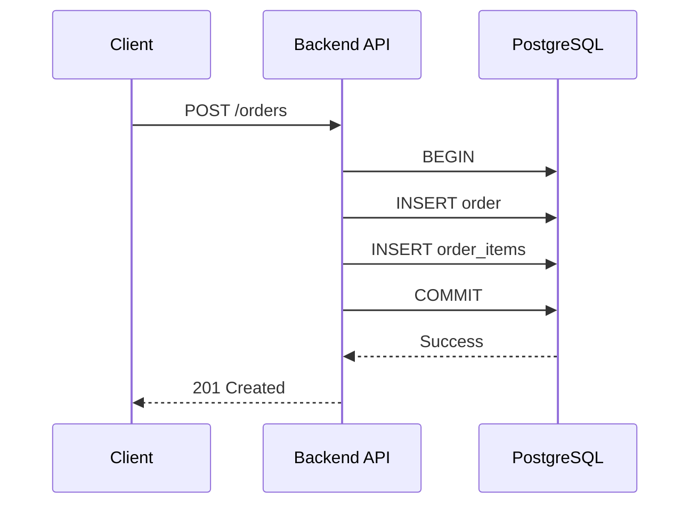
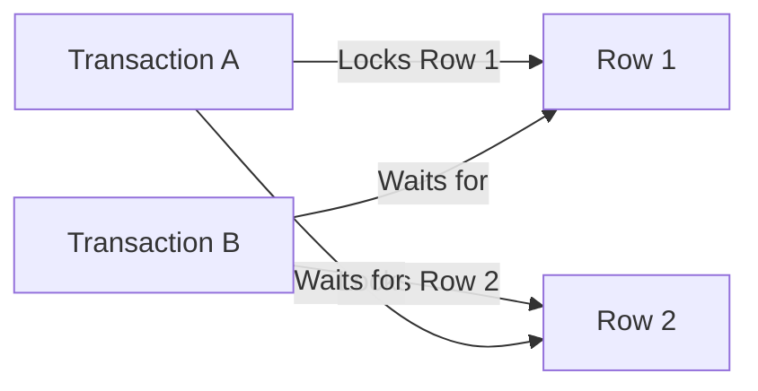
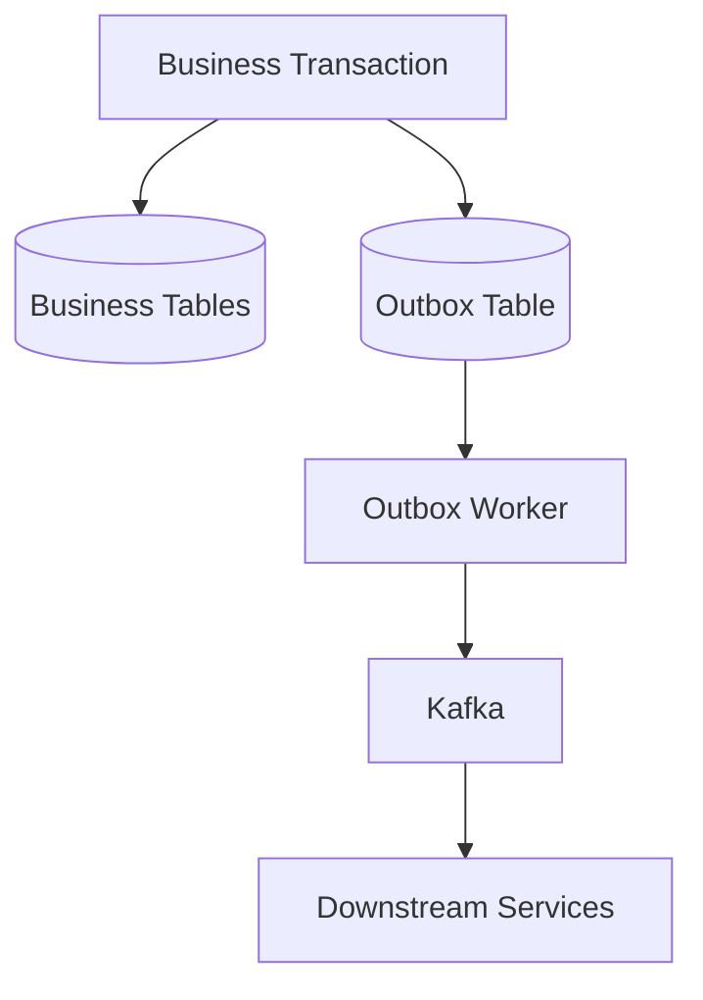

# 02- DML

## Overview

**Data Manipulation Language (DML)** is the SQL command category used to create, modify, and remove rows stored in database tables.

The core DML operations are:

| Command | Purpose |
|---|---|
| `INSERT` | Add rows |
| `UPDATE` | Modify existing rows |
| `DELETE` | Remove rows |
| `MERGE` | Conditionally insert/update/delete rows; support varies by database |

DML operates on **data**, while DDL operates primarily on **database structure**.

```text
DDL
 ↓
Defines tables, constraints, indexes, schemas
 ↓
DML
 ↓
Creates and modifies rows
 ↓
Transactions
 ↓
Controls atomicity and consistency
```

For backend engineers, DML is where application behavior becomes persistent database state. Correct DML therefore requires understanding transactions, constraints, concurrency, indexes, query plans, locking, isolation, idempotency, and failure handling.

---

## DML in a Backend Request

A typical API request can result in one or more DML statements:



The important point is that DML is rarely an isolated SQL statement in production.

A business operation may require several statements to succeed or fail together.

---

## INSERT

`INSERT` adds new rows to a table.

### Basic INSERT

```sql
INSERT INTO customers (
    email,
    display_name
)
VALUES (
    'alice@example.com',
    'Alice'
);
```

For production code, explicitly naming columns is preferable to relying on table column order.

### Insert Multiple Rows

```sql
INSERT INTO products (
    sku,
    name,
    price
)
VALUES
    ('SKU-1001', 'Keyboard', 79.99),
    ('SKU-1002', 'Mouse', 39.99),
    ('SKU-1003', 'Monitor', 299.99);
```

Batch inserts reduce network round trips compared with issuing many individual statements.

### Insert from a Query

DML can also populate one table from another:

```sql
INSERT INTO customer_archive (
    customer_id,
    email,
    archived_at
)
SELECT
    id,
    email,
    CURRENT_TIMESTAMP
FROM customers
WHERE deleted_at IS NOT NULL;
```

This is useful for data migration and server-side data movement because the database can perform the operation without transferring every row through the application.

---

## INSERT and Generated Keys

Production tables commonly use database-generated identifiers.

```sql
INSERT INTO customers (
    email,
    display_name
)
VALUES (
    'alice@example.com',
    'Alice'
)
RETURNING id;
```

PostgreSQL's `RETURNING` clause allows the application to obtain generated values without issuing a second query.

For example, a Python database driver can conceptually perform:

```python
cursor.execute(
    """
    INSERT INTO customers (email, display_name)
    VALUES (%s, %s)
    RETURNING id
    """,
    ("alice@example.com", "Alice"),
)

customer_id = cursor.fetchone()[0]
```

Always use parameterized queries. Do not construct SQL by interpolating user input.

---

## INSERT and Constraints

`INSERT` must satisfy the table's constraints.

Consider:

```sql
CREATE TABLE users (
    id BIGINT GENERATED ALWAYS AS IDENTITY PRIMARY KEY,
    email TEXT NOT NULL UNIQUE
);
```

This statement succeeds:

```sql
INSERT INTO users (email)
VALUES ('alice@example.com');
```

A duplicate insert fails:

```sql
INSERT INTO users (email)
VALUES ('alice@example.com');
```

The `UNIQUE` constraint is important because an application-level check such as:

```text
SELECT → Does email exist?
INSERT → Create user
```

is vulnerable to a race:

```text
Request A: email does not exist
Request B: email does not exist
Request A: INSERT succeeds
Request B: INSERT succeeds
```

The database constraint provides the authoritative guarantee.

---

## INSERT and Idempotency

Distributed systems frequently retry requests.

For example:

```text
Client
  ↓
API
  ↓
Database
  ↓
Response lost
  ↓
Client retries
  ↓
API
```

If the original `INSERT` committed but the response was lost, blindly inserting again may create a duplicate business operation.

A common solution is an idempotency key protected by a uniqueness constraint:

```sql
CREATE TABLE payments (
    id BIGINT GENERATED ALWAYS AS IDENTITY PRIMARY KEY,
    idempotency_key TEXT NOT NULL UNIQUE,
    amount NUMERIC(12, 2) NOT NULL,
    created_at TIMESTAMPTZ NOT NULL DEFAULT CURRENT_TIMESTAMP
);
```

The database constraint becomes part of the reliability mechanism.

---

## UPDATE

`UPDATE` modifies existing rows.

```sql
UPDATE customers
SET display_name = 'Alice Smith'
WHERE id = 42;
```

The `WHERE` clause is critical.

Without it:

```sql
UPDATE customers
SET display_name = 'Alice Smith';
```

every row may be modified.

This is one of the highest-risk mistakes when executing DML manually.

---

## UPDATE Multiple Columns

```sql
UPDATE customers
SET
    display_name = 'Alice Smith',
    updated_at = CURRENT_TIMESTAMP
WHERE id = 42;
```

Keeping related changes within the same statement can simplify correctness and reduce unnecessary database round trips.

---

## UPDATE Based on Current State

DML should often express state transitions atomically.

Instead of:

```text
SELECT stock
↓
Application calculates stock - 1
↓
UPDATE stock
```

use:

```sql
UPDATE products
SET stock_quantity = stock_quantity - 1
WHERE id = 1001
  AND stock_quantity > 0;
```

The database evaluates the condition and performs the modification atomically for the row.

The application can then inspect the affected-row count:

```text
1 row affected → reservation succeeded
0 rows affected → product unavailable
```

This avoids a common check-then-act race.

---

## UPDATE with RETURNING

PostgreSQL supports:

```sql
UPDATE orders
SET status = 'paid',
    updated_at = CURRENT_TIMESTAMP
WHERE id = 123
  AND status = 'pending'
RETURNING id, status, updated_at;
```

This can combine:

```text
State validation
+
Mutation
+
Result retrieval
```

into one database operation.

This pattern is useful for atomic state transitions.

---

## DELETE

`DELETE` removes rows.

```sql
DELETE FROM sessions
WHERE expires_at < CURRENT_TIMESTAMP;
```

Always verify the predicate carefully.

Before executing destructive DML manually, a useful workflow is:

```sql
SELECT id
FROM sessions
WHERE expires_at < CURRENT_TIMESTAMP;
```

Then execute the corresponding `DELETE` once the target set is verified.

---

## Soft Delete vs Hard Delete

Backend systems frequently distinguish between logical deletion and physical deletion.

### Hard Delete

```sql
DELETE FROM customers
WHERE id = 42;
```

The row is physically removed.

### Soft Delete

```sql
UPDATE customers
SET deleted_at = CURRENT_TIMESTAMP
WHERE id = 42;
```

The row remains available for historical or recovery purposes.

| Approach | Advantages | Limitations |
|---|---|---|
| Hard delete | Simple, less storage | Data is difficult to recover |
| Soft delete | Preserves history, easier recovery | Queries must consistently exclude deleted rows |
| Archive | Keeps operational tables smaller | More operational complexity |

Soft deletion is not automatically better. It changes query semantics and can introduce uniqueness, indexing, retention, and privacy considerations.

---

## DML and Transactions

A business operation often requires multiple DML statements to be atomic.

Consider an order:

```text
Create order
   +
Create order items
   +
Reserve inventory
```

These operations may need a single transaction.

```sql
BEGIN;

INSERT INTO orders (
    customer_id,
    status
)
VALUES (
    42,
    'pending'
)
RETURNING id;

-- Use the returned order ID for order_items.

UPDATE products
SET stock_quantity = stock_quantity - 1
WHERE id = 1001
  AND stock_quantity > 0;

COMMIT;
```

If a required operation fails:

```sql
ROLLBACK;
```

the transaction can restore the database to its previous state, subject to the database's transaction semantics.

---

## Transaction Boundaries

A transaction should represent a unit of work that must be atomic.

Good boundary:

```text
BEGIN
  ↓
Validate and mutate related database state
  ↓
COMMIT
```

Risky boundary:

```text
BEGIN
  ↓
Database mutation
  ↓
External HTTP request
  ↓
Wait for response
  ↓
Background processing
  ↓
COMMIT
```

Holding a transaction open while waiting on external systems can increase:

- Lock duration
- Connection usage
- Contention
- Transaction age
- Resource consumption

For workflows involving external systems, consider patterns such as:

- Transactional outbox
- Idempotent consumers
- Retry-safe operations
- State machines
- Background processing

---

## UPDATE and DELETE with Concurrency

DML interacts directly with database locking.

Consider two workers trying to claim the same task.

A common PostgreSQL pattern is:

```sql
SELECT id
FROM jobs
WHERE status = 'pending'
ORDER BY created_at
FOR UPDATE SKIP LOCKED
LIMIT 1;
```

The selected row can then be updated within the same transaction.

This is useful for queue-like workloads where multiple workers need to process different rows concurrently.

The exact locking strategy should be based on the workload and database engine.

---

## DML and Isolation

Concurrent transactions can observe and modify data according to the database's transaction isolation rules.

Common isolation levels include:

| Isolation Level | Main Concern |
|---|---|
| Read Uncommitted | Weak consistency; behavior varies by engine |
| Read Committed | Common default in many systems |
| Repeatable Read | Stronger statement/transaction visibility |
| Serializable | Strongest standard isolation; may require retries |

The appropriate level depends on business requirements.

Do not automatically choose `SERIALIZABLE` for every operation. Stronger isolation can increase contention and transaction failures.

Likewise, relying on application-level assumptions without understanding isolation can create subtle concurrency bugs.

---

## DML and Optimistic Concurrency

A common approach is to include a version or timestamp in the update predicate.

Example:

```sql
UPDATE accounts
SET
    balance = 1500,
    version = version + 1
WHERE id = 42
  AND version = 7;
```

Interpretation:

```text
1 row affected
    ↓
Update succeeded

0 rows affected
    ↓
Another transaction changed the record
```

The application can then retry or report a conflict.

This is useful when pessimistic locking would unnecessarily reduce concurrency.

---

## DML Performance

DML performance depends on more than the SQL statement itself.

Important factors include:

```text
Query plan
+
Indexes
+
Rows affected
+
Row width
+
Lock contention
+
Transaction size
+
Network round trips
+
WAL / logging
+
Storage I/O
+
Replication
```

For example:

```sql
UPDATE orders
SET status = 'expired'
WHERE created_at < CURRENT_TIMESTAMP - INTERVAL '90 days'
  AND status = 'pending';
```

On a large table, this may touch millions of rows.

Potential consequences include:

- High write I/O
- Large transaction size
- Increased WAL
- Lock contention
- Replication lag
- Longer recovery time

Large maintenance operations should often be performed in controlled batches.

---

## Batch DML

Instead of modifying millions of rows in one transaction:

```text
UPDATE 50,000,000 rows
```

a production process may use smaller batches:

```text
UPDATE 5,000
COMMIT

UPDATE 5,000
COMMIT

UPDATE 5,000
COMMIT

...
```

The exact batch size should be determined through measurement.

Benefits include:

- Smaller transactions
- Lower rollback cost
- Reduced lock duration
- Better operational control
- Easier progress tracking

However, batching changes transactional semantics. If all rows must change atomically, independent commits may not be acceptable.

---

## DML and Indexes

Indexes accelerate finding rows but also make writes more expensive.

For:

```sql
UPDATE orders
SET status = 'cancelled'
WHERE customer_id = 42;
```

an index on:

```sql
(customer_id)
```

may help locate target rows.

But every relevant index may also need maintenance when indexed values change.

The general trade-off is:

```text
More indexes
    ↓
Faster selected reads
    +
More storage
    +
More write work
```

Indexes should therefore be designed around actual workload rather than added automatically.

---

## DML and Query Plans

Use query plans to investigate expensive DML.

For PostgreSQL:

```sql
EXPLAIN
UPDATE orders
SET status = 'cancelled'
WHERE customer_id = 42;
```

For controlled performance testing:

```sql
EXPLAIN (ANALYZE, BUFFERS)
UPDATE orders
SET status = 'cancelled'
WHERE customer_id = 42;
```

`EXPLAIN ANALYZE` actually executes the statement, so it should be used carefully with production data.

For destructive statements, first inspect the equivalent target set with a `SELECT`.

---

## DML from Python

Use parameterized SQL when executing DML from Python.

```python
cursor.execute(
    """
    UPDATE customers
    SET display_name = %s,
        updated_at = CURRENT_TIMESTAMP
    WHERE id = %s
    """,
    ("Alice Smith", 42),
)
```

Never build SQL using string concatenation:

```python
# Do not do this.
query = f"UPDATE customers SET display_name = '{name}' WHERE id = {customer_id}"
```

Parameterization protects against SQL injection and allows the database driver to handle values correctly.

---

## DML Through Django

Django's ORM generates DML for model operations.

For example:

```python
customer.email = "alice@example.com"
customer.save(update_fields=["email"])
```

generates an `UPDATE` operation.

For bulk updates:

```python
Customer.objects.filter(
    is_active=False,
).update(
    deleted_at=timezone.now(),
)
```

Bulk operations can be significantly more efficient than loading every model instance and calling `save()` individually.

However, bulk ORM operations may bypass per-instance application behavior such as model `save()` overrides and certain signals. The exact behavior should be understood before replacing instance-level operations with bulk DML.

---

## DML Through FastAPI and SQLAlchemy

A FastAPI service may use SQLAlchemy to issue parameterized DML.

Conceptually:

```python
stmt = (
    update(Customer)
    .where(Customer.id == customer_id)
    .values(display_name=display_name)
)

result = session.execute(stmt)
```

The important engineering concerns remain the same:

```text
Transaction boundary
+
Affected-row validation
+
Constraints
+
Concurrency
+
Error handling
+
Performance
```

The ORM or query builder changes the interface, not the underlying database semantics.

---

## DML Error Handling

DML can fail because of:

- Unique constraints
- Foreign-key constraints
- Check constraints
- Not-null constraints
- Deadlocks
- Serialization failures
- Lock timeouts
- Connection failures
- Statement timeouts
- Resource exhaustion

Production code should distinguish retryable failures from permanent failures.

For example:

```text
Unique violation
    ↓
Usually application/business conflict

Deadlock
    ↓
Potentially retryable

Serialization failure
    ↓
Potentially retryable

Foreign-key violation
    ↓
Usually data/state problem

Syntax error
    ↓
Application/deployment defect
```

Do not blindly retry every database exception.

---

## DML and Deadlocks

Two transactions can acquire locks in different orders:

```text
Transaction A:
lock row 1
↓
wait for row 2

Transaction B:
lock row 2
↓
wait for row 1
```

This forms a deadlock.



Databases can detect deadlocks and abort one transaction.

Applications should:

- Keep transactions short.
- Access resources in a consistent order.
- Avoid unnecessary locks.
- Retry appropriate deadlock failures with bounded backoff.

---

## DML and Replication

In a primary/replica architecture:

```text
Application
    ↓
Primary
    ↓
WAL / Replication
    ↓
Read Replicas
```

DML on the primary can generate replication traffic.

Large write operations can therefore cause:

```text
Large UPDATE
    ↓
High WAL generation
    ↓
Replica lag
    ↓
Stale replica reads
```

This matters when a backend routes read traffic to replicas.

After a write, an immediate read from a lagging replica may not observe the new state.

Applications requiring read-after-write consistency may need to read from the primary or use an appropriate consistency strategy.

---

## DML and Distributed Systems

DML is often only one part of a larger distributed operation.

Consider:

```text
Database transaction
        +
Kafka event
        +
External payment service
```

A naive workflow:

```text
INSERT database row
↓
Publish Kafka event
↓
Commit
```

can fail if the process crashes between operations.

A common solution is the transactional outbox pattern:



The database transaction atomically stores both:

```text
Business state
+
Event to publish
```

A worker then publishes the event and marks the outbox record as processed.

This demonstrates why production DML design extends beyond individual SQL statements.

---

## Security Considerations

DML must be protected against unauthorized modification and SQL injection.

### Parameterize Values

Use:

```sql
UPDATE users
SET display_name = $1
WHERE id = $2;
```

rather than constructing SQL strings from untrusted values.

### Least Privilege

Application database roles should have only the permissions required for runtime behavior.

For example:

```text
Runtime role
    ↓
SELECT / INSERT / UPDATE / DELETE

Migration role
    ↓
DDL permissions
```

Separating runtime DML permissions from schema-management permissions reduces the blast radius of compromised credentials.

### Validate Authorization

Database access control and application authorization solve different problems.

A valid SQL statement does not imply the caller is allowed to modify that row.

The application must still enforce rules such as:

```text
User A may update only their organization's records.
```

---

## Production Best Practices

### Make Mutations Explicit

Prefer:

```sql
UPDATE orders
SET status = 'cancelled'
WHERE id = $1
  AND status IN ('pending', 'processing');
```

over blindly updating the row and assuming the state is valid.

The predicate becomes part of the state-transition invariant.

### Check Affected Rows

If an operation is expected to modify exactly one row:

```text
0 rows → unexpected state
1 row  → success
>1 rows → query/schema problem
```

The application should decide how to handle each case.

### Keep Transactions Small

Avoid unnecessary work inside transactions.

### Prefer Set-Based Operations

Prefer:

```sql
UPDATE products
SET active = FALSE
WHERE last_seen_at < CURRENT_TIMESTAMP - INTERVAL '1 year';
```

over fetching rows into Python and updating them one by one when set-based semantics are appropriate.

### Make Retries Safe

Retries should account for:

- Unique constraints
- Idempotency keys
- Transaction rollback
- Deadlocks
- Serialization failures
- Network failures after commit

A retry mechanism without idempotency can duplicate business operations.

---

## Common Mistakes and Pitfalls

| Mistake | Problem | Better Approach |
|---|---|---|
| `UPDATE` without `WHERE` | Can modify every row | Always verify predicates |
| `DELETE` without `WHERE` | Can remove the entire table contents | Preview the target set |
| String interpolation in SQL | SQL injection risk | Parameterized queries |
| Check-then-insert | Race condition | Unique constraint + conflict handling |
| Check-then-update | Lost-update race | Atomic predicate or optimistic/pessimistic locking |
| Updating millions of rows in one transaction | Large locks, WAL, rollback cost | Batch when semantics allow |
| Too many indexes | Slower writes and more storage | Index based on workload |
| Holding transactions during HTTP calls | Lock and connection contention | Keep external work outside critical transactions |
| Blindly retrying all errors | Can duplicate operations or amplify failures | Retry only appropriate transient failures |
| Ignoring affected-row count | State transitions may silently fail | Validate expected cardinality |
| Using ORM bulk operations without understanding semantics | May bypass instance-level behavior | Know ORM-specific behavior |
| Reading immediately from replicas after a write | May observe stale state | Use appropriate consistency strategy |
| Treating `DELETE` and soft delete as interchangeable | Changes retention and query semantics | Choose based on domain requirements |

---

## Production DML Checklist

Before deploying or executing important DML, verify:

### Correctness

- Is the target table correct?
- Is the predicate correct?
- Can the statement affect more rows than expected?
- Are constraints sufficient?
- Is the desired state transition explicit?

### Transactions

- What operations must be atomic?
- Is the transaction boundary correct?
- Could the transaction remain open too long?
- What happens if an intermediate statement fails?

### Concurrency

- Can two workers modify the same rows?
- Could a check-then-act race occur?
- Is optimistic or pessimistic concurrency control required?
- Can a deadlock occur?

### Performance

- How many rows can be affected?
- Which indexes support the predicate?
- What does `EXPLAIN` show?
- Could the operation generate substantial WAL?
- Could it cause replication lag?

### Reliability

- Can the operation be safely retried?
- Is an idempotency mechanism required?
- Which errors are transient?
- What happens if the response is lost after commit?

### Security

- Are all values parameterized?
- Does the database role have appropriate permissions?
- Is application-level authorization enforced?

### Operations

- Can the operation run safely during peak traffic?
- Is it observable?
- Is there a rollback or recovery strategy?
- Has it been tested with production-scale data?

---

## Interview Traps

### DML Does Not Mean Only INSERT, UPDATE, and DELETE

Those are the fundamental row-modification commands, but SQL implementations also support constructs such as `MERGE`, and exact command classification can vary.

The important distinction is that DML operates primarily on stored data, while DDL defines database structure.

### `UPDATE` Is Not Automatically Atomic at the Business Level

A single SQL statement can be atomic according to transaction semantics, but a larger business operation involving multiple statements may require an explicit transaction.

### Application Validation Is Not Enough

This:

```text
SELECT
↓
if condition:
    INSERT
```

is not equivalent to a database-enforced invariant under concurrency.

Constraints and atomic SQL predicates are often required.

### More Indexes Do Not Always Improve DML

Indexes help locate rows but add maintenance work to writes.

### A Successful Commit Does Not Guarantee the Client Received the Response

This is a fundamental distributed-systems issue:

```text
Database COMMIT
       ↓
Network failure
       ↓
Client receives no response
       ↓
Client retries
```

Idempotency must therefore be designed into retryable business operations.

## Key Takeaways

- **DML changes persistent database state through operations such as `INSERT`, `UPDATE`, `DELETE`, and `MERGE`; production correctness depends on more than statement syntax.**
- **Use transactions, constraints, atomic predicates, and appropriate locking or optimistic concurrency control to make concurrent mutations safe.**
- **Parameterize all application-generated SQL and validate affected-row counts, especially for state transitions and destructive operations.**
- **Large DML operations can create lock contention, WAL pressure, replication lag, and operational risk; batch them when the business semantics allow it.**
- **Reliable DML must account for retries, idempotency, deadlocks, replica consistency, authorization, and distributed workflows rather than treating database writes as isolated operations.**