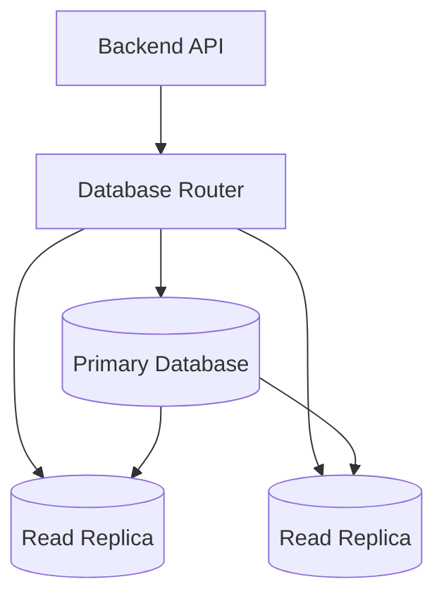

# 03- DQL

## Overview

**Data Query Language (DQL)** refers to SQL operations used to retrieve data from relational databases. The primary DQL operation is `SELECT`.

For backend systems, querying is not simply about retrieving the correct rows. Production-quality queries must also consider:

- Correctness and filtering semantics
- Joins and relationships
- Ordering and pagination
- Aggregation
- Index usage
- Query plans
- Concurrency and consistency
- Data volume
- Authorization boundaries
- Network and application overhead

A typical read path looks like:

```text
Client
  ↓
REST / gRPC API
  ↓
Application
  ↓
SQL SELECT
  ↓
Query Planner
  ↓
Indexes / Tables
  ↓
Result Set
  ↓
Application Serialization
  ↓
Client
```

The database should generally perform filtering, joining, aggregation, and other set-based operations rather than transferring large datasets to Python or another application layer for processing.

---

## SELECT

The basic form is:

```sql
SELECT column1, column2
FROM table_name;
```

Example:

```sql
SELECT
    id,
    email,
    created_at
FROM customers;
```

Explicitly selecting required columns is preferable to using `SELECT *` in production application queries because it:

- Makes the query contract explicit.
- Reduces unnecessary network transfer.
- Avoids fetching unused large columns.
- Makes application behavior less sensitive to schema changes.
- Can improve the usefulness of covering indexes in some workloads.

`SELECT *` is still useful for exploration, debugging, and ad-hoc analysis.

---

## Filtering with WHERE

`WHERE` restricts the rows returned by a query.

```sql
SELECT
    id,
    email,
    created_at
FROM customers
WHERE is_active = TRUE;
```

Multiple predicates can be combined:

```sql
SELECT
    id,
    email
FROM customers
WHERE is_active = TRUE
  AND created_at >= TIMESTAMP '2026-01-01 00:00:00';
```

### Common Operators

| Operator | Purpose |
|---|---|
| `=` | Equality |
| `<>` / `!=` | Not equal; support varies |
| `>` | Greater than |
| `<` | Less than |
| `>=` | Greater than or equal |
| `<=` | Less than or equal |
| `IN` | Match one of several values |
| `BETWEEN` | Range comparison |
| `LIKE` | Pattern matching |
| `IS NULL` | Test for `NULL` |
| `IS NOT NULL` | Test for non-`NULL` |

---

## NULL Semantics

`NULL` represents an unknown or missing value and requires special comparison semantics.

This is incorrect:

```sql
SELECT *
FROM customers
WHERE deleted_at = NULL;
```

Use:

```sql
SELECT *
FROM customers
WHERE deleted_at IS NULL;
```

SQL uses three-valued logic:

```text
TRUE
FALSE
UNKNOWN
```

A predicate evaluating to `UNKNOWN` is not returned by a normal `WHERE` filter.

This becomes important when combining nullable columns with `AND`, `OR`, `NOT`, and comparisons.

---

## IN

`IN` is useful when filtering against a known set.

```sql
SELECT
    id,
    status
FROM orders
WHERE status IN ('pending', 'processing', 'paid');
```

For application-generated queries, parameterize the values rather than constructing SQL strings manually.

The exact parameter syntax depends on the database driver.

---

## BETWEEN

`BETWEEN` performs an inclusive range comparison.

```sql
SELECT
    id,
    created_at
FROM orders
WHERE created_at BETWEEN
    TIMESTAMP '2026-01-01 00:00:00'
    AND TIMESTAMP '2026-02-01 00:00:00';
```

For timestamps, half-open ranges are often easier to reason about:

```sql
SELECT
    id,
    created_at
FROM orders
WHERE created_at >= TIMESTAMP '2026-01-01 00:00:00'
  AND created_at < TIMESTAMP '2026-02-01 00:00:00';
```

This avoids ambiguity around fractional seconds and makes adjacent time windows naturally composable.

---

## Pattern Matching

`LIKE` performs pattern matching.

```sql
SELECT
    id,
    email
FROM customers
WHERE email LIKE '%@example.com';
```

A leading wildcard such as:

```sql
LIKE '%example%'
```

can prevent a normal B-tree index from efficiently narrowing the search.

For PostgreSQL workloads requiring substring or full-text search, consider purpose-built indexing and search mechanisms rather than assuming a standard B-tree index will solve the problem.

---

## ORDER BY

`ORDER BY` determines result ordering.

```sql
SELECT
    id,
    created_at
FROM orders
ORDER BY created_at DESC;
```

If deterministic ordering matters, include a unique tie-breaker:

```sql
SELECT
    id,
    created_at
FROM orders
ORDER BY
    created_at DESC,
    id DESC;
```

This is particularly important for pagination. Ordering only by a non-unique column can produce unstable page boundaries when multiple rows have identical values.

---

## LIMIT

`LIMIT` restricts the number of returned rows.

```sql
SELECT
    id,
    email
FROM customers
ORDER BY id
LIMIT 100;
```

It is useful for:

- API responses
- Administrative queries
- Batch processing
- Sampling
- Pagination

However, `LIMIT` alone does not make a query efficient. The database may still need to scan and sort a large number of rows before returning the limited result.

---

## OFFSET Pagination

A common pagination pattern is:

```sql
SELECT
    id,
    created_at
FROM orders
ORDER BY created_at DESC, id DESC
LIMIT 50
OFFSET 1000;
```

It is simple but can become increasingly expensive for large offsets because the database may need to identify and discard earlier rows.

Conceptually:

```text
Page 1 → process first 50
Page 20 → process first 1000, return next 50
Page 2000 → process potentially many thousands of rows
```

Offset pagination is appropriate for many administrative interfaces and relatively small datasets, but it should not be assumed to scale indefinitely.

---

## Keyset Pagination

Keyset pagination uses the values from the previous page as the next boundary.

```sql
SELECT
    id,
    created_at
FROM orders
WHERE (created_at, id) < ($1, $2)
ORDER BY
    created_at DESC,
    id DESC
LIMIT 50;
```

The application supplies the last row's `(created_at, id)` values as the cursor.

A suitable index can make this efficient for large datasets.

```text
First request
    ↓
Rows 1–50
    ↓
Cursor = last row's ordering key
    ↓
Next request
    ↓
WHERE key < cursor
    ↓
Rows 51–100
```

Keyset pagination is generally preferable for high-volume feeds and APIs where stable traversal matters.

---

## DISTINCT

`DISTINCT` removes duplicate result rows.

```sql
SELECT DISTINCT
    country
FROM customers;
```

It can also operate across multiple columns:

```sql
SELECT DISTINCT
    country,
    city
FROM customers;
```

`DISTINCT` may require additional sorting, hashing, or other work depending on the database and query plan.

Do not use it as a generic fix for duplicate rows caused by an incorrect join. Fixing the join is usually the correct solution.

---

## Aliases

Aliases improve query readability.

```sql
SELECT
    c.id,
    c.email,
    c.created_at
FROM customers AS c;
```

They become particularly important when joining multiple tables:

```sql
SELECT
    o.id AS order_id,
    c.email AS customer_email
FROM orders AS o
JOIN customers AS c
    ON c.id = o.customer_id;
```

Clear aliases reduce ambiguity and make complex queries easier to review.

---

## Joins

Joins combine related rows across tables.

Consider:

```text
customers
    |
    | 1:N
    ↓
orders
```

A query can retrieve both entities:

```sql
SELECT
    o.id AS order_id,
    c.email,
    o.status
FROM orders AS o
JOIN customers AS c
    ON c.id = o.customer_id;
```

### Common Join Types

| Join | Behavior |
|---|---|
| `INNER JOIN` | Returns matching rows from both sides |
| `LEFT JOIN` | Keeps every row from the left side |
| `RIGHT JOIN` | Keeps every row from the right side |
| `FULL OUTER JOIN` | Keeps unmatched rows from both sides |
| `CROSS JOIN` | Produces Cartesian combinations |
| `LATERAL` | Allows a subquery to reference preceding `FROM` items; database support varies |

`INNER JOIN` and `LEFT JOIN` are the most common in backend applications.

---

## INNER JOIN

```sql
SELECT
    o.id,
    o.status,
    c.email
FROM orders AS o
INNER JOIN customers AS c
    ON c.id = o.customer_id;
```

Only orders with a matching customer are returned.

If referential integrity guarantees every `customer_id` points to an existing customer, the join's behavior becomes more predictable.

---

## LEFT JOIN

A `LEFT JOIN` preserves all rows from the left table.

```sql
SELECT
    c.id,
    c.email,
    o.id AS order_id
FROM customers AS c
LEFT JOIN orders AS o
    ON o.customer_id = c.id;
```

Customers with no orders still appear, with `order_id` as `NULL`.

This is useful for questions such as:

```text
Which customers have never placed an order?
```

```sql
SELECT
    c.id,
    c.email
FROM customers AS c
LEFT JOIN orders AS o
    ON o.customer_id = c.id
WHERE o.id IS NULL;
```

---

## Join Filtering Trap

Consider:

```sql
SELECT
    c.id,
    o.id
FROM customers AS c
LEFT JOIN orders AS o
    ON o.customer_id = c.id
WHERE o.status = 'paid';
```

The `WHERE` condition removes rows where `o.status` is `NULL`, effectively eliminating customers without matching orders.

If the intention is to preserve unmatched customers while restricting matching orders, put the condition in the join:

```sql
SELECT
    c.id,
    o.id
FROM customers AS c
LEFT JOIN orders AS o
    ON o.customer_id = c.id
   AND o.status = 'paid';
```

Understanding the distinction is an important SQL interview and production skill.

---

## Aggregation

Aggregate functions calculate values across multiple rows.

Common functions include:

| Function | Purpose |
|---|---|
| `COUNT` | Count rows or non-null values |
| `SUM` | Add values |
| `AVG` | Calculate average |
| `MIN` | Minimum |
| `MAX` | Maximum |

Example:

```sql
SELECT
    COUNT(*) AS order_count,
    SUM(total_amount) AS revenue,
    AVG(total_amount) AS average_order_value
FROM orders
WHERE status = 'paid';
```

Aggregation should usually be performed by the database rather than loading all matching rows into application memory.

---

## GROUP BY

`GROUP BY` creates groups for aggregation.

```sql
SELECT
    customer_id,
    COUNT(*) AS order_count,
    SUM(total_amount) AS total_spend
FROM orders
WHERE status = 'paid'
GROUP BY customer_id;
```

This returns one row per customer.

Conceptually:

```text
orders
  ↓
filter paid orders
  ↓
group by customer_id
  ↓
calculate aggregates
  ↓
result
```

---

## HAVING

`HAVING` filters groups after aggregation.

```sql
SELECT
    customer_id,
    COUNT(*) AS order_count
FROM orders
GROUP BY customer_id
HAVING COUNT(*) >= 10;
```

The distinction is:

```text
WHERE
  ↓
filters rows before grouping

GROUP BY
  ↓
creates groups

HAVING
  ↓
filters groups after aggregation
```

A common mistake is attempting to use an aggregate condition in `WHERE`.

---

## COUNT Semantics

These queries are not equivalent:

```sql
COUNT(*)
```

and:

```sql
COUNT(column_name)
```

`COUNT(*)` counts rows.

`COUNT(column_name)` counts rows where the specified expression is not `NULL`.

For example:

```sql
SELECT
    COUNT(*) AS customers,
    COUNT(phone_number) AS customers_with_phone
FROM customers;
```

This distinction matters when nullable columns are involved.

---

## CASE Expressions

`CASE` allows conditional logic inside a query.

```sql
SELECT
    id,
    total_amount,
    CASE
        WHEN total_amount >= 1000 THEN 'high'
        WHEN total_amount >= 500 THEN 'medium'
        ELSE 'low'
    END AS order_value_band
FROM orders;
```

This can be useful for:

- Classification
- Conditional aggregation
- Reporting
- Derived values
- State mapping

---

## Conditional Aggregation

A common production reporting pattern is:

```sql
SELECT
    COUNT(*) AS total_orders,
    COUNT(*) FILTER (
        WHERE status = 'paid'
    ) AS paid_orders,
    COUNT(*) FILTER (
        WHERE status = 'cancelled'
    ) AS cancelled_orders
FROM orders;
```

`FILTER` is supported by PostgreSQL and some other SQL implementations. For portable SQL, conditional `CASE` expressions can be used instead.

---

## Subqueries

A subquery is a query nested inside another query.

Example:

```sql
SELECT
    id,
    email
FROM customers
WHERE id IN (
    SELECT customer_id
    FROM orders
    WHERE status = 'paid'
);
```

Subqueries can express complex conditions without moving intermediate data into application code.

However, a subquery is not automatically slower or faster than a join. The database optimizer may transform equivalent query forms into similar execution plans.

Optimize based on actual query plans and workload rather than syntax preferences alone.

---

## EXISTS

`EXISTS` tests whether a matching row exists.

```sql
SELECT
    c.id,
    c.email
FROM customers AS c
WHERE EXISTS (
    SELECT 1
    FROM orders AS o
    WHERE o.customer_id = c.id
      AND o.status = 'paid'
);
```

This expresses a semi-join:

```text
Return customer
if at least one qualifying order exists
```

`EXISTS` is often a natural choice when the query only needs to know whether a related row exists rather than retrieving the related rows.

---

## Common Table Expressions

A Common Table Expression (CTE) uses `WITH` to structure a query.

```sql
WITH paid_orders AS (
    SELECT
        customer_id,
        total_amount
    FROM orders
    WHERE status = 'paid'
)
SELECT
    customer_id,
    SUM(total_amount) AS total_spend
FROM paid_orders
GROUP BY customer_id;
```

CTEs can improve:

- Readability
- Query decomposition
- Reuse within a statement
- Recursive query construction

However, CTEs should not be treated as temporary tables by default. Modern database optimizers can inline some CTEs, while materialization behavior depends on the database and query.

---

## Window Functions

Window functions calculate values across related rows without collapsing them into one row per group.

Example:

```sql
SELECT
    customer_id,
    id AS order_id,
    total_amount,
    ROW_NUMBER() OVER (
        PARTITION BY customer_id
        ORDER BY created_at DESC, id DESC
    ) AS order_rank
FROM orders;
```

Unlike `GROUP BY`, window functions retain individual rows.

Common use cases include:

- Ranking
- Running totals
- Previous/next row comparisons
- Top-N-per-group queries
- Percentiles

Window functions are particularly useful for analytical queries that need both row-level and aggregate information.

---

## Set Operations

SQL supports combining query results.

| Operation | Behavior |
|---|---|
| `UNION` | Combines results and removes duplicates |
| `UNION ALL` | Combines results without duplicate removal |
| `INTERSECT` | Returns rows common to both queries |
| `EXCEPT` | Returns rows from the first query absent from the second |

Example:

```sql
SELECT email
FROM customers

UNION

SELECT email
FROM newsletter_subscribers;
```

Prefer `UNION ALL` when duplicate elimination is not required because avoiding deduplication can reduce query work.

---

## Query Execution Order

A useful conceptual model for SQL processing is:

```text
FROM / JOIN
      ↓
WHERE
      ↓
GROUP BY
      ↓
HAVING
      ↓
SELECT
      ↓
DISTINCT
      ↓
ORDER BY
      ↓
LIMIT / OFFSET
```

This is a logical processing model, not necessarily the physical execution order chosen by the database optimizer.

For example, although `SELECT` appears before `ORDER BY` in the SQL statement:

```sql
SELECT
    id,
    created_at
FROM orders
ORDER BY created_at DESC;
```

the database is free to execute operations differently as long as the resulting semantics are preserved.

Understanding logical query processing helps explain SQL behavior, while understanding execution plans explains actual performance.

---

## Query Planning and Indexes

A database optimizer determines how to execute a query.

For example:

```sql
SELECT
    id,
    email
FROM customers
WHERE email = $1;
```

With an appropriate index:

```text
Query
 ↓
Planner
 ↓
Index lookup
 ↓
Matching row
```

Without a useful index, the database may need to scan many rows.

Indexes are not universally beneficial. Their usefulness depends on:

- Predicate selectivity
- Data distribution
- Table size
- Query frequency
- Ordering requirements
- Join patterns
- Write workload

---

## EXPLAIN

Use `EXPLAIN` to inspect a query plan.

PostgreSQL example:

```sql
EXPLAIN
SELECT
    id,
    email
FROM customers
WHERE email = 'alice@example.com';
```

For runtime measurements:

```sql
EXPLAIN (ANALYZE, BUFFERS)
SELECT
    id,
    email
FROM customers
WHERE email = 'alice@example.com';
```

`EXPLAIN ANALYZE` executes the query, so use caution with expensive or side-effecting statements.

Important plan concepts include:

- Sequential scans
- Index scans
- Index-only scans
- Nested loops
- Hash joins
- Merge joins
- Sort operations
- Estimated vs actual row counts
- Buffer usage

---

## Avoiding N+1 Queries

One of the most common backend query problems is the **N+1 query pattern**.

Example application behavior:

```text
SELECT customers
        ↓
for each customer:
    SELECT orders
```

For 1,000 customers:

```text
1 query + 1,000 queries
= 1,001 database round trips
```

A join or batch query can often reduce this substantially:

```sql
SELECT
    c.id AS customer_id,
    c.email,
    o.id AS order_id
FROM customers AS c
LEFT JOIN orders AS o
    ON o.customer_id = c.id
WHERE c.is_active = TRUE;
```

Django provides tools such as:

```python
Customer.objects.select_related("account")
Customer.objects.prefetch_related("orders")
```

The correct choice depends on relationship cardinality and the resulting query behavior.

---

## DQL in REST APIs

A REST endpoint should avoid exposing unrestricted database querying to clients.

For example:

```text
GET /orders?status=paid&limit=50
```

may map to:

```sql
SELECT
    id,
    customer_id,
    total_amount,
    created_at
FROM orders
WHERE status = $1
ORDER BY created_at DESC, id DESC
LIMIT $2;
```

The application should validate:

- Allowed filter fields
- Allowed sort fields
- Maximum page size
- Authorization scope
- Data visibility
- Query complexity

Do not directly translate arbitrary client-provided strings into SQL identifiers or expressions.

---

## DQL and Authorization

Filtering for authorized data is part of the application security boundary.

For example, a multi-tenant service should conceptually enforce:

```sql
SELECT
    id,
    amount,
    created_at
FROM invoices
WHERE tenant_id = $1
  AND id = $2;
```

rather than:

```sql
SELECT
    id,
    amount,
    created_at
FROM invoices
WHERE id = $1;
```

and hoping the application separately remembers to validate tenant ownership.

Authorization requirements should be consistently enforced at the appropriate architectural layer, and sensitive systems may additionally use database-level mechanisms such as PostgreSQL Row-Level Security.

---

## DQL and Read Replicas

Read-heavy systems may route queries to replicas:



This can improve read scalability, but introduces replica lag.

A write followed immediately by a replica read can produce:

```text
INSERT / UPDATE on primary
        ↓
Replication delay
        ↓
SELECT on replica
        ↓
Old data
```

Systems requiring read-after-write consistency need an explicit strategy, such as routing those reads to the primary.

---

## DQL and Large Result Sets

Avoid returning millions of rows to an API or application process.

Risky pattern:

```python
rows = cursor.fetchall()
```

when the result set can be extremely large.

Better approaches may include:

- Pagination
- Streaming
- Server-side cursors
- Batch processing
- Aggregation in the database
- Export jobs handled asynchronously

For example:

```text
API request
    ↓
Small paginated SELECT
    ↓
JSON response
```

while a large reporting operation may use:

```text
API request
    ↓
Create export job
    ↓
Celery worker
    ↓
Batch database reads
    ↓
Object storage
    ↓
Download
```

This prevents large analytical workloads from competing directly with latency-sensitive API traffic.

---

## DQL and Transactions

Reads also participate in transactions.

For example:

```sql
BEGIN;

SELECT
    id,
    balance
FROM accounts
WHERE id = 42
FOR UPDATE;

UPDATE accounts
SET balance = balance - 100
WHERE id = 42;

COMMIT;
```

`SELECT ... FOR UPDATE` is a locking read and is useful when the application intends to modify the selected row while preventing conflicting concurrent modifications.

A normal `SELECT` does not provide the same locking behavior.

---

## DQL Security

### Parameterize Values

Use:

```sql
SELECT
    id,
    email
FROM users
WHERE email = $1;
```

Never construct predicates using untrusted string interpolation.

### Control Dynamic Identifiers

Values can generally be parameterized, but SQL identifiers such as:

```text
column names
table names
ORDER BY expressions
```

often require a different mechanism.

For example, do not directly concatenate:

```text
ORDER BY <client input>
```

Instead, map allowed API values to known SQL expressions:

```text
"newest" → created_at DESC
"oldest" → created_at ASC
```

### Limit Query Surface

Do not expose arbitrary SQL capabilities through an API.

Allow-list:

- Filters
- Sort fields
- Search operations
- Page sizes
- Resource relationships

This reduces both security risk and accidental database load.

---

## Performance Best Practices

### Filter in the Database

Prefer:

```sql
SELECT
    id,
    email
FROM customers
WHERE is_active = TRUE;
```

over:

```text
SELECT every customer
↓
Transfer all rows
↓
Filter in Python
```

### Select Only Required Columns

Avoid unnecessary wide rows.

### Use Appropriate Indexes

Index frequently queried predicates, join keys, and ordering patterns based on measured workload.

### Avoid Unbounded Queries

Every production API should have a reasonable limit or pagination strategy where result sets can grow.

### Avoid Accidental Cartesian Products

A missing or incorrect join condition can produce dramatically more rows than expected.

### Measure Before Optimizing

Use query plans and production metrics rather than optimizing based solely on intuition.

---

## Monitoring DQL

Production database monitoring should track both query-level and database-level signals.

Useful metrics include:

| Metric | Why It Matters |
|---|---|
| Query latency | Detects slow requests |
| Query frequency | Identifies hot queries |
| Rows returned | Detects oversized result sets |
| Rows scanned | Detects inefficient access paths |
| Cache/buffer hit rate | Indicates memory/cache effectiveness |
| Lock wait time | Reveals contention |
| Connection usage | Detects pool exhaustion |
| Replica lag | Indicates read consistency risk |
| Temporary file usage | Can reveal expensive sorts/hashes |
| CPU and I/O | Identifies resource bottlenecks |

For PostgreSQL, tools such as `pg_stat_statements` can help identify high-cost and frequently executed queries.

Application observability should correlate API latency with database query latency so that database bottlenecks are distinguishable from application or network latency.

---

## Common Mistakes and Pitfalls

| Mistake | Problem | Better Approach |
|---|---|---|
| `SELECT *` everywhere | Fetches unnecessary data and creates unstable query contracts | Select required columns |
| Missing `WHERE` | Returns or processes unintended rows | Make predicates explicit |
| Filtering `NULL` with `=` | `NULL` uses three-valued logic | Use `IS NULL` / `IS NOT NULL` |
| Large `OFFSET` pagination | Increasing work for deep pages | Use keyset pagination where appropriate |
| Missing deterministic ordering | Unstable pagination | Add a unique tie-breaker |
| Filtering a `LEFT JOIN` in `WHERE` unintentionally | Can turn it into inner-join behavior | Place matching conditions appropriately |
| `DISTINCT` used to hide join errors | Masks incorrect data modeling/query logic | Fix the join |
| Loading large result sets into memory | Application memory pressure | Paginate, stream, or batch |
| N+1 queries | Excessive database round trips | Use joins, prefetching, or batching |
| No query timeout | Slow queries can consume resources indefinitely | Configure appropriate timeouts |
| Unbounded API queries | Client can trigger expensive database work | Enforce limits and pagination |
| Arbitrary dynamic SQL | SQL injection or excessive query surface | Parameterize and allow-list |
| Assuming an index is always used | Planner may choose another strategy | Inspect `EXPLAIN` |
| Reading from replicas immediately after writes | Can return stale data | Use an explicit consistency strategy |
| Moving all business filtering into Python | High network and application cost | Push set-based operations to the database |

---

## Production Query Checklist

Before shipping an important read query, verify:

### Correctness

- Does it return exactly the intended rows?
- Are `NULL` semantics correct?
- Are joins preserving or filtering rows as intended?
- Is ordering deterministic?
- Are aggregate results correct?

### Performance

- Is the result set bounded?
- Are predicates selective enough?
- Are required indexes available?
- What does `EXPLAIN` show?
- Could the query scan or sort a large dataset?
- Could it become an N+1 query through the ORM?

### Scalability

- What happens when the table grows by 10x?
- Does pagination remain efficient?
- Can multiple API instances execute this query concurrently?
- Could reporting workloads compete with transactional traffic?

### Reliability

- Is there a query timeout?
- Can the query hold locks?
- Could a replica be stale?
- Does the request have a safe retry behavior?

### Security

- Are values parameterized?
- Are dynamic identifiers allow-listed?
- Is tenant/resource authorization enforced?
- Can a client manipulate query complexity?

### Operations

- Is query latency observable?
- Can slow queries be identified?
- Are database CPU, memory, I/O, and connections monitored?
- Is replica lag visible?

---

## Interview Traps

### `WHERE` and `HAVING` Are Not Interchangeable

`WHERE` filters rows before grouping. `HAVING` filters groups after aggregation.

### `COUNT(*)` and `COUNT(column)` Differ

`COUNT(*)` counts rows, while `COUNT(column)` ignores `NULL` values in that expression.

### `LEFT JOIN` Can Behave Like an INNER JOIN

A predicate on the nullable right-side table in `WHERE` can eliminate unmatched rows.

### SQL Text Order Is Not Physical Execution Order

The database optimizer is free to choose an execution strategy. The logical query processing model helps explain semantics; `EXPLAIN` helps explain performance.

### `LIMIT` Does Not Guarantee Cheap Queries

The database may still perform substantial scanning, sorting, or joining before it can return the limited rows.

### Joins and Subqueries Are Not Automatically Faster or Slower

The optimizer may transform different SQL formulations into equivalent execution plans. Measure the actual workload.

### An Index Is Not a Guarantee

The optimizer may choose a sequential scan when it estimates that scanning the table is cheaper.

### Correct SQL Can Still Be a Production Problem

A query can return exactly the correct result while being operationally unsafe because of excessive CPU, I/O, memory, locks, or result size.

## Key Takeaways

- **DQL primarily retrieves data through `SELECT`; production query design requires correctness, bounded result sets, authorization, and predictable performance.**
- **Use joins, aggregation, subqueries, CTEs, and window functions to perform set-based work in the database rather than transferring unnecessary data to the application.**
- **Indexes, deterministic ordering, appropriate pagination, and query-plan analysis are fundamental to scalable read paths.**
- **Treat `NULL`, join semantics, transaction isolation, replica lag, and concurrency as correctness concerns—not merely SQL syntax details.**
- **Production DQL must be parameterized, authorization-aware, observable, timeout-bounded, and designed for the data volume the system will eventually handle.**