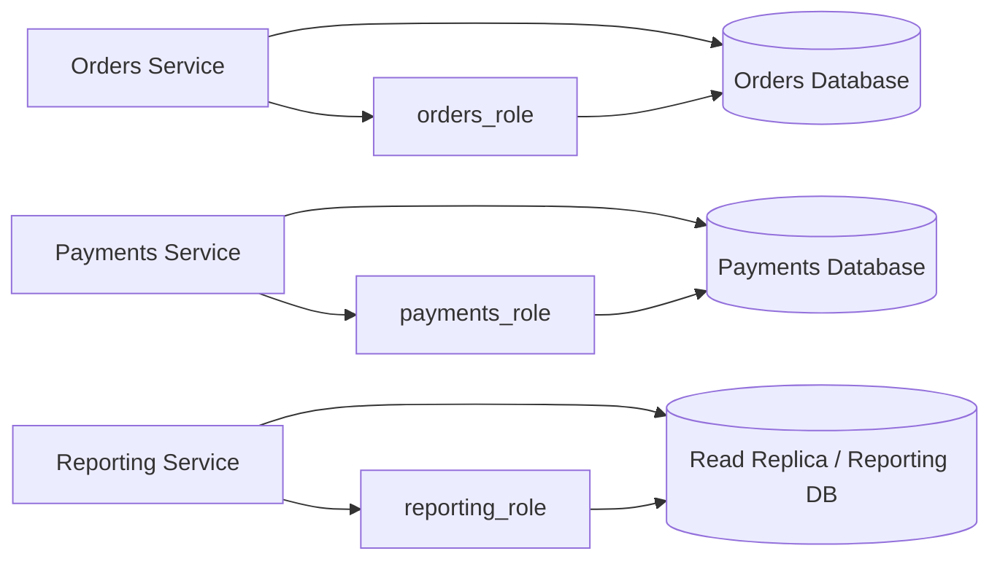

# 04- DCL

## Overview

**Data Control Language (DCL)** covers SQL statements used to control access to database objects and data. The core DCL operations are:

- `GRANT` — assigns privileges.
- `REVOKE` — removes privileges.

DCL is a database-level security boundary. It determines what a database identity is allowed to do independently of application-level authorization.

A production backend commonly has several layers of authorization:

```text
Client
  ↓
Nginx / Load Balancer
  ↓
Application Authentication
  ↓
Application Authorization
  ↓
Database Connection Identity
  ↓
Database Privileges
  ↓
Tables / Views / Functions
```

Application authorization answers:

> "Is this user allowed to perform this operation?"

DCL answers:

> "Is this database identity technically allowed to perform this database operation?"

Both layers are valuable. Application authorization provides business-level access control, while database privileges provide defense in depth and limit the blast radius of compromised credentials or application bugs.

---

## DCL vs Other SQL Command Categories

| Category | Purpose | Common Commands |
|---|---|---|
| DDL | Define database structures | `CREATE`, `ALTER`, `DROP` |
| DML | Modify stored data | `INSERT`, `UPDATE`, `DELETE` |
| DQL | Retrieve data | `SELECT` |
| DCL | Control access | `GRANT`, `REVOKE` |
| TCL | Control transactions | `COMMIT`, `ROLLBACK`, `SAVEPOINT` |

The exact command classification can vary slightly between database systems, but `GRANT` and `REVOKE` are conventionally treated as DCL.

---

## Database Roles and Privileges

Modern relational databases generally separate:

- **Identity** — who is connecting.
- **Role** — a collection of permissions and potentially membership relationships.
- **Privilege** — a specific allowed operation.
- **Object** — the database resource on which the privilege applies.

For example:

```text
application_user
      ↓
member of
      ↓
api_read_write
      ↓
GRANT privileges
      ↓
orders / customers / invoices
```

PostgreSQL uses roles for both users and groups. A role can represent a login identity, a group of privileges, or both.

This makes role-based access control more manageable than assigning every privilege directly to individual users.

---

## GRANT

`GRANT` assigns privileges to a user or role.

A simplified form is:

```sql
GRANT privilege
ON object
TO role_name;
```

Example:

```sql
GRANT SELECT
ON TABLE customers
TO reporting_role;
```

The `reporting_role` can now read the table, subject to other database security rules.

Multiple privileges can be granted together:

```sql
GRANT SELECT, INSERT, UPDATE
ON TABLE orders
TO api_role;
```

---

## Common Privileges

The available privileges depend on the database and object type.

Common PostgreSQL table privileges include:

| Privilege | Allows |
|---|---|
| `SELECT` | Read rows |
| `INSERT` | Insert rows |
| `UPDATE` | Modify rows |
| `DELETE` | Delete rows |
| `TRUNCATE` | Truncate table |
| `REFERENCES` | Create foreign-key references |
| `TRIGGER` | Create triggers |

Other database objects have different privilege types.

For example, schemas, sequences, functions, databases, and tables have different access requirements.

---

## Principle of Least Privilege

The most important DCL security principle is:

> Grant the minimum privileges required for a role to perform its job.

Avoid:

```sql
GRANT ALL PRIVILEGES
ON DATABASE production_db
TO application_role;
```

when the application only needs access to a limited set of tables.

Prefer narrowly scoped permissions:

```sql
GRANT USAGE
ON SCHEMA app
TO api_role;

GRANT SELECT, INSERT, UPDATE
ON TABLE app.orders
TO api_role;

GRANT SELECT
ON TABLE app.customers
TO api_role;
```

Least privilege reduces the impact of:

- Credential theft
- SQL injection
- Application vulnerabilities
- Accidental destructive queries
- Compromised background workers
- Misconfigured services

---

## REVOKE

`REVOKE` removes privileges.

```sql
REVOKE DELETE
ON TABLE orders
FROM api_role;
```

Multiple privileges can be removed:

```sql
REVOKE INSERT, UPDATE
ON TABLE customers
FROM reporting_role;
```

DCL should be managed deliberately because inherited privileges can make access more complex than a single `GRANT` statement suggests.

---

## Role-Based Access Control

Rather than granting permissions individually:

```text
user A → SELECT
user B → SELECT
user C → SELECT
```

create a role:

```text
reporting_role
    ├── SELECT customers
    ├── SELECT orders
    └── SELECT invoices
```

and assign users or service identities to it.

This provides:

- Centralized access management
- Easier auditing
- Consistent permissions
- Lower operational overhead
- Safer onboarding and offboarding

---

## PostgreSQL Role Example

Create a role:

```sql
CREATE ROLE reporting_role NOLOGIN;
```

Create a login identity:

```sql
CREATE ROLE reporting_user
LOGIN
PASSWORD 'use-a-secret-manager';
```

Grant role membership:

```sql
GRANT reporting_role TO reporting_user;
```

Then grant privileges to the group role:

```sql
GRANT USAGE
ON SCHEMA reporting
TO reporting_role;

GRANT SELECT
ON ALL TABLES IN SCHEMA reporting
TO reporting_role;
```

The application identity inherits the permissions associated with `reporting_role`.

In production, credentials should not be embedded directly in migration files or source code. Use a secret-management mechanism such as AWS Secrets Manager, Kubernetes Secrets with appropriate controls, or another approved secret-management system.

---

## NOLOGIN Roles

A strong PostgreSQL pattern is to use non-login roles as permission bundles.

```sql
CREATE ROLE api_readonly NOLOGIN;

GRANT USAGE
ON SCHEMA app
TO api_readonly;

GRANT SELECT
ON TABLE app.customers, app.orders
TO api_readonly;
```

Then assign that role to a login identity:

```sql
GRANT api_readonly TO reporting_user;
```

The important separation is:

```text
Login identity
      ↓
Permission role
      ↓
Database privileges
```

This makes permission changes independent of individual credentials.

---

## LOGIN Roles

A login role represents an identity that can establish a database connection.

Example:

```sql
CREATE ROLE api_service
LOGIN
PASSWORD 'managed-outside-source-control';
```

A production service account should generally:

- Have only required privileges.
- Use a strong, rotated credential or supported authentication mechanism.
- Have controlled network access.
- Be separately identifiable in audit logs.
- Not be shared across unrelated services.

Avoid using a superuser or administrative account for normal application traffic.

---

## Superuser Access

A database superuser bypasses many normal privilege restrictions.

Application services should generally **not** use superuser credentials.

For example:

```text
Bad:

Django / FastAPI
      ↓
PostgreSQL superuser
```

Prefer:

```text
Django / FastAPI
      ↓
application role
      ↓
minimum required privileges
```

Administrative access should be separated from application runtime access.

---

## Schema Privileges

Database access is often hierarchical.

In PostgreSQL, being granted access to a table does not necessarily mean the role has the required schema privileges.

For example:

```sql
GRANT USAGE
ON SCHEMA app
TO api_role;

GRANT SELECT
ON TABLE app.orders
TO api_role;
```

The schema privilege permits the role to access objects through the schema, while the table privilege controls the operation on the table.

This distinction is a common source of permission errors.

---

## Default Privileges

Granting permissions on existing tables does not automatically guarantee the same privileges on future tables.

PostgreSQL supports `ALTER DEFAULT PRIVILEGES`:

```sql
ALTER DEFAULT PRIVILEGES
IN SCHEMA app
GRANT SELECT
ON TABLES
TO reporting_role;
```

This is useful for schemas where migrations continuously create new tables.

However, default privileges apply based on the role that creates the objects. They should therefore be managed carefully in environments where multiple roles can create database objects.

---

## Sequence Privileges

PostgreSQL sequences are separate database objects.

For identity or serial-backed columns, an application role may need sequence privileges in addition to table privileges, depending on the schema and PostgreSQL setup.

For example:

```sql
GRANT USAGE, SELECT
ON ALL SEQUENCES IN SCHEMA app
TO api_role;
```

This is particularly relevant when an application can insert rows into tables backed by sequences.

---

## GRANT on Views

Views can provide a controlled read interface.

```sql
CREATE VIEW customer_summary AS
SELECT
    id,
    email,
    created_at
FROM customers
WHERE is_active = TRUE;
```

Then:

```sql
GRANT SELECT
ON customer_summary
TO reporting_role;
```

This can reduce direct access to underlying tables.

Views are particularly useful when reporting users need a curated data model rather than unrestricted access to transactional tables.

---

## Read-Only Roles

A reporting or analytics service should generally receive only read privileges.

```sql
CREATE ROLE analytics_readonly NOLOGIN;

GRANT USAGE
ON SCHEMA app
TO analytics_readonly;

GRANT SELECT
ON ALL TABLES IN SCHEMA app
TO analytics_readonly;
```

This prevents the reporting identity from accidentally executing:

```sql
DELETE
UPDATE
INSERT
```

against production data.

For sensitive environments, combine this with dedicated read replicas or separate analytical infrastructure so that expensive analytical workloads do not compete with transactional traffic.

---

## Separating Application Roles

A production architecture may use different identities:

| Role | Typical Access |
|---|---|
| API runtime | Required transactional tables |
| Read-only API | `SELECT` only |
| Worker | Tables required by background jobs |
| Migration role | Schema modification privileges |
| Reporting role | Read-only reporting data |
| Backup role | Backup-specific capabilities |
| DBA/admin | Administrative privileges |

The goal is to avoid one credential becoming an unrestricted key to the entire database.

---

## Application Role vs Migration Role

Schema migrations often require significantly more privileges than normal application traffic.

For example:

```text
CI/CD
  ↓
Migration identity
  ↓
CREATE / ALTER / DROP
```

while:

```text
Application
  ↓
Runtime identity
  ↓
SELECT / INSERT / UPDATE
```

The application runtime should not normally have unrestricted DDL privileges.

This separation limits the impact of a compromised application credential.

---

## DCL in CI/CD

Database permissions should be treated as infrastructure configuration and version-controlled where practical.

A deployment may conceptually perform:

```text
CI/CD
  ↓
Apply database migration
  ↓
Apply role/privilege changes
  ↓
Deploy application
```

Permission changes should be:

- Reviewed
- Auditable
- Repeatable
- Tested
- Applied through controlled deployment processes

Avoid manually modifying production privileges without recording the change.

---

## DCL and Django

Django normally interacts with the database through the configured database user.

For example:

```python
DATABASES = {
    "default": {
        "ENGINE": "django.db.backends.postgresql",
        "NAME": "app",
        "USER": "api_service",
        "PASSWORD": "...",
        "HOST": "db.internal",
        "PORT": "5432",
    }
}
```

The database user should have the privileges required by the application, but should not automatically receive administrative privileges.

A stronger deployment model can separate:

```text
Django runtime user
        ≠
Django migration user
```

depending on the deployment architecture and operational requirements.

---

## DCL and FastAPI

FastAPI does not change database authorization semantics. Whether the application uses SQLAlchemy, async drivers, or another PostgreSQL client, the database ultimately evaluates the privileges associated with the connection identity.

Conceptually:

```text
FastAPI request
      ↓
Dependency / service layer
      ↓
Database connection pool
      ↓
PostgreSQL role
      ↓
Privilege evaluation
      ↓
SQL execution
```

The application should still implement business-level authorization independently.

---

## DCL and Connection Pools

A connection pool means many requests may reuse connections associated with the same database role.

For example:

```text
FastAPI / Django
      ↓
Connection Pool
      ↓
api_service role
      ↓
PostgreSQL
```

Therefore, changing the database role's privileges affects all application requests using that identity.

Avoid creating excessive database identities when a small, well-defined set of service roles provides sufficient isolation.

At the same time, avoid using one universal database credential for every service because it destroys useful security boundaries and auditability.

---

## DCL and Microservices

A microservice architecture benefits from service-specific database identities.

For example:



If services share a database, they should still use separate roles where practical:

```text
orders_service
payments_service
reporting_service
```

This prevents a compromise of one service from automatically granting unrestricted access to another service's data.

---

## DCL and Multi-Tenancy

DCL controls database-level capabilities, but it does not automatically implement application-level tenant authorization.

For example:

```sql
GRANT SELECT
ON TABLE invoices
TO api_role;
```

does not mean:

```text
Tenant A can only see Tenant A invoices.
```

For row-level isolation, PostgreSQL Row-Level Security (RLS) can provide an additional database-level boundary.

Conceptually:

```text
Application role
      ↓
Table privilege
      ↓
Row-Level Security policy
      ↓
Allowed rows
```

RLS can be valuable for high-assurance multi-tenant systems, but introduces additional operational and application complexity.

---

## DCL and SQL Injection

Parameterized queries remain mandatory even when DCL is correctly configured.

DCL can limit the damage of SQL injection, but it does not prevent injection itself.

For example, if an application role only has:

```sql
SELECT
```

an injection vulnerability may still expose sensitive data.

Therefore:

```text
Parameterized SQL
        +
Application authorization
        +
Least-privilege DCL
        +
Network controls
        +
Secret management
```

provides a stronger security architecture than relying on any single control.

---

## Auditing Database Access

Production systems should be able to answer:

- Which identity accessed the database?
- Which objects can that identity access?
- Which privileges were granted?
- When did privilege changes occur?
- Which service initiated the operation?
- Were unusual queries executed?

Database auditing, PostgreSQL logging, cloud database audit facilities, and centralized log pipelines can support these requirements.

The exact implementation depends on the database engine and deployment environment.

---

## Privilege Escalation Risks

Privilege escalation can occur when a low-privilege role can indirectly obtain higher privileges.

Examples include:

- Unsafe functions
- Excessive role membership
- Overly broad schema permissions
- Object ownership
- Dangerous `SECURITY DEFINER` functions
- Misconfigured default privileges
- Shared administrative credentials

Security reviews should therefore examine not only direct `GRANT` statements but also role membership and ownership relationships.

---

## SECURITY DEFINER in PostgreSQL

PostgreSQL functions can execute with the privileges of the function owner when declared `SECURITY DEFINER`.

This can intentionally provide controlled access to privileged operations, but it must be designed carefully.

Potential risks include:

- Unsafe `search_path`
- Untrusted objects being resolved
- Overly broad function privileges
- Privilege escalation

A privileged function should expose the smallest possible operation and should carefully control object resolution.

This is an advanced mechanism and should not be used merely to bypass permission errors.

---

## Ownership vs Privileges

Database ownership is distinct from ordinary privileges.

An object owner generally has special control over the object that ordinary `GRANT` privileges do not provide.

Therefore, auditing access should consider:

```text
Direct privileges
+
Role membership
+
Object ownership
+
Inherited privileges
+
Database-specific security policies
```

Checking only explicit `GRANT` statements can produce an incomplete picture of effective access.

---

## Revoking Access Safely

Removing a role's privileges can break production applications.

Before revoking access:

1. Identify the role and its memberships.
2. Determine which services use the role.
3. Inspect current database activity and dependencies.
4. Confirm the required privileges.
5. Apply the change in a controlled environment.
6. Monitor application errors after deployment.

For example:

```sql
REVOKE DELETE
ON TABLE app.orders
FROM api_role;
```

This is safe only if the application does not legitimately depend on `DELETE`.

Permission changes are production changes and should be deployed with the same discipline as schema changes.

---

## Permission Testing

Test database roles explicitly rather than assuming the grants are correct.

For PostgreSQL, useful inspection commands include:

```sql
\du
```

to inspect roles, and:

```sql
\dp app.orders
```

to inspect table privileges in `psql`.

You can also test access using the actual application identity:

```sql
SELECT current_user;

SELECT
    has_table_privilege(
        current_user,
        'app.orders',
        'SELECT'
    );
```

Testing effective permissions is particularly useful after migrations or infrastructure changes.

---

## Production Security Checklist

### Identity

- Use separate database identities for materially different workloads.
- Avoid shared credentials.
- Do not use superusers for application traffic.
- Rotate credentials through an approved secret-management process.

### Authorization

- Apply least privilege.
- Prefer role-based permissions.
- Separate runtime and migration privileges.
- Review role membership regularly.
- Consider RLS for high-assurance row-level isolation.

### Operations

- Version-control permission changes where practical.
- Review DCL changes through CI/CD.
- Test privileges before production deployment.
- Monitor authentication failures and permission errors.
- Audit sensitive access.

### Network Security

DCL is not a replacement for network controls.

Use layered controls such as:

```text
VPC / Network ACLs / Security Groups
        ↓
Database authentication
        ↓
Database authorization / DCL
        ↓
Application authorization
        ↓
Data-level policies
```

For AWS-hosted PostgreSQL, database network exposure should be restricted using appropriate VPC, security-group, routing, and credential-management controls.

---

## Common Mistakes and Pitfalls

| Mistake | Risk | Better Approach |
|---|---|---|
| Application uses superuser | Complete database compromise if credentials are stolen | Use least-privileged runtime role |
| `GRANT ALL` everywhere | Excessive blast radius | Grant only required privileges |
| One DB user for every service | Poor isolation and auditability | Use service-specific roles |
| Runtime user can perform DDL | Application compromise can alter schema | Separate migration privileges |
| Granting table access but forgetting schema access | Permission errors | Grant required schema privileges |
| Assuming future tables inherit permissions | New objects may be inaccessible | Configure and verify default privileges |
| Ignoring sequences | Inserts may fail depending on sequence privileges | Manage sequence access explicitly |
| Relying only on application authorization | Database can still be accessed by another path | Add database-level controls |
| Manually changing production grants | Configuration drift | Version and deploy DCL changes |
| Ignoring role membership | Effective privileges may be broader than expected | Audit inherited roles |
| Shared credentials | Difficult attribution and revocation | Separate identities |
| Granting excessive function privileges | Potential privilege escalation | Restrict function execution and ownership |
| Using `SECURITY DEFINER` casually | Can create privilege-escalation paths | Harden privileged functions |

---

## DCL vs Application Authorization

These controls solve different problems.

| Concern | Application Authorization | Database DCL |
|---|---|---|
| User can access another user's resource | Strong fit | Usually insufficient by itself |
| Service can access a table | Limited | Strong fit |
| User-specific business rules | Strong fit | Possible but complex |
| Prevent application from executing `DELETE` | Limited | Strong fit |
| Compromised DB credential | Not applicable | Strong fit |
| Multi-tenant row isolation | Application-level support | RLS can provide database-level enforcement |
| API endpoint permissions | Strong fit | Not applicable |
| Defense in depth | Yes | Yes |

A mature backend system normally uses both rather than treating them as alternatives.

## Key Takeaways

- **DCL uses `GRANT` and `REVOKE` to control database access; production systems should apply least privilege rather than broad permissions.**
- **Use role-based access control and separate runtime, migration, reporting, and administrative identities to reduce blast radius and improve auditability.**
- **Database privileges complement, but do not replace, application authorization, parameterized SQL, network security, and secret management.**
- **Production permission changes should be version-controlled, tested, reviewed, and monitored just like schema and application changes.**
- **Effective database access includes direct grants, inherited role membership, ownership, default privileges, and database-specific controls such as PostgreSQL RLS.**