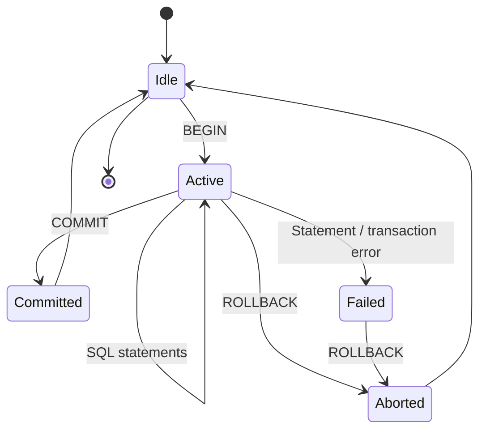
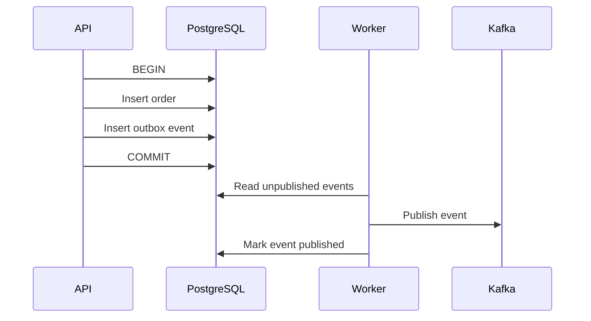
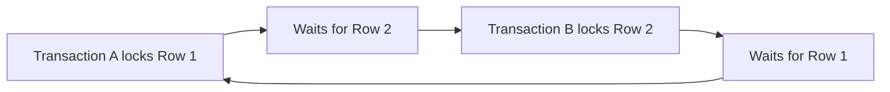

# 05- TCL

## Overview

**Transaction Control Language (TCL)** refers to SQL operations that control the boundaries and outcome of database transactions.

The core TCL operations are:

- `BEGIN` / `START TRANSACTION` — start an explicit transaction.
- `COMMIT` — permanently make the transaction's changes visible according to the database's transaction semantics.
- `ROLLBACK` — discard changes made by the current transaction.
- `SAVEPOINT` — establish a point inside a transaction to which execution can roll back.
- `ROLLBACK TO SAVEPOINT` — undo changes made after a savepoint while keeping the transaction active.
- `RELEASE SAVEPOINT` — remove a savepoint.

Transactions are fundamental to reliable backend systems because a business operation often consists of multiple database statements that must succeed or fail as a unit.

For example, transferring money conceptually requires:

```text
Account A: debit $100
       +
Account B: credit $100
       ↓
Both succeed → COMMIT

Either fails → ROLLBACK
```

Without transactional boundaries, a failure between the two operations could leave the database in an inconsistent state.

---

## What Is a Transaction?

A transaction is a logical unit of database work that is executed according to the database's transaction and concurrency rules.

A transaction may contain:

```sql
INSERT ...
UPDATE ...
DELETE ...
SELECT ...
```

The important property is that the application can define which operations belong together.

For example:

```sql
BEGIN;

UPDATE accounts
SET balance = balance - 100
WHERE id = 1;

UPDATE accounts
SET balance = balance + 100
WHERE id = 2;

COMMIT;
```

Both updates belong to the same transaction.

If the second operation fails:

```sql
ROLLBACK;
```

the first update is also undone.

---

## Why Transactions Exist

Transactions solve a fundamental reliability problem: database operations frequently depend on one another.

Consider order creation:

```text
Create order
    ↓
Create order items
    ↓
Reserve inventory
    ↓
Record payment attempt
```

If the order is inserted but inventory reservation fails, committing only the first operation may leave an invalid application state.

A transaction allows the application to define the required atomic boundary:

```text
Transaction
├── Create order
├── Create order items
├── Update inventory
└── Record payment state

Success → COMMIT
Failure → ROLLBACK
```

Transactions therefore provide a mechanism for preserving database consistency under failures and concurrent execution.

---

## ACID Properties

Transactions are commonly discussed using the **ACID** properties.

| Property | Meaning | Backend implication |
|---|---|---|
| Atomicity | Transaction succeeds as a unit or is rolled back | Prevents partial database updates |
| Consistency | Database constraints and rules remain satisfied | Protects invariants |
| Isolation | Concurrent transactions interact according to defined isolation rules | Controls visibility and concurrency anomalies |
| Durability | Committed changes survive according to the database's durability guarantees | Protects committed state from failures |

ACID is not simply a synonym for "safe database."

The actual guarantees depend on the database engine, configuration, transaction isolation, storage system, replication architecture, and failure mode.

---

## BEGIN

`BEGIN` starts an explicit transaction in systems such as PostgreSQL.

```sql
BEGIN;

UPDATE accounts
SET balance = balance - 100
WHERE id = 1;

UPDATE accounts
SET balance = balance + 100
WHERE id = 2;

COMMIT;
```

Some database drivers automatically begin transactions when the first statement is executed, so application code does not always issue `BEGIN` directly.

The important engineering concept is the **transaction boundary**, not whether the keyword appears in application code.

---

## COMMIT

`COMMIT` completes the current transaction.

```sql
BEGIN;

INSERT INTO orders (customer_id, status)
VALUES (42, 'pending');

COMMIT;
```

After a successful commit, the transaction's changes are committed according to the database's durability and concurrency semantics.

A commit is not equivalent to:

> "Every replica everywhere has already persisted and exposed the data."

Replication systems can introduce additional visibility and durability considerations.

---

## ROLLBACK

`ROLLBACK` aborts the current transaction.

```sql
BEGIN;

UPDATE accounts
SET balance = balance - 100
WHERE id = 1;

ROLLBACK;
```

The update is discarded.

A typical application pattern is:

```text
BEGIN
  ↓
Execute operations
  ↓
All successful?
 ├── Yes → COMMIT
 └── No  → ROLLBACK
```

Rollback is particularly important when an operation contains several dependent writes.

---

## Transaction Lifecycle

A simplified transaction lifecycle is:



The exact transaction state machine varies by database engine and driver.

In PostgreSQL, for example, certain statement errors can leave the transaction in an aborted state until a `ROLLBACK` is issued.

---

## Savepoints

A **savepoint** creates a rollback point inside an active transaction.

```sql
BEGIN;

INSERT INTO orders (customer_id, status)
VALUES (42, 'pending');

SAVEPOINT before_optional_step;

INSERT INTO order_audit (order_id, event)
VALUES (1001, 'created');

ROLLBACK TO SAVEPOINT before_optional_step;

COMMIT;
```

The transaction remains active after `ROLLBACK TO SAVEPOINT`.

The changes made before the savepoint remain part of the transaction.

Conceptually:

```text
BEGIN
  ↓
Operation A
  ↓
SAVEPOINT S1
  ↓
Operation B
  ↓
ROLLBACK TO S1
  ↓
Operation C
  ↓
COMMIT
```

The changes from Operation B are discarded while A and C remain eligible for commit.

---

## RELEASE SAVEPOINT

A savepoint can be explicitly removed:

```sql
SAVEPOINT order_created;

-- Additional work

RELEASE SAVEPOINT order_created;
```

Releasing a savepoint does not commit the transaction.

The transaction remains active until `COMMIT` or `ROLLBACK`.

---

## Nested Transactions

A common misconception is that:

```sql
BEGIN;
BEGIN;
```

creates two independent nested transactions.

Most relational databases do not provide independent nested transactions in this sense.

Savepoints are typically used when an application needs partial rollback behavior inside a transaction:

```sql
BEGIN;

SAVEPOINT operation_a;

-- Work

ROLLBACK TO SAVEPOINT operation_a;

COMMIT;
```

Frameworks may expose an API called a "nested transaction," but internally it may be implemented using savepoints.

---

## Transactions and Constraints

Transactions work closely with database constraints.

Consider:

```sql
CREATE TABLE orders (
    id BIGSERIAL PRIMARY KEY,
    customer_id BIGINT NOT NULL,
    total_amount NUMERIC(12, 2) NOT NULL CHECK (total_amount >= 0)
);
```

An operation attempting to violate the constraint can fail.

The application can then roll back the surrounding transaction rather than leaving earlier writes committed.

This is one reason database constraints and transactions should complement application validation rather than replacing one another.

---

## Transaction Example: Order Creation

A production order workflow may look like:

```sql
BEGIN;

INSERT INTO orders (customer_id, status, total_amount)
VALUES (42, 'pending', 1499.00)
RETURNING id;

INSERT INTO order_items (order_id, product_id, quantity, unit_price)
VALUES (1001, 7, 2, 749.50);

UPDATE inventory
SET available_quantity = available_quantity - 2
WHERE product_id = 7
  AND available_quantity >= 2;

-- Verify that the expected inventory row was updated.

COMMIT;
```

If inventory cannot be reserved, the transaction should not blindly commit the order state.

The application must verify the affected row count and choose whether to roll back or transition the order into an explicitly valid state.

---

## Transaction Boundaries in Backend APIs

A useful transaction boundary often corresponds to a single atomic business operation.

For example:

```text
POST /orders
        ↓
Validate request
        ↓
BEGIN TRANSACTION
        ↓
Create order
        ↓
Create items
        ↓
Reserve inventory
        ↓
COMMIT
        ↓
Return response
```

However, not every API request should automatically use one large transaction.

Transactions should be scoped to the smallest unit that must remain atomic.

Avoid wrapping:

- External HTTP calls
- Long-running computations
- User interaction
- Large batch processing
- Slow network operations

inside a database transaction unless there is a specific reason.

---

## Django Transactions

Django provides transaction management through `transaction.atomic()`.

```python
from django.db import transaction

with transaction.atomic():
    order = Order.objects.create(
        customer_id=customer_id,
        status="pending",
    )

    OrderItem.objects.create(
        order=order,
        product_id=product_id,
        quantity=quantity,
        unit_price=unit_price,
    )
```

If an exception causes the atomic block to fail, Django rolls back the transaction.

For service-layer operations, an explicit atomic boundary is often preferable to relying on implicit behavior:

```python
from django.db import transaction

@transaction.atomic
def create_order(customer_id, product_id, quantity):
    ...
```

Keep the transaction boundary around the business operation that actually requires atomicity.

---

## FastAPI and SQLAlchemy

With FastAPI, transaction management depends on the database library.

A typical SQLAlchemy pattern is:

```python
from sqlalchemy.orm import Session

def create_order(db: Session, customer_id: int):
    try:
        order = Order(
            customer_id=customer_id,
            status="pending",
        )

        db.add(order)
        db.flush()

        db.add(
            OrderItem(
                order_id=order.id,
                product_id=7,
                quantity=2,
            )
        )

        db.commit()
        return order

    except Exception:
        db.rollback()
        raise
```

The exact implementation should follow the transaction semantics of the SQLAlchemy version and session-management architecture being used.

The key principle remains:

```text
Business operation
       ↓
Transaction boundary
       ↓
Commit or rollback
```

---

## Transaction Isolation

Transaction isolation determines how concurrent transactions interact.

Common SQL isolation levels are:

| Isolation level | Dirty reads | Non-repeatable reads | Phantom reads | Typical trade-off |
|---|---:|---:|---:|---|
| Read Uncommitted | Possible in systems that implement it literally | Possible | Possible | Highest concurrency, weakest guarantees |
| Read Committed | Prevented | Possible | Possible | Common default |
| Repeatable Read | Prevented | Prevented | Engine-dependent semantics | Stronger consistency |
| Serializable | Prevented | Prevented | Prevented | Strongest standard isolation, potentially more contention |

The exact behavior varies between database engines.

For example, PostgreSQL's `READ UNCOMMITTED` behaves like `READ COMMITTED`, while PostgreSQL's `REPEATABLE READ` provides stronger snapshot semantics than the simplified SQL-standard anomaly table suggests.

Do not choose an isolation level solely from a memorized table. Understand the specific database's implementation.

---

## Read Committed

`READ COMMITTED` is a common production default.

A transaction generally sees data committed before each statement begins, subject to the database's concurrency model.

This means two statements within one transaction can observe different committed states.

That is important when writing business logic such as:

```text
SELECT inventory
        ↓
application calculates availability
        ↓
UPDATE inventory
```

Another transaction may modify the row between the two statements.

For correctness-sensitive operations, row locking or a stronger concurrency strategy may be required.

---

## Serializable Transactions

`SERIALIZABLE` provides the strongest standard isolation level.

Conceptually, concurrent transactions are required to behave as though they executed in some serial order.

The trade-off is increased contention and possible serialization failures.

Applications using serializable transactions must generally be prepared to retry transactions when the database reports a serialization failure.

A retry pattern should:

- Retry only known transient transaction failures.
- Limit the number of retries.
- Use backoff where appropriate.
- Keep the transaction itself small.
- Avoid retrying non-idempotent external side effects blindly.

---

## Row-Level Locking

Transactions alone do not prevent every race condition.

For example:

```text
Transaction A: SELECT stock = 1
Transaction B: SELECT stock = 1

A decrements → 0
B decrements → -1
```

A row lock can coordinate competing writers.

PostgreSQL example:

```sql
BEGIN;

SELECT available_quantity
FROM inventory
WHERE product_id = 7
FOR UPDATE;

UPDATE inventory
SET available_quantity = available_quantity - 1
WHERE product_id = 7;

COMMIT;
```

`FOR UPDATE` locks the selected rows against conflicting updates until the transaction ends.

The exact locking behavior depends on the database engine and statement.

---

## Optimistic vs Pessimistic Concurrency

Transactions can be combined with different concurrency-control strategies.

| Strategy | Mechanism | Best suited for |
|---|---|---|
| Pessimistic | Lock rows while operating | High-conflict updates |
| Optimistic | Detect conflicts using versions/conditions | Lower-conflict workloads |
| Serializable | Let database detect serialization conflicts | Strong correctness requirements |

An optimistic update can look like:

```sql
UPDATE inventory
SET available_quantity = available_quantity - 1,
    version = version + 1
WHERE product_id = 7
  AND version = 12
  AND available_quantity >= 1;
```

If zero rows are affected, another transaction may have changed the row.

This avoids holding a database lock for longer than necessary.

---

## Long-Running Transactions

Long-running transactions are a major production concern.

A transaction that remains open for a long time can:

- Hold locks.
- Increase contention.
- Prevent cleanup of old row versions in MVCC databases.
- Increase storage requirements.
- Cause connection-pool exhaustion.
- Increase replication lag indirectly.
- Increase deadlock opportunities.

Avoid:

```text
BEGIN
  ↓
Database query
  ↓
External API call
  ↓
Wait 5 seconds
  ↓
Another API call
  ↓
COMMIT
```

Prefer:

```text
Prepare required state
      ↓
Short database transaction
      ↓
Commit
      ↓
External operation
```

If the workflow requires coordination across systems, use patterns such as an outbox or saga rather than attempting to hold a database transaction across network calls.

---

## Transactions and External Systems

A database transaction cannot automatically roll back an external side effect.

For example:

```text
BEGIN
  ↓
Create order
  ↓
Call payment provider
  ↓
Payment succeeds
  ↓
Database operation fails
  ↓
ROLLBACK
```

The payment provider does not know that the database rolled back.

The result can be:

```text
Payment succeeded
Order transaction rolled back
```

This is why distributed workflows require explicit coordination.

Common patterns include:

- Transactional outbox
- Idempotency keys
- Saga/workflow orchestration
- Compensating actions
- Reliable event publication

Do not attempt to solve distributed consistency by simply making the database transaction larger.

---

## Transactional Outbox

A common backend architecture is:



The order and outbox event are committed atomically.

If Kafka is temporarily unavailable, the database transaction can still commit, and a worker can publish the event later.

This avoids the unreliable pattern:

```text
DB COMMIT
   ↓
Kafka publish
```

where the process can fail between the two operations.

---

## Transaction Duration

A useful production metric is transaction duration.

Short transactions generally reduce:

- Lock contention
- Connection occupancy
- Deadlock probability
- MVCC cleanup pressure
- Tail latency

However, making transactions unnecessarily small can break atomicity.

The correct goal is:

> **Keep the transaction as short as possible while preserving the required business invariant.**

Do not optimize transaction duration by splitting an operation that genuinely needs atomicity into independently committed pieces.

---

## Deadlocks

A deadlock occurs when transactions wait on one another indefinitely until the database detects the cycle and aborts one transaction.

Example:

```text
Transaction A
locks Row 1
    ↓
waits for Row 2

Transaction B
locks Row 2
    ↓
waits for Row 1
```



A strong prevention strategy is to acquire locks in a consistent order.

For example, always update accounts in ascending account ID order:

```text
Account 10 → Account 20
```

rather than allowing one code path to use:

```text
10 → 20
```

and another:

```text
20 → 10
```

Applications should also be prepared to retry appropriate transient deadlock failures.

---

## Autocommit

Many database drivers operate in autocommit mode unless an explicit transaction is started or a framework changes the behavior.

In autocommit mode, individual statements may commit independently.

Conceptually:

```text
INSERT → COMMIT
UPDATE → COMMIT
DELETE → COMMIT
```

This is appropriate for independent operations but dangerous when multiple statements must succeed together.

For example:

```sql
UPDATE accounts
SET balance = balance - 100
WHERE id = 1;

UPDATE accounts
SET balance = balance + 100
WHERE id = 2;
```

If each statement commits independently, a failure between them can produce an inconsistent result.

---

## Transaction Boundaries and Connection Pools

Database connections are usually pooled in backend services.

A transaction is associated with a specific database connection/session.

Therefore, transaction management must be compatible with the connection pool.

A dangerous pattern is:

```text
Request A
  ↓
Connection 1
  ↓
BEGIN

Connection returned incorrectly

Request B
  ↓
Connection 1
  ↓
Still inside transaction
```

Well-designed frameworks and database libraries prevent this when used correctly, but custom connection handling can introduce serious transaction leakage.

Always ensure that:

- Transactions are committed or rolled back.
- Connections are returned to the pool.
- Exceptions cannot leave transactions open.
- Session state is reset appropriately.

---

## Error Handling

Transaction error handling should distinguish between:

- Permanent application errors
- Constraint violations
- Serialization failures
- Deadlocks
- Connection failures
- Timeouts

A generic retry of every database exception is unsafe.

For example:

```text
Unique constraint violation
        ↓
Retry
        ↓
Same violation
        ↓
Waste resources
```

Whereas a serialization failure may be transient:

```text
Serialization failure
        ↓
Rollback
        ↓
Retry transaction
```

Retry only errors known to be safe to retry.

---

## Idempotency and Retries

Transaction retries can cause unexpected behavior when external side effects are involved.

For example:

```text
Transaction attempt 1
    ↓
Create database state
    ↓
External side effect
    ↓
Serialization failure
```

A retry may execute the external side effect again.

Therefore, transaction retries should be designed together with idempotency.

For APIs involving payments, orders, or message processing, idempotency keys and durable operation identifiers are often more important than simply adding a retry loop.

---

## Monitoring Transactions

Production database monitoring should include transaction-related signals such as:

| Metric | Why it matters |
|---|---|
| Transaction duration | Detects long-running work |
| Lock wait time | Detects contention |
| Deadlock count | Indicates concurrency problems |
| Serialization failures | Indicates retry pressure |
| Open/idle transactions | Detects leaked transactions |
| Connection pool utilization | Detects capacity pressure |
| Query latency | Identifies slow operations |
| Rollback rate | Detects application/database failures |

For PostgreSQL, views such as `pg_stat_activity` and `pg_locks` can help investigate active sessions and lock contention.

Example:

```sql
SELECT
    pid,
    usename,
    state,
    wait_event_type,
    wait_event,
    xact_start,
    query_start,
    query
FROM pg_stat_activity
WHERE datname = current_database();
```

Use appropriate access controls when exposing database diagnostic information.

---

## Production Best Practices

### Keep Transactions Small

Include only operations that require atomicity.

Avoid unnecessary queries and expensive computation inside the transaction.

### Acquire Locks Consistently

Use a consistent ordering when multiple rows or resources must be locked.

### Avoid External Calls

Do not hold database locks while waiting on HTTP APIs, Kafka, email providers, or other external services.

### Validate Before Entering the Transaction

Perform inexpensive validation before opening the transaction where possible.

Still rely on database constraints for correctness under concurrency.

### Handle Transient Failures

Retry known deadlock or serialization failures with bounded retries.

### Monitor Transaction Health

Track transaction duration, lock waits, deadlocks, connection usage, and idle transactions.

### Test Failure Paths

Test failures between each critical operation, not just the successful path.

---

## Common Mistakes and Pitfalls

| Mistake | Why it happens | Better approach |
|---|---|---|
| Committing every statement | Autocommit misunderstood | Group dependent operations into one transaction |
| Holding transactions during HTTP calls | Transaction boundary designed around entire request | Commit database state before external work where possible |
| Assuming transactions prevent race conditions | Isolation and locking misunderstood | Use appropriate locks, constraints, or optimistic concurrency |
| Retrying every database error | Generic retry logic | Retry only known transient failures |
| Ignoring deadlocks | Concurrency tested only under light load | Use consistent lock ordering and bounded retries |
| Leaving transactions open | Exception or connection handling bug | Always rollback/cleanup on failure |
| Using one huge transaction | Atomicity confused with request scope | Keep only required work inside the transaction |
| Assuming nested `BEGIN` creates nested transactions | Transaction semantics misunderstood | Use savepoints where supported |
| Ignoring affected-row counts | Update assumed to have succeeded | Validate rows affected for conditional updates |
| Performing external side effects inside transactions | Distributed consistency misunderstood | Use outbox, idempotency, or workflow patterns |
| Using stronger isolation everywhere | "More consistency is always better" | Choose isolation based on actual invariants |
| Retrying non-idempotent operations blindly | Retry semantics overlooked | Use idempotency keys and durable operation IDs |

---

## Interview Traps

### "Does COMMIT guarantee immediate visibility everywhere?"

Not necessarily.

A commit establishes the transaction's committed state according to the database's semantics. Replicas, caches, asynchronous consumers, and read-after-write behavior can introduce additional visibility delays.

### "Does a transaction prevent race conditions?"

No.

Transactions provide atomicity and isolation according to the selected isolation level, but application-level race conditions may still require:

- Row locks
- Unique constraints
- Conditional updates
- Optimistic concurrency
- Serializable transactions

### "Are nested transactions the same as savepoints?"

Usually not.

Independent nested transactions are different from savepoints. Frameworks that expose nested transaction APIs commonly implement them using savepoints.

### "Should every API request use a transaction?"

No.

Use transactions when multiple operations must satisfy an atomicity or consistency requirement.

### "Can a database rollback an HTTP request?"

No.

A database transaction can roll back database state, but it cannot automatically undo an external side effect such as a payment, email, HTTP request, or Kafka publication.

---

## Practical Transaction Design Checklist

Before introducing a transaction, ask:

1. **What business invariant requires atomicity?**
2. **Which database operations must commit or fail together?**
3. **Can validation happen before the transaction?**
4. **Can external calls be moved outside the transaction?**
5. **Could concurrent requests modify the same rows?**
6. **Is a row lock or optimistic concurrency required?**
7. **What isolation level is actually necessary?**
8. **What failures are safe to retry?**
9. **Is the operation idempotent?**
10. **How will transaction duration and lock contention be monitored?**

A transaction should be designed around the business invariant, not simply around the HTTP request lifecycle.

## Key Takeaways

- **Transactions group related database operations into an atomic unit controlled through `COMMIT`, `ROLLBACK`, and savepoints.**
- **ACID does not eliminate concurrency problems; isolation level, locking, constraints, and optimistic or pessimistic concurrency strategies must be chosen deliberately.**
- **Keep production transactions short and avoid holding database locks while performing external network calls or long-running work.**
- **Deadlocks, serialization failures, and transaction timeouts require bounded, targeted retry strategies rather than generic retries.**
- **Database transactions cannot roll back external side effects; use idempotency, transactional outbox, sagas, or compensating workflows for distributed operations.**