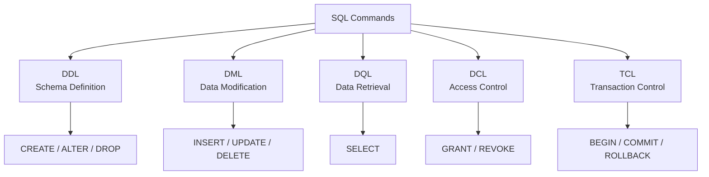
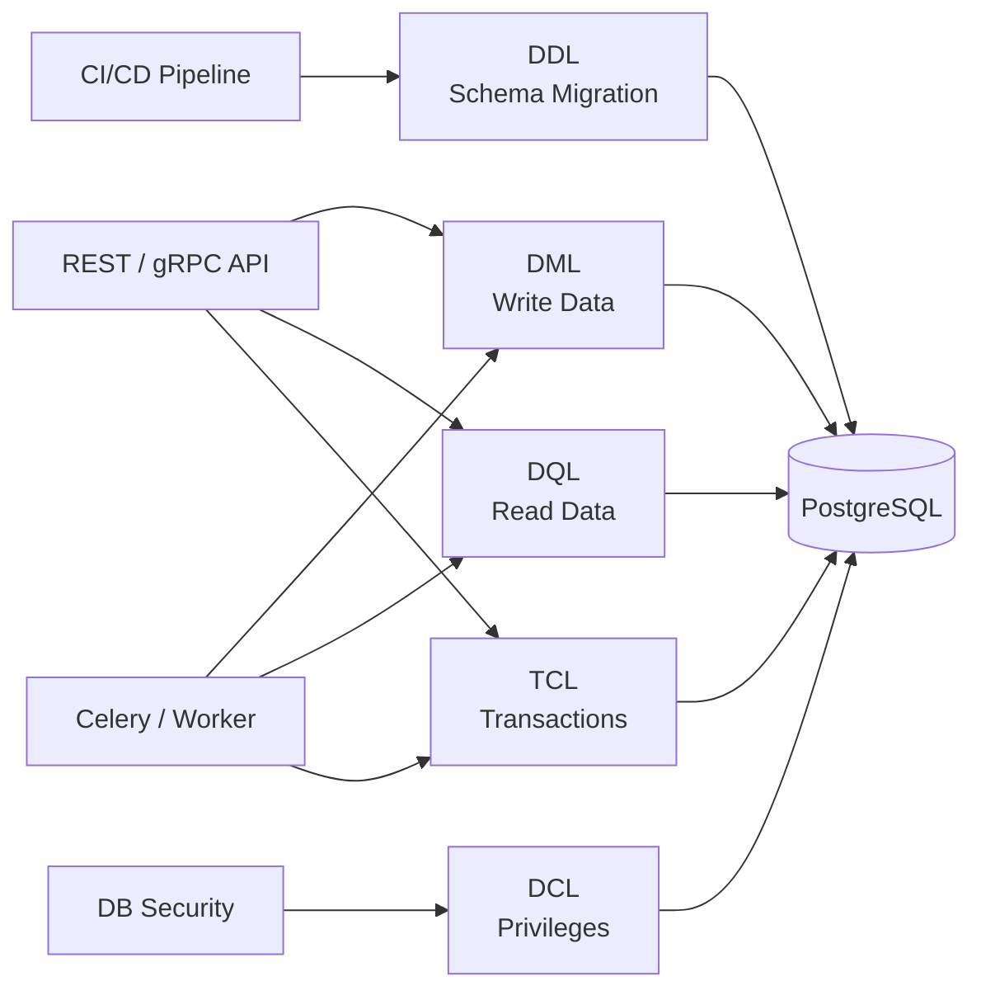

# 06- Command Category Comparison

## Overview

SQL commands can be grouped by the kind of database operation they perform. The traditional categories are **DDL**, **DML**, **DQL**, **DCL**, and **TCL**.

These categories are useful for understanding database responsibilities, transaction behavior, permissions, deployment workflows, and operational risk.

| Category | Full form | Primary responsibility | Common commands |
|---|---|---|---|
| **DDL** | Data Definition Language | Define and modify database structure | `CREATE`, `ALTER`, `DROP`, `TRUNCATE` |
| **DML** | Data Manipulation Language | Insert, modify, and remove stored data | `INSERT`, `UPDATE`, `DELETE`, `MERGE` |
| **DQL** | Data Query Language | Read data | `SELECT` |
| **DCL** | Data Control Language | Control database permissions | `GRANT`, `REVOKE` |
| **TCL** | Transaction Control Language | Control transaction boundaries | `BEGIN`, `COMMIT`, `ROLLBACK`, `SAVEPOINT` |

The exact categorization varies slightly between database products and textbooks. For production engineering, the more important distinction is **what the statement changes, whether it participates in a transaction, and what operational impact it has**.

---

## SQL Command Categories at a Glance



A backend service may use several categories during its lifecycle:

```text
CI/CD migration
      │
      └── DDL → CREATE / ALTER indexes, tables, constraints
                         │
                         ▼
API request ──────── DML → INSERT / UPDATE / DELETE
                         │
                         ▼
API response ────── DQL → SELECT
                         │
                         ▼
Database security ── DCL → GRANT / REVOKE
                         │
                         ▼
Atomicity ────────── TCL → COMMIT / ROLLBACK
```

---

## DDL

**Data Definition Language** manages database structures.

Common DDL statements include:

- `CREATE`
- `ALTER`
- `DROP`
- `TRUNCATE`

Example:

```sql
CREATE TABLE customers (
    id BIGSERIAL PRIMARY KEY,
    email VARCHAR(320) NOT NULL UNIQUE,
    created_at TIMESTAMPTZ NOT NULL DEFAULT CURRENT_TIMESTAMP
);
```

Modifying the schema:

```sql
ALTER TABLE customers
ADD COLUMN status VARCHAR(32) NOT NULL DEFAULT 'active';
```

Removing a structure:

```sql
DROP TABLE customers;
```

### Production considerations

DDL can have significantly different operational behavior across database engines.

Schema changes may:

- Acquire locks.
- Rewrite tables.
- Consume substantial I/O.
- Increase replication lag.
- Block application traffic.
- Require significant storage.
- Affect query plans.

For production PostgreSQL systems, large schema migrations should be designed around the application's availability requirements rather than treated as simple SQL scripts.

A safer migration often follows:

```text
Add compatible schema
        ↓
Deploy application supporting old + new schema
        ↓
Backfill data gradually
        ↓
Switch reads/writes
        ↓
Remove obsolete schema later
```

This is commonly called an **expand-and-contract migration**.

---

## DML

**Data Manipulation Language** operates on stored rows.

Common commands include:

- `INSERT`
- `UPDATE`
- `DELETE`
- `MERGE` where supported

Example:

```sql
INSERT INTO customers (email)
VALUES ('customer@example.com');
```

Updating data:

```sql
UPDATE customers
SET status = 'inactive'
WHERE id = 42;
```

Deleting data:

```sql
DELETE FROM customers
WHERE id = 42;
```

### Production considerations

DML is frequently executed by backend services and therefore deserves careful attention to:

- Transaction boundaries
- Index usage
- Lock contention
- Affected-row counts
- Query latency
- Concurrency
- Authorization
- Audit requirements

Never execute a destructive `UPDATE` or `DELETE` without an appropriate predicate.

Unsafe:

```sql
DELETE FROM customers;
```

Safer:

```sql
DELETE FROM customers
WHERE id = 42;
```

For critical production operations, validate the expected affected-row count before committing.

---

## DQL

**Data Query Language** refers primarily to retrieving data with `SELECT`.

Example:

```sql
SELECT
    id,
    email,
    status
FROM customers
WHERE status = 'active'
ORDER BY created_at DESC
LIMIT 100;
```

DQL is read-oriented, but a `SELECT` can still have significant production impact.

A poorly designed query can:

- Scan millions of rows.
- Consume excessive CPU.
- Generate large result sets.
- Increase database latency.
- Consume application memory.
- Hold locks in certain query forms.
- Exhaust connection-pool capacity.

### Query optimization

For production queries, inspect the execution plan:

```sql
EXPLAIN (ANALYZE, BUFFERS)
SELECT
    id,
    email
FROM customers
WHERE status = 'active'
ORDER BY created_at DESC
LIMIT 100;
```

Do not add indexes simply because a query is slow. First understand:

- Cardinality
- Selectivity
- Query shape
- Existing indexes
- Data distribution
- Execution plan
- Write overhead

---

## DCL

**Data Control Language** manages authorization and privileges.

Common commands include:

```sql
GRANT
REVOKE
```

Example:

```sql
GRANT SELECT, INSERT, UPDATE
ON customers
TO application_role;
```

Removing a privilege:

```sql
REVOKE DELETE
ON customers
FROM application_role;
```

### Production security model

A backend application should generally use a dedicated database role with only the permissions it needs.

For example:

```text
Application
    ↓
application_role
    ├── SELECT
    ├── INSERT
    ├── UPDATE
    └── limited DELETE

Migration role
    ├── CREATE
    ├── ALTER
    └── other schema privileges

DB administrator
    └── administrative privileges
```

Avoid running a normal Django, FastAPI, or microservice workload using a highly privileged database administrator account.

This follows the **principle of least privilege**.

---

## TCL

**Transaction Control Language** controls transaction boundaries and outcomes.

Common commands include:

```sql
BEGIN;
COMMIT;
ROLLBACK;
SAVEPOINT;
ROLLBACK TO SAVEPOINT;
RELEASE SAVEPOINT;
```

Example:

```sql
BEGIN;

UPDATE accounts
SET balance = balance - 100
WHERE id = 1;

UPDATE accounts
SET balance = balance + 100
WHERE id = 2;

COMMIT;
```

If an operation fails:

```sql
ROLLBACK;
```

Transactions are essential when multiple operations must succeed or fail together.

### Production considerations

Transactions should generally be:

- Short-lived
- Explicitly bounded
- Free of unnecessary external calls
- Designed around business invariants
- Compatible with connection pooling
- Monitored for lock contention and duration

Transactions do not automatically protect against every concurrency problem. Isolation levels, row locks, constraints, optimistic concurrency, and retry strategies may also be required.

---

## DDL vs DML

The most important distinction is **structure vs data**.

| Aspect | DDL | DML |
|---|---|---|
| Operates on | Database structure | Stored data |
| Typical objects | Tables, indexes, constraints | Rows |
| Examples | `CREATE`, `ALTER`, `DROP` | `INSERT`, `UPDATE`, `DELETE` |
| Typical owner | Migration/deployment process | Application/service |
| Operational risk | Schema and locking risk | Data modification risk |
| Common execution path | CI/CD | API/worker |
| Example | Add `status` column | Update customer status |

Consider:

```sql
ALTER TABLE customers
ADD COLUMN status VARCHAR(32);
```

This changes the **schema**.

Whereas:

```sql
UPDATE customers
SET status = 'active';
```

changes the **data**.

---

## DML vs DQL

The distinction is:

```text
DQL → Read
DML → Modify
```

Example DQL:

```sql
SELECT *
FROM orders
WHERE customer_id = 42;
```

Example DML:

```sql
UPDATE orders
SET status = 'shipped'
WHERE id = 1001;
```

A backend request commonly combines both:

```text
HTTP request
     ↓
DQL → SELECT current order
     ↓
Business logic
     ↓
DML → UPDATE order
     ↓
DQL → SELECT resulting state
     ↓
HTTP response
```

The database may execute all of these statements within one transaction when atomicity requires it.

---

## DCL vs Application Authorization

DCL controls **database-level privileges**.

Application authorization controls **business-level access**.

They solve different problems.

For example:

```text
User
 ↓
Application authorization
 ↓
"Can this user modify order 1001?"
 ↓
SQL
 ↓
Database authorization
 ↓
"Can this application role UPDATE orders?"
```

A user being an administrator in Django does not automatically mean the underlying PostgreSQL role should have unrestricted privileges.

Use both layers appropriately:

- Application authorization protects business rules.
- Database authorization limits what database identities can do.

---

## TCL vs DML

DML changes data.

TCL determines how those changes are committed or rolled back.

```sql
BEGIN;

INSERT INTO orders (customer_id, status)
VALUES (42, 'pending');

UPDATE inventory
SET available_quantity = available_quantity - 1
WHERE product_id = 7
  AND available_quantity > 0;

COMMIT;
```

Here:

- `INSERT` and `UPDATE` are data modifications.
- `BEGIN` and `COMMIT` define the transaction boundary.

A useful mental model is:

```text
DML = What data should change?
TCL = When should those changes become committed?
```

---

## Command Category Comparison

| Property | DDL | DML | DQL | DCL | TCL |
|---|---|---|---|---|---|
| Primary purpose | Define schema | Modify data | Read data | Manage permissions | Manage transactions |
| Typical commands | `CREATE`, `ALTER`, `DROP` | `INSERT`, `UPDATE`, `DELETE` | `SELECT` | `GRANT`, `REVOKE` | `BEGIN`, `COMMIT`, `ROLLBACK` |
| Changes rows | Sometimes indirectly | Yes | No | No | Controls changes |
| Changes schema | Yes | No | No | No | No |
| Controls permissions | No | No | No | Yes | No |
| Controls transaction state | No | Participates in transactions | Participates in transactions | No | Yes |
| Common application usage | Low | High | Very high | Rare | High |
| Typical execution context | Migrations | API/workers | API/workers | Security administration | Application/database layer |
| Main risk | Schema availability | Incorrect data | Performance | Privilege escalation | Locking/contention |

---

## Transaction Behavior Is Database-Specific

A common mistake is assuming all command categories have identical transaction behavior across databases.

For example, some DDL statements can participate in transactions in PostgreSQL:

```sql
BEGIN;

CREATE TABLE audit_events (
    id BIGSERIAL PRIMARY KEY,
    event_type TEXT NOT NULL
);

ROLLBACK;
```

PostgreSQL can roll back this schema change.

Other database engines or specific DDL operations may have different behavior.

Similarly, statements such as `TRUNCATE` have database-specific locking and transactional semantics.

Therefore:

> Never infer transaction behavior solely from the DDL/DML/DQL category. Check the database engine's documentation for the specific command.

---

## `DELETE` vs `TRUNCATE` vs `DROP`

These commands are frequently confused.

| Command | Removes | Structure remains? | Typical use |
|---|---|---:|---|
| `DELETE` | Selected rows | Yes | Application/business deletion |
| `TRUNCATE` | All rows | Yes | Fast bulk removal of table data |
| `DROP` | Table/object itself | No | Remove schema object |

Example:

```sql
DELETE FROM audit_events
WHERE created_at < CURRENT_TIMESTAMP - INTERVAL '90 days';
```

This allows a predicate.

`TRUNCATE` is intended for removing all rows:

```sql
TRUNCATE TABLE staging_events;
```

`DROP` removes the table:

```sql
DROP TABLE staging_events;
```

The operational consequences differ significantly, including locking, foreign-key behavior, identity/sequence handling, trigger behavior, and transaction semantics depending on the database engine.

---

## Command Categories in a Backend System

A typical production architecture may use the categories at different layers:



This separation is useful operationally.

For example:

- CI/CD should control schema migrations.
- Application services should normally perform DML/DQL.
- Database administrators or controlled automation should manage sensitive DCL changes.
- Application transaction boundaries should be designed around business operations.

---

## ORM Mapping

Backend frameworks often hide SQL categories behind abstractions.

For example, Django:

```python
Customer.objects.create(
    email="customer@example.com",
)
```

eventually results in an `INSERT`.

Likewise:

```python
Customer.objects.filter(id=42).update(status="active")
```

results in an `UPDATE`.

And:

```python
Customer.objects.filter(status="active")
```

results in a `SELECT` when evaluated.

Schema migrations:

```bash
python manage.py makemigrations
python manage.py migrate
```

generate and execute DDL-oriented database operations.

The ORM therefore does not eliminate SQL concepts. It provides a higher-level interface over them.

---

## Production Workflow

A healthy production database workflow often separates schema and application changes.

```text
Developer
   ↓
Migration definition
   ↓
CI validation
   ↓
Migration testing
   ↓
Deployment
   ↓
DDL migration
   ↓
Application deployment
   ↓
DML / DQL
```

For a backwards-compatible schema change:

```text
Phase 1
  Add nullable/new column
        ↓
Phase 2
  Deploy code that understands both schemas
        ↓
Phase 3
  Backfill existing rows
        ↓
Phase 4
  Start writing new representation
        ↓
Phase 5
  Remove old representation
```

This reduces deployment coupling and makes rollback safer.

---

## Security Considerations

Command categories also map to different security risks.

| Category | Important security concern |
|---|---|
| DDL | Unauthorized schema modification |
| DML | Unauthorized or destructive data modification |
| DQL | Excessive data exposure |
| DCL | Privilege escalation |
| TCL | Incorrect transaction handling or partial business operations |

### Parameterized queries

Never construct SQL by concatenating untrusted input:

```python
query = f"SELECT * FROM users WHERE email = '{email}'"
```

Use parameterized queries through the database driver or ORM:

```python
cursor.execute(
    "SELECT id, email FROM users WHERE email = %s",
    [email],
)
```

The exact parameter syntax depends on the driver.

SQL injection is primarily an application-layer query construction problem, not a DML/DQL classification problem.

---

## Performance Considerations

Command categories have different performance characteristics.

### DDL

Focus on:

- Lock duration
- Table rewrites
- Index creation
- Replication impact
- Migration duration

### DML

Focus on:

- Index usage
- Row locking
- Batch size
- Transaction size
- WAL/log volume
- Deadlocks

### DQL

Focus on:

- Execution plans
- Indexes
- Cardinality
- Result-set size
- Query latency
- Connection usage

### DCL

Usually low-volume, but security correctness is critical.

### TCL

Focus on:

- Transaction duration
- Lock lifetime
- Isolation level
- Deadlocks
- Serialization failures
- Connection-pool utilization

---

## Common Mistakes

### Treating SQL Categories as Strict Universal Standards

Different databases and educational resources classify commands differently.

Use the categories as a practical mental model while understanding the actual semantics of your database engine.

### Assuming DDL Is Always Non-Transactional

DDL transaction behavior is database-specific.

PostgreSQL supports transactional DDL for many operations, but this should not be generalized to every database.

### Running DDL From Application Code

Application startup should generally not perform arbitrary production schema modifications.

Use controlled migrations through CI/CD.

### Using DML Without a Predicate

This can unintentionally modify an entire table:

```sql
UPDATE users
SET status = 'disabled';
```

Always verify the intended scope.

### Assuming `SELECT` Is Always Cheap

A `SELECT` can perform a large sequential scan and consume significant database resources.

### Running the Application With an Admin Role

Use separate database roles and least-privilege permissions.

### Confusing Transactions With Permissions

`COMMIT` and `ROLLBACK` control transaction state.

`GRANT` and `REVOKE` control privileges.

They solve different problems.

---

## Interview Traps

### Is `SELECT` DML or DQL?

In the common command-category model, `SELECT` is classified as DQL.

However, some resources use "DML" more broadly and include `SELECT`. In interviews, clarify the terminology being used rather than arguing over the label.

### Is `TRUNCATE` DDL or DML?

It is commonly classified as DDL because it operates at the table level, although some resources classify it differently.

The important distinction is its semantics: it removes all rows using database-level bulk behavior rather than row-by-row `DELETE` semantics.

### Does DML automatically mean transactional?

No.

Whether and how a DML statement participates in a transaction depends on the database and transaction mode.

### Does DCL protect application users?

Not directly.

DCL controls database principals and privileges. Application authorization determines which authenticated application users can perform business operations.

### Can DDL be rolled back?

It depends on the database engine and statement.

Do not assume a universal answer.

---

## Practical Decision Guide

| Requirement | Primary category |
|---|---|
| Create a table | DDL |
| Add a column | DDL |
| Create an index | DDL |
| Insert an order | DML |
| Update order status | DML |
| Delete a customer record | DML |
| Read an order | DQL |
| Search customers | DQL |
| Grant application access | DCL |
| Remove a privilege | DCL |
| Start atomic work | TCL |
| Commit changes | TCL |
| Undo a transaction | TCL |
| Roll back part of a transaction | TCL + Savepoint |

---

## Senior-Level Mental Model

Do not memorize the categories as five isolated lists.

Think in terms of database responsibilities:

```text
                    DATABASE
                       │
        ┌──────────────┼──────────────┐
        │              │              │
    Structure         Data          Security
        │              │              │
       DDL        ┌─────┴─────┐       DCL
                  │           │
                 DML         DQL
                  │           │
                  └─────┬─────┘
                        │
                   TCL controls
                 transactional scope
```

This model is more useful in production because it connects SQL syntax to engineering responsibilities.

For example:

```text
"Add a column"
    → DDL
    → migration
    → deployment compatibility
    → locking considerations

"Update inventory"
    → DML
    → transaction
    → concurrency control
    → affected-row validation

"Read dashboard data"
    → DQL
    → execution plan
    → indexes
    → connection-pool capacity

"Restrict service permissions"
    → DCL
    → least privilege
    → security review

"Make order creation atomic"
    → TCL
    → transaction boundary
    → rollback/retry strategy
```

This is the level at which command categories become useful for backend engineering rather than merely interview memorization.

## Key Takeaways

- **DDL defines database structure, DML modifies data, DQL retrieves data, DCL controls privileges, and TCL controls transaction boundaries.**
- **Command classification is a useful mental model, but exact classification and transaction semantics can vary between database engines.**
- **Production database design separates schema migrations from application data operations and uses backwards-compatible migration strategies for zero- or low-downtime deployments.**
- **DQL can be expensive, DML can corrupt large amounts of data, DDL can affect availability, and DCL can create serious security exposure; each category requires different operational controls.**
- **Senior backend engineers reason about SQL commands through atomicity, concurrency, locking, permissions, execution plans, deployment safety, and failure behavior—not just command names.**