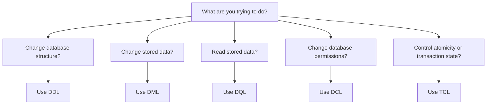
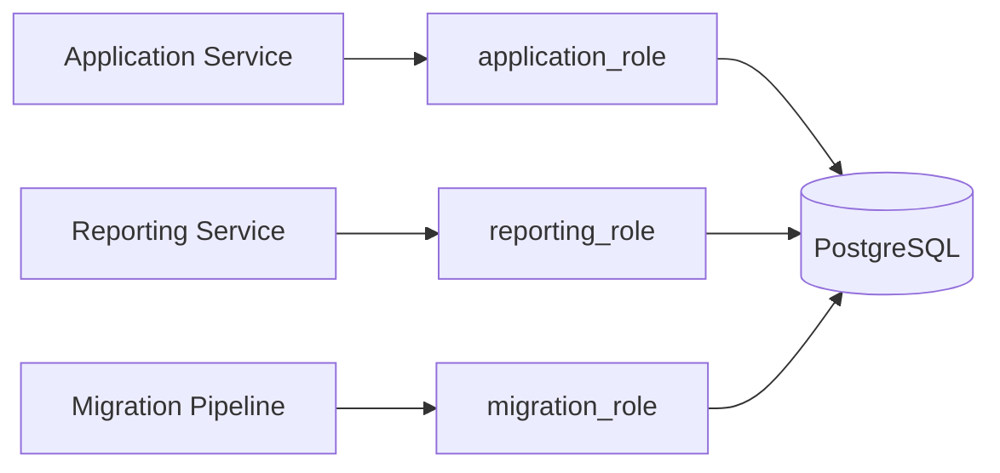
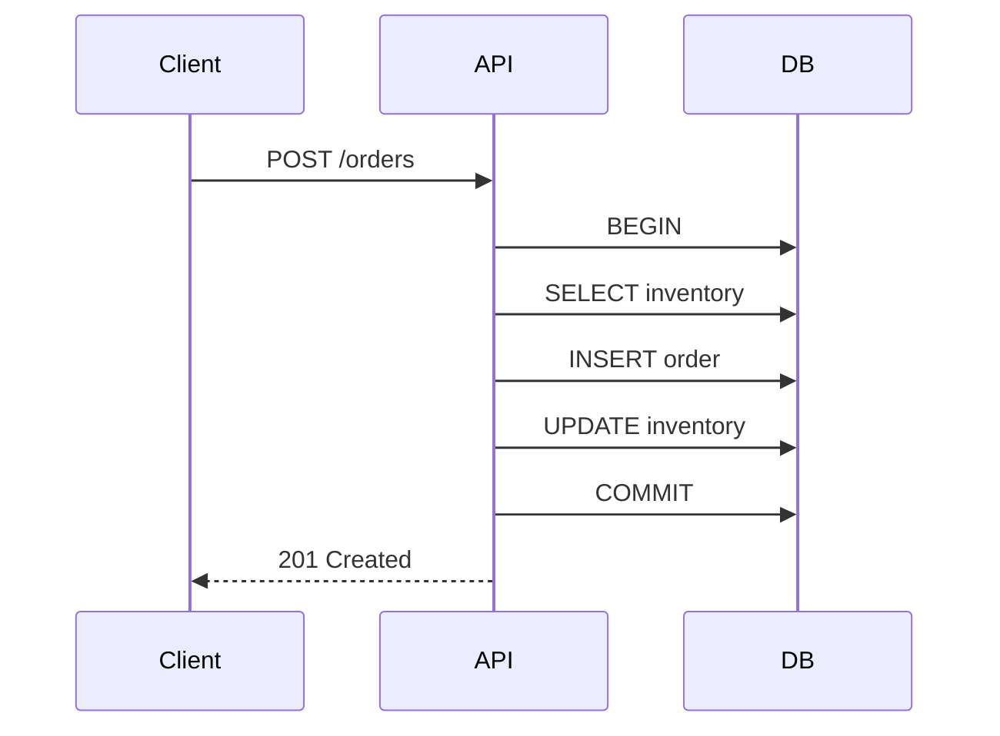

# 07- When to Use Each SQL Command Category

## Overview

SQL command categories are most useful when treated as an engineering decision framework rather than a memorization exercise. The core categories are **DDL**, **DML**, **DQL**, **DCL**, and **TCL**, each addressing a different database responsibility.

In backend systems, choosing the appropriate command category is usually straightforward. The harder engineering problem is determining **where the command should run, under which transaction, with which privileges, and with what operational safeguards**.

| Category | Purpose | Typical commands | Typical execution context |
|---|---|---|---|
| **DDL** | Define or modify database structure | `CREATE`, `ALTER`, `DROP`, `TRUNCATE` | Migrations / CI/CD |
| **DML** | Create, modify, or remove data | `INSERT`, `UPDATE`, `DELETE`, `MERGE` | APIs / workers |
| **DQL** | Retrieve data | `SELECT` | APIs / workers / reporting |
| **DCL** | Control database privileges | `GRANT`, `REVOKE` | Database administration / infrastructure |
| **TCL** | Control transaction boundaries | `BEGIN`, `COMMIT`, `ROLLBACK`, `SAVEPOINT` | Application / database session |

The classification is useful, but exact command classification and transaction semantics can differ between database engines. PostgreSQL is used for examples because it is common in production backend systems.

---

## Choosing a Command Category

A practical decision tree is:



Examples:

- Adding a table → **DDL**
- Adding a customer → **DML**
- Fetching a customer → **DQL**
- Restricting a service role → **DCL**
- Making multiple writes atomic → **TCL**

The category answers **what kind of database operation is being performed**. Production engineering then determines how that operation should be executed safely.

---

## When to Use DDL

DDL is appropriate when the **database structure itself must change**.

Typical use cases:

- Create a table.
- Add or remove a column.
- Change a column definition.
- Add a constraint.
- Create or remove an index.
- Create a view.
- Rename a database object.
- Remove obsolete schema objects.

Example:

```sql
CREATE TABLE orders (
    id BIGSERIAL PRIMARY KEY,
    customer_id BIGINT NOT NULL,
    status VARCHAR(32) NOT NULL,
    created_at TIMESTAMPTZ NOT NULL DEFAULT CURRENT_TIMESTAMP
);
```

Adding an index:

```sql
CREATE INDEX idx_orders_customer_id
ON orders (customer_id);
```

Adding a constraint:

```sql
ALTER TABLE orders
ADD CONSTRAINT orders_status_check
CHECK (status IN ('pending', 'paid', 'cancelled'));
```

### When DDL is the right choice

Use DDL when the requested change would otherwise require modifying the **definition of the database object**.

For example:

```text
"Every order should have a status column"
        ↓
Schema change
        ↓
DDL
```

But:

```text
"Change order 1001 from pending to paid"
        ↓
Data change
        ↓
DML
```

### Production use

DDL should normally be managed through version-controlled migrations.

For Django:

```bash
python manage.py makemigrations
python manage.py migrate
```

For other backend stacks, migration tooling such as Alembic or Flyway can provide the same operational model.

Avoid allowing application startup code to execute arbitrary schema changes against production.

---

## When to Use DML

Use DML when the **stored data changes but the schema does not**.

Typical use cases:

- Create an order.
- Update a user's profile.
- Change payment status.
- Delete an expired record.
- Bulk update records.
- Synchronize records from another system.

Example:

```sql
INSERT INTO orders (customer_id, status)
VALUES (42, 'pending');
```

Updating:

```sql
UPDATE orders
SET status = 'paid'
WHERE id = 1001;
```

Deleting:

```sql
DELETE FROM orders
WHERE id = 1001;
```

### DML in backend APIs

A REST endpoint commonly maps business operations to DML:

```text
POST /orders
    ↓
INSERT

PATCH /orders/1001
    ↓
UPDATE

DELETE /orders/1001
    ↓
DELETE
```

The HTTP method does not technically determine the SQL command, but this mapping is a useful architectural convention.

### When DML needs a transaction

Use a transaction when multiple data changes form one logical business operation.

For example, creating an order and reserving inventory:

```sql
BEGIN;

INSERT INTO orders (customer_id, status)
VALUES (42, 'pending');

UPDATE inventory
SET available_quantity = available_quantity - 1
WHERE product_id = 7
  AND available_quantity > 0;

COMMIT;
```

If the inventory update fails, the order creation should normally not remain committed independently.

That makes DML closely connected with TCL.

---

## When to Use DQL

Use DQL when the application needs to **retrieve data without intentionally modifying it**.

The primary command is `SELECT`.

Example:

```sql
SELECT
    id,
    customer_id,
    status,
    created_at
FROM orders
WHERE customer_id = 42
ORDER BY created_at DESC
LIMIT 50;
```

Typical use cases include:

- API responses.
- Search.
- Dashboards.
- Reporting.
- Data validation.
- Existence checks.
- Administrative tools.
- Background processing.

### DQL in APIs

A typical request flow is:

```text
HTTP request
     ↓
Authentication
     ↓
Authorization
     ↓
Application logic
     ↓
SELECT
     ↓
Database
     ↓
Rows
     ↓
Serialization
     ↓
HTTP response
```

In Django or SQLAlchemy, the ORM may generate the `SELECT` automatically.

### When DQL becomes a performance problem

A `SELECT` is not necessarily cheap.

This query:

```sql
SELECT *
FROM orders;
```

can become expensive as the table grows.

Production queries should generally:

- Select only required columns.
- Filter appropriately.
- Use suitable indexes.
- Paginate large result sets.
- Avoid unnecessary joins.
- Be checked with execution plans.
- Avoid loading unbounded datasets into application memory.

For PostgreSQL:

```sql
EXPLAIN (ANALYZE, BUFFERS)
SELECT
    id,
    status
FROM orders
WHERE customer_id = 42
ORDER BY created_at DESC
LIMIT 50;
```

---

## When to Use DCL

DCL is appropriate when changing **database access privileges**.

Typical commands include:

```sql
GRANT
REVOKE
```

Example:

```sql
GRANT SELECT, INSERT, UPDATE
ON orders
TO application_role;
```

Removing a privilege:

```sql
REVOKE DELETE
ON orders
FROM application_role;
```

### When DCL should be used

Use DCL when:

- A new application service needs database access.
- A service should access only specific tables.
- A reporting role should be read-only.
- A migration role needs schema privileges.
- An application's permissions need to be reduced.
- An employee or service account's access must be revoked.

### Least-privilege architecture

A production system may use separate database identities:



For example:

| Role | Typical responsibility |
|---|---|
| Application role | Read/write application data |
| Reporting role | Read-only access |
| Migration role | Schema changes |
| Administrative role | Database administration |

Do not give every service a superuser-equivalent database identity.

---

## When to Use TCL

Use TCL when a group of database operations must have controlled **transactional behavior**.

Typical commands include:

```sql
BEGIN;
COMMIT;
ROLLBACK;
SAVEPOINT;
ROLLBACK TO SAVEPOINT;
```

### Atomic business operations

Consider transferring money between accounts:

```sql
BEGIN;

UPDATE accounts
SET balance = balance - 500
WHERE id = 101
  AND balance >= 500;

UPDATE accounts
SET balance = balance + 500
WHERE id = 202;

COMMIT;
```

The exact production implementation also needs concurrency control and validation of affected rows. The important principle is that the logical operation should not leave the system halfway between its intended states.

### Savepoints

Savepoints are useful when a transaction contains recoverable sub-operations:

```sql
BEGIN;

INSERT INTO orders (customer_id, status)
VALUES (42, 'pending');

SAVEPOINT optional_step;

-- Perform an operation that may fail.

ROLLBACK TO SAVEPOINT optional_step;

COMMIT;
```

Savepoints do not commit the transaction. They only allow partial rollback within the active transaction.

---

## DDL: Migration vs Runtime

One of the most important production decisions is **when DDL should execute**.

### Prefer migrations

```text
Developer
    ↓
Migration file
    ↓
Code review
    ↓
CI validation
    ↓
Staging
    ↓
Production migration
```

### Avoid runtime schema modification

Do not normally do this:

```python
# Bad architectural pattern
def application_startup():
    execute_sql("ALTER TABLE orders ADD COLUMN ...")
```

The application should not race with itself to modify production schema during startup.

Problems include:

- Multiple application instances executing the same migration.
- Deployment ordering issues.
- Long-running locks.
- Difficult rollback.
- Insufficient review.
- Startup failures.
- Inconsistent application/schema versions.

---

## DML: API vs Batch Job

The same DML operation may require different execution strategies depending on workload.

### Request-driven DML

Use for normal transactional operations:

```text
REST/gRPC request
      ↓
Application validation
      ↓
Transaction
      ↓
INSERT / UPDATE / DELETE
      ↓
Commit
      ↓
Response
```

### Batch DML

For millions of records, avoid one enormous transaction when it is not required.

Instead, process manageable batches:

```text
10 million records
       ↓
Batch 1 → commit
Batch 2 → commit
Batch 3 → commit
...
Batch N → commit
```

Batching can reduce:

- Lock duration
- Transaction memory
- WAL pressure
- Replication lag
- Recovery time

However, batching changes failure semantics. If the entire operation must be atomic, splitting it into independent transactions may not be acceptable.

---

## DQL: OLTP vs Reporting

DQL can serve very different workloads.

| Workload | Characteristics | Typical strategy |
|---|---|---|
| OLTP API | Small, frequent queries | Indexed queries |
| Admin interface | Interactive | Pagination + filtering |
| Analytics | Large scans/aggregations | Analytical database or replicas |
| Reporting | Repeated expensive reads | Read replicas / materialized data |
| Search | Flexible retrieval | Database indexes or search engine |

Do not automatically put expensive analytical queries on the primary OLTP database.

A production architecture may separate workloads:

```text
                    ┌── API → Primary DB
                    │
Application ────────┤
                    │
                    └── Reporting → Read Replica
```

The appropriate architecture depends on consistency requirements, query volume, database capabilities, and cost.

---

## DCL: Application Authorization vs Database Authorization

These controls operate at different layers.

```text
Authenticated User
       ↓
Application authorization
       ↓
"Can this user update order 1001?"
       ↓
Application SQL
       ↓
Database authorization
       ↓
"Can this database role UPDATE orders?"
```

For example, Django may determine that a user can update an order based on application-level permissions.

PostgreSQL then determines whether the database role used by Django is allowed to execute the resulting operation.

Both controls can be valuable.

### Important distinction

DCL does **not** replace application authorization.

Giving a service permission to update `orders` does not mean every user of that service should be allowed to update every order.

---

## TCL: Transaction Scope

A transaction should normally represent a meaningful unit of work.

Good boundary:

```text
Begin transaction
    ↓
Validate/update order
    ↓
Reserve inventory
    ↓
Create order event
    ↓
Commit
```

Poor boundary:

```text
Begin transaction
    ↓
Database operation
    ↓
HTTP request to another service
    ↓
Wait for response
    ↓
Sleep/retry
    ↓
Commit
```

Long transactions can hold locks and consume database resources.

Avoid performing slow external network calls inside database transactions unless the architecture explicitly requires it and the consequences are understood.

For distributed workflows, patterns such as an **outbox pattern**, idempotency, retries, and asynchronous processing are often more appropriate than trying to keep a database transaction open across services.

---

## Command Category by Backend Scenario

| Backend scenario | Primary category | Additional concern |
|---|---|---|
| Add `phone_number` column | DDL | Migration compatibility |
| Create an index | DDL | Locking and index-build cost |
| Register a new user | DML | Validation + transaction |
| Update payment status | DML | Concurrency + idempotency |
| Fetch user profile | DQL | Indexing + authorization |
| Search recent orders | DQL | Query plan + pagination |
| Create reporting role | DCL | Least privilege |
| Remove service access | DCL | Security audit |
| Create order + reserve inventory | DML + TCL | Atomicity + concurrency |
| Bulk data cleanup | DML | Batching + lock impact |
| Change table structure | DDL | Deployment sequencing |

---

## Choosing Between Similar Commands

### `DELETE` vs `TRUNCATE`

Use `DELETE` when you need row-level deletion or a predicate:

```sql
DELETE FROM sessions
WHERE expires_at < CURRENT_TIMESTAMP;
```

Use `TRUNCATE` when the operational requirement is to remove all rows from a table and its database-specific behavior is acceptable:

```sql
TRUNCATE TABLE staging_events;
```

Do not substitute `TRUNCATE` for application-level deletion merely because it is faster.

---

### `DROP` vs `TRUNCATE`

Use `TRUNCATE` when the table structure is still required.

Use `DROP` when the database object itself is obsolete.

```text
Need table later?
    ├── Yes → TRUNCATE data
    └── No  → DROP object
```

Dropping production objects should generally be a deliberate migration step with strong review and rollback planning.

---

### `UPDATE` vs `INSERT`

Use `INSERT` when creating a new row.

Use `UPDATE` when modifying an existing row.

For operations that need "insert if absent, otherwise update", use an appropriate database-specific upsert mechanism.

PostgreSQL example:

```sql
INSERT INTO customer_preferences (customer_id, timezone)
VALUES (42, 'Asia/Kolkata')
ON CONFLICT (customer_id)
DO UPDATE
SET timezone = EXCLUDED.timezone;
```

This is generally preferable to implementing an unsafe application-level:

```text
SELECT
  ↓
if absent → INSERT
else      → UPDATE
```

without appropriate concurrency handling.

---

## Production Decision Matrix

| Question | Preferred consideration |
|---|---|
| Am I changing schema? | DDL through migrations |
| Am I changing rows? | DML |
| Am I reading rows? | DQL |
| Am I changing database privileges? | DCL |
| Must multiple operations succeed together? | TCL + DML |
| Could this query scan millions of rows? | Inspect execution plan |
| Could this change lock a production table? | Assess DDL/locking behavior |
| Could this modify many rows? | Validate predicate and affected-row count |
| Does this service need broad DB privileges? | Prefer least privilege |
| Does this workflow cross services? | Avoid distributed DB transactions where possible |
| Is the operation large? | Consider batching |
| Is the schema change incompatible with current code? | Use expand-and-contract deployment |

---

## Common Mistakes

### Using DDL for Data Changes

Incorrect reasoning:

```text
"I need to remove old customer records, so I will use DROP."
```

`DROP` removes the database object.

If the table must remain, use an appropriate DML operation such as `DELETE`.

### Running Unbounded DML

Dangerous:

```sql
UPDATE orders
SET status = 'cancelled';
```

If only specific orders should change, the predicate must express that scope.

Before a destructive operation, validate the target set:

```sql
SELECT COUNT(*)
FROM orders
WHERE status = 'pending'
  AND created_at < CURRENT_TIMESTAMP - INTERVAL '30 days';
```

Then perform the intended modification.

### Treating Every `SELECT` as Safe

Read operations can still:

- Exhaust CPU.
- Consume memory.
- Saturate I/O.
- Hold locks in specific cases.
- Exhaust connection pools.

### Putting Schema Changes in Application Startup

Schema migrations should be controlled independently from normal request-serving processes.

### Giving the Application Superuser Access

Use a dedicated application role with only the privileges required by the workload.

### Keeping Transactions Open Too Long

Long transactions increase lock lifetime and can interfere with vacuuming, replication, throughput, and overall database health.

### Assuming All Databases Behave the Same

Transaction behavior, locking, DDL semantics, `TRUNCATE`, `MERGE`, upsert syntax, and privilege systems differ between database engines.

Design against the actual database engine in production.

---

## Security Considerations

The command category does not determine whether an operation is secure.

A secure implementation considers:

- Who can initiate the operation.
- Which application code can execute it.
- Which database role executes it.
- Which rows the operation can affect.
- Which columns contain sensitive data.
- Whether the operation is audited.
- Whether untrusted input can influence the SQL.

Always use parameterized queries or safe ORM APIs.

Unsafe:

```python
query = f"SELECT id FROM users WHERE email = '{email}'"
```

Safer:

```python
cursor.execute(
    "SELECT id FROM users WHERE email = %s",
    [email],
)
```

The application should also enforce authorization before executing a DML operation.

---

## Scalability Considerations

As traffic and data volume increase, the category of a command is only the beginning of the analysis.

### DDL scalability

Consider:

- Migration duration.
- Lock acquisition.
- Index build strategy.
- Replication.
- Table size.
- Deployment ordering.

### DML scalability

Consider:

- Batch size.
- Write amplification.
- Lock contention.
- Deadlocks.
- WAL generation.
- Replication lag.

### DQL scalability

Consider:

- Query plans.
- Indexes.
- Result size.
- Connection pools.
- Read replicas.
- Caching.

Redis can reduce repeated reads in appropriate workloads, but cached data introduces invalidation and consistency concerns.

### TCL scalability

Consider:

- Transaction duration.
- Isolation level.
- Lock scope.
- Deadlock frequency.
- Retry behavior.
- Connection occupancy.

---

## Operational Best Practices

For production systems:

- Store schema changes in version control.
- Review migrations like application code.
- Test migrations against realistic data volumes.
- Measure expensive queries with execution plans.
- Keep transactions short.
- Use parameterized SQL.
- Apply least-privilege database roles.
- Monitor query latency and lock contention.
- Validate large `UPDATE` and `DELETE` operations.
- Use batching for large non-atomic data modifications.
- Design migrations for compatibility with rolling deployments.
- Monitor replication lag during high-volume writes or schema changes.
- Maintain backups and test restoration procedures before relying on them for disaster recovery.

A useful operational principle is:

> The SQL category tells you what the operation is; the production workflow determines whether it is safe.

---

## Interview Traps

### Which category does `SELECT` belong to?

Usually DQL in the traditional classification.

Some resources use DML broadly enough to include `SELECT`, so clarify terminology if necessary.

### Is `TRUNCATE` DDL or DML?

It is commonly categorized as DDL, but classifications vary across educational material.

The important point is its database-specific semantics and operational behavior.

### Is `COMMIT` DML?

No. It is normally classified as TCL because it controls the transaction.

### Is `CREATE INDEX` DML?

No. It changes database structure and is generally treated as DDL.

### Does using DML automatically make an operation atomic?

No.

Atomicity comes from transaction semantics and the database's transactional guarantees, not from the fact that a statement is DML.

### Does DCL replace application authorization?

No.

Database privileges and application-level authorization protect different layers.

### Should every DML statement be inside one large transaction?

No.

Transaction scope should correspond to the required consistency boundary. Large transactions can create serious operational problems.

---

## Practical Backend Workflow

Consider an endpoint that creates an order.

The operation may involve multiple SQL categories:



The commands have different roles:

| Operation | Category |
|---|---|
| `BEGIN` | TCL |
| `SELECT inventory` | DQL |
| `INSERT order` | DML |
| `UPDATE inventory` | DML |
| `COMMIT` | TCL |

The schema itself may have been created previously through DDL migrations, while DCL determines whether the application role is allowed to access those tables.

This layered view is more useful than memorizing five command lists.

---

## Senior-Level Decision Framework

When choosing how to execute a SQL operation, ask these questions in order:

1. **What am I changing?**
   - Schema → DDL
   - Data → DML
   - Nothing, only reading → DQL
   - Permissions → DCL
   - Transaction state → TCL

2. **Where should it run?**
   - Migration pipeline
   - API
   - Background worker
   - Administrative workflow

3. **What consistency boundary is required?**
   - Single statement
   - Multi-statement transaction
   - Eventually consistent workflow

4. **What happens under concurrency?**
   - Lost updates
   - Deadlocks
   - Lock contention
   - Serialization failures

5. **What happens at scale?**
   - Millions of rows
   - Large result sets
   - Long transactions
   - Replication lag

6. **What privileges are required?**
   - Application role
   - Read-only role
   - Migration role
   - Administrative role

7. **How will failure be handled?**
   - Rollback
   - Retry
   - Idempotency
   - Compensating action
   - Recovery procedure

This is the difference between knowing SQL syntax and designing reliable database-backed systems.

## Key Takeaways

- **Use DDL for schema changes, DML for data changes, DQL for reads, DCL for database privileges, and TCL for transaction control.**
- **Choose the command category first, then design the execution strategy around transaction boundaries, concurrency, permissions, scale, and failure behavior.**
- **Run production DDL through controlled, versioned migrations; execute application DML/DQL through appropriately scoped transactions and least-privilege database roles.**
- **Large or destructive operations require operational safeguards: execution-plan analysis, affected-row validation, batching where appropriate, lock monitoring, and deployment compatibility.**
- **Senior SQL usage is less about memorizing command categories and more about understanding their impact on correctness, performance, security, availability, and scalability.**