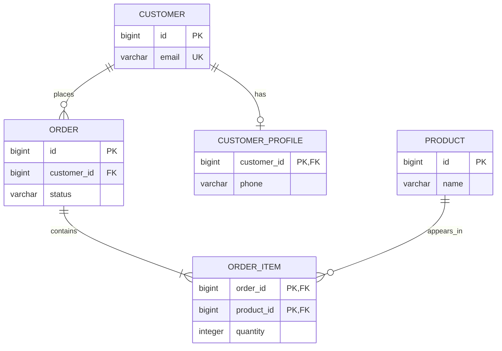

# README

## Overview

Relational Database Fundamentals establish the core concepts required to design, query, and operate SQL-backed systems reliably.

This section focuses on how relational databases model data, enforce relationships and integrity, and organize SQL operations. The concepts here form the foundation for working effectively with PostgreSQL and relational database layers in Django, FastAPI, and other backend systems.

The material progresses from relational modeling and relationships to data integrity, constraints, and the major SQL command categories.

## Navigation

SQL commands can be understood by the responsibility they perform: defining database structures, manipulating data, retrieving data, controlling privileges, and controlling transactions.

- [01- DDL](./01-%20DDL.md) — Define and modify database structures
- [02- DML](./02-%20DML.md) — Insert, update, and delete data
- [03- DQL](./03-%20DQL.md) — Retrieve data with queries
- [04- DCL](./04-%20DCL.md) — Manage database privileges
- [05- TCL](./05-%20TCL.md) — Control transaction boundaries
- [06- Command Category Comparison](./06-%20Command%20Category%20Comparison.md) — Compare SQL command categories
- [07- When to Use Each SQL Command Category](./07-%20When%20to%20Use%20Each%20SQL%20Command%20Category.md) — Select the appropriate command category for backend operations

## Relational Modeling Concepts

A relational schema represents entities as tables and relationships through keys and constraints.



The relationship types covered in this section are:

| Relationship | Typical implementation | Example |
|---|---|---|
| One-to-One | Foreign key + `UNIQUE` | Customer → Profile |
| One-to-Many | Foreign key on the child | Customer → Orders |
| Many-to-Many | Junction table with two foreign keys | Orders ↔ Products |

## Data Integrity Model

Reliable relational systems enforce correctness at multiple layers.

```text
Application
    │
    │ Validation / Authorization
    ▼
Database Transaction
    │
    ├── DML
    │
    ├── Foreign Keys
    ├── UNIQUE
    ├── NOT NULL
    └── CHECK
    │
    ▼
Consistent Database State
```

Application validation improves user experience and API behavior, but database constraints remain the final enforcement boundary for invariants that must never be violated.

For example, an API can validate that an email is unique before inserting a user, but concurrent requests can still race. A database-level `UNIQUE` constraint provides the authoritative guarantee.

## Production Perspective

Relational database design is not only about creating tables that represent business entities. Production schemas must also account for:

- Data integrity and consistency.
- Transaction boundaries.
- Concurrent writes.
- Foreign-key behavior.
- Query performance.
- Index design.
- Schema evolution.
- Backward-compatible migrations.
- Least-privilege database access.
- Backup and recovery.
- Replication and availability.
- Operational impact of large DDL and DML operations.

A strong backend design generally follows this principle:

> Keep business invariants enforceable at the strongest appropriate layer, with the database protecting the integrity of persisted state.

## Recommended Reading Order

For a first pass, follow the material in this order:

1. Understand relational relationships.
2. Learn how `NULL` behaves and why it differs from ordinary values.
3. Study database constraints.
4. Understand data integrity and referential integrity.
5. Apply the principles through database design rules.
6. Learn the SQL command categories.
7. Compare the categories and understand when each should be used.

## Backend Engineering Context

These concepts appear directly in common backend architectures:

| Backend component | Relational database responsibility |
|---|---|
| Django ORM | Maps application models to relational tables |
| FastAPI + SQLAlchemy | Maps API operations to SQL transactions and queries |
| REST API | Common interface for CRUD operations |
| gRPC service | Often performs transactional reads and writes |
| Celery worker | Executes asynchronous DML and batch operations |
| PostgreSQL | Enforces relational constraints and transactional guarantees |
| CI/CD | Executes controlled schema migrations |
| Read replica | Supports read-heavy DQL workloads |
| Redis | Can reduce repeated database reads when caching is appropriate |

The goal is not merely to know SQL syntax. Backend engineers should be able to reason about how schema design, constraints, queries, transactions, application behavior, and operational requirements interact.


## Key Takeaways

- Relational database fundamentals provide the foundation for reliable SQL-backed backend systems.
- Relationships, `NULL` semantics, constraints, and integrity rules determine how correctly data is modeled and protected.
- SQL command categories separate schema changes, data changes, reads, permissions, and transaction control.
- Production database design must account for concurrency, performance, migrations, security, availability, and recovery—not just table structure.
- The database should enforce critical persisted-state invariants rather than relying exclusively on application-level validation.