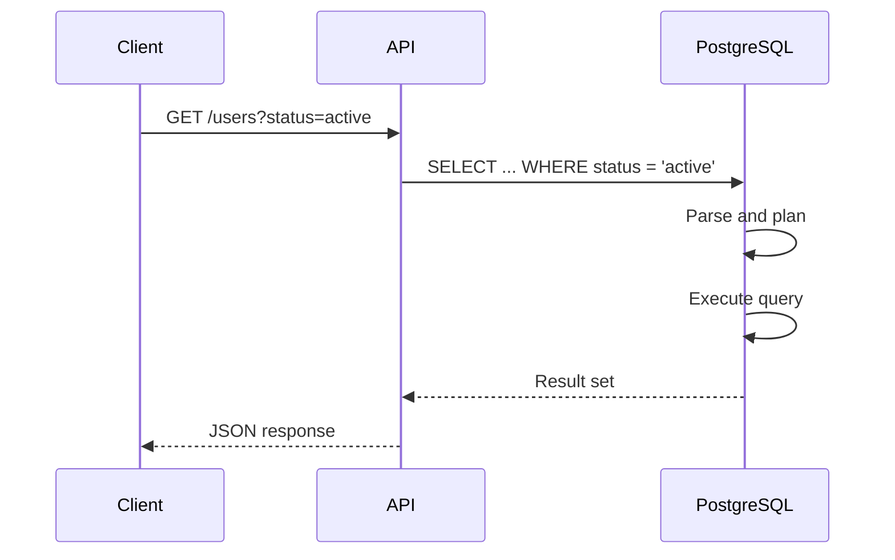
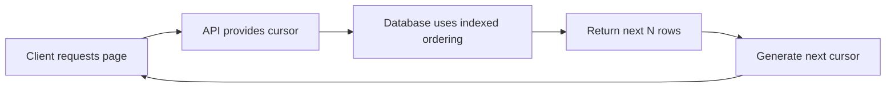

# 01- SELECT Fundamentals

## Overview

`SELECT` is the primary SQL statement for retrieving data from relational databases. It is the foundation for read paths in backend applications, reporting systems, APIs, administrative tools, and data-processing workloads.

A production-quality `SELECT` is more than a list of columns and a table. It defines:

- Which rows are eligible.
- Which columns are returned.
- How tables are related.
- How `NULL` values are interpreted.
- How results are ordered.
- Whether duplicates are removed.
- Whether results are limited or paginated.
- How much work the database must perform.

The basic form is:

```sql
SELECT column1, column2
FROM table_name
WHERE condition;
```

For example:

```sql
SELECT id, email, created_at
FROM users
WHERE status = 'active';
```

The database parses the statement, resolves referenced objects, plans an execution strategy, executes that plan, and returns a result set to the application.

## Why SELECT Matters in Backend Systems

Most backend requests eventually become database reads.



In Django, FastAPI, or other Python services, an ORM often generates the SQL rather than the developer writing it manually. Understanding `SELECT` remains important because ORM abstractions do not remove the underlying database behavior.

A slow ORM query is still a slow SQL query.

## Basic SELECT Structure

A typical query can contain several clauses:

```sql
SELECT [DISTINCT] columns
FROM source
WHERE row_filter
GROUP BY grouping_columns
HAVING group_filter
ORDER BY sort_columns
LIMIT row_count
OFFSET row_offset;
```

Not every query needs every clause.

A useful mental model is:

```text
FROM
  ↓
WHERE
  ↓
GROUP BY
  ↓
HAVING
  ↓
SELECT
  ↓
DISTINCT
  ↓
ORDER BY
  ↓
LIMIT / OFFSET
```

This is the **logical processing order**, not necessarily the physical execution order used by the database engine.

## Selecting Columns

Prefer explicitly selecting the columns required by the application.

```sql
SELECT
    id,
    email,
    created_at
FROM users;
```

Avoid unnecessarily retrieving every column:

```sql
SELECT *
FROM users;
```

### Why Explicit Columns Are Usually Better

Explicit projections:

- Reduce data transferred from database to application.
- Reduce network payload between database and application.
- Avoid retrieving large columns unnecessarily.
- Make API and service dependencies clearer.
- Can enable index-only or covering access paths in some database engines.
- Reduce accidental coupling to future schema changes.

`SELECT *` is not inherently incorrect. It can be appropriate for ad-hoc exploration, debugging, or controlled internal queries. It is usually a poor default for stable production application queries.

## Column Aliases

Aliases provide clearer names in result sets.

```sql
SELECT
    id,
    email AS user_email,
    created_at AS registered_at
FROM users;
```

Aliases are particularly useful when expressions or joins would otherwise produce ambiguous or unclear column names.

```sql
SELECT
    u.id AS user_id,
    u.email,
    p.display_name
FROM users AS u
JOIN profiles AS p
    ON p.user_id = u.id;
```

## Expressions in SELECT

`SELECT` can return computed values rather than only stored columns.

```sql
SELECT
    id,
    quantity,
    unit_price,
    quantity * unit_price AS line_total
FROM order_items;
```

Expressions can include:

- Arithmetic.
- String operations.
- Date/time operations.
- Conditional expressions.
- Functions.
- Type conversions.

Keep frequently reused business calculations centralized when consistency matters. If the same calculation is independently implemented in Python, SQL, reporting tools, and other services, the system can develop semantic inconsistencies.

## DISTINCT

`DISTINCT` removes duplicate rows from the projected result.

```sql
SELECT DISTINCT country
FROM customers;
```

With multiple columns, uniqueness applies to the complete combination:

```sql
SELECT DISTINCT country, city
FROM customers;
```

This is different from selecting unique values from each column independently.

### Production Considerations

`DISTINCT` may require additional database work such as sorting or hashing.

Do not use it simply to hide duplicates caused by an incorrect join.

For example:

```sql
SELECT DISTINCT u.id
FROM users AS u
JOIN orders AS o
    ON o.user_id = u.id;
```

If the real requirement is "users who have at least one order", `EXISTS` often communicates the intent more directly:

```sql
SELECT u.id
FROM users AS u
WHERE EXISTS (
    SELECT 1
    FROM orders AS o
    WHERE o.user_id = u.id
);
```

The optimizer may transform equivalent queries, but expressing the correct relational intent makes queries easier to reason about and maintain.

## WHERE Filtering

`WHERE` filters rows before they participate in later relational operations such as grouping.

```sql
SELECT id, email
FROM users
WHERE status = 'active';
```

Multiple predicates can be combined:

```sql
SELECT id, email
FROM users
WHERE status = 'active'
  AND created_at >= TIMESTAMP '2026-01-01 00:00:00';
```

Use parentheses when combining `AND` and `OR` to make precedence explicit:

```sql
SELECT id, email
FROM users
WHERE status = 'active'
  AND (
      plan = 'pro'
      OR plan = 'enterprise'
  );
```

### Common Predicate Operators

| Operator | Purpose | Example |
|---|---|---|
| `=` | Equality | `status = 'active'` |
| `<>` | Not equal | `status <> 'deleted'` |
| `>` | Greater than | `amount > 100` |
| `>=` | Greater than or equal | `amount >= 100` |
| `<` | Less than | `amount < 100` |
| `<=` | Less than or equal | `amount <= 100` |
| `IN` | Membership | `status IN ('active', 'pending')` |
| `BETWEEN` | Inclusive range | `amount BETWEEN 100 AND 500` |
| `LIKE` | Pattern matching | `email LIKE '%@example.com'` |
| `IS NULL` | Tests for `NULL` | `deleted_at IS NULL` |
| `IS NOT NULL` | Tests for non-`NULL` | `deleted_at IS NOT NULL` |

## NULL and Filtering

`NULL` represents an unknown, missing, or inapplicable value depending on the schema semantics. It is not equivalent to an empty string, zero, or `FALSE`.

This does not work as intended:

```sql
SELECT *
FROM users
WHERE deleted_at = NULL;
```

Use:

```sql
SELECT *
FROM users
WHERE deleted_at IS NULL;
```

SQL uses three-valued logic involving `TRUE`, `FALSE`, and `UNKNOWN`. This matters when predicates contain nullable columns.

For example:

```sql
SELECT *
FROM users
WHERE status <> 'deleted';
```

Rows where `status` is `NULL` do not satisfy this predicate because the comparison evaluates to `UNKNOWN`.

## IN

`IN` is useful when comparing a value against a known set.

```sql
SELECT id, email
FROM users
WHERE status IN ('active', 'pending');
```

It is often clearer than a long chain of `OR` conditions.

Parameterized application code should bind values rather than constructing SQL strings manually.

```python
statuses = ["active", "pending"]

cursor.execute(
    """
    SELECT id, email
    FROM users
    WHERE status = ANY(%s)
    """,
    (statuses,),
)
```

The exact parameter syntax depends on the PostgreSQL driver or database library.

## BETWEEN

`BETWEEN` represents an inclusive range.

```sql
SELECT id, total
FROM orders
WHERE total BETWEEN 100 AND 500;
```

For timestamps, prefer half-open intervals for application time ranges:

```sql
SELECT id
FROM orders
WHERE created_at >= TIMESTAMP '2026-08-01 00:00:00'
  AND created_at <  TIMESTAMP '2026-09-01 00:00:00';
```

This avoids problems around fractional seconds and makes adjacent time windows composable.

## ORDER BY

`ORDER BY` determines result ordering.

```sql
SELECT id, email, created_at
FROM users
ORDER BY created_at DESC;
```

Multiple sort keys can be specified:

```sql
SELECT id, email, created_at
FROM users
ORDER BY created_at DESC, id DESC;
```

The second key acts as a tie-breaker.

### Deterministic Ordering

If an API paginates results, ordering should generally be deterministic.

Avoid:

```sql
SELECT id, email
FROM users
ORDER BY created_at DESC;
```

when many rows can have the same `created_at`.

Prefer:

```sql
SELECT id, email, created_at
FROM users
ORDER BY created_at DESC, id DESC;
```

This is especially important for pagination because rows with equal ordering values otherwise have no guaranteed relative order.

## LIMIT

`LIMIT` restricts the number of returned rows.

```sql
SELECT id, email
FROM users
ORDER BY created_at DESC
LIMIT 50;
```

This is useful for:

- API result limits.
- Top-N queries.
- Administrative interfaces.
- Batch processing.
- Preventing accidental unbounded result sets.

A backend service should generally impose sensible limits rather than allowing arbitrary client-controlled result sizes.

## OFFSET

`OFFSET` skips rows before returning results.

```sql
SELECT id, email
FROM users
ORDER BY created_at DESC, id DESC
LIMIT 50
OFFSET 1000;
```

Offset pagination is easy to implement but can become inefficient for deep pages because the database may need to identify and discard many preceding rows.

For large or frequently changing datasets, keyset pagination is often preferable.

## Keyset Pagination

Keyset pagination uses the ordering key from the previous page.

```sql
SELECT id, email, created_at
FROM users
WHERE (created_at, id) < (
    TIMESTAMP '2026-08-30 10:15:00',
    12345
)
ORDER BY created_at DESC, id DESC
LIMIT 50;
```

The corresponding index can support efficient traversal:

```sql
CREATE INDEX idx_users_created_id
ON users (created_at DESC, id DESC);
```

Conceptually:



Keyset pagination is particularly useful for large datasets where users commonly navigate through recent or sequential records.

## SELECT and Indexes

A `SELECT` does not automatically become fast because a `WHERE` clause exists.

The database optimizer evaluates possible access paths, which may include:

- Sequential scans.
- Index scans.
- Index-only scans.
- Bitmap scans.
- Joins using different join algorithms.
- Sorting or hashing operations.

For example:

```sql
SELECT id, email
FROM users
WHERE email = 'user@example.com';
```

An index such as:

```sql
CREATE UNIQUE INDEX users_email_idx
ON users (email);
```

can make equality lookup efficient.

Inspect production query plans rather than guessing.

```sql
EXPLAIN
SELECT id, email
FROM users
WHERE email = 'user@example.com';
```

For runtime behavior and actual row counts:

```sql
EXPLAIN (ANALYZE, BUFFERS)
SELECT id, email
FROM users
WHERE email = 'user@example.com';
```

`EXPLAIN ANALYZE` executes the query, so use appropriate caution for statements that modify data.

## SELECT Performance Principles

A production `SELECT` should be evaluated against:

| Concern | Question |
|---|---|
| Cardinality | How many rows can this query return? |
| Filtering | Can the database eliminate rows early? |
| Indexing | Is there an appropriate access path? |
| Projection | Are unnecessary columns being returned? |
| Sorting | Is `ORDER BY` expensive or index-supported? |
| Pagination | Will deep offsets become expensive? |
| Joins | Can joins multiply rows unexpectedly? |
| Network | Is too much data transferred? |
| Frequency | Is this query executed thousands of times per minute? |
| Concurrency | Can it create contention or excessive resource usage? |

A query that takes 50 ms once may still be problematic if executed 10,000 times per second.

## SELECT in ORMs

ORMs generate `SELECT` statements on behalf of the application.

### Django

```python
users = (
    User.objects
    .filter(status="active")
    .values("id", "email", "created_at")
    .order_by("-created_at", "-id")[:50]
)
```

The ORM abstraction should be evaluated by inspecting the SQL and query plan when performance matters.

Django's `select_related()` and `prefetch_related()` are especially important for avoiding inefficient relationship loading.

### SQLAlchemy

```python
stmt = (
    select(User.id, User.email, User.created_at)
    .where(User.status == "active")
    .order_by(User.created_at.desc(), User.id.desc())
    .limit(50)
)
```

The same database principles apply regardless of whether SQL is handwritten or generated.

## SQL Injection

Never build production SQL by concatenating untrusted input.

Unsafe:

```python
query = f"""
    SELECT id, email
    FROM users
    WHERE email = '{email}'
"""
cursor.execute(query)
```

Use parameterized queries:

```python
cursor.execute(
    """
    SELECT id, email
    FROM users
    WHERE email = %s
    """,
    (email,),
)
```

ORM query APIs should also use their parameter-binding mechanisms rather than raw string interpolation.

Parameterized queries protect the SQL structure from being interpreted as part of user-provided data.

## Read Consistency and Transactions

`SELECT` is affected by transaction isolation and concurrent writes.

For example, two reads within a transaction may or may not observe the same database state depending on the isolation level.

PostgreSQL's default `READ COMMITTED` isolation means each statement generally sees a snapshot established when that statement begins. Stronger isolation levels provide different consistency guarantees and trade-offs.

When a read determines a subsequent write, consider whether the operation needs to be atomic.

For example, this pattern can be unsafe under concurrency:

```text
SELECT balance
    ↓
Application checks balance
    ↓
UPDATE balance
```

If correctness depends on the relationship between the read and write, use an appropriate transaction and locking or an atomic database operation.

## Common Mistakes

### Fetching Everything

```sql
SELECT *
FROM orders;
```

This can accidentally return millions of rows and consume database, network, application memory, and serialization resources.

Use explicit projections and bounded queries.

### Missing ORDER BY

Without `ORDER BY`, SQL does not guarantee a particular result order.

Do not assume rows will consistently appear in insertion order or primary-key order.

### Using DISTINCT to Hide Join Problems

If a join unexpectedly produces duplicates, first understand the relationship cardinality. `DISTINCT` can mask a modeling or query error.

### Deep OFFSET Pagination

Large offsets can require increasingly expensive work.

Use keyset pagination for large, sequentially accessed datasets when appropriate.

### Ignoring NULL Semantics

Expressions involving `NULL` can produce `UNKNOWN`, affecting filtering and comparisons.

Use `IS NULL`, `IS NOT NULL`, and explicit nullable logic.

### N+1 Queries

An API may execute one query for a list and then one additional query per returned object.

```text
1 query → fetch 100 users
100 queries → fetch each user's profile
------------------------------
101 database queries
```

Use appropriate joins, eager loading, or prefetching strategies.

### Filtering in Application Code

Avoid retrieving a large dataset and then filtering it in Python:

```python
users = list(User.objects.all())
active_users = [user for user in users if user.status == "active"]
```

Prefer pushing filtering into the database:

```python
active_users = User.objects.filter(status="active")
```

The database is optimized for set-based operations and can often use indexes to reduce the amount of data processed.

## Production Query Review Checklist

Before shipping a non-trivial `SELECT`, check:

- [ ] Are only required columns selected?
- [ ] Is the filtering condition correct?
- [ ] Are `NULL` semantics handled correctly?
- [ ] Is ordering deterministic where required?
- [ ] Is the result bounded?
- [ ] Is pagination appropriate for the dataset size?
- [ ] Can the query use an appropriate index?
- [ ] Are joins producing the expected cardinality?
- [ ] Is the query executed frequently enough to justify optimization?
- [ ] Has the query plan been inspected for important workloads?
- [ ] Are parameters bound safely?
- [ ] Does the query behave correctly under concurrent writes?
- [ ] Is ORM-generated SQL producing unnecessary queries?

## Interview Traps

| Question | Strong answer |
|---|---|
| Does SQL guarantee row order without `ORDER BY`? | No. |
| Does `WHERE column = NULL` find nulls? | No. Use `IS NULL`. |
| Does `SELECT *` always perform badly? | No, but it often creates unnecessary data transfer and coupling in production workloads. |
| Does an index guarantee a query will use it? | No. The optimizer chooses an execution plan based on statistics, cost, and available access paths. |
| Is `DISTINCT` always expensive? | Not necessarily, but duplicate elimination can require additional sorting or hashing work. |
| Is `LIMIT` alone pagination? | No. A stable ordering and an appropriate pagination strategy are also required. |
| Is ORM code independent of SQL performance? | No. ORM operations ultimately execute database queries and inherit their performance characteristics. |
| Is `SELECT` always read-only? | Normally it retrieves data, but SQL dialects can support statements where reads are combined with locking or data-modifying constructs. |

## Key Takeaways

- `SELECT` defines a relational read operation; production queries should explicitly control filtering, projection, ordering, and result size.
- SQL uses three-valued logic, so `NULL` must be handled explicitly with `IS NULL` and `IS NOT NULL`.
- Deterministic ordering and keyset pagination are important for reliable APIs operating on large or frequently changing datasets.
- Query performance depends on execution plans, indexes, cardinality, joins, sorting, network transfer, and query frequency—not SQL syntax alone.
- ORMs such as Django and SQLAlchemy abstract SQL generation but do not eliminate the need to understand and optimize the underlying `SELECT` statements.