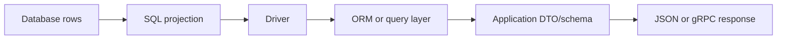

# 02- Selecting Columns and Expressions

## Overview

The `SELECT` list defines the data a SQL query returns. It can contain stored columns, aliases, constants, expressions, functions, conditional logic, and values derived from multiple columns.

For backend systems, selecting the right projection is important because it directly affects:

- Data transferred from the database.
- CPU and memory used by the database.
- Network traffic between database and application.
- Application memory and serialization cost.
- Ability to use index-only access paths.
- Stability of API and service contracts.

A production query should generally select exactly what the caller needs rather than treating the database row as the application response model.

```sql
SELECT
    id,
    email,
    created_at
FROM users
WHERE status = 'active';
```

The result contains only the requested columns:

```text
id | email             | created_at
---+-------------------+------------------------
1  | user@example.com  | 2026-08-30 09:15:00
```

## Selecting Individual Columns

The most common form is selecting one or more columns from a table.

```sql
SELECT id, email, status
FROM users;
```

The order of columns in the `SELECT` list determines the order of columns in the result.

```sql
SELECT email, id, status
FROM users;
```

This returns the same data but with a different result shape.

### Why Explicit Projection Matters

Prefer:

```sql
SELECT id, email, status
FROM users
WHERE id = 42;
```

over:

```sql
SELECT *
FROM users
WHERE id = 42;
```

Explicit projection provides a stable and intentional query contract.

| Concern | Explicit columns | `SELECT *` |
|---|---|---|
| Data transfer | Only required data | Potentially unnecessary data |
| Schema coupling | Lower | Higher |
| Readability | Clear | Less explicit |
| Large columns | Can exclude them | Included automatically |
| Index-only opportunities | Better | Potentially worse |
| Maintenance | Query intent is visible | New columns silently change results |

`SELECT *` is reasonable for exploratory SQL, administrative inspection, or cases where every column is intentionally required. It should not be the default for high-volume application queries.

## Qualified Column Names

When multiple tables contain similarly named columns, qualify columns with a table name or alias.

```sql
SELECT
    users.id,
    users.email,
    profiles.display_name
FROM users
JOIN profiles
    ON profiles.user_id = users.id;
```

Aliases make this more concise:

```sql
SELECT
    u.id,
    u.email,
    p.display_name
FROM users AS u
JOIN profiles AS p
    ON p.user_id = u.id;
```

Qualified columns prevent ambiguity and make query intent easier to understand.

They become especially important in joins involving common columns such as:

- `id`
- `status`
- `created_at`
- `updated_at`
- `name`

## Column Aliases

An alias gives a selected expression a different name in the result set.

```sql
SELECT
    id,
    email AS user_email
FROM users;
```

Aliases are useful when:

- A column needs a clearer result name.
- Two joined tables contain similarly named columns.
- An expression needs a meaningful name.
- SQL output is consumed directly by application code or reporting systems.

For example:

```sql
SELECT
    u.id AS user_id,
    u.email AS user_email,
    p.id AS profile_id,
    p.display_name
FROM users AS u
JOIN profiles AS p
    ON p.user_id = u.id;
```

The result has an unambiguous shape:

```text
user_id | user_email        | profile_id | display_name
--------+-------------------+------------+-------------
42      | user@example.com  | 87         | Aranya
```

### Alias Scope

A `SELECT` alias is normally available to `ORDER BY`, but not to the `WHERE` clause of the same query level.

This works:

```sql
SELECT
    price * quantity AS total
FROM order_items
ORDER BY total DESC;
```

This does not generally work:

```sql
SELECT
    price * quantity AS total
FROM order_items
WHERE total > 100;
```

Use a subquery, CTE, or repeat the expression when appropriate.

```sql
SELECT *
FROM (
    SELECT
        price * quantity AS total
    FROM order_items
) AS items
WHERE total > 100;
```

## Constants

The `SELECT` list can contain literal values.

```sql
SELECT
    id,
    email,
    'active' AS source_status
FROM users;
```

Constants are useful for:

- Adding metadata to result sets.
- Combining result sets with `UNION`.
- Producing API-oriented projections.
- Returning fixed values from database queries.

For example:

```sql
SELECT
    id,
    email,
    'user' AS entity_type
FROM users;
```

Every returned row contains the same `entity_type`.

## Expressions

A `SELECT` expression can calculate a value from one or more columns.

```sql
SELECT
    quantity,
    unit_price,
    quantity * unit_price AS line_total
FROM order_items;
```

Expressions can include:

- Arithmetic operators.
- String functions.
- Date/time operations.
- Conditional expressions.
- Type casts.
- Aggregate functions.
- Database-specific functions.

### Arithmetic Expressions

```sql
SELECT
    subtotal,
    tax,
    subtotal + tax AS total
FROM invoices;
```

Another example:

```sql
SELECT
    quantity,
    unit_price,
    quantity * unit_price AS subtotal,
    quantity * unit_price * 0.18 AS estimated_tax
FROM order_items;
```

Be conscious of the data type involved. Integer division, numeric precision, and overflow behavior can differ between database systems and types.

For monetary values, use an appropriate exact numeric type such as PostgreSQL `numeric` rather than floating-point types when exact decimal semantics are required.

## String Expressions

String expressions can construct derived values.

```sql
SELECT
    first_name || ' ' || last_name AS full_name
FROM users;
```

For PostgreSQL, `concat()` is another option:

```sql
SELECT
    concat(first_name, ' ', last_name) AS full_name
FROM users;
```

Be explicit about `NULL` behavior when constructing strings. Different operators and functions may handle `NULL` differently.

## Date and Time Expressions

Database functions can derive values from timestamps.

```sql
SELECT
    id,
    created_at,
    date_trunc('day', created_at) AS created_day
FROM orders;
```

For duration calculations:

```sql
SELECT
    id,
    completed_at - created_at AS processing_time
FROM jobs
WHERE completed_at IS NOT NULL;
```

Production systems should keep timezone semantics explicit. A timestamp representing an instant should not be casually converted to a local date without considering the application's timezone requirements.

## Conditional Expressions with CASE

`CASE` allows conditional logic inside a query.

```sql
SELECT
    id,
    email,
    CASE
        WHEN status = 'active' THEN 'enabled'
        WHEN status = 'suspended' THEN 'blocked'
        ELSE 'inactive'
    END AS account_state
FROM users;
```

`CASE` is useful when database-side categorization is part of the query's responsibility.

For example:

```sql
SELECT
    id,
    total,
    CASE
        WHEN total >= 1000 THEN 'large'
        WHEN total >= 100 THEN 'medium'
        ELSE 'small'
    END AS order_size
FROM orders;
```

Avoid duplicating complicated business rules across many queries and services. If a rule is a core domain invariant rather than a reporting projection, consider whether it belongs in application/domain logic or a persisted database representation.

## NULL and Expressions

`NULL` propagates through many expressions.

For example:

```sql
SELECT
    subtotal,
    tax,
    subtotal + tax AS total
FROM invoices;
```

If `tax` is `NULL`, `subtotal + tax` will generally produce `NULL`.

Use `COALESCE` when a default is semantically correct:

```sql
SELECT
    subtotal,
    COALESCE(tax, 0) AS tax,
    subtotal + COALESCE(tax, 0) AS total
FROM invoices;
```

Do not automatically replace every `NULL` with a default. `NULL` can represent meaningful information such as "not known", "not applicable", or "not yet calculated".

## COALESCE

`COALESCE` returns the first non-`NULL` expression.

```sql
SELECT
    id,
    COALESCE(display_name, email) AS preferred_name
FROM users;
```

This is useful for fallback values.

```sql
SELECT
    id,
    COALESCE(phone_number, 'Not provided') AS phone
FROM users;
```

The default should reflect business semantics. Replacing missing values indiscriminately can hide data-quality problems.

## CAST and Type Conversion

Expressions can be explicitly converted to another type.

```sql
SELECT
    id,
    CAST(total AS numeric(12, 2)) AS total_amount
FROM orders;
```

PostgreSQL also supports the shorthand:

```sql
SELECT
    total::numeric(12, 2) AS total_amount
FROM orders;
```

Explicit conversion is useful when:

- Comparing compatible types.
- Controlling result representation.
- Performing calculations using a specific numeric type.
- Returning data in a format expected by downstream consumers.

Avoid unnecessary casts on indexed columns in predicates because they can sometimes prevent efficient use of an index, depending on the expression and available index definitions.

## Functions in the SELECT List

Built-in functions can transform selected values.

```sql
SELECT
    id,
    lower(email) AS normalized_email
FROM users;
```

Other examples include:

```sql
SELECT
    id,
    length(display_name) AS name_length
FROM users;
```

Functions can be computationally expensive when applied to millions of rows.

A query such as:

```sql
SELECT
    id,
    expensive_function(payload)
FROM events;
```

may require significant CPU even when only a small amount of data is ultimately needed.

Consider filtering rows first:

```sql
SELECT
    id,
    expensive_function(payload)
FROM events
WHERE event_type = 'payment';
```

The optimizer may reorder physical operations, but expressing selective predicates and understanding the execution plan remain important.

## Aggregate Expressions

The `SELECT` list can contain aggregate functions.

```sql
SELECT
    COUNT(*) AS user_count
FROM users;
```

Common aggregates include:

| Function | Purpose |
|---|---|
| `COUNT(*)` | Count rows |
| `COUNT(column)` | Count non-`NULL` values |
| `SUM(column)` | Sum values |
| `AVG(column)` | Average values |
| `MIN(column)` | Minimum value |
| `MAX(column)` | Maximum value |

Example:

```sql
SELECT
    COUNT(*) AS order_count,
    SUM(total) AS revenue,
    AVG(total) AS average_order_value
FROM orders
WHERE created_at >= TIMESTAMP '2026-08-01 00:00:00';
```

Aggregates change the shape of a query because multiple input rows can produce a single output row.

## DISTINCT in the SELECT List

`DISTINCT` applies to the complete selected row.

```sql
SELECT DISTINCT
    country
FROM users;
```

With multiple expressions:

```sql
SELECT DISTINCT
    country,
    city
FROM users;
```

the database eliminates duplicate `(country, city)` combinations.

Do not assume this means each column is independently unique.

## Selecting from Multiple Tables

A projection can combine columns from related tables.

```sql
SELECT
    o.id AS order_id,
    o.created_at,
    u.id AS user_id,
    u.email
FROM orders AS o
JOIN users AS u
    ON u.id = o.user_id;
```

This is common in backend read paths where an API requires data from multiple relational entities.

The query should return the shape required by the application rather than retrieving complete rows from every joined table.

## Projection and API Design

Consider an API endpoint:

```text
GET /api/orders/123
```

Suppose the response requires:

```json
{
  "id": 123,
  "status": "paid",
  "total": 249.99,
  "customer_email": "user@example.com"
}
```

A targeted SQL query might be:

```sql
SELECT
    o.id AS order_id,
    o.status,
    o.total,
    u.email AS customer_email
FROM orders AS o
JOIN users AS u
    ON u.id = o.user_id
WHERE o.id = $1;
```

The database performs the relational projection and returns only the required values.

This can be preferable to:

```text
Database
  ↓
Complete order row
  ↓
Complete user row
  ↓
Application discards unused fields
  ↓
JSON response
```

The latter unnecessarily moves data through multiple layers.

## Index-Only Access and Projection

Column selection can affect whether an index-only scan is possible.

Suppose:

```sql
CREATE INDEX idx_users_status_id
ON users (status, id);
```

A query requesting only indexed columns may be able to use an index-only access path:

```sql
SELECT id
FROM users
WHERE status = 'active';
```

By contrast, requesting additional columns may require fetching table rows:

```sql
SELECT id, email, profile_json
FROM users
WHERE status = 'active';
```

Whether PostgreSQL actually uses an index-only scan depends on the complete query, index definition, table visibility information, statistics, and planner cost estimates.

Do not create indexes merely to make every projection index-covered. Indexes increase storage, write amplification, vacuum work, and maintenance cost.

## Computation: Database vs Application

A common design question is whether a derived value should be calculated in SQL or application code.

### Prefer SQL when

- The calculation is naturally relational.
- Filtering or sorting depends on the derived value.
- Aggregation is required.
- Moving raw data to the application would be expensive.
- The database can perform the operation efficiently.

Example:

```sql
SELECT
    customer_id,
    SUM(total) AS lifetime_value
FROM orders
GROUP BY customer_id;
```

### Prefer application code when

- The logic is complex domain behavior.
- It requires external services.
- The logic is not naturally relational.
- Reusing the calculation in non-database contexts is important.
- Database-side implementation would become difficult to maintain.

The correct boundary depends on data volume, consistency requirements, ownership of business rules, and operational cost.

## ORM Projection

ORMs provide projection mechanisms for selecting only required fields.

### Django

```python
users = (
    User.objects
    .filter(status="active")
    .values("id", "email", "created_at")
)
```

For model instances where only specific fields should be loaded, Django also provides `only()`, but it should be used carefully because accessing deferred fields can trigger additional queries.

```python
users = (
    User.objects
    .filter(status="active")
    .only("id", "email")
)
```

For read-heavy API endpoints, explicitly designing the projection often provides clearer performance characteristics.

### SQLAlchemy

```python
stmt = (
    select(User.id, User.email, User.created_at)
    .where(User.status == "active")
)
```

The resulting rows contain only the selected expressions.

## Projection and Serialization

A database query is often only one stage of the data path:



Selecting unnecessary columns increases work before serialization even begins.

For high-throughput APIs, reducing the result set can improve:

- Database CPU and I/O.
- Network bandwidth.
- Python object creation.
- JSON serialization.
- Garbage collection pressure.
- API latency.

The improvement depends on the workload; projection should be measured rather than optimized mechanically.

## Security Considerations

Column selection can also be a security boundary.

Do not expose sensitive fields merely because they exist on the database model.

For example, a user table might contain:

```text
id
email
password_hash
mfa_secret
internal_notes
created_at
```

An API query should explicitly select the fields appropriate for the endpoint:

```sql
SELECT
    id,
    email,
    created_at
FROM users
WHERE id = $1;
```

Application authorization must still be enforced. Selecting fewer columns does not replace row-level authorization.

Be particularly careful with:

- Password hashes.
- Authentication secrets.
- API keys.
- Internal administrative fields.
- Personal data.
- Encryption-related metadata.
- Audit information.

## Performance Considerations

When reviewing a projection, ask:

| Question | Why it matters |
|---|---|
| How many columns are returned? | Affects transfer and processing cost |
| Are any columns large? | JSON, text, bytea, and other large values can dominate payload size |
| Are expressions expensive? | Functions can consume significant CPU |
| Can an index-only plan help? | May avoid heap/table reads |
| Is the query high-frequency? | Small inefficiencies multiply under load |
| Is the result bounded? | Prevents unbounded resource consumption |
| Does the ORM load deferred fields later? | Can introduce hidden N+1-style queries |

Use execution plans when investigating important queries:

```sql
EXPLAIN (ANALYZE, BUFFERS)
SELECT
    id,
    email,
    created_at
FROM users
WHERE status = 'active'
ORDER BY created_at DESC
LIMIT 50;
```

Look for:

- Unexpected sequential scans.
- Large row counts.
- Expensive sorts.
- Excessive heap reads.
- Incorrect cardinality estimates.
- Large intermediate result sets.

## Common Mistakes

### Using `SELECT *` Everywhere

It makes query intent unclear and can cause unnecessary data transfer as the schema grows.

Prefer explicit projections for application queries.

### Selecting Sensitive Columns

A broad projection can accidentally expose credentials, secrets, or internal fields.

Treat database schemas and API schemas as different contracts.

### Performing Expensive Computation Unnecessarily

Applying complex functions to every row can consume substantial database CPU.

Filter the dataset appropriately and inspect execution plans.

### Repeating Complex Expressions

This can make SQL difficult to maintain.

If an expression is reused, consider a subquery or CTE where it improves clarity and does not negatively affect the plan.

### Assuming Aliases Work Everywhere

A `SELECT` alias is not generally available to `WHERE` at the same query level.

Understand SQL's logical processing rules and use a subquery or CTE when necessary.

### Loading Deferred ORM Fields Accidentally

In Django, using `only()` or `defer()` can cause additional queries when deferred fields are later accessed.

Profile the complete request rather than assuming a smaller initial query is automatically better.

### Over-Indexing for Projection

Adding an index containing every selected column can make reads faster in specific cases but increases write cost and storage.

Indexes should be justified by workload patterns, not by individual queries in isolation.

## Production Best Practices

- Prefer explicit column lists for stable application queries.
- Use aliases to make result shapes unambiguous.
- Qualify columns when joining multiple tables.
- Keep database projections aligned with actual application requirements.
- Avoid transferring large columns unless they are needed.
- Use parameterized queries for all external input.
- Inspect execution plans for important or slow queries.
- Treat sensitive columns as explicitly protected data.
- Use database-side aggregation when it avoids moving large datasets into application memory.
- Avoid premature covering indexes; evaluate their read benefit against write and storage cost.
- In ORMs, understand the SQL generated by projection APIs such as Django `values()` or SQLAlchemy `select()`.
- Benchmark high-frequency queries under realistic production cardinalities.

## Interview Traps

| Question | Strong answer |
|---|---|
| Why avoid `SELECT *` in production APIs? | It can retrieve unnecessary data, create schema coupling, increase transfer/serialization cost, and reduce projection control. |
| Does selecting fewer columns always make a query faster? | No. It can reduce I/O and transfer cost, but filtering, joins, cardinality, indexes, and execution strategy often dominate. |
| What does `SELECT DISTINCT a, b` mean? | It returns unique combinations of `(a, b)`, not independently unique values of each column. |
| Can a `SELECT` contain calculations? | Yes. The projection can contain arbitrary expressions supported by the database. |
| Can `WHERE` use a `SELECT` alias? | Generally not at the same query level. Use a subquery, CTE, or repeat the expression. |
| Why can an index-only scan be faster? | The database may satisfy the query from the index without fetching every required value from the table heap, subject to engine-specific visibility and planner conditions. |
| Should every selected column be included in an index? | No. Covering indexes can be useful for specific workloads but increase storage and write-maintenance costs. |
| Is ORM projection different from SQL projection conceptually? | No. ORM projection ultimately determines which SQL expressions and columns are requested from the database. |

## Key Takeaways

- The `SELECT` list defines the result shape; production queries should explicitly request the data the application actually needs.
- Columns, aliases, constants, functions, arithmetic, `CASE`, casts, and aggregates can all be used as projection expressions.
- Projection affects database I/O, network transfer, application memory, serialization cost, and sometimes the feasibility of index-only access.
- Database-side computation and application-side computation should be separated based on relational suitability, data volume, consistency, and maintainability.
- Explicit projections also reduce accidental exposure of sensitive fields and keep database queries aligned with API or service contracts.