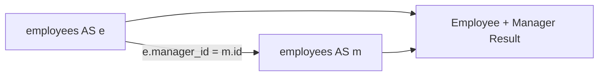

# 03- Aliases

## Overview

A SQL alias assigns a temporary name to a table or expression within a query. Aliases are primarily a readability and result-shaping mechanism, but they become essential when queries contain joins, derived expressions, subqueries, common table expressions, or self-joins.

There are two common forms:

```sql
SELECT
    u.id,
    u.email
FROM users AS u;
```

Here:

- `u` is a **table alias**.
- `id` and `email` are referenced through that alias.

An expression can also receive an alias:

```sql
SELECT
    id,
    email AS user_email
FROM users;
```

Aliases do not rename database objects permanently. They exist only for the duration and scope of the query.

## Why Aliases Matter

Aliases solve two different problems:

| Use case | Example | Primary benefit |
|---|---|---|
| Table alias | `users AS u` | Shorter, unambiguous references |
| Column alias | `email AS user_email` | Controls result-set naming |
| Expression alias | `price * quantity AS total` | Names computed values |
| Self-join alias | `employees e JOIN employees m` | Distinguishes multiple instances of one table |
| Subquery alias | `(SELECT ...) AS recent_orders` | Names a derived relation |
| CTE reference | `WITH active AS (...) SELECT ... FROM active` | Gives a query result a usable relation name |

For production SQL, aliases should make the query easier to reason about rather than merely shorter.

## Table Aliases

A table alias gives a table a temporary name within the query.

```sql
SELECT
    u.id,
    u.email,
    u.created_at
FROM users AS u;
```

The alias can then be used throughout the query:

```sql
SELECT
    u.id,
    u.email,
    o.id AS order_id,
    o.total
FROM users AS u
JOIN orders AS o
    ON o.user_id = u.id
WHERE u.status = 'active';
```

This is especially valuable when joining several tables.

### `AS` and Implicit Aliases

SQL commonly supports both forms:

```sql
FROM users AS u
```

and:

```sql
FROM users u
```

For tables, `AS` is optional in PostgreSQL and many other SQL databases.

For consistency and readability, explicitly using `AS` for table aliases is often preferable in application SQL.

## Choosing Table Alias Names

Good aliases communicate the table's role.

```sql
FROM users AS u
JOIN orders AS o
    ON o.user_id = u.id
```

For more complex queries:

```sql
FROM orders AS o
JOIN users AS customer
    ON customer.id = o.user_id
JOIN users AS sales_rep
    ON sales_rep.id = o.sales_rep_id
```

This is clearer than:

```sql
FROM orders AS a
JOIN users AS b
    ON b.id = a.user_id
JOIN users AS c
    ON c.id = a.sales_rep_id
```

A useful convention is:

| Table | Reasonable alias |
|---|---|
| `users` | `u` |
| `orders` | `o` |
| `products` | `p` |
| `order_items` | `oi` |
| `customers` | `c` |
| `payments` | `pay` |
| `employees` | `e` |

For simple two- or three-table queries, short aliases are usually sufficient. For complex business queries, descriptive aliases can improve maintainability.

## Column Aliases

A column alias changes the name exposed in the result set.

```sql
SELECT
    id,
    email AS user_email
FROM users;
```

The database column remains named `email`. Only the returned column name is changed.

This distinction matters:

```text
Database schema
    email
      │
      │ SELECT email AS user_email
      ▼
Result set
    user_email
```

An alias does not modify the underlying table.

## Aliasing Expressions

Expressions frequently need aliases because otherwise the result column may have an implementation-dependent or inconvenient name.

```sql
SELECT
    quantity,
    unit_price,
    quantity * unit_price AS line_total
FROM order_items;
```

Other examples:

```sql
SELECT
    subtotal,
    tax,
    subtotal + tax AS total
FROM invoices;
```

```sql
SELECT
    first_name,
    last_name,
    concat(first_name, ' ', last_name) AS full_name
FROM users;
```

Aliases are particularly useful when SQL results are consumed by application code.

## Aliases in Joins

Aliases make joined queries both shorter and safer.

Without aliases:

```sql
SELECT
    users.id,
    users.email,
    orders.id,
    orders.total
FROM users
JOIN orders
    ON orders.user_id = users.id;
```

With aliases:

```sql
SELECT
    u.id AS user_id,
    u.email,
    o.id AS order_id,
    o.total
FROM users AS u
JOIN orders AS o
    ON o.user_id = u.id;
```

The second version provides a much clearer result contract.

### Avoid Ambiguous Output Names

This query may technically execute:

```sql
SELECT
    u.id,
    o.id
FROM users AS u
JOIN orders AS o
    ON o.user_id = u.id;
```

But the application receives two result columns both commonly represented as `id`.

Prefer:

```sql
SELECT
    u.id AS user_id,
    o.id AS order_id
FROM users AS u
JOIN orders AS o
    ON o.user_id = u.id;
```

This is especially important when converting rows into dictionaries, DTOs, serializers, or API responses.

## Self-Joins

Aliases are mandatory when the same table appears multiple times in a query.

Consider an employee hierarchy:

```text
employees
-----------
id
name
manager_id
```

To retrieve employees and their managers:

```sql
SELECT
    e.id AS employee_id,
    e.name AS employee_name,
    m.id AS manager_id,
    m.name AS manager_name
FROM employees AS e
LEFT JOIN employees AS m
    ON m.id = e.manager_id;
```

The database treats `e` and `m` as separate references to the same underlying table.



Without aliases, the database cannot distinguish which instance of `employees` a column reference belongs to.

## Aliases for Subqueries

A derived table created by a subquery needs a relation name in systems such as PostgreSQL.

```sql
SELECT
    recent.user_id,
    recent.order_count
FROM (
    SELECT
        user_id,
        COUNT(*) AS order_count
    FROM orders
    WHERE created_at >= CURRENT_DATE - INTERVAL '30 days'
    GROUP BY user_id
) AS recent;
```

Here `recent` is the alias of the subquery result.

The data flow is:

```text
orders
   │
   ▼
filtered + grouped subquery
   │
   ▼
recent
   │
   ▼
outer SELECT
```

The alias provides a name through which the outer query can reference the derived relation.

## Aliases for CTEs

Common table expressions already have a named relation.

```sql
WITH recent_orders AS (
    SELECT
        id,
        user_id,
        total
    FROM orders
    WHERE created_at >= CURRENT_DATE - INTERVAL '30 days'
)
SELECT
    ro.user_id,
    COUNT(*) AS order_count,
    SUM(ro.total) AS revenue
FROM recent_orders AS ro
GROUP BY ro.user_id;
```

Here:

- `recent_orders` names the CTE.
- `ro` is an alias for that CTE inside the outer query.
- `order_count` and `revenue` are output aliases.

Keeping these roles distinct makes complex queries easier to understand.

## Alias Scope

Aliases have a defined scope. A table alias is available within the query level where it is introduced.

For example:

```sql
SELECT
    u.id
FROM users AS u;
```

`u` exists only within this statement.

A nested query has its own scope:

```sql
SELECT
    u.id
FROM users AS u
WHERE EXISTS (
    SELECT 1
    FROM orders AS o
    WHERE o.user_id = u.id
);
```

The inner query can reference the outer `u` because it is correlated with the outer query.

However, an inner alias can hide an outer name if the same alias is reused. Avoid unnecessary alias shadowing because it makes correlated queries difficult to review.

## Column Alias Scope

Column aliases have more restrictive scope than table aliases.

Consider:

```sql
SELECT
    price * quantity AS total
FROM order_items
ORDER BY total DESC;
```

`ORDER BY` can generally reference the output alias.

But this is not valid at the same query level in PostgreSQL:

```sql
SELECT
    price * quantity AS total
FROM order_items
WHERE total > 100;
```

The reason is that `WHERE` operates before the final `SELECT` output names are established.

Use a subquery when the alias needs to be referenced by an outer query:

```sql
SELECT
    item.total
FROM (
    SELECT
        price * quantity AS total
    FROM order_items
) AS item
WHERE item.total > 100;
```

## Logical Query Processing and Aliases

A useful mental model is:

```text
FROM / JOIN
    ↓
WHERE
    ↓
GROUP BY
    ↓
HAVING
    ↓
SELECT
    ↓
DISTINCT
    ↓
ORDER BY
    ↓
LIMIT / OFFSET
```

This is a conceptual processing order, not necessarily the physical execution order chosen by the optimizer.

It explains why a `SELECT` alias generally cannot be referenced from `WHERE` at the same query level:

```sql
SELECT expression AS alias
FROM table
WHERE alias = ...;
```

The alias is created by the `SELECT` projection after the filtering stage in the logical model.

## Aliases with GROUP BY and HAVING

Alias support varies by database and clause.

For portable SQL, avoid relying on output aliases where their availability differs between database systems.

For example:

```sql
SELECT
    customer_id,
    SUM(total) AS revenue
FROM orders
GROUP BY customer_id
HAVING SUM(total) > 1000;
```

This is clearer and more portable than assuming `HAVING revenue > 1000` is accepted by every database.

If a derived value is complex, a subquery or CTE can make the alias a real column of the intermediate result:

```sql
SELECT
    customer_id,
    revenue
FROM (
    SELECT
        customer_id,
        SUM(total) AS revenue
    FROM orders
    GROUP BY customer_id
) AS customer_totals
WHERE revenue > 1000;
```

## Aliases and Application Code

Aliases are particularly useful at the boundary between SQL and backend application code.

For example, a FastAPI service might need:

```json
{
  "order_id": 1001,
  "customer_email": "user@example.com",
  "order_total": 249.99
}
```

The SQL can establish that result shape directly:

```sql
SELECT
    o.id AS order_id,
    u.email AS customer_email,
    o.total AS order_total
FROM orders AS o
JOIN users AS u
    ON u.id = o.user_id
WHERE o.id = $1;
```

This avoids exposing database naming conventions directly when the API's contract uses different names.

The same principle applies to Django, SQLAlchemy, FastAPI, gRPC services, and internal microservice data-access layers.

## Aliases and ORMs

ORMs frequently generate aliases automatically for joins and expressions.

### Django

Django's ORM can produce projected values with explicit names:

```python
orders = (
    Order.objects
    .select_related("user")
    .values(
        "id",
        "user__email",
        "total",
    )
)
```

For custom expressions, Django supports annotations:

```python
from django.db.models import F, DecimalField, ExpressionWrapper

orders = (
    OrderItem.objects
    .annotate(
        line_total=ExpressionWrapper(
            F("quantity") * F("unit_price"),
            output_field=DecimalField(max_digits=12, decimal_places=2),
        )
    )
    .values("id", "line_total")
)
```

The ORM abstraction still maps to the same SQL concept: an expression receives a result name.

### SQLAlchemy

SQLAlchemy supports explicit labels:

```python
stmt = select(
    Order.id.label("order_id"),
    User.email.label("customer_email"),
    Order.total.label("order_total"),
).join(User, User.id == Order.user_id)
```

The resulting SQL projection contains corresponding aliases.

## Production Considerations

Aliases have little direct effect on database performance. They primarily affect query readability and result shape.

However, their use has indirect production implications.

### Stable Result Contracts

For service-to-service queries, explicit aliases can create a stable result shape:

```sql
SELECT
    o.id AS order_id,
    o.status AS order_status,
    o.total AS order_total
FROM orders AS o;
```

This reduces ambiguity when the result is mapped into application objects.

### Avoid Over-Aliasing

This is unnecessarily noisy:

```sql
SELECT
    u.id AS u_id,
    u.email AS u_email,
    u.status AS u_status
FROM users AS u;
```

If the result already has clear names, aliases add little value.

Prefer:

```sql
SELECT
    u.id,
    u.email,
    u.status
FROM users AS u;
```

Use aliases where they resolve ambiguity or communicate an intentional output contract.

### Avoid Fragile Application Mappings

If application code depends on positional columns:

```python
row[0]
row[1]
row[2]
```

the query becomes difficult to evolve safely.

Prefer named result fields:

```python
row["user_id"]
row["email"]
row["order_total"]
```

or strongly typed DTO/schema mappings where the data-access layer supports them.

## Security Considerations

Aliases do not provide security controls.

Changing:

```sql
password_hash AS password
```

does not make the underlying value safe to expose.

Authorization and sensitive-data handling must be enforced independently.

Aliases can, however, help establish an explicit projection so sensitive columns are less likely to be selected accidentally:

```sql
SELECT
    u.id AS user_id,
    u.email,
    u.created_at
FROM users AS u
WHERE u.id = $1;
```

Do not use `SELECT *` and aliases as a substitute for deliberate field-level access control.

## Performance Considerations

The alias itself generally has negligible runtime cost.

The important performance considerations arise from what is being aliased:

```sql
SELECT
    expensive_function(payload) AS transformed_payload
FROM events;
```

The alias `transformed_payload` is cheap; evaluating `expensive_function(payload)` may not be.

Similarly:

```sql
SELECT
    price * quantity AS total
FROM order_items;
```

has essentially no meaningful overhead from the alias.

When performance matters, inspect the actual expression, joins, filtering, aggregation, sorting, and resulting execution plan.

```sql
EXPLAIN (ANALYZE, BUFFERS)
SELECT
    o.id AS order_id,
    o.total AS order_total
FROM orders AS o
WHERE o.customer_id = $1;
```

## Common Mistakes

### Reusing Meaningless Aliases

```sql
FROM users AS a
JOIN orders AS b
    ON b.user_id = a.id
```

This may work, but the aliases provide little semantic value.

Prefer:

```sql
FROM users AS u
JOIN orders AS o
    ON o.user_id = u.id
```

### Creating Duplicate Result Names

```sql
SELECT
    u.id,
    o.id
```

Prefer:

```sql
SELECT
    u.id AS user_id,
    o.id AS order_id
```

### Assuming Aliases Rename Database Columns

```sql
SELECT email AS username
FROM users;
```

This does not rename `email` in the schema. It only changes the output column name for this query.

### Using a SELECT Alias in WHERE

```sql
SELECT
    price * quantity AS total
FROM order_items
WHERE total > 100;
```

Use a subquery or repeat the expression:

```sql
SELECT
    item.total
FROM (
    SELECT
        price * quantity AS total
    FROM order_items
) AS item
WHERE item.total > 100;
```

### Overly Short Aliases in Complex Queries

This:

```sql
FROM orders AS a
JOIN users AS b
JOIN payments AS c
JOIN shipments AS d
```

becomes difficult to reason about as the query grows.

Use role-based aliases where appropriate.

### Relying on ORM-Generated Names

Generated aliases can change as ORM queries evolve.

For externally consumed result shapes, explicitly define important field names rather than coupling application logic to generated SQL names.

## Interview Traps

| Question | Strong answer |
|---|---|
| What is a SQL alias? | A temporary name assigned to a table, expression, or result column within a query. |
| Does `column AS alias` rename the database column? | No. It only changes the name exposed by that query's result set. |
| Why are table aliases important in joins? | They shorten references and prevent ambiguity, especially when tables contain similarly named columns. |
| When are aliases mandatory? | Commonly for self-joins and derived tables; exact syntax requirements vary by database. |
| Can a `WHERE` clause use a `SELECT` alias? | Generally not at the same query level because the alias belongs to the projection stage. |
| Can `ORDER BY` use a `SELECT` alias? | Yes, in commonly used SQL implementations such as PostgreSQL. |
| Do aliases improve query performance? | Usually no. They primarily improve readability and result-set naming. |
| Why alias both `u.id` and `o.id`? | To prevent ambiguous result names such as two `id` fields and establish a clear application-facing result shape. |
| What is a self-join? | Joining a table to itself using different aliases so each reference represents a distinct role or relationship. |
| Are aliases global database objects? | No. They exist only within the scope of the query in which they are defined. |

## Key Takeaways

- Table aliases make joins, self-joins, subqueries, and complex SQL easier to read and prevent column-reference ambiguity.
- Column aliases rename values in the result set; they do not modify the underlying database schema.
- `SELECT` aliases have scope rules: they are commonly available to `ORDER BY` but generally cannot be referenced by `WHERE` at the same query level.
- Use explicit result aliases when SQL feeds APIs, DTOs, serializers, or service boundaries so the output contract is clear and stable.
- Aliases have negligible direct performance impact; optimize the expressions, joins, filtering, aggregation, and access paths behind them.