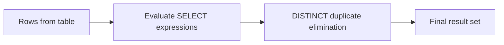

# 04- DISTINCT

## Overview

`DISTINCT` removes duplicate rows from a query result. It operates on the complete set of expressions selected by the query, not on one column independently unless only that column is selected.

The basic form is:

```sql
SELECT DISTINCT column_name
FROM table_name;
```

For backend systems, `DISTINCT` is useful when the query intentionally produces duplicate rows because of joins, or when the application needs a unique set of values. It should not be used automatically to hide an incorrect join or poorly designed query.

## Why DISTINCT Exists

Relational queries can naturally produce duplicate result rows.

For example, a customer can have multiple orders:

```text
customers
+----+----------+
| id | name     |
+----+----------+
| 1  | Aranya   |
+----+----------+

orders
+----+-----------+
| id | customer  |
+----+-----------+
| 10 | 1         |
| 11 | 1         |
| 12 | 1         |
+----+-----------+
```

A join returns one row per matching order:

```sql
SELECT
    c.id,
    c.name
FROM customers AS c
JOIN orders AS o
    ON o.customer_id = c.id;
```

Result:

```text
id | name
---+-------
1  | Aranya
1  | Aranya
1  | Aranya
```

If the application needs each customer only once:

```sql
SELECT DISTINCT
    c.id,
    c.name
FROM customers AS c
JOIN orders AS o
    ON o.customer_id = c.id;
```

Result:

```text
id | name
---+-------
1  | Aranya
```

The important engineering question is not "How do I remove duplicates?" but:

> Why did the query produce duplicates, and does the application actually need duplicate elimination?

## Basic Syntax

```sql
SELECT DISTINCT
    expression_1,
    expression_2,
    ...
FROM table_name;
```

Example:

```sql
SELECT DISTINCT
    status
FROM orders;
```

This returns each distinct `status` value once.

For example:

```text
status
--------
pending
paid
shipped
cancelled
```

## DISTINCT Applies to the Entire Selected Row

A common misconception is that `DISTINCT` applies independently to each selected column.

It does not.

Consider:

```sql
SELECT DISTINCT
    city,
    country
FROM customers;
```

The database considers the combination `(city, country)`.

Given:

```text
city       | country
-----------+--------
London     | UK
London     | UK
London     | Canada
```

The result is:

```text
city       | country
-----------+--------
London     | UK
London     | Canada
```

The two rows are different because their complete selected tuples differ.

### Practical Rule

```sql
SELECT DISTINCT a, b
```

means:

> Return unique `(a, b)` combinations.

It does **not** mean:

> Return unique `a` values and independently unique `b` values.

## DISTINCT with Expressions

`DISTINCT` operates on the values produced by the selected expressions.

```sql
SELECT DISTINCT
    LOWER(email) AS normalized_email
FROM users;
```

If the table contains:

```text
User@Example.com
user@example.com
ADMIN@example.com
```

the expression is evaluated and then duplicate elimination is applied to the resulting values.

The conceptual flow is:



This is useful when the application considers transformed values equivalent.

## DISTINCT with WHERE

`WHERE` filters rows before duplicate elimination in the logical query-processing model.

```sql
SELECT DISTINCT
    customer_id
FROM orders
WHERE status = 'completed';
```

Conceptually:

```text
orders
  ↓
WHERE status = 'completed'
  ↓
SELECT customer_id
  ↓
DISTINCT
  ↓
unique customer IDs
```

This is generally preferable to selecting a larger dataset and deduplicating it later in application code.

## DISTINCT with ORDER BY

You can order a distinct result:

```sql
SELECT DISTINCT
    status
FROM orders
ORDER BY status;
```

This returns unique statuses in sorted order.

However, database-specific rules apply when `ORDER BY` references an expression that is not part of the distinct result.

For portable SQL, keep the ordering expression aligned with the projected columns unless you specifically rely on your database's documented behavior.

## DISTINCT with JOINs

One of the most common production uses of `DISTINCT` is removing duplicate parent rows introduced by one-to-many joins.

Example:

```sql
SELECT DISTINCT
    u.id,
    u.email
FROM users AS u
JOIN orders AS o
    ON o.user_id = u.id
WHERE o.status = 'completed';
```

This answers:

> Which users have at least one completed order?

However, `EXISTS` is often a better expression of that intent:

```sql
SELECT
    u.id,
    u.email
FROM users AS u
WHERE EXISTS (
    SELECT 1
    FROM orders AS o
    WHERE o.user_id = u.id
      AND o.status = 'completed'
);
```

The difference is important.

### `DISTINCT` Approach

```text
users
  ↓
JOIN orders
  ↓
potentially many rows per user
  ↓
DISTINCT
  ↓
one row per user
```

### `EXISTS` Approach

```text
users
  ↓
check whether matching order exists
  ↓
return user once
```

When the requirement is existence rather than retrieving child rows, `EXISTS` often communicates intent more directly and can avoid generating unnecessary joined rows.

## DISTINCT vs GROUP BY

`DISTINCT` and `GROUP BY` can sometimes produce equivalent results:

```sql
SELECT DISTINCT
    customer_id
FROM orders;
```

and:

```sql
SELECT
    customer_id
FROM orders
GROUP BY customer_id;
```

But they express different intent.

| Requirement | Preferred construct |
|---|---|
| Remove duplicate result rows | `DISTINCT` |
| Calculate aggregates per group | `GROUP BY` |
| Test whether a related row exists | `EXISTS` |
| Select one row according to a defined rule | Window function / database-specific technique |
| Count unique values | `COUNT(DISTINCT column)` |

Prefer `DISTINCT` when the actual requirement is uniqueness rather than aggregation.

## COUNT(DISTINCT)

`DISTINCT` can be used inside aggregate functions.

```sql
SELECT COUNT(DISTINCT customer_id) AS unique_customers
FROM orders;
```

This counts unique `customer_id` values rather than counting all order rows.

For example:

```text
orders
customer_id
-----------
10
10
20
30
30
```

Then:

```sql
SELECT COUNT(DISTINCT customer_id)
FROM orders;
```

returns:

```text
3
```

### Important Difference

These are different operations:

```sql
COUNT(*)
```

Counts rows.

```sql
COUNT(customer_id)
```

Counts non-NULL `customer_id` values.

```sql
COUNT(DISTINCT customer_id)
```

Counts unique non-NULL `customer_id` values.

## NULL and DISTINCT

`DISTINCT` treats duplicate `NULL` values as one distinct result value.

For example:

```sql
SELECT DISTINCT
    referral_code
FROM users;
```

If several rows have `NULL` referral codes, the result contains a single `NULL` value.

This differs from ordinary equality semantics because:

```sql
NULL = NULL
```

does not evaluate to `TRUE`.

The database's duplicate-elimination semantics are separate from SQL's three-valued logic for ordinary comparisons.

## PostgreSQL DISTINCT ON

PostgreSQL provides an additional feature:

```sql
SELECT DISTINCT ON (customer_id)
    customer_id,
    id,
    created_at,
    total
FROM orders
ORDER BY
    customer_id,
    created_at DESC;
```

This returns one row per `customer_id`, specifically the first row according to the `ORDER BY` ordering.

For example, it can retrieve the latest order for each customer.

### Why ORDER BY Matters

This:

```sql
SELECT DISTINCT ON (customer_id)
    customer_id,
    id,
    created_at
FROM orders
ORDER BY customer_id, created_at DESC;
```

means:

> For each customer, retain the first row encountered under this ordering.

Without a deterministic ordering that specifies which row should win, the selected row is not something application logic should depend on.

`DISTINCT ON` is PostgreSQL-specific and therefore should not be used when cross-database portability is a requirement.

## DISTINCT ON vs Window Functions

The same latest-per-customer requirement can be expressed using a window function:

```sql
SELECT
    customer_id,
    id,
    created_at,
    total
FROM (
    SELECT
        o.*,
        ROW_NUMBER() OVER (
            PARTITION BY customer_id
            ORDER BY created_at DESC, id DESC
        ) AS row_number
    FROM orders AS o
) AS ranked
WHERE row_number = 1;
```

The window-function approach is more portable and provides more control over ranking.

For example, it can easily select the top three orders per customer:

```sql
ROW_NUMBER() OVER (
    PARTITION BY customer_id
    ORDER BY created_at DESC
)
```

followed by:

```sql
WHERE row_number <= 3
```

## DISTINCT and Query Execution

At the logical level, duplicate elimination happens after the selected expressions are produced.

Physically, the database optimizer can implement it using different strategies.

Common approaches include:

- Sorting rows and removing adjacent duplicates.
- Building a hash-based structure of distinct values.
- Exploiting an existing ordered access path.
- Combining duplicate elimination with another operation where possible.

The exact execution strategy depends on the database, statistics, indexes, query shape, available memory, and optimizer decisions.

Inspect the execution plan rather than assuming how `DISTINCT` will execute.

In PostgreSQL:

```sql
EXPLAIN (ANALYZE, BUFFERS)
SELECT DISTINCT
    customer_id
FROM orders
WHERE status = 'completed';
```

## Performance Considerations

`DISTINCT` can be inexpensive for a small result set but expensive for large intermediate datasets.

Consider:

```sql
SELECT DISTINCT
    u.id,
    u.email,
    u.name,
    u.created_at,
    o.total,
    o.created_at
FROM users AS u
JOIN orders AS o
    ON o.user_id = u.id;
```

If the join generates millions of rows, the database may need substantial work to determine which complete rows are duplicates.

More importantly, the rows are not duplicates if any selected value differs.

For example:

```text
user_id | email          | order_total
--------+----------------+------------
1       | a@example.com  | 100
1       | a@example.com  | 200
```

`DISTINCT` cannot collapse these rows because they are different tuples.

### Better Query Design

If the requirement is simply:

> Find users who have orders.

Use:

```sql
SELECT
    u.id,
    u.email
FROM users AS u
WHERE EXISTS (
    SELECT 1
    FROM orders AS o
    WHERE o.user_id = u.id
);
```

Rather than:

```sql
SELECT DISTINCT
    u.id,
    u.email
FROM users AS u
JOIN orders AS o
    ON o.user_id = u.id;
```

The first query directly expresses the business condition.

## Indexing Considerations

An index can help the database efficiently locate and process distinct values, but `DISTINCT` does not automatically imply that an index will be used.

For example:

```sql
SELECT DISTINCT
    customer_id
FROM orders
WHERE status = 'completed';
```

A potentially useful index depends on the data distribution and query workload.

For PostgreSQL, an index such as:

```sql
CREATE INDEX CONCURRENTLY idx_orders_status_customer
ON orders (status, customer_id);
```

may help this access pattern.

But indexes should be justified using actual workload and execution plans. Adding an index solely because a query contains `DISTINCT` can increase write cost, storage consumption, and maintenance overhead without improving performance.

## DISTINCT in API and Backend Systems

Consider an API endpoint:

```text
GET /users?country=IN
```

The service may need to return unique countries, categories, tags, or other values.

A database-side query:

```sql
SELECT DISTINCT
    country
FROM users
WHERE country IS NOT NULL
ORDER BY country;
```

is usually preferable to:

```python
countries = list(set(user.country for user in users))
```

because the database can perform filtering and duplicate elimination close to the data.

However, if the dataset is already loaded into Python for another business operation, deduplicating in application memory may be appropriate. The correct location for duplicate elimination depends on where the data already exists and how much data must cross the database/application boundary.

## DISTINCT in Django

Django supports distinct queries:

```python
users = (
    User.objects
    .filter(orders__status="completed")
    .distinct()
)
```

This commonly translates into SQL containing `DISTINCT`.

The generated query should still be understood when performance matters.

For example:

```python
users = (
    User.objects
    .filter(orders__status="completed")
    .distinct()
    .only("id", "email")
)
```

Avoid using `.distinct()` merely because a queryset unexpectedly contains duplicates. First determine whether the relationship traversal or join is producing a result set different from the intended business semantics.

For PostgreSQL-specific behavior, Django also supports field-specific distinctness through `distinct("field")`, which maps to PostgreSQL's `DISTINCT ON` semantics and has ordering requirements.

## Production Pitfalls

### Using DISTINCT to Hide a Bad Join

This is a common anti-pattern:

```sql
SELECT DISTINCT
    u.id,
    u.email
FROM users AS u
JOIN orders AS o
    ON o.user_id = u.id
JOIN order_items AS oi
    ON oi.order_id = o.id;
```

If duplicates appear because the query joins through an unintended one-to-many relationship, `DISTINCT` may hide the problem without fixing the underlying query.

Ask:

- Is the join relationship correct?
- Should child rows actually be returned?
- Is `EXISTS` more appropriate?
- Should aggregation be used?
- Is the application asking for one row or many?

### Using DISTINCT to Implement "Latest Row"

This is incorrect:

```sql
SELECT DISTINCT
    customer_id,
    created_at,
    total
FROM orders;
```

`DISTINCT` does not mean "latest row per customer."

Use `DISTINCT ON` in PostgreSQL or a window function when one row must be selected according to a defined ordering.

### Applying DISTINCT to Too Many Columns

This:

```sql
SELECT DISTINCT
    u.id,
    u.email,
    u.name,
    u.address,
    u.created_at,
    ...
FROM users AS u
JOIN ...;
```

requires uniqueness to be determined across the entire projected tuple.

If only `u.id` is needed for uniqueness, selecting unnecessary columns can increase work and may prevent expected duplicate elimination.

### Assuming DISTINCT Is Free

`DISTINCT` can require sorting, hashing, memory, or processing of large intermediate result sets.

Always consider the cardinality of the data before and after joins and filters.

### Deduplicating After Fetching Large Data

Avoid fetching hundreds of thousands of duplicate rows into Python only to deduplicate them:

```python
rows = cursor.fetchall()
unique_ids = set(row["customer_id"] for row in rows)
```

When the database can efficiently perform the operation:

```sql
SELECT DISTINCT customer_id
FROM orders;
```

it can reduce network transfer and application memory usage.

## Security Considerations

`DISTINCT` has no authorization semantics.

It does not prevent unauthorized rows from being returned:

```sql
SELECT DISTINCT email
FROM users;
```

Still requires appropriate authorization and tenant filtering.

In a multi-tenant system, uniqueness must be evaluated in the correct security scope:

```sql
SELECT DISTINCT
    email
FROM users
WHERE tenant_id = $1;
```

Do not assume that deduplicating output makes cross-tenant data exposure safe.

## Reliability and Scalability

For high-volume systems:

- Measure the number of rows entering the distinct operation.
- Filter as early as practical.
- Select only required columns.
- Prefer `EXISTS` when the requirement is existence.
- Use aggregation when the requirement is aggregation.
- Use window functions or `DISTINCT ON` when selecting a deterministic representative row.
- Inspect execution plans for expensive distinct operations.
- Validate indexes against actual workload rather than adding them mechanically.
- Consider pagination carefully when the distinct operation must happen before producing a stable result set.

In distributed or replicated architectures, perform uniqueness at the system boundary where the relevant complete dataset is available. Redis, Kafka, or application-level deduplication may solve a different problem from SQL result-set deduplication.

## Practical Comparison

| Requirement | Recommended approach |
|---|---|
| Unique values | `SELECT DISTINCT column` |
| Unique combinations | `SELECT DISTINCT column1, column2` |
| Count unique values | `COUNT(DISTINCT column)` |
| Check whether a related row exists | `EXISTS` |
| Aggregate per group | `GROUP BY` |
| Latest row per group in PostgreSQL | `DISTINCT ON` |
| Latest row per group, portable | `ROW_NUMBER()` |
| Remove accidental duplicates caused by a bad join | Fix the join rather than blindly adding `DISTINCT` |

## Common Mistakes

| Mistake | Why it happens | Better approach |
|---|---|---|
| Adding `DISTINCT` whenever duplicates appear | Treats symptoms instead of query semantics | Inspect the joins and required cardinality |
| Assuming `DISTINCT` applies to one column | Misunderstanding tuple-level uniqueness | Remember that all selected expressions participate |
| Using `DISTINCT` for latest-row selection | Confusing uniqueness with ordering | Use `DISTINCT ON` or window functions |
| Selecting unnecessary columns with `DISTINCT` | `SELECT *` habits | Project only required fields |
| Deduplicating large query results in Python | Database/application boundary is overlooked | Push suitable filtering and deduplication into SQL |
| Assuming `DISTINCT` is always fast | Ignoring intermediate cardinality | Check `EXPLAIN ANALYZE` |
| Using PostgreSQL-specific `DISTINCT ON` unintentionally | Database portability overlooked | Use window functions when portability matters |

## Interview Traps

| Question | Strong answer |
|---|---|
| What does `DISTINCT` do? | Removes duplicate result rows based on the complete selected tuple. |
| Does `SELECT DISTINCT a, b` make `a` and `b` independently unique? | No. It makes the `(a, b)` combination unique. |
| Is `DISTINCT` the same as `GROUP BY`? | They can produce equivalent results for simple projections, but `DISTINCT` expresses duplicate elimination while `GROUP BY` expresses grouping and is normally used with aggregates. |
| When might `EXISTS` be better than `DISTINCT`? | When the requirement is only to determine whether a related row exists. It avoids generating and then deduplicating unnecessary join rows. |
| Does `DISTINCT` guarantee which row is returned? | No. It only removes duplicate result tuples. It does not select a preferred row from multiple different rows. |
| How do you get the latest row per customer? | Use a deterministic window-function query or PostgreSQL's `DISTINCT ON` with an appropriate `ORDER BY`. |
| What is `DISTINCT ON`? | A PostgreSQL-specific feature that keeps the first row for each distinct value of specified expressions according to the query's ordering. |
| Can `DISTINCT` be expensive? | Yes. Large intermediate result sets may require significant sorting, hashing, memory, or I/O. |
| Does `DISTINCT` modify stored data? | No. It only changes the query result. |
| How should you investigate a slow `DISTINCT` query? | Examine cardinality, joins, projections, indexes, and the actual execution plan using tools such as PostgreSQL `EXPLAIN (ANALYZE, BUFFERS)`. |

## Key Takeaways

- `DISTINCT` removes duplicate **result tuples**, so `SELECT DISTINCT a, b` makes the `(a, b)` combination unique rather than each column independently.
- Use `DISTINCT` for intentional duplicate elimination, not as a generic fix for incorrect joins or misunderstood cardinality.
- Prefer `EXISTS` for existence checks, `GROUP BY` for aggregation, and window functions or PostgreSQL `DISTINCT ON` for deterministic per-group row selection.
- On large datasets, `DISTINCT` can be expensive because duplicate elimination may require substantial sorting, hashing, memory, or I/O.
- Push appropriate filtering and projection into SQL, inspect execution plans, and choose the operator that most directly expresses the business requirement.