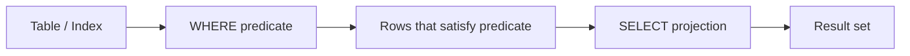
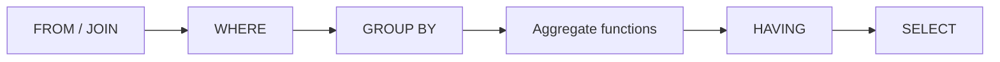
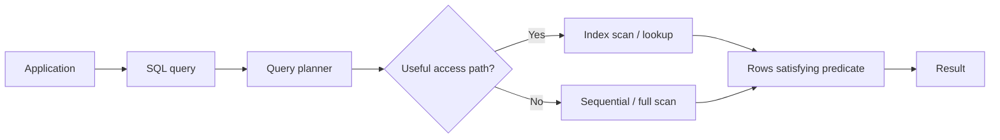
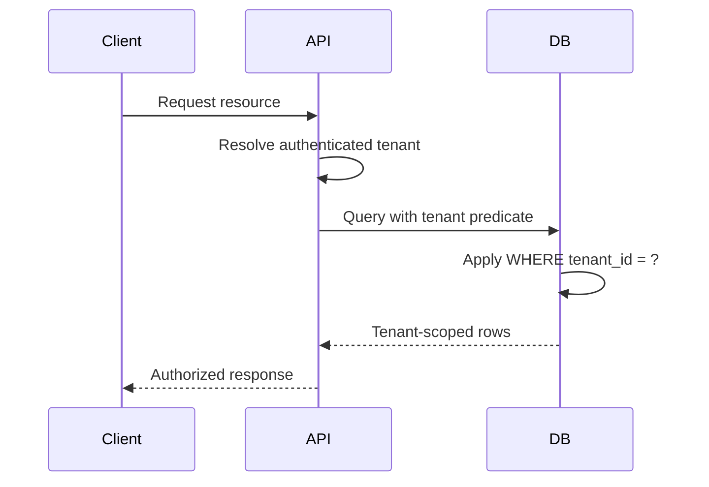

# 05- WHERE Clause

## Overview

The `WHERE` clause filters rows before they participate in the rest of the query result. It is one of the most important mechanisms for controlling **which records a query is allowed to process and return**.

A basic query is:

```sql
SELECT
    id,
    email,
    status
FROM users
WHERE status = 'active';
```

Conceptually:



For production backend systems, `WHERE` is not merely a filtering syntax. Predicate design directly affects:

- Query correctness
- Index usage
- CPU and I/O
- Network traffic
- Lock duration
- Transaction duration
- API latency
- Database scalability
- Multi-tenant data isolation
- Security boundaries

A senior engineer should therefore understand not only how to write a `WHERE` condition, but also how the database evaluates predicates, how `NULL` affects them, how predicates interact with indexes, and how poorly written filters can become production bottlenecks.

## Basic Syntax

```sql
SELECT column1, column2
FROM table_name
WHERE condition;
```

Example:

```sql
SELECT
    id,
    email
FROM users
WHERE country = 'IN';
```

The `WHERE` clause accepts a predicate that evaluates to one of three SQL logical states:

| Result | Meaning |
|---|---|
| `TRUE` | Row satisfies the condition and is retained |
| `FALSE` | Row does not satisfy the condition |
| `UNKNOWN` | Usually caused by `NULL`; row is not retained |

Only rows for which the `WHERE` predicate evaluates to `TRUE` are returned.

## Comparison Operators

The most common comparison operators are:

| Operator | Meaning | Example |
|---|---|---|
| `=` | Equal | `status = 'active'` |
| `<>` | Not equal | `status <> 'deleted'` |
| `!=` | Not equal in many databases | `status != 'deleted'` |
| `>` | Greater than | `total > 1000` |
| `>=` | Greater than or equal | `total >= 1000` |
| `<` | Less than | `total < 1000` |
| `<=` | Less than or equal | `total <= 1000` |

Example:

```sql
SELECT
    id,
    total
FROM orders
WHERE total >= 1000;
```

Prefer standard SQL syntax such as `<>` when portability matters.

## Filtering Text

String comparisons depend on database collation, data type, and configuration.

```sql
SELECT
    id,
    email
FROM users
WHERE email = 'user@example.com';
```

Do not assume that string comparison is case-insensitive.

For PostgreSQL, for example:

```sql
SELECT
    id,
    email
FROM users
WHERE email = 'User@example.com';
```

does not generally behave the same as a case-insensitive comparison.

If the application has case-insensitive identity requirements, model that requirement explicitly rather than relying on accidental database behavior.

For PostgreSQL, one option is:

```sql
SELECT
    id,
    email
FROM users
WHERE email ILIKE 'user@example.com';
```

However, for frequently queried identity fields such as email addresses, a normalized representation and an appropriate unique index are usually preferable to repeatedly applying case-insensitive operations at query time.

## Logical Operators

Multiple predicates can be combined using:

- `AND`
- `OR`
- `NOT`

### AND

Every condition must be true.

```sql
SELECT
    id,
    email
FROM users
WHERE status = 'active'
  AND country = 'IN';
```

Conceptually:

```text
status = active
        AND
country = IN
        ↓
both conditions must be TRUE
```

### OR

At least one condition must be true.

```sql
SELECT
    id,
    email
FROM users
WHERE country = 'IN'
   OR country = 'US';
```

### NOT

Negates a predicate.

```sql
SELECT
    id,
    email
FROM users
WHERE NOT status = 'deleted';
```

For simple comparisons, this is often clearer:

```sql
WHERE status <> 'deleted'
```

Be careful with `NOT` and `NULL`, because SQL's three-valued logic means negating `UNKNOWN` still produces `UNKNOWN`.

## Operator Precedence

SQL evaluates logical operators according to precedence rules.

A useful simplified ordering is:

```text
NOT
AND
OR
```

Therefore:

```sql
WHERE a = 1
   OR b = 2
  AND c = 3
```

is interpreted as:

```sql
WHERE a = 1
   OR (b = 2 AND c = 3)
```

Do not rely on readers remembering precedence rules. Use parentheses when the business logic contains multiple `AND` and `OR` conditions:

```sql
WHERE (
    status = 'active'
    AND country = 'IN'
)
OR is_admin = TRUE;
```

Parentheses make intent explicit and reduce production bugs.

## BETWEEN

`BETWEEN` expresses an inclusive range.

```sql
SELECT
    id,
    total
FROM orders
WHERE total BETWEEN 100 AND 500;
```

This is equivalent to:

```sql
WHERE total >= 100
  AND total <= 500
```

Both boundaries are included.

### Date-Time Trap

Avoid using `BETWEEN` for daily timestamp filtering when the upper boundary is intended to represent the beginning of the next day.

This is fragile:

```sql
WHERE created_at BETWEEN '2026-08-01 00:00:00'
                     AND '2026-08-01 23:59:59';
```

It can miss values with fractional seconds and makes time-boundary handling unnecessarily complicated.

Prefer a half-open interval:

```sql
WHERE created_at >= TIMESTAMP '2026-08-01 00:00:00'
  AND created_at <  TIMESTAMP '2026-08-02 00:00:00';
```

This pattern is robust for timestamps and works well for pagination, reporting, and time-window queries.

## IN

`IN` checks whether a value belongs to a set.

```sql
SELECT
    id,
    status
FROM orders
WHERE status IN ('pending', 'processing', 'shipped');
```

It is usually clearer than a long sequence of `OR` expressions:

```sql
WHERE status = 'pending'
   OR status = 'processing'
   OR status = 'shipped';
```

For a large dynamically generated list, consider the size and query plan. Very large `IN` lists can increase parsing, planning, parameter transmission, and execution costs.

## NOT IN

`NOT IN` excludes values:

```sql
SELECT
    id,
    status
FROM orders
WHERE status NOT IN ('cancelled', 'deleted');
```

The important limitation is its interaction with `NULL`.

Consider:

```sql
WHERE customer_id NOT IN (
    SELECT customer_id
    FROM blocked_customers
);
```

If the subquery can return `NULL`, SQL's three-valued logic can produce unexpected results.

When expressing an anti-existence condition, `NOT EXISTS` is often safer:

```sql
SELECT
    o.id
FROM orders AS o
WHERE NOT EXISTS (
    SELECT 1
    FROM blocked_customers AS b
    WHERE b.customer_id = o.customer_id
);
```

The correct choice depends on semantics and the database optimizer, but `NOT EXISTS` is an important pattern to know.

## LIKE

`LIKE` performs pattern matching.

```sql
SELECT
    id,
    name
FROM users
WHERE name LIKE 'Ar%';
```

Common patterns:

| Pattern | Meaning |
|---|---|
| `'Ar%'` | Starts with `Ar` |
| `'%Ar'` | Ends with `Ar` |
| `'%Ar%'` | Contains `Ar` |
| `'A_'` | `A` followed by exactly one character |

`%` matches zero or more characters.

`_` matches exactly one character.

### Index Implications

A prefix search:

```sql
WHERE name LIKE 'Ar%'
```

may be able to use an appropriate index depending on the database, collation, operator class, and query plan.

A leading wildcard:

```sql
WHERE name LIKE '%Ar%'
```

usually cannot use an ordinary B-tree index effectively for the pattern search.

For large-scale search requirements, use a search-oriented design rather than assuming a normal relational index will solve arbitrary substring searches.

## IS NULL

`NULL` represents the absence of a value. It cannot be compared using ordinary equality.

This is incorrect:

```sql
WHERE deleted_at = NULL;
```

Use:

```sql
WHERE deleted_at IS NULL;
```

And:

```sql
WHERE deleted_at IS NOT NULL;
```

Example for soft deletion:

```sql
SELECT
    id,
    email
FROM users
WHERE deleted_at IS NULL;
```

This pattern is common in backend systems that use soft-delete semantics.

## NULL and Three-Valued Logic

SQL uses:

- `TRUE`
- `FALSE`
- `UNKNOWN`

Consider:

```sql
SELECT
    id,
    email
FROM users
WHERE email <> 'admin@example.com';
```

If `email` is `NULL`, the comparison is neither true nor false. It evaluates to `UNKNOWN`, so the row is filtered out.

This means:

```sql
NULL = NULL
```

is not `TRUE`.

Likewise:

```sql
NULL <> 'x'
```

is not `TRUE`.

When `NULL` is a possible value, explicitly define the intended behavior.

For example:

```sql
WHERE email IS NOT NULL
  AND email <> 'admin@example.com';
```

## Boolean Conditions

Database support for boolean types differs.

In PostgreSQL:

```sql
SELECT
    id
FROM users
WHERE is_active = TRUE;
```

can also be written as:

```sql
SELECT
    id
FROM users
WHERE is_active;
```

For explicit cross-database SQL, the first form may be clearer.

Be careful with nullable boolean columns. A nullable boolean can represent three states:

```text
TRUE
FALSE
NULL
```

If the application only needs two states, a `NOT NULL` constraint with a default may provide a cleaner model.

## Filtering Dates and Timestamps

Date filtering is common in backend APIs:

```sql
SELECT
    id,
    created_at
FROM orders
WHERE created_at >= TIMESTAMP '2026-08-01 00:00:00'
  AND created_at <  TIMESTAMP '2026-09-01 00:00:00';
```

For timezone-aware applications, store and compare timestamps consistently according to the database and application time model.

A robust API should avoid ambiguous local-time interpretation.

For example:

```text
HTTP request
    ↓
API validates requested timezone/date range
    ↓
Application converts boundaries to canonical timestamps
    ↓
SQL WHERE predicate
    ↓
Database
```

This prevents application servers, database servers, and users from accidentally interpreting the same date differently.

## WHERE with JOINs

Filtering joined data requires understanding whether the predicate belongs in `ON` or `WHERE`.

Consider users and orders.

```sql
SELECT
    u.id,
    u.email,
    o.id AS order_id
FROM users AS u
LEFT JOIN orders AS o
    ON o.user_id = u.id
WHERE o.status = 'completed';
```

The `WHERE` condition eliminates rows where `o.status` is `NULL`, effectively turning the outer join into an inner-style result for this condition.

If the requirement is:

> Return all users, but only attach completed orders.

Put the condition in the join:

```sql
SELECT
    u.id,
    u.email,
    o.id AS order_id
FROM users AS u
LEFT JOIN orders AS o
    ON o.user_id = u.id
   AND o.status = 'completed';
```

This distinction is a frequent interview and production issue.

## WHERE vs ON

| Requirement | Typical location |
|---|---|
| Filter the final row set | `WHERE` |
| Define which rows match during a join | `ON` |
| Preserve unmatched rows from an outer join | Be careful with predicates in `WHERE` |
| Restrict joined child rows while preserving parent rows | Predicate in `ON` |

The difference is especially important for `LEFT JOIN`, `RIGHT JOIN`, and `FULL OUTER JOIN`.

## WHERE with Aggregation

`WHERE` filters rows **before** grouping and aggregation.

Example:

```sql
SELECT
    customer_id,
    COUNT(*) AS order_count
FROM orders
WHERE status = 'completed'
GROUP BY customer_id;
```

This counts completed orders only.

If you need to filter the aggregated result, use `HAVING`:

```sql
SELECT
    customer_id,
    COUNT(*) AS order_count
FROM orders
WHERE status = 'completed'
GROUP BY customer_id
HAVING COUNT(*) >= 10;
```

Conceptually:



The distinction is:

```text
WHERE  → filters rows
HAVING → filters groups
```

## WHERE and Logical Query Processing

Although SQL is written in a particular syntax order, its logical processing model is different.

A simplified model is:

```text
FROM
  ↓
WHERE
  ↓
GROUP BY
  ↓
HAVING
  ↓
SELECT
  ↓
DISTINCT
  ↓
ORDER BY
  ↓
LIMIT / OFFSET
```

This explains why a `SELECT` alias generally cannot be referenced in the same query block's `WHERE` clause.

For example:

```sql
SELECT
    price * quantity AS total
FROM order_items
WHERE total > 100;
```

is generally invalid because `total` is a `SELECT`-list alias that is logically defined later.

Use the expression directly:

```sql
SELECT
    price * quantity AS total
FROM order_items
WHERE price * quantity > 100;
```

Or use a subquery/CTE when appropriate:

```sql
SELECT
    total
FROM (
    SELECT
        price * quantity AS total
    FROM order_items
) AS items
WHERE total > 100;
```

Physical query execution can differ substantially from this logical order because the optimizer is free to transform the query while preserving its semantics.

## WHERE and Indexes

A `WHERE` predicate can allow the database to avoid scanning unrelated rows.

Suppose:

```sql
SELECT
    id,
    email
FROM users
WHERE email = 'user@example.com';
```

With a suitable index:

```sql
CREATE INDEX idx_users_email
ON users (email);
```

the database may use an index lookup rather than scanning the entire table.

Conceptually:



An index does not guarantee fast execution. The optimizer considers:

- Selectivity
- Table size
- Statistics
- Estimated cost
- Available indexes
- Predicate shape
- Ordering requirements
- Number of rows expected

## Sargability

A predicate is generally considered **sargable** when the database can efficiently use an index to search for qualifying rows.

Good:

```sql
WHERE created_at >= TIMESTAMP '2026-08-01 00:00:00'
```

Potentially problematic:

```sql
WHERE DATE(created_at) = DATE '2026-08-01'
```

The function transforms the indexed column and may prevent efficient use of a normal index.

A better range predicate is:

```sql
WHERE created_at >= TIMESTAMP '2026-08-01 00:00:00'
  AND created_at <  TIMESTAMP '2026-08-02 00:00:00'
```

Another example:

```sql
WHERE LOWER(email) = 'user@example.com'
```

may not use an ordinary index on `email`.

Depending on the database, consider:

- Normalized stored values
- Expression/function-based indexes
- Specialized data types
- Appropriate collations

For PostgreSQL, an expression index can support a matching expression:

```sql
CREATE INDEX idx_users_lower_email
ON users (LOWER(email));
```

Then:

```sql
SELECT
    id
FROM users
WHERE LOWER(email) = 'user@example.com';
```

can potentially use that index.

## Predicate Pushdown

Database optimizers often push filtering operations closer to the data source when semantics permit.

For example:

```sql
SELECT
    u.id,
    u.email
FROM users AS u
JOIN orders AS o
    ON o.user_id = u.id
WHERE o.status = 'completed';
```

The optimizer may apply the status restriction while accessing `orders`, reducing the rows participating in the join.

This is one reason SQL should express the actual business predicate rather than manually attempting to control low-level execution.

Use `EXPLAIN` to verify what the database actually does.

## EXPLAIN for WHERE Performance

For PostgreSQL:

```sql
EXPLAIN (ANALYZE, BUFFERS)
SELECT
    id,
    email
FROM users
WHERE email = 'user@example.com';
```

Important plan information includes:

- Estimated rows
- Actual rows
- Scan type
- Index usage
- Filter operations
- Rows removed by filter
- Buffer reads/hits
- Execution time

A plan such as:

```text
Seq Scan on users
  Filter: (email = 'user@example.com')
```

may be perfectly reasonable for a small table.

A sequential scan on a very large table for a highly selective lookup may indicate a missing index, stale statistics, low selectivity, or a query shape that prevents efficient index usage.

Do not judge a query solely by whether it uses an index.

## WHERE and Pagination

Offset pagination:

```sql
SELECT
    id,
    created_at
FROM orders
WHERE status = 'completed'
ORDER BY created_at DESC, id DESC
LIMIT 50
OFFSET 50000;
```

can become expensive at large offsets because the database may still need to locate and discard many earlier rows.

Keyset pagination is often more scalable:

```sql
SELECT
    id,
    created_at
FROM orders
WHERE status = 'completed'
  AND (created_at, id) < ($1, $2)
ORDER BY created_at DESC, id DESC
LIMIT 50;
```

The cursor contains the last row from the previous page.

A matching index may make this pattern highly efficient:

```sql
CREATE INDEX idx_orders_status_created_id
ON orders (status, created_at DESC, id DESC);
```

The exact index should be validated against the workload and execution plan.

## Dynamic WHERE Clauses in Backend Applications

Backend applications frequently construct optional filters.

For example:

```text
GET /orders?status=completed&customer_id=123
```

The application may conditionally construct predicates.

Use parameterized queries:

```python
query = """
    SELECT id, customer_id, status, total
    FROM orders
    WHERE status = %s
      AND customer_id = %s
"""

cursor.execute(query, ("completed", 123))
```

Never concatenate untrusted values directly into SQL:

```python
query = f"""
    SELECT id
    FROM orders
    WHERE customer_id = {customer_id}
"""
```

Parameterized queries protect values from SQL injection and allow database drivers to handle encoding correctly.

Frameworks such as Django and SQLAlchemy provide higher-level query construction, but raw SQL still requires the same discipline.

## Multi-Tenant Systems

`WHERE` can form an important part of tenant isolation.

For example:

```sql
SELECT
    id,
    email
FROM users
WHERE tenant_id = $1
  AND id = $2;
```

The application should ensure the tenant context is authoritative and cannot be replaced by an arbitrary request parameter.

For a multi-tenant API:



For high-security systems, database-level mechanisms such as PostgreSQL Row-Level Security can provide an additional isolation layer.

A `WHERE tenant_id = ...` condition should not be treated as the only security control when stronger database isolation is required.

## Soft Deletes

A common soft-delete model is:

```sql
CREATE TABLE users (
    id BIGINT PRIMARY KEY,
    email TEXT NOT NULL,
    deleted_at TIMESTAMPTZ
);
```

Normal queries use:

```sql
WHERE deleted_at IS NULL
```

Example:

```sql
SELECT
    id,
    email
FROM users
WHERE deleted_at IS NULL;
```

The production risk is forgetting the predicate in one code path.

This can lead to:

- Deleted records appearing in APIs
- Incorrect counts
- Incorrect uniqueness assumptions
- Security issues
- Unexpected joins

If soft deletion is a core domain requirement, enforce the access pattern consistently through repository/query abstractions, views, ORM managers, database policies, or carefully designed schema/index strategies.

## Performance Considerations

A good `WHERE` clause reduces unnecessary work, but not every filter is equally efficient.

Consider:

```sql
SELECT *
FROM orders
WHERE customer_id = 123;
```

versus:

```sql
SELECT *
FROM orders
WHERE LOWER(CAST(customer_id AS TEXT)) = '123';
```

The second query unnecessarily transforms the column and can prevent efficient index access.

Production recommendations:

- Filter as early as semantics allow.
- Avoid functions on indexed columns unless a matching expression index exists.
- Avoid unnecessary type conversions.
- Prefer selective predicates when possible.
- Select only required columns.
- Inspect execution plans for expensive queries.
- Keep statistics current.
- Test queries against realistic data volumes.
- Consider composite indexes for common multi-column predicates.
- Avoid large unbounded queries from APIs.

## Common Mistakes

### Forgetting WHERE

This:

```sql
DELETE FROM users;
```

deletes every row in the table.

Similarly:

```sql
UPDATE users
SET status = 'inactive';
```

updates every row.

For destructive statements, verify the predicate before execution:

```sql
UPDATE users
SET status = 'inactive'
WHERE last_login_at < TIMESTAMP '2025-01-01 00:00:00';
```

In production, use transactions and appropriate safeguards for high-impact changes.

### Using `= NULL`

Incorrect:

```sql
WHERE deleted_at = NULL
```

Correct:

```sql
WHERE deleted_at IS NULL
```

### Incorrect AND/OR Grouping

This:

```sql
WHERE role = 'admin'
   OR role = 'support'
  AND status = 'active'
```

does not mean:

```text
(admin OR support) AND active
```

Use:

```sql
WHERE (
    role = 'admin'
    OR role = 'support'
)
AND status = 'active';
```

### Applying Functions to Indexed Columns

Potentially problematic:

```sql
WHERE DATE(created_at) = CURRENT_DATE
```

Prefer an appropriate range:

```sql
WHERE created_at >= CURRENT_DATE
  AND created_at < CURRENT_DATE + INTERVAL '1 day'
```

The exact expression should account for timezone semantics.

### Using `NOT IN` with Nullable Data

Be cautious when the compared set can contain `NULL`.

Consider `NOT EXISTS` when the requirement is anti-existence.

### Filtering the Wrong Side of an Outer Join

This can unintentionally remove rows that the outer join was intended to preserve.

Understand whether a condition belongs in `ON` or `WHERE`.

### Returning Unbounded Result Sets

Avoid API endpoints that effectively execute:

```sql
SELECT *
FROM orders
WHERE status = 'completed';
```

against a table containing millions of rows without pagination or another bounded access strategy.

### Trusting Indexes Without Measuring

An index may not be useful if:

- The predicate has low selectivity.
- The table is small.
- The optimizer estimates a scan is cheaper.
- The query applies a transformation.
- Statistics are inaccurate.
- The query returns a large fraction of the table.

Use the execution plan and production-like data.

## Security Considerations

`WHERE` predicates are often part of the application's authorization boundary.

A dangerous pattern is:

```sql
SELECT *
FROM invoices
WHERE id = $1;
```

when the system actually requires tenant or user ownership.

A safer domain-level predicate may be:

```sql
SELECT
    id,
    total,
    status
FROM invoices
WHERE id = $1
  AND tenant_id = $2;
```

The application should derive `$2` from trusted authentication context rather than blindly accepting it from the client.

Also:

- Use parameterized queries.
- Do not interpolate request parameters into SQL.
- Apply tenant boundaries consistently.
- Treat soft-delete filters as part of data-access semantics.
- Review authorization-sensitive queries separately from performance-only queries.

## Reliability and Operational Considerations

Poor filtering can become a reliability problem.

An unbounded query can cause:

```text
API request
    ↓
Large database scan
    ↓
High CPU / I/O
    ↓
Long transaction
    ↓
Connection remains occupied
    ↓
Connection pool exhaustion
    ↓
Request latency increases
    ↓
Service degradation
```

For production systems:

- Set appropriate query timeouts.
- Use pagination for large collections.
- Monitor slow queries.
- Inspect execution plans for high-volume endpoints.
- Avoid allowing arbitrary filter combinations without considering query cost.
- Load-test realistic filter patterns.
- Use read replicas for workloads where replication lag is acceptable and read scaling is appropriate.
- Consider partitioning when data volume and access patterns justify it.

## Production Checklist

Before deploying a frequently executed filtered query, verify:

| Check | Question |
|---|---|
| Correctness | Does the predicate match the business requirement? |
| NULL behavior | What happens when filtered columns are `NULL`? |
| Cardinality | How many rows can satisfy the predicate? |
| Indexing | Is there an appropriate access path? |
| Sargability | Can the database efficiently use the relevant index? |
| Joins | Are predicates placed correctly relative to `ON` and `WHERE`? |
| Pagination | Is the result bounded? |
| Security | Does the predicate enforce the required tenant/authorization scope? |
| Performance | What does `EXPLAIN ANALYZE` show with realistic data? |
| Operations | What happens under peak traffic? |

## Interview Traps

| Question | Strong answer |
|---|---|
| What does `WHERE` do? | It filters rows based on a predicate; only rows for which the predicate evaluates to `TRUE` participate in the result. |
| What happens when a `WHERE` predicate evaluates to `NULL`/`UNKNOWN`? | The row is filtered out because `WHERE` retains only `TRUE`. |
| Why is `WHERE column = NULL` incorrect? | `NULL` represents an unknown/absent value and ordinary equality does not evaluate to true for `NULL`; use `IS NULL`. |
| What is the difference between `WHERE` and `HAVING`? | `WHERE` filters rows before grouping; `HAVING` filters groups after aggregation. |
| What is the difference between `WHERE` and `ON` for a `LEFT JOIN`? | `ON` controls matching during the join; `WHERE` filters the resulting rows and can eliminate null-extended rows from an outer join. |
| Why can `WHERE DATE(created_at) = ...` be slow? | Applying a function to the indexed column can prevent efficient use of a normal index; a timestamp range is usually more index-friendly. |
| What is sargability? | A predicate shape that allows the database to efficiently use an index or other search access path. |
| Why can `NOT IN` behave unexpectedly with `NULL`? | SQL's three-valued logic can make the predicate evaluate to `UNKNOWN`; `NOT EXISTS` is often a safer anti-existence formulation. |
| Does an index guarantee that a `WHERE` query will be fast? | No. The optimizer chooses an access path based on cost, selectivity, statistics, table size, and query shape. |
| How should dynamic filters be passed from Python? | Use parameterized queries or framework query APIs; never concatenate untrusted values into SQL. |
| Why does filtering in SQL matter for APIs? | It reduces database work, network transfer, application memory usage, and often latency. |
| What is predicate pushdown? | An optimization where filtering is performed closer to the data source when semantics permit, reducing unnecessary rows flowing through later operations. |

## Key Takeaways

- `WHERE` defines which rows qualify for a query, and only predicates evaluating to `TRUE` are retained.
- SQL uses three-valued logic, so `NULL` requires `IS NULL`/`IS NOT NULL` and can materially affect `NOT IN`, comparisons, and boolean expressions.
- Predicate design directly affects performance: preserve sargability, use appropriate indexes, avoid unnecessary column transformations, and verify behavior with execution plans.
- Understand the distinction between `WHERE`, `ON`, and `HAVING`, especially with outer joins and aggregation.
- In production systems, `WHERE` predicates must serve both performance and security requirements, including tenant isolation, authorization boundaries, bounded API queries, and safe parameterization.