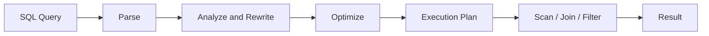

# 07- Logical Operators

## Overview

SQL logical operators combine or negate predicates to build the conditions used by `WHERE`, `HAVING`, and `JOIN ... ON` clauses.

The primary logical operators are:

| Operator | Purpose | Example |
|---|---|---|
| `AND` | All conditions must be `TRUE` | `status = 'active' AND total >= 1000` |
| `OR` | At least one condition must be `TRUE` | `status = 'pending' OR status = 'processing'` |
| `NOT` | Negates a predicate | `NOT status = 'cancelled'` |

Logical operators become especially important when business rules contain multiple conditions, optional filters, nullable columns, authorization boundaries, or complex search requirements.

SQL uses **three-valued logic** rather than ordinary Boolean logic because predicates can evaluate to `TRUE`, `FALSE`, or `UNKNOWN`. Understanding this is essential for avoiding subtle production bugs.

## Basic Logical Operators

### AND

`AND` requires both predicates to evaluate to `TRUE`.

```sql
SELECT
    id,
    total,
    status
FROM orders
WHERE status = 'completed'
  AND total >= 1000;
```

This returns only orders satisfying both conditions.

Conceptually:

```text
Condition A ──┐
              ├── AND ──> Result
Condition B ──┘
```

Use `AND` when multiple constraints must simultaneously hold.

Typical backend examples:

- Active users belonging to a tenant
- Orders above a minimum value with a specific status
- Records created within a time window
- Resources owned by a user and currently available

### OR

`OR` returns `TRUE` when at least one operand is `TRUE`.

```sql
SELECT
    id,
    status
FROM orders
WHERE status = 'pending'
   OR status = 'processing';
```

This is useful for alternative business conditions.

For equality against multiple values, `IN` is often clearer:

```sql
WHERE status IN ('pending', 'processing');
```

### NOT

`NOT` negates a predicate.

```sql
SELECT
    id,
    status
FROM orders
WHERE NOT status = 'cancelled';
```

For simple inequality, the explicit comparison is generally clearer:

```sql
WHERE status <> 'cancelled';
```

`NOT` becomes more useful when negating compound expressions:

```sql
WHERE NOT (
    status = 'cancelled'
    OR status = 'refunded'
);
```

Equivalent positive logic can often be easier to reason about:

```sql
WHERE status <> 'cancelled'
  AND status <> 'refunded';
```

However, `NULL` behavior means these expressions should not be treated as universally interchangeable without considering the data model.

## Truth Tables

For ordinary two-valued Boolean logic:

### AND

| A | B | `A AND B` |
|---|---|---|
| TRUE | TRUE | TRUE |
| TRUE | FALSE | FALSE |
| FALSE | TRUE | FALSE |
| FALSE | FALSE | FALSE |

### OR

| A | B | `A OR B` |
|---|---|---|
| TRUE | TRUE | TRUE |
| TRUE | FALSE | TRUE |
| FALSE | TRUE | TRUE |
| FALSE | FALSE | FALSE |

### NOT

| A | `NOT A` |
|---|---|
| TRUE | FALSE |
| FALSE | TRUE |

SQL adds `UNKNOWN` because of `NULL`.

## SQL Three-Valued Logic

A SQL predicate can evaluate to:

- `TRUE`
- `FALSE`
- `UNKNOWN`

For example:

```sql
NULL = 10
```

produces `UNKNOWN`.

Likewise:

```sql
NULL <> 10
```

also produces `UNKNOWN`.

`WHERE` keeps only rows for which the final predicate evaluates to `TRUE`.

### AND with UNKNOWN

| A | B | `A AND B` |
|---|---|---|
| TRUE | TRUE | TRUE |
| TRUE | FALSE | FALSE |
| TRUE | UNKNOWN | UNKNOWN |
| FALSE | TRUE | FALSE |
| FALSE | FALSE | FALSE |
| FALSE | UNKNOWN | FALSE |
| UNKNOWN | TRUE | UNKNOWN |
| UNKNOWN | FALSE | FALSE |
| UNKNOWN | UNKNOWN | UNKNOWN |

The important optimization is:

```text
FALSE AND anything = FALSE
```

### OR with UNKNOWN

| A | B | `A OR B` |
|---|---|---|
| TRUE | TRUE | TRUE |
| TRUE | FALSE | TRUE |
| TRUE | UNKNOWN | TRUE |
| FALSE | TRUE | TRUE |
| FALSE | FALSE | FALSE |
| FALSE | UNKNOWN | UNKNOWN |
| UNKNOWN | TRUE | TRUE |
| UNKNOWN | FALSE | UNKNOWN |
| UNKNOWN | UNKNOWN | UNKNOWN |

The important optimization is:

```text
TRUE OR anything = TRUE
```

### NOT with UNKNOWN

```text
NOT UNKNOWN = UNKNOWN
```

This is one of the most important differences between SQL logic and ordinary Boolean reasoning.

## NULL and Logical Operators

Consider:

```sql
SELECT
    id,
    status
FROM orders
WHERE status <> 'cancelled';
```

If `status` is `NULL`, the comparison produces `UNKNOWN`, so the row is excluded.

Adding `OR status IS NULL` changes the semantics:

```sql
SELECT
    id,
    status
FROM orders
WHERE status <> 'cancelled'
   OR status IS NULL;
```

Now both non-cancelled rows and unknown-status rows can be returned.

The correct query depends on what `NULL` means in the domain.

Do not automatically treat `NULL` as equivalent to:

- Empty string
- Zero
- `FALSE`
- Missing business state
- "Not applicable"

These values have different semantics.

## Operator Precedence

SQL has precedence rules for logical operators.

In common SQL syntax:

1. Parenthesized expressions
2. `NOT`
3. `AND`
4. `OR`

Therefore:

```sql
WHERE A OR B AND C
```

is interpreted as:

```sql
WHERE A OR (B AND C)
```

not:

```sql
WHERE (A OR B) AND C
```

For production code, do not rely on readers remembering precedence when business logic is non-trivial.

Prefer explicit parentheses:

```sql
WHERE (
    status = 'active'
    OR status = 'pending'
)
AND country = 'IN';
```

Parentheses improve both correctness and maintainability.

## Combining AND and OR

A common backend query is:

```sql
SELECT
    id,
    email,
    status,
    country
FROM users
WHERE (
    status = 'active'
    OR status = 'pending'
)
AND country = 'IN';
```

The query means:

```text
(status is active OR pending)
AND
(country is India)
```

Without parentheses:

```sql
WHERE status = 'active'
   OR status = 'pending'
  AND country = 'IN';
```

the database interprets it as:

```sql
WHERE status = 'active'
   OR (
       status = 'pending'
       AND country = 'IN'
   );
```

That may produce significantly different results.

## De Morgan's Laws

De Morgan's laws are particularly useful when simplifying or reviewing negated SQL conditions.

### First Law

```text
NOT (A AND B)
=
(NOT A) OR (NOT B)
```

SQL:

```sql
WHERE NOT (
    status = 'active'
    AND country = 'IN'
)
```

can be expressed as:

```sql
WHERE status <> 'active'
   OR country <> 'IN';
```

### Second Law

```text
NOT (A OR B)
=
(NOT A) AND (NOT B)
```

SQL:

```sql
WHERE NOT (
    status = 'cancelled'
    OR status = 'refunded'
)
```

can be expressed as:

```sql
WHERE status <> 'cancelled'
  AND status <> 'refunded';
```

However, because SQL has `UNKNOWN`, these transformations require careful consideration when nullable columns participate in the predicates.

For nullable data, explicit `IS NULL`/`IS NOT NULL` semantics may be required to represent the actual business rule.

## Logical Operators with NULL: Production Example

Suppose a user table contains:

```text
status
------
active
inactive
NULL
```

Query:

```sql
SELECT
    id
FROM users
WHERE status = 'active'
   OR status <> 'active';
```

It is tempting to assume this returns every row.

It does not.

For a `NULL` status:

```text
status = 'active'    → UNKNOWN
status <> 'active'   → UNKNOWN

UNKNOWN OR UNKNOWN   → UNKNOWN
```

Therefore the `NULL` row is excluded.

If every row, including `NULL`, should be returned:

```sql
WHERE status = 'active'
   OR status <> 'active'
   OR status IS NULL;
```

This is a classic SQL interview and production pitfall.

## Logical Operators with IN

`IN` is often preferable to a long chain of `OR` equality comparisons.

Instead of:

```sql
WHERE status = 'pending'
   OR status = 'processing'
   OR status = 'retrying';
```

use:

```sql
WHERE status IN ('pending', 'processing', 'retrying');
```

For backend-generated filters, bind values as parameters rather than constructing SQL text from request data.

The exact parameterization mechanism depends on the driver or framework.

## Logical Operators with NOT IN

`NOT IN` requires special care when `NULL` is present.

Consider:

```sql
WHERE status NOT IN ('cancelled', 'refunded');
```

A `NULL` status does not satisfy this predicate because the comparison becomes `UNKNOWN`.

More subtly, a `NOT IN` subquery can produce surprising results if the subquery returns `NULL`.

For example:

```sql
WHERE user_id NOT IN (
    SELECT user_id
    FROM blocked_users
);
```

If `blocked_users.user_id` contains `NULL`, the result can become `UNKNOWN` for otherwise non-matching values.

For anti-joins, `NOT EXISTS` is often safer and more explicit:

```sql
SELECT
    u.id,
    u.email
FROM users AS u
WHERE NOT EXISTS (
    SELECT 1
    FROM blocked_users AS b
    WHERE b.user_id = u.id
);
```

The correct choice should still be validated against the database optimizer and data model.

## Logical Operators with EXISTS

`EXISTS` checks whether a subquery produces at least one row.

Example:

```sql
SELECT
    u.id,
    u.email
FROM users AS u
WHERE EXISTS (
    SELECT 1
    FROM orders AS o
    WHERE o.user_id = u.id
);
```

This retrieves users who have at least one order.

Combining `EXISTS` with logical operators is common in authorization and business rules:

```sql
SELECT
    u.id
FROM users AS u
WHERE u.status = 'active'
  AND EXISTS (
      SELECT 1
      FROM orders AS o
      WHERE o.user_id = u.id
        AND o.total >= 1000
  );
```

This expresses the business rule directly:

```text
user is active
AND
user has an order worth at least 1000
```

## Optional API Filters

Backend APIs frequently support optional filters.

For example:

```text
GET /orders?status=completed&min_total=1000
```

A backend may construct a parameterized predicate:

```sql
WHERE status = $1
  AND total >= $2
```

If filters are optional, avoid writing large, difficult-to-maintain predicates such as:

```sql
WHERE ($1 IS NULL OR status = $1)
  AND ($2 IS NULL OR total >= $2);
```

This pattern can be useful in some situations, but it may complicate query planning and index usage.

For high-throughput endpoints, dynamically constructing a fixed set of validated predicate fragments while always binding values as parameters can produce clearer and more optimizable SQL.

## Authorization and Logical Operators

Logical operators are frequently part of security predicates.

Suppose an invoice can be accessed by either:

- Its owning user
- A member of the owning tenant with an appropriate role

A simplified predicate might be:

```sql
WHERE invoice.id = $1
  AND (
      invoice.owner_id = $2
      OR EXISTS (
          SELECT 1
          FROM tenant_members AS tm
          WHERE tm.tenant_id = invoice.tenant_id
            AND tm.user_id = $2
            AND tm.role IN ('admin', 'billing')
      )
  );
```

The parentheses are critical.

A missing parenthesis or incorrectly positioned `OR` can accidentally bypass an authorization condition.

For security-sensitive queries, review the generated SQL and test both positive and negative authorization cases.

## Logical Operators and Multi-Tenancy

Tenant isolation commonly requires every query to include tenant scope:

```sql
SELECT
    id,
    total
FROM invoices
WHERE tenant_id = $1
  AND (
      status = 'pending'
      OR status = 'failed'
  );
```

The intended logic is:

```text
tenant_id matches
AND
(status is pending OR failed)
```

Incorrect:

```sql
WHERE tenant_id = $1
  AND status = 'pending'
   OR status = 'failed';
```

Because `AND` has higher precedence than `OR`, this becomes:

```sql
WHERE (
    tenant_id = $1
    AND status = 'pending'
)
OR status = 'failed';
```

That could expose failed invoices belonging to other tenants.

This is both a correctness and security issue.

## Logical Operators and Query Performance

Logical operators themselves are not inherently slow.

Performance depends on the resulting predicate, available indexes, data distribution, and optimizer strategy.

For example:

```sql
WHERE customer_id = $1
  AND created_at >= $2
```

may be efficiently supported by:

```sql
CREATE INDEX idx_orders_customer_created
ON orders (customer_id, created_at);
```

For an `OR` predicate:

```sql
WHERE customer_id = $1
   OR email = $2;
```

the optimizer may use:

- Multiple index scans
- Bitmap operations
- A sequential scan
- Another strategy

depending on the database and statistics.

Do not assume that replacing `OR` with another query structure automatically improves performance.

Use execution plans to validate high-impact changes.

## Predicate Pushdown

When queries involve joins, logical predicates can sometimes be evaluated as early as possible to reduce intermediate rows.

Example:

```sql
SELECT
    u.id,
    o.id
FROM users AS u
JOIN orders AS o
    ON o.user_id = u.id
WHERE u.status = 'active'
  AND o.total >= 1000;
```

The optimizer may push applicable predicates toward the underlying scans.

This reduces the amount of data that must flow through joins and later query stages.

The optimizer is responsible for choosing the physical execution strategy, so developers should focus on expressing correct predicates and verifying important plans rather than manually assuming a particular execution order.

## Logical Evaluation vs Physical Execution

A common interview trap is assuming that SQL executes exactly from top to bottom.

For example:

```sql
SELECT ...
FROM ...
WHERE ...
```

describes the query declaratively.

The database optimizer may transform the query into a different physical execution plan while preserving its semantics.

A simplified conceptual flow is:



Logical operators define conditions in the query's semantics. The optimizer decides how those conditions are physically evaluated.

## Predicate Ordering

Do not rely on writing:

```sql
WHERE expensive_condition(...)
  AND cheap_condition = TRUE;
```

to guarantee that the cheap condition is evaluated first.

SQL is declarative, and the optimizer may reorder predicates or use other strategies.

If a condition has side effects, depends on evaluation order, or can fail unexpectedly, the query should be redesigned rather than relying on predicate order.

For ordinary immutable predicates, the optimizer is free to choose an efficient evaluation strategy.

## CASE vs Logical Operators

Sometimes complex conditional logic is clearer with `CASE`.

Example:

```sql
SELECT
    id,
    total,
    CASE
        WHEN total >= 10000 THEN 'high'
        WHEN total >= 1000 THEN 'medium'
        ELSE 'low'
    END AS order_class
FROM orders;
```

Use logical predicates for filtering:

```sql
WHERE total >= 1000;
```

Use `CASE` primarily when deriving a value rather than deciding whether a row should be returned.

## Common Mistakes

### Forgetting Parentheses

Risky:

```sql
WHERE tenant_id = $1
  AND status = 'active'
   OR status = 'pending';
```

Prefer:

```sql
WHERE tenant_id = $1
  AND (
      status = 'active'
      OR status = 'pending'
  );
```

### Assuming SQL Has Two-Valued Logic

Incorrect assumption:

```text
A OR NOT A = TRUE
```

for every SQL value.

When `A` is `UNKNOWN`:

```text
UNKNOWN OR NOT UNKNOWN
UNKNOWN OR UNKNOWN
= UNKNOWN
```

The row is not selected by `WHERE`.

### Using NOT IN with Nullable Data

Do not assume:

```sql
NOT IN (...)
```

behaves like a simple negated membership test when `NULL` values are possible.

Consider `NOT EXISTS` or explicitly model `NULL` semantics.

### Treating NULL as FALSE

`NULL` does not mean `FALSE`.

For example:

```sql
WHERE is_active = TRUE
```

does not return rows where `is_active` is `NULL`.

If `NULL` should represent inactive behavior, either enforce a `NOT NULL` constraint with an explicit default or handle it deliberately:

```sql
WHERE is_active IS TRUE;
```

### Overusing OR

Large chains of `OR` can become difficult to read and maintain.

Prefer:

```sql
WHERE status IN ('pending', 'processing', 'retrying');
```

when the logic is simple equality membership.

For genuinely different predicates, retain explicit `OR` logic and validate the execution plan.

### Assuming Predicate Order Controls Performance

Do not assume:

```sql
WHERE cheap_condition
  AND expensive_condition
```

guarantees a particular evaluation order.

The optimizer controls physical execution.

### Building Dynamic SQL from User Input

Never concatenate request parameters into logical expressions.

Bad:

```python
query = f"""
    SELECT id
    FROM users
    WHERE status = '{status}'
"""
```

Use parameterized queries or an ORM instead.

### Accidentally Bypassing Authorization with OR

A query such as:

```sql
WHERE tenant_id = $1
  AND owner_id = $2
   OR is_public = TRUE;
```

may intentionally or unintentionally allow records outside the tenant.

Use explicit grouping:

```sql
WHERE tenant_id = $1
  AND (
      owner_id = $2
      OR is_public = TRUE
  );
```

Then test the authorization boundary explicitly.

## Production Best Practices

- Use parentheses when combining `AND` and `OR`.
- Treat `NULL` as a separate semantic state.
- Prefer explicit predicates over clever Boolean transformations.
- Use `IN` for straightforward equality membership.
- Evaluate `NOT IN` carefully when nullable values are possible.
- Prefer `NOT EXISTS` for many anti-join scenarios.
- Keep authorization and tenant-isolation predicates explicitly grouped.
- Use parameterized queries for all external values.
- Validate dynamic filters before constructing SQL.
- Inspect execution plans for high-frequency or high-cost queries.
- Test logical predicates with boundary and `NULL` cases.
- Prefer schema constraints such as `NOT NULL` when the domain does not require an unknown state.
- Keep complex business predicates readable enough to be reviewed by another engineer.

## Practical Review Checklist

When reviewing a query containing logical operators, ask:

| Question | Why it matters |
|---|---|
| Are `AND` and `OR` grouped explicitly? | Prevents precedence bugs |
| Can any participating column be `NULL`? | Changes predicate results |
| Is `NOT IN` used with nullable data? | Can produce unexpected `UNKNOWN` results |
| Is tenant scope grouped with all alternatives? | Prevents cross-tenant access |
| Is authorization logic protected from `OR` branches? | Prevents access-control bypasses |
| Can `IN` replace repetitive equality checks? | Improves readability |
| Is the predicate parameterized? | Prevents SQL injection |
| Is the query performance-sensitive? | Determines whether plan analysis is needed |
| Have edge cases been tested? | Logical bugs often occur at boundaries |
| Are schema constraints aligned with the predicate? | Reduces unnecessary nullable-state handling |

## Interview Traps

| Question | Strong answer |
|---|---|
| What is the difference between `AND` and `OR`? | `AND` requires all predicates to be true; `OR` requires at least one to be true. |
| What is SQL three-valued logic? | Predicates can evaluate to `TRUE`, `FALSE`, or `UNKNOWN`, primarily because of `NULL`. |
| What is the precedence of `AND` and `OR`? | `AND` has higher precedence than `OR`; parentheses should be used when intent is important. |
| Why can `A OR NOT A` fail to return every row? | If `A` is `UNKNOWN`, `NOT A` is also `UNKNOWN`, so the expression remains `UNKNOWN`. |
| Why is `NULL` important with logical operators? | Comparisons involving `NULL` generally produce `UNKNOWN`, which propagates through logical expressions according to SQL's three-valued logic. |
| Why can `NOT IN` be dangerous with `NULL`? | A `NULL` in the compared set can make comparisons evaluate to `UNKNOWN`, producing unintuitive filtering behavior. |
| Why can `NOT EXISTS` be preferable to `NOT IN`? | It expresses an anti-existence condition and avoids the common `NULL` trap associated with `NOT IN`. |
| Does SQL evaluate `WHERE` predicates strictly left to right? | No. SQL is declarative; the optimizer can reorder or transform predicates while preserving semantics. |
| Can adding an index guarantee an `OR` query will use indexes? | No. The optimizer chooses the physical plan based on costs, statistics, selectivity, and available access paths. |
| Why are parentheses important in authorization queries? | Incorrect grouping can cause an `OR` branch to bypass tenant or ownership restrictions. |
| How should request-driven logical filters be implemented? | Validate the allowed filter structure and parameterize all values rather than concatenating user input into SQL. |
| What is the most important production concern with complex logical predicates? | Correctness: verify precedence, `NULL` semantics, authorization boundaries, and edge cases before optimizing the query. |

## Key Takeaways

- SQL logical operators use three-valued logic, so `NULL` can produce `UNKNOWN` and materially change `AND`, `OR`, and `NOT` behavior.
- Use explicit parentheses whenever `AND` and `OR` are combined, especially around authorization and multi-tenant predicates.
- Treat `NOT IN` with nullable data carefully; `NOT EXISTS` is often a safer anti-existence pattern.
- Logical correctness comes before optimization; for performance-sensitive queries, validate the resulting execution plan rather than assuming predicate order or index usage.
- Backend-generated SQL should use validated query structure, parameterized values, and tests covering `NULL`, boundary conditions, tenant isolation, and authorization branches.