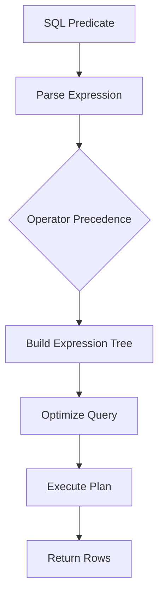

# 08- Operator Precedence

## Overview

SQL operator precedence determines how an expression containing multiple operators is grouped when explicit parentheses are not provided.

This matters most when queries combine:

- Comparison operators such as `=`, `<>`, `>`, `<`, `>=`, and `<=`
- `IS NULL` and `IS NOT NULL`
- `IN`, `BETWEEN`, and `LIKE`
- `NOT`
- `AND`
- `OR`

The most common production mistake is misunderstanding the relationship between `AND` and `OR`.

For example:

```sql
WHERE tenant_id = $1
  AND status = 'active'
   OR status = 'pending';
```

is interpreted as:

```sql
WHERE (
    tenant_id = $1
    AND status = 'active'
)
OR status = 'pending';
```

It is **not** interpreted as:

```sql
WHERE tenant_id = $1
  AND (
      status = 'active'
      OR status = 'pending'
  );
```

That distinction can cause incorrect results and, in multi-tenant or authorization-sensitive systems, data exposure.

## Why Operator Precedence Exists

SQL expressions frequently contain multiple operators:

```sql
WHERE price >= 100
  AND status = 'active'
  OR priority = 'high';
```

The database needs deterministic rules for interpreting the expression.

Operator precedence provides those rules.

Conceptually:



Precedence determines the structure of the expression before the database optimizer determines how that expression is physically executed.

## Common SQL Precedence

Exact precedence rules can vary between database systems and between individual operators, so database-specific documentation remains authoritative.

For the operators commonly encountered in backend SQL, a useful mental model is:

| Priority | Operator / Category | Example |
|---|---|---|
| Highest | Parentheses | `(a OR b)` |
| High | Arithmetic operators | `price * quantity` |
| High | Comparison operators | `price >= 100` |
| High | `IS [NOT] NULL` | `deleted_at IS NULL` |
| High | `IN`, `BETWEEN`, `LIKE` | `status IN (...)` |
| High | `NOT` | `NOT active` |
| Medium | `AND` | `active AND verified` |
| Low | `OR` | `admin OR owner` |

The critical relationship for everyday filtering is:

```text
NOT
  ↓
AND
  ↓
OR
```

Therefore:

```sql
A OR B AND C
```

means:

```sql
A OR (B AND C)
```

## Parentheses Override Precedence

Parentheses explicitly define the intended grouping.

Without parentheses:

```sql
WHERE status = 'active'
   OR status = 'pending'
  AND country = 'IN';
```

the expression means:

```sql
WHERE status = 'active'
   OR (
       status = 'pending'
       AND country = 'IN'
   );
```

If the intended business rule is:

```text
(active OR pending)
AND country = IN
```

write:

```sql
WHERE (
    status = 'active'
    OR status = 'pending'
)
AND country = 'IN';
```

When business logic is non-trivial, explicit parentheses are preferable even when the result would be unchanged by precedence.

## AND vs OR

`AND` has higher precedence than `OR`.

Consider:

```sql
WHERE A OR B AND C;
```

The database parses this as:

```sql
WHERE A OR (B AND C);
```

not:

```sql
WHERE (A OR B) AND C;
```

These expressions can produce very different result sets.

### Example

Suppose an application needs:

```text
Return:
- active users
OR
- verified users who are from India
```

The correct query is:

```sql
SELECT
    id,
    email
FROM users
WHERE status = 'active'
   OR (
       verified = TRUE
       AND country = 'IN'
   );
```

Because `AND` already has higher precedence, the parentheses are technically unnecessary:

```sql
WHERE status = 'active'
   OR verified = TRUE
  AND country = 'IN';
```

However, keeping the parentheses makes the business rule immediately visible.

## NOT vs AND

`NOT` generally binds more tightly than `AND`.

Consider:

```sql
WHERE NOT status = 'cancelled'
  AND total >= 1000;
```

This is interpreted as:

```sql
WHERE (
    NOT (status = 'cancelled')
)
AND total >= 1000;
```

A clearer production form is often:

```sql
WHERE status <> 'cancelled'
  AND total >= 1000;
```

For more complex expressions, parentheses should make the intended scope explicit:

```sql
WHERE NOT (
    status = 'cancelled'
    OR status = 'refunded'
)
AND total >= 1000;
```

## Parentheses Around NOT

The scope of `NOT` becomes especially important with compound predicates.

Consider:

```sql
WHERE NOT status = 'cancelled'
   OR status = 'refunded';
```

This means:

```sql
WHERE (
    NOT (status = 'cancelled')
)
OR status = 'refunded';
```

It does **not** mean:

```sql
WHERE NOT (
    status = 'cancelled'
    OR status = 'refunded'
);
```

If the requirement is to exclude both cancelled and refunded records:

```sql
WHERE NOT (
    status = 'cancelled'
    OR status = 'refunded'
);
```

or, where appropriate:

```sql
WHERE status <> 'cancelled'
  AND status <> 'refunded';
```

The first form often communicates the business rule more directly.

## Comparison Operators and Logical Operators

Comparison expressions are normally evaluated as predicates before the logical operators combine them.

For example:

```sql
WHERE total >= 1000
  AND status = 'completed';
```

can be conceptually represented as:

```text
(total >= 1000)
AND
(status = 'completed')
```

Similarly:

```sql
WHERE total >= 1000
   OR status = 'completed'
  AND country = 'IN';
```

means:

```text
(total >= 1000)
OR
((status = 'completed') AND (country = 'IN'))
```

The exact internal execution plan is determined by the optimizer, but the logical expression must first have unambiguous semantics.

## IN, BETWEEN, and LIKE

Predicates such as `IN`, `BETWEEN`, and `LIKE` are commonly used as part of larger logical expressions.

For example:

```sql
SELECT
    id,
    status,
    total
FROM orders
WHERE status IN ('pending', 'processing')
  AND total BETWEEN 1000 AND 5000;
```

The logical structure is:

```text
status IN (...)
AND
total BETWEEN ... AND ...
```

With `OR`, grouping becomes important:

```sql
WHERE status IN ('pending', 'processing')
   OR total BETWEEN 1000 AND 5000
  AND priority = 'high';
```

This means:

```sql
WHERE (
    status IN ('pending', 'processing')
)
OR (
    total BETWEEN 1000 AND 5000
    AND priority = 'high'
);
```

If the requirement is instead:

```text
(status is pending/processing OR total is between 1000 and 5000)
AND priority is high
```

write:

```sql
WHERE (
    status IN ('pending', 'processing')
    OR total BETWEEN 1000 AND 5000
)
AND priority = 'high';
```

## BETWEEN and Its Boundaries

`BETWEEN` is inclusive at both boundaries in standard SQL usage:

```sql
WHERE total BETWEEN 1000 AND 5000;
```

is logically equivalent to:

```sql
WHERE total >= 1000
  AND total <= 5000;
```

This can matter when combining it with other predicates.

For timestamp ranges, avoid blindly using `BETWEEN` when representing adjacent time windows.

Prefer half-open intervals:

```sql
WHERE created_at >= $1
  AND created_at < $2;
```

This avoids overlapping records at the exact upper boundary when windows are processed consecutively.

## Logical Precedence and NULL

Operator precedence does not eliminate SQL's three-valued logic.

A predicate can evaluate to:

- `TRUE`
- `FALSE`
- `UNKNOWN`

For example:

```sql
status <> 'cancelled'
```

is `UNKNOWN` when `status` is `NULL`.

Consider:

```sql
WHERE status <> 'cancelled'
   OR status = 'pending'
  AND tenant_id = $1;
```

The precedence is:

```sql
WHERE
    (status <> 'cancelled')
    OR (
        (status = 'pending')
        AND (tenant_id = $1)
    );
```

But each comparison can independently produce `UNKNOWN`.

When nullable columns participate in complex predicates, reason about both **operator precedence** and **three-valued logic**.

## Operator Precedence and Multi-Tenancy

Multi-tenant systems are especially sensitive to precedence errors.

Suppose every invoice must belong to the current tenant, while invoices may be selected by either status:

```sql
SELECT
    id,
    total,
    status
FROM invoices
WHERE tenant_id = $1
  AND (
      status = 'pending'
      OR status = 'failed'
  );
```

This is correct:

```text
tenant_id = current tenant
AND
(status is pending OR failed)
```

A common mistake is:

```sql
WHERE tenant_id = $1
  AND status = 'pending'
   OR status = 'failed';
```

Due to precedence, this means:

```sql
WHERE (
    tenant_id = $1
    AND status = 'pending'
)
OR status = 'failed';
```

Every failed invoice can potentially satisfy the second branch regardless of tenant.

This is not merely a query bug. In a multi-tenant application, it can become a security vulnerability.

## Operator Precedence and Authorization

The same issue occurs in access-control queries.

Suppose a user can access a document if:

- They own it, or
- It is public

but it must also belong to the current tenant.

Correct:

```sql
SELECT
    id,
    title
FROM documents
WHERE tenant_id = $1
  AND (
      owner_id = $2
      OR is_public = TRUE
  );
```

Incorrect:

```sql
WHERE tenant_id = $1
  AND owner_id = $2
   OR is_public = TRUE;
```

The incorrect expression is:

```sql
WHERE (
    tenant_id = $1
    AND owner_id = $2
)
OR is_public = TRUE;
```

Public documents from another tenant can now satisfy the `OR` branch.

### Security Rule

Whenever an authorization condition contains `OR`, explicitly identify which restrictions apply to **all branches**.

A useful review technique is to rewrite the predicate visually:

```text
MANDATORY TENANT SCOPE
AND
(
    OWNER ACCESS
    OR
    PUBLIC ACCESS
)
```

Then ensure the SQL has the same structure.

## Logical Expression Trees

A useful senior-level mental model is to think of a predicate as an expression tree.

For:

```sql
WHERE A AND B OR C AND D;
```

the tree is approximately:

```text
            OR
           /  \
         AND  AND
        /  \  /  \
       A    B C    D
```

because `AND` binds more tightly than `OR`.

For:

```sql
WHERE (A AND B) OR C;
```

the tree is:

```text
          OR
         /  \
       AND   C
      /  \
     A    B
```

Parentheses explicitly control the tree structure.

This is useful when debugging generated SQL from ORMs because a query builder may produce a logically different predicate from what the application code appears to express.

## ORM Considerations

Frameworks such as Django provide abstractions for grouping predicates.

For example:

```python
from django.db.models import Q

queryset = Order.objects.filter(
    Q(status="pending") | Q(status="processing"),
    total__gte=1000,
)
```

Conceptually, this represents:

```sql
WHERE (
    status = 'pending'
    OR status = 'processing'
)
AND total >= 1000;
```

When conditions become more complex, explicitly grouping `Q` expressions is important:

```python
queryset = Order.objects.filter(
    Q(tenant_id=tenant_id)
    & (
        Q(status="pending")
        | Q(status="processing")
    )
)
```

The principle is the same as writing SQL directly:

> Make the logical structure explicit instead of relying on precedence that another engineer has to mentally reconstruct.

## Query Builder Considerations

Application-level query builders often have their own grouping semantics.

A query constructed from:

```text
A AND B OR C
```

may not mean what the application developer intended if the API combines expressions automatically.

For complex filters:

- Group expressions explicitly.
- Inspect generated SQL during development.
- Test the generated query against representative data.
- Avoid relying on implicit grouping behavior in unfamiliar query-builder APIs.

This is particularly important for dynamically assembled filters in REST APIs and administrative search interfaces.

## Predicate Construction in Backend APIs

Suppose an API supports:

```text
status = pending OR processing
country = IN
minimum total = 1000
```

The intended predicate is:

```sql
WHERE (
    status = 'pending'
    OR status = 'processing'
)
AND country = 'IN'
AND total >= 1000;
```

A backend implementation should preserve this logical structure.

Do not build arbitrary SQL strings from request parameters.

Instead:

1. Validate allowed filter fields.
2. Validate allowed operators.
3. Build a known query structure.
4. Parameterize values.
5. Test combinations of filters.
6. Inspect execution plans for high-volume endpoints.

Logical correctness and SQL injection prevention are separate concerns; parameterization protects values, while query construction must still preserve the intended predicate structure.

## Operator Precedence and Query Optimization

Operator precedence defines logical meaning; it does not prescribe the physical execution order.

For example:

```sql
WHERE (
    status = 'active'
    OR status = 'pending'
)
AND tenant_id = $1;
```

The optimizer may choose an execution strategy involving:

- Index scans
- Bitmap scans
- Sequential scans
- Predicate pushdown
- Join reordering
- Other database-specific transformations

Do not attempt to optimize queries by manually rearranging logically equivalent predicates without measuring.

Use execution plans:

```sql
EXPLAIN (ANALYZE, BUFFERS)
SELECT
    id,
    total
FROM orders
WHERE tenant_id = 42
  AND (
      status = 'pending'
      OR status = 'processing'
  );
```

For PostgreSQL, `EXPLAIN (ANALYZE, BUFFERS)` is particularly useful for understanding actual execution behavior and I/O.

## Parentheses and Performance

Parentheses themselves generally do not make a query slower.

For example:

```sql
WHERE (
    status = 'active'
    OR status = 'pending'
)
AND tenant_id = $1;
```

is not inherently less performant than an equivalent expression that relies on precedence.

The optimizer can generally simplify or transform equivalent expressions.

The primary reason to use parentheses is **correctness and maintainability**.

Do not remove parentheses merely to make SQL look shorter.

## Common Mistakes

### Assuming AND and OR Have Equal Precedence

Incorrect mental model:

```sql
A OR B AND C
```

equals:

```sql
(A OR B) AND C
```

Actual interpretation:

```sql
A OR (B AND C)
```

Use explicit grouping when the intended logic is not obvious.

### Missing Parentheses Around OR

Risky:

```sql
WHERE tenant_id = $1
  AND status = 'active'
   OR status = 'pending';
```

Prefer:

```sql
WHERE tenant_id = $1
  AND (
      status = 'active'
      OR status = 'pending'
  );
```

### Incorrect Authorization Logic

Risky:

```sql
WHERE tenant_id = $1
  AND owner_id = $2
   OR is_public = TRUE;
```

The `is_public` branch is not tenant-scoped.

Prefer:

```sql
WHERE tenant_id = $1
  AND (
      owner_id = $2
      OR is_public = TRUE
  );
```

### Assuming NOT Applies to the Whole Expression

This:

```sql
WHERE NOT A OR B;
```

does not mean:

```sql
WHERE NOT (A OR B);
```

If the entire expression should be negated:

```sql
WHERE NOT (A OR B);
```

### Ignoring NULL

This:

```sql
WHERE status <> 'cancelled'
```

does not include `NULL` statuses.

Always consider `NULL` semantics when nullable columns participate in compound predicates.

### Removing Parentheses Because the Database Accepts the Query

A query can be syntactically valid and logically wrong.

For example:

```sql
WHERE tenant_id = $1
  AND status = 'active'
   OR status = 'pending';
```

The database accepts it, but the intended tenant restriction may not apply to all rows.

### Relying on ORM Precedence Without Checking It

Application code such as:

```python
Q(a=True) | Q(b=True) & Q(c=True)
```

may be technically correct but difficult to review.

Prefer explicit grouping:

```python
Q(a=True) | (Q(b=True) & Q(c=True))
```

### Assuming Parentheses Control Physical Evaluation Order

Parentheses define expression semantics. They should not be used as a mechanism for forcing the database to evaluate predicates in a particular physical order.

The optimizer determines execution strategy.

## Production Review Checklist

When reviewing a query with multiple operators:

| Check | Question |
|---|---|
| `AND` / `OR` | Is the intended grouping explicit? |
| `NOT` | Is the negation applied to exactly the intended predicate? |
| Parentheses | Are business-rule boundaries visible? |
| `NULL` | Could any operand evaluate to `UNKNOWN`? |
| Tenant scope | Does the tenant restriction apply to every relevant branch? |
| Authorization | Can an `OR` branch bypass an access restriction? |
| ORM | Does the generated SQL match the intended predicate tree? |
| Parameters | Are external values parameterized? |
| Performance | Has the actual execution plan been inspected for important queries? |
| Tests | Are both positive and negative combinations covered? |

## Practical Testing Strategy

Complex predicates should be tested with representative combinations rather than only one happy-path row.

For a predicate:

```sql
WHERE tenant_id = $1
  AND (
      owner_id = $2
      OR is_public = TRUE
  );
```

test at least:

| Tenant matches | Owner matches | Public | Expected |
|---|---|---|---|
| Yes | Yes | No | Allow |
| Yes | No | Yes | Allow |
| Yes | No | No | Deny |
| No | Yes | Yes | Deny |
| No | Yes | No | Deny |
| No | No | Yes | Deny |

This style of test is particularly valuable for authorization and tenant isolation because precedence bugs often appear only in combinations that cross security boundaries.

## Interview Traps

| Question | Strong answer |
|---|---|
| What has higher precedence, `AND` or `OR`? | `AND` has higher precedence than `OR`. |
| How is `A OR B AND C` interpreted? | As `A OR (B AND C)`. |
| How do you force `(A OR B) AND C`? | Use explicit parentheses: `(A OR B) AND C`. |
| Why are parentheses important in SQL? | They make the intended expression tree explicit and prevent precedence-related correctness and security bugs. |
| Does parentheses determine physical execution order? | No. They determine logical grouping; the optimizer chooses the physical execution strategy. |
| What is the precedence relationship between `NOT`, `AND`, and `OR`? | As a practical mental model: `NOT` binds more tightly than `AND`, which binds more tightly than `OR`. |
| Why is precedence especially important in multi-tenant systems? | An incorrectly grouped `OR` can bypass a tenant restriction and expose another tenant's data. |
| Why is precedence important for authorization? | A permissive `OR` branch can accidentally bypass ownership, role, or tenant restrictions. |
| Does `NULL` change operator precedence? | No. Precedence remains the same, but `NULL` introduces `UNKNOWN`, which changes the result of the logical expression. |
| Should developers depend on predicate order for performance? | No. SQL is declarative and the optimizer can transform predicates; use execution plans to validate performance assumptions. |
| Should production SQL avoid parentheses because they are verbose? | No. Clear grouping is usually more valuable than saving a few characters. |
| How should dynamically generated filters be handled? | Validate the query structure, preserve explicit grouping, and parameterize external values. |

## Key Takeaways

- `AND` binds more tightly than `OR`, while `NOT` binds more tightly than `AND`; use parentheses whenever the intended grouping is important.
- Operator precedence determines the logical expression tree, while the optimizer independently determines the physical execution plan.
- Incorrect `AND`/`OR` grouping can cause serious authorization and multi-tenant data-isolation vulnerabilities.
- Always consider SQL's three-valued logic alongside precedence when nullable columns participate in predicates.
- In production SQL and ORM query builders, make complex predicate grouping explicit, parameterize values, and test security-sensitive combinations.