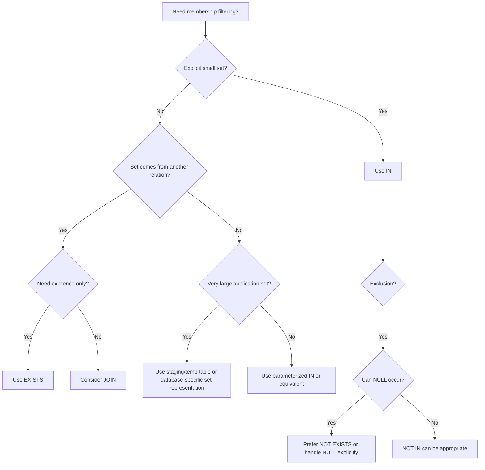

# 09- IN and NOT IN

## Overview

`IN` and `NOT IN` are SQL predicates used to test whether a value belongs to a specified set of values or the result of a subquery.

They are useful when a query needs to match several discrete values without repeatedly writing the same comparison:

```sql
WHERE status IN ('pending', 'processing', 'failed')
```

instead of:

```sql
WHERE status = 'pending'
   OR status = 'processing'
   OR status = 'failed'
```

`IN` is common in backend filtering, authorization rules, batch operations, reporting, and queries involving related entities. `NOT IN` appears similar, but it has an important interaction with `NULL` and SQL's three-valued logic that makes it substantially more dangerous in production.

For senior backend engineering, the important concerns are not just syntax. They include:

- `NULL` semantics
- Subquery behavior
- Index usage
- Large value lists
- Parameterization
- Multi-tenant filtering
- Query planner behavior
- ORM-generated SQL
- Alternatives such as `EXISTS`, joins, and temporary tables

## IN Predicate

### What It Is

`IN` tests whether an expression matches at least one value in a specified list or result set.

```sql
SELECT
    id,
    email
FROM users
WHERE status IN ('active', 'pending');
```

The predicate is logically equivalent to:

```sql
WHERE status = 'active'
   OR status = 'pending';
```

For a small, static set of values, `IN` is usually clearer and easier to maintain.

### Why It Exists

Without `IN`, membership tests require repeated comparisons:

```sql
WHERE country = 'IN'
   OR country = 'SG'
   OR country = 'AE'
   OR country = 'US';
```

`IN` expresses the intent directly:

```sql
WHERE country IN ('IN', 'SG', 'AE', 'US');
```

The database optimizer is free to transform the expression into an appropriate execution strategy.

### Basic Syntax

```sql
SELECT columns
FROM table_name
WHERE column_name IN (value1, value2, value3);
```

Example:

```sql
SELECT
    id,
    order_number,
    status
FROM orders
WHERE status IN ('pending', 'processing', 'shipped');
```

## How IN Works

Conceptually:

```text
              status
                 |
                 v
       ┌──────────────────┐
       │ IN (A, B, C)     │
       └────────┬─────────┘
                |
       ┌────────┴────────┐
       │                 │
    status=A          status=B/C
       │                 │
       └────────┬────────┘
                v
             TRUE
```

The actual implementation is database-specific. The optimizer may choose an index scan, bitmap strategy, hash-based membership test, or another plan depending on the database, statistics, data distribution, and size of the value set.

Do not assume that `IN` always means the database literally evaluates every comparison sequentially.

## IN with Numeric Values

```sql
SELECT
    id,
    email
FROM users
WHERE id IN (101, 205, 310, 415);
```

This is useful for fetching a known set of records.

A backend service might use this pattern after resolving a set of IDs from another system:

```sql
SELECT
    id,
    product_name,
    price
FROM products
WHERE id IN (101, 205, 310, 415);
```

The IDs must still be supplied through parameterized query APIs rather than concatenated into SQL strings.

## IN with Strings

```sql
SELECT
    id,
    email
FROM users
WHERE role IN ('admin', 'support', 'operator');
```

String comparisons follow the database's type, collation, and comparison rules.

Do not assume that string comparison behavior is identical across PostgreSQL, MySQL, SQL Server, and other database systems.

## IN with Subqueries

`IN` can test membership against the result of a subquery:

```sql
SELECT
    id,
    email
FROM users
WHERE id IN (
    SELECT user_id
    FROM blocked_users
);
```

The inner query produces a set of `user_id` values, and the outer query returns users whose IDs belong to that set.

This is useful when the membership set is maintained by the database rather than constructed by the application.

### Example: Customers With Recent Orders

```sql
SELECT
    id,
    email
FROM customers
WHERE id IN (
    SELECT customer_id
    FROM orders
    WHERE created_at >= CURRENT_DATE - INTERVAL '30 days'
);
```

The query expresses:

```text
customer ID
    ∈
IDs of customers with orders in the last 30 days
```

The optimizer may transform this into a semi-join or another equivalent plan.

## IN and NULL

`NULL` is one of the most important aspects of `IN`.

Consider:

```sql
SELECT
    id,
    status
FROM orders
WHERE status IN ('pending', NULL);
```

This does **not** mean:

```text
status = 'pending' OR status IS NULL
```

To include `NULL`, write:

```sql
WHERE status IN ('pending')
   OR status IS NULL;
```

`NULL` represents an unknown value, so equality comparisons with `NULL` do not evaluate to `TRUE`.

This is incorrect:

```sql
WHERE status = NULL;
```

Use:

```sql
WHERE status IS NULL;
```

## NOT IN

### What It Is

`NOT IN` returns rows where the expression is not a member of the specified set.

```sql
SELECT
    id,
    email
FROM users
WHERE role NOT IN ('admin', 'support');
```

Conceptually, this is similar to:

```sql
WHERE role <> 'admin'
  AND role <> 'support';
```

However, the presence of `NULL` can make these expressions evaluate differently from what developers intuitively expect.

### When to Use It

`NOT IN` is useful when:

- The excluded set is known and non-null.
- The column being tested is non-null or `NULL` behavior is explicitly handled.
- A membership exclusion is clearer than an alternative query.

For example:

```sql
SELECT
    id,
    order_number
FROM orders
WHERE status NOT IN ('cancelled', 'refunded');
```

## The NOT IN + NULL Trap

Consider:

```sql
SELECT
    id
FROM users
WHERE id NOT IN (
    SELECT user_id
    FROM blocked_users
);
```

Suppose the subquery returns:

```text
101
205
NULL
```

The presence of `NULL` can cause the `NOT IN` predicate to evaluate to `UNKNOWN` for candidate values that are not known to be members of the set.

As a result, the query can return **no rows or fewer rows than expected**.

This is a classic SQL interview and production trap.

### Why It Happens

Conceptually:

```sql
id NOT IN (101, 205, NULL)
```

behaves like:

```sql
id <> 101
AND id <> 205
AND id <> NULL;
```

The last comparison:

```sql
id <> NULL
```

is `UNKNOWN`, not `TRUE`.

SQL uses three-valued logic:

```text
TRUE
FALSE
UNKNOWN
```

A `WHERE` clause only retains rows where the predicate evaluates to `TRUE`.

## Safer Alternative: NOT EXISTS

For exclusion based on another table, `NOT EXISTS` is often safer and expresses the relationship directly.

Instead of:

```sql
SELECT
    id,
    email
FROM users
WHERE id NOT IN (
    SELECT user_id
    FROM blocked_users
);
```

prefer:

```sql
SELECT
    u.id,
    u.email
FROM users AS u
WHERE NOT EXISTS (
    SELECT 1
    FROM blocked_users AS b
    WHERE b.user_id = u.id
);
```

`NOT EXISTS` does not have the same `NULL` behavior as `NOT IN`.

This is particularly important when the subquery's column is nullable or its nullability could change in the future.

## IN vs EXISTS

`IN` and `EXISTS` can express related membership logic, but they communicate different concepts.

| Aspect | `IN` | `EXISTS` |
|---|---|---|
| Primary meaning | Value belongs to a set | Matching related row exists |
| Typical use | Small/static sets or subquery membership | Correlated relationship checks |
| NULL concern | Important, especially with `NOT IN` | No equivalent `NOT IN` NULL trap |
| Large dynamic relationship | Can be appropriate | Often natural |
| Readability | Excellent for explicit sets | Excellent for existence relationships |
| Optimizer | May use semi-join or other strategy | May use semi-join or other strategy |
| Guaranteed faster? | No | No |

Do not use a simplistic rule such as "`EXISTS` is always faster than `IN`."

Modern query optimizers can transform both forms into similar execution plans.

Measure important queries using the database's execution-plan tools.

## IN vs EXISTS Example

Suppose the requirement is:

> Return customers who have at least one completed order.

Using `IN`:

```sql
SELECT
    c.id,
    c.email
FROM customers AS c
WHERE c.id IN (
    SELECT o.customer_id
    FROM orders AS o
    WHERE o.status = 'completed'
);
```

Using `EXISTS`:

```sql
SELECT
    c.id,
    c.email
FROM customers AS c
WHERE EXISTS (
    SELECT 1
    FROM orders AS o
    WHERE o.customer_id = c.id
      AND o.status = 'completed'
);
```

Both express the membership/existence relationship.

For relationship-oriented logic, `EXISTS` often communicates the intent more directly.

## NOT IN vs NOT EXISTS

For exclusion against another table:

```sql
WHERE id NOT IN (
    SELECT user_id
    FROM blocked_users
);
```

versus:

```sql
WHERE NOT EXISTS (
    SELECT 1
    FROM blocked_users AS b
    WHERE b.user_id = users.id
);
```

The second form is generally safer when `user_id` may contain `NULL`.

If `NOT IN` is used intentionally, ensure the subquery cannot produce `NULL`:

```sql
WHERE id NOT IN (
    SELECT user_id
    FROM blocked_users
    WHERE user_id IS NOT NULL
);
```

Even then, `NOT EXISTS` can be the clearer expression of the business rule.

## IN with Application Parameters

Backend applications frequently need to filter by a dynamic set.

For example, an API may receive:

```text
GET /orders?status=pending,processing,failed
```

The application should validate the allowed values and pass them through the database driver's parameterization mechanism.

Do not construct SQL like:

```python
# Unsafe pattern
query = f"""
    SELECT id, status
    FROM orders
    WHERE status IN ({user_input})
"""
```

Instead, use the parameterization mechanism provided by the database driver or ORM.

The exact placeholder syntax depends on the driver.

For PostgreSQL with a driver that supports array parameters, an approach such as:

```sql
SELECT
    id,
    status
FROM orders
WHERE status = ANY($1);
```

can be useful when `$1` is supplied as a PostgreSQL array.

The key production principle is:

> Parameterize values; never treat untrusted input as SQL syntax.

## Django Example

Django's ORM maps membership filtering to SQL `IN`.

```python
orders = Order.objects.filter(
    status__in=["pending", "processing", "failed"]
)
```

Conceptually:

```sql
WHERE status IN ('pending', 'processing', 'failed')
```

For exclusion:

```python
orders = Order.objects.exclude(
    status__in=["cancelled", "refunded"]
)
```

The generated SQL should be inspected when debugging complex ORM behavior rather than assuming the ORM generated exactly the SQL you intended.

## IN and REST API Filters

A typical backend API may expose:

```text
GET /orders?status=pending,processing
```

A robust implementation should:

1. Parse the incoming values.
2. Validate each value against an allowed set.
3. Reject invalid values where appropriate.
4. Use parameterized SQL or ORM filters.
5. Apply mandatory tenant and authorization predicates.
6. Measure query performance for large result sets.

For example, conceptually:

```python
allowed_statuses = {"pending", "processing", "shipped", "failed"}

requested_statuses = {"pending", "processing"}

invalid = requested_statuses - allowed_statuses
if invalid:
    raise ValueError("Unsupported order status")
```

The application should validate the **values**, while the database driver handles their safe parameterization.

## Multi-Tenant Queries

`IN` often appears in tenant-scoped queries:

```sql
SELECT
    id,
    order_number,
    status
FROM orders
WHERE tenant_id = $1
  AND status IN ('pending', 'processing');
```

The tenant predicate should remain structurally mandatory.

When combining `IN` with `OR`, avoid accidentally creating a branch that bypasses tenant isolation.

Prefer:

```sql
WHERE tenant_id = $1
  AND (
      status IN ('pending', 'processing')
      OR priority = 'high'
  );
```

rather than:

```sql
WHERE tenant_id = $1
  AND status IN ('pending', 'processing')
   OR priority = 'high';
```

The latter is interpreted as:

```sql
WHERE (
    tenant_id = $1
    AND status IN ('pending', 'processing')
)
OR priority = 'high';
```

This is the same operator-precedence problem that applies to ordinary equality predicates.

## IN and Indexes

`IN` can use indexes, but index usage is determined by the optimizer.

For:

```sql
SELECT
    id,
    email
FROM users
WHERE id IN (1001, 1002, 1003);
```

an index on `users.id` may make the query highly efficient.

However, index usage depends on:

- Number of values
- Table size
- Data distribution
- Selectivity
- Statistics
- Database engine
- Available indexes
- Cost estimates

Do not assume:

```text
IN = index lookup
```

The actual plan might use a sequential scan if the optimizer determines that scanning the table is cheaper.

Inspect the plan:

```sql
EXPLAIN (ANALYZE, BUFFERS)
SELECT
    id,
    email
FROM users
WHERE id IN (1001, 1002, 1003);
```

## Large IN Lists

Small lists are generally straightforward:

```sql
WHERE id IN (101, 102, 103, 104);
```

Very large lists can become problematic.

Potential issues include:

- Large SQL statements
- Increased parsing/planning overhead
- Network payload size
- Parameter-count limitations in some systems
- Higher application memory usage
- Poor plan quality
- Difficult query observability
- Increased latency

Avoid sending tens of thousands of IDs through a giant `IN (...)` list when a relational representation would be more appropriate.

### Better Alternatives for Large Sets

Depending on the workload, consider:

- Temporary tables
- Staging tables
- Bulk inserts into a temporary relation
- PostgreSQL arrays with `ANY`
- Joining against a persistent table
- `VALUES` relations
- Batch processing
- Server-side data loading mechanisms

For example, PostgreSQL can express a set using `VALUES`:

```sql
SELECT
    p.id,
    p.product_name
FROM products AS p
JOIN (
    VALUES
        (101),
        (205),
        (310)
) AS requested(product_id)
    ON requested.product_id = p.id;
```

For very large datasets, loading IDs into a temporary or staging table and joining can be substantially more operationally appropriate than constructing a massive `IN` list.

## IN with Composite Conditions

`IN` can be combined with other predicates:

```sql
SELECT
    id,
    order_number
FROM orders
WHERE tenant_id = $1
  AND status IN ('pending', 'processing')
  AND total >= $2;
```

The logical structure is:

```text
tenant scope
AND
status membership
AND
minimum amount
```

When combined with `OR`, use explicit grouping:

```sql
WHERE tenant_id = $1
  AND (
      status IN ('pending', 'processing')
      OR total >= $2
  );
```

This makes the scope of the tenant restriction unambiguous.

## IN with Dates

`IN` can technically be used with dates:

```sql
SELECT
    id,
    total
FROM daily_sales
WHERE sale_date IN (
    DATE '2026-08-28',
    DATE '2026-08-29',
    DATE '2026-08-30'
);
```

This is appropriate when the set of exact dates is intentional.

For continuous ranges, use a range predicate instead:

```sql
WHERE sale_date >= $1
  AND sale_date < $2;
```

Do not replace a range with a large list of individual dates unless the business requirement is genuinely a discrete set.

## IN and Type Consistency

The values in an `IN` predicate should be compatible with the column's data type.

Prefer:

```sql
WHERE id IN (101, 102, 103);
```

when `id` is an integer.

Avoid unnecessarily converting values:

```sql
WHERE CAST(id AS TEXT) IN ('101', '102', '103');
```

Expressions applied to indexed columns can affect index usability and increase CPU work.

The exact behavior is database-specific, but keeping data types aligned is a sound production practice.

## Common Mistakes

### Treating NOT IN as Always Equivalent to NOT EXISTS

These can differ in the presence of `NULL`.

Risky:

```sql
WHERE id NOT IN (
    SELECT user_id
    FROM blocked_users
);
```

Safer:

```sql
WHERE NOT EXISTS (
    SELECT 1
    FROM blocked_users AS b
    WHERE b.user_id = users.id
);
```

### Putting NULL in an IN List Expecting NULL Matches

Incorrect:

```sql
WHERE status IN ('pending', NULL);
```

Correct:

```sql
WHERE status = 'pending'
   OR status IS NULL;
```

### Building IN Lists Through String Concatenation

Never construct SQL from untrusted input:

```python
# Do not do this
query = f"SELECT * FROM users WHERE id IN ({ids})"
```

Use a parameterized driver, ORM, or database-specific safe array/set mechanism.

### Sending Huge IN Lists

A query containing thousands or millions of values is usually a sign that the set should be represented as data rather than SQL text.

Consider staging the values in a table and joining.

### Forgetting Tenant Scope

Risky:

```sql
WHERE tenant_id = $1
  AND status IN ('pending', 'processing')
   OR priority = 'high';
```

Prefer:

```sql
WHERE tenant_id = $1
  AND (
      status IN ('pending', 'processing')
      OR priority = 'high'
  );
```

### Assuming IN Is Always Faster Than OR

Do not make performance claims from syntax alone.

The optimizer may transform both forms into similar plans.

Benchmark representative queries with realistic data.

### Assuming NOT IN Includes NULL Rows

This:

```sql
WHERE status NOT IN ('cancelled', 'refunded');
```

does not automatically include rows where `status` is `NULL`.

If `NULL` should qualify, express it explicitly:

```sql
WHERE status NOT IN ('cancelled', 'refunded')
   OR status IS NULL;
```

## Production Considerations

### Performance

For important queries:

- Index columns frequently used for selective membership filters.
- Keep large membership sets out of giant SQL statements.
- Use execution plans to validate assumptions.
- Consider data distribution and selectivity.
- Avoid unnecessary casts or functions on indexed columns.
- Batch large application-level operations.

### Scalability

A query such as:

```sql
WHERE id IN (...)
```

may be perfectly reasonable for a few dozen IDs but inappropriate for hundreds of thousands.

As the set grows, represent it relationally:

```text
Application
    |
    | bulk load IDs
    v
Staging / Temporary Table
    |
    | JOIN
    v
Target Table
```

This allows the database to operate on the set as data instead of parsing an enormous SQL statement.

### Reliability

For `NOT IN` subqueries, explicitly consider whether the subquery can return `NULL`.

Schema constraints can help:

```sql
user_id INTEGER NOT NULL
```

If the relationship logically requires a value, enforcing `NOT NULL` at the database level is preferable to relying solely on application validation.

### Security

`IN` itself is not a SQL injection risk.

The risk comes from dynamically inserting untrusted input into SQL syntax.

Safe:

```text
SQL structure + parameterized values
```

Unsafe:

```text
SQL structure + concatenated user input
```

For multi-tenant and authorization queries, logical grouping is also a security concern. An incorrectly grouped `OR` can bypass mandatory access predicates.

### Monitoring

For high-traffic endpoints using membership queries, monitor:

- Query latency
- Rows returned
- Rows examined
- Buffer/cache activity
- CPU usage
- Temporary file usage where relevant
- Query planning time
- Database connection utilization

In PostgreSQL, tools such as `EXPLAIN (ANALYZE, BUFFERS)` and query-statistics extensions can help identify inefficient membership queries.

## Choosing Between IN, EXISTS, JOIN, and NOT EXISTS

| Requirement | Preferred starting point |
|---|---|
| Match against a small explicit set | `IN` |
| Exclude against a small known set | `NOT IN`, if NULL behavior is controlled |
| Check whether a related row exists | `EXISTS` |
| Exclude rows with a related match | `NOT EXISTS` |
| Retrieve columns from the related table | `JOIN` |
| Match against a very large application-generated set | Temporary/staging table or database-specific set representation |
| Membership against PostgreSQL array parameter | `= ANY(...)` can be appropriate |
| Continuous numeric/date range | Range predicates such as `>=` and `<` |

These are starting points, not rigid performance rules. Query plans and data characteristics determine the final choice.

## Practical Decision Flow



## Interview Traps

| Question | Strong answer |
|---|---|
| What does `IN` do? | Tests whether a value matches any value in a specified set or subquery result. |
| What is `IN` commonly equivalent to? | A series of `OR` equality comparisons, subject to SQL's `NULL` semantics. |
| What is the major problem with `NOT IN`? | A `NULL` in the compared set can make the predicate evaluate to `UNKNOWN`, producing unexpected results. |
| Why is `NOT EXISTS` often preferred over `NOT IN` for subqueries? | It expresses relationship absence directly and avoids the `NULL` trap associated with `NOT IN`. |
| Is `EXISTS` always faster than `IN`? | No. Modern optimizers can transform both into similar plans. Measure with execution plans. |
| Can `IN` use an index? | Yes, depending on the database, value count, selectivity, statistics, and chosen execution plan. |
| Should a huge list of IDs be placed in `IN (...)`? | Usually not. For very large sets, use staging/temporary tables or another database-appropriate set representation. |
| Does `IN ('active', NULL)` match NULL values? | No. `NULL` must be tested with `IS NULL`. |
| How do you safely construct a dynamic `IN` filter? | Validate input and use parameterized query mechanisms rather than concatenating values into SQL. |
| What happens with `NULL NOT IN (...)`? | Comparisons involving `NULL` generally produce `UNKNOWN`, so the row does not pass a normal `WHERE` predicate unless explicitly handled. |
| When is `JOIN` preferable? | When columns from the related relation are needed or when expressing a relational combination is clearer. |
| How do you optimize a slow `IN` query? | Inspect the execution plan, evaluate indexes and selectivity, reduce unnecessarily large sets, and consider staging tables or alternative query forms. |

## Key Takeaways

- `IN` is the natural SQL predicate for membership in a small or moderate set; it is commonly equivalent to a series of `OR` comparisons.
- `NOT IN` requires careful handling of `NULL`; for exclusion against another table, `NOT EXISTS` is often the safer expression.
- Large `IN` lists can create parsing, planning, network, and scalability problems; represent very large sets as relational data when appropriate.
- Parameterize dynamic values and preserve explicit grouping when combining `IN` with tenant, authorization, `AND`, or `OR` predicates.
- Do not assume `IN`, `EXISTS`, or `JOIN` is inherently faster; use realistic data and execution plans to validate performance decisions.