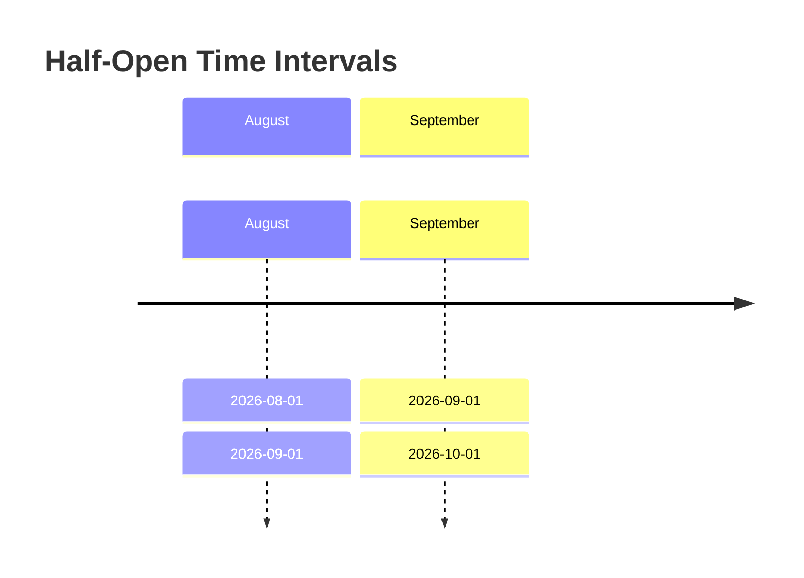
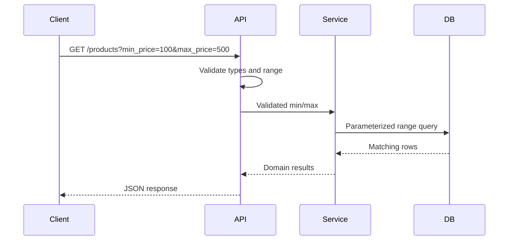

# 10- BETWEEN

## Overview

`BETWEEN` is a SQL predicate used to test whether a value falls within an inclusive range.

The basic form is:

```sql
value BETWEEN lower_bound AND upper_bound
```

It is equivalent to:

```sql
value >= lower_bound
AND value <= upper_bound
```

`BETWEEN` is useful for numeric ranges, dates, timestamps, and other values with an ordered comparison semantics. It is particularly common in reporting, filtering APIs, billing systems, analytics, and operational queries.

The most important production concern is that `BETWEEN` is **inclusive at both boundaries**. This is often appropriate for numeric values and dates, but can create subtle bugs with timestamps.

## Basic Syntax

```sql
SELECT columns
FROM table_name
WHERE column_name BETWEEN lower_bound AND upper_bound;
```

Example:

```sql
SELECT
    id,
    order_number,
    total
FROM orders
WHERE total BETWEEN 100 AND 500;
```

This returns orders where:

```text
100 <= total <= 500
```

Therefore, orders with totals exactly `100` and `500` are included.

## Why BETWEEN Exists

Without `BETWEEN`, a range condition requires two comparisons:

```sql
WHERE total >= 100
  AND total <= 500;
```

`BETWEEN` expresses the same intent more compactly:

```sql
WHERE total BETWEEN 100 AND 500;
```

For simple inclusive ranges, this can improve readability.

The database optimizer is generally free to transform the predicate into an equivalent range condition.

## Inclusive Boundaries

The defining property of `BETWEEN` is that both boundaries are included.

```sql
SELECT
    id,
    price
FROM products
WHERE price BETWEEN 100 AND 200;
```

The result includes:

| Price | Match |
|---:|:---:|
| 99.99 | No |
| 100.00 | Yes |
| 150.00 | Yes |
| 200.00 | Yes |
| 200.01 | No |

This matters when designing API filters, pagination, reporting windows, and billing calculations.

## Numeric Ranges

Numeric ranges are one of the simplest uses of `BETWEEN`.

```sql
SELECT
    id,
    product_name,
    price
FROM products
WHERE price BETWEEN 50 AND 250;
```

Equivalent form:

```sql
SELECT
    id,
    product_name,
    price
FROM products
WHERE price >= 50
  AND price <= 250;
```

### When to Use

Use `BETWEEN` when:

- The lower boundary should be included.
- The upper boundary should be included.
- The value has a well-defined ordering.
- The inclusive semantics match the business requirement.

For example:

```sql
WHERE age BETWEEN 18 AND 65
```

clearly represents an inclusive range.

## Date Ranges

`BETWEEN` can be used with date values:

```sql
SELECT
    id,
    order_number,
    created_at
FROM orders
WHERE created_at::date BETWEEN DATE '2026-08-01'
                           AND DATE '2026-08-31';
```

When the column is already a `date`, the query can be simpler:

```sql
SELECT
    id,
    order_number
FROM orders
WHERE order_date BETWEEN DATE '2026-08-01'
                     AND DATE '2026-08-31';
```

For date-only columns, inclusive `BETWEEN` is often exactly what is required.

## Timestamp Ranges

Timestamp filtering requires more care.

Suppose:

```sql
created_at
```

is a timestamp and the requirement is:

> Return all orders created during August 2026.

A tempting query is:

```sql
WHERE created_at BETWEEN
    TIMESTAMP '2026-08-01 00:00:00'
    AND TIMESTAMP '2026-08-31 23:59:59';
```

This is fragile.

It assumes that `23:59:59` represents the end of the day, but timestamps may have fractional precision:

```text
2026-08-31 23:59:59.100
2026-08-31 23:59:59.500
2026-08-31 23:59:59.999
```

Those values are later than `23:59:59` and would be excluded.

### Preferred Timestamp Pattern

Use a half-open interval:

```sql
WHERE created_at >= TIMESTAMP '2026-08-01 00:00:00'
  AND created_at <  TIMESTAMP '2026-09-01 00:00:00';
```

This represents:

```text
[start, end)
```

or:

```text
start <= created_at < end
```

This approach is safer for timestamps because the next period's boundary becomes the exclusive upper limit.

## Why Half-Open Intervals Are Better for Time

Half-open intervals compose cleanly:

```text
August:
[2026-08-01 00:00, 2026-09-01 00:00)

September:
[2026-09-01 00:00, 2026-10-01 00:00)
```

There is no overlap and no missing instant at the boundary.



The same principle works for:

- Daily jobs
- Monthly reports
- Billing periods
- Event processing
- Kafka event windows
- Analytics queries
- Data retention jobs
- Time-based pagination

## BETWEEN with Strings

`BETWEEN` can technically be applied to character values:

```sql
SELECT
    username
FROM users
WHERE username BETWEEN 'alice' AND 'maria';
```

However, string ordering depends on the database's comparison and collation rules.

Do not use string `BETWEEN` as a generic way to express alphabetical ranges without understanding the database's collation behavior.

For prefix searches, a purpose-built predicate may be more appropriate:

```sql
WHERE username LIKE 'ali%';
```

## BETWEEN with Decimal and Monetary Values

For numeric monetary columns:

```sql
SELECT
    id,
    invoice_number,
    total_amount
FROM invoices
WHERE total_amount BETWEEN 1000.00 AND 5000.00;
```

This is appropriate when the boundaries are intentionally inclusive.

For financial systems, however, the underlying representation matters. Prefer database-supported exact numeric types such as `NUMERIC`/`DECIMAL` rather than floating-point types for monetary values.

For example, in PostgreSQL:

```sql
CREATE TABLE invoices (
    id BIGINT GENERATED ALWAYS AS IDENTITY PRIMARY KEY,
    total_amount NUMERIC(12, 2) NOT NULL
);
```

Then:

```sql
WHERE total_amount BETWEEN 1000.00 AND 5000.00;
```

has deterministic decimal semantics.

## Reversed Bounds

Consider:

```sql
WHERE price BETWEEN 500 AND 100;
```

The lower expression is `500` and the upper expression is `100`.

Do not rely on `BETWEEN` to automatically swap them.

Conceptually, this means:

```sql
price >= 500
AND price <= 100
```

which cannot normally be true for an ordinary scalar value.

Application code should validate range parameters before executing the query when the API allows clients to specify both bounds.

For example:

```text
min_price <= max_price
```

should generally be validated at the API boundary.

## BETWEEN with NULL

`NULL` interacts with `BETWEEN` through SQL's three-valued logic.

Consider:

```sql
SELECT
    id,
    price
FROM products
WHERE price BETWEEN 100 AND 500;
```

If `price` is `NULL`, the comparisons cannot establish that the value is within the range.

Conceptually:

```sql
NULL >= 100
AND
NULL <= 500
```

produces `UNKNOWN`.

Because `WHERE` only retains rows whose predicate evaluates to `TRUE`, the row is excluded.

If `NULL` should also match, handle it explicitly:

```sql
WHERE price BETWEEN 100 AND 500
   OR price IS NULL;
```

Do not assume that `BETWEEN` treats `NULL` as zero, an empty value, or an automatically matching boundary.

## BETWEEN with Parameters

Backend applications should parameterize range boundaries.

For example:

```sql
SELECT
    id,
    order_number,
    total
FROM orders
WHERE total BETWEEN $1 AND $2;
```

The application supplies the lower and upper values separately.

This provides:

- SQL injection protection
- Correct type handling
- Better query reuse
- Cleaner application code
- Better separation between SQL structure and data

Do not construct queries by interpolating user input:

```python
# Unsafe
query = f"""
    SELECT id, order_number
    FROM orders
    WHERE total BETWEEN {min_total} AND {max_total}
"""
```

Use the parameterization mechanism provided by the database driver or ORM.

## Django Example

Django supports range filtering through `__range`:

```python
orders = Order.objects.filter(
    total__range=(100, 500)
)
```

This represents an inclusive range.

For timestamp-based filtering, prefer explicit lower-inclusive and upper-exclusive boundaries:

```python
orders = Order.objects.filter(
    created_at__gte=start_at,
    created_at__lt=end_at,
)
```

This makes the desired time-window semantics explicit.

## FastAPI Example

An API may expose:

```text
GET /orders?min_total=100&max_total=500
```

The application can validate the range before querying:

```python
from decimal import Decimal

def validate_range(min_total: Decimal, max_total: Decimal) -> None:
    if min_total > max_total:
        raise ValueError("min_total must not exceed max_total")
```

The query layer should then pass the validated values as parameters rather than embedding them into SQL.

For timestamp filters, an API should similarly define whether `end_at` is inclusive or exclusive. For production APIs, an exclusive upper bound is often easier to compose.

## Index Usage

A range predicate can use an appropriate index.

For example:

```sql
CREATE INDEX idx_orders_created_at
ON orders (created_at);
```

A query such as:

```sql
SELECT
    id,
    order_number
FROM orders
WHERE created_at >= $1
  AND created_at < $2;
```

can potentially use that index.

The actual execution plan depends on:

- Table size
- Selectivity
- Data distribution
- Index statistics
- Query shape
- Database engine
- Cache state
- Cost estimates

Inspect important production queries rather than assuming an index will always be used:

```sql
EXPLAIN (ANALYZE, BUFFERS)
SELECT
    id,
    order_number
FROM orders
WHERE created_at >= TIMESTAMP '2026-08-01 00:00:00'
  AND created_at <  TIMESTAMP '2026-09-01 00:00:00';
```

## Avoid Functions on Indexed Columns

Suppose `created_at` is indexed.

This can prevent efficient use of the plain index:

```sql
WHERE DATE(created_at) = DATE '2026-08-30';
```

A range predicate is usually preferable:

```sql
WHERE created_at >= TIMESTAMP '2026-08-30 00:00:00'
  AND created_at <  TIMESTAMP '2026-08-31 00:00:00';
```

The second form preserves the column's raw ordering and is generally much more index-friendly.

The exact optimizer behavior is database-specific, but avoiding unnecessary functions on indexed columns is a strong production practice.

## BETWEEN vs Explicit Comparisons

| Requirement | Recommended form |
|---|---|
| Inclusive numeric range | `BETWEEN min AND max` |
| Inclusive date range | `BETWEEN start AND end` |
| Timestamp period | `>= start AND < end` |
| Exclude upper boundary | `>= start AND < end` |
| Complex range logic | Explicit comparisons |
| Dynamic API range | Parameterized comparisons or `BETWEEN` |
| Time windows that must compose | Half-open interval |

For simple inclusive ranges, `BETWEEN` improves readability.

For timestamp windows, explicit comparisons often communicate the intended boundary semantics more clearly.

## BETWEEN vs IN

These predicates solve different problems.

```sql
WHERE price BETWEEN 100 AND 500
```

means:

> Match values within a continuous range.

Whereas:

```sql
WHERE price IN (100, 200, 500)
```

means:

> Match these specific values.

| Predicate | Meaning |
|---|---|
| `IN` | Membership in a discrete set |
| `BETWEEN` | Membership in an inclusive ordered range |
| `>=` / `<` | Explicit range boundaries |
| `LIKE` | Pattern matching |

Do not use `IN` to approximate a range with many values, and do not use `BETWEEN` when only specific discrete values should match.

## BETWEEN in API Filtering

A production API may support:

```text
GET /products?min_price=100&max_price=500
```

A robust request flow is:



Production considerations include:

- Validate that the minimum does not exceed the maximum.
- Enforce reasonable range sizes where appropriate.
- Parameterize both boundaries.
- Apply tenant and authorization predicates.
- Paginate potentially large result sets.
- Ensure appropriate indexes exist.
- Monitor query latency for broad ranges.

## Multi-Tenant Filtering

Range filters must not bypass mandatory authorization predicates.

Prefer:

```sql
SELECT
    id,
    order_number,
    total
FROM orders
WHERE tenant_id = $1
  AND total BETWEEN $2 AND $3;
```

If additional `OR` conditions are introduced, group them explicitly:

```sql
WHERE tenant_id = $1
  AND (
      total BETWEEN $2 AND $3
      OR priority = 'high'
  );
```

Avoid:

```sql
WHERE tenant_id = $1
  AND total BETWEEN $2 AND $3
   OR priority = 'high';
```

The latter can allow high-priority rows from other tenants because `AND` has higher precedence than `OR`.

For multi-tenant systems, predicate grouping is therefore a security concern, not merely a readability concern.

## Performance and Scalability

Range predicates are common in high-volume systems, particularly on timestamp columns.

Typical production patterns include:

```sql
WHERE created_at >= $1
  AND created_at < $2
```

combined with an index such as:

```sql
CREATE INDEX idx_orders_created_at
ON orders (created_at);
```

For multi-tenant workloads, a composite index may be more appropriate:

```sql
CREATE INDEX idx_orders_tenant_created_at
ON orders (tenant_id, created_at);
```

This can support queries such as:

```sql
SELECT
    id,
    order_number
FROM orders
WHERE tenant_id = $1
  AND created_at >= $2
  AND created_at < $3;
```

Index design should be driven by actual workload patterns and execution plans rather than by adding indexes to every filtered column.

## Partitioning and Large Time-Series Tables

For very large tables, time-based filtering can interact with table partitioning.

For example, an orders or events table may be partitioned by month.

A query:

```sql
SELECT
    count(*)
FROM events
WHERE created_at >= TIMESTAMP '2026-08-01 00:00:00'
  AND created_at <  TIMESTAMP '2026-09-01 00:00:00';
```

may allow the database to eliminate partitions that cannot contain matching rows.

This is known as **partition pruning**.

The exact behavior depends on the database and partitioning design.

Partitioning should not be introduced merely because a query uses `BETWEEN`. It becomes relevant when table size, retention, maintenance, or workload characteristics justify it.

## Time Zones

Timestamp filtering becomes more complicated when data is stored and queried across time zones.

A production system should establish a clear convention, commonly:

- Store timestamps in UTC or use timezone-aware timestamp types.
- Convert user-local date boundaries into the database's comparison timezone.
- Query using precise instants.
- Avoid relying on server-local timezone configuration.

For example, a user asking for:

```text
2026-08-30 in Asia/Kolkata
```

does not necessarily correspond to:

```text
2026-08-30 00:00 UTC
```

The application should resolve the user's local calendar boundaries into actual instants before querying.

This is another reason half-open intervals are useful:

```text
[start_of_local_day, start_of_next_local_day)
```

## Common Mistakes

### Forgetting That BETWEEN Is Inclusive

```sql
WHERE price BETWEEN 100 AND 500;
```

includes both `100` and `500`.

If the upper boundary must be excluded:

```sql
WHERE price >= 100
  AND price < 500;
```

### Using BETWEEN for Timestamp End-of-Day Logic

Fragile:

```sql
WHERE created_at BETWEEN
    '2026-08-01 00:00:00'
    AND '2026-08-31 23:59:59';
```

Prefer:

```sql
WHERE created_at >= '2026-08-01 00:00:00'
  AND created_at <  '2026-09-01 00:00:00';
```

### Assuming 23:59:59 Is the End of a Day

A timestamp can contain fractional seconds.

```text
23:59:59.001
23:59:59.500
23:59:59.999
```

These values occur after `23:59:59`.

Use the next boundary as the exclusive upper bound.

### Ignoring NULL

```sql
WHERE price BETWEEN 100 AND 500;
```

does not match `NULL` prices.

If required:

```sql
WHERE price BETWEEN 100 AND 500
   OR price IS NULL;
```

### Using Functions on Indexed Timestamp Columns

Avoid:

```sql
WHERE DATE(created_at) = $1;
```

when a raw timestamp index can support:

```sql
WHERE created_at >= $1
  AND created_at < $2;
```

### Accepting Reversed API Ranges

Do not silently accept:

```text
min_price=500
max_price=100
```

unless the API contract explicitly defines how to handle it.

Validate the relationship between the boundaries.

### Building Dynamic SQL with Interpolation

Unsafe:

```python
query = f"""
    SELECT *
    FROM orders
    WHERE total BETWEEN {min_total} AND {max_total}
"""
```

Use parameterized queries or an ORM.

### Forgetting Authorization Predicates

Risky:

```sql
WHERE tenant_id = $1
  AND total BETWEEN $2 AND $3
   OR status = 'admin_review';
```

Prefer:

```sql
WHERE tenant_id = $1
  AND (
      total BETWEEN $2 AND $3
      OR status = 'admin_review'
  );
```

## Production Best Practices

### Use BETWEEN for Truly Inclusive Ranges

Good:

```sql
WHERE score BETWEEN 80 AND 100;
```

when both endpoints are intentionally included.

### Prefer Half-Open Intervals for Time

Good:

```sql
WHERE created_at >= $1
  AND created_at < $2;
```

This avoids precision and boundary-overlap problems.

### Keep Range Parameters Typed

Use appropriate database types rather than converting everything to strings.

For example:

```sql
WHERE created_at >= $1
  AND created_at < $2;
```

with actual timestamp parameters is preferable to string-based date manipulation inside SQL.

### Validate at the Application Boundary

Validate:

- Lower bound
- Upper bound
- Lower bound <= upper bound
- Allowed range size
- Time zone
- Required permissions
- Expected data type

Then let the database enforce data integrity and execute the query.

### Index Based on Workload

For frequent range queries, evaluate indexes on the filtered column.

For common tenant + time queries:

```sql
CREATE INDEX idx_events_tenant_created_at
ON events (tenant_id, created_at);
```

Confirm the index is useful with execution plans and production-like data.

## Interview Traps

| Question | Strong answer |
|---|---|
| Is `BETWEEN` inclusive? | Yes. Both lower and upper bounds are included. |
| What is `BETWEEN 10 AND 20` equivalent to? | `value >= 10 AND value <= 20`. |
| Does `BETWEEN` work with dates? | Yes, provided the date semantics match the requirement. |
| Why is `BETWEEN` risky for timestamps? | Its upper boundary is inclusive, and manually specifying an end-of-day timestamp can miss fractional seconds. |
| What is the preferred timestamp pattern? | `timestamp >= start AND timestamp < end`, using a half-open interval. |
| What happens if the value is `NULL`? | The range comparison evaluates to `UNKNOWN`, so the row normally does not pass `WHERE`. |
| Does `BETWEEN` automatically swap reversed bounds? | No. `BETWEEN 500 AND 100` is not a request to reverse the range. |
| Can a `BETWEEN` predicate use an index? | Yes, when the database optimizer determines that an appropriate index is beneficial. |
| Is `BETWEEN` always faster than explicit comparisons? | No. They generally express equivalent range logic; execution depends on the optimizer and workload. |
| Why are half-open intervals useful? | Adjacent intervals compose without overlap or gaps at the boundary. |
| Should timestamps be filtered using `23:59:59` as the end of the day? | Generally no. Use the next period's start as an exclusive upper bound. |
| Can `BETWEEN` be used for strings? | Yes, but ordering depends on database comparison and collation semantics. |

## Key Takeaways

- `BETWEEN` represents an **inclusive** range: `value >= lower AND value <= upper`.
- Use `BETWEEN` for genuinely inclusive numeric or date ranges, but prefer `>= start AND < end` for timestamp windows.
- Half-open time intervals eliminate end-of-day precision problems and make adjacent periods compose safely.
- `NULL`, reversed bounds, time zones, and implicit type conversions must be handled deliberately in production systems.
- Range predicates can be highly performant with appropriate indexes, but execution plans and real workload characteristics should drive optimization decisions.