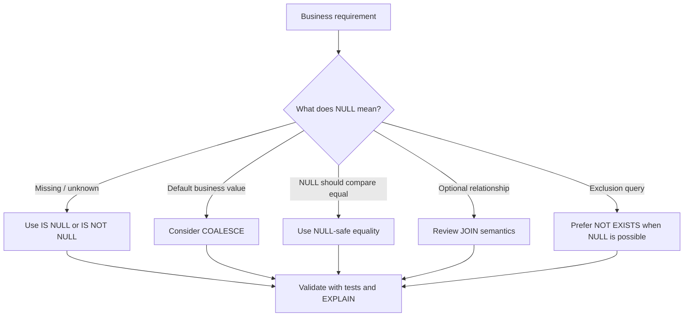

# 12- NULL Filtering

## Overview

`NULL` represents the absence of a known value in SQL. It is not the same as `0`, an empty string (`''`), `FALSE`, or any other concrete value.

Filtering `NULL` correctly requires understanding SQL's **three-valued logic**:

- `TRUE`
- `FALSE`
- `UNKNOWN`

The most important rule is:

> Never use `= NULL` or `<> NULL` to test for `NULL`. Use `IS NULL` or `IS NOT NULL`.

```sql
SELECT
    id,
    email
FROM users
WHERE deleted_at IS NULL;
```

This is a fundamental SQL concept because nullable columns are common in production schemas:

- `deleted_at`
- `verified_at`
- `completed_at`
- `last_login_at`
- `middle_name`
- Optional configuration values
- Nullable foreign keys
- Optional metadata

Incorrect `NULL` filtering can silently exclude rows and produce incorrect business behavior.

## What NULL Means

`NULL` means that a value is missing, unknown, or not applicable according to the database model.

Consider:

| `email` value | Meaning |
|---|---|
| `'alice@example.com'` | Known email |
| `''` | Known empty string |
| `NULL` | No email value |
| `'NULL'` | Literal string `"NULL"` |

These values have different semantics.

For example:

```sql
SELECT
    id,
    email
FROM users
WHERE email IS NULL;
```

returns users whose email has no value.

It does not return users whose email is:

```text
''
```

or:

```text
'NULL'
```

## Why NULL Requires Special Handling

SQL uses three-valued logic when `NULL` participates in comparisons.

A normal comparison has two outcomes:

```text
TRUE
FALSE
```

A comparison involving an unknown value can instead produce:

```text
UNKNOWN
```

For example:

```sql
NULL = NULL
```

does not evaluate to `TRUE`.

It evaluates to `UNKNOWN`.

Similarly:

```sql
NULL = 10
```

and:

```sql
NULL <> 10
```

both evaluate to `UNKNOWN`.

A `WHERE` clause returns rows only when its predicate evaluates to `TRUE`.

Therefore, predicates evaluating to `UNKNOWN` are filtered out.

## IS NULL

Use `IS NULL` to identify missing values.

```sql
SELECT
    id,
    email
FROM users
WHERE email IS NULL;
```

Typical production examples:

```sql
SELECT
    id,
    order_number
FROM orders
WHERE completed_at IS NULL;
```

This can identify orders that have not completed.

Another example:

```sql
SELECT
    id,
    email
FROM users
WHERE verified_at IS NULL;
```

This identifies accounts that have not been verified.

## IS NOT NULL

Use `IS NOT NULL` to identify rows containing a value.

```sql
SELECT
    id,
    email
FROM users
WHERE email IS NOT NULL;
```

For example:

```sql
SELECT
    id,
    order_number
FROM orders
WHERE completed_at IS NOT NULL;
```

This returns completed orders if `completed_at` is populated when an order completes.

## Why = NULL Is Wrong

This is incorrect:

```sql
SELECT
    id,
    email
FROM users
WHERE email = NULL;
```

The expression:

```sql
email = NULL
```

evaluates to `UNKNOWN` rather than `TRUE`.

Use:

```sql
WHERE email IS NULL;
```

Similarly, this is incorrect:

```sql
WHERE email <> NULL;
```

Use:

```sql
WHERE email IS NOT NULL;
```

This distinction is one of the most common SQL interview and production mistakes.

## Three-Valued Logic

Consider a table:

| `id` | `age` |
|---:|---:|
| 1 | 25 |
| 2 | 40 |
| 3 | `NULL` |

Now evaluate:

```sql
WHERE age > 30
```

The logical results are:

| `age` | `age > 30` |
|---:|---|
| 25 | `FALSE` |
| 40 | `TRUE` |
| `NULL` | `UNKNOWN` |

Only row `2` is returned.

The same principle applies to most comparisons:

| Expression | Result when `value` is `NULL` |
|---|---|
| `value = 10` | `UNKNOWN` |
| `value <> 10` | `UNKNOWN` |
| `value > 10` | `UNKNOWN` |
| `value < 10` | `UNKNOWN` |
| `value LIKE 'abc%'` | `UNKNOWN` |
| `value IN (1, 2, 3)` | `UNKNOWN` in the ordinary case |
| `value IS NULL` | `TRUE` |
| `value IS NOT NULL` | `FALSE` |

## NULL and WHERE

A `WHERE` clause keeps rows only when its predicate evaluates to `TRUE`.

Conceptually:

```text
             Predicate
                 |
        +--------+--------+
        |        |        |
      TRUE     FALSE   UNKNOWN
        |        |        |
      Keep    Discard   Discard
```

This explains why nullable columns can unexpectedly disappear from query results.

For example:

```sql
SELECT
    id,
    discount_percentage
FROM products
WHERE discount_percentage > 0;
```

Products with:

```text
discount_percentage = NULL
```

are not returned.

If the business meaning of `NULL` is "no discount", the query may need to express that explicitly.

## NULL and AND

`NULL` interacts with logical operators through three-valued logic.

Important cases include:

| A | B | `A AND B` |
|---|---|---|
| `TRUE` | `TRUE` | `TRUE` |
| `TRUE` | `FALSE` | `FALSE` |
| `TRUE` | `UNKNOWN` | `UNKNOWN` |
| `FALSE` | `UNKNOWN` | `FALSE` |
| `UNKNOWN` | `UNKNOWN` | `UNKNOWN` |

Example:

```sql
SELECT
    id
FROM users
WHERE is_active = TRUE
  AND deleted_at IS NULL;
```

This is often preferable to relying on nullable status fields.

The `deleted_at IS NULL` predicate explicitly defines the desired state.

## NULL and OR

Important cases:

| A | B | `A OR B` |
|---|---|---|
| `TRUE` | `UNKNOWN` | `TRUE` |
| `FALSE` | `UNKNOWN` | `UNKNOWN` |
| `UNKNOWN` | `UNKNOWN` | `UNKNOWN` |
| `TRUE` | `FALSE` | `TRUE` |

For example:

```sql
SELECT
    id,
    email
FROM users
WHERE email = 'alice@example.com'
   OR email IS NULL;
```

This explicitly includes both a specific email and missing emails.

## NULL and NOT

`NOT` also follows three-valued logic:

```text
NOT TRUE     → FALSE
NOT FALSE    → TRUE
NOT UNKNOWN  → UNKNOWN
```

This creates an important trap.

Suppose:

```sql
WHERE age > 30
```

is intended to find users who are not over 30.

A developer might write:

```sql
WHERE NOT age > 30;
```

This does **not** include rows where `age IS NULL`.

For a row where `age` is `NULL`:

```text
age > 30       → UNKNOWN
NOT UNKNOWN    → UNKNOWN
```

If `NULL` should be treated as a particular business value, express that explicitly.

## NULL and NOT Equal

Consider:

```sql
SELECT
    id,
    status
FROM orders
WHERE status <> 'cancelled';
```

This does **not** necessarily return every order whose status is not `cancelled`.

Rows where:

```text
status = NULL
```

are excluded because:

```text
NULL <> 'cancelled' → UNKNOWN
```

If the intended meaning is:

> Return orders that are not cancelled, including orders whose status is unknown.

then write:

```sql
SELECT
    id,
    status
FROM orders
WHERE status <> 'cancelled'
   OR status IS NULL;
```

Whether `NULL` should be included is a business rule, not merely a SQL detail.

## NULL and IN

`NULL` also has important interactions with `IN`.

For example:

```sql
WHERE status IN ('pending', 'processing')
```

does not match:

```text
status = NULL
```

If `NULL` should be included:

```sql
WHERE status IN ('pending', 'processing')
   OR status IS NULL;
```

A more subtle issue occurs with `NOT IN`.

## NOT IN and NULL

`NOT IN` is a major SQL trap when `NULL` is present.

Consider:

```sql
SELECT
    id
FROM users
WHERE id NOT IN (1, 2, NULL);
```

The presence of `NULL` can cause comparisons to evaluate to `UNKNOWN`, potentially resulting in no rows being returned.

This becomes especially dangerous with subqueries:

```sql
SELECT
    id
FROM customers
WHERE id NOT IN (
    SELECT customer_id
    FROM blocked_customers
);
```

If `blocked_customers.customer_id` contains `NULL`, the `NOT IN` predicate can produce unexpected results.

For anti-joins, `NOT EXISTS` is generally safer when nullable values are involved:

```sql
SELECT
    c.id
FROM customers AS c
WHERE NOT EXISTS (
    SELECT 1
    FROM blocked_customers AS b
    WHERE b.customer_id = c.id
);
```

The exact query plan should still be verified for the target database and workload.

## NULL and JOINs

`NULL` can significantly affect join behavior.

An equality join:

```sql
SELECT
    o.id,
    u.email
FROM orders AS o
JOIN users AS u
    ON o.user_id = u.id;
```

does not match rows where:

```text
o.user_id IS NULL
```

because:

```text
NULL = u.id → UNKNOWN
```

If the foreign key is optional, an `INNER JOIN` can therefore eliminate rows.

An outer join may be appropriate:

```sql
SELECT
    o.id,
    u.email
FROM orders AS o
LEFT JOIN users AS u
    ON o.user_id = u.id;
```

The order remains in the result even when no user matches.

## NULL in LEFT JOIN Filters

A particularly common production bug occurs when filtering a column from the right side of a `LEFT JOIN`.

Consider:

```sql
SELECT
    c.id,
    o.id AS order_id
FROM customers AS c
LEFT JOIN orders AS o
    ON o.customer_id = c.id
WHERE o.status = 'completed';
```

The `WHERE` predicate removes rows where `o.status` is `NULL`, which can effectively turn the `LEFT JOIN` into an `INNER JOIN` for this condition.

If the intention is to preserve customers without completed orders, the predicate may belong in the join condition:

```sql
SELECT
    c.id,
    o.id AS order_id
FROM customers AS c
LEFT JOIN orders AS o
    ON o.customer_id = c.id
   AND o.status = 'completed';
```

This distinction is important in reporting and API queries.

## COALESCE for Default Values

`COALESCE` returns the first non-`NULL` expression.

```sql
SELECT
    id,
    COALESCE(display_name, 'Unknown') AS display_name
FROM users;
```

For:

```text
display_name = NULL
```

the query returns:

```text
Unknown
```

For:

```text
display_name = 'Alice'
```

it returns:

```text
Alice
```

A common backend example:

```sql
SELECT
    id,
    order_number,
    COALESCE(discount_amount, 0) AS discount_amount
FROM orders;
```

This can simplify presentation logic when `NULL` semantically means zero.

However, do not use `COALESCE` simply to hide an unclear data model. `NULL` and zero can represent different business states.

## COALESCE in Filtering

You can use `COALESCE` in predicates:

```sql
SELECT
    id,
    price
FROM products
WHERE COALESCE(discount_percentage, 0) > 0;
```

This treats `NULL` as zero for the purpose of the comparison.

However, applying a function to a column can affect index usage depending on the database and available expression indexes.

When performance matters, compare the execution plans of alternatives.

## NULL-Safe Equality

Sometimes the requirement is:

> Treat two `NULL` values as equal.

Ordinary equality does not do this:

```sql
NULL = NULL
```

produces `UNKNOWN`.

PostgreSQL provides:

```sql
IS NOT DISTINCT FROM
```

For example:

```sql
SELECT
    id
FROM users
WHERE email IS NOT DISTINCT FROM $1;
```

This treats:

```text
'a@example.com' = 'a@example.com' → equal
NULL = NULL                     → equal
NULL = 'a@example.com'          → not equal
```

The inverse is:

```sql
IS DISTINCT FROM
```

These operators are useful when `NULL` must participate in equality semantics explicitly.

## Database-Specific NULL-Safe Operators

SQL dialects differ.

| Database | NULL-related capability |
|---|---|
| PostgreSQL | `IS NULL`, `IS NOT NULL`, `IS DISTINCT FROM`, `IS NOT DISTINCT FROM` |
| MySQL | `IS NULL`, `IS NOT NULL`, `<=>` for NULL-safe equality |
| SQL Server | `IS NULL`, `IS NOT NULL`; comparison behavior follows SQL three-valued logic |
| SQLite | `IS NULL`, `IS NOT NULL`; additional type/NULL behavior differs from server databases |

When writing portable SQL, prefer standard constructs such as:

```sql
IS NULL
IS NOT NULL
```

unless a database-specific feature provides a deliberate advantage.

## NULL and Aggregates

Aggregate functions have their own `NULL` behavior.

For example:

```sql
SELECT
    AVG(rating) AS average_rating,
    COUNT(rating) AS rated_products,
    COUNT(*) AS total_products
FROM products;
```

`COUNT(rating)` counts only non-`NULL` ratings.

`COUNT(*)` counts rows regardless of whether `rating` is `NULL`.

For example:

| `id` | `rating` |
|---:|---:|
| 1 | 5 |
| 2 | 4 |
| 3 | `NULL` |

Then:

```text
COUNT(*)      = 3
COUNT(rating) = 2
```

This distinction is critical in analytics and reporting queries.

## NULL and DISTINCT

`DISTINCT` treats `NULL` values as one distinct result for duplicate elimination:

```sql
SELECT DISTINCT
    department_id
FROM employees;
```

If several employees have:

```text
department_id = NULL
```

the result contains a single `NULL` row for that value.

This differs from ordinary equality semantics and is another reason not to think of `NULL` simply as an ordinary value.

## NULL and ORDER BY

Ordering of `NULL` values can differ by database and sort direction.

PostgreSQL supports explicit control:

```sql
SELECT
    id,
    completed_at
FROM orders
ORDER BY completed_at DESC NULLS LAST;
```

This is useful when displaying recently completed orders while keeping incomplete orders at the end.

Do not assume the default `NULL` ordering is identical across database engines.

## Indexing Nullable Columns

Nullable columns can be indexed.

For example:

```sql
CREATE INDEX idx_orders_completed_at
ON orders (completed_at);
```

A query such as:

```sql
SELECT
    id
FROM orders
WHERE completed_at IS NULL;
```

may benefit from an index depending on table size, data distribution, database engine, and query plan.

For PostgreSQL, a partial index can be particularly useful when the application frequently queries a subset such as uncompleted orders:

```sql
CREATE INDEX idx_orders_pending
ON orders (id)
WHERE completed_at IS NULL;
```

The index is smaller than an index covering every row and can be effective when the predicate is selective and frequently used.

Always validate the design using actual workload characteristics and `EXPLAIN`.

## NULL and Constraints

A nullable column means the schema permits `NULL`.

For example:

```sql
CREATE TABLE users (
    id BIGINT PRIMARY KEY,
    email TEXT NOT NULL
);
```

Here:

```text
email IS NULL
```

is not allowed.

By contrast:

```sql
CREATE TABLE users (
    id BIGINT PRIMARY KEY,
    middle_name TEXT
);
```

allows `NULL`.

Use `NOT NULL` when the application invariant requires a value.

Avoid making every column nullable simply because the database allows it. Excessive nullability pushes ambiguity into every query and application layer.

## NULL vs Empty Values

A production data model should distinguish between missing and empty values when they represent different business states.

For example:

```text
NULL → phone number has not been provided
''   → phone number was explicitly provided as empty
```

Whether both states should exist is a domain decision.

If the application does not need the distinction, enforcing a consistent representation can simplify queries and validation.

For example, a schema might choose:

```sql
phone_number TEXT NOT NULL DEFAULT ''
```

instead of allowing both `NULL` and empty strings.

This should not be done mechanically. In many systems, `NULL` is the more semantically correct representation for "not provided."

## NULL Filtering in Backend APIs

Consider an API endpoint:

```text
GET /orders?completed=false
```

The backend may interpret this as:

```sql
SELECT
    id,
    order_number
FROM orders
WHERE completed_at IS NULL;
```

Another endpoint:

```text
GET /orders?completed=true
```

may map to:

```sql
SELECT
    id,
    order_number
FROM orders
WHERE completed_at IS NOT NULL;
```

This is usually clearer than exposing database-specific `NULL` semantics directly through the API.

The application should define what `NULL` means in business terms.

## NULL in Django

Django's ORM provides explicit null lookups.

Find `NULL`:

```python
users = User.objects.filter(email__isnull=True)
```

Find non-`NULL`:

```python
users = User.objects.filter(email__isnull=False)
```

For a nullable field:

```python
orders = Order.objects.filter(completed_at__isnull=True)
```

Django also supports database expressions such as `Coalesce`:

```python
from django.db.models.functions import Coalesce
from django.db.models import Value

queryset = Order.objects.annotate(
    effective_discount=Coalesce("discount_amount", Value(0))
)
```

The ORM still maps to database semantics. Understanding SQL `NULL` behavior remains necessary when debugging generated queries and performance.

## NULL in Python vs NULL in SQL

Do not confuse SQL `NULL` with Python `None`.

At the application boundary:

```python
value = None
```

typically maps to SQL:

```text
NULL
```

But SQL expressions still follow SQL's three-valued logic.

For example, this Python comparison:

```python
None == None
```

is `True`.

The SQL expression:

```sql
NULL = NULL
```

is `UNKNOWN`.

This difference is important when moving business logic between Python and SQL.

## Query Design Pattern

For a production query involving nullable business state, make the intended semantics explicit.



The key engineering step is defining the business meaning before writing the predicate.

## Performance Considerations

`IS NULL` and `IS NOT NULL` are predicates that the database optimizer can evaluate efficiently when appropriate indexes exist.

However, an index is not automatically beneficial.

Performance depends on:

- Table size
- Number of `NULL` rows
- Predicate selectivity
- Index structure
- Query shape
- Statistics
- Database engine
- Cache state
- Concurrent workload

For PostgreSQL:

```sql
EXPLAIN (ANALYZE, BUFFERS)
SELECT
    id
FROM orders
WHERE completed_at IS NULL;
```

Use the execution plan to determine whether the query is actually efficient.

A partial index can be useful when a frequently accessed state represents a small subset:

```sql
CREATE INDEX idx_orders_incomplete
ON orders (created_at, id)
WHERE completed_at IS NULL;
```

The index design should match the query's filtering and ordering requirements.

## Common Mistakes

### Using `= NULL`

Incorrect:

```sql
WHERE deleted_at = NULL;
```

Correct:

```sql
WHERE deleted_at IS NULL;
```

### Using `<> NULL`

Incorrect:

```sql
WHERE deleted_at <> NULL;
```

Correct:

```sql
WHERE deleted_at IS NOT NULL;
```

### Assuming NOT Includes NULL

This:

```sql
WHERE NOT status = 'cancelled';
```

does not include rows where `status` is `NULL`.

Handle `NULL` explicitly if it belongs in the result.

### Using NOT IN with Nullable Subqueries

This can produce surprising results:

```sql
WHERE id NOT IN (
    SELECT customer_id
    FROM blocked_customers
);
```

If `customer_id` can be `NULL`, consider:

```sql
WHERE NOT EXISTS (
    SELECT 1
    FROM blocked_customers AS b
    WHERE b.customer_id = customers.id
);
```

### Accidentally Turning LEFT JOIN into INNER JOIN

Be careful with:

```sql
LEFT JOIN ...
WHERE right_table.column = ...
```

A `WHERE` condition on the nullable right side can eliminate unmatched rows.

Move the predicate into the `ON` clause when preserving unmatched left-side rows is required.

### Treating NULL as Zero or Empty String

Do not assume:

```text
NULL = 0
NULL = ''
```

They represent different states.

Use `COALESCE` only when the business semantics justify converting `NULL` into a default.

### Making Everything Nullable

Excessive nullability increases query complexity and makes business invariants harder to enforce.

Use `NOT NULL` when a value is required by the domain.

## Production Best Practices

- Use `IS NULL` and `IS NOT NULL` for direct `NULL` checks.
- Define the business meaning of `NULL` before writing filtering logic.
- Be especially careful with `NOT IN` when subqueries can return `NULL`.
- Review `LEFT JOIN` predicates to ensure unmatched rows are handled intentionally.
- Use `NOT EXISTS` for anti-join semantics when nullable values can make `NOT IN` unsafe.
- Prefer `NOT NULL` constraints for fields that are mandatory by domain rules.
- Use `COALESCE` deliberately rather than hiding ambiguous data.
- Use database-specific NULL-safe operators only when their semantics are actually required.
- Test nullable edge cases explicitly in application and integration tests.
- Use `EXPLAIN` to validate performance-sensitive nullable-column queries.
- Consider partial indexes for frequently queried sparse states such as `completed_at IS NULL`.
- Keep API semantics business-oriented rather than exposing raw database `NULL` behavior.

## Interview Traps

| Question | Strong answer |
|---|---|
| What is `NULL`? | A marker representing an absent, unknown, or inapplicable value; it is not equivalent to zero or an empty string. |
| Why does `column = NULL` fail? | Comparisons involving `NULL` produce `UNKNOWN`; `NULL` must be tested using `IS NULL`. |
| How do you find non-NULL values? | Use `IS NOT NULL`. |
| What are SQL's three logical states? | `TRUE`, `FALSE`, and `UNKNOWN`. |
| Does `WHERE` return `UNKNOWN` rows? | No. Only rows where the predicate evaluates to `TRUE` are retained. |
| Does `NOT column = value` include `NULL`? | No. `NOT UNKNOWN` remains `UNKNOWN`. |
| Why can `NOT IN` return unexpected results? | A `NULL` in the compared set can make the predicate evaluate to `UNKNOWN`; `NOT EXISTS` is often safer for anti-joins. |
| Does `COUNT(column)` count `NULL` values? | No. `COUNT(column)` ignores `NULL`; `COUNT(*)` counts rows. |
| Does `NULL = NULL` return `TRUE`? | No. It returns `UNKNOWN`. Use NULL-safe equality when two `NULL`s should be considered equal. |
| Can nullable columns be indexed? | Yes. Whether an index helps depends on selectivity, database engine, query shape, and execution plan. |
| What happens to a nullable foreign key in an INNER JOIN? | A row with a `NULL` foreign key does not match an equality join and can be excluded. |
| How can `LEFT JOIN` accidentally behave like an INNER JOIN? | Filtering the right-side table in `WHERE` can remove rows where the right side is `NULL`. |

## Key Takeaways

- SQL `NULL` represents an absent or unknown value and participates in three-valued logic: `TRUE`, `FALSE`, and `UNKNOWN`.
- Use `IS NULL` and `IS NOT NULL`; never use `= NULL` or `<> NULL` for null checks.
- `NOT IN`, `NOT`, joins, and aggregates have important `NULL` semantics that can silently change query results.
- Treat `NULL` as a deliberate data-modeling choice, enforce required values with `NOT NULL`, and use `COALESCE` or NULL-safe operators only when their semantics match the business requirement.
- For production systems, test `NULL` edge cases explicitly and validate performance-sensitive nullable predicates with appropriate indexes and execution plans.