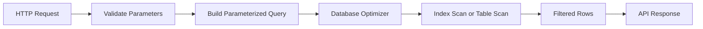

# 13- Filtering Rules and Best Practices

## Overview

SQL filtering determines which rows a query returns. The primary mechanism is the `WHERE` clause, combined with comparison operators, logical operators, pattern matching, `IN`, `BETWEEN`, and `NULL` predicates.

In production systems, filtering is more than writing syntactically correct predicates. A good filter must also:

- Express the intended business rule precisely.
- Handle `NULL` and three-valued logic correctly.
- Produce predictable results at boundary conditions.
- Use parameters rather than string interpolation.
- Give the database a reasonable opportunity to use indexes.
- Avoid unnecessary work on large datasets.
- Remain understandable when business rules become complex.

For backend engineers, filtering is one of the most important places where application behavior, database semantics, and query performance intersect.

## Filtering in the SQL Execution Model

A simplified query-processing model is:

```text
FROM / JOIN
     |
     v
WHERE
     |
     v
GROUP BY
     |
     v
HAVING
     |
     v
SELECT
     |
     v
DISTINCT
     |
     v
ORDER BY
     |
     v
LIMIT / OFFSET
```

The database optimizer is free to transform the physical execution plan, so this is a conceptual model rather than a literal implementation sequence.

For example:

```sql
SELECT
    id,
    email
FROM users
WHERE is_active = TRUE
  AND created_at >= TIMESTAMP '2026-01-01 00:00:00';
```

The optimizer determines how to retrieve the qualifying rows. It may use an index, scan a table, combine indexes, or choose another access strategy based on statistics and cost.

## Core Filtering Rules

A production filtering strategy should follow a few consistent rules.

| Rule | Recommendation |
|---|---|
| Filter early | Restrict the candidate row set as much as the query semantics allow |
| Be explicit | Express business conditions directly |
| Handle `NULL` deliberately | Use `IS NULL` / `IS NOT NULL` |
| Parameterize values | Never concatenate user input into SQL |
| Group complex logic | Use parentheses when mixing `AND` and `OR` |
| Prefer sargable predicates | Avoid unnecessary functions around indexed columns |
| Validate boundaries | Test dates, ranges, empty sets, and nullable values |
| Inspect plans | Use `EXPLAIN` for performance-sensitive queries |
| Keep predicates maintainable | Split complex business logic into understandable conditions |

## Equality and Comparison Operators

Common comparison operators include:

| Operator | Meaning |
|---|---|
| `=` | Equal |
| `<>` | Not equal |
| `!=` | Not equal in databases that support it |
| `>` | Greater than |
| `>=` | Greater than or equal |
| `<` | Less than |
| `<=` | Less than or equal |

Example:

```sql
SELECT
    id,
    order_number,
    total_amount
FROM orders
WHERE total_amount >= 1000;
```

Comparison operators are appropriate when the business requirement can be expressed directly as a relationship between values.

Remember that comparisons involving `NULL` generally evaluate to `UNKNOWN`.

Incorrect:

```sql
WHERE completed_at = NULL;
```

Correct:

```sql
WHERE completed_at IS NULL;
```

## Prefer Explicit Business Semantics

Avoid writing filters that rely on accidental database behavior.

For example:

```sql
SELECT
    id
FROM orders
WHERE status <> 'cancelled';
```

This excludes rows where `status` is `NULL`.

If the requirement is:

> Return orders that are not cancelled, including orders whose status is unknown.

then write that requirement explicitly:

```sql
SELECT
    id
FROM orders
WHERE status <> 'cancelled'
   OR status IS NULL;
```

Whether `NULL` should qualify is a domain decision. SQL cannot infer it.

## AND and OR

`AND` requires both predicates to be true.

```sql
SELECT
    id,
    email
FROM users
WHERE is_active = TRUE
  AND country_code = 'IN';
```

`OR` requires at least one predicate to be true.

```sql
SELECT
    id,
    email
FROM users
WHERE country_code = 'IN'
   OR country_code = 'US';
```

When combining them, use parentheses to make the intended grouping explicit.

Prefer:

```sql
SELECT
    id,
    email
FROM users
WHERE is_active = TRUE
  AND (
      country_code = 'IN'
      OR country_code = 'US'
  );
```

This is clearer than relying on readers to remember operator precedence.

## Filtering with Multiple Conditions

A common backend query combines several dimensions:

```sql
SELECT
    id,
    order_number,
    customer_id,
    total_amount
FROM orders
WHERE customer_id = $1
  AND status IN ('pending', 'processing')
  AND total_amount >= $2
  AND created_at >= $3;
```

Each predicate represents a separate business constraint.

This style is easier to maintain than embedding the same logic into application code and retrieving unnecessary rows.

## IN and NOT IN

Use `IN` when a value may match one of several discrete values.

```sql
SELECT
    id,
    order_number,
    status
FROM orders
WHERE status IN ('pending', 'processing', 'shipped');
```

This is generally clearer than:

```sql
WHERE status = 'pending'
   OR status = 'processing'
   OR status = 'shipped';
```

For exclusions:

```sql
SELECT
    id,
    order_number
FROM orders
WHERE status NOT IN ('cancelled', 'refunded');
```

Be careful with `NOT IN` when the compared values or subquery can contain `NULL`.

For example:

```sql
WHERE customer_id NOT IN (
    SELECT customer_id
    FROM blocked_customers
);
```

If the subquery returns `NULL`, three-valued logic can produce unexpected results.

For anti-join semantics, `NOT EXISTS` is often safer:

```sql
SELECT
    c.id
FROM customers AS c
WHERE NOT EXISTS (
    SELECT 1
    FROM blocked_customers AS b
    WHERE b.customer_id = c.id
);
```

## BETWEEN

`BETWEEN` is inclusive at both ends.

```sql
SELECT
    id,
    total_amount
FROM orders
WHERE total_amount BETWEEN 100 AND 500;
```

This means:

```text
total_amount >= 100
AND total_amount <= 500
```

### Date and Timestamp Filtering

Be particularly careful with timestamps.

This query:

```sql
WHERE created_at BETWEEN
    TIMESTAMP '2026-08-01 00:00:00'
    AND TIMESTAMP '2026-08-31 23:59:59'
```

can create boundary problems when timestamps have fractional seconds.

A safer pattern for a half-open time interval is:

```sql
WHERE created_at >= TIMESTAMP '2026-08-01 00:00:00'
  AND created_at <  TIMESTAMP '2026-09-01 00:00:00'
```

The interval is:

```text
[2026-08-01 00:00:00, 2026-09-01 00:00:00)
```

This approach works well for:

- Daily reports
- Monthly reports
- Event processing
- Time-series queries
- Incremental data extraction

It also avoids having to guess the final representable timestamp of a period.

## LIKE and Pattern Matching

`LIKE` supports wildcard matching.

| Pattern | Meaning |
|---|---|
| `'abc%'` | Starts with `abc` |
| `'%abc'` | Ends with `abc` |
| `'%abc%'` | Contains `abc` |
| `'a_c'` | `a`, any single character, `c` |

Example:

```sql
SELECT
    id,
    email
FROM users
WHERE email LIKE 'admin@%';
```

For a search such as:

```sql
WHERE email LIKE '%@example.com'
```

the leading wildcard can make ordinary B-tree index usage ineffective in many databases.

Do not automatically use `LIKE '%term%'` for high-volume search requirements. Consider database-specific search features or a dedicated search system when appropriate.

## NULL Filtering

Use:

```sql
WHERE deleted_at IS NULL;
```

or:

```sql
WHERE deleted_at IS NOT NULL;
```

Never use:

```sql
WHERE deleted_at = NULL;
```

or:

```sql
WHERE deleted_at <> NULL;
```

A filter involving `NULL` must account for SQL's three-valued logic.

## Avoid Implicit Type Conversion

Prefer comparing values using compatible data types.

For example, if:

```text
customer_id
```

is a numeric column, bind a numeric parameter rather than passing arbitrary text and relying on implicit conversion.

Explicit typing improves:

- Predictability
- Portability
- Error detection
- Query planning
- Maintainability

The exact behavior of implicit casts differs between database engines.

## Parameterized Filtering

Never construct SQL by concatenating user input.

Unsafe:

```python
query = f"""
SELECT id, email
FROM users
WHERE email = '{email}'
"""
```

If `email` originates from an HTTP request, this creates a SQL injection risk.

Use parameters:

```python
query = """
SELECT
    id,
    email
FROM users
WHERE email = %s
"""

cursor.execute(query, (email,))
```

The parameterization API differs between database drivers.

For Django:

```python
users = User.objects.filter(email=email)
```

For SQLAlchemy:

```python
from sqlalchemy import select

statement = select(User).where(User.email == email)
```

The principle is the same: values should be bound as parameters rather than inserted into SQL text.

## Sargable Predicates

A predicate is commonly described as **sargable** when the database can use it efficiently with an applicable index.

Prefer:

```sql
SELECT
    id
FROM users
WHERE created_at >= $1;
```

over:

```sql
SELECT
    id
FROM users
WHERE DATE(created_at) >= $1;
```

The second query applies a function to the indexed column, which can prevent or complicate normal index usage.

A better approach is often to calculate the boundary externally:

```sql
WHERE created_at >= $1
  AND created_at < $2;
```

For example, the application can calculate the start and end timestamps for a day.

The exact optimizer behavior depends on the database and available indexes, so performance claims should be verified with `EXPLAIN`.

## Filtering Indexed Columns

Suppose:

```sql
CREATE INDEX idx_orders_customer_id
ON orders (customer_id);
```

This query can potentially use the index:

```sql
SELECT
    id,
    order_number
FROM orders
WHERE customer_id = $1;
```

But indexing does not guarantee an index scan.

The optimizer considers:

- Predicate selectivity
- Table size
- Statistics
- Data distribution
- Index size
- Query cost
- Cached pages
- Available execution strategies

For example, if almost every row has the same `status`, an index on `status` alone may not provide much benefit.

## Composite Indexes and Filtering

For a query such as:

```sql
SELECT
    id,
    order_number
FROM orders
WHERE customer_id = $1
  AND status = $2
ORDER BY created_at DESC
LIMIT 50;
```

a composite index may be more useful than several unrelated indexes:

```sql
CREATE INDEX idx_orders_customer_status_created
ON orders (customer_id, status, created_at DESC);
```

The correct index depends on the complete workload, not just the `WHERE` clause.

A senior-level approach considers:

```text
WHERE
  ↓
JOIN
  ↓
ORDER BY
  ↓
LIMIT
```

together when designing indexes.

## Filter Before Pagination

Pagination should operate on a correctly filtered result set.

Prefer:

```sql
SELECT
    id,
    order_number,
    created_at
FROM orders
WHERE customer_id = $1
  AND status = 'completed'
ORDER BY created_at DESC, id DESC
LIMIT 50;
```

Do not fetch a broad dataset into the application and filter it afterward.

The database is optimized to perform filtering close to the data.

## Pagination and Stable Filtering

When using cursor-based pagination, filters must remain consistent between requests.

For example:

```sql
SELECT
    id,
    order_number,
    created_at
FROM orders
WHERE customer_id = $1
  AND status = $2
  AND (created_at, id) < ($3, $4)
ORDER BY created_at DESC, id DESC
LIMIT 50;
```

The cursor contains the values necessary to continue from a deterministic position.

A stable ordering and matching index are important for predictable performance at scale.

## Filtering and JOINs

Filtering can occur in `WHERE` or, for outer joins, sometimes in `ON`.

Consider:

```sql
SELECT
    c.id,
    o.id AS order_id
FROM customers AS c
LEFT JOIN orders AS o
    ON o.customer_id = c.id
WHERE o.status = 'completed';
```

The `WHERE` predicate removes rows where no matching order exists.

If customers without completed orders must remain:

```sql
SELECT
    c.id,
    o.id AS order_id
FROM customers AS c
LEFT JOIN orders AS o
    ON o.customer_id = c.id
   AND o.status = 'completed';
```

The placement of a predicate can therefore change query semantics, not merely performance.

## Filtering and Aggregation

Use `WHERE` to filter rows before aggregation.

```sql
SELECT
    customer_id,
    COUNT(*) AS completed_orders
FROM orders
WHERE status = 'completed'
GROUP BY customer_id;
```

Use `HAVING` to filter groups after aggregation.

```sql
SELECT
    customer_id,
    COUNT(*) AS completed_orders
FROM orders
WHERE status = 'completed'
GROUP BY customer_id
HAVING COUNT(*) >= 10;
```

The distinction is:

| Clause | Filters |
|---|---|
| `WHERE` | Individual rows |
| `HAVING` | Groups produced by aggregation |

Filtering with `WHERE` can also reduce the amount of data that must be grouped.

## Filtering with CASE Expressions

`CASE` can express conditional logic:

```sql
SELECT
    id,
    total_amount,
    CASE
        WHEN total_amount >= 10000 THEN 'high'
        WHEN total_amount >= 1000 THEN 'medium'
        ELSE 'low'
    END AS order_class
FROM orders;
```

However, do not use `CASE` unnecessarily inside `WHERE`.

For example, this:

```sql
WHERE CASE
    WHEN status = 'completed' THEN 1
    ELSE 0
END = 1
```

is less direct than:

```sql
WHERE status = 'completed';
```

Prefer predicates that communicate the business rule directly.

## Filtering with Functions

Functions are useful, but applying them to filtered columns can affect index usage.

For example:

```sql
WHERE LOWER(email) = LOWER($1)
```

may require an expression index or another database-specific strategy.

In PostgreSQL, one possible approach is:

```sql
CREATE INDEX idx_users_lower_email
ON users (LOWER(email));
```

Then the expression used by the query matches the expression indexed by the database.

Alternatively, normalize data at write time when the domain requires case-insensitive identity.

The correct solution depends on data semantics and workload.

## Dynamic Filters in Backend APIs

REST APIs frequently expose optional filters:

```text
GET /orders?status=completed&customer_id=42
```

The application should build predicates from validated parameters rather than interpolating raw query strings.

Conceptually:



A backend service should define:

- Which filters are supported.
- Valid values.
- Default behavior.
- Whether omitted and explicit `NULL` have different meanings.
- Maximum page size.
- Allowed sort fields.
- Whether filters can be combined.

Do not expose arbitrary SQL expressions through an API.

## Dynamic Filtering and ORM Safety

Django example:

```python
from django.db.models import Q

queryset = Order.objects.all()

if customer_id is not None:
    queryset = queryset.filter(customer_id=customer_id)

if status is not None:
    queryset = queryset.filter(status=status)

if include_cancelled is False:
    queryset = queryset.exclude(status="cancelled")
```

The ORM handles value parameterization.

However, dynamically constructing field names still requires validation.

For example, never allow an arbitrary request parameter to become an unchecked database field expression.

Use an allowlist:

```python
ALLOWED_SORT_FIELDS = {
    "created_at": "created_at",
    "amount": "total_amount",
}

sort_field = ALLOWED_SORT_FIELDS.get(requested_sort)
if sort_field is None:
    raise ValueError("Unsupported sort field")
```

Values and SQL identifiers have different security characteristics. Parameter binding protects values, but it does not generally turn arbitrary identifiers into safe parameters.

## Filtering Large Tables

Filtering strategy becomes increasingly important as table size grows.

For large datasets:

- Index frequently queried predicates when selective.
- Prefer composite indexes that match real query patterns.
- Avoid unnecessary functions on indexed columns.
- Use appropriate pagination.
- Avoid returning unused columns.
- Avoid retrieving large result sets into application memory.
- Use partitioning only when it solves a demonstrated workload problem.
- Consider archival strategies for historical data.
- Monitor query latency and database resource consumption.

A query that is acceptable against 50,000 rows may become operationally expensive against hundreds of millions of rows.

## Selecting Only Required Columns

Filtering and projection should work together.

Avoid:

```sql
SELECT *
FROM orders
WHERE customer_id = $1;
```

when the API only needs:

```sql
SELECT
    id,
    order_number,
    created_at,
    total_amount
FROM orders
WHERE customer_id = $1;
```

Selecting fewer columns can reduce:

- Network transfer
- Database I/O
- Memory usage
- Serialization cost
- Application processing

It can also make covering or index-only strategies more feasible, depending on the database.

## Query Plans

For performance-sensitive filters, inspect the actual plan.

PostgreSQL example:

```sql
EXPLAIN (ANALYZE, BUFFERS)
SELECT
    id,
    order_number
FROM orders
WHERE customer_id = 42
  AND status = 'completed'
ORDER BY created_at DESC
LIMIT 50;
```

Look for:

- Sequential scans where an index should be useful.
- Large row estimates that differ significantly from actual rows.
- Excessive rows removed by filters.
- Expensive sorts.
- High buffer reads.
- Unexpected join strategies.
- Poor selectivity.

Do not optimize solely by intuition. Measure the actual workload.

## Security Considerations

Filtering is a major SQL injection boundary.

### Unsafe

```python
query = f"SELECT id FROM users WHERE username = '{username}'"
```

### Safe

```python
cursor.execute(
    "SELECT id FROM users WHERE username = %s",
    (username,),
)
```

Additional API-level protections include:

- Validate filter types.
- Allowlist enum-like values.
- Restrict page sizes.
- Allowlist sort fields.
- Reject unsupported filters.
- Avoid exposing raw SQL errors.
- Apply authorization independently of user-provided filters.

Filtering is not authorization.

For example:

```sql
SELECT
    id,
    document_url
FROM documents
WHERE owner_id = $1
  AND id = $2;
```

The `owner_id` restriction should come from trusted application context, not from a client-controlled ownership parameter.

## Reliability and Operational Considerations

A production filter should remain predictable under load.

Consider:

- Query timeout configuration.
- Maximum result size.
- Pagination limits.
- Connection pool capacity.
- Index maintenance overhead.
- Database CPU and I/O.
- Lock interactions for concurrent workloads.
- Query latency percentiles.
- Slow-query logging.
- Read replica behavior if replicas are used.

A highly flexible filtering API can become an accidental denial-of-service vector if clients can request expensive combinations such as:

```text
contains search
+ multiple joins
+ large date range
+ unbounded result set
+ expensive sort
```

Control query complexity at the API boundary.

## Common Mistakes

### Relying on Implicit AND/OR Precedence

Ambiguous:

```sql
WHERE is_active = TRUE
  AND country = 'IN'
  OR country = 'US';
```

This is interpreted according to SQL operator precedence, but the intended business rule may be unclear.

Prefer:

```sql
WHERE is_active = TRUE
  AND (
      country = 'IN'
      OR country = 'US'
  );
```

### Filtering in Python Instead of SQL

Avoid:

```python
orders = list(Order.objects.all())

completed = [
    order for order in orders
    if order.status == "completed"
]
```

Prefer:

```python
completed = Order.objects.filter(status="completed")
```

The database can filter before transferring rows to the application.

### Using SELECT *

Avoid:

```sql
SELECT *
FROM orders
WHERE customer_id = $1;
```

when only a few columns are required.

### Unsafe String Interpolation

Never construct SQL from raw request parameters.

Use parameterized queries or a properly used ORM/query builder.

### Incorrect NULL Handling

Incorrect:

```sql
WHERE deleted_at = NULL;
```

Correct:

```sql
WHERE deleted_at IS NULL;
```

### Using NOT IN with Nullable Data

Do not assume:

```sql
NOT IN
```

behaves like a simple negation when `NULL` can be present.

Consider `NOT EXISTS` for anti-join semantics.

### Using BETWEEN for Timestamp Periods

Avoid relying on:

```sql
BETWEEN start_timestamp AND '23:59:59'
```

for high-precision timestamps.

Prefer half-open intervals:

```sql
WHERE created_at >= $1
  AND created_at < $2;
```

### Applying Functions to Indexed Columns

Potentially problematic:

```sql
WHERE DATE(created_at) = $1;
```

Prefer a range:

```sql
WHERE created_at >= $1
  AND created_at < $2;
```

### Assuming an Index Guarantees Performance

An index may not be selected if the optimizer estimates that another strategy is cheaper.

Validate with `EXPLAIN`.

### Returning Unbounded Results

Avoid endpoints that effectively execute:

```sql
SELECT ...
FROM orders
WHERE customer_id = $1;
```

and return millions of rows.

Use bounded pagination and appropriate API limits.

## Filtering Checklist

Before shipping a production query, verify:

| Check | Question |
|---|---|
| Correctness | Does the predicate exactly match the business rule? |
| NULL | What happens when relevant columns are `NULL`? |
| Logic | Are `AND` and `OR` grouped explicitly? |
| Boundaries | Are date and numeric boundaries correct? |
| IN | Can the value set contain `NULL`? |
| JOIN | Does predicate placement preserve intended join semantics? |
| Types | Are compared values type-compatible? |
| Security | Are user-controlled values parameterized? |
| Indexes | Can the query use an appropriate index? |
| Sargability | Are functions or casts unnecessarily applied to indexed columns? |
| Pagination | Is the result bounded and deterministic? |
| Projection | Are only required columns selected? |
| Performance | Has the query plan been inspected for important workloads? |
| Operations | Can this query remain safe under large or adversarial inputs? |

## Interview Traps

| Question | Strong answer |
|---|---|
| Does `WHERE` keep `UNKNOWN`? | No. Rows are retained only when the predicate evaluates to `TRUE`. |
| Why use parentheses around mixed `AND` and `OR` conditions? | To make logical grouping explicit and prevent unintended results. |
| Is `BETWEEN` inclusive? | Yes, both endpoints are included. |
| Why prefer half-open timestamp ranges? | They avoid precision and end-of-period boundary problems. |
| Why can `NOT IN` behave unexpectedly? | `NULL` introduces `UNKNOWN` into the comparison logic. |
| Why can `LEFT JOIN` plus a right-side `WHERE` condition behave like an inner join? | The `WHERE` predicate removes rows where the right side is `NULL`. |
| What is a sargable predicate? | A predicate structured so the optimizer can efficiently use an applicable index or access path. |
| Does every indexed filter use the index? | No. The optimizer chooses the plan based on cost, selectivity, statistics, and other factors. |
| Why avoid `SELECT *`? | It can increase I/O, network transfer, memory use, serialization cost, and coupling to schema changes. |
| Is filtering in application code equivalent to filtering in SQL? | Functionally it may produce the same final set, but database-side filtering avoids unnecessary data transfer and application memory use. |
| Does parameterization solve authorization? | No. It prevents injection of values but does not establish whether the caller is allowed to access a row. |
| Why use `WHERE` instead of `HAVING` for ordinary row filters? | `WHERE` filters rows before grouping; `HAVING` filters groups after aggregation. |

## Key Takeaways

- Write filters as explicit business predicates, group mixed `AND`/`OR` logic with parentheses, and handle `NULL` deliberately.
- Use parameterized queries, bounded pagination, and allowlisted dynamic identifiers to keep filtering APIs secure and predictable.
- Prefer sargable predicates, appropriate composite indexes, and half-open timestamp ranges for scalable production queries.
- Treat `NOT IN`, `LEFT JOIN`, functions on indexed columns, and implicit type conversions as areas requiring deliberate review.
- Validate important queries with realistic data, `EXPLAIN`, execution metrics, and edge-case tests before relying on them in production.