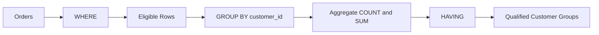

# 14- WHERE vs HAVING

## Overview

`WHERE` and `HAVING` both filter query results, but they operate at different stages of query processing:

- `WHERE` filters **rows before grouping and aggregation**.
- `HAVING` filters **groups after grouping and aggregation**.

This distinction matters for correctness and performance. Using `WHERE` when a row-level predicate is sufficient usually reduces the amount of data that must be grouped, while `HAVING` is required when the condition depends on an aggregate result such as `COUNT()`, `SUM()`, or `AVG()`.

A useful mental model is:

```text
FROM / JOIN
     |
     v
WHERE       <-- Filter individual rows
     |
     v
GROUP BY    <-- Build groups
     |
     v
HAVING      <-- Filter groups
     |
     v
SELECT
     |
     v
ORDER BY
```

The optimizer may physically execute the query differently, but the semantic distinction remains fundamental.

## WHERE

### What It Is

`WHERE` specifies predicates that determine which input rows participate in the rest of the query.

```sql
SELECT
    id,
    customer_id,
    total_amount
FROM orders
WHERE status = 'completed';
```

Only rows whose `status` satisfies the predicate participate in subsequent operations.

### Why It Exists

Row-level filtering is needed to restrict the dataset before operations such as:

- `GROUP BY`
- Aggregation
- `DISTINCT`
- Sorting
- Further query processing

Filtering early can reduce CPU, memory, I/O, and intermediate result sizes.

### When to Use It

Use `WHERE` when the condition depends on individual row values.

```sql
SELECT
    customer_id,
    COUNT(*) AS order_count
FROM orders
WHERE status = 'completed'
GROUP BY customer_id;
```

Here, `status = 'completed'` is a property of each individual order, so it belongs in `WHERE`.

### Common Predicates

```sql
WHERE status = 'completed'

WHERE total_amount >= 1000

WHERE created_at >= $1

WHERE customer_id IN (10, 20, 30)

WHERE deleted_at IS NULL
```

Multiple predicates can be combined:

```sql
SELECT
    id,
    customer_id,
    total_amount
FROM orders
WHERE status = 'completed'
  AND total_amount >= 1000
  AND deleted_at IS NULL;
```

## HAVING

### What It Is

`HAVING` filters groups produced by `GROUP BY`.

```sql
SELECT
    customer_id,
    COUNT(*) AS order_count
FROM orders
GROUP BY customer_id
HAVING COUNT(*) >= 10;
```

The database first creates one group per `customer_id`, calculates `COUNT(*)`, and then retains only groups whose count is at least `10`.

### Why It Exists

A row-level `WHERE` predicate cannot directly filter on the result of an aggregate operation.

This is invalid:

```sql
SELECT
    customer_id,
    COUNT(*) AS order_count
FROM orders
WHERE COUNT(*) >= 10
GROUP BY customer_id;
```

`COUNT(*)` is evaluated as part of aggregation, after row filtering.

The correct query is:

```sql
SELECT
    customer_id,
    COUNT(*) AS order_count
FROM orders
GROUP BY customer_id
HAVING COUNT(*) >= 10;
```

### When to Use It

Use `HAVING` when the condition depends on:

- `COUNT()`
- `SUM()`
- `AVG()`
- `MIN()`
- `MAX()`
- Other aggregate expressions
- Group-level expressions

Example:

```sql
SELECT
    customer_id,
    SUM(total_amount) AS lifetime_value
FROM orders
WHERE status = 'completed'
GROUP BY customer_id
HAVING SUM(total_amount) >= 10000;
```

Here:

- `WHERE` removes non-completed orders.
- `GROUP BY` creates customer groups.
- `SUM()` calculates each customer's total.
- `HAVING` removes customers whose total is below `10000`.

## WHERE and HAVING Together

Production queries frequently use both.

```sql
SELECT
    customer_id,
    COUNT(*) AS completed_orders,
    SUM(total_amount) AS total_revenue
FROM orders
WHERE status = 'completed'
  AND created_at >= $1
  AND created_at < $2
GROUP BY customer_id
HAVING COUNT(*) >= 10
   AND SUM(total_amount) >= 10000;
```

The logical intent is:



This is an important production pattern:

> Use `WHERE` for row-level restrictions and `HAVING` for aggregate/group-level restrictions.

## Direct Comparison

| Aspect | `WHERE` | `HAVING` |
|---|---|---|
| Filters | Rows | Groups |
| Applied conceptually | Before grouping | After grouping |
| Aggregate functions | Cannot normally filter on aggregate result | Designed for aggregate/group conditions |
| Requires `GROUP BY` | No | Usually associated with grouping, though SQL dialects can allow it without `GROUP BY` |
| Performance role | Can significantly reduce input to aggregation | Filters after aggregation |
| Typical use | `status = 'completed'` | `COUNT(*) >= 10` |
| Typical predicate | Row property | Group property |

## A Practical Example

Consider an `orders` table:

| id | customer_id | status | total_amount |
|---:|---:|---|---:|
| 1 | 101 | completed | 500 |
| 2 | 101 | completed | 700 |
| 3 | 101 | cancelled | 900 |
| 4 | 102 | completed | 5000 |
| 5 | 102 | completed | 6000 |
| 6 | 103 | completed | 100 |

Requirement:

> Find customers who have at least two completed orders worth at least ₹1,000 in total.

The query is:

```sql
SELECT
    customer_id,
    COUNT(*) AS completed_orders,
    SUM(total_amount) AS total_amount
FROM orders
WHERE status = 'completed'
GROUP BY customer_id
HAVING COUNT(*) >= 2
   AND SUM(total_amount) >= 1000;
```

The stages are:

```text
All orders
   |
   | WHERE status = 'completed'
   v
Completed orders
   |
   | GROUP BY customer_id
   v
Customer groups
   |
   | COUNT + SUM
   v
Aggregated customer metrics
   |
   | HAVING COUNT >= 2
   |     AND SUM >= 1000
   v
Qualified customers
```

## Why WHERE Usually Comes Before HAVING

Suppose a table contains 100 million orders, but only 5 million are completed.

This query:

```sql
SELECT
    customer_id,
    COUNT(*)
FROM orders
WHERE status = 'completed'
GROUP BY customer_id;
```

allows the database to restrict the aggregation input to qualifying rows.

Contrast that with unnecessarily aggregating all rows and then attempting to remove groups afterward.

The important distinction is not merely syntactic. Reducing the input to expensive operations can reduce:

- CPU consumption
- Memory requirements
- Temporary storage
- Sort or hash work
- Query latency

The optimizer may push predicates down internally when semantics permit, but engineers should still express the query according to its intended semantics.

## Predicate Pushdown

Modern query optimizers can sometimes move predicates closer to the data source.

For example, a condition may be logically written at a higher query level while the optimizer determines that it can safely apply it earlier.

However, predicate pushdown is subject to query semantics.

A condition involving:

```sql
COUNT(*)
SUM(total_amount)
AVG(score)
```

cannot simply be treated as an ordinary row-level predicate.

Do not depend on optimizer transformations as a substitute for understanding SQL semantics.

## Filtering Before Aggregation

Consider:

```sql
SELECT
    customer_id,
    COUNT(*) AS order_count
FROM orders
WHERE status = 'completed'
GROUP BY customer_id;
```

The `WHERE` condition determines which rows are eligible to participate in `COUNT(*)`.

Compare:

```sql
SELECT
    customer_id,
    COUNT(*) AS order_count
FROM orders
GROUP BY customer_id
HAVING status = 'completed';
```

This is generally invalid because `status` is neither grouped nor aggregated.

If the intention is to count completed orders, the correct approach is:

```sql
SELECT
    customer_id,
    COUNT(*) AS order_count
FROM orders
WHERE status = 'completed'
GROUP BY customer_id;
```

## Filtering Groups with HAVING

`HAVING` becomes necessary when the condition cannot be determined until aggregation occurs.

### Minimum Count

```sql
SELECT
    customer_id,
    COUNT(*) AS order_count
FROM orders
GROUP BY customer_id
HAVING COUNT(*) >= 10;
```

### Minimum Revenue

```sql
SELECT
    customer_id,
    SUM(total_amount) AS revenue
FROM orders
WHERE status = 'completed'
GROUP BY customer_id
HAVING SUM(total_amount) >= 100000;
```

### Average Value

```sql
SELECT
    customer_id,
    AVG(total_amount) AS average_order_value
FROM orders
GROUP BY customer_id
HAVING AVG(total_amount) > 5000;
```

### Maximum Value

```sql
SELECT
    customer_id,
    MAX(total_amount) AS largest_order
FROM orders
GROUP BY customer_id
HAVING MAX(total_amount) >= 50000;
```

## WHERE vs HAVING with Date Filters

A common production mistake is putting row-level date filters in `HAVING`.

Avoid:

```sql
SELECT
    customer_id,
    COUNT(*) AS order_count
FROM orders
GROUP BY customer_id
HAVING MAX(created_at) >= $1;
```

unless the business rule specifically means:

> Keep customers whose latest order occurred after this timestamp.

If the requirement is:

> Count orders created during a particular period.

use `WHERE`:

```sql
SELECT
    customer_id,
    COUNT(*) AS order_count
FROM orders
WHERE created_at >= $1
  AND created_at < $2
GROUP BY customer_id;
```

The two queries represent different business semantics.

### Example of Intentional HAVING

This is valid when the requirement is:

> Find customers whose most recent order was within the specified period.

```sql
SELECT
    customer_id,
    MAX(created_at) AS latest_order_at
FROM orders
GROUP BY customer_id
HAVING MAX(created_at) >= $1
   AND MAX(created_at) < $2;
```

The important question is not "Can I put this condition in `HAVING`?" but:

> Does the condition describe a row, or does it describe an aggregated group?

## WHERE vs HAVING with JOINs

Consider customers and orders:

```sql
SELECT
    c.id,
    COUNT(o.id) AS order_count
FROM customers AS c
JOIN orders AS o
    ON o.customer_id = c.id
WHERE o.status = 'completed'
GROUP BY c.id
HAVING COUNT(o.id) >= 10;
```

Here:

- `WHERE o.status = 'completed'` filters individual joined rows.
- `HAVING COUNT(o.id) >= 10` filters customer groups.

This separation is clear and usually aligns well with database execution.

## Outer JOIN Considerations

Predicate placement becomes especially important with outer joins.

Suppose the requirement is:

> Return every customer and count only completed orders.

Use:

```sql
SELECT
    c.id,
    COUNT(o.id) AS completed_orders
FROM customers AS c
LEFT JOIN orders AS o
    ON o.customer_id = c.id
   AND o.status = 'completed'
GROUP BY c.id;
```

Putting the predicate in `WHERE`:

```sql
SELECT
    c.id,
    COUNT(o.id) AS completed_orders
FROM customers AS c
LEFT JOIN orders AS o
    ON o.customer_id = c.id
WHERE o.status = 'completed'
GROUP BY c.id;
```

removes customers with no matching completed order because the `WHERE` predicate rejects the `NULL`-extended side of the outer join.

This is a semantic difference, not merely a performance optimization.

## HAVING Without GROUP BY

SQL dialects can permit `HAVING` without an explicit `GROUP BY`, in which case the query can operate on the single implicit group produced by aggregation.

For example:

```sql
SELECT
    COUNT(*) AS order_count
FROM orders
HAVING COUNT(*) >= 1000000;
```

This asks whether the entire result qualifies as a group.

This is valid SQL in common relational databases, but it is less common in application queries than `WHERE` plus explicit grouping.

## WHERE and HAVING with DISTINCT

`DISTINCT` is conceptually applied after the row filtering stage.

For example:

```sql
SELECT DISTINCT
    customer_id
FROM orders
WHERE status = 'completed';
```

The query first filters orders and then removes duplicate customer IDs from the projected result.

Do not use `HAVING` merely because you want unique values. Use `DISTINCT` when deduplication is the actual requirement.

## Performance Considerations

### Filter Before Expensive Aggregation

Prefer:

```sql
SELECT
    customer_id,
    COUNT(*) AS order_count
FROM orders
WHERE status = 'completed'
GROUP BY customer_id;
```

when the business requirement is to aggregate only completed orders.

The database can potentially use:

- Indexes
- Partition pruning
- Predicate pushdown
- Selective scans

to reduce the input.

### Indexing

For a workload such as:

```sql
SELECT
    customer_id,
    COUNT(*)
FROM orders
WHERE status = 'completed'
GROUP BY customer_id;
```

the appropriate index depends on the data distribution and broader workload.

A possible PostgreSQL index might be:

```sql
CREATE INDEX idx_orders_completed_customer
ON orders (customer_id)
WHERE status = 'completed';
```

This is a partial index and can be useful when the query pattern consistently targets completed orders.

Do not create indexes solely because a column appears in `WHERE`. Verify workload characteristics and query plans.

### EXPLAIN

For production-critical queries, inspect the execution plan.

PostgreSQL:

```sql
EXPLAIN (ANALYZE, BUFFERS)
SELECT
    customer_id,
    COUNT(*) AS order_count
FROM orders
WHERE status = 'completed'
GROUP BY customer_id
HAVING COUNT(*) >= 10;
```

Review:

- Scan type
- Estimated versus actual rows
- Aggregation strategy
- Sort operations
- Hash memory
- Buffer reads
- Execution time

A correct query can still require optimization when executed over large datasets.

## Common Mistakes

### Using WHERE with Aggregate Functions

Incorrect:

```sql
SELECT
    customer_id,
    COUNT(*)
FROM orders
WHERE COUNT(*) >= 10
GROUP BY customer_id;
```

Correct:

```sql
SELECT
    customer_id,
    COUNT(*)
FROM orders
GROUP BY customer_id
HAVING COUNT(*) >= 10;
```

### Using HAVING for Ordinary Row Filters

Avoid:

```sql
SELECT
    customer_id,
    COUNT(*)
FROM orders
GROUP BY customer_id
HAVING status = 'completed';
```

If the requirement is to aggregate only completed orders:

```sql
WHERE status = 'completed'
```

belongs before `GROUP BY`.

### Moving Conditions Between WHERE and HAVING Without Checking Semantics

These queries are not necessarily equivalent:

```sql
WHERE created_at >= $1
```

and:

```sql
HAVING MAX(created_at) >= $1
```

The first means:

> Include rows created after the boundary.

The second means:

> Keep groups whose maximum creation timestamp is after the boundary.

Always translate the business requirement into row-level or group-level semantics first.

### Filtering an Outer Join in WHERE

This can unintentionally turn a `LEFT JOIN` into inner-join-like behavior:

```sql
FROM customers AS c
LEFT JOIN orders AS o
    ON o.customer_id = c.id
WHERE o.status = 'completed'
```

If unmatched customers must remain, consider putting the predicate in the `ON` condition.

### Assuming HAVING Is Always Slow

`HAVING` is not inherently inefficient. It is the correct mechanism for filtering aggregate results.

The performance question is whether unnecessary rows are being allowed into the aggregation stage.

## Production Best Practices

### Keep Row and Group Predicates Separate

Use a clear structure:

```sql
SELECT
    customer_id,
    COUNT(*) AS order_count,
    SUM(total_amount) AS revenue
FROM orders
WHERE status = 'completed'
  AND created_at >= $1
  AND created_at < $2
GROUP BY customer_id
HAVING COUNT(*) >= 10
   AND SUM(total_amount) >= 10000;
```

This makes the query's intent immediately visible.

### Use Half-Open Time Ranges

Prefer:

```sql
WHERE created_at >= $1
  AND created_at < $2
```

over timestamp ranges that attempt to represent the final instant of a period.

This avoids precision-related boundary bugs.

### Parameterize Values

Backend applications should bind filter values.

Django:

```python
orders = (
    Order.objects
    .filter(
        status="completed",
        created_at__gte=start_time,
        created_at__lt=end_time,
    )
    .values("customer_id")
    .annotate(order_count=Count("id"))
    .filter(order_count__gte=10)
)
```

The ORM translates the row-level filters and aggregate-level filters into appropriate SQL.

### Keep Authorization Separate

A `WHERE` clause supplied by a client does not automatically provide authorization.

For example, an API might accept:

```text
GET /orders?status=completed
```

but the backend must still constrain access to the caller's authorized tenant or account.

Conceptually:

```sql
SELECT
    id,
    order_number
FROM orders
WHERE tenant_id = $1
  AND status = $2;
```

The tenant restriction should come from trusted application context.

## Query Design Checklist

Before shipping a query containing `WHERE` or `HAVING`, ask:

| Question | Expected reasoning |
|---|---|
| Is this a row condition? | Put it in `WHERE` |
| Is this an aggregate/group condition? | Put it in `HAVING` |
| Can rows be filtered before aggregation? | Prefer `WHERE` when semantically correct |
| Does `NULL` affect the predicate? | Handle it explicitly |
| Are `AND`/`OR` conditions grouped? | Use parentheses where needed |
| Is an outer join involved? | Check whether predicate placement changes semantics |
| Are timestamps involved? | Prefer half-open intervals |
| Are user values involved? | Parameterize them |
| Is the query large or latency-sensitive? | Inspect `EXPLAIN` |
| Are indexes appropriate? | Validate against real workload and plans |
| Does the filter enforce authorization? | Do not assume it does |

## Interview Traps

| Question | Strong answer |
|---|---|
| What is the primary difference between `WHERE` and `HAVING`? | `WHERE` filters rows before grouping; `HAVING` filters groups after aggregation. |
| Why can't `WHERE COUNT(*) > 10` normally be used? | `COUNT(*)` is an aggregate result and is not available at the row-filtering stage. |
| Can a query use both? | Yes, and production queries commonly do. |
| Which should usually reduce the input to aggregation? | `WHERE`, when the predicate is a row-level condition. |
| Is `HAVING` only for `COUNT()`? | No. It can filter using any valid aggregate or group-level expression. |
| Are `WHERE` and `HAVING` interchangeable? | No. Moving a predicate can change both semantics and performance. |
| Why can a `LEFT JOIN` with a right-side `WHERE` predicate behave like an inner join? | The `WHERE` condition removes rows where the right-side columns are `NULL`. |
| Can `HAVING` be used without `GROUP BY`? | Yes, in common SQL implementations, particularly with aggregation over a single implicit group. |
| Which clause filters before `GROUP BY`? | `WHERE`. |
| Which clause filters after aggregation? | `HAVING`. |
| Does the textual order of SQL clauses guarantee physical execution order? | No. The optimizer can transform the execution plan while preserving query semantics. |

## Key Takeaways

- `WHERE` filters individual rows before grouping, while `HAVING` filters groups after aggregation.
- Use `WHERE` for row-level predicates and `HAVING` for conditions involving aggregate or group-level results.
- Combining both is common in production: filter the input with `WHERE`, aggregate with `GROUP BY`, then qualify groups with `HAVING`.
- Predicate placement can change semantics, especially with `LEFT JOIN`, `NULL`, timestamps, and aggregate expressions.
- For performance-sensitive queries, reduce unnecessary input early, use appropriate indexes, parameterize values, and validate execution plans with realistic data.