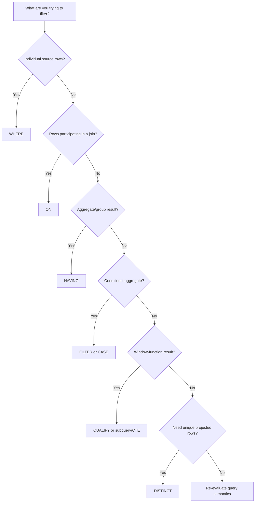

# 15- When to Use Which Filter

## Overview

SQL provides several mechanisms for restricting data, but they operate at different stages of query processing. Choosing the correct filter is primarily a question of **what level of data you are filtering**:

- `WHERE` filters individual rows before grouping and aggregation.
- `HAVING` filters groups after aggregation.
- `ON` controls which rows participate in a join relationship.
- `CASE` conditionally transforms values or derives classifications; it does not replace `WHERE` or `HAVING`.
- `FILTER` can conditionally include rows in individual aggregate functions in databases that support it.
- `QUALIFY`, where supported, filters results of window functions after those functions are evaluated.

The most important production principle is:

> Filter at the earliest semantically correct stage.

Earlier filtering can reduce the amount of data flowing through joins, aggregation, sorting, and window operations. However, moving a predicate is not merely an optimization technique—it can change query semantics, especially with outer joins and aggregates.

## Filter Selection at a Glance

| Requirement | Preferred mechanism | Typical example |
|---|---|---|
| Filter individual source rows | `WHERE` | `status = 'active'` |
| Restrict rows participating in a join | `ON` | `o.customer_id = c.id AND o.status = 'paid'` |
| Filter aggregated groups | `HAVING` | `COUNT(*) >= 10` |
| Conditionally calculate a value | `CASE` | `CASE WHEN amount > 1000 THEN 'high' END` |
| Conditionally aggregate rows | `FILTER` or `CASE` | `COUNT(*) FILTER (WHERE status = 'paid')` |
| Filter window-function results | `QUALIFY` where supported, otherwise a subquery/CTE | `ROW_NUMBER() = 1` |
| Remove duplicate projected rows | `DISTINCT` | `SELECT DISTINCT customer_id` |

The first decision should always be semantic rather than performance-driven.

## WHERE

### What It Is

`WHERE` filters rows before grouping and aggregation.

```sql
SELECT
    id,
    customer_id,
    total_amount
FROM orders
WHERE status = 'completed';
```

Only rows satisfying the predicate remain eligible for later query operations.

### Use WHERE When the Condition Describes a Row

Examples:

```sql
WHERE status = 'completed'
```

```sql
WHERE total_amount >= 1000
```

```sql
WHERE created_at >= $1
  AND created_at < $2
```

```sql
WHERE customer_id IN (101, 102, 103)
```

```sql
WHERE deleted_at IS NULL
```

A useful test is:

> Could I evaluate this condition by looking at one row independently?

If yes, `WHERE` is usually the correct choice.

### Multiple Row Filters

```sql
SELECT
    id,
    customer_id,
    total_amount
FROM orders
WHERE status = 'completed'
  AND total_amount >= 1000
  AND deleted_at IS NULL;
```

Use parentheses when combining `AND` and `OR` to make business logic explicit:

```sql
SELECT
    id,
    customer_id
FROM orders
WHERE status = 'completed'
  AND (
      total_amount >= 1000
      OR priority = 'high'
  );
```

## ON

### What It Is

`ON` defines the matching condition for a join.

```sql
SELECT
    c.id,
    c.email,
    o.id AS order_id
FROM customers AS c
JOIN orders AS o
    ON o.customer_id = c.id;
```

Additional predicates in `ON` can restrict which rows from the joined table participate in the relationship.

```sql
SELECT
    c.id,
    c.email,
    o.id AS order_id
FROM customers AS c
LEFT JOIN orders AS o
    ON o.customer_id = c.id
   AND o.status = 'completed';
```

This means:

> Keep every customer, but only match completed orders.

### Why ON Matters with Outer Joins

Consider:

```sql
SELECT
    c.id,
    o.id AS order_id
FROM customers AS c
LEFT JOIN orders AS o
    ON o.customer_id = c.id
   AND o.status = 'completed';
```

Customers without completed orders remain in the result.

Moving the predicate into `WHERE` changes the semantics:

```sql
SELECT
    c.id,
    o.id AS order_id
FROM customers AS c
LEFT JOIN orders AS o
    ON o.customer_id = c.id
WHERE o.status = 'completed';
```

For customers without a matching order, `o.status` is `NULL`, so the `WHERE` predicate rejects those rows.

This effectively removes the unmatched side of the `LEFT JOIN`.

### Practical Rule

For joins:

- Put **relationship and matching conditions** in `ON`.
- Put **global row filters** in `WHERE`.
- With outer joins, deliberately decide whether a condition should preserve unmatched rows.

## HAVING

### What It Is

`HAVING` filters groups after aggregation.

```sql
SELECT
    customer_id,
    COUNT(*) AS order_count
FROM orders
GROUP BY customer_id
HAVING COUNT(*) >= 10;
```

The database conceptually:

1. Selects rows.
2. Groups them.
3. Calculates aggregates.
4. Filters the resulting groups.

### Use HAVING for Group-Level Conditions

```sql
HAVING COUNT(*) >= 10
```

```sql
HAVING SUM(total_amount) >= 100000
```

```sql
HAVING AVG(total_amount) > 5000
```

```sql
HAVING MAX(created_at) >= $1
```

The key question is:

> Does the condition depend on the result of the group?

If yes, `HAVING` is the natural choice.

## WHERE and HAVING Together

Production reporting queries commonly use both.

```sql
SELECT
    customer_id,
    COUNT(*) AS completed_orders,
    SUM(total_amount) AS revenue
FROM orders
WHERE status = 'completed'
  AND created_at >= $1
  AND created_at < $2
GROUP BY customer_id
HAVING COUNT(*) >= 10
   AND SUM(total_amount) >= 10000;
```

The semantics are:

```text
All orders
    |
    v
WHERE
    |
    | status = completed
    | date range
    v
Eligible orders
    |
    v
GROUP BY customer_id
    |
    v
COUNT + SUM
    |
    v
HAVING
    |
    | COUNT >= 10
    | SUM >= 10000
    v
Qualified customers
```

This is usually clearer and more efficient than trying to express all conditions at one stage.

## CASE

### What It Is

`CASE` is a conditional expression. It produces a value; it does not inherently remove rows.

```sql
SELECT
    id,
    total_amount,
    CASE
        WHEN total_amount >= 10000 THEN 'enterprise'
        WHEN total_amount >= 1000 THEN 'large'
        ELSE 'standard'
    END AS order_segment
FROM orders;
```

The query still returns the rows. `CASE` merely determines the value of `order_segment`.

### Use CASE When You Need Conditional Values

Common uses include:

- Classification
- Derived fields
- Conditional calculations
- Bucketing
- Business reporting

Example:

```sql
SELECT
    customer_id,
    SUM(
        CASE
            WHEN status = 'completed' THEN total_amount
            ELSE 0
        END
    ) AS completed_revenue
FROM orders
GROUP BY customer_id;
```

### CASE Is Not a Replacement for WHERE

Avoid using:

```sql
SELECT
    id,
    total_amount
FROM orders
WHERE CASE
    WHEN status = 'completed' THEN TRUE
    ELSE FALSE
END;
```

when the requirement is simply:

```sql
SELECT
    id,
    total_amount
FROM orders
WHERE status = 'completed';
```

The second query directly expresses the row-level predicate and is easier to reason about.

## FILTER

### What It Is

The SQL `FILTER` clause allows an aggregate to process only rows satisfying a condition.

PostgreSQL supports:

```sql
SELECT
    customer_id,
    COUNT(*) AS total_orders,
    COUNT(*) FILTER (
        WHERE status = 'completed'
    ) AS completed_orders,
    COUNT(*) FILTER (
        WHERE status = 'cancelled'
    ) AS cancelled_orders
FROM orders
GROUP BY customer_id;
```

This is particularly useful when several conditional aggregates are required from the same input.

### Why FILTER Is Useful

Suppose you need:

- Total orders
- Completed orders
- Cancelled orders
- High-value orders

A single grouped query can calculate all of them:

```sql
SELECT
    customer_id,
    COUNT(*) AS total_orders,
    COUNT(*) FILTER (
        WHERE status = 'completed'
    ) AS completed_orders,
    COUNT(*) FILTER (
        WHERE status = 'cancelled'
    ) AS cancelled_orders,
    COUNT(*) FILTER (
        WHERE total_amount >= 10000
    ) AS high_value_orders
FROM orders
GROUP BY customer_id;
```

The conditions affect individual aggregate calculations rather than filtering the entire query.

### FILTER vs WHERE

These queries have different meanings.

```sql
SELECT
    customer_id,
    COUNT(*)
FROM orders
WHERE status = 'completed'
GROUP BY customer_id;
```

This removes non-completed orders from the input entirely.

By contrast:

```sql
SELECT
    customer_id,
    COUNT(*) AS total_orders,
    COUNT(*) FILTER (
        WHERE status = 'completed'
    ) AS completed_orders
FROM orders
GROUP BY customer_id;
```

keeps all orders available to the query while selectively counting completed ones.

## Window Functions and QUALIFY

Window functions operate after the input rows have been selected but before the final result is returned.

For example:

```sql
SELECT
    id,
    customer_id,
    created_at,
    ROW_NUMBER() OVER (
        PARTITION BY customer_id
        ORDER BY created_at DESC
    ) AS row_number
FROM orders;
```

If the requirement is to return only the latest order per customer, you need to filter on the window-function result.

Some databases support `QUALIFY`:

```sql
SELECT
    id,
    customer_id,
    created_at
FROM orders
QUALIFY ROW_NUMBER() OVER (
    PARTITION BY customer_id
    ORDER BY created_at DESC
) = 1;
```

PostgreSQL does not support `QUALIFY`, so use a subquery or CTE:

```sql
WITH ranked_orders AS (
    SELECT
        id,
        customer_id,
        created_at,
        ROW_NUMBER() OVER (
            PARTITION BY customer_id
            ORDER BY created_at DESC, id DESC
        ) AS row_number
    FROM orders
)
SELECT
    id,
    customer_id,
    created_at
FROM ranked_orders
WHERE row_number = 1;
```

This is an important distinction:

> `WHERE` cannot directly reference a window function calculated in the same query block because the window result is not available at the `WHERE` stage.

## DISTINCT

`DISTINCT` removes duplicate rows from the projected result.

```sql
SELECT DISTINCT
    customer_id
FROM orders;
```

Use it when the requirement is deduplication, not filtering.

Avoid using `DISTINCT` to hide an incorrect join:

```sql
SELECT DISTINCT
    c.id,
    c.email
FROM customers AS c
JOIN orders AS o
    ON o.customer_id = c.id;
```

If duplicate customers are unexpected, investigate why the join produces multiple order rows.

If the actual requirement is:

> Find customers who have at least one order.

`EXISTS` can often express the intent more directly:

```sql
SELECT
    c.id,
    c.email
FROM customers AS c
WHERE EXISTS (
    SELECT 1
    FROM orders AS o
    WHERE o.customer_id = c.id
);
```

## Choosing the Correct Filter

A practical decision process is:



## Common Real-World Patterns

### Filter Rows Before Aggregation

Requirement:

> Calculate completed revenue for the current month.

```sql
SELECT
    customer_id,
    SUM(total_amount) AS revenue
FROM orders
WHERE status = 'completed'
  AND created_at >= $1
  AND created_at < $2
GROUP BY customer_id;
```

Use `WHERE` because both conditions describe individual orders.

### Filter Aggregated Customers

Requirement:

> Find customers whose completed revenue exceeds ₹100,000.

```sql
SELECT
    customer_id,
    SUM(total_amount) AS revenue
FROM orders
WHERE status = 'completed'
GROUP BY customer_id
HAVING SUM(total_amount) >= 100000;
```

The revenue threshold belongs in `HAVING` because it is calculated per customer.

### Keep All Customers and Count Matching Orders

Requirement:

> Return every customer, including customers with zero completed orders.

```sql
SELECT
    c.id,
    COUNT(o.id) AS completed_orders
FROM customers AS c
LEFT JOIN orders AS o
    ON o.customer_id = c.id
   AND o.status = 'completed'
GROUP BY c.id;
```

The status predicate belongs in `ON` because unmatched customers must remain.

### Multiple Conditional Metrics

Requirement:

> Return total, completed, and failed order counts per customer.

```sql
SELECT
    customer_id,
    COUNT(*) AS total_orders,
    COUNT(*) FILTER (
        WHERE status = 'completed'
    ) AS completed_orders,
    COUNT(*) FILTER (
        WHERE status = 'failed'
    ) AS failed_orders
FROM orders
GROUP BY customer_id;
```

`FILTER` avoids repeatedly scanning or separately aggregating the same logical dataset.

### Latest Row Per Entity

Requirement:

> Return the latest order for every customer.

PostgreSQL-compatible approach:

```sql
WITH ranked_orders AS (
    SELECT
        id,
        customer_id,
        total_amount,
        created_at,
        ROW_NUMBER() OVER (
            PARTITION BY customer_id
            ORDER BY created_at DESC, id DESC
        ) AS rn
    FROM orders
)
SELECT
    id,
    customer_id,
    total_amount,
    created_at
FROM ranked_orders
WHERE rn = 1;
```

The outer `WHERE` filters the result of the window calculation.

## Predicate Placement and Query Semantics

Predicate movement is safe only when the semantics remain equivalent.

Consider:

```sql
SELECT
    c.id,
    COUNT(o.id)
FROM customers AS c
LEFT JOIN orders AS o
    ON o.customer_id = c.id
GROUP BY c.id;
```

If you want only completed orders while retaining customers with zero completed orders:

```sql
SELECT
    c.id,
    COUNT(o.id)
FROM customers AS c
LEFT JOIN orders AS o
    ON o.customer_id = c.id
   AND o.status = 'completed'
GROUP BY c.id;
```

Do not mechanically move:

```sql
o.status = 'completed'
```

between `ON` and `WHERE`.

For an `INNER JOIN`, many predicates can be moved between `ON` and `WHERE` without changing the result, assuming equivalent semantics. For `LEFT JOIN`, the distinction is often critical.

## Filtering and SQL's Logical Processing Order

A useful conceptual order is:

```text
FROM
  |
  v
JOIN / ON
  |
  v
WHERE
  |
  v
GROUP BY
  |
  v
HAVING
  |
  v
WINDOW FUNCTIONS
  |
  v
SELECT / DISTINCT
  |
  v
ORDER BY
  |
  v
LIMIT / OFFSET
```

This is a **logical processing model**, not a promise about the physical execution plan.

Database optimizers can reorder operations when they can prove that the result remains equivalent.

For example, a database may push a selective predicate closer to a table scan even though the SQL text places it later.

Understanding logical processing helps explain why some expressions are unavailable in certain clauses.

## Performance Considerations

### Filter Before Expensive Operations

If only 1% of a billion-row table is relevant, filtering before aggregation or large joins can substantially reduce work.

Prefer:

```sql
SELECT
    customer_id,
    COUNT(*)
FROM orders
WHERE status = 'completed'
GROUP BY customer_id;
```

when only completed orders matter.

Do not aggregate rows that the business logic ultimately discards.

### Use Indexes Based on Workload

For:

```sql
SELECT
    customer_id,
    COUNT(*)
FROM orders
WHERE status = 'completed'
GROUP BY customer_id;
```

an index might help, but the correct design depends on:

- Cardinality
- Selectivity
- Table size
- Data distribution
- Query frequency
- Write volume
- Existing indexes
- PostgreSQL execution plans

A possible PostgreSQL partial index is:

```sql
CREATE INDEX idx_orders_completed_customer
ON orders (customer_id)
WHERE status = 'completed';
```

Do not add indexes mechanically. Every index has storage and write-maintenance cost.

### Inspect Real Execution Plans

For PostgreSQL:

```sql
EXPLAIN (ANALYZE, BUFFERS)
SELECT
    customer_id,
    COUNT(*) AS order_count
FROM orders
WHERE status = 'completed'
GROUP BY customer_id
HAVING COUNT(*) >= 10;
```

Pay attention to:

- Actual versus estimated row counts
- Sequential versus index scans
- Join strategy
- Hash versus sort aggregation
- Memory usage
- Buffer reads
- Temporary I/O
- Execution time

## Security Considerations

Filtering is not authorization.

An API such as:

```text
GET /orders?status=completed
```

must not rely on the user-provided filter to establish access.

A multi-tenant application should enforce tenant isolation using trusted server-side context:

```sql
SELECT
    id,
    order_number,
    total_amount
FROM orders
WHERE tenant_id = $1
  AND status = $2;
```

The value for `tenant_id` should come from authenticated application context rather than an arbitrary client parameter.

Always parameterize filter values.

Avoid constructing SQL with string interpolation:

```python
# Unsafe
query = f"SELECT * FROM orders WHERE status = '{status}'"
```

Use parameterized queries through the database driver or ORM instead.

## Backend Application Example

A FastAPI endpoint might receive a status filter:

```python
from fastapi import FastAPI, Query
from typing import Literal

app = FastAPI()


@app.get("/orders")
def list_orders(
    status: Literal["pending", "completed", "cancelled"] | None = Query(default=None),
):
    # The database layer should bind `status` as a query parameter.
    ...
```

At the database layer, row-level filtering should remain explicit:

```sql
SELECT
    id,
    customer_id,
    status,
    total_amount,
    created_at
FROM orders
WHERE tenant_id = $1
  AND ($2 IS NULL OR status = $2)
ORDER BY created_at DESC
LIMIT $3;
```

For high-volume endpoints, be careful with patterns such as `($2 IS NULL OR status = $2)`. Depending on the database, statistics, and prepared-statement behavior, this can produce less efficient plans than separate query shapes for filtered and unfiltered cases. Measure with realistic workloads.

## Production Best Practices

### Prefer the Earliest Semantically Correct Filter

A good default is:

```text
JOIN condition      -> ON
Row restriction     -> WHERE
Grouping            -> GROUP BY
Group restriction   -> HAVING
Window result       -> QUALIFY/subquery
Conditional metric  -> FILTER/CASE
Deduplication       -> DISTINCT
```

Do not interpret "earliest" as permission to move every predicate into `WHERE`. Semantic correctness comes first.

### Make Business Semantics Explicit

Compare:

```sql
HAVING MAX(created_at) >= $1
```

with:

```sql
WHERE created_at >= $1
```

They mean different things.

The first asks whether the group's maximum timestamp satisfies the condition.

The second removes individual rows before grouping.

Write the query that represents the business rule rather than choosing a clause solely because it appears faster.

### Prefer Half-Open Timestamp Ranges

Use:

```sql
WHERE created_at >= $1
  AND created_at < $2
```

This avoids precision and boundary problems when representing periods such as days or months.

### Avoid Functions on Indexed Columns When They Prevent Efficient Access

Instead of:

```sql
WHERE DATE(created_at) = $1
```

prefer a range when appropriate:

```sql
WHERE created_at >= $1
  AND created_at < $2;
```

The exact benefit depends on the database and indexes, but range predicates generally provide the optimizer with a better opportunity to use an index on the timestamp column.

### Do Not Hide Bad Joins with DISTINCT

If a query unexpectedly returns duplicates, first investigate:

- Join cardinality
- Missing join predicates
- One-to-many relationships
- Many-to-many relationships
- Data integrity

`DISTINCT` can conceal the underlying problem while adding sorting or hashing work.

## Common Mistakes and Pitfalls

| Mistake | Why it happens | Better approach |
|---|---|---|
| Using `WHERE COUNT(*) > 10` | Confusing row and group stages | Use `HAVING COUNT(*) > 10` |
| Using `HAVING` for ordinary row filters | Treating all filters as equivalent | Move row predicates to `WHERE` |
| Moving a `LEFT JOIN` predicate into `WHERE` | Ignoring outer-join semantics | Keep matching predicates in `ON` when unmatched rows must remain |
| Using `CASE` to filter rows | Confusing conditional values with predicates | Use `WHERE` for row elimination |
| Using `DISTINCT` to hide duplicates | Not investigating join cardinality | Fix the join or use `EXISTS` when appropriate |
| Filtering a window function in `WHERE` | Window functions are evaluated later | Use `QUALIFY` or a subquery/CTE |
| Building SQL with string interpolation | Convenience or lack of parameterization | Use bound parameters |
| Applying functions to indexed columns unnecessarily | Treating expressions as harmless | Prefer sargable predicates such as ranges |
| Assuming optimizer behavior | Confusing logical and physical query order | Verify with `EXPLAIN` |
| Adding indexes for every filter | Indexing without workload analysis | Validate selectivity and execution plans |

## Interview Traps

### "Should I Always Move Filters to WHERE?"

No.

Move a predicate earlier only when the new placement preserves semantics.

Outer joins are the classic counterexample:

```sql
LEFT JOIN ... ON condition
```

and:

```sql
LEFT JOIN ...
WHERE condition
```

can produce different results.

### "Is WHERE Always Executed Before HAVING?"

Logically, `WHERE` precedes grouping and `HAVING`.

Physically, the optimizer may transform the execution plan, including pushing predicates down, as long as the observable result remains correct.

### "Can HAVING Filter Non-Aggregated Columns?"

It depends on the grouping rules and database implementation. A selected non-aggregated column generally must be grouped, and a `HAVING` predicate must satisfy the database's grouping semantics.

The important production rule is not to use `HAVING` for a condition that naturally belongs in `WHERE`.

### "Why Can't WHERE Filter ROW_NUMBER()?"

Because the window function is evaluated after the `WHERE` stage in the logical query model.

Use:

```sql
WITH ranked AS (
    SELECT
        *,
        ROW_NUMBER() OVER (
            PARTITION BY customer_id
            ORDER BY created_at DESC
        ) AS rn
    FROM orders
)
SELECT *
FROM ranked
WHERE rn = 1;
```

or `QUALIFY` on databases that support it.

### "Is DISTINCT a Filter?"

Not in the same sense as `WHERE` or `HAVING`.

`DISTINCT` removes duplicate result rows. It should not be treated as a general-purpose predicate mechanism.

## Practical Filter Checklist

Before finalizing a production query, ask:

- **What am I filtering?** A source row, join match, group, aggregate, window result, or duplicate result?
- **Can the condition be evaluated from one row?** Prefer `WHERE`.
- **Does it control which rows participate in an outer join?** Carefully consider `ON`.
- **Does it depend on `COUNT`, `SUM`, `AVG`, `MIN`, or `MAX`?** Consider `HAVING`.
- **Does it affect only one aggregate calculation?** Consider `FILTER` or `CASE`.
- **Does it depend on a window function?** Use `QUALIFY` or a subquery/CTE.
- **Am I trying to remove duplicates?** Use `DISTINCT`, but investigate unexpected duplicates first.
- **Can irrelevant rows be eliminated before expensive operations?** Do so when semantically valid.
- **Could predicate movement change outer-join semantics?** Test both result sets.
- **Are values parameterized?** Never interpolate untrusted input into SQL.
- **Does the query scale with production data?** Validate using `EXPLAIN` and realistic cardinalities.

## Key Takeaways

- Choose the filter based on **what is being filtered**: rows with `WHERE`, join matches with `ON`, groups with `HAVING`, and window results with `QUALIFY` or a subquery.
- Filter as early as semantics allow to reduce downstream join, aggregation, sorting, and window-function work.
- Predicate placement can change query meaning, especially with `LEFT JOIN`, `NULL`, aggregation, and window functions.
- `CASE`, `FILTER`, and `DISTINCT` solve different problems and should not be used as generic substitutes for row filtering.
- Production query design requires both semantic correctness and performance validation through parameterization, appropriate indexes, and realistic execution plans.