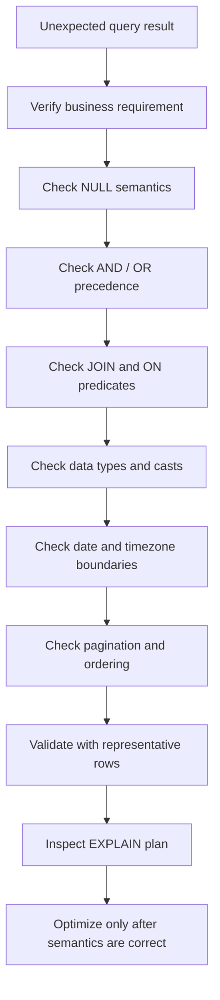

# 16- Common Filtering Mistakes

## Overview

Filtering is one of the most common parts of production SQL, but incorrect filtering can cause two classes of problems:

- **Correctness failures** — returning records that should be excluded or excluding records that should be returned.
- **Performance failures** — forcing unnecessary scans, joins, sorts, aggregations, or large result sets.

Most filtering mistakes come from misunderstanding SQL's three-valued logic, predicate placement, operator precedence, data types, `NULL` semantics, or the distinction between row-level and group-level filtering.

A senior engineer should evaluate a filter from three perspectives:

1. **Semantics** — does it return exactly the intended rows?
2. **Execution** — can the database execute it efficiently at production scale?
3. **Security** — can a caller manipulate the filter to access data they should not see?

## Using the Wrong Clause

### WHERE vs HAVING

`WHERE` filters rows before grouping. `HAVING` filters groups after aggregation.

Incorrect:

```sql
SELECT
    customer_id,
    COUNT(*) AS order_count
FROM orders
GROUP BY customer_id
HAVING status = 'completed';
```

If `status` is a row-level property, it belongs in `WHERE`:

```sql
SELECT
    customer_id,
    COUNT(*) AS completed_orders
FROM orders
WHERE status = 'completed'
GROUP BY customer_id;
```

Use `HAVING` when the condition depends on the aggregate:

```sql
SELECT
    customer_id,
    COUNT(*) AS completed_orders
FROM orders
WHERE status = 'completed'
GROUP BY customer_id
HAVING COUNT(*) >= 10;
```

The distinction is:

| Requirement | Correct clause |
|---|---|
| `status = 'completed'` | `WHERE` |
| `created_at >= $1` | `WHERE` |
| `total_amount > 1000` | `WHERE` |
| `COUNT(*) >= 10` | `HAVING` |
| `SUM(total_amount) >= 100000` | `HAVING` |

## Misplacing Predicates in Outer Joins

One of the most important production filtering mistakes is moving predicates between `ON` and `WHERE` without considering outer-join semantics.

Suppose the requirement is:

> Return every customer and count only their completed orders.

Correct:

```sql
SELECT
    c.id,
    COUNT(o.id) AS completed_orders
FROM customers AS c
LEFT JOIN orders AS o
    ON o.customer_id = c.id
   AND o.status = 'completed'
GROUP BY c.id;
```

Putting the status condition in `WHERE` changes the result:

```sql
SELECT
    c.id,
    COUNT(o.id) AS completed_orders
FROM customers AS c
LEFT JOIN orders AS o
    ON o.customer_id = c.id
WHERE o.status = 'completed'
GROUP BY c.id;
```

Customers without a completed order receive `NULL` for `o.status`, and the `WHERE` predicate removes them.

### Rule

For outer joins, ask:

> Should unmatched rows from the preserved side remain?

If yes, predicates concerning the optional joined table often belong in `ON`.

## Incorrect NULL Comparisons

`NULL` does not behave like an ordinary value.

This is incorrect:

```sql
WHERE deleted_at = NULL
```

and this is also incorrect:

```sql
WHERE deleted_at != NULL
```

Use `IS NULL` and `IS NOT NULL`:

```sql
WHERE deleted_at IS NULL
```

```sql
WHERE deleted_at IS NOT NULL
```

### Why This Happens

SQL uses three-valued logic:

- `TRUE`
- `FALSE`
- `UNKNOWN`

Comparisons involving `NULL` generally produce `UNKNOWN`.

For example:

```sql
NULL = NULL
```

does not evaluate to `TRUE`.

Therefore:

```sql
WHERE deleted_at = NULL
```

does not select rows where `deleted_at` is null.

## Mishandling NOT IN and NULL

`NOT IN` can produce surprising results when the compared expression or subquery contains `NULL`.

Consider:

```sql
SELECT
    id
FROM customers
WHERE id NOT IN (
    SELECT customer_id
    FROM blocked_customers
);
```

If `blocked_customers.customer_id` contains `NULL`, the comparison can become `UNKNOWN` for candidate rows, potentially producing no results.

When expressing an anti-existence condition, `NOT EXISTS` is often safer:

```sql
SELECT
    c.id
FROM customers AS c
WHERE NOT EXISTS (
    SELECT 1
    FROM blocked_customers AS b
    WHERE b.customer_id = c.id
);
```

### Production Rule

When using `NOT IN` with a subquery, explicitly understand whether the subquery can contain `NULL`.

For anti-joins, prefer `NOT EXISTS` when it more directly expresses the business requirement.

## Incorrect AND / OR Logic

SQL operator precedence can make a filter mean something different from what the code visually suggests.

Consider:

```sql
WHERE status = 'active'
  AND role = 'admin'
  OR role = 'support';
```

SQL evaluates `AND` before `OR`, so this is equivalent to:

```sql
WHERE (
    status = 'active'
    AND role = 'admin'
)
OR role = 'support';
```

Therefore, every support user matches regardless of status.

If the requirement is:

> Active admins or active support users.

write:

```sql
WHERE status = 'active'
  AND (
      role = 'admin'
      OR role = 'support'
  );
```

### Best Practice

When mixing `AND` and `OR`, use parentheses even when precedence technically produces the intended result.

The goal is not merely correctness today; it is preventing future modifications from changing the meaning accidentally.

## Filtering with the Wrong Data Type

Avoid relying on implicit type conversion.

For example, if:

```text
customer_id BIGINT
```

do not deliberately construct queries that compare it to arbitrary string representations:

```sql
WHERE customer_id = 'abc';
```

The exact behavior depends on the database, but implicit casts can:

- Cause runtime errors.
- Prevent efficient index usage.
- Hide application bugs.
- Produce database-specific behavior.

Use correctly typed parameters from the application layer:

```sql
SELECT
    id,
    email
FROM customers
WHERE id = $1;
```

The application should bind `$1` using the appropriate database-driver type.

## Applying Functions to Filtered Columns

A common performance mistake is wrapping an indexed column in a function.

For example:

```sql
WHERE DATE(created_at) = $1
```

If `created_at` has an ordinary B-tree index, this expression may prevent the optimizer from using that index efficiently.

Prefer a range:

```sql
WHERE created_at >= $1
  AND created_at < $2;
```

For a single day, the application can calculate the start and exclusive end timestamps.

### Why Range Filtering Is Better

The database can reason directly about the indexed ordering:

```text
created_at
     |
     +---- >= start
     |
     +---- < end
```

This is generally more index-friendly than applying a function to every candidate row.

The exact plan still depends on the database, statistics, indexes, and workload.

## Using Leading Wildcards Carelessly

Consider:

```sql
WHERE email LIKE '%@example.com'
```

A normal B-tree index generally cannot efficiently seek to an arbitrary suffix pattern.

By contrast:

```sql
WHERE email LIKE 'admin%'
```

can often use a suitable B-tree index, depending on database and collation behavior.

### Production Consideration

For user-facing search, avoid assuming `LIKE` scales indefinitely.

Depending on requirements and database capabilities, consider:

- Full-text search.
- PostgreSQL `pg_trgm`.
- Dedicated search infrastructure.
- Prefix-specific indexes.
- Normalized search columns.

Always measure with production-scale data.

## Using NOT Without Understanding NULL

Consider:

```sql
WHERE status <> 'cancelled'
```

This does **not** include rows where `status IS NULL`.

Because:

```sql
NULL <> 'cancelled'
```

evaluates to `UNKNOWN`.

If the business requirement is:

> Return orders that are either non-cancelled or have no status.

you need to express that explicitly:

```sql
WHERE status <> 'cancelled'
   OR status IS NULL;
```

Alternatively, depending on business semantics:

```sql
WHERE status IS DISTINCT FROM 'cancelled';
```

PostgreSQL supports `IS DISTINCT FROM`, which provides NULL-safe comparison semantics.

## Assuming NOT IN Means "Everything Else"

This filter:

```sql
WHERE status NOT IN ('cancelled', 'refunded')
```

does not mean:

> Every row except cancelled and refunded.

Rows where `status` is `NULL` are not returned.

If null status should also qualify:

```sql
WHERE status NOT IN ('cancelled', 'refunded')
   OR status IS NULL;
```

The correct query depends on whether `NULL` represents a meaningful business state.

## Filtering Dates Incorrectly

### Inclusive End Dates

A fragile pattern is:

```sql
WHERE created_at BETWEEN '2026-08-01' AND '2026-08-31'
```

For a timestamp column, this usually does not represent the entire final day because:

```text
2026-08-31 00:00:00
```

is the end value implied by the date literal, not every timestamp occurring on August 31.

Prefer half-open intervals:

```sql
WHERE created_at >= '2026-08-01'
  AND created_at < '2026-09-01';
```

This is robust across timestamp precision.

### Time Zone Mistakes

For APIs, reporting systems, and distributed services, be explicit about the time zone defining a business period.

A request such as:

```text
2026-08-01 00:00 through 2026-08-31 23:59
```

may mean different UTC ranges depending on the user's or business's time zone.

Prefer calculating the correct instant boundaries in application or database logic rather than inventing an inclusive `23:59:59.999999` boundary.

## Using BETWEEN Without Understanding Its Boundaries

`BETWEEN` is inclusive at both ends.

```sql
WHERE total_amount BETWEEN 100 AND 500
```

means:

```sql
total_amount >= 100
AND total_amount <= 500
```

For numeric values, this may be exactly what you want.

For timestamps, inclusive upper boundaries frequently cause overlapping windows.

Prefer:

```sql
WHERE created_at >= $1
  AND created_at < $2;
```

for time intervals.

## Building Dynamic SQL with String Interpolation

Never construct SQL filters by directly concatenating untrusted input.

Unsafe:

```python
query = f"""
    SELECT id, email
    FROM users
    WHERE email = '{email}'
"""
```

A malicious value can alter the SQL statement.

Use parameterized queries:

```python
query = """
    SELECT id, email
    FROM users
    WHERE email = %s
"""

cursor.execute(query, (email,))
```

For PostgreSQL drivers using `$1` placeholders:

```sql
SELECT
    id,
    email
FROM users
WHERE email = $1;
```

### Important Distinction

Parameterization protects **values**.

It does not generally allow arbitrary SQL identifiers to be passed as parameters.

For dynamic sorting, for example, do not directly interpolate a client-provided column name. Validate it against a server-side allowlist:

```python
ALLOWED_SORT_COLUMNS = {
    "created_at": "created_at",
    "email": "email",
}

sort_column = ALLOWED_SORT_COLUMNS.get(requested_sort)
if sort_column is None:
    raise ValueError("Unsupported sort column")
```

## Treating Client Filters as Authorization

A filter such as:

```http
GET /orders?customer_id=123
```

is a query parameter, not an authorization mechanism.

This is dangerous in a multi-tenant system:

```sql
SELECT
    id,
    total_amount
FROM orders
WHERE customer_id = $1;
```

If `$1` comes directly from the client, a user may request another customer's records.

Authorization boundaries should come from trusted application context:

```sql
SELECT
    id,
    total_amount
FROM orders
WHERE tenant_id = $1
  AND customer_id = $2;
```

The tenant identity should be derived from authenticated context, not blindly trusted request parameters.

For stronger isolation, PostgreSQL row-level security may also be appropriate depending on the architecture.

## Overusing OR Conditions

This pattern is common in dynamic APIs:

```sql
WHERE ($1 IS NULL OR status = $1)
```

It is convenient, but the resulting plan may be less efficient than a query specifically constructed for the requested filter.

For high-volume workloads, compare:

```sql
SELECT
    id,
    status
FROM orders
WHERE status = $1;
```

against an unfiltered query:

```sql
SELECT
    id,
    status
FROM orders;
```

rather than assuming one generic query shape is optimal for every case.

Prepared statements and parameter-sensitive workloads can make plan selection more complex.

### Production Guidance

For important high-volume endpoints:

1. Measure representative workloads.
2. Inspect `EXPLAIN (ANALYZE, BUFFERS)`.
3. Compare filtered and unfiltered query plans.
4. Consider separate query shapes when their performance characteristics differ materially.

## Filtering After Fetching Too Much Data

Avoid retrieving a large dataset into Python and filtering it there:

```python
orders = repository.get_all_orders()

completed_orders = [
    order for order in orders
    if order.status == "completed"
]
```

Prefer pushing filtering into the database:

```sql
SELECT
    id,
    customer_id,
    status,
    total_amount
FROM orders
WHERE status = $1;
```

The database can:

- Use indexes.
- Avoid transferring irrelevant rows.
- Reduce network traffic.
- Reduce application memory consumption.
- Perform filtering close to the data.

Application-side filtering is appropriate when the predicate genuinely depends on application-only state that cannot be represented in SQL, but it should not be the default.

## Filtering After Pagination

Filtering must normally occur before pagination.

Incorrect application behavior:

```text
Fetch page 1
    ↓
Filter rows
    ↓
Return fewer than page size
```

This can cause:

- Missing records.
- Inconsistent page sizes.
- Incorrect page counts.
- Unstable pagination.

The database query should generally apply the filter before `LIMIT`:

```sql
SELECT
    id,
    created_at
FROM orders
WHERE status = $1
ORDER BY created_at DESC, id DESC
LIMIT $2;
```

For large datasets, prefer keyset pagination over deep `OFFSET` pagination where appropriate:

```sql
SELECT
    id,
    created_at
FROM orders
WHERE status = $1
  AND (created_at, id) < ($2, $3)
ORDER BY created_at DESC, id DESC
LIMIT $4;
```

## Forgetting Deterministic Ordering

Filtering and pagination are closely related.

This query:

```sql
SELECT
    id,
    created_at
FROM orders
WHERE status = 'completed'
LIMIT 50;
```

does not define which 50 rows should be returned.

Add deterministic ordering:

```sql
SELECT
    id,
    created_at
FROM orders
WHERE status = 'completed'
ORDER BY created_at DESC, id DESC
LIMIT 50;
```

Using a unique tie-breaker such as `id` helps make pagination stable when multiple rows have the same timestamp.

## Filtering on the Wrong Representation

Backend systems frequently store normalized values but expose human-friendly representations.

For example, an application might store:

```text
status = 'completed'
```

while the API exposes:

```text
COMPLETED
```

Do not create database filters that depend on presentation formatting:

```sql
WHERE UPPER(status) = 'COMPLETED'
```

unless that behavior is intentionally designed and indexed appropriately.

Prefer mapping API values to canonical database values in the application layer.

## Using DISTINCT to Hide Filtering or Join Problems

Suppose a query unexpectedly produces duplicate customers:

```sql
SELECT
    c.id,
    c.email
FROM customers AS c
JOIN orders AS o
    ON o.customer_id = c.id;
```

A common reaction is:

```sql
SELECT DISTINCT
    c.id,
    c.email
FROM customers AS c
JOIN orders AS o
    ON o.customer_id = c.id;
```

This may produce the desired visible result, but it can hide a misunderstanding of join cardinality.

If the requirement is:

> Return customers who have at least one order.

`EXISTS` expresses the requirement directly:

```sql
SELECT
    c.id,
    c.email
FROM customers AS c
WHERE EXISTS (
    SELECT 1
    FROM orders AS o
    WHERE o.customer_id = c.id
);
```

Use `DISTINCT` deliberately for deduplication, not as a repair mechanism for incorrect joins.

## Forgetting Empty Collections

Dynamic filters can produce invalid SQL if an application blindly generates an empty `IN` list.

Conceptually:

```sql
WHERE id IN ()
```

is invalid in many SQL dialects.

Instead, define application behavior explicitly:

- Treat an empty filter as "match nothing".
- Ignore the filter and treat it as "no restriction".
- Reject the request as invalid.

For example, if an empty list means "match nothing", the application can short-circuit before querying or generate a guaranteed-false predicate appropriate to its database abstraction.

Do not silently reinterpret an empty client filter as unrestricted access.

## Using COALESCE to Hide Data Semantics

This pattern is sometimes convenient:

```sql
WHERE COALESCE(status, 'unknown') = 'active'
```

but it can obscure the difference between:

- A genuinely stored `NULL`.
- A real value.
- A derived fallback value.

If the actual requirement is simply:

```sql
status = 'active'
```

use the direct predicate.

If `NULL` has explicit business semantics, express them clearly:

```sql
WHERE status = 'active'
   OR status IS NULL;
```

Use `COALESCE` when the fallback behavior itself is part of the requirement.

## Ignoring Case and Collation Semantics

String comparison behavior depends on the database, data type, collation, and operators being used.

Do not assume:

```sql
WHERE email = $1
```

is automatically case-insensitive.

For identity-like fields such as email addresses, define a canonicalization strategy rather than repeatedly applying:

```sql
WHERE LOWER(email) = LOWER($1)
```

at query time.

In PostgreSQL, options include:

- Canonicalizing values in application logic.
- Functional indexes where appropriate.
- `citext` for case-insensitive text semantics.
- Explicit database constraints.

The correct choice depends on the application's domain semantics.

## Ignoring Index Selectivity

Not every filtered column benefits equally from an index.

A column such as:

```text
status = 'active'
```

may have very low cardinality, while:

```text
customer_id = 837291
```

may be highly selective.

However, low-cardinality predicates can still benefit from indexes depending on:

- Table size.
- Data distribution.
- Combined predicates.
- Partial indexes.
- Query frequency.
- Visibility and table layout.
- Database optimizer estimates.

Do not decide based solely on whether a column appears in `WHERE`.

Use execution plans and production-like data.

## Filtering Without Considering Soft Deletes

If the application uses:

```text
deleted_at
```

for soft deletion, every relevant query may need to account for deleted rows:

```sql
SELECT
    id,
    email
FROM users
WHERE tenant_id = $1
  AND deleted_at IS NULL;
```

Missing this predicate can expose logically deleted records.

Centralizing the behavior through carefully designed repository methods, ORM managers, or database-level policies can reduce accidental omissions, but engineers must understand when intentionally including deleted records is required.

## Common Filtering Mistakes

| Mistake | Impact | Correct approach |
|---|---|---|
| `column = NULL` | Never correctly tests nullness | Use `IS NULL` |
| `column != NULL` | Produces `UNKNOWN` | Use `IS NOT NULL` |
| Row filter in `HAVING` | Unnecessary or invalid grouping behavior | Use `WHERE` |
| Aggregate filter in `WHERE` | Aggregate unavailable at that stage | Use `HAVING` |
| Predicate moved from `ON` to `WHERE` | Can change outer-join semantics | Understand preserved rows |
| `NOT IN` with nullable subquery | Unexpected empty results | Prefer `NOT EXISTS` where appropriate |
| Mixed `AND`/`OR` without parentheses | Incorrect business logic | Parenthesize explicitly |
| `DATE(timestamp_column)` | May prevent efficient index access | Use timestamp ranges |
| `BETWEEN` for timestamp windows | Inclusive upper bound causes boundary issues | Use `[start, end)` |
| `%term%` on large tables | Expensive searches | Use appropriate search/index strategy |
| String-interpolated filters | SQL injection risk | Parameterize values |
| Client filter used as authorization | Data exposure | Enforce server-side access boundaries |
| Filtering in Python after fetching | Network and memory waste | Push predicates to SQL |
| Filtering after pagination | Incorrect pages | Filter before `LIMIT`/pagination |
| `DISTINCT` hiding duplicates | Masks join bugs | Fix cardinality or use `EXISTS` |
| Generic `OR` filters everywhere | Potentially poor plans | Measure query shapes |
| Assuming indexes make every filter fast | Index may be ignored | Inspect execution plans |
| Ignoring `NULL` in `NOT IN` / `<>` | Missing rows | Define NULL semantics explicitly |

## Production Debugging Workflow

When a filtered query returns unexpected results, debug semantics before performance.



A practical workflow is:

1. Reduce the query to the smallest failing example.
2. Inspect the actual values, including `NULL`.
3. Remove joins temporarily to isolate the base predicate.
4. Add predicates back one at a time.
5. Verify `AND` / `OR` grouping with parentheses.
6. Check outer-join behavior.
7. Verify date and time-zone boundaries.
8. Compare expected and actual row counts.
9. Inspect the execution plan only after correctness is established.
10. Add or modify indexes based on measured workload rather than intuition.

## Production Filtering Checklist

Before shipping a filtered query, verify:

### Correctness

- Does the predicate represent the business rule exactly?
- Are `NULL` values handled intentionally?
- Are `AND` and `OR` expressions parenthesized?
- Are date boundaries correct?
- Are time zones explicit where required?
- Does predicate placement preserve outer-join semantics?
- Does `NOT IN` interact with nullable values?

### Performance

- Are unnecessary rows filtered before expensive operations?
- Are functions being applied to indexed columns?
- Are large wildcard searches intentional?
- Is the filter selective enough to benefit from the existing indexes?
- Does the query plan remain acceptable at production cardinality?
- Is pagination performed after filtering and deterministic ordering?

### Security

- Are filter values parameterized?
- Are dynamic identifiers allowlisted?
- Is tenant isolation enforced independently of client filters?
- Are soft-deleted or restricted records excluded where required?
- Could a caller manipulate filters to access another user's data?

### Operational Reliability

- Are important query latencies monitored?
- Are slow-query logs or database performance metrics available?
- Are representative execution plans captured during optimization?
- Are indexes reviewed for both read benefit and write/storage cost?
- Are query changes tested against realistic data volumes?

## Key Takeaways

- Most filtering bugs are **semantic bugs**, especially around `NULL`, operator precedence, `NOT IN`, date boundaries, and outer-join predicate placement.
- Push filtering into SQL and as early as semantics allow, but never move predicates blindly when doing so can change query meaning.
- Treat parameterization, tenant isolation, soft-delete rules, and dynamic-filter validation as production security requirements, not optional optimizations.
- Performance depends on data distribution, indexes, query shape, and optimizer behavior; validate important filters with realistic data and `EXPLAIN`.
- Use explicit, deterministic filters and ordering so that pagination, reporting, APIs, and background workloads remain correct as data volume grows.