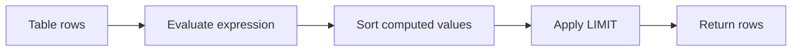

# 04- Sorting Expressions

## Overview

`ORDER BY` does not have to sort directly by stored columns. It can sort by expressions derived from one or more columns, function results, conditional logic, arithmetic, or values produced by other SQL constructs.

This is useful when the required business ordering does not correspond directly to the physical representation of the data.

```sql
SELECT
    id,
    first_name,
    last_name
FROM users
ORDER BY
    LOWER(last_name),
    LOWER(first_name),
    id;
```

The database evaluates the expressions for ordering and then produces the result set according to those computed values.

Common production use cases include:

- Case-insensitive sorting.
- Calculated prices or scores.
- Business-defined priority.
- NULL placement.
- Conditional ordering.
- Sorting by derived timestamps.
- Ranking records according to multiple business rules.

The key engineering concern is that expression-based sorting can increase query cost and may prevent the optimizer from using an ordinary index directly.

## Basic Syntax

The general form is:

```sql
SELECT ...
FROM ...
ORDER BY expression [ASC | DESC];
```

Multiple expressions can be combined:

```sql
SELECT
    id,
    price,
    discount_percent
FROM products
ORDER BY
    price * (1 - discount_percent / 100.0) ASC,
    id ASC;
```

The first expression determines the primary ordering. Later expressions resolve ties.

## Sorting by Arithmetic Expressions

Arithmetic expressions are useful when the value users care about is derived from stored data.

For example, suppose a product stores its original price and discount percentage:

```sql
SELECT
    id,
    name,
    price,
    discount_percent,
    price * (1 - discount_percent / 100.0) AS final_price
FROM products
ORDER BY
    final_price ASC,
    id ASC;
```

Depending on the SQL dialect and query structure, an alias can be used in `ORDER BY`. PostgreSQL supports this form.

A portable alternative is to repeat the expression:

```sql
SELECT
    id,
    name,
    price,
    discount_percent
FROM products
ORDER BY
    price * (1 - discount_percent / 100.0) ASC,
    id ASC;
```

### Why Use Expressions?

The application may need to sort by a value that is not stored explicitly.

Examples:

```sql
ORDER BY quantity * unit_price DESC;
```

```sql
ORDER BY EXTRACT(EPOCH FROM (NOW() - created_at)) DESC;
```

```sql
ORDER BY rating * review_count DESC;
```

The expression should represent a meaningful business requirement rather than simply moving application logic into SQL without considering performance.

## Sorting by Functions

SQL functions can transform values before sorting.

### Case-Insensitive Ordering

A common example is alphabetical ordering without case sensitivity:

```sql
SELECT
    id,
    username
FROM users
ORDER BY
    LOWER(username) ASC,
    id ASC;
```

Without normalization, ordering behavior can depend on the database's collation and data characteristics.

For PostgreSQL, another option for case-insensitive text behavior may be schema-level design such as `citext` or an appropriate collation, depending on the application's requirements.

### String Length

You can sort by the length of a value:

```sql
SELECT
    id,
    username
FROM users
ORDER BY
    LENGTH(username) DESC,
    username ASC,
    id ASC;
```

This orders users by username length, then alphabetically, then by ID.

### Date and Time Functions

Expressions can also extract components from timestamps:

```sql
SELECT
    id,
    created_at
FROM events
ORDER BY
    EXTRACT(HOUR FROM created_at) ASC,
    created_at ASC,
    id ASC;
```

This can be useful for reports or specialized scheduling views.

However, if a query is performance-sensitive and filters or sorts by derived temporal values frequently, consider whether the expression should be represented differently in the schema or supported by an appropriate expression/generated-column index.

## Conditional Sorting with CASE

`CASE` is one of the most useful tools for business-defined ordering.

Suppose an order workflow has:

- `urgent`
- `high`
- `normal`
- `low`

The desired order is not alphabetical.

```sql
SELECT
    id,
    status,
    priority
FROM orders
ORDER BY
    CASE priority
        WHEN 'urgent' THEN 1
        WHEN 'high' THEN 2
        WHEN 'normal' THEN 3
        WHEN 'low' THEN 4
        ELSE 5
    END ASC,
    created_at ASC,
    id ASC;
```

The `CASE` expression converts business priority into a sortable value.

```text
urgent  → 1
high    → 2
normal  → 3
low     → 4
unknown → 5
```

This pattern is preferable to relying on lexical ordering:

```sql
ORDER BY priority;
```

because lexical ordering does not necessarily match business priority.

## Conditional Sorting Based on Multiple Conditions

`CASE` can encode more complex business rules.

For example:

> Show active customers first, then customers with recent activity, then everyone else.

```sql
SELECT
    id,
    status,
    last_login_at
FROM users
ORDER BY
    CASE
        WHEN status = 'active' THEN 1
        WHEN last_login_at >= CURRENT_TIMESTAMP - INTERVAL '30 days' THEN 2
        ELSE 3
    END,
    last_login_at DESC,
    id ASC;
```

The expression establishes the business priority, while the remaining expressions make the result deterministic.

### Advantages

- Expresses business ordering directly in SQL.
- Avoids application-side sorting.
- Can combine several conditions.
- Keeps the ordering close to the query that consumes it.

### Limitations

Complex `CASE` expressions can become difficult to maintain and may make index-based ordering difficult.

If the same business ordering is used throughout the system, consider whether the ordering rule belongs in:

- A normalized lookup table.
- A numeric priority column.
- A generated/computed column.
- An expression index.
- Application-level configuration.

The correct choice depends on how frequently the rule changes and how performance-sensitive the query is.

## NULL-Aware Sorting

Expressions can explicitly control how NULL values participate in ordering.

In PostgreSQL:

```sql
SELECT
    id,
    name,
    last_login_at
FROM users
ORDER BY
    last_login_at DESC NULLS LAST,
    id DESC;
```

This means recently active users appear first, while users who have never logged in appear at the end.

An equivalent expression-based approach can be used when explicit NULL handling is needed:

```sql
ORDER BY
    CASE WHEN last_login_at IS NULL THEN 1 ELSE 0 END,
    last_login_at DESC,
    id DESC;
```

The explicit expression is more verbose but can make the intended ordering logic clear.

Database defaults for NULL ordering differ, so production queries should explicitly specify the required behavior when it matters.

## Boolean and Conditional Ordering

Boolean expressions can sometimes be used directly for ordering.

For example, PostgreSQL can order a boolean expression:

```sql
SELECT
    id,
    email,
    verified_at
FROM users
ORDER BY
    (verified_at IS NULL) ASC,
    verified_at DESC,
    id ASC;
```

This places verified users before users without verification.

A more explicit form is:

```sql
ORDER BY
    CASE
        WHEN verified_at IS NULL THEN 1
        ELSE 0
    END ASC,
    verified_at DESC,
    id ASC;
```

The explicit version can be easier to port across database engines.

## Sorting by Calculated Business Scores

A common backend use case is ranking records using a calculated score.

For example:

```sql
SELECT
    id,
    title,
    rating,
    review_count
FROM products
ORDER BY
    rating * LN(review_count + 1) DESC,
    id DESC;
```

The expression combines quality and review volume.

This is useful for:

- Search results.
- Recommendation systems.
- Ranking.
- Moderation queues.
- Prioritized dashboards.

However, calculated ranking should be treated as a real performance and product-design decision. A complex expression evaluated across millions of rows can be expensive.

If the score is expensive to calculate and changes infrequently, precomputing it may be more appropriate.

## Expression Aliases

An expression can often be assigned an alias and referenced by `ORDER BY`.

```sql
SELECT
    id,
    price,
    discount_percent,
    price * (1 - discount_percent / 100.0) AS final_price
FROM products
ORDER BY
    final_price ASC,
    id ASC;
```

This improves readability because the expression does not need to be repeated.

Aliases are especially useful for:

- Calculated fields.
- Aggregates.
- Complex expressions.
- Reporting queries.

However, aliases defined in the `SELECT` list are not universally available in every SQL clause. `ORDER BY` generally has special support for referring to output columns, but query portability should still be considered when targeting multiple database engines.

## Positional Ordering

Some SQL dialects allow ordering by the position of a selected column:

```sql
SELECT
    id,
    created_at,
    total_amount
FROM orders
ORDER BY
    2 DESC,
    3 DESC;
```

Here:

- `2` refers to `created_at`.
- `3` refers to `total_amount`.

Although valid in PostgreSQL and other systems, positional ordering is generally less maintainable.

Prefer:

```sql
ORDER BY
    created_at DESC,
    total_amount DESC;
```

The named version remains correct if the `SELECT` list changes.

## Expression Sorting and Indexes

A normal B-tree index is most useful when its indexed values correspond to the values the database needs to search or order.

Consider:

```sql
SELECT
    id,
    username
FROM users
ORDER BY
    LOWER(username)
LIMIT 50;
```

An ordinary index on:

```sql
CREATE INDEX idx_users_username
ON users (username);
```

does not necessarily provide the ordering required by `LOWER(username)`.

In PostgreSQL, an expression index can support this pattern:

```sql
CREATE INDEX idx_users_lower_username
ON users (LOWER(username));
```

Then the query can potentially use the expression index:

```sql
SELECT
    id,
    username
FROM users
ORDER BY
    LOWER(username)
LIMIT 50;
```

The actual plan depends on statistics, table size, selectivity, cost estimates, and other query characteristics.

Validate with:

```sql
EXPLAIN (ANALYZE, BUFFERS)
SELECT
    id,
    username
FROM users
ORDER BY
    LOWER(username)
LIMIT 50;
```

## Sorting Expressions and Query Performance

Expression sorting can require the database to compute the expression for many rows before it can establish the final order.

Conceptually:



For a large table, this can be significantly more expensive than reading rows in index order.

A common performance difference is:

```sql
ORDER BY created_at DESC
LIMIT 50;
```

versus:

```sql
ORDER BY complex_function(created_at) DESC
LIMIT 50;
```

If an appropriate index supports the first query, the database may be able to retrieve the first 50 rows directly without sorting the entire candidate set.

For the second query, an expression index or another schema-level optimization may be necessary.

## Expression Sorting with Filtering

Filtering should normally reduce the candidate set before expensive sorting work.

For example:

```sql
SELECT
    id,
    priority,
    created_at
FROM jobs
WHERE tenant_id = $1
  AND status = 'pending'
ORDER BY
    CASE priority
        WHEN 'urgent' THEN 1
        WHEN 'high' THEN 2
        WHEN 'normal' THEN 3
        ELSE 4
    END,
    created_at ASC,
    id ASC
LIMIT 50;
```

An index aligned with the filtering portion can reduce the number of rows that need to be evaluated and sorted.

Potentially useful indexes depend on the workload. For example:

```sql
CREATE INDEX idx_jobs_tenant_status
ON jobs (tenant_id, status);
```

may reduce the candidate set, while an expression index may be appropriate if the same computed ordering is used frequently and the database can benefit from it.

Do not assume that adding every expression to an index automatically improves the query.

## Expression Sorting and Pagination

Expression-based ordering becomes more complicated when combined with cursor pagination.

Suppose:

```sql
ORDER BY
    LOWER(username) ASC,
    id ASC;
```

A cursor must represent the same ordering dimensions:

```text
(lower(username), id)
```

Conceptually, the next page needs rows after the previous cursor:

```sql
WHERE
       LOWER(username) > $1
    OR (
        LOWER(username) = $1
        AND id > $2
    )
ORDER BY
    LOWER(username) ASC,
    id ASC
LIMIT 50;
```

The cursor should contain the computed ordering value or an equivalent stable representation.

This is one reason senior engineers often prefer sorting on stable, indexed schema fields for high-throughput APIs. Expression-based ordering is possible, but cursor design and index support become more involved.

## Production API Example

Suppose a FastAPI endpoint allows clients to sort products by effective price.

The application should expose a controlled sort option:

```text
GET /products?sort=price
GET /products?sort=-price
```

Rather than accepting arbitrary SQL expressions such as:

```text
GET /products?sort=price * discount_percent
```

define the ordering server-side.

```python
ORDERING_MAP = {
    "price": (
        "price * (1 - discount_percent / 100.0)",
        "id",
    ),
}
```

In practice, parameterized SQL should be generated through a trusted query builder or ORM expression system rather than interpolating client-provided SQL fragments.

With Django:

```python
from django.db.models import F, FloatField, ExpressionWrapper, Value
from django.db.models.functions import Cast

effective_price = ExpressionWrapper(
    F("price") * (
        Value(1) - F("discount_percent") / Value(100)
    ),
    output_field=FloatField(),
)

products = (
    Product.objects
    .annotate(effective_price=effective_price)
    .order_by("effective_price", "id")
)
```

The important security principle is:

> User input should select from predefined ordering strategies, not become arbitrary SQL syntax.

## When to Use Expression-Based Sorting

| Requirement | Recommended approach |
|---|---|
| Sort by stored column | Direct `ORDER BY column` |
| Sort by calculated value | `ORDER BY expression` |
| Custom business priority | `CASE` expression |
| Case-insensitive ordering | `LOWER()` or schema/collation strategy |
| Explicit NULL placement | `NULLS FIRST/LAST` or conditional expression |
| Frequently used expensive expression | Consider expression/generated-column index |
| Expensive ranking over huge datasets | Consider precomputed score |
| High-throughput cursor pagination | Prefer stable, indexed ordering fields where practical |
| User-selectable ordering | Map allowed options to trusted expressions |
| Arbitrary client SQL expression | Never allow directly |

## Common Mistakes

### Sorting in Application Code

Avoid fetching a large dataset and calculating the sort in Python:

```python
products = list(Product.objects.filter(active=True))
products.sort(key=lambda product: product.price)
```

Prefer database-side ordering:

```python
products = (
    Product.objects
    .filter(active=True)
    .order_by("price")
)
```

The database can filter, sort, limit, and potentially use indexes before sending results across the network.

### Using Complex Expressions Without Checking the Plan

This query may look harmless:

```sql
ORDER BY
    complex_business_score DESC
LIMIT 50;
```

but the database may need to evaluate the expression across a large number of rows.

Inspect the actual execution plan:

```sql
EXPLAIN (ANALYZE, BUFFERS)
SELECT ...
```

### Assuming a Normal Index Supports an Expression

An index on:

```sql
(username)
```

does not automatically mean the database can efficiently satisfy:

```sql
ORDER BY LOWER(username);
```

Consider expression indexes or schema-level alternatives when this query is important.

### Making CASE Expressions Too Complex

A massive `CASE` expression can become difficult to reason about:

```sql
ORDER BY
    CASE
        WHEN ...
        WHEN ...
        WHEN ...
        WHEN ...
        ...
    END;
```

If the rule is central to the domain and frequently queried, storing the priority explicitly may be easier to maintain and optimize.

### Accepting Raw ORDER BY Input

Do not construct SQL like:

```python
query = f"SELECT * FROM products ORDER BY {request.query_params['sort']}"
```

This can turn a sorting parameter into a SQL injection vector.

Use an allowlist:

```python
SORT_OPTIONS = {
    "price": "price",
    "-price": "-price",
    "recent": "-created_at",
    "oldest": "created_at",
}
```

Only trusted expressions should reach the query builder.

### Omitting a Tie-Breaker

Expression ordering may still produce ties:

```sql
ORDER BY
    LOWER(username);
```

For deterministic API responses, use a unique secondary key:

```sql
ORDER BY
    LOWER(username),
    id;
```

This becomes especially important for pagination.

## Production Considerations

### Performance

Expression sorting can be CPU-intensive when the expression must be evaluated for many rows.

For large datasets:

- Filter aggressively before sorting.
- Use `LIMIT` where appropriate.
- Inspect execution plans.
- Consider expression indexes.
- Consider generated/computed columns when supported and appropriate.
- Precompute expensive values when they are reused frequently.
- Avoid unnecessarily complex expressions.

### Index Design

Index the representation that the workload actually needs.

For example:

```sql
CREATE INDEX idx_users_lower_username
ON users (LOWER(username));
```

may be appropriate for frequent case-insensitive ordering and filtering.

But indexes have costs:

- Storage.
- Insert overhead.
- Update overhead.
- Vacuum/maintenance work.
- Additional operational complexity.

Create them based on measured workload rather than individual query intuition.

### Pagination

For cursor-based pagination, the ordering expression and cursor must be consistent.

Prefer a stable ordering such as:

```sql
ORDER BY
    created_at DESC,
    id DESC;
```

when it satisfies the product requirement.

If business requirements require expression-based ordering, design and test the cursor around the complete ordering tuple.

### Security

Never allow clients to submit arbitrary SQL expressions through sorting parameters.

Use an allowlist mapping:

```text
API sort key
    ↓
Trusted application mapping
    ↓
Known SQL expression
    ↓
Database query
```

This is safer and gives the API a stable contract.

### Observability

Monitor expression-heavy queries using database tooling and application metrics.

Useful signals include:

- Query latency.
- Rows scanned.
- Rows returned.
- Sort operations.
- Temporary disk usage where applicable.
- CPU utilization.
- Buffer/cache behavior.
- Query frequency.

For PostgreSQL, tools such as `EXPLAIN (ANALYZE, BUFFERS)` and `pg_stat_statements` are useful for identifying expensive query patterns.

## Interview Traps

| Question | Correct answer |
|---|---|
| Can `ORDER BY` sort by an expression? | Yes. |
| Can `ORDER BY` use functions? | Yes, for example `LOWER(username)`. |
| Why use `CASE` in `ORDER BY`? | To implement custom business ordering. |
| Does an index on `username` automatically optimize `ORDER BY LOWER(username)`? | No. An expression index or another suitable design may be required. |
| Why can expression sorting be expensive? | The database may need to compute the expression for many candidate rows before sorting them. |
| Should all expression results be persisted? | No. Persist or index them when workload and performance justify it. |
| Is application-side sorting preferable? | Usually not for large database result sets when SQL can perform the operation efficiently. |
| Can a client provide an arbitrary `ORDER BY` expression? | No. Expose an allowlisted set of trusted ordering options. |
| Why add `id` after an expression? | To provide deterministic tie-breaking, especially for pagination. |
| What should be checked before optimizing an expression-based sort? | The actual execution plan and production workload. |

## Key Takeaways

- `ORDER BY` can sort by arithmetic, functions, `CASE`, boolean expressions, and other computed values.
- Expression-based ordering is powerful for business-specific sorting but can prevent ordinary indexes from directly satisfying the requested order.
- Use expression indexes, generated/computed values, or precomputed scores when repeated expression sorting becomes performance-critical.
- Never expose arbitrary client-provided SQL expressions; map API sort options to trusted database expressions.
- For deterministic results and reliable pagination, pair expression-based ordering with a stable unique tie-breaker such as `id`.