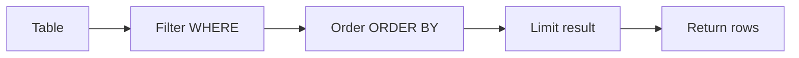
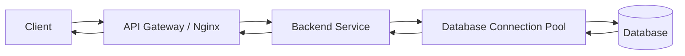

# 05- LIMIT and TOP

## Overview

`LIMIT` and `TOP` restrict the number of rows returned by a query. They are fundamental for controlling result-set size, reducing network and application memory usage, and implementing APIs, dashboards, reports, and other bounded queries.

The syntax is database-specific:

| Database | Row limiting syntax |
|---|---|
| PostgreSQL | `LIMIT` |
| MySQL | `LIMIT` |
| SQLite | `LIMIT` |
| SQL Server | `TOP` or `OFFSET ... FETCH` |
| Oracle | `FETCH FIRST ... ROWS ONLY` |
| Standard SQL | `FETCH FIRST ... ROWS ONLY` |

For production APIs, row limiting should normally be combined with an explicit `ORDER BY`. Without deterministic ordering, asking for the "first 50 rows" does not define which 50 rows the application should receive.

```sql
SELECT
    id,
    email,
    created_at
FROM users
ORDER BY created_at DESC, id DESC
LIMIT 50;
```

The important engineering distinction is:

> Limiting the result set is not the same as making the query cheap.

The database may still need to scan, filter, join, or sort a large number of rows before it can return the requested subset.

## LIMIT

`LIMIT` specifies the maximum number of rows returned.

```sql
SELECT
    id,
    email
FROM users
ORDER BY id
LIMIT 100;
```

The database returns at most 100 rows.

### Why LIMIT Exists

Without a row limit, an accidentally broad query can return millions of rows:

```sql
SELECT *
FROM orders;
```

This can cause:

- High database CPU and I/O.
- Large network transfers.
- High application memory consumption.
- Increased API latency.
- Slow serialization.
- Excessive database connection occupancy.

A bounded query is safer:

```sql
SELECT
    id,
    customer_id,
    total_amount,
    created_at
FROM orders
ORDER BY created_at DESC, id DESC
LIMIT 100;
```

`LIMIT` is therefore both a query feature and an important operational safeguard.

## LIMIT with OFFSET

`OFFSET` skips a specified number of rows before returning the limited result.

```sql
SELECT
    id,
    email,
    created_at
FROM users
ORDER BY created_at DESC, id DESC
LIMIT 50
OFFSET 100;
```

Conceptually:

```text
Sorted result set
│
├── rows 1–100    → skipped
└── rows 101–150  → returned
```

This is commonly used for page-based pagination.

For example:

```text
page = 1 → LIMIT 50 OFFSET 0
page = 2 → LIMIT 50 OFFSET 50
page = 3 → LIMIT 50 OFFSET 100
```

### The Problem with Large OFFSET Values

A large offset can become expensive.

```sql
SELECT
    id,
    created_at
FROM orders
ORDER BY created_at DESC, id DESC
LIMIT 50
OFFSET 1000000;
```

The database generally has to identify and pass over a large number of qualifying rows before producing the requested page.

The application receives only 50 rows, but the database may have processed substantially more.

This makes offset pagination increasingly expensive as the requested page moves deeper into a large dataset.

## LIMIT and ORDER BY

`LIMIT` should normally be paired with `ORDER BY` when the result has business meaning.

Avoid:

```sql
SELECT
    id,
    email
FROM users
LIMIT 20;
```

Prefer:

```sql
SELECT
    id,
    email
FROM users
ORDER BY id
LIMIT 20;
```

The first query places no explicit ordering requirement on the database.

The second defines exactly which rows should be preferred.

### Deterministic Ordering

If the ordering column is not unique, add a unique tie-breaker.

Avoid:

```sql
SELECT
    id,
    created_at
FROM orders
ORDER BY created_at DESC
LIMIT 50;
```

Prefer:

```sql
SELECT
    id,
    created_at
FROM orders
ORDER BY
    created_at DESC,
    id DESC
LIMIT 50;
```

If multiple orders have the same `created_at`, `id` provides deterministic ordering.

This is particularly important for pagination because inconsistent ordering can cause:

- Duplicate rows across pages.
- Missing rows.
- Unstable API responses.

## TOP

SQL Server commonly uses `TOP` to limit the number of rows.

```sql
SELECT TOP 50
    id,
    email,
    created_at
FROM users
ORDER BY created_at DESC, id DESC;
```

`TOP` appears directly after `SELECT`.

The equivalent PostgreSQL/MySQL-style query is:

```sql
SELECT
    id,
    email,
    created_at
FROM users
ORDER BY created_at DESC, id DESC
LIMIT 50;
```

### TOP with PERCENT

SQL Server also supports percentage-based limiting:

```sql
SELECT TOP 10 PERCENT
    id,
    email
FROM users
ORDER BY created_at DESC;
```

This returns approximately the specified percentage of the qualifying rows.

For most backend APIs, a fixed maximum row count is easier to reason about and enforce.

### TOP with Ties

SQL Server supports `WITH TIES`:

```sql
SELECT TOP 10 WITH TIES
    id,
    score
FROM products
ORDER BY score DESC;
```

This can return more than 10 rows if additional rows tie with the last row according to the `ORDER BY` expression.

This is useful when the requirement is:

> Return the top 10 positions, including all records tied at the cutoff.

It should not be used casually in API pagination because the actual result size is no longer guaranteed to be exactly the requested limit.

## LIMIT vs TOP

| Feature | `LIMIT` | `TOP` |
|---|---|---|
| Common database | PostgreSQL, MySQL, SQLite | SQL Server |
| Position | Usually after `ORDER BY` | Immediately after `SELECT` |
| Fixed row count | Yes | Yes |
| Percentage | Not standard `LIMIT` behavior | SQL Server supports `PERCENT` |
| Include ties | Not directly through `LIMIT` | SQL Server supports `WITH TIES` |
| Offset pagination | Commonly paired with `OFFSET` | SQL Server commonly uses `OFFSET ... FETCH` |
| Portability | Common but not universal | SQL Server-specific |

The underlying purpose is the same: constrain the result set.

## LIMIT with WHERE

Filtering should generally happen before limiting.

```sql
SELECT
    id,
    email,
    created_at
FROM users
WHERE status = 'active'
ORDER BY created_at DESC, id DESC
LIMIT 50;
```

Conceptually:



This is a conceptual model rather than a guarantee of the physical execution plan. The optimizer is free to transform the query execution when doing so preserves semantics.

## LIMIT with JOINs

Row limiting becomes important when joins can multiply rows.

Consider:

```sql
SELECT
    customers.id,
    customers.email,
    orders.id AS order_id
FROM customers
JOIN orders
    ON orders.customer_id = customers.id
ORDER BY customers.id
LIMIT 50;
```

The limit applies to the final result rows, not necessarily 50 unique customers.

One customer with many orders can therefore consume multiple rows from the limit.

If the requirement is:

> Return 50 customers and their orders

the query may need a different structure, such as selecting the customers first and then retrieving their related records.

This distinction is important when designing APIs around one-to-many relationships.

## LIMIT and DISTINCT

`LIMIT` operates on the result after duplicate elimination when `DISTINCT` is present.

```sql
SELECT DISTINCT
    customer_id
FROM orders
ORDER BY customer_id
LIMIT 100;
```

The database must determine the distinct result before the final limited result can be produced.

Do not assume that `LIMIT 100` means only 100 source rows need to be examined.

## LIMIT and Aggregation

`LIMIT` applies to the final query result.

```sql
SELECT
    customer_id,
    COUNT(*) AS order_count
FROM orders
GROUP BY customer_id
ORDER BY order_count DESC
LIMIT 10;
```

This returns the 10 customers with the highest order counts.

The database may need to process a large portion of `orders` to compute the grouped counts before it can determine the top 10.

This is a useful example of why:

> A small result set does not necessarily imply a cheap query.

## LIMIT and Subqueries

Limiting rows inside a subquery can change query semantics significantly.

For example:

```sql
SELECT *
FROM (
    SELECT
        id,
        customer_id,
        created_at
    FROM orders
    ORDER BY created_at DESC
    LIMIT 100
) recent_orders
ORDER BY customer_id, created_at DESC;
```

Here, only the 100 most recent orders participate in the outer query.

This is different from:

```sql
SELECT
    id,
    customer_id,
    created_at
FROM orders
ORDER BY created_at DESC
LIMIT 100;
```

When using nested queries, be explicit about which stage of the data pipeline the limit is intended to constrain.

## LIMIT in Backend APIs

A common API pattern is:

```text
GET /orders?limit=50
```

The server should not blindly trust the client's requested value.

A safer policy is:

```text
requested limit → validate → clamp to maximum → execute query
```

For example:

```python
DEFAULT_LIMIT = 50
MAX_LIMIT = 100

requested_limit = 50

limit = min(max(requested_limit, 1), MAX_LIMIT)
```

The API can then guarantee that a client cannot request an unexpectedly large result set.

With Django:

```python
limit = min(
    max(int(request.GET.get("limit", 50)), 1),
    100,
)

orders = (
    Order.objects
    .order_by("-created_at", "-id")[:limit]
)
```

The ORM generates a bounded SQL query rather than loading all records into Python.

With FastAPI, validation can be expressed at the API boundary:

```python
from fastapi import FastAPI, Query

app = FastAPI()


@app.get("/orders")
def list_orders(
    limit: int = Query(default=50, ge=1, le=100),
):
    return {"limit": limit}
```

The application can then pass the validated value into the database query.

## Preventing Unbounded Queries

A production service should establish explicit policies for list endpoints.

| Concern | Recommended approach |
|---|---|
| Default page size | Small, predictable value |
| Maximum page size | Enforced server-side |
| Ordering | Explicit and deterministic |
| Pagination | Cursor-based for large datasets where appropriate |
| Query timeout | Configure appropriate database/application limits |
| Selected columns | Avoid unnecessary `SELECT *` |
| Filtering | Apply tenant/status/time constraints where applicable |
| Monitoring | Track query latency and scanned rows |

The goal is not merely to make APIs convenient. It is to establish predictable resource consumption.

## LIMIT and Indexes

Consider:

```sql
SELECT
    id,
    created_at
FROM orders
WHERE customer_id = $1
ORDER BY created_at DESC, id DESC
LIMIT 50;
```

An index aligned with the filtering and ordering pattern can allow the database to locate the relevant rows efficiently.

For PostgreSQL, a potentially useful index is:

```sql
CREATE INDEX idx_orders_customer_created_id
ON orders (customer_id, created_at DESC, id DESC);
```

The exact index should be validated against the real workload and execution plan.

The important principle is:

> Design indexes around query patterns, not individual columns in isolation.

Use:

```sql
EXPLAIN (ANALYZE, BUFFERS)
SELECT
    id,
    created_at
FROM orders
WHERE customer_id = 42
ORDER BY created_at DESC, id DESC
LIMIT 50;
```

to validate whether the expected access path is actually being used.

## LIMIT and Top-N Queries

A common production pattern is finding the highest or lowest N records.

```sql
SELECT
    id,
    total_amount
FROM orders
ORDER BY total_amount DESC
LIMIT 100;
```

This is a **top-N query**.

Databases can use specialized execution strategies for top-N queries instead of fully sorting every row in all circumstances.

An appropriate index can make these queries significantly more efficient.

For example, if the workload frequently asks for:

```sql
ORDER BY created_at DESC
LIMIT 50
```

an index on `created_at` may allow the database to retrieve the required rows directly in the desired order.

Always verify with the execution plan rather than assuming an index will be used.

## Offset Pagination vs Cursor Pagination

Offset pagination:

```sql
SELECT
    id,
    created_at
FROM orders
ORDER BY created_at DESC, id DESC
LIMIT 50
OFFSET 5000;
```

Cursor pagination:

```sql
SELECT
    id,
    created_at
FROM orders
WHERE
    created_at < $1
    OR (
        created_at = $1
        AND id < $2
    )
ORDER BY
    created_at DESC,
    id DESC
LIMIT 50;
```

The cursor represents the last row from the previous page.

| Characteristic | Offset pagination | Cursor pagination |
|---|---|---|
| Simple to implement | Yes | Moderate |
| Jump directly to page N | Yes | No |
| Large dataset performance | Can degrade | Usually better |
| Stable under concurrent inserts/deletes | Can be inconsistent | Generally better with correct cursor design |
| Requires stable ordering | Yes | Yes |
| Suitable for large feeds | Less ideal | Usually preferred |

Cursor pagination is often preferable for high-volume APIs where clients primarily navigate forward or backward rather than jumping to arbitrary page numbers.

## The Importance of a Stable Cursor

For:

```sql
ORDER BY created_at DESC, id DESC
```

a cursor should encode both values:

```text
(created_at, id)
```

Using only `created_at` is unsafe when multiple rows share the same timestamp.

A complete cursor condition is conceptually:

```sql
WHERE
    created_at < :created_at
    OR (
        created_at = :created_at
        AND id < :id
    )
```

The unique `id` makes the ordering total and prevents ambiguous boundaries.

## LIMIT and Concurrency

Pagination occurs while the underlying data may be changing.

Suppose page 1 is:

```sql
ORDER BY created_at DESC, id DESC
LIMIT 50;
```

A new order is inserted before the client requests page 2.

With offset pagination, the new row can shift the position of existing rows, potentially causing duplicates or skipped records between pages.

Cursor pagination anchors the next query to the previous result boundary:

```text
Page 1
   ↓
last row = cursor
   ↓
Page 2 starts after cursor
```

This does not magically provide snapshot consistency, but it is generally much more resilient to ordinary inserts and deletes.

For strict point-in-time pagination requirements, transaction isolation or snapshot-based designs may be necessary.

## LIMIT Does Not Guarantee Physical Work

Consider:

```sql
SELECT
    id,
    name
FROM products
ORDER BY expensive_function(name)
LIMIT 10;
```

Only 10 rows are returned, but the database may need to evaluate the expression for many or all candidate rows.

Similarly:

```sql
SELECT
    customer_id,
    COUNT(*)
FROM orders
GROUP BY customer_id
ORDER BY COUNT(*) DESC
LIMIT 10;
```

The database cannot simply read 10 arbitrary rows. It needs enough information to establish the top 10 groups.

This distinction is critical when diagnosing slow queries:

> Measure the work performed by the execution plan, not only the number of rows returned.

## Common Mistakes

### Using LIMIT Without ORDER BY

Avoid:

```sql
SELECT *
FROM orders
LIMIT 20;
```

The query does not define which 20 orders are wanted.

Prefer:

```sql
SELECT
    id,
    total_amount,
    created_at
FROM orders
ORDER BY created_at DESC, id DESC
LIMIT 20;
```

### Using Large LIMIT Values

An API that accepts:

```text
?limit=1000000
```

can create unnecessary load.

Enforce a maximum:

```text
1 <= limit <= 100
```

The exact maximum should reflect the response size and workload of the service.

### Assuming LIMIT Makes Every Query Fast

This:

```sql
SELECT *
FROM huge_table
ORDER BY complex_expression
LIMIT 10;
```

can still be expensive.

Inspect:

```sql
EXPLAIN (ANALYZE, BUFFERS)
```

and optimize the filtering, ordering, indexes, and query shape.

### Using SELECT *

Avoid returning unnecessary columns:

```sql
SELECT *
FROM orders
ORDER BY created_at DESC
LIMIT 50;
```

Prefer:

```sql
SELECT
    id,
    customer_id,
    total_amount,
    created_at
FROM orders
ORDER BY created_at DESC, id DESC
LIMIT 50;
```

This reduces database-to-application transfer and serialization work.

### Deep OFFSET Pagination

Avoid relying on:

```sql
LIMIT 50 OFFSET 1000000;
```

for high-volume APIs.

Consider cursor pagination with an appropriate index.

### Forgetting Tie-Breakers

Avoid:

```sql
ORDER BY created_at DESC
```

for a paginated API when `created_at` is not unique.

Prefer:

```sql
ORDER BY created_at DESC, id DESC
```

### Confusing Row Limits with Entity Limits

A query involving a one-to-many join may return 50 rows but fewer than 50 parent entities.

Always determine whether the limit applies to:

- Physical result rows.
- Distinct entities.
- Parent records.
- Aggregated groups.

The SQL structure must reflect the actual requirement.

## Production Considerations

### API Resource Protection

Every externally accessible list endpoint should have a deliberate upper bound.

For example:

```text
Default: 50
Maximum: 100
```

Do not allow clients to determine arbitrary database workload.

### Query Performance

Monitor:

- Query latency.
- Rows examined/scanned.
- Rows returned.
- Sort operations.
- Temporary file usage.
- Database CPU.
- Buffer/cache behavior.
- Frequency of expensive queries.

For PostgreSQL, `EXPLAIN (ANALYZE, BUFFERS)` and `pg_stat_statements` are useful tools for investigating expensive list queries.

### Indexing

For common bounded queries, indexes should support the combination of:

```text
WHERE
  ↓
ORDER BY
  ↓
LIMIT
```

For example:

```sql
CREATE INDEX idx_events_tenant_created_id
ON events (tenant_id, created_at DESC, id DESC);
```

may support:

```sql
SELECT
    id,
    created_at,
    event_type
FROM events
WHERE tenant_id = $1
ORDER BY created_at DESC, id DESC
LIMIT 100;
```

The appropriate index depends on cardinality, workload, write rate, and other queries sharing the table.

### Cost and Scalability

Returning fewer rows reduces:

- Network bandwidth.
- Application memory.
- Serialization cost.
- API response size.

But `LIMIT` alone does not guarantee low database cost.

For large systems, combine bounded results with:

- Proper indexes.
- Selective filters.
- Stable ordering.
- Cursor pagination.
- Query timeouts.
- Connection-pool controls.
- Database observability.

### Reliability

A bounded list endpoint is more predictable under load than an endpoint capable of returning an unbounded dataset.

This matters in distributed systems because a database query can consume resources across several layers:



A large result set can increase resource consumption at every stage.

### Security

Row limits are not a replacement for authorization.

For a multi-tenant service, this is unsafe even with `LIMIT`:

```sql
SELECT
    id,
    email
FROM users
ORDER BY id
LIMIT 100;
```

The query must also enforce the tenant boundary:

```sql
SELECT
    id,
    email
FROM users
WHERE tenant_id = $1
ORDER BY id
LIMIT 100;
```

Authorization and resource limiting solve different problems:

- Authorization determines **which rows** the caller may access.
- `LIMIT` determines **how many rows** are returned.

## Interview Traps

| Question | Correct answer |
|---|---|
| Does `LIMIT 10` guarantee the database only processes 10 rows? | No. The database may need to scan, filter, join, or sort many rows first. |
| Should `LIMIT` normally be used with `ORDER BY`? | Yes, when the selected rows have semantic meaning. |
| Why add a unique tie-breaker to `ORDER BY`? | To make pagination and result ordering deterministic. |
| Is `LIMIT ... OFFSET` always efficient? | No. Large offsets can require substantial work to skip earlier rows. |
| What is a top-N query? | A query that orders results and returns only the highest or lowest N rows. |
| What is the SQL Server equivalent of `LIMIT`? | Commonly `TOP`, or `OFFSET ... FETCH` for paginated queries. |
| Does a small response guarantee a cheap query? | No. Result size and execution cost are different concerns. |
| Why cap API `limit` parameters? | To prevent clients from creating unexpectedly large database and network workloads. |
| Why is cursor pagination often better for large datasets? | It avoids increasingly large offsets and can work efficiently with a suitable ordered index. |
| Does `LIMIT 50` after a one-to-many join guarantee 50 parent entities? | No. It limits final result rows, which may contain multiple rows for the same parent. |

## Key Takeaways

- `LIMIT` and `TOP` bound result sets, but they do not automatically make the underlying query inexpensive.
- Pair row limits with deterministic `ORDER BY` clauses, including a unique tie-breaker when pagination is involved.
- Enforce server-side limits on API pagination parameters to prevent unbounded database, network, and application resource consumption.
- Prefer cursor pagination with suitable indexes for large, high-throughput datasets instead of relying on deep `OFFSET` values.
- Design and verify indexes around the complete `WHERE` + `ORDER BY` + `LIMIT` workload, using execution plans rather than assumptions.