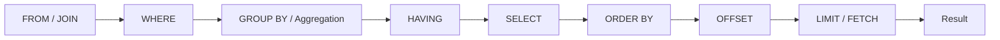

# 06- OFFSET

## Overview

`OFFSET` specifies how many rows a database should skip before returning rows from the result set. It is commonly combined with `LIMIT` or `FETCH` to implement page-based pagination.

```sql
SELECT
    id,
    email,
    created_at
FROM users
ORDER BY created_at DESC, id DESC
LIMIT 50
OFFSET 100;
```

This requests 50 rows after skipping the first 100 rows of the ordered result.

`OFFSET` is useful because it provides a simple mapping between a page number and a database query:

```text
page 1 → OFFSET 0
page 2 → OFFSET 50
page 3 → OFFSET 100
```

However, offset pagination has an important scalability limitation: **the database generally still has to locate and skip the preceding rows**. As the offset grows, query cost can increase substantially.

For small administrative interfaces and datasets, this is often acceptable. For large, high-throughput APIs and continuously changing feeds, cursor-based pagination is usually a better design.

## Basic Syntax

### PostgreSQL, MySQL, and SQLite

The common form is:

```sql
SELECT
    id,
    email
FROM users
ORDER BY id
LIMIT 50
OFFSET 100;
```

Conceptually:

```text
Result after ORDER BY

Rows 1 ─────────────── 100
         skipped
Rows 101 ───────────── 150
         returned
```

The `ORDER BY` determines which rows are considered first.

Without explicit ordering:

```sql
SELECT *
FROM users
LIMIT 50
OFFSET 100;
```

the query does not define a meaningful or stable ordering for pagination.

### SQL Server

SQL Server commonly uses `OFFSET ... FETCH`:

```sql
SELECT
    id,
    email,
    created_at
FROM users
ORDER BY created_at DESC, id DESC
OFFSET 100 ROWS
FETCH NEXT 50 ROWS ONLY;
```

Unlike PostgreSQL/MySQL-style syntax, SQL Server requires an `ORDER BY` when using `OFFSET`.

### Standard SQL

Modern SQL supports `OFFSET` together with `FETCH`:

```sql
SELECT
    id,
    email
FROM users
ORDER BY id
OFFSET 100 ROWS
FETCH NEXT 50 ROWS ONLY;
```

Exact support and syntax vary by database engine and version.

## Why OFFSET Exists

`OFFSET` primarily exists to support controlled navigation through an ordered result set.

A typical REST endpoint might expose:

```text
GET /orders?page=3&page_size=50
```

The application can translate this to:

```text
offset = (page - 1) × page_size
```

For page 3:

```text
offset = (3 - 1) × 50
       = 100
```

The SQL becomes:

```sql
SELECT
    id,
    customer_id,
    total_amount,
    created_at
FROM orders
ORDER BY created_at DESC, id DESC
LIMIT 50
OFFSET 100;
```

This is simple, predictable, and easy to implement.

## OFFSET and LIMIT

`OFFSET` and `LIMIT` solve different problems.

| Clause | Purpose |
|---|---|
| `OFFSET` | Number of rows to skip |
| `LIMIT` | Maximum number of rows to return |
| `ORDER BY` | Defines result ordering |

Together:

```sql
SELECT
    id,
    created_at
FROM orders
ORDER BY created_at DESC, id DESC
LIMIT 50
OFFSET 100;
```

means:

> Order the rows, skip the first 100, and return at most the next 50.

Using `OFFSET` without a limiting clause can be valid, but it is rarely useful for an API because it does not establish a response-size boundary.

## OFFSET and Execution Order

A simplified logical processing model is:



This is a **logical query-processing model**, not necessarily the physical execution strategy chosen by the optimizer.

The database optimizer may use indexes and other execution strategies to avoid unnecessary work while preserving the query's semantics.

The key semantic point is that `OFFSET` applies to the ordered result.

## OFFSET Pagination

The most common use is page-number pagination.

Suppose the API uses a page size of 25:

```text
Page 1 → OFFSET 0
Page 2 → OFFSET 25
Page 3 → OFFSET 50
Page 4 → OFFSET 75
```

The formula is:

```text
OFFSET = (page - 1) × page_size
```

Example:

```python
page = 4
page_size = 25

offset = (page - 1) * page_size
```

Result:

```text
offset = 75
```

The database query becomes:

```sql
SELECT
    id,
    email
FROM users
ORDER BY id
LIMIT 25
OFFSET 75;
```

## Deterministic Ordering

Pagination requires a stable ordering.

Prefer:

```sql
ORDER BY created_at DESC, id DESC
```

over:

```sql
ORDER BY created_at DESC
```

when `created_at` is not unique.

The second column acts as a tie-breaker.

For example:

```text
created_at              id
----------------------  ----
2026-08-30 10:00:00     105
2026-08-30 10:00:00     104
2026-08-30 09:59:59     103
```

The combination:

```sql
ORDER BY created_at DESC, id DESC
```

defines a total ordering for these rows.

This is especially important when pagination is implemented over a high-volume table.

## The Large OFFSET Problem

Consider:

```sql
SELECT
    id,
    created_at
FROM orders
ORDER BY created_at DESC, id DESC
LIMIT 50
OFFSET 1000000;
```

The application receives only 50 rows, but the database cannot generally treat this as "find row one million instantly."

Depending on the query, indexes, optimizer, and database engine, the database may need to traverse or process a large number of preceding entries before it can return the requested page.

Conceptually:

```text
OFFSET 0
┌──────────────────────────────┐
│ return 50                     │
└──────────────────────────────┘
         ↓

OFFSET 100,000
┌─────────────────────────────────────────────────────────────┐
│ process/skip many rows                │ return 50            │
└─────────────────────────────────────────────────────────────┘
         ↓

OFFSET 1,000,000
┌─────────────────────────────────────────────────────────────┐
│ process/skip a very large range         │ return 50          │
└─────────────────────────────────────────────────────────────┘
```

The exact execution behavior depends on the database and execution plan, but deep offsets are a well-known scalability concern.

## Why Deep Pagination Gets Expensive

Assume a table contains 10 million rows and the API requests:

```sql
LIMIT 100 OFFSET 5000000;
```

The database needs to establish where the ordered result reaches the requested offset before producing the 100 rows.

If the query cannot efficiently jump to that location, work grows with the depth of the requested page.

This can cause:

- Higher CPU consumption.
- Increased I/O.
- Longer query latency.
- More buffer/cache pressure.
- Increased database connection occupancy.
- Worse performance under concurrent traffic.

A small response body therefore does **not** mean the query performed little work.

## OFFSET with Indexes

Indexes can significantly improve offset queries, especially when they support the filtering and ordering requirements.

Consider:

```sql
SELECT
    id,
    created_at
FROM orders
WHERE customer_id = $1
ORDER BY created_at DESC, id DESC
LIMIT 50
OFFSET 5000;
```

A supporting index might be:

```sql
CREATE INDEX idx_orders_customer_created_id
ON orders (customer_id, created_at DESC, id DESC);
```

The index can help the database locate qualifying rows in the required order.

However, an index does not make arbitrary deep offsets constant-time. The database may still need to traverse many index entries to reach the offset.

Always validate the real workload with an execution plan.

For PostgreSQL:

```sql
EXPLAIN (ANALYZE, BUFFERS)
SELECT
    id,
    created_at
FROM orders
WHERE customer_id = 42
ORDER BY created_at DESC, id DESC
LIMIT 50
OFFSET 5000;
```

Look for:

- Actual execution time.
- Rows scanned.
- Index scans vs sequential scans.
- Buffer reads/hits.
- Sort operations.
- Unexpected filtering work.

## OFFSET vs Cursor Pagination

Cursor pagination avoids expressing the next page as "skip N rows."

Instead, it says:

> Continue after this specific position in the ordered result.

Offset pagination:

```sql
SELECT
    id,
    created_at
FROM orders
ORDER BY created_at DESC, id DESC
LIMIT 50
OFFSET 50000;
```

Cursor pagination:

```sql
SELECT
    id,
    created_at
FROM orders
WHERE
    created_at < $1
    OR (
        created_at = $1
        AND id < $2
    )
ORDER BY created_at DESC, id DESC
LIMIT 50;
```

If the previous page ended at:

```text
created_at = 2026-08-30 10:00:00
id = 12345
```

the next query can use that boundary directly.

With an appropriate index, the database can seek toward the cursor rather than processing a growing number of preceding rows.

## Why Cursor Pagination Scales Better

Consider a feed ordered by:

```sql
ORDER BY created_at DESC, id DESC
```

With offset pagination:

```text
Page 1 → skip 0
Page 100 → skip 9,900
Page 10,000 → skip 999,900
```

With cursor pagination:

```text
Page 1 → start at beginning
Page 2 → start after cursor 1
Page 3 → start after cursor 2
...
```

The database uses the cursor as a position in the ordered index rather than repeatedly counting from the beginning.

This makes cursor pagination particularly useful for:

- Activity feeds.
- Large order histories.
- Event streams.
- Social timelines.
- High-volume SaaS tables.
- Mobile APIs where users continuously load more records.

## OFFSET and Concurrent Data Changes

Offset pagination can become inconsistent when rows are inserted or deleted between requests.

Suppose page 1 returns:

```text
A
B
C
D
E
```

The client then requests page 2 using:

```sql
OFFSET 5
```

If a new row is inserted before `A`, the ordering shifts:

```text
NEW
A
B
C
D
E
```

The second page may now contain a row that the client already saw or skip a row it expected to see.

Similarly, deleting rows between requests can shift later records in the opposite direction.

This makes offset pagination less suitable for rapidly changing datasets.

Cursor pagination anchors the next request to an actual ordering boundary, making it generally more resilient to ordinary inserts and deletes.

It does not provide snapshot isolation by itself. If the application requires a strict point-in-time view, a transaction or snapshot-based design may be necessary.

## OFFSET and REST APIs

A simple page-based endpoint might be:

```text
GET /orders?page=3&page_size=50
```

The server can calculate:

```python
page = 3
page_size = 50

offset = (page - 1) * page_size
```

and query:

```sql
SELECT
    id,
    customer_id,
    total_amount,
    created_at
FROM orders
WHERE customer_id = $1
ORDER BY created_at DESC, id DESC
LIMIT 50
OFFSET 100;
```

The API should enforce sensible boundaries.

For example:

```text
page >= 1
1 <= page_size <= 100
```

Do not allow arbitrary values such as:

```text
?page=100000000&page_size=1000000
```

A malicious or accidental request can create unnecessary database work.

## OFFSET in Django

Django QuerySets support slicing:

```python
page = 3
page_size = 50

offset = (page - 1) * page_size

orders = (
    Order.objects
    .order_by("-created_at", "-id")
    [offset:offset + page_size]
)
```

This is translated into database-level row limiting rather than loading the entire table into Python.

For large datasets, however, the underlying SQL still has the characteristics of offset pagination.

Avoid:

```python
orders = list(Order.objects.all())
page = orders[offset:offset + page_size]
```

This loads potentially millions of rows into application memory before slicing them.

Prefer database-level pagination.

## OFFSET in FastAPI

FastAPI can validate pagination parameters at the API boundary:

```python
from fastapi import FastAPI, Query

app = FastAPI()


@app.get("/orders")
def list_orders(
    page: int = Query(default=1, ge=1),
    page_size: int = Query(default=50, ge=1, le=100),
):
    offset = (page - 1) * page_size

    return {
        "page": page,
        "page_size": page_size,
        "offset": offset,
    }
```

In a real service, the calculated values would be passed to the database layer.

The important design principle is to validate and constrain pagination inputs before they reach the database.

## Counting Total Rows

Page-based APIs often want to return:

```json
{
  "page": 3,
  "page_size": 50,
  "total": 124583,
  "results": []
}
```

This can introduce another expensive query:

```sql
SELECT COUNT(*)
FROM orders
WHERE customer_id = $1;
```

For large or complex datasets, exact counts can be expensive.

An API should not automatically perform an expensive `COUNT(*)` merely because it exposes page numbers.

Alternatives include:

- Return `has_next`.
- Fetch `page_size + 1` rows internally.
- Use cursor pagination.
- Use approximate counts where exact totals are not required.
- Cache counts when their freshness requirements allow it.

For example:

```sql
SELECT
    id,
    created_at
FROM orders
WHERE customer_id = $1
ORDER BY created_at DESC, id DESC
LIMIT 51
OFFSET 100;
```

If 51 rows are returned, the API can return the first 50 and set:

```text
has_next = true
```

This avoids an additional exact-count query.

## OFFSET with Filtering

Filtering should be applied to the intended dataset before pagination.

```sql
SELECT
    id,
    email
FROM users
WHERE status = 'active'
ORDER BY created_at DESC, id DESC
LIMIT 50
OFFSET 100;
```

The offset refers to the ordered set of **active users**, not all users.

This distinction matters when interpreting page numbers.

A query such as:

```sql
SELECT *
FROM users
ORDER BY created_at DESC
LIMIT 50
OFFSET 100;
```

is not equivalent to:

```sql
SELECT *
FROM users
LIMIT 50
OFFSET 100;
```

because the first query defines an ordering and therefore defines the meaning of "rows 101–150."

## OFFSET with JOINs

Be careful when paginating queries involving one-to-many relationships.

Consider:

```sql
SELECT
    customers.id,
    customers.email,
    orders.id AS order_id
FROM customers
JOIN orders
    ON orders.customer_id = customers.id
ORDER BY customers.id
LIMIT 50
OFFSET 100;
```

The database paginates **result rows**, not necessarily unique customers.

If one customer has many orders, multiple result rows may represent the same customer.

Therefore:

> `LIMIT 50 OFFSET 100` does not necessarily mean "the 50th through 100th customers."

If the API requires 50 parent entities, first determine how those entities should be selected and then load their related data separately or use an appropriate query structure.

## OFFSET and DISTINCT

`DISTINCT` changes the result set before pagination semantics are applied.

```sql
SELECT DISTINCT
    customer_id
FROM orders
ORDER BY customer_id
LIMIT 50
OFFSET 100;
```

The offset applies to the distinct result, not simply to arbitrary source rows in `orders`.

This can require substantial database work if the underlying dataset is large.

Do not infer execution cost from the final page size alone.

## Production Considerations

### Set a Maximum Page Size

A production API should enforce a server-side limit.

For example:

```text
Default page size: 50
Maximum page size: 100
```

This protects:

- Database resources.
- Application memory.
- Network bandwidth.
- Serialization CPU.
- API latency.

### Set Reasonable Page Limits

If the API uses page numbers, consider whether extremely deep pages should be supported.

For example, an administrative UI may reasonably support:

```text
page <= 1,000
```

while a public API might use cursor pagination instead of imposing an arbitrary page limit.

The correct policy depends on the product requirement and data volume.

### Design Indexes Around the Query

For:

```sql
SELECT
    id,
    created_at
FROM events
WHERE tenant_id = $1
ORDER BY created_at DESC, id DESC
LIMIT 50
OFFSET 1000;
```

an index such as:

```sql
CREATE INDEX idx_events_tenant_created_id
ON events (tenant_id, created_at DESC, id DESC);
```

may be appropriate.

But index design must consider:

- Filter selectivity.
- Ordering.
- Write volume.
- Table size.
- Other important queries.
- Index storage.
- Maintenance overhead.

Validate with real execution plans.

### Prefer Keyset Pagination for Large Datasets

If clients only need:

```text
next page
previous page
load more
```

cursor/keyset pagination is often a better fit than page-number pagination.

Use offset pagination when its simplicity provides enough value and the dataset/workload is bounded.

### Monitor Deep Pages

Monitor:

- Query latency by endpoint.
- Database execution time.
- Rows scanned.
- Buffer reads.
- Query frequency.
- Maximum requested offset.
- Database CPU.
- Connection-pool utilization.

A useful operational signal is the distribution of requested offsets.

If most requests are small but a small number of clients routinely request millions of skipped rows, those requests may need a different API design.

## Common Mistakes

### Using OFFSET Without ORDER BY

Avoid:

```sql
SELECT
    id,
    email
FROM users
LIMIT 50
OFFSET 100;
```

There is no explicit ordering defining which rows should be skipped.

Prefer:

```sql
SELECT
    id,
    email
FROM users
ORDER BY id
LIMIT 50
OFFSET 100;
```

### Assuming OFFSET Is Constant-Time

This is a common misconception:

```sql
LIMIT 50 OFFSET 1000000;
```

does not imply that the database can instantly jump to row 1,000,001.

The actual work depends on the execution plan, but deep offsets can become increasingly expensive.

### Loading All Rows into Application Memory

Avoid:

```python
rows = list(Order.objects.all())
page = rows[100000:100050]
```

This defeats database-level pagination.

Use a database query with appropriate limit and offset instead.

### Accepting Unlimited Page Sizes

Avoid:

```text
GET /orders?page=1&page_size=1000000
```

Validate the maximum at the API boundary.

### Using Large Offsets for Infinite Feeds

Offset pagination is usually a poor fit for feeds where new records are continuously inserted.

Prefer cursor/keyset pagination for:

- Activity feeds.
- Notifications.
- Event timelines.
- Chat histories.
- Large audit logs.

### Omitting a Tie-Breaker

Avoid:

```sql
ORDER BY created_at DESC
```

when `created_at` is not unique.

Prefer:

```sql
ORDER BY created_at DESC, id DESC
```

This creates a deterministic boundary for pagination.

### Confusing OFFSET with a Stable Snapshot

Offset pagination does not freeze the underlying dataset.

Concurrent inserts, deletes, and updates can change which rows appear on subsequent pages.

If the application requires a consistent snapshot across many pages, pagination strategy alone is insufficient.

## Performance Comparison

| Approach | Small dataset | Large dataset | Changing data | Implementation complexity |
|---|---|---|---|---|
| `LIMIT` only | Excellent | Excellent when appropriately indexed | Depends on ordering | Low |
| `LIMIT + OFFSET` | Excellent | Can degrade with deep offsets | Can produce duplicates/skips | Low |
| Cursor/keyset | Excellent | Usually scales better | Generally more resilient | Moderate |
| Snapshot-based pagination | Strong | Can be expensive | Strong consistency | High |

No pagination strategy is universally best. Choose based on:

- Dataset size.
- Access pattern.
- Consistency requirements.
- Whether arbitrary page jumps are required.
- Query/index characteristics.
- API complexity.

## Interview Traps

| Question | Correct answer |
|---|---|
| What does `OFFSET 100` do? | Skips the first 100 rows of the ordered result before returning subsequent rows. |
| Does `OFFSET` define ordering? | No. `ORDER BY` defines ordering. |
| Why is deep offset pagination expensive? | The database may need to traverse or process many preceding rows before producing the requested page. |
| Is an index enough to make deep OFFSET constant-time? | No. An index can improve access, but the database may still need to traverse many index entries. |
| Why should pagination use deterministic ordering? | To prevent unstable page boundaries and inconsistent results. |
| Why add a unique column to `ORDER BY`? | It provides a deterministic tie-breaker when the primary sort value is duplicated. |
| Why can OFFSET pagination duplicate or skip rows? | Inserts or deletes between page requests can shift row positions. |
| What is the alternative to deep OFFSET pagination? | Cursor/keyset pagination. |
| Does `LIMIT 50 OFFSET 1000` mean 50 unique entities? | No. It means 50 final result rows; joins can produce repeated parent entities. |
| Should APIs allow arbitrary page sizes? | No. Enforce a server-side maximum. |
| Does OFFSET provide snapshot consistency? | No. It only controls result positioning; concurrent data changes can alter subsequent pages. |
| When is OFFSET pagination appropriate? | Small-to-moderate datasets, administrative interfaces, reports, and APIs where arbitrary page navigation is useful and deep-page performance is acceptable. |

## Key Takeaways

- `OFFSET` skips rows in the ordered result and is commonly paired with `LIMIT` or `FETCH` for page-based pagination.
- Always use deterministic `ORDER BY` clauses for pagination, preferably including a unique tie-breaker.
- Deep offsets can become expensive because the database may need to traverse or process many preceding rows.
- Cursor/keyset pagination is generally preferable for large, high-throughput, frequently changing datasets.
- Enforce page-size limits, monitor pagination behavior, and validate the actual query plan before assuming pagination is efficient.