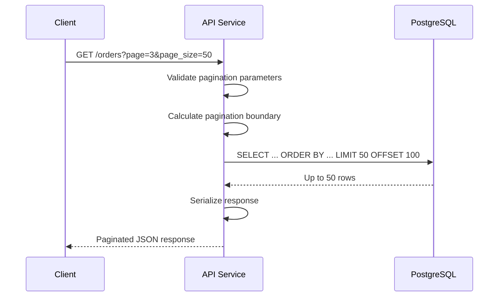
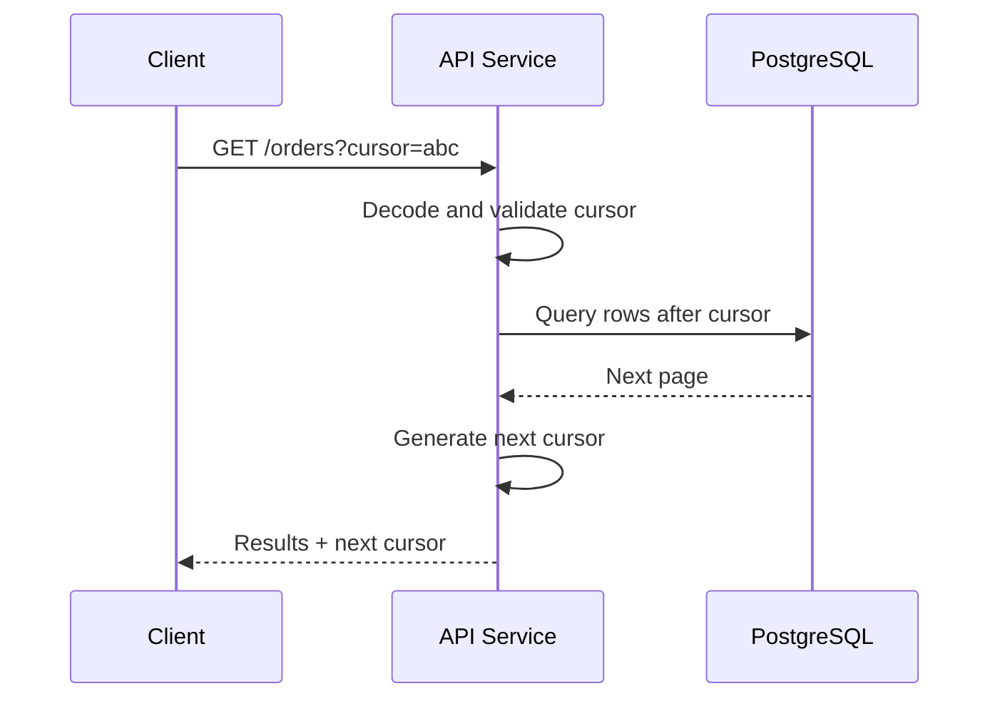

# 07- Pagination Fundamentals

## Overview

Pagination divides a potentially large result set into smaller, bounded responses. In backend systems, pagination is primarily a **database and API design problem**, not simply a UI feature.

Without pagination, an endpoint such as:

```sql
SELECT *
FROM orders
ORDER BY created_at DESC;
```

may attempt to return millions of rows. This increases database work, application memory usage, serialization cost, network traffic, and client processing time.

A production pagination design should answer:

- How are results ordered?
- How many rows can a client request?
- How does the client request the next page?
- What happens when data changes between requests?
- How does query cost behave at deep pages?
- Does the API need arbitrary page jumps?
- Does the API need an exact total count?
- Can the database efficiently support the chosen pagination strategy?

The two major approaches are:

| Strategy | Typical API model | Strength | Main limitation |
|---|---|---|---|
| Offset pagination | `page=5&page_size=50` | Simple and supports page navigation | Deep pages can become expensive and unstable |
| Cursor/keyset pagination | `cursor=...` | Efficient for large datasets and feeds | More complex; arbitrary page jumps are difficult |

For small-to-moderate datasets, offset pagination is often sufficient. For large, frequently changing, high-throughput datasets, cursor/keyset pagination is generally the stronger production design.

## Why Pagination Matters

A backend endpoint should not allow the size of the database result to be determined entirely by the amount of data stored.

Consider:

```text
10 rows
100 rows
10,000 rows
10,000,000 rows
```

An unbounded query can eventually become a production incident as the dataset grows, even if the endpoint initially performed well.

Pagination provides a resource boundary:

```text
Database
   │
   │ potentially millions of rows
   ▼
Pagination
   │
   │ bounded result
   ▼
API response
   │
   ▼
Client
```

This protects several layers simultaneously:

- **Database:** limits the result consumed by the application.
- **Application:** limits objects that must be materialized and serialized.
- **Network:** limits response size.
- **Client:** limits memory and rendering work.
- **Infrastructure:** reduces unnecessary CPU and bandwidth consumption.

Pagination does not automatically make a query efficient. A badly designed paginated query can still scan or sort a very large amount of data.

## Pagination Request Lifecycle

A typical REST request might look like:

```text
GET /orders?page=3&page_size=50
```

The request passes through several layers:



For cursor pagination, the boundary is derived from a cursor rather than an offset:



The key architectural difference is **how the database locates the next set of rows**.

## Offset Pagination

Offset pagination expresses a page as:

```text
page number + page size
```

The database query commonly becomes:

```sql
SELECT
    id,
    customer_id,
    total_amount,
    created_at
FROM orders
ORDER BY created_at DESC, id DESC
LIMIT 50
OFFSET 100;
```

The offset formula is:

```text
OFFSET = (page - 1) × page_size
```

For:

```text
page = 3
page_size = 50
```

the result is:

```text
OFFSET = (3 - 1) × 50
       = 100
```

### When Offset Pagination Fits

Offset pagination is a good choice when:

- Users need numbered pages.
- Users need to jump directly to a page.
- The dataset is relatively bounded.
- Deep pages are uncommon.
- Small query latency differences are acceptable.
- Simplicity is more valuable than maximum scalability.

Typical examples include:

- Internal admin panels.
- Back-office systems.
- Search results with moderate result sizes.
- Reporting interfaces.
- Small-to-medium SaaS datasets.

### Advantages

- Simple API contract.
- Easy to understand.
- Easy to implement in Django and SQL.
- Supports arbitrary page numbers.
- Straightforward frontend integration.
- Familiar to API consumers.

### Limitations

- Deep offsets can become expensive.
- Inserts and deletes can shift page boundaries.
- Large offsets can increase database work.
- Exact total counts can add additional database cost.
- It is poorly suited to continuously changing feeds.

## Cursor and Keyset Pagination

Cursor pagination represents the position in the ordered result rather than the number of rows to skip.

Suppose results are ordered by:

```sql
ORDER BY created_at DESC, id DESC
```

and the last row returned is:

```text
created_at = 2026-08-30 10:00:00
id = 12345
```

The next query can use that position:

```sql
SELECT
    id,
    customer_id,
    total_amount,
    created_at
FROM orders
WHERE
    created_at < $1
    OR (
        created_at = $1
        AND id < $2
    )
ORDER BY created_at DESC, id DESC
LIMIT 50;
```

The cursor therefore encodes the ordering boundary.

### Why Keyset Pagination Scales

Offset pagination asks:

> How do I skip the first N rows?

Keyset pagination asks:

> Where should I continue from this known ordered value?

With a suitable index, the database can seek toward the boundary instead of repeatedly traversing the preceding result set.

For a large table:

```text
Offset:

start → row 1 → row 2 → ... → row 5,000,000 → return 50


Keyset:

index → cursor boundary → return 50
```

The exact execution plan depends on the database and query, but keyset pagination is generally much better suited to deep traversal of large indexed datasets.

## Deterministic Ordering

Pagination requires a deterministic ordering.

Avoid relying only on a non-unique column:

```sql
ORDER BY created_at DESC
```

If many rows share the same timestamp, their relative ordering may not be deterministic.

Prefer:

```sql
ORDER BY created_at DESC, id DESC
```

where `id` is unique.

The ordering can then be viewed as a tuple:

```text
(created_at, id)
```

For descending pagination, the next page contains rows where:

```text
created_at < previous_created_at
OR
created_at = previous_created_at AND id < previous_id
```

This is the foundation of reliable keyset pagination.

## Offset vs Cursor

| Characteristic | Offset | Cursor / Keyset |
|---|---|---|
| API simplicity | High | Moderate |
| Numbered pages | Excellent | Poor |
| Jump to page N | Easy | Difficult |
| Deep pagination | Can degrade | Usually better |
| Frequently changing data | More prone to shifts | Generally more stable |
| Large feeds | Usually poor fit | Strong fit |
| Index-aware seeking | Limited by offset depth | Strong fit |
| Implementation complexity | Low | Moderate |
| Exact total pages | Straightforward conceptually | Usually not natural |
| Typical use | Admin/search UI | Feeds, histories, large datasets |

Neither strategy is universally superior.

The product requirement should drive the choice.

## Pagination Ordering and Index Design

Pagination and indexing should be designed together.

Consider:

```sql
SELECT
    id,
    created_at
FROM orders
WHERE customer_id = $1
ORDER BY created_at DESC, id DESC
LIMIT 50;
```

A potentially useful index is:

```sql
CREATE INDEX idx_orders_customer_created_id
ON orders (customer_id, created_at DESC, id DESC);
```

This aligns the index with:

1. The equality filter.
2. The ordering columns.
3. The uniqueness tie-breaker.

The exact index design depends on the complete workload.

An index should not be created simply because a column appears in `ORDER BY`. Consider:

- Query selectivity.
- Write volume.
- Existing indexes.
- Index storage.
- Query frequency.
- Whether the index can support filtering and ordering together.

Verify the actual plan:

```sql
EXPLAIN (ANALYZE, BUFFERS)
SELECT
    id,
    created_at
FROM orders
WHERE customer_id = 42
ORDER BY created_at DESC, id DESC
LIMIT 50;
```

## Pagination and LIMIT

`LIMIT` establishes the maximum number of rows returned.

For example:

```sql
SELECT
    id,
    email
FROM users
ORDER BY id
LIMIT 50;
```

For API pagination, always enforce a server-side maximum.

A client should not be able to request:

```text
?page_size=1000000
```

A common API policy might be:

```text
Default: 50
Maximum: 100
```

The exact limits depend on response size, serialization cost, database performance, and product requirements.

## Detecting the Next Page

An API does not necessarily need an exact total count to determine whether another page exists.

One common technique is to request one extra row:

```sql
SELECT
    id,
    created_at
FROM orders
ORDER BY created_at DESC, id DESC
LIMIT 51
OFFSET 100;
```

If 51 rows are returned:

```text
return first 50 rows
has_next = true
```

If only 50 or fewer rows are returned:

```text
has_next = false
```

This avoids an additional exact `COUNT(*)` query.

The same technique works with cursor pagination:

```sql
SELECT
    id,
    created_at
FROM orders
WHERE ...
ORDER BY created_at DESC, id DESC
LIMIT 51;
```

## Exact Counts

A page-based response sometimes includes:

```json
{
  "page": 3,
  "page_size": 50,
  "total": 124583,
  "results": []
}
```

The total may require:

```sql
SELECT COUNT(*)
FROM orders
WHERE customer_id = $1;
```

For large or complex datasets, this count can become a significant additional query.

Before adding `total`, determine whether the client actually needs it.

Alternatives include:

```json
{
  "results": [],
  "has_next": true
}
```

or cursor-based responses:

```json
{
  "results": [],
  "next_cursor": "..."
}
```

Exact counts are appropriate when they are a real product requirement, but they should not be treated as free metadata.

## Pagination and Concurrent Writes

Pagination interacts with changes to the underlying dataset.

Suppose page 1 contains:

```text
A
B
C
D
E
```

The client requests page 2 using:

```text
OFFSET 5
```

If a new row is inserted at the beginning:

```text
NEW
A
B
C
D
E
```

the row positions shift.

The next offset may now produce:

```text
E
F
G
H
I
```

or another shifted boundary depending on the exact ordering.

This can cause:

- Duplicate records.
- Missing records.
- Unexpected page transitions.

Cursor pagination reduces this problem because the next request references an actual ordering boundary.

However, cursor pagination does **not** automatically provide snapshot consistency. If strict point-in-time results are required, the application needs an appropriate transaction or snapshot strategy.

## Pagination with JOINs

Pagination applies to the final result rows.

Consider:

```sql
SELECT
    customers.id,
    customers.email,
    orders.id AS order_id
FROM customers
JOIN orders
    ON orders.customer_id = customers.id
ORDER BY customers.id
LIMIT 50
OFFSET 100;
```

If a customer has multiple orders, the result can contain multiple rows for that customer.

Therefore:

```text
LIMIT 50
```

does not necessarily mean:

```text
50 customers
```

It means:

```text
50 result rows
```

If the API contract requires 50 unique customers, the query must be designed around customers as the paginated entity.

Possible approaches include:

- Paginate parent IDs first.
- Use `DISTINCT` where semantically correct.
- Aggregate child data.
- Fetch related records in a second query.
- Use database-specific techniques such as lateral joins where appropriate.

The pagination unit should match the API's resource unit.

## Pagination in Django

Django QuerySets support database-level slicing:

```python
page = 3
page_size = 50

offset = (page - 1) * page_size

orders = (
    Order.objects
    .filter(customer_id=customer_id)
    .order_by("-created_at", "-id")
    [offset:offset + page_size]
)
```

This is preferable to loading the entire table into Python.

Avoid:

```python
orders = list(Order.objects.all())
page = orders[offset:offset + page_size]
```

The latter materializes the entire result set before slicing it and can exhaust application memory.

For high-volume endpoints, consider cursor/keyset pagination rather than relying indefinitely on QuerySet offsets.

## Pagination in FastAPI

Pagination parameters should be validated at the API boundary.

```python
from fastapi import FastAPI, Query

app = FastAPI()


@app.get("/orders")
def list_orders(
    page: int = Query(default=1, ge=1),
    page_size: int = Query(default=50, ge=1, le=100),
):
    offset = (page - 1) * page_size

    return {
        "page": page,
        "page_size": page_size,
        "offset": offset,
    }
```

The database layer should receive validated values rather than arbitrary client input.

For a cursor API, the contract might instead be:

```text
GET /orders?limit=50&cursor=<opaque-token>
```

The cursor should normally be treated as an opaque API value rather than exposing database implementation details directly.

## API Response Design

A page-number API might return:

```json
{
  "page": 3,
  "page_size": 50,
  "has_next": true,
  "has_previous": true,
  "results": [
    {
      "id": 123,
      "total_amount": "149.99"
    }
  ]
}
```

A cursor-based API might return:

```json
{
  "results": [
    {
      "id": 123,
      "total_amount": "149.99"
    }
  ],
  "next_cursor": "eyJjcmVhdGVkX2F0Ijoi..."
}
```

For public APIs, opaque cursors are preferable to exposing internal database keys when the cursor represents implementation-specific state.

Cursor values may be encoded and signed to prevent clients from tampering with pagination state.

## Cursor Construction

A cursor can conceptually contain:

```json
{
  "created_at": "2026-08-30T10:00:00Z",
  "id": 12345
}
```

The server can encode this into an opaque token.

A production cursor implementation should consider:

- Encoding.
- Validation.
- Expiration where appropriate.
- Signing or integrity protection.
- Sort direction.
- Filter compatibility.
- Schema/version changes.
- Invalid or malformed cursors.

The server should not blindly trust values supplied by the client.

## Pagination and Filtering

Pagination should operate on the filtered dataset.

For example:

```sql
SELECT
    id,
    email,
    created_at
FROM users
WHERE status = 'active'
ORDER BY created_at DESC, id DESC
LIMIT 50
OFFSET 100;
```

The page represents the active-user result set.

When using cursor pagination, the cursor must be applied consistently with the same filters and ordering used to create it.

A cursor generated for:

```text
status=active
```

should not silently be reused for:

```text
status=inactive
```

A robust cursor implementation binds the cursor to the query's relevant ordering/filter context or rejects incompatible reuse.

## Pagination and Sorting

Pagination without stable sorting is unreliable.

Prefer:

```sql
ORDER BY created_at DESC, id DESC
```

over relying on:

```sql
ORDER BY created_at DESC
```

and never assume that physical row order represents application-level ordering.

The combination of:

```text
filter + deterministic order + pagination boundary
```

defines the actual page.

Changing any of these between requests can change the result set.

## Pagination and NULL Values

If an ordering column can contain `NULL`, pagination becomes more subtle because database engines define specific NULL ordering behavior.

For example:

```sql
ORDER BY last_login_at DESC, id DESC;
```

may position `NULL` values differently depending on the database engine and explicit ordering rules.

When nullable columns participate in pagination, make the intended behavior explicit.

PostgreSQL supports:

```sql
ORDER BY
    last_login_at DESC NULLS LAST,
    id DESC;
```

The cursor logic must use the same ordering semantics.

For production cursor pagination, avoid ambiguous ordering rules.

## Pagination of Large Tables

For a large table such as:

```text
orders: 500 million rows
```

a design such as:

```sql
ORDER BY created_at DESC, id DESC
LIMIT 100 OFFSET 5000000;
```

should be treated carefully.

Questions to ask:

- Is the endpoint actually expected to support page 100,001?
- Can clients use "next page" instead?
- Is there a suitable composite index?
- How does the query perform at realistic offsets?
- Are users really navigating to deep pages?
- Can cursor pagination satisfy the product requirement?

At this scale, cursor/keyset pagination is often a better fit.

## Pagination and Distributed Systems

In microservice architectures, pagination can become more complicated when results are assembled from multiple services.

For example:

```text
API Gateway
    │
    ├── Order Service
    │
    ├── Customer Service
    │
    └── Payment Service
```

A database-level cursor from one service should not automatically be exposed as a cursor for a federated result.

If the API aggregates data from multiple sources, consider:

- Which service owns ordering?
- Where is the pagination boundary established?
- Can each service provide a compatible cursor?
- Does the gateway need to merge sorted streams?
- What happens when one service has different latency or availability?

Whenever possible, paginate against the authoritative source of the ordered collection and enrich the resulting IDs separately.

## Production Best Practices

### Validate Client Input

Enforce:

```text
page >= 1
1 <= page_size <= 100
```

For cursor APIs:

```text
1 <= limit <= 100
cursor must be valid
```

Never rely on clients to enforce these constraints.

### Use Deterministic Ordering

Use a unique tie-breaker:

```sql
ORDER BY created_at DESC, id DESC
```

rather than an ambiguous ordering.

### Index for the Actual Query

Design indexes around:

```text
WHERE + ORDER BY + pagination
```

rather than creating isolated indexes without considering the complete query.

### Avoid Unnecessary COUNT Queries

If the UI only needs to know whether another page exists, return:

```text
has_next
```

instead of calculating an exact total.

### Cap Response Size

A page size should have a server-side maximum.

This protects database, application, and network resources.

### Prefer Cursor Pagination for Large Feeds

Use cursor/keyset pagination for workloads such as:

- Audit logs.
- Activity feeds.
- Notifications.
- Event histories.
- Large order histories.
- High-volume SaaS records.

### Measure Real Queries

Use:

```sql
EXPLAIN (ANALYZE, BUFFERS)
```

in PostgreSQL to validate:

- Execution time.
- Rows processed.
- Index usage.
- Sort operations.
- Buffer activity.

Do not assume an index makes pagination efficient without measuring the execution plan.

## Common Mistakes

### Returning Every Row

Avoid:

```sql
SELECT *
FROM orders
ORDER BY created_at DESC;
```

for an API endpoint that can grow without bound.

Use bounded pagination.

### Allowing Unlimited Page Sizes

Avoid:

```text
?page_size=1000000
```

Enforce a maximum.

### Using OFFSET Without ORDER BY

Avoid:

```sql
SELECT *
FROM users
LIMIT 50
OFFSET 100;
```

There is no meaningful application-defined ordering.

Prefer:

```sql
SELECT *
FROM users
ORDER BY id
LIMIT 50
OFFSET 100;
```

### Assuming OFFSET Is Constant-Time

This is incorrect:

```sql
LIMIT 50 OFFSET 5000000;
```

The database may still need to traverse or process a large number of preceding rows.

### Using Non-Unique Ordering

Avoid:

```sql
ORDER BY created_at DESC
```

when many rows can have identical timestamps.

Prefer:

```sql
ORDER BY created_at DESC, id DESC
```

### Paginating in Application Memory

Avoid:

```python
rows = list(queryset)
page = rows[offset:offset + page_size]
```

The application should let the database perform the filtering and pagination.

### Ignoring JOIN Multiplication

A query involving one-to-many joins can paginate result rows rather than parent entities.

Always verify that the database result corresponds to the API's intended pagination unit.

### Assuming Cursor Pagination Means Snapshot Consistency

A cursor provides a position in an ordered result. It does not automatically freeze the dataset.

Strict snapshot semantics require additional database or application design.

### Exposing Internal Cursor Structure

Avoid making clients depend directly on implementation details such as:

```text
?after_created_at=...&after_id=...
```

when a stable opaque cursor contract is more appropriate.

## Offset vs Keyset Decision Guide

| Requirement | Recommended approach |
|---|---|
| Small admin table | Offset |
| User needs page numbers | Offset |
| User must jump to page 20 | Offset |
| Large event history | Cursor/keyset |
| Infinite scrolling | Cursor/keyset |
| Frequently inserted records | Cursor/keyset |
| Very deep pagination | Cursor/keyset |
| Exact total pages is central | Offset may be simpler |
| Public high-volume API | Usually cursor/keyset |
| Simple internal reporting | Offset |
| Strict point-in-time results | Separate snapshot/transaction design |

The decision should be based on workload rather than treating cursor pagination as universally superior.

## Interview Questions

| Question | Key point |
|---|---|
| What is pagination? | Dividing a large result set into bounded portions. |
| Why paginate database queries? | To control database, application, network, and client resource usage. |
| How does offset pagination work? | Skip a specified number of rows and return the next bounded set. |
| Why can large OFFSET values be slow? | The database may need to traverse or process many preceding rows. |
| What is keyset pagination? | Pagination based on values from the current ordering boundary rather than row position. |
| Why should pagination use a unique tie-breaker? | To make the ordering deterministic. |
| What is a common keyset ordering? | `created_at DESC, id DESC`. |
| Can cursor pagination support arbitrary page jumps easily? | Generally no; it is optimized for sequential traversal. |
| Does an index eliminate all OFFSET problems? | No. It can improve access but does not necessarily eliminate work proportional to the offset. |
| Why can concurrent inserts cause offset pagination problems? | They can shift row positions between page requests. |
| Does cursor pagination guarantee no duplicates or missing rows? | No. It is more stable for common insert/delete patterns, but concurrent updates and the exact consistency requirements still matter. |
| Why can `LIMIT 50` return fewer than 50 entities? | Joins, filtering, or the end of the result set can reduce the final result. |
| Why avoid unnecessary `COUNT(*)` queries? | Exact counts can add substantial database work on large or complex datasets. |
| How can an API detect another page without counting everything? | Fetch one extra row and use it to determine `has_next`. |
| Where should pagination limits be enforced? | At the API boundary and ideally reinforced by the data-access layer. |

## Key Takeaways

- Pagination bounds database results and protects database, application, network, and client resources.
- Offset pagination is simple and supports numbered pages, but deep offsets can become expensive and unstable as data changes.
- Cursor/keyset pagination uses a deterministic ordering boundary and is generally better for large, high-volume, frequently changing datasets.
- Reliable pagination requires stable ordering, appropriate indexes, bounded page sizes, and careful handling of concurrent data changes.
- Choose pagination strategy based on access patterns, dataset size, consistency requirements, and whether arbitrary page navigation is actually required.