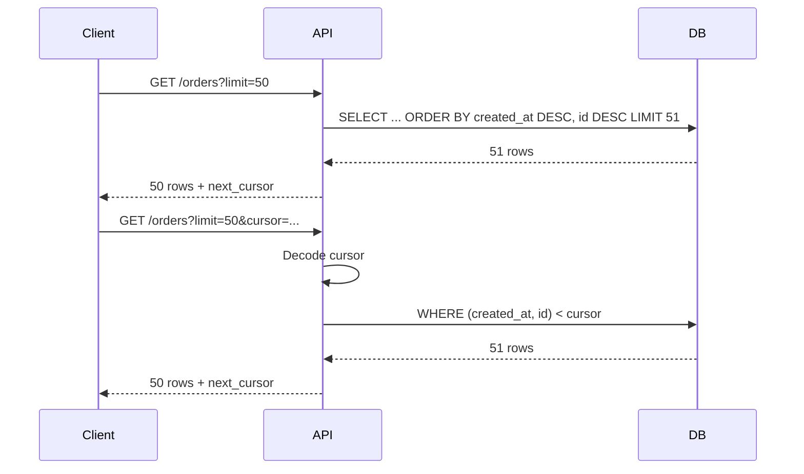

# 09- Keyset Pagination

## Overview

Keyset pagination, also called **cursor pagination** or **seek pagination**, retrieves the next page by using the values of the last row from the current page rather than counting and skipping all preceding rows.

A typical offset query looks like:

```sql
SELECT
    id,
    created_at,
    total_amount
FROM orders
ORDER BY created_at DESC, id DESC
LIMIT 50
OFFSET 100000;
```

Keyset pagination instead expresses the next page as a position in the ordered dataset:

```sql
SELECT
    id,
    created_at,
    total_amount
FROM orders
WHERE (created_at, id) < ('2026-08-30 10:15:00+00', 1042)
ORDER BY created_at DESC, id DESC
LIMIT 50;
```

The key difference is:

```text
Offset pagination:
"Skip the first N rows."

Keyset pagination:
"Start after this known ordering key."
```

This makes keyset pagination particularly effective for large datasets, deep pagination, and continuously changing data such as feeds, event histories, audit logs, and order histories.

## Why Keyset Pagination Exists

Offset pagination becomes increasingly expensive as the offset grows because the database may need to traverse or process many rows that will ultimately be discarded.

For example:

```sql
LIMIT 50 OFFSET 5000000;
```

The application needs only 50 rows, but the database may have to walk through a very large number of preceding rows.

Keyset pagination avoids this growing skip cost by using an indexed boundary:

```text
Current page ends at:
(created_at, id) = ('2026-08-30 10:15:00', 1042)

Next request:
return rows after this boundary
```

With an appropriate index, the database can seek into the relevant portion of the index and continue scanning from there.

## Offset vs Keyset

| Characteristic | Offset | Keyset |
|---|---|---|
| Implementation complexity | Low | Moderate |
| Numbered pages | Excellent | Poor |
| Arbitrary page jumps | Easy | Difficult |
| Deep pagination | Can degrade | Strong |
| Large datasets | Can become expensive | Strong fit |
| Frequent inserts | Can shift page boundaries | More stable |
| Infinite scrolling | Reasonable | Excellent |
| Stable sequential traversal | Moderate | Excellent |
| Exact total count | Easy to expose conceptually | Usually separate |
| Index dependency | Helpful | Critical |
| API cursor handling | Not required | Required |

Keyset pagination is not a universal replacement. If users need to jump directly to page 500, offset pagination may still be the more appropriate model.

## Core Pattern

Assume this ordering:

```sql
ORDER BY created_at DESC, id DESC
```

The first page is:

```sql
SELECT
    id,
    created_at,
    total_amount
FROM orders
ORDER BY created_at DESC, id DESC
LIMIT 50;
```

Suppose the final row is:

```text
created_at = 2026-08-30 10:15:00
id         = 1042
```

The next page uses that row as its boundary:

```sql
SELECT
    id,
    created_at,
    total_amount
FROM orders
WHERE (created_at, id) < ('2026-08-30 10:15:00', 1042)
ORDER BY created_at DESC, id DESC
LIMIT 50;
```

For descending order, the next page selects values **less than** the cursor.

For ascending order:

```sql
SELECT
    id,
    created_at,
    total_amount
FROM orders
WHERE (created_at, id) > ('2026-08-30 10:15:00', 1042)
ORDER BY created_at ASC, id ASC
LIMIT 50;
```

The comparison operator must match the direction of the ordering.

## Why a Unique Tie-Breaker Is Required

Consider:

```sql
ORDER BY created_at DESC
```

If multiple rows have the same timestamp:

```text
created_at
-------------------
10:15:00
10:15:00
10:15:00
10:14:59
```

`created_at` alone does not uniquely identify a position.

Use a unique secondary key:

```sql
ORDER BY created_at DESC, id DESC
```

Now every row has a deterministic ordering:

```text
(created_at, id)
```

The cursor contains both values.

This is one of the most important rules for reliable keyset pagination:

> The cursor must represent the complete ordering boundary.

A primary key is commonly used as the tie-breaker.

## Row-Value Comparisons

PostgreSQL supports row-value comparisons such as:

```sql
WHERE (created_at, id) < ('2026-08-30 10:15:00+00', 1042)
```

This is equivalent to the lexicographic comparison:

```text
created_at < cursor_created_at
OR
(
    created_at = cursor_created_at
    AND id < cursor_id
)
```

Conceptually:

```sql
WHERE
    created_at < :cursor_created_at
    OR (
        created_at = :cursor_created_at
        AND id < :cursor_id
    )
```

The row-value form is concise and directly expresses the ordering boundary.

## Pagination Flow

A typical keyset pagination flow looks like:



The server does not need to know the page number.

It only needs the position represented by the cursor.

## Cursor Contents

A cursor commonly contains the values required to reconstruct the ordering boundary.

For:

```sql
ORDER BY created_at DESC, id DESC
```

the cursor might logically contain:

```json
{
  "created_at": "2026-08-30T10:15:00Z",
  "id": 1042
}
```

The API should generally serialize and encode this rather than exposing an implementation-specific structure directly.

For example:

```text
eyJjcmVhdGVkX2F0IjoiMjAyNi0wOC0zMFQxMDoxNTowMFoiLCJpZCI6MTA0Mn0=
```

The exact encoding format is an API design decision.

Base64 encoding is commonly used for transport, but **Base64 is not encryption**.

## Cursor Integrity

A cursor should not be treated as trusted input.

If it contains:

```json
{
  "created_at": "...",
  "id": 1042
}
```

a client can potentially modify it unless integrity protection is applied.

For sensitive or security-relevant APIs, consider:

- Signing cursors.
- Using authenticated encryption where confidentiality is required.
- Validating cursor structure.
- Validating expected sort/filter parameters.
- Rejecting malformed or expired cursors.

A signed cursor can conceptually contain:

```text
payload + integrity signature
```

The server can verify that the cursor was generated by the application and has not been modified.

Do not place secrets or sensitive information into a cursor merely because it is Base64 encoded.

## Cursor and Query State

A cursor is valid only within the query context that generated it.

Suppose the first request is:

```text
GET /orders?status=paid&sort=-created_at
```

The next request should not reuse that cursor with:

```text
GET /orders?status=cancelled&sort=-created_at
```

The boundary belongs to the original result set.

A robust cursor can therefore include metadata such as:

```json
{
  "version": 1,
  "sort": "-created_at",
  "filters": {
    "status": "paid"
  },
  "created_at": "2026-08-30T10:15:00Z",
  "id": 1042
}
```

The server can either:

- Encode the relevant query state into the cursor.
- Validate the request against cursor metadata.
- Treat mismatched cursor/query combinations as invalid.

This prevents subtle pagination bugs.

## Index Design

Keyset pagination depends heavily on an index matching the filter and ordering pattern.

For:

```sql
SELECT
    id,
    created_at,
    total_amount
FROM orders
WHERE customer_id = 42
  AND (created_at, id) < ('2026-08-30 10:15:00+00', 1042)
ORDER BY created_at DESC, id DESC
LIMIT 50;
```

a suitable index is:

```sql
CREATE INDEX idx_orders_customer_created_id
ON orders (customer_id, created_at DESC, id DESC);
```

This gives the database an ordered structure aligned with:

```text
WHERE customer_id = ...
ORDER BY created_at DESC, id DESC
```

The exact index should be determined from the real workload and verified with `EXPLAIN`.

## Why Keyset Pagination Scales Better

Consider a large ordered index:

```text
┌──────────────────────────────────────────────┐
│ newest                                       │
│   ↓                                          │
│ row 1                                        │
│ row 2                                        │
│ row 3                                        │
│ ...                                          │
│ row 5,000,000                                │
│   ↑                                          │
│ cursor boundary                             │
│ row 5,000,001                                │
│ row 5,000,002                                │
└──────────────────────────────────────────────┘
```

With offset pagination:

```text
start → scan/traverse many rows → discard → return rows
```

With keyset pagination:

```text
index → seek to cursor boundary → scan next rows → return rows
```

The database still performs work to satisfy the query, but it does not have to repeatedly discard an increasingly large prefix of the result set.

Actual performance depends on the database engine, index, filters, visibility checks, query plan, and data distribution.

## Fetching One Extra Row

A common production technique is to request one more row than the API returns.

For a page size of 50:

```sql
SELECT
    id,
    created_at,
    total_amount
FROM orders
WHERE (created_at, id) < (:created_at, :id)
ORDER BY created_at DESC, id DESC
LIMIT 51;
```

Then:

```text
51 rows returned
    ↓
return first 50
    ↓
has_next = true
    ↓
cursor = last returned row
```

If only 50 or fewer rows are returned:

```text
has_next = false
```

This avoids a separate:

```sql
SELECT COUNT(*)
```

just to determine whether another page exists.

## First Page

The first page has no cursor:

```sql
SELECT
    id,
    created_at,
    total_amount
FROM orders
ORDER BY created_at DESC, id DESC
LIMIT 51;
```

The API returns:

```json
{
  "results": [
    {
      "id": 1042,
      "created_at": "2026-08-30T10:15:00Z",
      "total_amount": "149.99"
    }
  ],
  "next_cursor": "encoded-cursor",
  "has_next": true
}
```

The client uses `next_cursor` for the next request.

## Subsequent Pages

The second request becomes:

```text
GET /orders?limit=50&cursor=encoded-cursor
```

After decoding and validating the cursor:

```sql
SELECT
    id,
    created_at,
    total_amount
FROM orders
WHERE (created_at, id) < (:created_at, :id)
ORDER BY created_at DESC, id DESC
LIMIT 51;
```

The final returned row becomes the boundary for the following request.

## Handling Concurrent Inserts

One major advantage of keyset pagination is that inserts before the current cursor generally do not shift the cursor boundary.

Suppose the current page ends at:

```text
(created_at, id) = (10:00, 100)
```

A new row arrives:

```text
(10:05, 200)
```

The next query still asks for:

```text
rows < (10:00, 100)
```

The new row does not move the boundary backward.

With offset pagination, the new row can shift every subsequent row's numeric position.

Keyset pagination therefore provides more stable sequential traversal under concurrent writes.

It does **not**, however, automatically provide a globally consistent snapshot.

## Updates to Ordering Columns

Keyset pagination is most predictable when ordering columns are immutable.

For example:

```sql
ORDER BY created_at DESC, id DESC
```

works particularly well if `created_at` and `id` do not change.

If `created_at` can be updated after a row has already been paginated, a row can move to a different position in the ordered dataset.

This can produce:

- A row appearing later than expected.
- A row appearing twice across requests.
- A row being skipped.

For feeds and event histories, prefer stable ordering attributes.

## Deletes

Deletes generally do not cause the same page-shifting problem as offset pagination.

If the cursor points to:

```text
id = 1042
```

and rows before that boundary are deleted, the next query still uses the boundary.

The result may simply contain fewer rows.

However, if the cursor's referenced row itself has been deleted, that is normally not a problem because the cursor contains the ordering values rather than requiring the row to still exist.

## Filtering

Keyset pagination works naturally with filters.

Example:

```sql
SELECT
    id,
    created_at,
    total_amount
FROM orders
WHERE customer_id = :customer_id
  AND status = 'paid'
  AND (created_at, id) < (:created_at, :id)
ORDER BY created_at DESC, id DESC
LIMIT 51;
```

The index should reflect the dominant query shape:

```sql
CREATE INDEX idx_orders_customer_status_created_id
ON orders (
    customer_id,
    status,
    created_at DESC,
    id DESC
);
```

Do not automatically create an index containing every filterable field. Indexes have storage, write-amplification, maintenance, and planning costs.

Design them from actual query patterns.

## Multiple Sort Directions

Keyset pagination becomes more complex when the API supports arbitrary sort combinations.

For:

```sql
ORDER BY created_at DESC, id DESC
```

the next-page predicate is:

```sql
WHERE (created_at, id) < (:created_at, :id)
```

For:

```sql
ORDER BY created_at ASC, id ASC
```

it becomes:

```sql
WHERE (created_at, id) > (:created_at, :id)
```

Mixed directions such as:

```sql
ORDER BY priority DESC, created_at ASC, id ASC
```

require more careful cursor predicates and index design.

Do not implement dynamic sorting by blindly interpolating client-provided SQL.

Instead, map allowed API sort values to known SQL expressions:

```python
SORT_OPTIONS = {
    "newest": ("created_at", "DESC"),
    "oldest": ("created_at", "ASC"),
}
```

This both controls query behavior and prevents SQL injection through dynamic identifiers.

## Backward Pagination

Forward pagination is straightforward:

```text
first → next → next → next
```

Backward pagination is more complicated.

If the API supports:

```text
previous page
```

it needs to know the ordering boundary in the opposite direction.

A common technique is:

1. Reverse the ordering.
2. Apply the appropriate boundary predicate.
3. Fetch the rows.
4. Reverse the result in application code before returning it.

For example, if the normal order is:

```sql
ORDER BY created_at DESC, id DESC
```

a backward query can conceptually use:

```sql
WHERE (created_at, id) > (:created_at, :id)
ORDER BY created_at ASC, id ASC
LIMIT 51;
```

Then reverse the returned rows to restore the API's normal ordering.

Backward pagination should be designed deliberately rather than added as an afterthought.

## Django Example

Django does not require application-side materialization for keyset pagination.

A basic pattern can use `Q` conditions:

```python
from django.db.models import Q

page_size = 50

queryset = (
    Order.objects
    .filter(customer_id=customer_id)
    .order_by("-created_at", "-id")
)

if cursor:
    queryset = queryset.filter(
        Q(created_at__lt=cursor.created_at)
        | Q(
            created_at=cursor.created_at,
            id__lt=cursor.id,
        )
    )

orders = list(queryset[: page_size + 1])

has_next = len(orders) > page_size
orders = orders[:page_size]
```

The important part is that Django translates the filtering and slicing into SQL. The application should not load the entire dataset and then paginate it in Python.

## FastAPI Example

A FastAPI endpoint can expose cursor pagination using a query parameter:

```python
from fastapi import FastAPI, Query

app = FastAPI()


@app.get("/orders")
def list_orders(
    limit: int = Query(default=50, ge=1, le=100),
    cursor: str | None = None,
):
    # Decode and validate the cursor before constructing the query.
    # The actual database query should use parameterized values.
    return {
        "limit": limit,
        "cursor": cursor,
    }
```

In a real implementation, the cursor should be decoded into typed values and passed to the database as bound parameters.

Do not construct SQL like:

```python
f"WHERE id < {cursor}"
```

or interpolate cursor values into SQL strings.

Use the database driver's parameter binding or the ORM's query API.

## REST API Design

A typical API contract is:

```text
GET /orders?limit=50
GET /orders?limit=50&cursor=<opaque-cursor>
```

Response:

```json
{
  "results": [
    {
      "id": 1042,
      "created_at": "2026-08-30T10:15:00Z"
    }
  ],
  "next_cursor": "<opaque-cursor>",
  "has_next": true
}
```

Avoid requiring clients to understand database-specific cursor fields.

Prefer:

```text
cursor=<opaque-value>
```

over:

```text
created_at=2026-08-30T10:15:00Z&id=1042
```

The opaque approach allows the server to change cursor representation without breaking clients.

## Cursor Versioning

Cursor formats can evolve.

A cursor might include:

```json
{
  "v": 1,
  "created_at": "2026-08-30T10:15:00Z",
  "id": 1042
}
```

If the API later changes its cursor structure, the version allows the server to distinguish old and new formats.

This is particularly useful for long-lived public APIs.

Possible policy:

```text
v=1 → decode using cursor schema 1
v=2 → decode using cursor schema 2
unknown version → HTTP 400
```

Do not assume clients will immediately upgrade when an API changes.

## Exact Counts

Keyset pagination does not naturally provide:

```text
Page 3 of 12,438
```

because it deliberately avoids calculating the total position of the current row.

If the product requires an exact total, a separate count operation may be necessary:

```sql
SELECT COUNT(*)
FROM orders
WHERE customer_id = 42
  AND status = 'paid';
```

That count should be treated as a separate performance consideration.

For many APIs, this is a feature rather than a limitation:

```text
results
+
has_next
+
next_cursor
```

is sufficient.

## Jumping to an Arbitrary Page

Keyset pagination is poor at:

```text
Go directly to page 500.
```

There is no natural:

```text
OFFSET 24950
```

equivalent.

If arbitrary page navigation is a hard product requirement, consider:

- Offset pagination.
- Hybrid pagination.
- Search/filter narrowing.
- Materialized result sets.
- Precomputed navigation structures.

Do not force keyset pagination into a UI whose primary requirement is random page access.

## Search Results

Keyset pagination works well when search results have a stable, deterministic ordering.

For example:

```sql
SELECT
    id,
    name,
    created_at
FROM products
WHERE category_id = :category_id
  AND (created_at, id) < (:created_at, :id)
ORDER BY created_at DESC, id DESC
LIMIT 51;
```

For full-text or relevance-ranked search, however, the ordering may depend on a computed relevance score:

```sql
ORDER BY relevance_score DESC, id DESC
```

This requires careful consideration because relevance scores can change as the underlying search index changes.

For search systems such as Elasticsearch or OpenSearch, use the pagination mechanism appropriate to that system rather than assuming relational-database keyset patterns transfer directly.

## Distributed Systems Considerations

In a microservices architecture, the database cursor should generally remain an implementation detail of the service owning the data.

For example:

```text
Client
  │
  ▼
API Gateway
  │
  ▼
Order Service
  │
  ▼
PostgreSQL
```

The client receives an opaque cursor from the Order Service.

Avoid making the API contract depend on:

```text
PostgreSQL-specific implementation details
```

This gives the service freedom to change:

- Indexes.
- Database schema.
- Cursor encoding.
- Storage engine.
- Query implementation.

The cursor is part of the API contract, but its internal representation should remain opaque.

## Performance Verification

Use actual execution plans.

For PostgreSQL:

```sql
EXPLAIN (ANALYZE, BUFFERS)
SELECT
    id,
    created_at,
    total_amount
FROM orders
WHERE customer_id = 42
  AND (created_at, id) < ('2026-08-30 10:15:00+00', 1042)
ORDER BY created_at DESC, id DESC
LIMIT 51;
```

Look for:

- Appropriate index usage.
- Unexpected sequential scans.
- Large numbers of rows removed by filters.
- Excessive heap access.
- Sort operations.
- Buffer reads.
- Execution time.
- P95/P99 latency under production-like load.

Keyset pagination is an access-pattern optimization, not a guarantee that every query will be fast.

## Monitoring

For a production cursor-paginated endpoint, monitor:

- Request latency.
- P95/P99 latency.
- Database CPU.
- Database I/O.
- Query execution time.
- Cursor decoding failures.
- Invalid cursor rate.
- Page size distribution.
- Request frequency.
- Database connection utilization.
- Error rates.

Useful application metrics include:

```text
orders.list.latency
orders.list.invalid_cursor
orders.list.cursor_decode_failure
orders.list.rows_returned
orders.list.limit
```

A sudden increase in invalid cursors can indicate:

- Client bugs.
- Cursor-version incompatibility.
- Corrupted links.
- Malformed requests.
- API migration problems.

## Common Mistakes and Pitfalls

| Mistake | Why it is problematic | Better approach |
|---|---|---|
| Using only a non-unique timestamp | Multiple rows can share the same position | Add a unique tie-breaker |
| Forgetting `ORDER BY` | Cursor semantics become undefined | Make ordering explicit |
| Using the wrong comparison operator | Rows can be skipped or repeated | Match predicate to sort direction |
| Exposing raw cursor fields | Couples clients to database schema | Use opaque cursors |
| Treating Base64 as encryption | Cursor contents remain readable/modifiable | Sign or encrypt when required |
| Ignoring query state | Cursor can be reused with incompatible filters | Bind cursor to query state |
| Allowing arbitrary sort expressions | Security and indexing problems | Whitelist sort options |
| Loading all rows in Python | Defeats database-side pagination | Apply predicates and limits in SQL |
| Assuming keyset gives exact counts | It intentionally avoids positional counting | Return `has_next` or count separately |
| Supporting mutable ordering fields carelessly | Rows can move between pages | Prefer immutable ordering fields |
| Creating indexes without workload analysis | Adds write/storage cost unnecessarily | Design indexes from actual queries |
| Assuming keyset solves snapshot consistency | Requests still occur in separate transactions | Use explicit snapshot strategies when required |

## Keyset Pagination Checklist

Before deploying cursor pagination, verify:

### Query

- [ ] `ORDER BY` is deterministic.
- [ ] A unique tie-breaker exists.
- [ ] Cursor predicates match sort direction.
- [ ] Filters are applied before the cursor boundary.
- [ ] `LIMIT` is bounded.

### Index

- [ ] Index supports the dominant filtering pattern.
- [ ] Index ordering aligns with the pagination order.
- [ ] `EXPLAIN (ANALYZE, BUFFERS)` has been reviewed.
- [ ] Write and storage overhead is understood.

### API

- [ ] Cursor is opaque.
- [ ] Cursor input is validated.
- [ ] Cursor is bound to relevant query state.
- [ ] Cursor format can be versioned.
- [ ] Invalid cursors produce controlled client errors.
- [ ] Page size has a server-side maximum.

### Consistency

- [ ] Ordering columns are stable where possible.
- [ ] Concurrent insert behavior is understood.
- [ ] Update behavior for ordering fields is understood.
- [ ] Snapshot requirements are explicitly defined.

## Key Takeaways

- Keyset pagination uses an indexed ordering boundary instead of `OFFSET`, making it well suited to large datasets and deep sequential traversal.
- A deterministic `ORDER BY` with a unique tie-breaker is essential; the cursor must contain the complete ordering boundary.
- Production implementations should use appropriate composite indexes, bounded page sizes, opaque and validated cursors, and query-state validation.
- Keyset pagination is more stable than offset pagination under concurrent inserts, but it does not automatically provide a consistent point-in-time snapshot.
- Use keyset pagination for feeds and large sequential datasets; use offset pagination when arbitrary page navigation and numbered pages are core product requirements.