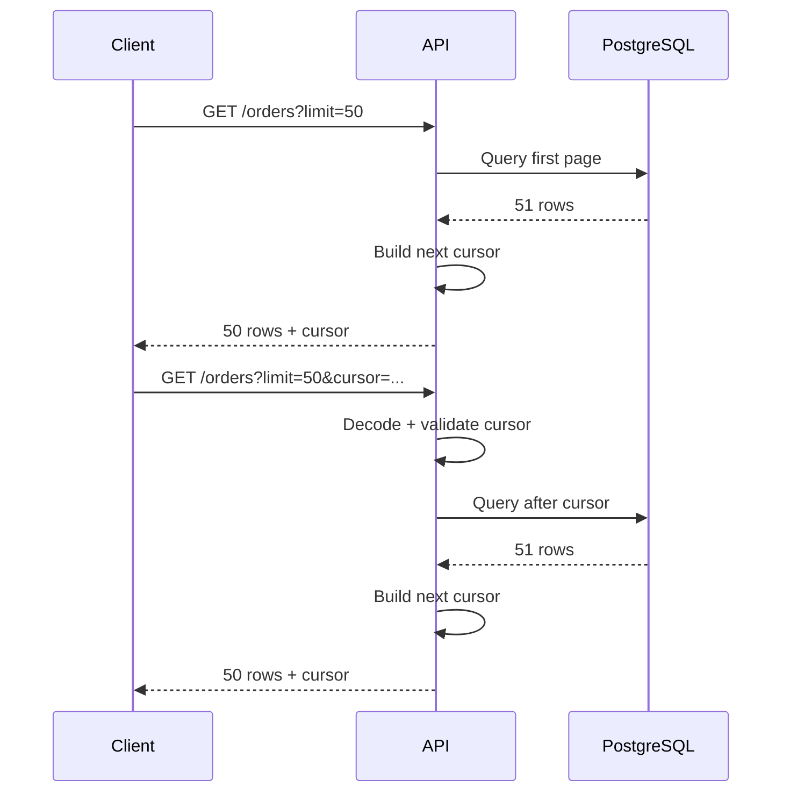
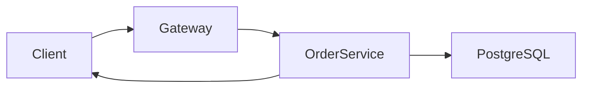

# 10- Cursor Pagination

## Overview

Cursor pagination is a pagination strategy where the client sends an opaque **cursor representing a position in an ordered result set** instead of a page number or row offset.

A cursor usually encodes the values required to continue from the last row returned by the previous request.

For example, with:

```sql
ORDER BY created_at DESC, id DESC
```

a cursor may represent:

```text
created_at = 2026-08-30 10:15:00+00
id         = 1042
```

The next query can then continue from that boundary:

```sql
SELECT
    id,
    created_at,
    total_amount
FROM orders
WHERE (created_at, id) < (:created_at, :id)
ORDER BY created_at DESC, id DESC
LIMIT 51;
```

Cursor pagination is particularly useful for:

- Infinite-scroll APIs.
- Activity feeds.
- Audit logs.
- Order histories.
- Event streams.
- Large datasets.
- APIs where deep pagination is common.
- Data that changes frequently while clients are paging through it.

Cursor pagination is an **API-level pagination pattern**. Internally, it is commonly implemented using **keyset pagination**, but the terms are not always interchangeable: a cursor describes the API mechanism, while keyset pagination describes the database access strategy used to seek from an ordered key.

## Cursor Pagination vs Offset Pagination

| Characteristic | Offset Pagination | Cursor Pagination |
|---|---|---|
| Request model | `page=10` or `offset=450` | `cursor=...` |
| Deep pagination | Can become expensive | Usually efficient |
| Random page access | Excellent | Poor |
| Infinite scrolling | Good | Excellent |
| Concurrent inserts | Can shift page boundaries | Generally more stable |
| Client complexity | Lower | Higher |
| API transparency | High | Lower |
| Exact page number | Natural | Not natural |
| Exact total count | Easy to expose separately | Usually separate |
| Suitable for large datasets | Depends on workload | Strong fit |
| Requires deterministic ordering | Helpful | Essential |
| Requires cursor validation | No | Yes |

The correct choice depends on the product requirement. Cursor pagination should not be adopted merely because it is newer or faster in some workloads.

## Why Cursor Pagination Exists

Offset pagination expresses a position by counting rows:

```sql
SELECT *
FROM orders
ORDER BY created_at DESC
LIMIT 50 OFFSET 500000;
```

The database may need to process or traverse a large number of preceding rows before returning the requested page.

Cursor pagination expresses the position using an ordering boundary:

```sql
SELECT *
FROM orders
WHERE (created_at, id) < (:created_at, :id)
ORDER BY created_at DESC, id DESC
LIMIT 50;
```

With an appropriate index, the database can seek into the ordered index and continue scanning from the cursor boundary.

Conceptually:

```text
Offset:
start → traverse many rows → discard → return page

Cursor:
index → seek to cursor → scan next rows → return page
```

The actual query plan depends on the database engine, indexes, filters, data distribution, and visibility checks.

## Core Cursor Model

Assume the API returns:

```text
Rows 1–50
```

The last row contains:

```text
created_at = 2026-08-30 10:15:00+00
id         = 1042
```

The API generates a cursor representing that position.

The next request becomes:

```text
GET /orders?limit=50&cursor=<opaque-cursor>
```

The server decodes and validates the cursor, then translates it into:

```sql
WHERE (created_at, id) < ('2026-08-30 10:15:00+00', 1042)
```

The database returns the next 50 rows.



## Deterministic Ordering

Cursor pagination requires a deterministic ordering.

Avoid:

```sql
ORDER BY created_at DESC;
```

if `created_at` is not unique.

Multiple rows can have the same timestamp:

```text
10:15:00 → order 100
10:15:00 → order 101
10:15:00 → order 102
```

A cursor containing only `created_at` cannot precisely represent which row was last returned.

Use a unique tie-breaker:

```sql
ORDER BY created_at DESC, id DESC;
```

Now the position is represented by:

```text
(created_at, id)
```

For most relational workloads, a stable primary key is a practical tie-breaker.

## Cursor as a Position, Not a Page Number

A cursor should represent:

```text
"Continue after this ordered position."
```

rather than:

```text
"I am on page 10."
```

This distinction matters because the cursor remains tied to the data ordering.

For example:

```text
Page 1
  ↓
cursor A
  ↓
Page 2
  ↓
cursor B
  ↓
Page 3
```

The server does not need to calculate:

```text
page × page_size
```

to retrieve the next result set.

## First Request

The first request has no cursor:

```http
GET /orders?limit=50
```

The server executes:

```sql
SELECT
    id,
    created_at,
    total_amount
FROM orders
ORDER BY created_at DESC, id DESC
LIMIT 51;
```

The extra row determines whether another page exists.

If 51 rows are returned:

```text
return rows 1–50
has_next = true
cursor = position of row 50
```

If 50 or fewer are returned:

```text
has_next = false
```

This avoids a separate `COUNT(*)` query solely to determine whether another page exists.

## Subsequent Requests

The client sends:

```http
GET /orders?limit=50&cursor=<opaque-cursor>
```

After decoding the cursor:

```sql
SELECT
    id,
    created_at,
    total_amount
FROM orders
WHERE (created_at, id) < (:created_at, :id)
ORDER BY created_at DESC, id DESC
LIMIT 51;
```

The final row of the returned page becomes the boundary for the next request.

## Cursor Direction

The comparison operator must correspond to the ordering direction.

For:

```sql
ORDER BY created_at DESC, id DESC
```

use:

```sql
WHERE (created_at, id) < (:created_at, :id)
```

For:

```sql
ORDER BY created_at ASC, id ASC
```

use:

```sql
WHERE (created_at, id) > (:created_at, :id)
```

| Ordering | Next-page predicate |
|---|---|
| `created_at ASC, id ASC` | `(created_at, id) > cursor` |
| `created_at DESC, id DESC` | `(created_at, id) < cursor` |

Using the wrong operator can cause skipped, duplicated, or incorrectly ordered records.

## Row-Value Comparison

PostgreSQL supports row-value comparisons:

```sql
WHERE (created_at, id) < (:created_at, :id)
```

Conceptually, this represents:

```sql
WHERE
    created_at < :created_at
    OR (
        created_at = :created_at
        AND id < :id
    )
```

The comparison is lexicographic.

For example:

```text
Cursor:
(2026-08-30 10:15:00, 1042)

Valid next rows:
(2026-08-30 10:14:59, 2000)
(2026-08-30 10:14:59, 1999)
(2026-08-30 10:15:00, 1041)
```

but not:

```text
(2026-08-30 10:15:00, 1043)
```

The exact SQL syntax and optimizer behavior can vary between database systems, so production implementations should be tested against the target database.

## Cursor Contents

A cursor must contain enough information to reconstruct the ordering boundary.

For:

```sql
ORDER BY created_at DESC, id DESC
```

a logical cursor might contain:

```json
{
  "created_at": "2026-08-30T10:15:00Z",
  "id": 1042
}
```

The API should normally serialize this into an opaque value:

```text
cursor=eyJjcmVhdGVkX2F0IjoiMjAyNi0wOC0zMFQxMDoxNTowMFoiLCJpZCI6MTA0Mn0=
```

The client should treat the cursor as an opaque token.

It should not need to understand:

- Database columns.
- Sort implementation.
- Timestamp representation.
- Internal cursor structure.
- Database-specific identifiers.

## Cursor Encoding

Common approaches include:

| Approach | Purpose | Consideration |
|---|---|---|
| Base64 | Transport-friendly encoding | Not secure |
| Signed Base64 | Integrity protection | Payload still readable |
| Authenticated encryption | Integrity + confidentiality | More implementation complexity |
| Random server-side token | Hides cursor state | Requires server-side storage |

Base64 is only an encoding mechanism.

This:

```text
base64(payload)
```

does not prevent a client from decoding or modifying the payload.

If cursor contents must not be disclosed or modified, use appropriate signing or authenticated encryption.

## Cursor Integrity

A robust cursor can include:

```json
{
  "version": 1,
  "sort": "created_at_desc",
  "created_at": "2026-08-30T10:15:00Z",
  "id": 1042
}
```

The server can then:

1. Decode the cursor.
2. Validate its structure.
3. Validate the version.
4. Validate the sort mode.
5. Validate relevant filter state.
6. Verify integrity if the cursor is signed.
7. Construct a parameterized query.

Malformed cursors should result in a controlled client error rather than an internal database exception.

For example:

```http
HTTP/1.1 400 Bad Request
```

```json
{
  "detail": "Invalid pagination cursor."
}
```

## Binding a Cursor to Query State

A cursor generated for:

```http
GET /orders?status=paid
```

should not silently be reused for:

```http
GET /orders?status=cancelled
```

The cursor boundary belongs to the original result set.

A cursor can include relevant query metadata:

```json
{
  "version": 1,
  "filters": {
    "status": "paid"
  },
  "sort": "created_at_desc",
  "created_at": "2026-08-30T10:15:00Z",
  "id": 1042
}
```

Alternatively, the server can validate the cursor against the current request parameters.

This prevents subtle bugs where a cursor from one result set is applied to another.

## Cursor Versioning

Cursor formats are part of the API's operational surface.

A version field allows future changes:

```json
{
  "v": 1,
  "created_at": "2026-08-30T10:15:00Z",
  "id": 1042
}
```

Possible behavior:

```text
v=1 → decode using schema 1
v=2 → decode using schema 2
unknown version → reject
```

Versioning is useful when:

- APIs are long-lived.
- Cursor structure may evolve.
- Multiple client versions exist.
- Database ordering changes over time.

Avoid making undocumented cursor formats a dependency for clients.

## Index Design

Cursor pagination is most effective when the database has an index aligned with the filtering and ordering pattern.

For:

```sql
SELECT
    id,
    created_at,
    total_amount
FROM orders
WHERE customer_id = :customer_id
  AND (created_at, id) < (:created_at, :id)
ORDER BY created_at DESC, id DESC
LIMIT 51;
```

a useful candidate index is:

```sql
CREATE INDEX idx_orders_customer_created_id
ON orders (customer_id, created_at DESC, id DESC);
```

The index supports the dominant access pattern:

```text
customer filter
      ↓
ordered timestamp
      ↓
unique tie-breaker
```

Do not create indexes mechanically. Indexes increase:

- Storage consumption.
- Write amplification.
- Vacuum/maintenance work.
- Backup size.
- Operational complexity.

Use actual query plans and workload measurements to validate index choices.

## Filtering with Cursor Pagination

Filters must be applied together with the cursor boundary.

Example:

```sql
SELECT
    id,
    created_at,
    total_amount
FROM orders
WHERE customer_id = :customer_id
  AND status = :status
  AND (created_at, id) < (:created_at, :id)
ORDER BY created_at DESC, id DESC
LIMIT 51;
```

The conceptual execution is:

```text
Filter result set
      ↓
Apply cursor boundary
      ↓
Use ordering
      ↓
Return bounded page
```

The actual optimizer may rearrange operations internally, but the logical result must correspond to this query semantics.

## Mutable Ordering Columns

Cursor pagination works best with stable ordering columns.

For example:

```sql
ORDER BY created_at DESC, id DESC
```

is predictable if `created_at` is immutable.

If an ordering value changes after a row has already been returned, that row can move within the result set.

This can cause:

- Duplicate observations.
- Missing observations.
- Rows appearing in unexpected pages.

For feeds, audit logs, and event histories, prefer immutable or effectively immutable ordering attributes.

## Concurrent Inserts

Cursor pagination is generally more stable than offset pagination when new rows are inserted.

Suppose the current cursor is:

```text
(created_at, id) = (10:00, 100)
```

A new row arrives:

```text
(10:05, 200)
```

The next query still uses:

```sql
WHERE (created_at, id) < ('10:00', 100)
```

The new row is ahead of the cursor and therefore does not shift the next-page boundary.

With offset pagination, inserting a row before the current page can change the numerical offset of existing rows.

Cursor pagination therefore reduces page drift during sequential traversal.

It does **not** mean that separate API requests observe a single consistent database snapshot.

## Deletes

Deleting rows before the cursor normally does not invalidate the cursor.

For example:

```text
Cursor:
(created_at, id) = (10:00, 100)
```

If earlier rows are deleted, the next query still starts from:

```text
(10:00, 100)
```

The page may simply contain fewer rows.

The cursor should normally represent ordering values rather than depend on the physical existence of the row that produced it.

## Exact Counts

Cursor pagination does not naturally answer:

```text
You are on page 37 of 12,400.
```

because it deliberately avoids calculating a row offset.

If an exact total is required, perform a separate count:

```sql
SELECT COUNT(*)
FROM orders
WHERE customer_id = :customer_id
  AND status = :status;
```

Do not automatically add an expensive count to every paginated request.

Many APIs only need:

```json
{
  "results": [],
  "next_cursor": "...",
  "has_next": true
}
```

This is usually more scalable than maintaining exact page numbers.

## Arbitrary Page Navigation

Cursor pagination is not designed for:

```text
Go directly to page 500.
```

There is no natural equivalent to:

```sql
OFFSET 24950
```

If random page navigation is a core product requirement, consider:

- Offset pagination.
- A hybrid strategy.
- Search/filter narrowing.
- Materialized result sets.
- Domain-specific navigation structures.

Pagination should be chosen based on the user interaction model rather than database performance alone.

## Forward Pagination

Forward pagination is the simplest cursor design.

For descending order:

```sql
ORDER BY created_at DESC, id DESC
```

use:

```sql
WHERE (created_at, id) < (:created_at, :id)
```

The API might expose:

```json
{
  "results": [
    {
      "id": 1042,
      "created_at": "2026-08-30T10:15:00Z"
    }
  ],
  "next_cursor": "opaque-cursor",
  "has_next": true
}
```

This model works particularly well for:

- Activity feeds.
- Notification lists.
- Transaction history.
- Audit events.
- Message history.

## Backward Pagination

Supporting previous-page navigation is more complicated.

If the normal order is:

```sql
ORDER BY created_at DESC, id DESC
```

the server can conceptually reverse the ordering:

```sql
WHERE (created_at, id) > (:created_at, :id)
ORDER BY created_at ASC, id ASC
LIMIT 51;
```

The application can then reverse the returned rows before sending them to the client.

This is useful for APIs that require:

```text
next
previous
```

rather than only:

```text
load more
```

Backward pagination should be explicitly designed and tested because cursor direction, boundary semantics, and result reversal must remain consistent.

## Fetching One Extra Row

A practical implementation fetches:

```text
page_size + 1
```

rows.

For a requested page size of 50:

```sql
LIMIT 51
```

Then:

```text
51 returned
    ↓
return 50
    ↓
has_next = true
    ↓
cursor = last returned row
```

If 50 or fewer rows are returned:

```text
has_next = false
```

This avoids:

```sql
SELECT COUNT(*)
```

for the common question:

```text
"Does another page exist?"
```

## API Page Size Limits

Clients should not be allowed to request arbitrary page sizes.

For example:

```http
GET /orders?limit=1000000
```

could create excessive database and network load.

Use a bounded range:

```text
default = 50
maximum = 100
```

For example:

```python
from fastapi import FastAPI, Query

app = FastAPI()


@app.get("/orders")
def list_orders(
    limit: int = Query(default=50, ge=1, le=100),
    cursor: str | None = None,
):
    return {
        "limit": limit,
        "cursor": cursor,
    }
```

The actual implementation should decode and validate the cursor before constructing the database query.

## Django Implementation Pattern

Django can implement cursor pagination without loading the entire table into application memory.

For descending ordering:

```python
from django.db.models import Q

page_size = 50

queryset = (
    Order.objects
    .filter(customer_id=customer_id)
    .order_by("-created_at", "-id")
)

if cursor:
    queryset = queryset.filter(
        Q(created_at__lt=cursor.created_at)
        | Q(
            created_at=cursor.created_at,
            id__lt=cursor.id,
        )
    )

orders = list(queryset[: page_size + 1])

has_next = len(orders) > page_size
orders = orders[:page_size]
```

The important property is that the database performs the filtering and limiting.

Avoid:

```python
orders = list(Order.objects.all())
orders = orders[offset:offset + page_size]
```

for large datasets. That defeats the purpose of database-side pagination.

## FastAPI and Repository Design

In a service-oriented backend, keep cursor decoding separate from database access.

A useful flow is:

```text
HTTP request
    ↓
Validate limit
    ↓
Decode cursor
    ↓
Validate cursor/query compatibility
    ↓
Build parameterized query
    ↓
Database
    ↓
Fetch page_size + 1
    ↓
Create next cursor
    ↓
Serialize response
```

This separation prevents API concerns such as Base64 encoding from leaking into repository code.

Conceptually:

```python
cursor = decode_cursor(raw_cursor)
validate_cursor(cursor, filters, sort)

orders = repository.list_orders(
    customer_id=customer_id,
    cursor=cursor,
    limit=limit + 1,
)
```

The repository should receive structured values rather than an opaque cursor string.

## SQL Injection Considerations

Cursor values must be bound parameters.

Do not construct SQL like:

```python
query = f"""
SELECT *
FROM orders
WHERE id < {cursor_id}
"""
```

Use parameterized queries:

```python
cursor.execute(
    """
    SELECT id, created_at, total_amount
    FROM orders
    WHERE id < %s
    ORDER BY id DESC
    LIMIT %s
    """,
    (cursor_id, limit),
)
```

Dynamic identifiers such as sort columns require separate protection because most database drivers do not treat identifiers as ordinary bound values.

Use a whitelist:

```python
SORT_OPTIONS = {
    "newest": ("created_at", "DESC"),
    "oldest": ("created_at", "ASC"),
}
```

Never allow a raw client value to become an arbitrary SQL expression.

## Query Plan Verification

Cursor pagination should be verified with the real database.

For PostgreSQL:

```sql
EXPLAIN (ANALYZE, BUFFERS)
SELECT
    id,
    created_at,
    total_amount
FROM orders
WHERE customer_id = 42
  AND (created_at, id) < ('2026-08-30 10:15:00+00', 1042)
ORDER BY created_at DESC, id DESC
LIMIT 51;
```

Check for:

- Expected index usage.
- Unexpected sequential scans.
- Excessive rows removed by filters.
- Expensive sort operations.
- Excessive heap reads.
- Buffer utilization.
- Execution time.

Test both:

```text
first page
```

and:

```text
deep cursor
```

A query can perform well for the first page while being inefficient for later pages because of poor filtering or indexing.

## Cursor Pagination and Transactions

Each HTTP request commonly executes in its own database transaction.

Therefore:

```text
Request 1 → transaction 1
Request 2 → transaction 2
Request 3 → transaction 3
```

Cursor pagination does not automatically guarantee that all three requests see exactly the same database snapshot.

If the application requires strict snapshot consistency across a long-running pagination session, additional mechanisms are required, such as:

- Explicit transaction/snapshot handling.
- A stable materialized result set.
- Snapshot identifiers.
- Application-specific versioning.

These approaches have their own resource and operational costs.

For most feeds and histories, strict snapshot consistency is unnecessary.

## Distributed Service Architecture

In a microservices architecture, cursor generation should generally belong to the service that owns the underlying data.

Example:



The client receives:

```text
opaque cursor
```

rather than:

```text
PostgreSQL-specific ordering state
```

This allows the service to change:

- Database indexes.
- Schema details.
- Cursor encoding.
- Query implementation.
- Storage technology.

The cursor remains part of the public API contract, while its internal representation remains an implementation detail.

## Monitoring

For a production cursor-paginated endpoint, monitor:

| Metric | Why it matters |
|---|---|
| Request latency | Detects API performance degradation |
| P95/P99 latency | Captures slow pagination paths |
| Query execution time | Identifies database bottlenecks |
| Invalid cursor rate | Detects client/API compatibility issues |
| Cursor decode failures | Detects malformed or incompatible cursors |
| Rows returned | Detects unusual page-size behavior |
| Database CPU | Detects query pressure |
| Database I/O | Detects inefficient access patterns |
| Connection utilization | Detects database saturation |
| Error rate | Detects reliability problems |

Useful application metrics include:

```text
orders.list.latency
orders.list.invalid_cursor
orders.list.cursor_decode_failure
orders.list.rows_returned
orders.list.limit
```

Cursor pagination should be evaluated using production-like dataset sizes and realistic concurrency, not only small development databases.

## Common Mistakes and Pitfalls

| Mistake | Problem | Better approach |
|---|---|---|
| Ordering by a non-unique field | Cursor cannot identify an exact position | Add a unique tie-breaker |
| Omitting `ORDER BY` | Cursor semantics become undefined | Make ordering explicit |
| Using the wrong `<` or `>` operator | Rows can be skipped or duplicated | Match predicate to ordering direction |
| Exposing raw cursor internals | Couples clients to schema | Use opaque cursors |
| Assuming Base64 provides security | Data can be decoded and modified | Sign or encrypt when required |
| Reusing cursors across filters | Cursor belongs to a different result set | Bind or validate query state |
| Allowing unlimited page sizes | Can overload database and network | Enforce server-side limits |
| Loading records into Python first | Wastes memory and database resources | Filter and limit in SQL |
| Using mutable ordering fields | Rows can move between pages | Prefer stable ordering |
| Creating indexes blindly | Increases storage and write costs | Validate with workload and query plans |
| Assuming cursor pagination provides snapshots | Requests use separate transactions | Explicitly design snapshot semantics |
| Expecting direct page jumps | Cursor has no natural page number | Use offset or another navigation strategy |

## Cursor Pagination Checklist

### Ordering

- [ ] Ordering is deterministic.
- [ ] Ordering contains a unique tie-breaker.
- [ ] Cursor contains all required ordering values.
- [ ] Ordering columns are stable where possible.
- [ ] Comparison operators match sort direction.

### Database

- [ ] Dominant filters and ordering have appropriate indexes.
- [ ] Query plans have been inspected.
- [ ] First-page and deep-cursor performance have been tested.
- [ ] Page size is bounded.
- [ ] Database resource impact is understood.

### API

- [ ] Cursor is opaque to clients.
- [ ] Cursor structure is validated.
- [ ] Cursor integrity is protected when necessary.
- [ ] Cursor versioning is supported when appropriate.
- [ ] Cursor/filter/sort compatibility is validated.
- [ ] Invalid cursors return controlled client errors.

### Consistency

- [ ] Concurrent inserts are understood.
- [ ] Deletes are understood.
- [ ] Updates to ordering fields are understood.
- [ ] Snapshot requirements are explicit.
- [ ] Duplicate/missing-row behavior is tested under concurrent writes.

## Interview Traps

### Cursor Pagination Is Not the Same as Base64

Base64 is only an encoding mechanism.

The performance benefit comes from using the cursor as an indexed database boundary, not from encoding it.

### Cursor Pagination Does Not Mean No Index Is Required

Without a suitable index, the database may still scan and sort a large dataset.

Cursor pagination and index design must be considered together.

### Cursor Pagination Does Not Guarantee Snapshot Consistency

Separate requests normally run in separate transactions.

Concurrent updates can therefore affect later pages.

### Cursor Pagination Does Not Support Arbitrary Page Jumps Naturally

A cursor represents a position, not a numerical page.

If direct navigation to page 500 is required, another pagination strategy may be more appropriate.

### A Unique Tie-Breaker Matters

This:

```sql
ORDER BY created_at DESC
```

is insufficient when timestamps are not unique.

This is safer:

```sql
ORDER BY created_at DESC, id DESC
```

The cursor must represent the complete ordering boundary.

## Key Takeaways

- Cursor pagination represents a position in an ordered dataset rather than a numeric offset, making it well suited to large datasets and sequential traversal.
- Deterministic ordering with a unique tie-breaker is mandatory for reliable cursor boundaries.
- Production cursor pagination requires appropriate indexes, bounded page sizes, validated opaque cursors, and protection against SQL injection.
- Cursor pagination is generally more resilient to concurrent inserts than offset pagination, but it does not automatically provide snapshot consistency.
- Use cursor pagination for feeds, histories, and large sequential datasets; use offset pagination when random page navigation is a primary product requirement.