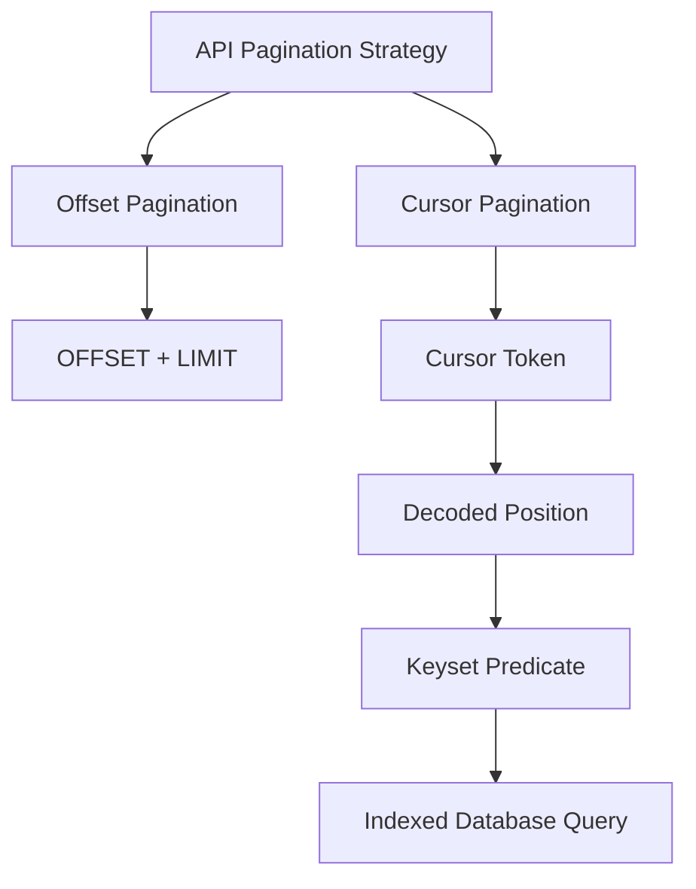
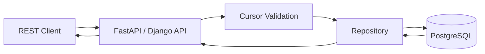
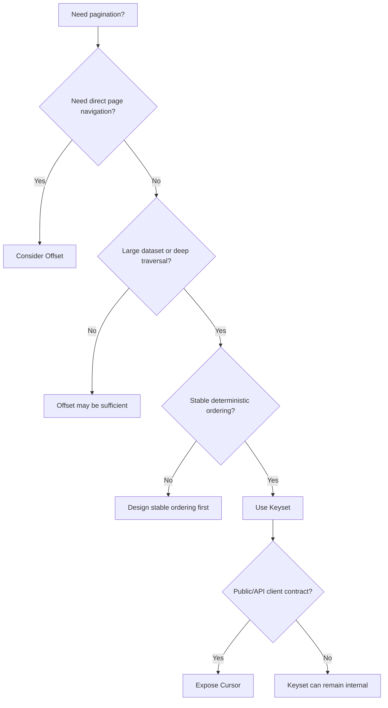

# 11- Offset vs Keyset vs Cursor

## Overview

Pagination controls how a backend returns a large result set in bounded chunks. The three terms **offset pagination**, **keyset pagination**, and **cursor pagination** are often used interchangeably, but they describe different aspects of the design.

- **Offset pagination** identifies a position by the number of rows to skip.
- **Keyset pagination** identifies a position using values from the ordered columns.
- **Cursor pagination** exposes a position token through an API, commonly backed by keyset pagination.

The distinction matters because pagination affects database performance, API semantics, consistency under concurrent writes, index design, and client behavior.

For a production backend, the choice should be driven by the access pattern:

| Requirement | Typical choice |
|---|---|
| Jump directly to page 20 | Offset |
| Traditional admin UI | Offset |
| Infinite scrolling | Cursor + keyset |
| Large activity feed | Cursor + keyset |
| Deep traversal through millions of rows | Keyset |
| Public REST API with opaque pagination tokens | Cursor + keyset |
| Stable sequential traversal | Keyset |
| Exact page-number navigation | Offset |

A useful mental model is:

```text
Offset = position by row count
Keyset = position by ordered values
Cursor = API representation of a position
```

## The Three Concepts

### Offset Pagination

Offset pagination uses:

```sql
LIMIT <page_size>
OFFSET <number_of_rows_to_skip>
```

Example:

```sql
SELECT
    id,
    created_at,
    total_amount
FROM orders
ORDER BY created_at DESC, id DESC
LIMIT 50
OFFSET 500;
```

This means:

```text
Skip 500 rows
Return the next 50 rows
```

The API commonly exposes:

```http
GET /orders?page=11&page_size=50
```

or:

```http
GET /orders?limit=50&offset=500
```

Offset pagination is simple and naturally supports page numbers.

### Keyset Pagination

Keyset pagination uses the values of the last row as the boundary for the next query.

Given:

```sql
ORDER BY created_at DESC, id DESC
```

and a previous row:

```text
created_at = 2026-08-30 10:15:00+00
id         = 1042
```

the next query can be:

```sql
SELECT
    id,
    created_at,
    total_amount
FROM orders
WHERE (created_at, id) < (:created_at, :id)
ORDER BY created_at DESC, id DESC
LIMIT 50;
```

Instead of saying:

```text
"Skip 500 rows."
```

the query says:

```text
"Return rows after this position in the ordering."
```

With an appropriate index, the database can seek into the ordered index rather than traversing a growing offset.

### Cursor Pagination

Cursor pagination is primarily an **API design pattern**.

The API exposes an opaque token:

```http
GET /orders?limit=50&cursor=eyJ2IjoxLCJpZCI6MTA0Mn0=
```

The server decodes that token into the information required to continue the query.

For example:

```json
{
  "v": 1,
  "created_at": "2026-08-30T10:15:00Z",
  "id": 1042
}
```

The database query can then use keyset semantics:

```sql
WHERE (created_at, id) < (:created_at, :id)
```

Therefore:

```text
Cursor pagination
        ↓
opaque API token
        ↓
decoded position
        ↓
keyset query
        ↓
database
```

Cursor pagination does not inherently require keyset pagination, but keyset pagination is the common database implementation because it provides efficient ordered traversal.

## How They Relate

The terminology is easiest to understand as separate layers:



A production API might therefore use:

```text
Client
  ↓
cursor
  ↓
API validates cursor
  ↓
extract created_at + id
  ↓
keyset SQL predicate
  ↓
PostgreSQL index
  ↓
next page
```

This distinction is important in interviews and system design discussions.

## Performance Characteristics

Consider a table containing 100 million orders.

An offset query:

```sql
SELECT *
FROM orders
ORDER BY created_at DESC, id DESC
LIMIT 50
OFFSET 5000000;
```

may require the database to traverse a large portion of the ordered result before returning the requested rows.

A keyset query:

```sql
SELECT *
FROM orders
WHERE (created_at, id) < (:created_at, :id)
ORDER BY created_at DESC, id DESC
LIMIT 50;
```

can use the ordering boundary to seek into an appropriate index.

The exact performance depends on:

- Database engine.
- Query predicates.
- Index design.
- Data distribution.
- Table size.
- Visibility checks.
- Selectivity.
- Query plan.
- Storage characteristics.

Do not assume that every `OFFSET` query is slow or every keyset query is automatically fast. Measure the real workload.

## Complexity at Deep Pages

The important difference becomes visible as the requested page becomes deeper.

Suppose:

```text
page_size = 50
```

Page 1:

```sql
LIMIT 50 OFFSET 0
```

Page 100,000:

```sql
LIMIT 50 OFFSET 4,999,950
```

The database still has to locate the rows associated with that offset.

With keyset pagination, the next query continues from a known ordering boundary:

```sql
WHERE (created_at, id) < (:created_at, :id)
LIMIT 50;
```

The amount of work is generally tied more closely to the requested page size and index traversal than to the absolute depth of the result set.

This is why keyset pagination is attractive for very large datasets.

## Consistency Under Concurrent Inserts

Offset pagination is vulnerable to page drift.

Suppose page 1 contains:

```text
A
B
C
D
E
```

The client requests page 2:

```text
F
G
H
I
J
```

Before page 2 is requested, a new record `X` is inserted at the beginning:

```text
X
A
B
C
D
E
F
G
H
I
J
```

If page size is 5, offset-based page 2 now starts at:

```text
E
F
G
H
I
```

`E` can appear twice across the two requests, while `J` is pushed to a later page.

Keyset pagination instead uses the position of the last row:

```text
E
```

and asks for rows after that position.

The new `X` is before the cursor and therefore does not shift the boundary.


Keyset pagination therefore provides more stable sequential traversal under inserts.

It does **not** provide a consistent snapshot across multiple HTTP requests.

## Deterministic Ordering

Keyset pagination requires deterministic ordering.

This is risky:

```sql
ORDER BY created_at DESC;
```

if many rows share the same timestamp.

Prefer:

```sql
ORDER BY created_at DESC, id DESC;
```

Now the position is represented by:

```text
(created_at, id)
```

The `id` acts as a deterministic tie-breaker.

This matters because a cursor must identify an exact position in the ordering.

For example:

```text
10:15:00 / id 100
10:15:00 / id 101
10:15:00 / id 102
```

A cursor containing only:

```text
10:15:00
```

cannot distinguish these rows.

## Comparison of the Core SQL

### Offset

```sql
SELECT
    id,
    created_at
FROM orders
ORDER BY created_at DESC, id DESC
LIMIT 50 OFFSET 500;
```

Position:

```text
500 rows skipped
```

### Keyset

```sql
SELECT
    id,
    created_at
FROM orders
WHERE (created_at, id) < (:created_at, :id)
ORDER BY created_at DESC, id DESC
LIMIT 50;
```

Position:

```text
(created_at, id)
```

### Cursor

The client might send:

```http
GET /orders?limit=50&cursor=<opaque-token>
```

The server internally translates the cursor into:

```sql
WHERE (created_at, id) < (:created_at, :id)
```

The database mechanism is keyset; the API mechanism is cursor-based.

## Index Design

Keyset pagination is highly dependent on appropriate indexes.

Suppose the query is:

```sql
SELECT
    id,
    created_at,
    total_amount
FROM orders
WHERE customer_id = :customer_id
  AND (created_at, id) < (:created_at, :id)
ORDER BY created_at DESC, id DESC
LIMIT 50;
```

A candidate PostgreSQL index is:

```sql
CREATE INDEX idx_orders_customer_created_id
ON orders (customer_id, created_at DESC, id DESC);
```

The index aligns with:

```text
customer filter
      ↓
ordering
      ↓
cursor boundary
```

For production workloads, validate the design with:

```sql
EXPLAIN (ANALYZE, BUFFERS)
SELECT
    id,
    created_at,
    total_amount
FROM orders
WHERE customer_id = 42
  AND (created_at, id) < ('2026-08-30 10:15:00+00', 1042)
ORDER BY created_at DESC, id DESC
LIMIT 51;
```

Look for:

- Unexpected sequential scans.
- Expensive sorts.
- Excessive rows examined.
- High buffer reads.
- Unexpected execution-time growth.

## Filtering and Pagination

Filtering must be applied consistently across pages.

For example:

```sql
SELECT
    id,
    created_at,
    total_amount
FROM orders
WHERE customer_id = :customer_id
  AND status = :status
  AND (created_at, id) < (:created_at, :id)
ORDER BY created_at DESC, id DESC
LIMIT 51;
```

A cursor generated for:

```text
status = paid
```

should not silently be reused for:

```text
status = cancelled
```

A robust cursor API either:

- Binds the cursor to relevant filter state.
- Validates that request filters match the cursor.
- Rejects incompatible cursors.

## API Design

### Offset API

A typical response:

```json
{
  "results": [],
  "page": 11,
  "page_size": 50,
  "total": 12450
}
```

This is useful when clients need:

- Page numbers.
- Total pages.
- Direct navigation.

### Cursor API

A typical response:

```json
{
  "results": [],
  "next_cursor": "opaque-token",
  "has_next": true
}
```

The cursor should generally be opaque.

The client should not depend on whether it contains:

```text
id
created_at
version
sort direction
filter state
```

That remains an internal API implementation detail.

## Exact Counts

Offset pagination commonly exposes:

```text
total = 12,450
```

because the page model naturally supports:

```text
page 11 of 249
```

Cursor pagination usually does not need an exact total.

Calculating:

```sql
SELECT COUNT(*)
FROM orders
WHERE ...;
```

can introduce additional database work, especially for complex filters and very large datasets.

If the product only needs:

```text
has_next
```

fetch:

```text
page_size + 1
```

rows.

For example:

```sql
LIMIT 51
```

for a requested page size of 50.

Then:

```text
51 rows → has_next = true
50 or fewer → has_next = false
```

## Random Page Access

Offset pagination supports:

```http
GET /orders?page=100
```

because the server can calculate:

```text
offset = (100 - 1) × page_size
```

Cursor pagination does not naturally support:

```text
Go directly to page 100.
```

The cursor represents a position reached through previous traversal.

This makes offset pagination a better fit for:

- Admin dashboards.
- Reporting interfaces.
- Search interfaces with numbered pages.
- Back-office tools.

Cursor pagination is a better fit for:

- Mobile feeds.
- Infinite scroll.
- Notification lists.
- Activity histories.

## Mutable Ordering Columns

Keyset pagination works best with stable ordering columns.

Prefer:

```sql
ORDER BY created_at DESC, id DESC
```

when `created_at` is immutable.

Be cautious with:

```sql
ORDER BY updated_at DESC, id DESC
```

if `updated_at` changes frequently.

A row already returned on page 1 can be updated and move to the beginning of the result set. Depending on the pagination direction and timing, this can cause the row to be observed again or produce surprising traversal behavior.

Pagination cannot solve an inherently unstable ordering definition.

## Deletes

Deleting rows generally does not break a keyset cursor.

If the cursor represents:

```text
(created_at, id)
```

the row that produced that cursor does not necessarily need to continue existing.

The next query uses its values as the boundary:

```sql
WHERE (created_at, id) < (:created_at, :id)
```

However, the number of records returned by subsequent pages can change because rows may have been deleted.

This is normal for APIs that do not promise snapshot semantics.

## Snapshot Consistency

A common misconception is:

> "Cursor pagination gives me a consistent view of the table."

It does not.

Typical API requests use separate transactions:

```text
Request 1 → Transaction 1
Request 2 → Transaction 2
Request 3 → Transaction 3
```

Therefore, rows can be:

- Inserted.
- Updated.
- Deleted.

between requests.

If strict consistency across an entire pagination session is required, the application needs a different mechanism, such as:

- A stable snapshot.
- A materialized result set.
- A versioned dataset.
- An explicit transaction strategy.

These mechanisms introduce additional storage, locking, transaction-lifetime, or operational complexity.

## Cursor Security

Cursor tokens should be treated as untrusted input.

Do not assume:

```text
Base64(cursor)
```

provides security.

Base64 is reversible encoding.

If a cursor contains sensitive information or must not be modified by clients, use:

- Cryptographic signing for integrity.
- Authenticated encryption for confidentiality and integrity.
- Server-side state when appropriate.

Also validate:

- Cursor structure.
- Cursor version.
- Data types.
- Sort mode.
- Filter compatibility.
- Expiration, if applicable.

Never interpolate decoded cursor values directly into SQL.

Use parameterized queries:

```sql
WHERE (created_at, id) < (:created_at, :id)
```

## Performance Comparison

| Concern | Offset | Keyset | Cursor + Keyset |
|---|---|---|---|
| Simple implementation | Excellent | Moderate | Moderate |
| Deep pagination | Weak | Strong | Strong |
| Random page access | Excellent | Poor | Poor |
| Infinite scrolling | Good | Excellent | Excellent |
| Large datasets | Can degrade | Strong | Strong |
| Concurrent inserts | More page drift | More stable | More stable |
| Exact page numbers | Natural | Difficult | Difficult |
| Exact totals | Natural to expose | Separate operation | Separate operation |
| Opaque API contract | Not required | Not required | Recommended |
| Index dependence | Helpful | Critical for performance | Critical for performance |

## When to Use Each

### Use Offset Pagination When

Choose offset pagination when:

- Users navigate by page number.
- The dataset is moderate.
- Deep pagination is uncommon.
- Exact page counts are important.
- The application is primarily an administrative interface.
- Implementation simplicity has significant value.

Example:

```http
GET /admin/orders?page=4&page_size=50
```

### Use Keyset Pagination When

Choose keyset pagination when:

- The dataset is large.
- Clients traverse sequentially.
- Deep pagination is expected.
- Stable ordering is available.
- Database performance matters at scale.
- You control the database query directly.

Example:

```sql
WHERE (created_at, id) < (:created_at, :id)
ORDER BY created_at DESC, id DESC
LIMIT 50;
```

### Use Cursor Pagination When

Choose cursor pagination when:

- The API should hide pagination internals.
- Infinite scrolling is used.
- Clients should request "next" rather than "page 500".
- The underlying result set is large.
- Stable sequential traversal is required.
- The API may evolve its pagination implementation.

Example:

```http
GET /feed?limit=50&cursor=<opaque-token>
```

The common production combination is:

```text
Cursor API
    +
Keyset database pagination
```

## Practical Backend Architecture

A typical service might look like:



The responsibilities should remain separated:

| Layer | Responsibility |
|---|---|
| API | Parse request and validate page size |
| Cursor layer | Encode/decode and validate cursor |
| Repository | Build keyset query |
| PostgreSQL | Execute indexed query |
| Serializer | Produce stable API response |

A cursor should not force the repository to understand Base64, HTTP query parameters, or API-specific serialization.

## Example Production Query

Consider an order history endpoint:

```http
GET /customers/42/orders?limit=50&cursor=<token>
```

The decoded cursor contains:

```text
created_at = 2026-08-30T10:15:00Z
id = 1042
```

The repository executes:

```sql
SELECT
    id,
    created_at,
    total_amount,
    status
FROM orders
WHERE customer_id = :customer_id
  AND (created_at, id) < (:created_at, :id)
ORDER BY created_at DESC, id DESC
LIMIT 51;
```

With:

```sql
CREATE INDEX idx_orders_customer_created_id
ON orders (customer_id, created_at DESC, id DESC);
```

The service returns:

```json
{
  "results": [
    {
      "id": 1041,
      "created_at": "2026-08-30T10:14:58Z",
      "total_amount": "149.00",
      "status": "paid"
    }
  ],
  "next_cursor": "<opaque-token>",
  "has_next": true
}
```

This design keeps:

```text
API contract
    ↓
opaque cursor
    ↓
keyset boundary
    ↓
database index
```

loosely coupled.

## Common Mistakes

| Mistake | Why it happens | Better approach |
|---|---|---|
| Treating cursor and keyset as synonyms | Terminology is often mixed | Distinguish API cursor from DB keyset |
| Using offset for millions of rows | Easy to implement | Use keyset/cursor for deep sequential traversal |
| Ordering only by timestamp | Timestamps are often duplicated | Add a unique tie-breaker |
| Assuming cursor means snapshot consistency | Cursor feels like a stable bookmark | Define consistency semantics explicitly |
| Returning raw database values as cursor | Simplifies implementation | Make cursor opaque |
| Assuming Base64 is encryption | Encoding is mistaken for security | Sign or encrypt when necessary |
| Reusing cursor with different filters | Cursor is treated as a generic token | Bind cursor to query state |
| Allowing unlimited `limit` | Client controls workload | Enforce a maximum |
| Updating ordering columns frequently | Business logic changes timestamps | Prefer stable ordering |
| Adding indexes without measuring | Keyset requires indexes | Validate with `EXPLAIN ANALYZE` |
| Running `COUNT(*)` on every request | Page metadata is considered mandatory | Only count when product requirements justify it |

## Interview Traps

### "Cursor Pagination and Keyset Pagination Are the Same"

Not exactly.

A precise answer is:

> Keyset pagination is a database technique for continuing from ordered key values. Cursor pagination is an API technique for representing that position, commonly using keyset pagination internally.

### "Offset Pagination Is Always Slow"

Not necessarily.

Offset pagination can be perfectly reasonable for small or moderate datasets and shallow pages.

The concern is that the amount of work can grow with the offset, making deep pagination increasingly expensive.

### "Cursor Pagination Prevents Duplicates"

It reduces page-boundary drift caused by inserts, but it does not guarantee exactly-once observation.

Updates, deletes, concurrent requests, unstable ordering, and changing filters can still affect what clients observe.

### "A Cursor Must Contain the Primary Key"

Not necessarily.

It must contain enough information to identify the position in the chosen ordering.

For:

```sql
ORDER BY created_at DESC, id DESC
```

the cursor generally needs both:

```text
created_at
id
```

### "Keyset Pagination Means No OFFSET"

Usually, but the defining characteristic is not merely the absence of `OFFSET`.

The important property is that the next page is selected using an ordered boundary:

```sql
WHERE key > cursor
```

or:

```sql
WHERE key < cursor
```

depending on ordering.

## Operational Considerations

### Monitoring

For high-volume pagination endpoints, monitor:

- P50/P95/P99 request latency.
- Database query latency.
- Rows examined versus returned.
- Sequential scan frequency.
- Sort operations.
- Database CPU.
- Database I/O.
- Connection pool utilization.
- Invalid cursor rate.
- Page-size distribution.

A useful signal is whether query latency remains approximately stable as users traverse deeper into the dataset.

### Scalability

For large production datasets:

- Prefer bounded page sizes.
- Align indexes with filters and ordering.
- Use keyset pagination for deep sequential access.
- Avoid exact counts unless required.
- Avoid returning excessively large records.
- Test with production-scale data volumes.
- Inspect query plans rather than relying on assumptions.

### Reliability

Cursor APIs should handle:

- Malformed cursors.
- Expired cursors if expiration is supported.
- Unknown cursor versions.
- Invalid sort modes.
- Filter mismatches.
- Deleted records.
- Schema migrations.
- Changes to pagination implementation.

A cursor is part of an API contract and should be treated as untrusted external input.

## Decision Framework

Use this sequence when designing a new endpoint:



A practical default for a high-scale feed is:

```text
Stable ordering
    ↓
Composite index
    ↓
Keyset query
    ↓
Opaque cursor
    ↓
Bounded page size
    ↓
has_next + next_cursor
```

## Key Takeaways

- **Offset pagination** represents position by row count and is the natural choice when page numbers and random page access matter.
- **Keyset pagination** represents position using ordered column values and is generally better for deep, sequential traversal over large datasets.
- **Cursor pagination** is an API pattern that commonly exposes keyset state as an opaque token; cursor and keyset describe different layers of the design.
- Reliable keyset/cursor pagination requires deterministic ordering, appropriate composite indexes, bounded page sizes, and validated cursor state.
- Pagination strategy is a product and database design decision: optimize for page navigation, dataset size, consistency requirements, and access patterns rather than choosing one technique universally.