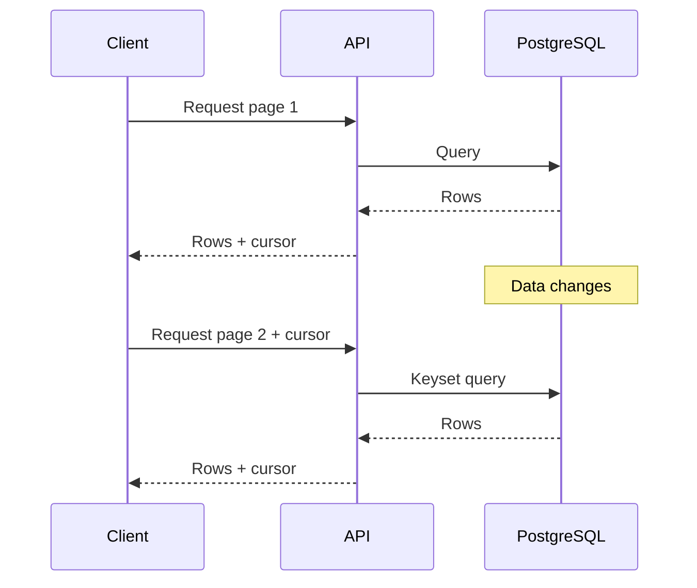
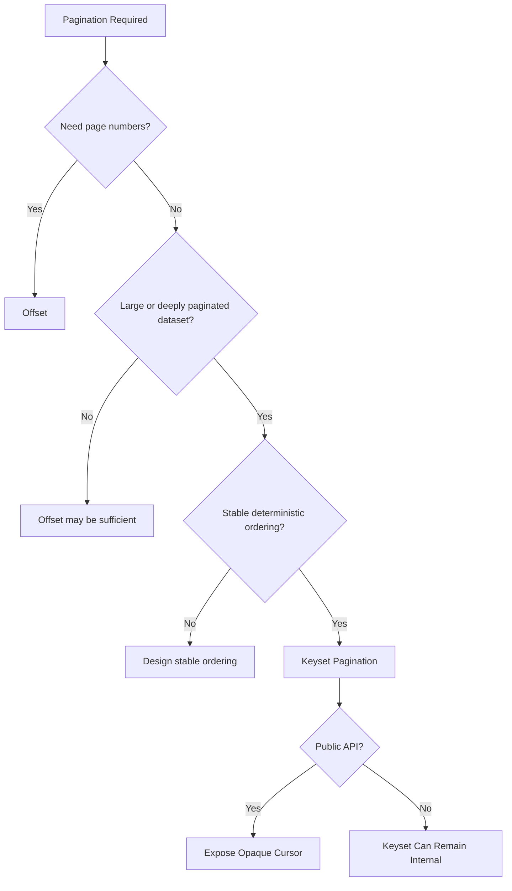

# 12- Pagination Rules and Tradeoffs

## Overview

Pagination limits the amount of data returned by a query or API request. It protects database resources, controls response size, and gives clients a predictable way to traverse large result sets.

Pagination is not merely a UI concern. The strategy affects:

- Database query cost.
- Index design.
- API semantics.
- Behavior under concurrent inserts and deletes.
- Latency at deep pages.
- Client complexity.
- Consistency guarantees.
- Ability to navigate directly to a position.

The three major approaches are:

| Strategy | Position represented by | Best suited for |
|---|---|---|
| Offset | Number of rows skipped | Page-number UIs and moderate datasets |
| Keyset | Values of ordered columns | Large datasets and sequential traversal |
| Cursor | Opaque representation of a position | Public APIs and infinite scrolling |

A common production design is:

```text
Cursor API
    ↓
Opaque cursor
    ↓
Decoded ordering values
    ↓
Keyset SQL predicate
    ↓
Composite database index
    ↓
Bounded result set
```

The correct strategy depends on the access pattern rather than on a universal rule that one pagination mechanism is always superior.

## Pagination Requirements

Before choosing a pagination strategy, establish what the client actually needs.

Important questions include:

- Does the client need page numbers?
- Does it need an exact total count?
- Can users jump directly to page 100?
- Is the dataset potentially millions or billions of rows?
- Is traversal sequential?
- Can records be inserted while pagination is occurring?
- Can records be updated or deleted?
- Does ordering remain stable?
- Is the endpoint public?
- Is the API consumed by browsers, mobile applications, or other services?
- Is low and predictable latency more important than implementation simplicity?

These requirements often determine the pagination strategy before the SQL is written.

## Offset Pagination Rules

Offset pagination uses:

```sql
LIMIT 50 OFFSET 500;
```

The offset identifies the position by the number of rows preceding the requested page.

For page-based APIs:

```text
offset = (page - 1) × page_size
```

Example:

```http
GET /orders?page=11&page_size=50
```

becomes approximately:

```sql
SELECT
    id,
    created_at,
    total_amount
FROM orders
ORDER BY created_at DESC, id DESC
LIMIT 50
OFFSET 500;
```

### When Offset Is Appropriate

Offset pagination is a good choice when:

- Page numbers are a core product requirement.
- Users need random page access.
- The dataset is moderate.
- Deep pages are uncommon.
- Exact totals are useful.
- The endpoint is primarily an internal or administrative interface.

Examples include:

- Admin dashboards.
- Back-office order management.
- Reporting interfaces.
- Search results where page navigation is expected.

### Deep Offset Performance

The main concern is deep pagination.

```sql
LIMIT 50 OFFSET 5000000;
```

The database still needs to locate the ordered result corresponding to that offset. An index can make this substantially better, but it does not fundamentally change the fact that the database must advance through the ordered result to reach the requested position.

The cost therefore tends to increase with the offset.

Do not assume:

```text
OFFSET = always slow
```

or:

```text
INDEX = OFFSET becomes constant time
```

Instead, inspect the actual execution plan and workload.

```sql
EXPLAIN (ANALYZE, BUFFERS)
SELECT
    id,
    created_at
FROM orders
ORDER BY created_at DESC, id DESC
LIMIT 50
OFFSET 500000;
```

## Keyset Pagination Rules

Keyset pagination identifies the next position using values from the current page's ordering.

Given:

```sql
ORDER BY created_at DESC, id DESC
```

the next query can use:

```sql
WHERE (created_at, id) < (:created_at, :id)
```

Example:

```sql
SELECT
    id,
    created_at,
    total_amount
FROM orders
WHERE (created_at, id) < (:created_at, :id)
ORDER BY created_at DESC, id DESC
LIMIT 50;
```

If the last row returned was:

```text
created_at = 2026-08-30 10:15:00+00
id         = 1042
```

then those values become the boundary for the next request.

The database is no longer asked to skip an arbitrary number of preceding rows.

### Why Keyset Scales Better

With an appropriate index, the database can seek into the relevant region of the ordered index.

For example:

```sql
CREATE INDEX idx_orders_created_id
ON orders (created_at DESC, id DESC);
```

The conceptual difference is:

```text
Offset:

start → row 1 → row 2 → ... → row 5,000,000 → requested rows


Keyset:

index → boundary → requested rows
```

The exact execution strategy is database-engine dependent, but keyset pagination generally avoids work proportional to the absolute page depth.

### Stable Ordering Is Mandatory

This is insufficient for reliable keyset pagination:

```sql
ORDER BY created_at DESC;
```

because multiple rows may have identical timestamps.

Use a deterministic tie-breaker:

```sql
ORDER BY created_at DESC, id DESC;
```

The cursor position is then:

```text
(created_at, id)
```

The unique `id` provides deterministic ordering among rows sharing the same timestamp.

## Cursor Pagination Rules

Cursor pagination exposes a position through an API token.

Example:

```http
GET /orders?limit=50&cursor=<opaque-token>
```

The cursor may internally represent:

```json
{
  "version": 1,
  "created_at": "2026-08-30T10:15:00Z",
  "id": 1042
}
```

The client should generally not depend on this internal structure.

The server can translate it into:

```sql
WHERE (created_at, id) < (:created_at, :id)
ORDER BY created_at DESC, id DESC
LIMIT 51;
```

The distinction is important:

```text
Keyset = database pagination mechanism
Cursor = API pagination representation
```

Cursor pagination commonly uses keyset pagination internally, but the concepts belong to different layers.

## Page Size Rules

Never allow clients to request an unlimited page size.

Risky:

```http
GET /orders?limit=1000000
```

Prefer a bounded contract:

```text
default: 50
maximum: 100
```

For example:

```python
page_size = min(requested_limit, 100)
```

The exact maximum should be based on:

- Row width.
- Query complexity.
- Database capacity.
- API latency requirements.
- Network response size.
- Serialization cost.

A page-size limit protects more than the database. It also limits:

- Application memory.
- CPU used during serialization.
- Network bandwidth.
- Reverse-proxy buffering.
- Client memory usage.

## Fetch One Extra Row

When an API only needs to know whether another page exists, avoid an expensive total count.

For a requested page size of 50:

```sql
LIMIT 51;
```

Then:

```text
51 rows → has_next = true
50 or fewer → has_next = false
```

The API returns only the first 50 records.

Example:

```json
{
  "results": [],
  "has_next": true,
  "next_cursor": "<opaque-token>"
}
```

This is usually preferable to running:

```sql
SELECT COUNT(*)
FROM orders
WHERE ...;
```

on every request when the exact count has no product value.

## Exact Counts Are a Product Decision

Offset-based interfaces often expose:

```json
{
  "page": 11,
  "page_size": 50,
  "total": 12450
}
```

Cursor-based interfaces commonly expose:

```json
{
  "results": [],
  "has_next": true,
  "next_cursor": "<opaque-token>"
}
```

Exact counts can become expensive for large or complex datasets.

Do not calculate:

```text
total pages
```

merely because it is technically possible.

Ask whether the product actually requires:

- Exact total rows.
- Exact total pages.
- Progress through the complete dataset.

If not, `has_next` is often sufficient.

## Filtering Rules

Filters must remain consistent across pages.

Consider:

```sql
SELECT
    id,
    created_at,
    total_amount
FROM orders
WHERE customer_id = :customer_id
  AND status = :status
  AND (created_at, id) < (:created_at, :id)
ORDER BY created_at DESC, id DESC
LIMIT 51;
```

The cursor was generated for a particular result set.

A cursor generated for:

```text
customer_id = 42
status = paid
```

should not silently be used with:

```text
customer_id = 42
status = cancelled
```

A production API should either:

- Encode relevant filter state into the cursor.
- Validate that request filters match the cursor.
- Reject incompatible cursor requests.

Otherwise, clients can receive missing, duplicated, or unexpected records.

## Ordering Rules

Pagination and ordering cannot be designed independently.

A production pagination order should be:

- Deterministic.
- Explicit.
- Stable for the expected traversal period.
- Supported by an appropriate index.

Prefer:

```sql
ORDER BY created_at DESC, id DESC;
```

over:

```sql
ORDER BY created_at DESC;
```

when timestamps are not unique.

Avoid relying on implicit database row order:

```sql
SELECT *
FROM orders
LIMIT 50;
```

Without an `ORDER BY`, SQL does not promise a stable ordering.

## Mutable Ordering Columns

Ordering by an immutable creation timestamp is generally easier to reason about:

```sql
ORDER BY created_at DESC, id DESC
```

Be more careful with:

```sql
ORDER BY updated_at DESC, id DESC
```

if `updated_at` changes frequently.

A record returned on an earlier page can be updated and move to a different position before the next request.

This can result in:

- A record appearing again.
- A record being skipped during traversal.
- Different clients observing different sequences.

Pagination cannot compensate for an unstable ordering definition.

## Concurrent Inserts

Offset pagination can experience page drift.

Suppose page size is 5:

```text
Page 1:
A B C D E

Page 2:
F G H I J
```

If a new row `X` is inserted at the beginning:

```text
X A B C D E F G H I J
```

the next offset page can become:

```text
E F G H I
```

`E` may now be observed twice.

Keyset pagination instead uses the last ordering boundary from page 1:

```text
E
```

and requests rows after that boundary.

The newly inserted `X` is outside the traversal boundary.

This makes keyset pagination more stable for sequential feeds.

However, it does **not** provide snapshot consistency across independent HTTP requests.

## Deletes and Updates

Deletes can change the number of records remaining in later pages.

For keyset pagination, deleting the row that produced the cursor is generally not a problem because the cursor contains its ordering values rather than requiring the row itself to remain present.

Updates are more complicated.

If an ordering column changes:

```text
created_at → stable
updated_at → mutable
```

then the record can move relative to the cursor boundary.

For high-volume feeds, prefer stable ordering columns whenever the business semantics allow it.

## Snapshot Consistency

Cursor pagination does not mean:

> Every page represents the exact same database snapshot.

A typical API performs independent transactions:



Rows can be inserted, updated, or deleted between requests.

If the application requires a strict snapshot across an entire traversal, ordinary HTTP pagination is insufficient. A stronger design may require:

- A database snapshot.
- A materialized result set.
- A versioned dataset.
- A temporary server-side result set.

These approaches introduce additional storage and operational complexity.

## Composite Index Rules

Keyset pagination often requires a composite index matching the filtering and ordering pattern.

Suppose the query is:

```sql
SELECT
    id,
    created_at,
    total_amount
FROM orders
WHERE customer_id = :customer_id
  AND (created_at, id) < (:created_at, :id)
ORDER BY created_at DESC, id DESC
LIMIT 51;
```

A useful index is:

```sql
CREATE INDEX idx_orders_customer_created_id
ON orders (customer_id, created_at DESC, id DESC);
```

The index reflects:

```text
WHERE equality
    ↓
pagination boundary
    ↓
ORDER BY
```

The correct index depends on the complete workload, not merely the pagination clause.

Validate it with:

```sql
EXPLAIN (ANALYZE, BUFFERS)
SELECT
    id,
    created_at,
    total_amount
FROM orders
WHERE customer_id = 42
  AND (created_at, id) < ('2026-08-30 10:15:00+00', 1042)
ORDER BY created_at DESC, id DESC
LIMIT 51;
```

Look for:

- Sequential scans where an index should be useful.
- Expensive sorts.
- Large row counts before `LIMIT`.
- High buffer reads.
- Latency growth as the dataset grows.

## API Contract Rules

A robust pagination API should define:

- Maximum page size.
- Default page size.
- Ordering semantics.
- Cursor format behavior.
- Invalid cursor behavior.
- Filter compatibility.
- Whether cursors expire.
- Whether results are snapshot-consistent.
- Whether duplicate observations are possible.
- Whether exact totals are available.

A cursor should normally be opaque:

```http
GET /orders?limit=50&cursor=eyJ2IjoxLCJpZCI6MTA0Mn0=
```

The client should only know:

```text
Give me the next page using this token.
```

It should not need to know:

```text
The token contains created_at and id.
```

This allows the backend to evolve the internal pagination mechanism later.

## Cursor Security

A cursor is untrusted client input.

Base64 is encoding, not encryption:

```text
Base64(cursor) ≠ secure cursor
```

If cursor contents must not be modified, use an integrity mechanism such as a cryptographic signature or authenticated encryption where confidentiality is also required.

Validate:

- Cursor structure.
- Version.
- Data types.
- Sort direction.
- Filter state.
- Expiration, if applicable.

Always use parameterized SQL:

```sql
WHERE (created_at, id) < (:created_at, :id)
```

Never construct SQL by concatenating decoded cursor values.

## Backward Pagination

Forward-only pagination is significantly simpler.

For:

```sql
ORDER BY created_at DESC, id DESC
```

the next page uses:

```sql
WHERE (created_at, id) < (:created_at, :id)
```

Supporting both forward and backward traversal requires careful handling of:

- Comparison direction.
- Ordering direction.
- Cursor semantics.
- First/last page behavior.
- Index utilization.
- Response ordering.

Do not add bidirectional pagination unless the product actually needs it.

## Offset vs Keyset

| Concern | Offset | Keyset |
|---|---|---|
| Implementation complexity | Low | Moderate |
| Page numbers | Excellent | Poor |
| Random page access | Excellent | Poor |
| Deep pages | Can become expensive | Generally efficient |
| Sequential traversal | Good | Excellent |
| Large datasets | Less suitable | Strong fit |
| Concurrent inserts | Page drift possible | More stable |
| Exact totals | Easy to expose | Separate concern |
| Stable ordering required | Recommended | Required |
| Composite index | Helpful | Often critical |
| Infinite scrolling | Acceptable | Excellent |

## Keyset vs Cursor

These should not be treated as competing database algorithms.

| Concept | Layer | Purpose |
|---|---|---|
| Keyset | Database/query layer | Continue from ordered column values |
| Cursor | API layer | Represent a pagination position to the client |
| Cursor + keyset | API + database | Common production architecture |

For example:

```text
HTTP:
GET /feed?cursor=<token>

Application:
decode cursor

SQL:
WHERE (created_at, id) < (:created_at, :id)
ORDER BY created_at DESC, id DESC
LIMIT 51
```

This is a cursor-based API implemented using keyset pagination.

## Framework Integration

### Django

Django's `Paginator` naturally maps to offset-style pagination.

For example:

```python
from django.core.paginator import Paginator

queryset = Order.objects.order_by("-created_at", "-id")

paginator = Paginator(queryset, 50)
page = paginator.get_page(page_number)
```

This is convenient for admin-style interfaces, but it should not automatically be used for high-scale feed endpoints.

For large sequential APIs, construct the underlying keyset query instead.

### FastAPI

A cursor-based FastAPI endpoint can conceptually expose:

```python
from fastapi import FastAPI, Query

app = FastAPI()


@app.get("/orders")
def list_orders(
    limit: int = Query(default=50, ge=1, le=100),
    cursor: str | None = None,
):
    ...
```

The important design decision is not FastAPI itself. The repository should translate the validated cursor into a parameterized keyset query.

## Pagination and Caching

Pagination interacts with caching differently depending on the strategy.

Offset requests are naturally represented as:

```text
/orders?page=10
```

Cursor requests produce:

```text
/orders?cursor=<opaque-token>
```

Cursor tokens can have high cardinality, reducing cache reuse.

For frequently requested public feeds, consider:

- CDN caching where appropriate.
- Short cache lifetimes.
- Stable cache keys.
- ETags.
- Conditional requests.

Do not introduce caching merely because pagination exists. Evaluate the data's volatility and access distribution.

## Pagination and Database Load

Pagination reduces the number of rows returned per request, but it does not automatically make the query cheap.

A query such as:

```sql
SELECT *
FROM orders
WHERE customer_id = :customer_id
ORDER BY expensive_expression
LIMIT 50;
```

can still be expensive.

The database may need to:

- Filter many rows.
- Compute expressions.
- Sort records.
- Perform visibility checks.
- Fetch table pages.
- Materialize intermediate results.

Senior-level pagination design therefore considers the complete query plan:

```text
Pagination
    +
Filtering
    +
Ordering
    +
Index design
    +
Row width
    +
Concurrency
```

## Production Rules

For high-scale APIs:

### Bound the Page Size

Use a conservative maximum.

```text
default = 50
maximum = 100
```

Adjust based on measured workload.

### Make Ordering Explicit

Always define:

```sql
ORDER BY ...
```

and make it deterministic.

### Prefer Stable Ordering

For sequential traversal, immutable fields such as:

```text
created_at + unique_id
```

are usually easier to reason about than frequently changing fields.

### Align Indexes

Design indexes around:

```text
filter predicates
+
ordering columns
+
pagination boundary
```

### Avoid Unnecessary Counts

If the client only needs:

```text
has_next
```

fetch one extra row instead of calculating an exact total.

### Validate Cursors

Treat cursors as untrusted external input.

### Test at Production Scale

A query that performs well against:

```text
10,000 rows
```

may behave very differently against:

```text
100,000,000 rows
```

Benchmark realistic:

- Row counts.
- Data distributions.
- Concurrent traffic.
- Page depths.
- Filter combinations.

## Common Pagination Mistakes

| Mistake | Problem | Better approach |
|---|---|---|
| Unlimited `limit` | Large responses can overload services | Enforce a maximum |
| Using offset for deep feeds | Query work can grow with page depth | Use keyset/cursor |
| No `ORDER BY` | Result order is not guaranteed | Define explicit ordering |
| Ordering only by timestamp | Duplicate timestamps create ambiguity | Add a unique tie-breaker |
| Counting every request | Adds unnecessary database work | Use `has_next` when possible |
| Trusting cursor contents | Clients can modify input | Validate and authenticate cursors |
| Encoding sensitive state with Base64 | Base64 provides no confidentiality | Encrypt when confidentiality is required |
| Reusing cursors across filters | Cursor may represent another result set | Bind cursor to query state |
| Using mutable ordering fields | Rows can move between pages | Prefer stable ordering |
| Assuming cursor means snapshot | Independent requests see changing data | Define consistency semantics |
| Adding indexes blindly | More indexes increase write/storage cost | Validate query plans |
| Returning huge rows | Serialization and network costs increase | Select only required columns |

## Interview Traps

### "Which Is Faster: Offset or Keyset?"

The correct answer is workload-dependent.

Keyset generally scales better for deep sequential traversal because it avoids scanning through an increasingly large offset.

Offset can still be the better engineering choice for small datasets or interfaces that require random page navigation.

### "Does Keyset Pagination Guarantee No Duplicates?"

No.

It provides a more stable traversal boundary, particularly under inserts, but concurrent updates, deletes, mutable ordering columns, and changing filters can still affect observations.

### "Can Keyset Pagination Jump to Page 100?"

Not naturally.

Keyset pagination is designed for:

```text
current position → next position
```

rather than:

```text
page number → arbitrary position
```

### "Does Cursor Pagination Mean Keyset Pagination?"

Not necessarily.

Cursor describes how the API represents the position. Keyset describes how the database query continues from that position.

The two are commonly combined.

### "Why Add ID to the Cursor?"

Because the primary ordering column may not be unique.

For:

```sql
ORDER BY created_at DESC, id DESC
```

both values are required to identify the position deterministically.

## Decision Matrix

| Requirement | Recommended approach |
|---|---|
| Admin table with page numbers | Offset |
| Small dataset | Offset |
| Need direct page 20 navigation | Offset |
| Infinite scroll | Cursor + keyset |
| Large activity feed | Cursor + keyset |
| Millions of records | Keyset/cursor |
| Sequential export traversal | Keyset |
| Public REST API | Cursor + keyset |
| Exact page count required | Offset |
| Exact total not required | Keyset/cursor |
| Highly mutable ordering | Reconsider ordering semantics first |

A useful default decision process is:



## Key Takeaways

- Choose pagination based on product requirements and access patterns: **offset** for page navigation, **keyset** for efficient sequential traversal, and **cursor** for a stable API representation of a position.
- Keyset pagination requires deterministic ordering, usually combining a stable sort column with a unique tie-breaker such as `id`.
- Bound page sizes, avoid unnecessary exact counts, validate cursors, and align composite indexes with filtering and ordering requirements.
- Cursor and keyset pagination improve traversal stability under concurrent changes but do **not** provide snapshot consistency across independent API requests.
- Validate pagination performance with production-scale data and `EXPLAIN (ANALYZE, BUFFERS)` rather than relying on theoretical performance assumptions.