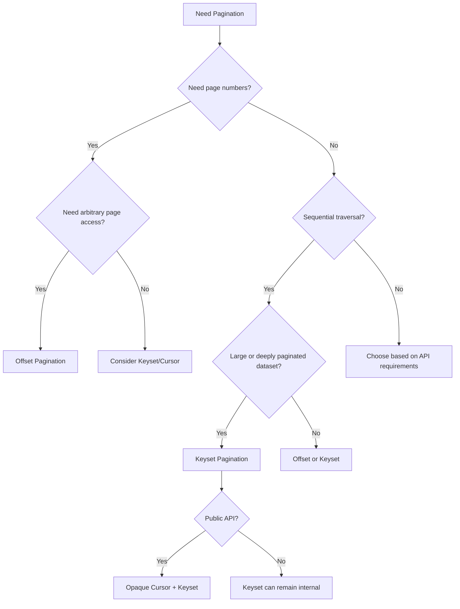

# 13- When to Choose Each Pagination Strategy

## Overview

Pagination strategy should be selected from the access pattern, consistency requirements, dataset size, and API contract—not from a blanket rule that one technique is always faster.

The primary choices are:

- **Offset pagination** — position is represented by a numeric offset.
- **Keyset pagination** — position is represented by values from the ordered columns.
- **Cursor pagination** — the API exposes an opaque token representing the continuation position, commonly backed by keyset pagination.

A useful mental model is:

```text
Product requirements
        ↓
Access pattern
        ↓
Ordering + consistency requirements
        ↓
Pagination strategy
        ↓
Index design
        ↓
API contract
        ↓
Load testing and query-plan validation
```

The wrong pagination strategy can produce slow database queries, inconsistent results under concurrent writes, difficult APIs, or unnecessary infrastructure complexity.

## The Three Strategies

| Strategy | Position | Typical API | Primary strength | Primary weakness |
|---|---|---|---|---|
| Offset | Number of rows skipped | `?page=10` | Random page access | Deep offsets can become expensive |
| Keyset | Ordered column values | Internal SQL mechanism | Efficient sequential traversal | Poor fit for arbitrary page jumps |
| Cursor | Opaque continuation token | `?cursor=...` | Clean public API contract | More implementation complexity |

Keyset and cursor pagination are often combined:

```text
Client
  │
  │ cursor=eyJ2IjoxLCJpZCI6MTA0Mn0=
  ▼
API
  │
  │ decode + validate
  ▼
Keyset predicate
  │
  │ WHERE (created_at, id) < (...)
  ▼
Database
```

The important distinction is that **keyset is primarily a query technique**, while **cursor is primarily an API representation of position**.

## Decision Framework

Start with the product requirement rather than the SQL syntax.



A practical decision sequence is:

1. Determine whether page numbers are a real product requirement.
2. Determine whether clients traverse sequentially or jump arbitrarily.
3. Estimate the largest realistic dataset and page depth.
4. Define ordering and consistency requirements.
5. Check whether exact totals are required.
6. Design indexes for the resulting query.
7. Benchmark the implementation with realistic data.

## Choose Offset Pagination When Page Numbers Matter

Offset pagination is the natural choice when the user experience is explicitly page-based.

Example:

```http
GET /admin/orders?page=12&page_size=50
```

The database query can be:

```sql
SELECT
    id,
    customer_id,
    status,
    created_at,
    total_amount
FROM orders
ORDER BY created_at DESC, id DESC
LIMIT 50
OFFSET 550;
```

### Good Use Cases

Offset is particularly appropriate for:

- Administrative dashboards.
- Back-office applications.
- Search interfaces with page numbers.
- Reporting tools.
- Moderate-sized datasets.
- Interfaces where users need to jump directly to a page.

For example:

```text
Page 1 → Page 2 → Page 3 → ... → Page 100
```

Users may reasonably expect to enter:

```text
Page 50
```

Keyset pagination does not naturally provide this capability.

### Why Offset Is Attractive

Offset pagination has a simple contract:

```text
page
page_size
```

It is also straightforward to implement in frameworks such as Django.

```python
from django.core.paginator import Paginator

queryset = Order.objects.order_by("-created_at", "-id")

paginator = Paginator(queryset, 50)
page = paginator.get_page(page_number)
```

The simplicity can be valuable when the dataset and traffic do not justify a more complex design.

### When Offset Becomes a Problem

Deep offsets can require the database to advance through many preceding rows.

```sql
LIMIT 50 OFFSET 5000000;
```

An index may substantially improve the query, but it does not make arbitrary deep offset navigation equivalent to a direct index seek.

Validate the actual workload:

```sql
EXPLAIN (ANALYZE, BUFFERS)
SELECT
    id,
    created_at
FROM orders
ORDER BY created_at DESC, id DESC
LIMIT 50
OFFSET 5000000;
```

The correct conclusion is not:

> OFFSET is always slow.

The correct conclusion is:

> Offset cost can increase with page depth, so deep-page workloads must be measured.

## Choose Keyset Pagination for Large Sequential Datasets

Keyset pagination is usually the stronger choice when clients move through a large ordered dataset sequentially.

Suppose the ordering is:

```sql
ORDER BY created_at DESC, id DESC
```

The next request can use the previous page's final ordering values:

```sql
SELECT
    id,
    created_at,
    total_amount
FROM orders
WHERE (created_at, id) < (:created_at, :id)
ORDER BY created_at DESC, id DESC
LIMIT 50;
```

An appropriate index might be:

```sql
CREATE INDEX idx_orders_created_id
ON orders (created_at DESC, id DESC);
```

The query can seek from the pagination boundary rather than conceptually skipping every preceding row.

### Good Use Cases

Keyset is particularly suitable for:

- Activity feeds.
- Timeline APIs.
- Infinite scrolling.
- Large order histories.
- Audit logs.
- Event streams.
- High-volume APIs.
- Sequential data exports.

Example:

```text
GET /events
GET /events?after=<position>
GET /events?after=<position>
GET /events?after=<position>
```

The client continually moves forward rather than jumping to arbitrary pages.

### Why Keyset Handles Deep Traversal Better

Compare the conceptual work.

Offset:

```text
page 1
  ↓
skip 50
  ↓
skip 100
  ↓
skip 150
  ↓
...
skip millions
  ↓
return next 50
```

Keyset:

```text
index
  ↓
seek to boundary
  ↓
return next 50
```

The exact execution depends on the database and query plan, but keyset avoids making the absolute page depth the primary pagination input.

## Choose Cursor Pagination for Public APIs

Cursor pagination is often the best external API contract when:

- Clients do not need page numbers.
- Results are traversed sequentially.
- The dataset is large.
- The API should hide database implementation details.
- The ordering mechanism may evolve over time.

Example:

```http
GET /orders?limit=50
```

Response:

```json
{
  "results": [
    {
      "id": 1042,
      "created_at": "2026-08-30T10:15:00Z"
    }
  ],
  "next_cursor": "eyJ2IjoxLCJjcmVhdGVkX2F0IjoiMjAyNi0wOC0zMCJ9",
  "has_next": true
}
```

The client sends:

```http
GET /orders?limit=50&cursor=eyJ2IjoxLCJjcmVhdGVkX2F0IjoiMjAyNi0wOC0zMCJ9
```

Internally, the server may decode the cursor into:

```text
created_at
id
sort direction
cursor version
```

and execute a keyset query.

## Cursor Does Not Replace Keyset

This distinction is important in senior-level system design discussions.

```text
Cursor pagination
    ↓
API representation

Keyset pagination
    ↓
Database traversal technique
```

A common production implementation is:

```text
HTTP cursor
    ↓
Decode and validate
    ↓
(created_at, id)
    ↓
Keyset WHERE predicate
    ↓
Composite index
    ↓
LIMIT N + 1
```

Therefore:

```text
Cursor + Keyset
```

is frequently the preferred architecture for large public APIs.

## Choose Offset When Exact Totals Are Important

Offset pagination often pairs naturally with metadata such as:

```json
{
  "page": 10,
  "page_size": 50,
  "total": 12543,
  "total_pages": 251
}
```

However, obtaining an exact total can itself be expensive.

```sql
SELECT COUNT(*)
FROM orders
WHERE status = 'paid';
```

For large or complex datasets, running an exact count on every API request may create unnecessary database load.

If the product only needs:

```json
{
  "has_next": true
}
```

then cursor/keyset pagination can avoid the count entirely by fetching one extra row.

## Choose Keyset When Deep Pages Are Expected

Suppose an API has:

```text
100 million orders
```

and clients commonly traverse thousands of pages.

Offset:

```sql
LIMIT 50 OFFSET 500000;
```

becomes increasingly unattractive.

Keyset:

```sql
WHERE (created_at, id) < (:created_at, :id)
ORDER BY created_at DESC, id DESC
LIMIT 50;
```

maintains a continuation boundary based on actual data values.

This is one of the strongest reasons to choose keyset pagination.

## Choose Keyset When Concurrent Inserts Matter

Consider a feed ordered by newest records.

Initial page:

```text
A B C D E
```

Next page:

```text
F G H I J
```

If a new record `X` is inserted at the beginning between requests, offset pagination can shift the boundary.

```text
X A B C D E F G H I J
```

A subsequent offset request may observe:

```text
E F G H I
```

causing a duplicate observation of `E`.

Keyset pagination continues from the actual ordering boundary:

```sql
WHERE (created_at, id) < (:last_created_at, :last_id)
```

The newly inserted record lies before the existing boundary and does not shift the continuation point.

This does **not** mean keyset pagination provides snapshot isolation across HTTP requests. It means the pagination boundary is less sensitive to positional shifts caused by inserts.

## Choose Stable Ordering Before Choosing Keyset

Keyset pagination requires a deterministic ordering.

Weak:

```sql
ORDER BY created_at DESC;
```

Better:

```sql
ORDER BY created_at DESC, id DESC;
```

If multiple rows share the same timestamp, `id` provides a deterministic tie-breaker.

The cursor position should therefore contain both:

```text
created_at
id
```

The database index should reflect the same ordering:

```sql
CREATE INDEX idx_orders_created_id
ON orders (created_at DESC, id DESC);
```

Without deterministic ordering, reliable keyset pagination is difficult or impossible.

## Be Careful With Mutable Ordering

Stable ordering is particularly important when records can change.

Safer:

```sql
ORDER BY created_at DESC, id DESC;
```

Potentially problematic:

```sql
ORDER BY updated_at DESC, id DESC;
```

If `updated_at` changes between requests, an existing record can move across the cursor boundary.

Possible effects include:

- A record appearing twice.
- A record not being observed during a traversal.
- Different clients seeing different sequences.

When designing feeds and audit-style traversals, immutable ordering columns are often preferable.

## Choose Cursor When API Abstraction Matters

An opaque cursor prevents clients from becoming dependent on database implementation details.

Instead of exposing:

```json
{
  "last_created_at": "2026-08-30T10:15:00Z",
  "last_id": 1042
}
```

the API can expose:

```json
{
  "next_cursor": "eyJ2IjoxLCJpZCI6MTA0Mn0="
}
```

This gives the server freedom to change the internal representation.

For example, version 1 could contain:

```text
created_at + id
```

while version 2 could contain:

```text
tenant_id + created_at + id
```

The API contract remains:

```text
send this cursor back to retrieve the next page
```

### Cursor Security

Do not assume that encoding makes a cursor secure.

```text
Base64 ≠ encryption
```

If the cursor contains security-sensitive or confidential information, use appropriate cryptographic protection.

At minimum, validate:

- Cursor format.
- Version.
- Data types.
- Ordering direction.
- Filter compatibility.
- Expiration if required.

Use parameterized SQL after decoding:

```sql
WHERE (created_at, id) < (:created_at, :id)
```

Never concatenate cursor-derived values into SQL.

## Choose Offset for Random Access

Offset supports:

```text
page 1
page 25
page 100
page 500
```

without requiring the client to have visited the previous pages.

Keyset naturally supports:

```text
current position
    ↓
next position
    ↓
next position
```

not:

```text
page 500
```

If arbitrary navigation is a core requirement, offset remains a strong candidate.

## Choose Keyset for Infinite Scroll

Infinite-scroll interfaces usually have no concept of:

```text
Page 1
Page 2
Page 3
```

Instead:

```text
initial results
    ↓
load more
    ↓
load more
    ↓
load more
```

This aligns naturally with keyset/cursor pagination.

Example:

```http
GET /feed?limit=30
GET /feed?limit=30&cursor=<opaque-token>
GET /feed?limit=30&cursor=<opaque-token>
```

The server can continue from the previous ordering boundary.

## Choose Offset for Moderate Administrative Data

Consider:

```text
Admin → Orders → Search
```

with:

- 200,000 records.
- Users typically view the first few pages.
- Page numbers are useful.
- Users occasionally jump to a specific page.
- Exact totals are useful.

Offset pagination is often the simpler and more appropriate solution.

Adding cursor infrastructure here may increase:

- Application complexity.
- Testing requirements.
- API complexity.
- Debugging effort.

Senior engineering is not about choosing the most sophisticated technique. It is about choosing the simplest technique that satisfies the actual requirements.

## Index Design Changes the Decision

Pagination strategy and indexing must be evaluated together.

For:

```sql
SELECT
    id,
    created_at
FROM orders
WHERE customer_id = :customer_id
  AND (created_at, id) < (:created_at, :id)
ORDER BY created_at DESC, id DESC
LIMIT 51;
```

a candidate index is:

```sql
CREATE INDEX idx_orders_customer_created_id
ON orders (customer_id, created_at DESC, id DESC);
```

The index supports:

```text
customer_id equality
        ↓
created_at + id ordering/boundary
        ↓
small result set
```

For offset pagination, an index can also substantially improve performance:

```sql
CREATE INDEX idx_orders_created_id
ON orders (created_at DESC, id DESC);
```

But an index does not automatically make all pagination patterns equally efficient.

Always verify with:

```sql
EXPLAIN (ANALYZE, BUFFERS)
...
```

## Page Size Is Independent of Pagination Strategy

Regardless of the strategy, clients should not control page size without limits.

Good:

```http
GET /orders?limit=50
```

with:

```text
default = 50
maximum = 100
```

Risky:

```http
GET /orders?limit=1000000
```

Large pages can increase:

- Database work.
- Application memory.
- Serialization CPU.
- Response latency.
- Network bandwidth.
- Load balancer and proxy pressure.

Pagination controls should therefore protect the entire request path, not just the database.

## Consistency Tradeoffs

Pagination does not automatically provide a consistent snapshot.

With separate HTTP requests:

```text
Request 1
    ↓
Database state A
    ↓
Request 2
    ↓
Database state B
```

records may be inserted, deleted, or updated between requests.

| Requirement | Offset | Keyset/Cursor |
|---|---:|---:|
| Stable sequential boundary | Weak | Stronger |
| Snapshot across all pages | No | No |
| Handles inserts gracefully | Weaker | Better |
| Handles mutable ordering | Challenging | Challenging |
| Strict historical view | Requires separate design | Requires separate design |

If strict snapshot semantics are required, consider alternatives such as:

- A materialized result set.
- A versioned dataset.
- A server-side snapshot identifier.
- A database snapshot with appropriate lifecycle management.

These are substantially more complex than ordinary pagination.

## Public API Design

For public APIs, a cursor contract is often preferable to exposing database-oriented offsets.

Recommended:

```http
GET /orders?limit=50&cursor=<opaque-token>
```

Response:

```json
{
  "results": [],
  "has_next": true,
  "next_cursor": "<opaque-token>"
}
```

The API should define:

- Maximum page size.
- Default page size.
- Ordering semantics.
- Cursor versioning.
- Invalid cursor behavior.
- Cursor/filter compatibility.
- Whether cursors expire.
- Whether backward traversal is supported.
- Consistency expectations.

Avoid exposing internal database assumptions such as:

```http
GET /orders?created_after=...&last_id=...
```

unless that is deliberately part of the API contract.

## Framework Selection

The framework should not determine the pagination strategy by itself.

### Django

For administrative interfaces:

```python
from django.core.paginator import Paginator

queryset = Order.objects.order_by("-created_at", "-id")
paginator = Paginator(queryset, 50)
page = paginator.get_page(page_number)
```

This is a reasonable offset-style implementation.

For high-scale feeds, use a queryset that implements the appropriate keyset predicate instead of blindly relying on page-number pagination.

### FastAPI

A cursor endpoint can enforce bounded input at the API boundary:

```python
from fastapi import FastAPI, Query

app = FastAPI()


@app.get("/orders")
def list_orders(
    limit: int = Query(default=50, ge=1, le=100),
    cursor: str | None = None,
):
    ...
```

The repository or service layer should then:

1. Validate the cursor.
2. Decode the pagination position.
3. Build a parameterized keyset query.
4. Fetch `limit + 1` rows.
5. Return at most `limit` rows.
6. Generate the next cursor when another row exists.

## Performance Validation

Do not choose a strategy solely from theoretical complexity.

Benchmark realistic scenarios:

| Test | What to measure |
|---|---|
| First page | Baseline latency |
| Deep offset | Offset scalability |
| Deep keyset | Seek performance |
| Large page size | Memory and serialization cost |
| Highly selective filter | Index effectiveness |
| Low-selectivity filter | Scan/sort behavior |
| Concurrent inserts | Duplicate/skipped records |
| Concurrent updates | Ordering stability |
| Production-like concurrency | End-to-end capacity |

Use database execution plans:

```sql
EXPLAIN (ANALYZE, BUFFERS)
SELECT
    id,
    created_at,
    total_amount
FROM orders
WHERE (created_at, id) < ('2026-08-30 10:15:00+00', 1042)
ORDER BY created_at DESC, id DESC
LIMIT 51;
```

Measure at the API level as well:

```text
request latency
database latency
rows scanned
rows returned
buffer reads
CPU
memory
serialization time
response size
```

## Operational Considerations

Pagination is part of the production performance envelope.

Monitor:

- P50/P95/P99 endpoint latency.
- Database query latency.
- Slow query frequency.
- Rows scanned versus returned.
- Database CPU.
- Buffer/cache behavior.
- Response sizes.
- Error rates for invalid cursors.
- Distribution of requested page sizes.
- Deep offset usage.

A useful alerting signal is not simply:

```text
"pagination query is slow"
```

but:

```text
"95th percentile pagination latency increases as page depth increases"
```

This can reveal a workload that should migrate from offset to keyset pagination.

## Common Selection Mistakes

| Mistake | Why it happens | Better approach |
|---|---|---|
| Always choosing cursor pagination | Treating newer as automatically better | Start with requirements |
| Always choosing offset | Simplicity without considering scale | Evaluate page depth and dataset size |
| Using keyset where page numbers are required | Ignoring product requirements | Use offset or another random-access design |
| Exposing raw keyset fields publicly | Mixing API and database concerns | Use opaque cursors |
| Assuming cursor means consistency | Confusing position with snapshot | Define consistency semantics |
| Ordering only by timestamp | Ignoring ties | Add a unique tie-breaker |
| Using `updated_at` casually | Ignoring row movement | Prefer stable ordering |
| Allowing unlimited `limit` | Focusing only on pagination correctness | Enforce maximum page size |
| Counting every cursor request | Assuming total count is mandatory | Use `has_next` when possible |
| Adding complex pagination prematurely | Overengineering | Choose the simplest viable strategy |

## Practical Strategy Matrix

| Requirement | Best default |
|---|---|
| Admin UI with page numbers | Offset |
| User must jump to arbitrary pages | Offset |
| Small/moderate dataset | Offset |
| Deep pages are common | Keyset |
| Infinite scrolling | Cursor + keyset |
| Large activity feed | Cursor + keyset |
| Public REST API | Cursor + keyset |
| Sequential export | Keyset |
| Exact page count is required | Offset |
| Exact total is unnecessary | Keyset/cursor |
| Highly concurrent inserts | Keyset/cursor |
| Ordering changes frequently | Reconsider ordering before choosing a strategy |

## Recommended Defaults

For most backend systems, these defaults are a useful starting point:

```text
Administrative/search UI
    → Offset pagination

Large sequential dataset
    → Keyset pagination

Public API with sequential traversal
    → Opaque cursor + keyset pagination

Infinite scrolling
    → Opaque cursor + keyset pagination

Exact page numbers and totals
    → Offset, subject to query-plan validation
```

These are starting points, not laws. Dataset size, query shape, indexes, concurrency, and product requirements should determine the final design.

## Interview Traps

### "Is Cursor Pagination Always Better?"

No.

Cursor pagination is generally a better fit for large sequential datasets, but offset is simpler and better when arbitrary page access or page numbers are required.

### "Does Keyset Pagination Eliminate Database Scanning?"

Not universally.

It allows the database to seek from an ordered boundary when the query and index support that behavior. The actual execution plan determines what the database does.

### "Can Keyset Pagination Return Page 100?"

Not naturally.

It is designed around:

```text
known position → next position
```

rather than:

```text
page number → position
```

### "Are Keyset and Cursor the Same?"

No.

Keyset describes the database traversal mechanism. Cursor describes the API's representation of the continuation position.

### "Does Cursor Pagination Guarantee No Duplicates?"

No.

It reduces positional instability, but mutable ordering, concurrent updates, changing filters, and other data changes can still affect traversal.

### "Should Every API Use Cursor Pagination?"

No.

Use it when the API benefits from opaque sequential continuation and the underlying workload justifies it. Avoid introducing complexity solely because cursor pagination is common in large systems.

## Key Takeaways

- Choose **offset** when page numbers, random page access, or exact page-oriented navigation are genuine requirements.
- Choose **keyset** for large datasets and deep sequential traversal, especially when deterministic ordering and appropriate indexes are available.
- Choose **cursor + keyset** for public APIs and infinite-scroll workflows where the API should expose an opaque continuation token.
- Pagination strategy must be evaluated together with **ordering, indexing, page size, concurrency, and consistency requirements**.
- Prefer the simplest strategy that satisfies the workload, then validate it with production-scale data and real execution plans.