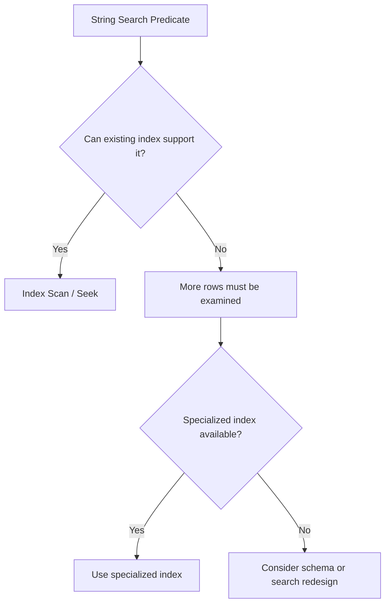
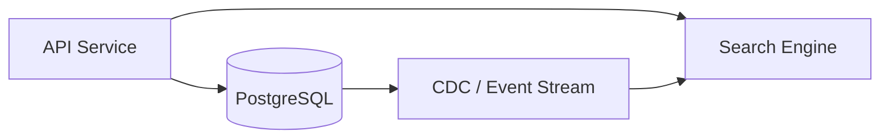

# 05- String Operators

## Overview

String operators and string-related expressions are used to combine, compare, search, transform, and extract text values in SQL. They are fundamental to backend systems because application data frequently contains names, identifiers, URLs, email addresses, status values, free-form text, and structured strings.

SQL dialects differ more significantly for string operators than for basic comparison operators. PostgreSQL commonly uses `||` for concatenation, while MySQL commonly uses `CONCAT()`. Pattern matching also varies between `LIKE`, `ILIKE`, regular-expression operators, and database-specific functions.

String operations are useful for presentation, filtering, normalization, and data transformation, but applying functions to columns in large queries can affect index usage. Production systems should therefore distinguish between **display-time formatting** and **search predicates that need to scale**.

## String Concatenation

String concatenation combines multiple string expressions into one value.

In PostgreSQL and many SQL implementations:

```sql
SELECT first_name || ' ' || last_name AS full_name
FROM users;
```

For example:

```text
first_name = "Aranya"
last_name  = "Majumdar"

Result:
Aranya Majumdar
```

MySQL commonly uses:

```sql
SELECT CONCAT(first_name, ' ', last_name) AS full_name
FROM users;
```

### Why It Exists

Concatenation is useful when the database needs to construct a derived string from multiple columns or constants.

Common uses include:

- Display labels.
- Human-readable identifiers.
- URLs.
- Log or reporting fields.
- Composite text values returned by APIs.
- Export queries.

### NULL Behavior

`NULL` handling is an important portability issue.

In PostgreSQL:

```sql
SELECT 'User: ' || NULL;
```

produces `NULL`.

MySQL's `CONCAT()` also returns `NULL` when an argument is `NULL`.

When a missing value should instead behave like an empty string, use explicit handling:

```sql
SELECT
    COALESCE(first_name, '') || ' ' || COALESCE(last_name, '') AS full_name
FROM users;
```

For MySQL:

```sql
SELECT
    CONCAT(
        COALESCE(first_name, ''),
        ' ',
        COALESCE(last_name, '')
    ) AS full_name
FROM users;
```

Do not use `COALESCE()` automatically everywhere. Decide whether `NULL` means "unknown/missing" or whether it should be represented as an empty value.

## Concatenation in Backend Queries

Consider an API returning a user's display name.

```sql
SELECT
    id,
    first_name || ' ' || last_name AS display_name
FROM users
WHERE tenant_id = :tenant_id;
```

This can be useful when the derived value is only needed for the response.

However, if the application frequently searches by the concatenated expression:

```sql
WHERE first_name || ' ' || last_name = :name
```

the query should be evaluated for indexability and workload characteristics.

For high-volume search, storing or indexing an appropriate derived representation may be better than repeatedly computing it across a large table.

## LIKE Pattern Matching

`LIKE` performs wildcard pattern matching.

The two primary wildcards are:

| Wildcard | Meaning |
|---|---|
| `%` | Zero or more characters |
| `_` | Exactly one character |

Example:

```sql
SELECT id, email
FROM users
WHERE email LIKE '%@example.com';
```

This finds values ending in:

```text
@example.com
```

Another example:

```sql
SELECT id, name
FROM products
WHERE name LIKE 'Mac%';
```

This matches strings beginning with `Mac`.

### Common Patterns

```sql
-- Starts with "Mac"
WHERE name LIKE 'Mac%'

-- Ends with ".com"
WHERE email LIKE '%.com'

-- Contains "cloud"
WHERE description LIKE '%cloud%'

-- Exactly one unknown character
WHERE code LIKE 'AB_123'
```

## LIKE and Index Usage

Pattern shape matters significantly for performance.

A predicate such as:

```sql
WHERE username LIKE 'john%'
```

can potentially use an appropriate index because the search has a known prefix.

A predicate such as:

```sql
WHERE username LIKE '%john%'
```

generally cannot use a normal B-tree index efficiently for arbitrary substring matching.

This distinction is important in production systems.

| Pattern | Typical B-tree friendliness |
|---|---|
| `column = 'value'` | Excellent |
| `column LIKE 'prefix%'` | Often good |
| `column LIKE '%suffix'` | Generally poor |
| `column LIKE '%substring%'` | Generally poor |

The actual behavior depends on the database, collation, operator class, indexes, and query planner.

For PostgreSQL substring search, specialized indexes such as `pg_trgm` can be appropriate:

```sql
CREATE EXTENSION IF NOT EXISTS pg_trgm;

CREATE INDEX idx_products_name_trgm
ON products
USING gin (name gin_trgm_ops);
```

Then:

```sql
SELECT id, name
FROM products
WHERE name ILIKE '%keyboard%';
```

can be evaluated using an index strategy appropriate for substring matching.

## Case-Insensitive Matching

Case sensitivity depends on the database and collation.

PostgreSQL provides `ILIKE`:

```sql
SELECT id
FROM users
WHERE email ILIKE 'admin%';
```

`ILIKE` performs case-insensitive pattern matching.

Another common approach is:

```sql
WHERE LOWER(email) = LOWER(:email)
```

However, applying `LOWER()` to the column can prevent a normal index from being used.

For PostgreSQL, an expression index can address this:

```sql
CREATE INDEX idx_users_email_lower
ON users (LOWER(email));
```

Then:

```sql
SELECT id
FROM users
WHERE LOWER(email) = LOWER(:email);
```

can use the expression index when the planner determines it is beneficial.

For systems requiring case-insensitive identity, consider whether the schema should enforce canonicalization or use database-specific case-insensitive types/index strategies instead of repeatedly transforming values at query time.

## String Equality vs Pattern Matching

Use equality when the requirement is exact matching:

```sql
WHERE email = :email
```

Use `LIKE` when wildcard semantics are actually required:

```sql
WHERE email LIKE :pattern
```

Do not replace equality predicates with `%value%` searches simply because they appear more flexible.

Exact equality is typically:

- Easier to reason about.
- Easier to index.
- Faster at scale.
- Less ambiguous.

For identifiers such as email addresses, usernames, UUIDs, or external IDs, equality should normally be preferred when the business requirement is exact identity.

## Escaping LIKE Wildcards

User input can contain `%` or `_`, which have special meaning in `LIKE`.

Suppose a user searches for the literal value:

```text
50% off
```

Passing it directly into:

```sql
WHERE description LIKE :pattern
```

may unintentionally treat `%` as a wildcard.

SQL supports an `ESCAPE` clause:

```sql
WHERE description LIKE :pattern ESCAPE '\'
```

with application-side escaping of `%`, `_`, and the escape character itself.

The exact escaping implementation should be centralized in application code or a database abstraction rather than duplicated throughout services.

This is separate from SQL injection protection. **Always use bound parameters** for values.

Prefer:

```python
cursor.execute(
    """
    SELECT id, description
    FROM products
    WHERE description LIKE %s
    """,
    (pattern,),
)
```

over interpolating user input into SQL.

## String Functions

Although this document focuses on string operators, practical SQL work commonly combines operators with string functions.

Common functions include:

| Function | Typical purpose |
|---|---|
| `LOWER()` | Convert text to lowercase |
| `UPPER()` | Convert text to uppercase |
| `TRIM()` | Remove surrounding whitespace |
| `LENGTH()` | Determine string length |
| `SUBSTRING()` | Extract part of a string |
| `REPLACE()` | Replace matching text |
| `POSITION()` | Find a substring |
| `COALESCE()` | Handle `NULL` values |
| `CONCAT()` | Concatenate strings |

Exact function names and behavior can vary by database.

Example:

```sql
SELECT
    id,
    LOWER(TRIM(email)) AS normalized_email
FROM users;
```

## SUBSTRING and Text Extraction

`SUBSTRING()` extracts part of a string.

PostgreSQL-style syntax:

```sql
SELECT SUBSTRING('backend-engineering' FROM 1 FOR 7);
```

Result:

```text
backend
```

This is useful for controlled extraction tasks such as:

- Parsing known-format identifiers.
- Extracting prefixes.
- Building reports.
- Processing legacy data.

It should not automatically be used as a replacement for proper schema design or application-level parsing of complex formats.

## REPLACE

`REPLACE()` substitutes occurrences of one string with another.

```sql
SELECT REPLACE('https://example.com', 'https://', '');
```

Result:

```text
example.com
```

For data cleanup:

```sql
UPDATE users
SET phone_number = REPLACE(phone_number, ' ', '');
```

Be careful with mass updates. String transformations can alter large numbers of rows and may be difficult to reverse.

For production data migrations:

- Validate the transformation first with `SELECT`.
- Measure affected rows.
- Use a transaction where appropriate.
- Take the backup/recovery strategy into account.
- Consider batching large migrations.
- Verify the result before deleting or overwriting source information.

## TRIM and Normalization

Whitespace normalization is common when importing external data.

```sql
SELECT TRIM(name)
FROM users;
```

For example:

```text
"  Alice  "
```

becomes:

```text
"Alice"
```

However, normalization policy should be defined at the correct system boundary.

If an API guarantees canonical email addresses or identifiers, normalize them consistently before persistence rather than relying on every query to call `TRIM()` or `LOWER()`.

Repeated query-time normalization can make indexes harder to use and can create inconsistent behavior across services.

## String Operations and Indexes

The most important production concern is whether the database can use an index for the predicate.

Compare:

```sql
WHERE email = :email
```

with:

```sql
WHERE LOWER(email) = LOWER(:email)
```

and:

```sql
WHERE email LIKE '%example%'
```

They have very different indexing characteristics.

A useful mental model is:



Always validate assumptions with the execution plan.

For PostgreSQL:

```sql
EXPLAIN (ANALYZE, BUFFERS)
SELECT id
FROM users
WHERE LOWER(email) = LOWER('admin@example.com');
```

An index should be designed around the actual query pattern rather than added speculatively.

## Search Architecture

For simple prefix or exact searches, PostgreSQL can often handle the workload effectively with suitable indexes.

For large-scale fuzzy, relevance-ranked, typo-tolerant, or multilingual search, a dedicated search architecture may be more appropriate.

A typical architecture can look like:



The database remains the source of truth while a search system maintains an optimized search index.

This is especially relevant for:

- Large product catalogs.
- Full-text search.
- Fuzzy matching.
- Autocomplete.
- Ranking.
- Typo tolerance.
- Complex linguistic search.

Do not introduce a separate search system merely to solve a small `LIKE 'prefix%'` query that PostgreSQL can already handle efficiently.

## Application-Layer vs Database-Layer String Processing

The correct location for string manipulation depends on why it is being performed.

| Requirement | Usually appropriate location |
|---|---|
| API display formatting | Application |
| Search predicate | Database |
| Data normalization before persistence | Application/service boundary |
| Large data migration | Database or migration job |
| Full-text relevance search | Database/search engine |
| Complex business formatting | Application |
| Simple projection/alias | Database |

For example, generating:

```text
first_name + " " + last_name
```

in SQL may be perfectly reasonable for a reporting query.

Complex presentation formatting generally belongs in the application layer.

## Production Example: User Search API

Suppose an API provides:

```text
GET /users?search=alice
```

A naive implementation might use:

```sql
SELECT id, email
FROM users
WHERE email ILIKE '%alice%'
   OR username ILIKE '%alice%';
```

For a small dataset this may be acceptable.

At scale, evaluate:

- Number of rows.
- Query frequency.
- Search selectivity.
- Index strategy.
- Latency requirements.
- Concurrent requests.
- Database CPU utilization.
- Memory pressure.
- Search relevance requirements.

PostgreSQL-specific trigram indexes may be appropriate:

```sql
CREATE EXTENSION IF NOT EXISTS pg_trgm;

CREATE INDEX idx_users_username_trgm
ON users
USING gin (username gin_trgm_ops);

CREATE INDEX idx_users_email_trgm
ON users
USING gin (email gin_trgm_ops);
```

Then inspect:

```sql
EXPLAIN (ANALYZE, BUFFERS)
SELECT id, email
FROM users
WHERE username ILIKE '%alice%';
```

Do not assume that the same design will be optimal for every database engine.

## ORM Considerations

Django provides string lookups that map to database-specific SQL.

For example:

```python
User.objects.filter(username__startswith="alice")
```

typically represents a prefix search.

A case-insensitive lookup can be expressed as:

```python
User.objects.filter(username__icontains="alice")
```

which represents a substring search and can have significantly different performance characteristics.

The ORM does not remove database performance concerns.

Always inspect generated SQL and execution plans for important queries:

```python
queryset = User.objects.filter(username__startswith="alice")

print(queryset.query)
```

For production workloads, optimize the generated SQL and indexes rather than assuming a concise ORM expression is automatically efficient.

## Common Mistakes

### Using `%term%` for Every Search

This:

```sql
WHERE name LIKE '%alice%'
```

is flexible but can be expensive on large tables.

If the requirement is prefix matching, use:

```sql
WHERE name LIKE 'alice%'
```

when appropriate.

### Applying Functions Without Considering Indexes

This:

```sql
WHERE LOWER(email) = LOWER(:email)
```

may prevent use of a normal index on `email`.

Use an appropriate expression index or schema-level normalization strategy.

### Building SQL with String Interpolation

Never do:

```python
query = f"SELECT * FROM users WHERE name LIKE '%{user_input}%'"
```

This can introduce SQL injection vulnerabilities.

Use bound parameters.

### Confusing NULL with Empty String

These are different values:

```text
NULL
''
```

Do not assume concatenation, comparisons, or functions treat them identically.

### Performing Large String Updates Without a Plan

An operation such as:

```sql
UPDATE users
SET email = LOWER(email);
```

may touch every row.

On a large production table this can generate substantial:

- WAL/transaction-log volume.
- Locking.
- I/O.
- Replication traffic.
- Vacuum or storage pressure.

Treat large transformations as migrations rather than casual SQL statements.

### Ignoring Collation

String equality, ordering, case behavior, and pattern matching can depend on collation and database configuration.

Do not assume that "case-insensitive" or linguistic comparison means the same thing across PostgreSQL, MySQL, SQL Server, and application code.

## Security Considerations

String operations themselves are not inherently insecure, but dynamically constructed string predicates are a common injection surface.

Unsafe:

```python
query = f"""
SELECT id
FROM users
WHERE username LIKE '%{search}%'
"""
```

Safe parameter binding:

```python
cursor.execute(
    """
    SELECT id
    FROM users
    WHERE username LIKE %s
    """,
    (f"%{search}%",),
)
```

Parameterization protects SQL syntax, but it does not automatically provide:

- Authorization.
- Tenant isolation.
- Rate limiting.
- Abuse prevention.
- Safe wildcard semantics.

For a multi-tenant backend, the query should still enforce the tenant boundary:

```sql
SELECT id, username
FROM users
WHERE tenant_id = :tenant_id
  AND username LIKE :pattern;
```

## Performance and Scalability Guidance

For production systems:

- Prefer equality predicates when exact matching is required.
- Prefer indexed prefix searches over unrestricted substring searches when the product requirement allows it.
- Use specialized indexes for workloads that genuinely require substring or fuzzy matching.
- Avoid unnecessary functions on indexed columns.
- Consider expression indexes when query-time transformation is unavoidable.
- Use `EXPLAIN` and realistic production-sized datasets.
- Normalize canonical identifiers consistently.
- Avoid large unbounded text scans in latency-sensitive request paths.
- Consider dedicated search infrastructure for advanced search workloads.
- Monitor query latency, rows examined, buffer usage, CPU, and I/O.

A string query that is fast at 10,000 rows may become a production bottleneck at 100 million rows.

## Interview Traps

| Question | Key Point |
|---|---|
| What does `%` mean in `LIKE`? | Zero or more characters |
| What does `_` mean in `LIKE`? | Exactly one character |
| Why can `LIKE '%term%'` be slow? | A normal B-tree index generally cannot efficiently support arbitrary substring matching |
| Why can `LOWER(column)` affect performance? | The expression may prevent a normal index on the raw column from being used |
| How can this be addressed? | Expression/functional indexes or schema-level normalization |
| What is the difference between `LIKE` and `ILIKE`? | `ILIKE` is PostgreSQL's case-insensitive pattern-matching operator |
| Why use bound parameters? | To prevent SQL injection and correctly handle SQL values |
| Why is `NULL` important for concatenation? | Concatenation involving `NULL` commonly produces `NULL` |
| When should a search engine be considered? | For large-scale fuzzy, relevance-ranked, typo-tolerant, or advanced search |
| Does using an ORM eliminate SQL optimization concerns? | No; the database still executes the generated SQL |

## Key Takeaways

- String operators support concatenation, pattern matching, and text manipulation, but syntax and behavior vary across SQL dialects.
- `LIKE` pattern shape matters: prefix searches can often use B-tree indexes, while `%term%` commonly requires specialized indexing or a different search architecture.
- Functions such as `LOWER()` and `TRIM()` can affect index usage; use expression indexes or normalize data at the appropriate system boundary when necessary.
- Always use parameterized SQL for user-controlled string values and treat wildcard escaping as a separate concern from SQL injection prevention.
- Choose between database string processing, application formatting, specialized indexes, and search infrastructure based on workload, correctness, and scalability requirements.