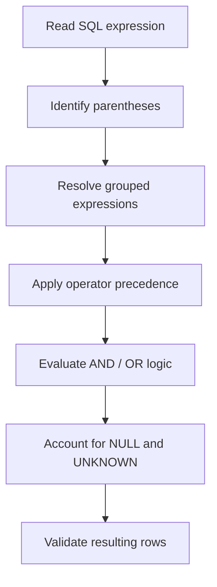

# 06- Operator Precedence

## Overview

SQL expressions frequently combine arithmetic, comparison, logical, string, and other operators in a single statement. **Operator precedence** determines the order in which those operators are evaluated when parentheses are not used.

Understanding precedence matters because a query can be syntactically valid while producing a different result from what the developer intended. This is particularly important in `WHERE`, `HAVING`, `JOIN ... ON`, computed columns, `CASE` expressions, and authorization or tenant-isolation predicates.

For production SQL, precedence should be treated as both a correctness concern and a readability concern. Even when the database's precedence rules produce the intended result, explicit parentheses often make the business logic substantially easier to review and maintain.

## Why Operator Precedence Matters

Consider:

```sql
SELECT *
FROM orders
WHERE status = 'paid'
   OR status = 'pending'
  AND total_amount > 1000;
```

The expression is evaluated as:

```text
status = 'paid'
OR
(status = 'pending' AND total_amount > 1000)
```

not:

```text
(status = 'paid' OR status = 'pending')
AND total_amount > 1000
```

This happens because `AND` has higher precedence than `OR`.

If the intended rule is "paid or pending orders, but only when the amount exceeds 1000", the correct expression is:

```sql
SELECT *
FROM orders
WHERE (status = 'paid' OR status = 'pending')
  AND total_amount > 1000;
```

The difference can materially change API results, reports, billing logic, and authorization behavior.

## Common Precedence Hierarchy

Exact precedence rules vary between SQL dialects. The following ordering is a useful conceptual model for common SQL expressions, but database-specific documentation should be consulted for dialect-specific operators.

| Relative precedence | Operator / construct | Typical purpose |
|---|---|---|
| Higher | Parentheses `(...)` | Explicit grouping |
| Higher | Unary operators | Negation or unary arithmetic |
| Higher | `*`, `/`, `%` | Multiplication, division, modulo |
| Higher | `+`, `-` | Addition, subtraction |
| Higher | Concatenation / string operators | Dialect-specific |
| Higher | Comparison operators | `=`, `<>`, `<`, `>`, `<=`, `>=` |
| Higher | `IS`, `IS NULL`, `IS TRUE`, etc. | Special-value predicates |
| Higher | `NOT` | Logical negation |
| Lower | `AND` | Logical conjunction |
| Lowest | `OR` | Logical disjunction |

This table is intentionally approximate because SQL dialects differ in the exact precedence assigned to operators such as concatenation, bitwise operators, pattern matching, and dialect-specific predicates.

The most important logical rule to remember is:

```text
NOT
  ↓
AND
  ↓
OR
```

Therefore:

```sql
A OR B AND C
```

means:

```sql
A OR (B AND C)
```

## Parentheses Override Precedence

Parentheses explicitly define evaluation order.

Without parentheses:

```sql
WHERE A OR B AND C
```

is interpreted as:

```sql
WHERE A OR (B AND C)
```

With parentheses:

```sql
WHERE (A OR B) AND C
```

the `OR` expression is evaluated as a group before the outer `AND`.

This makes parentheses valuable even when the database's default precedence is already known.

### Practical Rule

When a predicate mixes `AND` and `OR`, explicitly group the conditions unless the intended grouping is completely obvious.

Prefer:

```sql
WHERE (country = 'IN' OR country = 'US')
  AND is_active = TRUE
```

over:

```sql
WHERE country = 'IN'
   OR country = 'US'
  AND is_active = TRUE
```

The first version communicates the business rule directly.

## Arithmetic Precedence

Arithmetic operators generally follow conventional mathematical precedence.

For example:

```sql
SELECT 10 + 5 * 2 AS result;
```

produces:

```text
20
```

because multiplication is evaluated before addition:

```text
10 + (5 * 2)
```

To force addition first:

```sql
SELECT (10 + 5) * 2 AS result;
```

produces:

```text
30
```

A more realistic example:

```sql
SELECT
    quantity * unit_price + shipping_cost AS subtotal
FROM order_items;
```

is interpreted as:

```text
(quantity * unit_price) + shipping_cost
```

If the business calculation is different, make the grouping explicit:

```sql
SELECT
    quantity * (unit_price + shipping_cost) AS subtotal
FROM order_items;
```

## Comparison Operators

Comparison operators are used to form predicates:

```sql
WHERE total_amount >= 1000
```

Multiple comparisons are normally combined with logical operators:

```sql
WHERE status = 'paid'
  AND total_amount >= 1000
```

The comparison expressions are evaluated before the logical combination.

For example:

```sql
WHERE status = 'paid'
   OR total_amount >= 1000
  AND customer_id = 42
```

is interpreted as:

```sql
WHERE status = 'paid'
   OR (total_amount >= 1000 AND customer_id = 42)
```

If the requirement is:

```text
(status is paid OR amount >= 1000)
AND customer is 42
```

write:

```sql
WHERE (status = 'paid' OR total_amount >= 1000)
  AND customer_id = 42
```

## NOT, AND, and OR

Logical precedence is one of the most important SQL precedence rules.

Given:

```sql
WHERE NOT is_deleted
  AND is_active
  OR is_admin
```

the database generally interprets this as:

```sql
WHERE (NOT is_deleted AND is_active)
   OR is_admin
```

It does not mean:

```sql
WHERE NOT (is_deleted AND is_active OR is_admin)
```

Nor does it mean:

```sql
WHERE NOT is_deleted
  AND (is_active OR is_admin)
```

If the business rule is complex, encode it explicitly:

```sql
WHERE NOT is_deleted
  AND (is_active OR is_admin)
```

## `NOT` with Parentheses

`NOT` applies to the expression that follows it.

For example:

```sql
WHERE NOT (status = 'cancelled' OR status = 'failed')
```

is equivalent in logical terms to:

```sql
WHERE status <> 'cancelled'
  AND status <> 'failed'
```

However, `NULL` semantics can make seemingly equivalent transformations behave differently in more complicated expressions.

When a predicate involves nullable columns, do not rely solely on Boolean algebra. Verify the SQL three-valued logic behavior.

## SQL Uses Three-Valued Logic

SQL predicates can evaluate to:

- `TRUE`
- `FALSE`
- `UNKNOWN`

`NULL` is the primary reason `UNKNOWN` exists.

For example:

```sql
SELECT *
FROM users
WHERE email <> 'admin@example.com';
```

does not return rows where `email` is `NULL`.

The expression:

```sql
NULL <> 'admin@example.com'
```

evaluates to `UNKNOWN`, not `TRUE`.

Since `WHERE` retains rows only when the predicate evaluates to `TRUE`, the row is excluded.

This becomes especially important when combining operators:

```sql
WHERE is_active = TRUE
  AND email <> 'admin@example.com'
```

A nullable `email` can cause the entire `AND` expression to become `UNKNOWN`.

Use explicit `NULL` predicates when that distinction matters:

```sql
WHERE is_active = TRUE
  AND (
      email IS NULL
      OR email <> 'admin@example.com'
  )
```

## Truth Tables for AND and OR

Understanding truth tables helps when reviewing complex predicates.

### AND

| A | B | A AND B |
|---|---|---|
| TRUE | TRUE | TRUE |
| TRUE | FALSE | FALSE |
| FALSE | TRUE | FALSE |
| FALSE | FALSE | FALSE |
| TRUE | UNKNOWN | UNKNOWN |
| FALSE | UNKNOWN | FALSE |
| UNKNOWN | TRUE | UNKNOWN |
| UNKNOWN | FALSE | FALSE |
| UNKNOWN | UNKNOWN | UNKNOWN |

### OR

| A | B | A OR B |
|---|---|---|
| TRUE | TRUE | TRUE |
| TRUE | FALSE | TRUE |
| FALSE | FALSE | FALSE |
| TRUE | UNKNOWN | TRUE |
| FALSE | UNKNOWN | UNKNOWN |
| UNKNOWN | TRUE | TRUE |
| UNKNOWN | FALSE | UNKNOWN |
| UNKNOWN | UNKNOWN | UNKNOWN |

This is why transformations that are valid in ordinary two-valued Boolean logic must be evaluated carefully when `NULL` is possible.

## `IN` and Logical Grouping

`IN` is useful for expressing multiple equality conditions:

```sql
WHERE status IN ('paid', 'pending', 'processing')
```

Conceptually, this is similar to:

```sql
WHERE status = 'paid'
   OR status = 'pending'
   OR status = 'processing'
```

When combined with other predicates, grouping still matters:

```sql
WHERE status IN ('paid', 'pending')
  AND total_amount > 1000
```

This means:

```text
(status is paid OR pending)
AND amount > 1000
```

The equivalent expanded form requires parentheses:

```sql
WHERE (status = 'paid' OR status = 'pending')
  AND total_amount > 1000
```

`IN` often makes the intended grouping clearer and reduces repetitive expressions.

## `BETWEEN` and Precedence

`BETWEEN` represents a range predicate:

```sql
WHERE total_amount BETWEEN 100 AND 500
```

It is inclusive at both boundaries in standard SQL semantics:

```text
100 <= total_amount <= 500
```

When combined with logical operators, use parentheses where necessary:

```sql
WHERE (total_amount BETWEEN 100 AND 500)
  AND status = 'paid'
```

Do not assume that visual formatting alone changes evaluation order.

## `IS NULL` and Comparison Logic

`NULL` must be checked using `IS NULL` or `IS NOT NULL`.

Incorrect:

```sql
WHERE deleted_at = NULL
```

Correct:

```sql
WHERE deleted_at IS NULL
```

This is not merely a precedence issue. It reflects SQL's three-valued logic and the fact that `NULL` represents an unknown or missing value rather than an ordinary comparable value.

## `CASE` Expressions

`CASE` expressions also contain Boolean conditions whose grouping matters.

Example:

```sql
SELECT
    order_id,
    CASE
        WHEN status = 'paid' AND total_amount >= 1000
            THEN 'high-value-paid'
        WHEN status = 'paid'
            THEN 'paid'
        ELSE 'other'
    END AS category
FROM orders;
```

The first `WHEN` condition means:

```text
status = 'paid'
AND
total_amount >= 1000
```

For complex conditions, parentheses improve maintainability:

```sql
CASE
    WHEN (status = 'paid' OR status = 'pending')
         AND total_amount >= 1000
        THEN 'priority'
    ELSE 'standard'
END
```

## Operator Precedence in JOIN Conditions

Precedence also matters in `JOIN ... ON`.

Consider:

```sql
SELECT o.id, p.id
FROM orders AS o
JOIN payments AS p
  ON p.order_id = o.id
 AND p.status = 'captured'
 OR p.status = 'authorized';
```

Because `AND` binds more tightly than `OR`, this is logically:

```sql
ON (p.order_id = o.id AND p.status = 'captured')
OR p.status = 'authorized'
```

That may allow an authorized payment from another order to satisfy the join condition.

If the intended rule is that the payment must belong to the order and have either status:

```sql
SELECT o.id, p.id
FROM orders AS o
JOIN payments AS p
  ON p.order_id = o.id
 AND (p.status = 'captured' OR p.status = 'authorized');
```

This is a production-critical distinction because an incorrectly grouped join can produce:

- Duplicate rows.
- Incorrect aggregates.
- Data leakage.
- Unexpected query cardinality.
- Severe performance problems.

## Operator Precedence in Authorization Queries

Authorization predicates are particularly sensitive to precedence.

Consider a multi-tenant system:

```sql
SELECT *
FROM documents
WHERE tenant_id = :tenant_id
  AND owner_id = :user_id
  OR is_public = TRUE;
```

This means:

```sql
WHERE (tenant_id = :tenant_id AND owner_id = :user_id)
   OR is_public = TRUE
```

If public documents are intentionally global, that may be correct.

But if the intended rule is that the document must belong to the tenant and be either owned by the user or public:

```sql
SELECT *
FROM documents
WHERE tenant_id = :tenant_id
  AND (owner_id = :user_id OR is_public = TRUE);
```

The difference is significant.

For multi-tenant systems, treat tenant predicates as security boundaries and make their grouping explicit.

## Operator Precedence and Query Optimization

Precedence primarily determines semantics, but predicate structure can also influence the optimizer's available execution strategies.

For example:

```sql
WHERE tenant_id = :tenant_id
  AND (status = 'paid' OR status = 'pending')
```

communicates a tenant restriction that can be combined with appropriate indexes.

A useful index might depend on workload:

```sql
CREATE INDEX idx_orders_tenant_status
ON orders (tenant_id, status);
```

However, index design should be based on actual query patterns and execution plans rather than simply mirroring every predicate.

Precedence itself does not make a query fast or slow. The important distinction is that **incorrect grouping can change which rows qualify**, while the resulting predicate structure may also affect optimization opportunities.

## Precedence and Query Readability

SQL should be written for both the database and the engineers maintaining it.

Compare:

```sql
WHERE a = 1 OR b = 2 AND c = 3 OR d = 4
```

with:

```sql
WHERE (a = 1 OR b = 2)
  AND c = 3
  OR d = 4
```

The second version is clearer about some grouping, but a reader still has to reason about the final `OR`.

If the business rule is:

```text
((a = 1 OR b = 2) AND c = 3)
OR d = 4
```

make all important boundaries explicit:

```sql
WHERE ((a = 1 OR b = 2) AND c = 3)
   OR d = 4
```

Parentheses are not a performance optimization. They are a correctness and maintainability tool.

## A Practical Evaluation Model

When reviewing a complex expression, use this process:



For example:

```sql
WHERE NOT is_deleted
  AND (status = 'paid' OR status = 'pending')
  AND total_amount > 1000
```

Reason about it as:

```text
NOT is_deleted
AND
(status = 'paid' OR status = 'pending')
AND
total_amount > 1000
```

rather than attempting to evaluate the expression left-to-right.

## Production Best Practices

### Use Parentheses for Mixed AND/OR Logic

Prefer:

```sql
WHERE (role = 'admin' OR role = 'operator')
  AND is_active = TRUE
```

over relying on precedence:

```sql
WHERE role = 'admin'
   OR role = 'operator'
  AND is_active = TRUE
```

### Treat Security Predicates as Explicit Boundaries

For tenant or authorization filters:

```sql
WHERE tenant_id = :tenant_id
  AND (owner_id = :user_id OR is_public = TRUE)
```

make the security boundary obvious.

### Keep Business Rules Readable

If a predicate represents a complex business rule, use formatting and parentheses to expose the rule.

Do not optimize SQL readability away in an attempt to reduce characters.

### Validate With Representative Data

For complicated predicates, construct test rows that exercise every logical branch:

| Condition | Expected |
|---|---|
| A=true, B=true, C=true | Depends on intended rule |
| A=true, B=false, C=true | Verify `AND`/`OR` grouping |
| A=false, B=true, C=true | Verify alternate branch |
| Nullable column | Verify `UNKNOWN` behavior |
| No matching conditions | Must be excluded |

Unit and integration tests should validate the business result, not just that the query executes successfully.

### Inspect the Execution Plan Separately

Use:

```sql
EXPLAIN
SELECT ...
```

or, where appropriate:

```sql
EXPLAIN (ANALYZE, BUFFERS)
SELECT ...
```

Do not confuse logical correctness with query performance. A correctly grouped query can still require indexes, better cardinality estimates, query restructuring, or schema changes.

## Common Mistakes

### Assuming SQL Evaluates Left to Right

Incorrect mental model:

```sql
A OR B AND C
```

becomes:

```sql
(A OR B) AND C
```

Correct:

```sql
A OR (B AND C)
```

because `AND` has higher precedence than `OR`.

### Mixing AND and OR Without Parentheses

This is one of the most common sources of subtle SQL bugs.

Instead of:

```sql
WHERE active = TRUE
  AND role = 'admin'
  OR role = 'operator'
```

write the intended grouping explicitly:

```sql
WHERE active = TRUE
  AND (role = 'admin' OR role = 'operator')
```

### Forgetting NULL Semantics

This:

```sql
WHERE value <> 10
```

does not match `NULL`.

Do not treat SQL Boolean expressions as purely two-valued logic.

### Misgrouping JOIN Conditions

This:

```sql
ON a.id = b.a_id
AND b.type = 'x'
OR b.type = 'y'
```

is generally interpreted as:

```sql
ON (a.id = b.a_id AND b.type = 'x')
OR b.type = 'y'
```

which can create incorrect join results.

### Assuming Parentheses Change Query Performance

Parentheses primarily specify expression semantics. They do not inherently make a query faster or slower.

Performance should be evaluated through:

- Execution plans.
- Index usage.
- Cardinality.
- Rows scanned.
- CPU.
- I/O.
- Query latency.

### Trusting ORM Abstractions Blindly

Django, SQLAlchemy, and other ORMs construct SQL expressions that still obey database semantics.

For complex conditions, make grouping explicit in the ORM rather than assuming method chaining communicates the same logic you have in mind.

For example, Django's `Q` objects make Boolean grouping explicit:

```python
from django.db.models import Q

queryset = User.objects.filter(
    Q(role="admin") | Q(role="operator"),
    is_active=True,
)
```

This expresses:

```text
(role = 'admin' OR role = 'operator')
AND is_active = TRUE
```

## Interview Traps

| Question | Key Point |
|---|---|
| What is the precedence between `AND` and `OR`? | `AND` is evaluated before `OR` |
| How do you override precedence? | Use parentheses |
| How is `A OR B AND C` interpreted? | `A OR (B AND C)` |
| Where does `NOT` fit? | It binds more tightly than `AND` |
| Does SQL use two-valued Boolean logic? | No; SQL uses `TRUE`, `FALSE`, and `UNKNOWN` |
| Why can `NULL` produce surprising results? | Comparisons involving `NULL` generally produce `UNKNOWN` |
| Why are parentheses important in authorization queries? | They make security boundaries explicit and prevent unintended access |
| Does operator precedence determine query performance? | It determines expression semantics; performance depends on the resulting query, optimizer, indexes, and data distribution |
| Why can a JOIN condition be dangerous without parentheses? | `AND`/`OR` grouping can change join cardinality and match unrelated rows |
| Is precedence identical across all SQL databases? | No; exact operator precedence can be dialect-specific |

## Key Takeaways

- SQL does not generally evaluate expressions left-to-right; operator precedence determines how unparenthesized expressions are grouped.
- `NOT` binds more tightly than `AND`, and `AND` binds more tightly than `OR`; use parentheses whenever mixed logical operators represent an important business rule.
- SQL uses three-valued logic, so `NULL` can produce `UNKNOWN` and change the result of otherwise familiar Boolean expressions.
- Explicit grouping is especially important in `JOIN`, authorization, and multi-tenant predicates where an incorrect expression can produce incorrect or unauthorized results.
- Operator precedence controls correctness, while execution plans, indexes, cardinality, and data distribution determine performance.