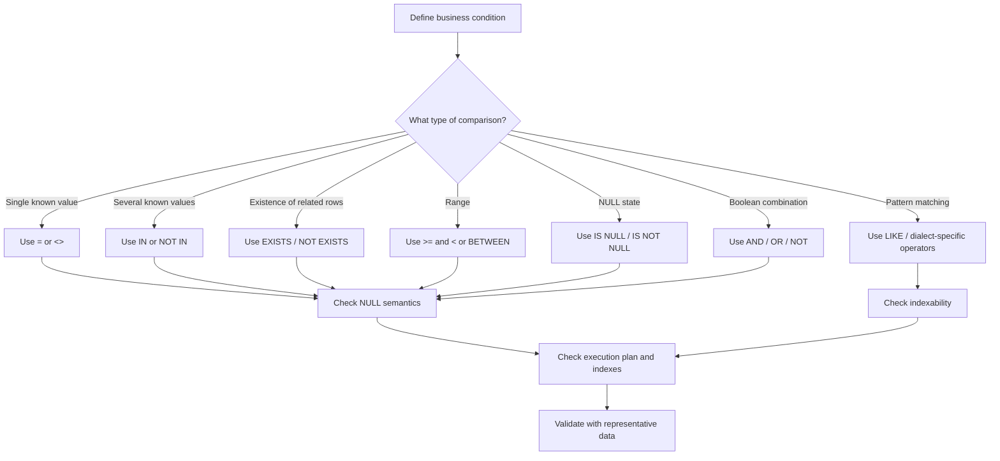

# 07- Operator Selection Rules

## Overview

SQL provides many operators that can express the same business condition in different ways. Choosing the right operator is not only a syntax decision; it affects **correctness, NULL behavior, readability, index usage, query plans, and maintainability**.

Common operator choices include:

- `=` vs `IN`
- `<>` vs `NOT IN`
- `IS NULL` vs `= NULL`
- `LIKE` vs equality
- `BETWEEN` vs explicit range predicates
- `IN` vs `EXISTS`
- `AND` vs `OR`
- arithmetic operators vs database functions
- concatenation operators vs application-side formatting

A senior engineer chooses operators based on the data model, cardinality, NULL semantics, expected query shape, and business requirement rather than simply selecting the shortest expression.

## Operator Selection Principles

A useful decision process is:



The first question should be **what the query means**, followed by **how the database can execute it efficiently**.

## Equality Operators

### `=`

Use `=` when comparing a value against one known value.

```sql
SELECT *
FROM orders
WHERE status = 'paid';
```

This is usually the clearest choice for an equality predicate.

It is also commonly index-friendly:

```sql
CREATE INDEX idx_orders_status
ON orders (status);
```

Whether the index is actually useful depends on selectivity, table size, statistics, and the complete query.

### `<>` and `!=`

SQL standard syntax uses:

```sql
WHERE status <> 'cancelled'
```

Some databases also support:

```sql
WHERE status != 'cancelled'
```

Prefer the syntax supported consistently by the SQL dialect used by the application.

The important production concern is that neither expression matches `NULL` rows:

```sql
status <> 'cancelled'
```

does not mean:

```text
status is anything except cancelled, including NULL
```

If NULL should be included:

```sql
WHERE status <> 'cancelled'
   OR status IS NULL
```

## `IN`

Use `IN` when matching a column against a finite set of known values.

Prefer:

```sql
SELECT *
FROM orders
WHERE status IN ('paid', 'pending', 'processing');
```

over:

```sql
SELECT *
FROM orders
WHERE status = 'paid'
   OR status = 'pending'
   OR status = 'processing';
```

### Why `IN` Exists

`IN` expresses set membership directly. It improves readability and avoids repeating the same column expression.

Conceptually:

```sql
status IN ('paid', 'pending')
```

represents:

```sql
status = 'paid'
OR status = 'pending'
```

The database optimizer may transform these expressions internally; the choice should primarily be driven by semantics and readability.

### When to Use It

Use `IN` when:

- The candidate values are known.
- The list is reasonably small.
- The condition represents membership in a finite set.

Example:

```sql
SELECT id, email
FROM users
WHERE country_code IN ('IN', 'US', 'GB');
```

### Production Considerations

Avoid generating extremely large `IN` lists dynamically.

For example, passing tens of thousands of IDs as SQL literals can result in:

- Large SQL statements.
- Increased parsing/planning overhead.
- Network overhead.
- Parameter-count limitations.
- Poor application/database resource usage.

For large dynamic sets, consider:

- Temporary tables.
- Staging tables.
- `VALUES` relations.
- Array parameters where supported.
- Joining against a persisted or temporary relation.
- `EXISTS`.

The appropriate choice depends on the database and workload.

## `NOT IN`

`NOT IN` requires particular care because of `NULL`.

This query:

```sql
SELECT *
FROM users
WHERE country_code NOT IN ('IN', 'US');
```

does not match rows where `country_code` is `NULL`.

More importantly, a NULL inside the `NOT IN` list can produce surprising results:

```sql
WHERE id NOT IN (1, 2, NULL)
```

Because comparison with `NULL` produces `UNKNOWN`, the predicate can prevent rows from qualifying.

For anti-join logic involving another table, `NOT EXISTS` is often safer:

```sql
SELECT u.*
FROM users AS u
WHERE NOT EXISTS (
    SELECT 1
    FROM blocked_users AS b
    WHERE b.user_id = u.id
);
```

## `EXISTS`

Use `EXISTS` when the business requirement is about **whether at least one related row exists**.

Example:

```sql
SELECT u.id, u.email
FROM users AS u
WHERE EXISTS (
    SELECT 1
    FROM orders AS o
    WHERE o.user_id = u.id
      AND o.status = 'paid'
);
```

The query does not need order details. It only needs to know whether a qualifying order exists.

### Why `EXISTS` Is Useful

The database can often treat `EXISTS` as a semi-join and stop looking for additional matches once existence has been established.

A suitable index can help:

```sql
CREATE INDEX idx_orders_user_status
ON orders (user_id, status);
```

The actual execution strategy remains optimizer-dependent.

### Prefer `EXISTS` for Existence Semantics

If the question is:

> Does this customer have at least one paid order?

write:

```sql
WHERE EXISTS (...)
```

rather than joining all matching orders and then deduplicating:

```sql
SELECT DISTINCT u.id
FROM users AS u
JOIN orders AS o
  ON o.user_id = u.id
WHERE o.status = 'paid';
```

The join may still be entirely valid, but `EXISTS` expresses the intended cardinality more directly.

## `NOT EXISTS`

Use `NOT EXISTS` when the requirement is:

> Return rows for which no related row satisfies this condition.

Example:

```sql
SELECT u.id, u.email
FROM users AS u
WHERE NOT EXISTS (
    SELECT 1
    FROM orders AS o
    WHERE o.user_id = u.id
      AND o.status = 'refunded'
);
```

This is commonly preferred over `NOT IN` for correlated anti-join logic because it avoids many NULL-related surprises.

A useful index might be:

```sql
CREATE INDEX idx_orders_user_status
ON orders (user_id, status);
```

## `IN` vs `EXISTS`

The two operators can sometimes express similar logic, but their semantics and query shapes differ.

| Requirement | Preferred construct |
|---|---|
| Column belongs to a small known list | `IN` |
| Determine whether related rows exist | `EXISTS` |
| Determine whether no related rows exist | `NOT EXISTS` |
| Large dynamically generated membership set | Consider a relation/table instead of a huge `IN` list |
| Anti-join involving nullable values | Prefer `NOT EXISTS` |

Do not select `EXISTS` simply because it is perceived as "faster." Modern optimizers can transform logically equivalent queries into similar plans.

Use `EXPLAIN` when performance matters.

## NULL Operators

### `IS NULL`

Use:

```sql
WHERE deleted_at IS NULL
```

to identify NULL values.

Do not use:

```sql
WHERE deleted_at = NULL
```

The latter does not produce `TRUE`.

### `IS NOT NULL`

Use:

```sql
WHERE deleted_at IS NOT NULL
```

to identify rows containing a non-NULL value.

NULL handling should be part of the data model's design rather than an afterthought.

For example, soft deletion commonly uses:

```sql
deleted_at TIMESTAMP NULL
```

and:

```sql
WHERE deleted_at IS NULL
```

to identify active records.

## Range Operators

Use explicit comparison operators when defining an exact range:

```sql
WHERE created_at >= :start_time
  AND created_at < :end_time
```

This half-open interval is particularly useful for timestamps.

### Why Prefer Half-Open Time Ranges

Consider a daily query:

```sql
WHERE created_at >= '2026-08-30 00:00:00'
  AND created_at <  '2026-08-31 00:00:00'
```

This avoids guessing the final representable timestamp of the day.

It also composes cleanly:

```text
[Aug 30, Aug 31)
[Aug 31, Sep 1)
```

There is no overlap and no gap between adjacent intervals.

This pattern is preferable to:

```sql
WHERE created_at BETWEEN '2026-08-30 00:00:00'
                     AND '2026-08-30 23:59:59'
```

because timestamp precision may exceed seconds.

## `BETWEEN`

`BETWEEN` is useful for inclusive ranges:

```sql
WHERE price BETWEEN 100 AND 500
```

This is equivalent to:

```sql
WHERE price >= 100
  AND price <= 500
```

The endpoints are inclusive.

For continuous timestamp ranges, explicit half-open comparisons are often clearer:

```sql
WHERE created_at >= :start_time
  AND created_at < :end_time
```

### `BETWEEN` Selection Rule

| Requirement | Preferred |
|---|---|
| Inclusive numeric range | `BETWEEN` or explicit comparisons |
| Inclusive date range with deliberate endpoint semantics | `BETWEEN` can be appropriate |
| Adjacent timestamp windows | `>= start AND < end` |
| API time-window filtering | Usually `>= start AND < end` |

## Pattern Matching

### `LIKE`

Use `LIKE` when the requirement is pattern matching rather than exact equality.

```sql
SELECT *
FROM users
WHERE email LIKE '%@example.com';
```

Common patterns:

| Pattern | Meaning |
|---|---|
| `'abc'` | Exact string pattern |
| `'abc%'` | Starts with `abc` |
| `'%abc'` | Ends with `abc` |
| `'%abc%'` | Contains `abc` |
| `'a_c'` | `_` matches one character |

`%` matches zero or more characters, while `_` matches one character.

### Index Implications

A prefix pattern such as:

```sql
WHERE name LIKE 'Aranya%'
```

can be index-friendly under appropriate database, collation, operator-class, and configuration conditions.

A leading wildcard:

```sql
WHERE name LIKE '%arya%'
```

usually prevents a normal B-tree index from being used for efficient prefix lookup.

For PostgreSQL, workloads requiring arbitrary substring or fuzzy search may benefit from specialized indexing/search capabilities such as `pg_trgm`, rather than forcing every query through a conventional B-tree.

## Case Sensitivity

Case behavior for string comparison and `LIKE` depends on the database, collation, data type, and operator.

Do not assume:

```sql
WHERE email = 'USER@example.com'
```

is equivalent to:

```sql
WHERE email = 'user@example.com'
```

If case-insensitive matching is a business requirement, model it deliberately.

Possible approaches include:

- Normalizing data on write.
- Using database-specific case-insensitive types.
- Functional indexes.
- Database-specific operators.
- Dedicated search indexes.

Avoid applying a function blindly to an indexed column:

```sql
WHERE LOWER(email) = LOWER(:email)
```

without considering the corresponding index strategy.

For example, a functional index may be appropriate in PostgreSQL:

```sql
CREATE INDEX idx_users_lower_email
ON users (LOWER(email));
```

## Logical Operators

### `AND`

Use `AND` when all conditions must hold:

```sql
WHERE tenant_id = :tenant_id
  AND is_active = TRUE
  AND status = 'paid'
```

### `OR`

Use `OR` when any branch can satisfy the condition:

```sql
WHERE status = 'paid'
   OR status = 'pending'
```

When combining `AND` and `OR`, use parentheses to make the intended grouping explicit:

```sql
WHERE tenant_id = :tenant_id
  AND (status = 'paid' OR status = 'pending')
```

This is especially important for authorization and multi-tenant queries.

### `NOT`

Use `NOT` when negating a complete condition:

```sql
WHERE NOT is_deleted
```

For complex predicates, explicit grouping is safer:

```sql
WHERE NOT (
    status = 'cancelled'
    OR status = 'refunded'
)
```

Remember that SQL's three-valued logic affects negation when `NULL` is involved.

## Arithmetic Operators

Use arithmetic operators for database-side calculations when the calculation is naturally part of the query.

```sql
SELECT
    quantity,
    unit_price,
    quantity * unit_price AS line_total
FROM order_items;
```

Database-side calculation is useful when:

- The result is needed for filtering.
- Aggregation depends on it.
- Sorting depends on it.
- The calculation is part of a transaction.
- Returning raw data would require unnecessary application-side processing.

Example:

```sql
SELECT
    order_id,
    quantity * unit_price AS line_total
FROM order_items
WHERE quantity * unit_price >= 1000;
```

For frequently used business calculations, consider whether the calculation should be represented through schema design, generated columns, materialized data, or application logic rather than repeatedly computing it in queries.

## Comparison Operators and Type Semantics

Operator selection depends on data types.

For example:

```sql
WHERE user_id = :user_id
```

should compare compatible types.

Avoid implicit conversions such as comparing numeric identifiers against strings when the database may need to cast one side:

```sql
WHERE user_id = '123'
```

Parameter types should align with database column types.

Implicit casts can:

- Produce unexpected results.
- Hide application bugs.
- Affect index usage in some databases.
- Introduce portability problems.

Use parameterized queries and bind values using the correct application/database type.

## Operator Choice and Index Usage

Operator selection can affect whether an index is usable.

Examples:

```sql
WHERE user_id = :user_id
```

is typically a straightforward B-tree equality predicate.

A range:

```sql
WHERE created_at >= :start
  AND created_at < :end
```

can also map naturally to a B-tree range scan.

A transformed column:

```sql
WHERE LOWER(email) = LOWER(:email)
```

requires an appropriate functional index if efficient lookup is expected.

A leading wildcard:

```sql
WHERE email LIKE '%@example.com'
```

usually cannot use a normal B-tree index efficiently for the pattern search.

The correct engineering workflow is:

1. Choose the operator that correctly represents the requirement.
2. Inspect the generated SQL.
3. Check indexes.
4. Run `EXPLAIN` or the database-specific execution-plan tool.
5. Test with production-like data volumes.

Never change query semantics merely to make an index usable.

## Operator Choice in ORMs

ORMs abstract SQL syntax but not SQL semantics.

### Django

Django's `Q` expressions allow explicit logical grouping:

```python
from django.db.models import Q

users = User.objects.filter(
    Q(role="admin") | Q(role="operator"),
    is_active=True,
)
```

This represents:

```text
(role = 'admin' OR role = 'operator')
AND is_active = TRUE
```

For membership:

```python
users = User.objects.filter(
    country_code__in=["IN", "US", "GB"]
)
```

For NULL:

```python
users = User.objects.filter(
    deleted_at__isnull=True
)
```

### FastAPI and SQLAlchemy

FastAPI itself does not define SQL operator behavior; the database layer does. With SQLAlchemy, use expression constructs rather than constructing SQL strings manually.

```python
from sqlalchemy import select

stmt = select(User).where(
    User.is_active.is_(True),
    User.country_code.in_(["IN", "US", "GB"]),
)
```

The database still determines the final SQL semantics and execution strategy.

## Parameterization and Security

Operator selection does not replace parameterized queries.

Unsafe:

```python
query = f"""
SELECT *
FROM users
WHERE email = '{email}'
"""
```

Safe parameterized SQL:

```python
cursor.execute(
    """
    SELECT id, email
    FROM users
    WHERE email = %s
    """,
    (email,),
)
```

Parameters should represent values, not arbitrary SQL syntax.

You cannot safely parameterize an operator itself in the same way:

```sql
WHERE amount :operator :value
```

If an application allows users to select a comparison operation, map approved application values to known SQL expressions:

```python
ALLOWED_OPERATORS = {
    "eq": "=",
    "gt": ">",
    "gte": ">=",
    "lt": "<",
    "lte": "<=",
}
```

Never concatenate an unrestricted user-provided operator or SQL fragment into a query.

## Common Mistakes

### Using `= NULL`

Incorrect:

```sql
WHERE deleted_at = NULL
```

Correct:

```sql
WHERE deleted_at IS NULL
```

### Using `NOT IN` Without Considering NULL

Incorrect assumption:

```sql
WHERE id NOT IN (SELECT user_id FROM blocked_users)
```

If `blocked_users.user_id` can contain `NULL`, the query can produce unexpected results.

Safer anti-existence form:

```sql
WHERE NOT EXISTS (
    SELECT 1
    FROM blocked_users AS b
    WHERE b.user_id = users.id
)
```

### Using `BETWEEN` for Daily Timestamps

Avoid:

```sql
WHERE created_at BETWEEN
    '2026-08-30 00:00:00'
    AND '2026-08-30 23:59:59'
```

Prefer:

```sql
WHERE created_at >= '2026-08-30 00:00:00'
  AND created_at <  '2026-08-31 00:00:00'
```

### Using `LIKE` for Exact Matching

Avoid:

```sql
WHERE email LIKE 'user@example.com'
```

when exact equality is intended.

Prefer:

```sql
WHERE email = 'user@example.com'
```

Use pattern matching only when the requirement actually requires it.

### Using Huge `IN` Lists

Do not blindly generate massive SQL statements:

```sql
WHERE id IN (...)
```

For large collections, represent the IDs as relational data and join or use an appropriate database mechanism.

### Applying Functions Without an Index Strategy

This:

```sql
WHERE LOWER(email) = LOWER(:email)
```

may require a functional index for efficient execution.

The correct solution is not necessarily to remove the function; it is to align the query, index, and data model with the lookup requirement.

### Replacing `EXISTS` With `JOIN` and `DISTINCT`

If the requirement is only existence:

```sql
WHERE EXISTS (...)
```

often expresses the intent better than:

```sql
JOIN ...
SELECT DISTINCT ...
```

The latter can create unnecessary intermediate rows before deduplication.

### Ignoring Data Types

Do not rely on implicit casts between application values and database columns. Bind parameters using types compatible with the schema.

## Production Review Checklist

Before shipping a query, verify:

- **Semantics:** Does the operator exactly represent the business rule?
- **NULL behavior:** What happens when any participating column is `NULL`?
- **Cardinality:** Could `JOIN` multiply rows where `EXISTS` would be sufficient?
- **Range boundaries:** Are timestamps using correct inclusive/exclusive boundaries?
- **Pattern behavior:** Is case sensitivity intentional?
- **Indexability:** Can the selected operator use the intended index?
- **Parameterization:** Are all external values bound safely?
- **Input size:** Could an `IN` list become unexpectedly large?
- **Dialect compatibility:** Is the operator supported consistently by the target database?
- **Execution plan:** Has the query been checked against realistic data volume?

## Operator Selection Reference

| Requirement | Recommended operator | Key consideration |
|---|---|---|
| Exact equality | `=` | Straightforward and usually index-friendly |
| Inequality | `<>` | Does not match NULL |
| Small finite membership set | `IN` | Avoid very large lists |
| Exclude a membership set | `NOT IN` | NULL can make semantics surprising |
| Related row exists | `EXISTS` | Expresses existence directly |
| No related row exists | `NOT EXISTS` | Strong choice for anti-join semantics |
| NULL check | `IS NULL` | Required for NULL comparison |
| Non-NULL check | `IS NOT NULL` | Required for NULL comparison |
| Inclusive range | `BETWEEN` | Both boundaries are inclusive |
| Timestamp window | `>=` + `<` | Clean half-open interval |
| Prefix/pattern matching | `LIKE` | Index behavior depends on pattern and database |
| All conditions required | `AND` | Group with parentheses when mixed with `OR` |
| Any condition sufficient | `OR` | Can complicate optimization and readability |
| Negate condition | `NOT` | Consider NULL/UNKNOWN semantics |
| Numeric calculation | `+`, `-`, `*`, `/`, `%` | Watch numeric types and division semantics |

## Key Takeaways

- Choose operators based on the **business semantics first**, then validate NULL behavior, cardinality, indexability, and execution plans.
- Use `IN` for finite value membership, `EXISTS` for related-row existence, and `NOT EXISTS` for anti-join logic where NULL-safe semantics matter.
- Use `IS NULL` for NULL checks and prefer half-open timestamp ranges such as `>= start AND < end` for API and reporting windows.
- Pattern matching, functions on columns, large `IN` lists, and implicit type conversions can materially affect query performance and should be evaluated against the actual database plan.
- Parameterize values and explicitly group complex Boolean expressions; operator correctness and SQL injection safety are separate concerns that both require deliberate design.