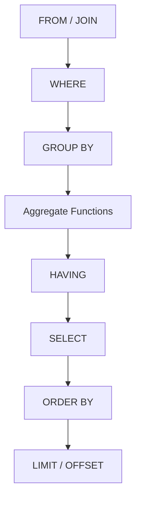
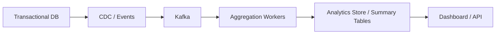

# 01- Aggregate Functions Introduction

## Overview

Aggregate functions reduce multiple input rows into a single calculated value. They are fundamental to reporting, analytics, dashboards, billing, monitoring, and application-level business metrics.

Unlike scalar functions, which generally operate on one value at a time, aggregate functions operate across a set of rows:

```text
Rows
 ├── 100
 ├── 200
 ├── 150
 └── 300
       │
       ▼
   Aggregate
       │
       ▼
      750
```

The most commonly used SQL aggregates are:

- `COUNT()` — count rows or non-NULL values
- `SUM()` — calculate a total
- `AVG()` — calculate an arithmetic mean
- `MIN()` — find the smallest value
- `MAX()` — find the largest value

Aggregate functions become especially important when combined with `GROUP BY`, `HAVING`, filtering, joins, indexes, and transactional data.

## Scalar vs Aggregate Functions

| Function type | Input | Output | Example |
|---|---|---|---|
| Scalar | One row/value | One value per input row | `LOWER(email)` |
| Aggregate | Multiple rows | One value per input set/group | `SUM(amount)` |
| Window | Multiple related rows | One value per input row | `SUM(amount) OVER (...)` |

A scalar expression might transform every order:

```sql
SELECT amount * 1.18 AS amount_with_tax
FROM orders;
```

An aggregate calculates across many orders:

```sql
SELECT SUM(amount) AS total_revenue
FROM orders;
```

## Common Aggregate Functions

| Function | Purpose | NULL handling |
|---|---|---|
| `COUNT(*)` | Count rows | Counts rows, including rows containing NULL values |
| `COUNT(column)` | Count non-NULL values | Ignores NULL |
| `COUNT(DISTINCT column)` | Count distinct non-NULL values | Ignores NULL |
| `SUM(column)` | Total numeric values | Ignores NULL |
| `AVG(column)` | Average numeric values | Ignores NULL |
| `MIN(column)` | Minimum value | Ignores NULL |
| `MAX(column)` | Maximum value | Ignores NULL |

Exact behavior can vary for specialized data types and database engines, but these NULL rules are broadly applicable to standard SQL.

## COUNT

`COUNT()` is one of the most important aggregates in backend systems.

### Counting Rows

```sql
SELECT COUNT(*) AS order_count
FROM orders;
```

This counts rows that satisfy the query's filtering conditions.

For example:

```sql
SELECT COUNT(*) AS completed_orders
FROM orders
WHERE status = 'completed';
```

### COUNT(*) vs COUNT(column)

These expressions are not equivalent:

```sql
COUNT(*)
COUNT(customer_id)
```

`COUNT(*)` counts qualifying rows.

`COUNT(customer_id)` counts only rows where `customer_id` is not NULL.

Example:

```text
orders
+----+-------------+
| id | customer_id |
+----+-------------+
| 1  | 101         |
| 2  | NULL        |
| 3  | 102         |
+----+-------------+
```

Then:

```sql
COUNT(*)          → 3
COUNT(customer_id) → 2
```

### COUNT(DISTINCT)

Use `COUNT(DISTINCT ...)` when the requirement is to count unique values:

```sql
SELECT COUNT(DISTINCT customer_id) AS active_customers
FROM orders
WHERE created_at >= :start_time
  AND created_at < :end_time;
```

This answers:

> How many distinct customers placed orders?

It does not answer:

> How many orders were placed?

That distinction is important in metrics and analytics.

## SUM

`SUM()` calculates the total of non-NULL numeric values.

```sql
SELECT SUM(amount) AS total_revenue
FROM orders
WHERE status = 'paid';
```

It is commonly used for:

- Revenue
- Transaction totals
- Quantities
- Usage metrics
- Inventory movement
- Billing calculations

### SUM and NULL

`SUM()` ignores NULL values.

If no qualifying non-NULL values exist, the result is generally `NULL`, not zero.

Therefore, reporting queries often use:

```sql
SELECT COALESCE(SUM(amount), 0) AS total_revenue
FROM orders
WHERE status = 'paid';
```

This distinction matters when application code expects a numeric value.

## AVG

`AVG()` calculates the arithmetic mean of non-NULL values.

```sql
SELECT AVG(amount) AS average_order_value
FROM orders
WHERE status = 'paid';
```

Conceptually:

```text
AVG = SUM(values) / COUNT(non-NULL values)
```

Do not assume:

```sql
AVG(amount)
```

is equivalent to:

```sql
SUM(amount) / COUNT(*)
```

because `COUNT(*)` includes rows where `amount` is NULL.

Use:

```sql
SUM(amount) / COUNT(amount)
```

only when that is actually the intended semantics and account for database-specific numeric type behavior.

## MIN and MAX

`MIN()` and `MAX()` identify the lowest and highest non-NULL values.

```sql
SELECT
    MIN(amount) AS minimum_order,
    MAX(amount) AS maximum_order
FROM orders
WHERE status = 'paid';
```

They can operate on more than numeric columns. Depending on the database, they can also be used with dates, timestamps, strings, and other orderable types.

For example:

```sql
SELECT
    MIN(created_at) AS first_order,
    MAX(created_at) AS latest_order
FROM orders;
```

This can be useful for operational reporting and determining data boundaries.

## Aggregate Query Lifecycle

A simplified logical processing model is:



The database's physical execution plan can differ substantially from this logical order. Optimizers may push filters down, choose indexes, reorder joins, or use parallel aggregation while preserving the required result semantics.

The important distinction is that `WHERE` filters input rows before grouping, while `HAVING` filters groups after aggregation.

## Aggregates Without GROUP BY

Without `GROUP BY`, the filtered input is treated as one aggregate group.

```sql
SELECT
    COUNT(*) AS order_count,
    SUM(amount) AS revenue,
    AVG(amount) AS average_order_value,
    MIN(amount) AS smallest_order,
    MAX(amount) AS largest_order
FROM orders
WHERE status = 'paid';
```

The result contains one row:

```text
order_count | revenue | average_order_value | smallest_order | largest_order
------------+---------+---------------------+----------------+--------------
12500       | ...     | ...                 | ...            | ...
```

This pattern is common for dashboard metrics and API summary endpoints.

## Aggregates with GROUP BY

`GROUP BY` divides the input rows into groups before aggregate functions are evaluated.

```sql
SELECT
    status,
    COUNT(*) AS order_count,
    SUM(amount) AS revenue
FROM orders
GROUP BY status;
```

Conceptually:

```text
All orders
    │
    ├── pending   → COUNT + SUM
    ├── paid      → COUNT + SUM
    ├── shipped   → COUNT + SUM
    └── cancelled → COUNT + SUM
```

Each group produces one result row.

### Multiple Grouping Columns

You can group by multiple dimensions:

```sql
SELECT
    tenant_id,
    status,
    COUNT(*) AS order_count,
    SUM(amount) AS revenue
FROM orders
GROUP BY tenant_id, status;
```

This produces one aggregate row for each unique `(tenant_id, status)` combination.

## WHERE vs HAVING

A common production mistake is confusing `WHERE` and `HAVING`.

`WHERE` filters rows before aggregation:

```sql
SELECT
    customer_id,
    SUM(amount) AS revenue
FROM orders
WHERE status = 'paid'
GROUP BY customer_id;
```

`HAVING` filters groups after aggregation:

```sql
SELECT
    customer_id,
    SUM(amount) AS revenue
FROM orders
WHERE status = 'paid'
GROUP BY customer_id
HAVING SUM(amount) >= 10000;
```

The second query means:

> Find customers whose paid-order revenue is at least 10,000.

Use `WHERE` for row-level predicates whenever possible. This can reduce the number of rows that need to be grouped and can improve execution efficiency.

## NULL Behavior

NULL handling is one of the most important aggregate concepts.

Consider:

```text
amount
------
100
NULL
200
```

Then:

```sql
COUNT(*)       → 3
COUNT(amount)  → 2
SUM(amount)    → 300
AVG(amount)    → 150
MIN(amount)    → 100
MAX(amount)    → 200
```

The aggregate functions other than `COUNT(*)` ignore NULL input values.

### Empty Input

Aggregates also differ when no rows qualify.

For example:

```sql
SELECT
    COUNT(*) AS count,
    SUM(amount) AS total,
    AVG(amount) AS average,
    MIN(amount) AS minimum,
    MAX(amount) AS maximum
FROM orders
WHERE 1 = 0;
```

Typical result:

```text
count | total | average | minimum | maximum
------+-------+---------+---------+--------
0     | NULL  | NULL    | NULL    | NULL
```

Use `COALESCE()` when the API or business contract requires a default:

```sql
SELECT COALESCE(SUM(amount), 0) AS total
FROM orders
WHERE status = 'paid';
```

## DISTINCT and Aggregates

`DISTINCT` can be applied inside an aggregate:

```sql
SELECT COUNT(DISTINCT customer_id)
FROM orders;
```

This performs two conceptual operations:

```text
orders
  ↓
unique customer_id values
  ↓
count
```

Be careful with distinct aggregates on large datasets. They may require significant memory, sorting, hashing, or specialized database execution strategies.

Do not use `DISTINCT` simply to hide duplicate rows produced by an incorrect join.

## Aggregates and JOINs

Joins can multiply rows before aggregation.

Consider:

```sql
SELECT
    c.id,
    SUM(o.amount) AS revenue
FROM customers AS c
JOIN orders AS o
    ON o.customer_id = c.id
GROUP BY c.id;
```

This is correct if each order should contribute exactly once.

Problems arise when another one-to-many table is joined simultaneously:

```text
customer
   │
   ├── orders
   │
   └── payments
```

Joining both child tables can create:

```text
orders × payments
```

rows for the same customer, causing aggregates to be inflated.

A safer strategy may be to aggregate each child relation independently before joining:

```sql
WITH order_totals AS (
    SELECT
        customer_id,
        SUM(amount) AS order_revenue
    FROM orders
    GROUP BY customer_id
),
payment_totals AS (
    SELECT
        customer_id,
        SUM(amount) AS payments
    FROM payments
    GROUP BY customer_id
)
SELECT
    c.id,
    COALESCE(o.order_revenue, 0) AS order_revenue,
    COALESCE(p.payments, 0) AS payments
FROM customers AS c
LEFT JOIN order_totals AS o
    ON o.customer_id = c.id
LEFT JOIN payment_totals AS p
    ON p.customer_id = c.id;
```

This prevents one child table from multiplying the rows of another before aggregation.

## Aggregate Performance

Aggregation can become expensive when processing large tables.

Potential costs include:

- Scanning many rows
- Sorting
- Hash aggregation
- Memory consumption
- Temporary storage
- Network transfer
- Parallel worker coordination

A query such as:

```sql
SELECT customer_id, SUM(amount)
FROM orders
GROUP BY customer_id;
```

may require processing a large portion of the table.

### Filter Early

Prefer:

```sql
SELECT customer_id, SUM(amount)
FROM orders
WHERE created_at >= :start_time
  AND created_at < :end_time
GROUP BY customer_id;
```

rather than aggregating the entire historical dataset and filtering later.

The optimizer may push predicates down automatically, but writing the intended predicate at the correct logical level keeps the query clear and gives the optimizer useful constraints.

## Index Considerations

Indexes do not automatically make every aggregate fast.

For example:

```sql
SELECT SUM(amount)
FROM orders
WHERE customer_id = :customer_id;
```

may benefit from an index beginning with `customer_id`, depending on the execution plan and table characteristics.

For common filtered aggregations:

```sql
WHERE tenant_id = :tenant_id
  AND created_at >= :start
  AND created_at < :end
```

an index such as:

```text
(tenant_id, created_at)
```

may be appropriate.

Index design should be based on actual workload, selectivity, query plans, and write costs.

Use the database's execution-plan tooling:

```sql
EXPLAIN
SELECT
    customer_id,
    SUM(amount)
FROM orders
WHERE tenant_id = 42
GROUP BY customer_id;
```

For production investigation, database-specific options such as PostgreSQL's `EXPLAIN (ANALYZE, BUFFERS)` can provide significantly more information, but they execute the statement and therefore require appropriate caution.

## Large-Scale Aggregation

For very large datasets, repeatedly calculating expensive aggregates from raw transactional tables may become impractical.

A production architecture may use:



Depending on requirements, alternatives include:

- Summary tables
- Materialized views
- Incrementally maintained counters
- Read replicas
- Analytical databases
- Event-driven aggregation
- Data warehouses

The correct solution depends on freshness requirements, consistency requirements, query volume, and operational complexity.

Do not prematurely denormalize metrics. Start with a correct query and measure its production behavior.

## Application and API Integration

Aggregate queries are common in REST APIs.

For example, an endpoint might return:

```json
{
  "order_count": 12500,
  "revenue": "1842500.00",
  "average_order_value": "147.40"
}
```

A Django query might use:

```python
from django.db.models import Avg, Count, Sum

metrics = Order.objects.filter(
    tenant_id=tenant_id,
    status="paid",
).aggregate(
    order_count=Count("id"),
    revenue=Sum("amount"),
    average_order_value=Avg("amount"),
)
```

Normalize NULL results at the API boundary when the API contract requires numeric defaults:

```python
response = {
    "order_count": metrics["order_count"] or 0,
    "revenue": metrics["revenue"] or 0,
    "average_order_value": metrics["average_order_value"],
}
```

For financial values, preserve appropriate decimal semantics rather than converting monetary values to binary floating-point types.

## Production Considerations

### Correctness

Before optimizing an aggregate, verify:

- What constitutes one row?
- What constitutes one business entity?
- Can joins multiply rows?
- Should NULL be ignored?
- Should an empty result be represented as NULL or zero?
- Is the metric calculated over the correct time window?
- Are soft-deleted or cancelled records included?

### Consistency

A metric calculated from a transactional database is subject to transaction isolation and concurrent writes.

For critical financial or operational metrics, define:

- Consistency requirements
- Snapshot semantics
- Time boundaries
- Currency handling
- Rounding rules
- Refund/chargeback treatment

Do not assume a dashboard number is automatically an authoritative financial value.

### Scalability

For high-volume systems:

- Restrict the input dataset before aggregation.
- Index common filter predicates.
- Avoid unnecessary joins before aggregation.
- Inspect execution plans.
- Consider pre-aggregation for repeatedly requested metrics.
- Move analytical workloads away from transactional databases when appropriate.

### Monitoring

Monitor important aggregate queries for:

- Execution latency
- Rows scanned
- Rows returned
- CPU utilization
- Memory usage
- Temporary disk usage
- Lock contention
- Query frequency

A query that takes 500 ms once per hour may be acceptable. The same query taking 500 ms hundreds of times per second is a capacity problem.

## Common Mistakes

| Mistake | Why it happens | Better approach |
|---|---|---|
| Using `COUNT(column)` when counting rows | NULL semantics are overlooked | Use `COUNT(*)` for row count |
| Assuming `SUM()` returns zero | Empty-set behavior is misunderstood | Use `COALESCE()` when required |
| Ignoring NULL in `AVG()` | `AVG()` ignores NULL values | Define the metric explicitly |
| Aggregating after multiple one-to-many joins | Join multiplication is missed | Aggregate child datasets separately |
| Using `HAVING` for row filtering | Logical processing is misunderstood | Use `WHERE` when filtering source rows |
| Adding `DISTINCT` to hide join errors | Duplicate rows are mistaken for duplicates in source data | Fix the join cardinality |
| Assuming indexes always accelerate aggregates | Aggregation cost depends on workload and plan | Inspect the execution plan |
| Calculating huge historical aggregates synchronously | Transactional DB is used as an analytics engine | Pre-aggregate or use an analytical system |
| Treating NULL and zero as equivalent | Business semantics are lost | Define NULL/default behavior explicitly |
| Returning floating-point money aggregates | Numeric precision can be lost | Use appropriate decimal/numeric types |

## Practical Review Checklist

When reviewing an aggregate query, verify:

- [ ] Is the aggregation level correct?
- [ ] Is `COUNT(*)` vs `COUNT(column)` intentional?
- [ ] Is NULL behavior understood?
- [ ] Is an empty aggregate result handled correctly?
- [ ] Are `WHERE` and `HAVING` used at the appropriate levels?
- [ ] Can joins multiply rows?
- [ ] Is `DISTINCT` semantically required?
- [ ] Is the time range explicit and correct?
- [ ] Is the query executed frequently enough to require optimization?
- [ ] Does the execution plan match expectations?
- [ ] Will the query remain practical at production data volume?
- [ ] Should the metric be pre-aggregated instead?

## Key Takeaways

- Aggregate functions reduce sets of rows into metrics such as counts, totals, averages, minimums, and maximums.
- `COUNT(*)`, `COUNT(column)`, and `COUNT(DISTINCT column)` have different semantics, especially around NULL values.
- Correct aggregation requires careful control of filtering, grouping, NULL behavior, and join cardinality; incorrect joins can silently inflate business metrics.
- Performance depends on input size, filtering, indexes, execution plans, and workload frequency; repeatedly expensive aggregates may require pre-aggregation or analytical infrastructure.
- Treat aggregate queries as business-critical logic: define their semantics, validate them against production-like data, and make NULL, time boundaries, consistency, and precision explicit.