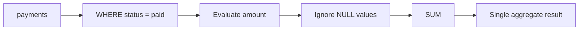

# 03- SUM

## Overview

`SUM` is an aggregate function that calculates the total of numeric values across rows. It is commonly used for financial totals, quantities, usage metrics, inventory, billing, and operational reporting.

The basic form is:

```sql
SELECT SUM(amount) AS total_amount
FROM orders;
```

Unlike `COUNT(*)`, `SUM` operates on values rather than simply counting rows. It also has important `NULL`, data-type, join-cardinality, and precision considerations that matter in production systems.

## Basic Syntax

```sql
SUM(expression)
```

Typical usage:

```sql
SELECT SUM(quantity) AS total_quantity
FROM order_items;
```

With filtering:

```sql
SELECT SUM(amount) AS paid_amount
FROM payments
WHERE status = 'paid';
```

With grouping:

```sql
SELECT
    customer_id,
    SUM(amount) AS total_spend
FROM payments
GROUP BY customer_id;
```

The expression can be a column or a calculated expression:

```sql
SELECT SUM(quantity * unit_price) AS gross_value
FROM order_items;
```

## How SUM Works

Conceptually, the database:

1. Identifies rows participating in the query.
2. Evaluates the `SUM` expression for each row.
3. Ignores NULL results.
4. Accumulates the remaining numeric values.
5. Returns the aggregate result.

For:

```sql
SELECT SUM(amount)
FROM payments
WHERE status = 'paid';
```

the logical flow is:



The physical execution plan may use different strategies such as sequential scans, index scans, parallel aggregation, partial aggregation, or other engine-specific optimizations.

## NULL Behavior

`SUM` ignores NULL values.

Given:

```text
amount
------
100
200
NULL
300
```

```sql
SELECT SUM(amount)
FROM payments;
```

returns:

```text
600
```

It does not treat NULL as zero during the aggregation.

### SUM Over No Rows

A critical distinction is that `SUM` returns `NULL` when no input values contribute to the aggregate.

For example:

```sql
SELECT SUM(amount) AS total
FROM payments
WHERE status = 'nonexistent';
```

The result is:

```text
NULL
```

If the application requires zero:

```sql
SELECT COALESCE(SUM(amount), 0) AS total
FROM payments
WHERE status = 'nonexistent';
```

This is especially important when serializing database results into API responses.

For example, an API usually should not unexpectedly return:

```json
{
  "total": null
}
```

when its contract defines the total as a numeric amount:

```json
{
  "total": 0
}
```

## SUM vs COUNT

`COUNT` answers:

> How many rows or values are there?

`SUM` answers:

> What is the total of these numeric values?

For example:

```sql
SELECT
    COUNT(*) AS payment_count,
    SUM(amount) AS payment_total
FROM payments
WHERE status = 'paid';
```

Result:

```text
payment_count | payment_total
--------------+--------------
125            | 84750.00
```

The two aggregates are often used together for reporting and operational metrics.

## SUM with WHERE

Filtering before aggregation is one of the most common patterns.

```sql
SELECT SUM(amount) AS revenue
FROM payments
WHERE status = 'completed'
  AND created_at >= :start_time
  AND created_at < :end_time;
```

The filter determines which payments contribute to the total.

For time ranges, half-open intervals are generally easier to compose:

```text
[start_time, end_time)
```

For example:

```sql
WHERE created_at >= '2026-08-01 00:00:00'
  AND created_at <  '2026-09-01 00:00:00'
```

This avoids ambiguity around fractional seconds at the end of the interval.

## SUM with GROUP BY

`SUM` becomes more useful when calculating totals per business dimension.

```sql
SELECT
    customer_id,
    SUM(amount) AS total_spend
FROM payments
WHERE status = 'completed'
GROUP BY customer_id;
```

This produces one aggregate result per customer.

Multiple dimensions can be grouped:

```sql
SELECT
    tenant_id,
    currency,
    SUM(amount) AS total_amount
FROM payments
WHERE status = 'completed'
GROUP BY tenant_id, currency;
```

Grouping by currency is important because summing different currencies into a single number is usually meaningless.

## SUM with HAVING

`HAVING` filters groups after aggregation.

For example, find customers whose completed purchases exceed `10000`:

```sql
SELECT
    customer_id,
    SUM(amount) AS total_spend
FROM payments
WHERE status = 'completed'
GROUP BY customer_id
HAVING SUM(amount) > 10000;
```

The logical sequence is:

```text
FROM
  ↓
WHERE
  ↓
GROUP BY
  ↓
SUM
  ↓
HAVING
  ↓
Result
```

`WHERE` filters individual rows, while `HAVING` filters aggregated groups.

## SUM with Expressions

`SUM` does not have to operate directly on a stored column.

For order items:

```sql
SELECT
    SUM(quantity * unit_price) AS subtotal
FROM order_items
WHERE order_id = :order_id;
```

This is useful when the stored schema contains components rather than a precomputed total.

Conditional calculations can also be expressed with `CASE`:

```sql
SELECT
    SUM(
        CASE
            WHEN status = 'refunded' THEN -amount
            ELSE amount
        END
    ) AS net_amount
FROM payments;
```

The business definition must be explicit. A financial "total" could mean gross sales, net sales, captured payments, settled payments, or another domain-specific value.

## Conditional Aggregation

Production reports often require several totals from the same dataset.

PostgreSQL supports the `FILTER` clause:

```sql
SELECT
    SUM(amount) AS total_amount,
    SUM(amount) FILTER (WHERE status = 'completed') AS completed_amount,
    SUM(amount) FILTER (WHERE status = 'refunded') AS refunded_amount,
    SUM(amount) FILTER (WHERE status = 'failed') AS failed_amount
FROM payments;
```

A portable alternative is conditional aggregation with `CASE`:

```sql
SELECT
    SUM(CASE WHEN status = 'completed' THEN amount ELSE 0 END) AS completed_amount,
    SUM(CASE WHEN status = 'refunded' THEN amount ELSE 0 END) AS refunded_amount
FROM payments;
```

For nullable amounts, `COALESCE` may be appropriate depending on the desired semantics:

```sql
SUM(CASE WHEN status = 'completed' THEN COALESCE(amount, 0) ELSE 0 END)
```

## SUM and JOIN Cardinality

Join cardinality is one of the most important production concerns when using aggregates.

Suppose:

```text
customers
   │
   ├── orders
   │
   └── payments
```

If a customer has:

```text
3 orders
2 payments
```

joining both one-to-many relationships directly can produce up to:

```text
3 × 2 = 6 joined rows
```

A naive aggregate can therefore multiply monetary values.

For example:

```sql
SELECT
    c.id,
    SUM(p.amount) AS total_paid
FROM customers AS c
JOIN orders AS o
    ON o.customer_id = c.id
JOIN payments AS p
    ON p.order_id = o.id
GROUP BY c.id;
```

This query may be correct if every payment belongs to exactly one order and the join does not introduce additional multiplicity. But adding another one-to-many relationship can change the result unexpectedly.

### Safer Aggregation Pattern

When multiple independent one-to-many relationships are involved, aggregate each relationship separately before joining:

```sql
WITH payment_totals AS (
    SELECT
        customer_id,
        SUM(amount) AS total_paid
    FROM payments
    WHERE status = 'completed'
    GROUP BY customer_id
)
SELECT
    c.id,
    COALESCE(pt.total_paid, 0) AS total_paid
FROM customers AS c
LEFT JOIN payment_totals AS pt
    ON pt.customer_id = c.id;
```

This keeps payment aggregation at the intended customer grain.

The senior-level rule is:

> Before using `SUM` across joins, identify the grain of every relation and verify that the join preserves the grain being aggregated.

## SUM with LEFT JOIN

`LEFT JOIN` is useful when entities with no related rows must still appear.

```sql
SELECT
    c.id,
    COALESCE(SUM(p.amount), 0) AS total_paid
FROM customers AS c
LEFT JOIN payments AS p
    ON p.customer_id = c.id
GROUP BY c.id;
```

A customer without payments still appears.

Without `COALESCE`, the aggregate can be NULL for customers where no payment values contribute.

This pattern is common for dashboards:

```text
customer_id | total_paid
------------+-----------
101         | 1500.00
102         | 0
103         | 750.00
```

## SUM and DISTINCT

`SUM(DISTINCT expression)` sums distinct values rather than distinct rows.

```sql
SELECT SUM(DISTINCT amount)
FROM payments;
```

If the data is:

```text
100
100
200
```

the result is:

```text
300
```

not:

```text
400
```

This is often misunderstood.

`SUM(DISTINCT amount)` does **not** mean:

> Sum each payment once.

It means:

> Sum each distinct numeric value once.

Therefore, if two legitimate payments both have an amount of `100`, one of them is excluded.

Do not use `SUM(DISTINCT amount)` as a generic fix for duplicate rows caused by a bad join. Fix the join or aggregate at the correct grain instead.

## Monetary Values and Precision

Financial calculations require careful data types.

Avoid using floating-point columns for exact monetary amounts when the database provides an appropriate exact numeric type.

For PostgreSQL, a common choice is:

```sql
amount NUMERIC(19, 4)
```

The appropriate precision and scale depend on the domain.

For example:

```sql
CREATE TABLE payments (
    id BIGINT PRIMARY KEY,
    amount NUMERIC(19, 4) NOT NULL,
    currency CHAR(3) NOT NULL
);
```

Then:

```sql
SELECT SUM(amount) AS total_amount
FROM payments;
```

can preserve exact decimal semantics appropriate for financial calculations.

### Integer Minor Units

Another common approach is storing monetary values as integer minor units:

```text
₹125.50 → 12550 paise
$125.50 → 12550 cents
```

Then:

```sql
amount_minor BIGINT NOT NULL
```

and:

```sql
SELECT SUM(amount_minor)
FROM payments;
```

This can simplify exact arithmetic, but the application must consistently know the currency and scale.

Do not blindly sum amounts from different currencies:

```sql
SELECT SUM(amount)
FROM payments;
```

unless all rows are guaranteed to represent the same currency.

## SUM and Data Types

The result type of `SUM` is database-specific and can differ from the input column type.

This matters for:

- Integer overflow
- Decimal precision
- Numeric scale
- Application deserialization
- ORM type mapping

For high-volume systems, consider whether the accumulated total can exceed the range of the underlying type.

For example, repeatedly summing a large integer column can produce a result larger than an individual row value.

Use the database's documented aggregate type behavior and choose appropriate numeric types for the domain.

## SUM and Indexes

An index does not automatically make:

```sql
SELECT SUM(amount)
FROM payments;
```

fast.

The database may still need to process a large portion of the table.

Indexes become more useful when filtering substantially reduces the input:

```sql
SELECT SUM(amount)
FROM payments
WHERE tenant_id = :tenant_id
  AND created_at >= :start_time
  AND created_at < :end_time;
```

A possible index is:

```sql
CREATE INDEX idx_payments_tenant_created_at
ON payments (tenant_id, created_at);
```

Whether this improves the query depends on data distribution, selectivity, table size, query frequency, and the database optimizer.

Validate with an execution plan:

```sql
EXPLAIN (ANALYZE, BUFFERS)
SELECT SUM(amount)
FROM payments
WHERE tenant_id = 42
  AND created_at >= TIMESTAMP '2026-08-01 00:00:00'
  AND created_at < TIMESTAMP '2026-09-01 00:00:00';
```

## Large-Scale SUM Queries

Repeated aggregation over very large tables can become expensive.

For example:

```sql
SELECT SUM(amount)
FROM events;
```

may require scanning a large amount of data.

For high-volume reporting systems, possible strategies include:

| Strategy | Use case | Tradeoff |
|---|---|---|
| Direct aggregation | Moderate data volume | Simple but potentially expensive |
| Appropriate indexes | Selective filters | Additional write/storage cost |
| Summary tables | Frequently requested metrics | Requires maintenance |
| Materialized views | Repeated analytical queries | Refresh complexity/staleness |
| Pre-aggregated daily/monthly data | Time-series reporting | Less flexibility |
| Read replicas | Offloading analytical reads | Replication lag |
| Analytical database | Large-scale reporting | Additional infrastructure |
| Application counters | High-frequency known metrics | Requires consistency handling |

For example, instead of repeatedly summing billions of payment records, a reporting system might maintain daily totals:

```text
payment_daily_totals
--------------------
date
tenant_id
currency
total_amount
```

Then monthly reports can aggregate a much smaller dataset.

The tradeoff is consistency: precomputed totals must be updated correctly when payments are created, corrected, refunded, or otherwise changed.

## SUM and Transaction Consistency

Aggregation queries observe data according to the database's transaction and isolation semantics.

Suppose an API performs:

```text
SUM payments
       ↓
fetch payment records
       ↓
return both
```

If these are separate statements, concurrent transactions may modify data between them.

The resulting total and returned records may therefore represent different database states.

If exact consistency matters, define the required transaction boundary and isolation level rather than assuming two queries automatically observe the same snapshot.

## SUM in Django

Django provides `Sum` through its aggregation API:

```python
from django.db.models import Sum

total_paid = (
    Payment.objects
    .filter(
        tenant_id=tenant_id,
        status="completed",
    )
    .aggregate(total=Sum("amount"))
)["total"]
```

If no matching rows exist, Django may return `None`.

When the application contract requires zero:

```python
from decimal import Decimal
from django.db.models import Sum, Value
from django.db.models.functions import Coalesce

total_paid = (
    Payment.objects
    .filter(
        tenant_id=tenant_id,
        status="completed",
    )
    .aggregate(
        total=Coalesce(
            Sum("amount"),
            Value(Decimal("0")),
        )
    )
)["total"]
```

For grouped totals:

```python
from django.db.models import Sum

totals = (
    Payment.objects
    .filter(tenant_id=tenant_id, status="completed")
    .values("currency")
    .annotate(total=Sum("amount"))
)
```

Inspect the generated SQL for complex ORM queries, particularly when joins and annotations are involved.

## SUM in Backend APIs

A REST API might expose an aggregate:

```json
{
  "currency": "INR",
  "total_paid": "125000.50"
}
```

For financial values, returning decimal amounts as strings can avoid accidental floating-point conversion in clients that do not preserve decimal precision.

The API contract should also explicitly define:

- Currency
- Precision
- Included statuses
- Timezone and time boundaries
- Refund treatment
- Soft-deleted records
- Authorization scope
- Whether the value is exact or eventually consistent

A production metric is not fully defined by its SQL expression alone.

## Common Mistakes

| Mistake | Problem | Better approach |
|---|---|---|
| Assuming NULL contributes zero automatically | No contributing rows can produce NULL | Use `COALESCE` when zero is required |
| Using `SUM(DISTINCT amount)` to remove join duplicates | Legitimate equal-valued rows can be discarded | Fix join cardinality or aggregate before joining |
| Summing across multiple currencies | Produces a meaningless total | Group by currency or normalize currencies |
| Using floating point for financial totals | Can introduce precision errors | Use exact decimal types or integer minor units |
| Ignoring join multiplication | Values may be overstated | Determine relation grain before aggregation |
| Assuming an index guarantees fast SUM | Aggregation may still require large scans | Check the execution plan |
| Recomputing huge totals on every request | Can overload the primary database | Pre-aggregate, cache, or use analytical infrastructure |
| Returning NULL when API expects zero | Creates inconsistent API semantics | Normalize with `COALESCE` |
| Treating a business total as a simple SQL total | Status/refund/authorization rules may be missing | Define the metric precisely |
| Assuming separate queries share one snapshot | Concurrent writes can change results | Use appropriate transaction semantics |

## Interview Traps

### SUM and NULL

Given:

```text
10
20
NULL
```

```sql
SELECT SUM(value)
FROM metrics;
```

returns:

```text
30
```

But if no rows contribute:

```sql
SELECT SUM(value)
FROM metrics
WHERE false;
```

the result is:

```text
NULL
```

not `0`.

### SUM(DISTINCT)

Given:

```text
100
100
200
```

```sql
SUM(value)            → 400
SUM(DISTINCT value)   → 300
```

`DISTINCT` applies to the values being aggregated.

### LEFT JOIN

For customers with no payments:

```sql
SELECT
    c.id,
    SUM(p.amount)
FROM customers AS c
LEFT JOIN payments AS p
    ON p.customer_id = c.id
GROUP BY c.id;
```

The customer remains in the result, but the aggregate may be NULL.

Use:

```sql
COALESCE(SUM(p.amount), 0)
```

when the business meaning of no payments is zero.

### JOIN Multiplication

If a join produces two rows for the same payment, this:

```sql
SUM(payment.amount)
```

counts the payment twice.

`SUM` cannot determine whether duplicate rows are accidental. Query correctness depends on the relational structure and join conditions.

## Production Checklist

Before shipping a `SUM` query, verify:

- [ ] What exactly does the business metric represent?
- [ ] Should NULL produce NULL or zero?
- [ ] Are all aggregated values in the same currency and unit?
- [ ] Is the numeric data type appropriate for the maximum possible total?
- [ ] Could a JOIN multiply rows?
- [ ] Is `DISTINCT` genuinely part of the business requirement?
- [ ] Are refunds, cancellations, and corrections handled correctly?
- [ ] Are time boundaries and time zones explicitly defined?
- [ ] Does the query operate at production-scale data volume?
- [ ] Has the execution plan been inspected?
- [ ] Are indexes appropriate for the filtering predicates?
- [ ] Should the metric be pre-aggregated or cached?
- [ ] Does the API contract define precision and NULL behavior?
- [ ] Is transaction consistency important?

## Key Takeaways

- `SUM` aggregates numeric values while ignoring NULL values, but returns `NULL` when no values contribute; use `COALESCE` when the API or business contract requires zero.
- Join cardinality is a major correctness concern: aggregate at the intended grain and do not use `SUM(DISTINCT amount)` as a generic duplicate-removal mechanism.
- Financial totals require exact numeric semantics, explicit currency handling, and clearly defined business rules for statuses, refunds, and corrections.
- Indexes can reduce the input to an aggregation but do not inherently make large `SUM` operations cheap; validate performance with real execution plans and production-scale data.
- At large scale, repeated exact aggregation may require summary tables, materialized views, pre-aggregation, replicas, or analytical infrastructure rather than repeatedly scanning transactional data.