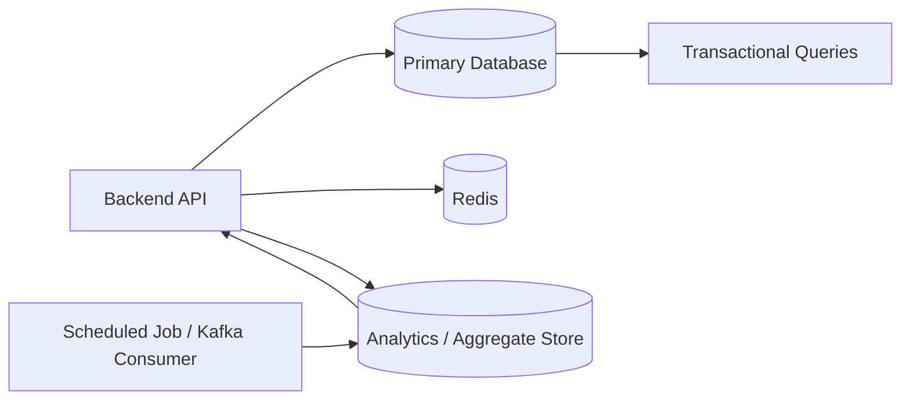

# 08- GROUP BY

## Overview

`GROUP BY` transforms a set of rows into groups that share the same values for one or more expressions. Aggregate functions such as `COUNT`, `SUM`, `AVG`, `MIN`, and `MAX` can then calculate one result per group.

This is fundamental to backend reporting and data aggregation:

- Revenue by customer
- Orders by status
- API requests by endpoint
- Users by country
- Sales by day
- Error counts by service
- Average order value by tenant

The core pattern is:

```sql
SELECT
    grouping_column,
    aggregate_function(...)
FROM table_name
GROUP BY grouping_column;
```

For example:

```sql
SELECT
    status,
    COUNT(*) AS order_count
FROM orders
GROUP BY status;
```

Instead of returning one result per order, the database returns one result per distinct `status`.

## Why GROUP BY Exists

Without grouping, an aggregate normally produces one result for the entire filtered input:

```sql
SELECT COUNT(*)
FROM orders;
```

With `GROUP BY`, the same aggregation is performed independently for each group:

```sql
SELECT
    status,
    COUNT(*) AS order_count
FROM orders
GROUP BY status;
```

Conceptually:

```text
All matching rows
       │
       ▼
┌─────────────────┐
│ Group by status │
└─────────────────┘
       │
       ├── pending   → COUNT(*)
       ├── paid      → COUNT(*)
       ├── shipped   → COUNT(*)
       └── cancelled → COUNT(*)
```

`GROUP BY` is therefore a relational operation that changes the granularity of the result.

## Basic Syntax

```sql
SELECT
    grouping_expression,
    aggregate_function(column)
FROM table_name
WHERE filtering_condition
GROUP BY grouping_expression;
```

Example:

```sql
SELECT
    customer_id,
    COUNT(*) AS order_count,
    SUM(total_amount) AS total_spent
FROM orders
WHERE created_at >= CURRENT_DATE - INTERVAL '30 days'
GROUP BY customer_id;
```

The result has one row per `customer_id`.

## Grouping by a Single Column

Consider:

```text
orders
+----+-------------+--------+
| id | status      | amount |
+----+-------------+--------+
| 1  | paid        | 100    |
| 2  | pending     | 50     |
| 3  | paid        | 200    |
| 4  | cancelled   | 75     |
| 5  | paid        | 150    |
+----+-------------+--------+
```

Query:

```sql
SELECT
    status,
    COUNT(*) AS order_count
FROM orders
GROUP BY status;
```

Result:

```text
status     | order_count
-----------+------------
cancelled  | 1
paid       | 3
pending    | 1
```

Each distinct `status` becomes a group.

## GROUP BY with Multiple Aggregates

A group can have several aggregate calculations:

```sql
SELECT
    status,
    COUNT(*) AS order_count,
    SUM(amount) AS total_amount,
    AVG(amount) AS average_amount,
    MIN(amount) AS minimum_amount,
    MAX(amount) AS maximum_amount
FROM orders
GROUP BY status;
```

The database produces one row per status with multiple metrics.

This is a common pattern for dashboards and reporting APIs.

## GROUP BY Multiple Columns

Multiple grouping columns produce groups based on the **combination** of their values.

```sql
SELECT
    customer_id,
    status,
    COUNT(*) AS order_count
FROM orders
GROUP BY customer_id, status;
```

The grouping key is effectively:

```text
(customer_id, status)
```

For example:

```text
customer_id | status   | order_count
------------+----------+------------
10          | paid     | 4
10          | pending  | 1
20          | paid     | 2
20          | shipped  | 3
```

`customer_id = 10` with `paid` is a different group from `customer_id = 10` with `pending`.

### Practical Rule

If the report needs a separate result for every combination of dimensions, those dimensions belong in `GROUP BY`.

For example:

```sql
SELECT
    tenant_id,
    DATE(created_at),
    COUNT(*) AS request_count
FROM api_requests
GROUP BY tenant_id, DATE(created_at);
```

This produces metrics per tenant per day.

## GROUP BY and WHERE

`WHERE` filters rows **before** grouping.

```sql
SELECT
    status,
    COUNT(*) AS order_count
FROM orders
WHERE created_at >= DATE '2026-01-01'
GROUP BY status;
```

The database first removes rows that do not satisfy the `WHERE` condition and then groups the remaining rows.

Conceptually:

```text
Table
  │
  ▼
WHERE
  │
  ▼
Filtered rows
  │
  ▼
GROUP BY
  │
  ▼
Groups
  │
  ▼
Aggregates
```

This is different from `HAVING`.

## GROUP BY and HAVING

`HAVING` filters **groups after aggregation**.

For example:

```sql
SELECT
    customer_id,
    COUNT(*) AS order_count
FROM orders
GROUP BY customer_id
HAVING COUNT(*) >= 10;
```

This means:

> Group orders by customer, calculate the order count, then keep only customers with at least 10 orders.

### WHERE vs HAVING

| Clause | Operates on | Typical purpose |
|---|---|---|
| `WHERE` | Individual rows | Filter input rows |
| `GROUP BY` | Remaining rows | Form groups |
| `HAVING` | Groups | Filter aggregate results |

Prefer `WHERE` whenever a condition can be applied before grouping.

For example:

```sql
SELECT
    customer_id,
    COUNT(*) AS order_count
FROM orders
WHERE status = 'paid'
GROUP BY customer_id
HAVING COUNT(*) >= 10;
```

This is generally preferable to trying to filter `status` through `HAVING`, because only relevant rows participate in grouping.

## Logical Query Processing Order

Although SQL is written as:

```sql
SELECT
    ...
FROM
    ...
WHERE
    ...
GROUP BY
    ...
HAVING
    ...
ORDER BY
    ...;
```

the conceptual logical processing order is approximately:

```text
FROM / JOIN
     │
     ▼
WHERE
     │
     ▼
GROUP BY
     │
     ▼
HAVING
     │
     ▼
SELECT
     │
     ▼
ORDER BY
```

This explains several common SQL rules.

For example, a `SELECT` alias generally cannot be referenced by `WHERE` because `WHERE` is logically evaluated before `SELECT`.

The exact physical execution plan chosen by the database optimizer can differ substantially from this logical order.

## GROUP BY and SELECT

A common SQL rule is that a selected expression must either:

- Be part of the grouping key, or
- Be aggregated

For example:

```sql
SELECT
    customer_id,
    COUNT(*) AS order_count
FROM orders
GROUP BY customer_id;
```

is valid.

But this query is generally invalid:

```sql
SELECT
    customer_id,
    status,
    COUNT(*) AS order_count
FROM orders
GROUP BY customer_id;
```

Why?

For one `customer_id`, there may be multiple `status` values. The database cannot determine which `status` should appear in the result.

The correct query depends on the desired granularity:

```sql
SELECT
    customer_id,
    status,
    COUNT(*) AS order_count
FROM orders
GROUP BY customer_id, status;
```

Or aggregate the status information if that is what the application requires.

## Functional Dependencies

Some databases, particularly PostgreSQL, can recognize certain functional dependencies when determining whether non-grouped columns are valid.

For example, grouping by a table's primary key can allow other columns from that same table in some query forms because the primary key functionally determines them.

However, relying on database-specific functional-dependency behavior can reduce portability.

For production SQL intended to be portable and immediately understandable, explicitly grouping or aggregating selected expressions is usually clearer.

## GROUP BY and NULL

`NULL` grouping behavior is important.

Consider:

```text
country
-------
IN
IN
US
NULL
NULL
```

Query:

```sql
SELECT
    country,
    COUNT(*) AS user_count
FROM users
GROUP BY country;
```

Rows with NULL `country` values belong to the same group.

Conceptually:

```text
country | user_count
--------+-----------
IN      | 2
US      | 1
NULL    | 2
```

This differs from aggregate input semantics where functions such as `COUNT(column)` ignore NULL.

The distinction is:

> `NULL` values can form a GROUP BY group, while NULL aggregate inputs are generally ignored by most aggregate functions.

## GROUP BY and NULL Aggregates

Consider:

```text
customer_id | amount
------------+-------
1           | 100
1           | NULL
2           | NULL
```

Query:

```sql
SELECT
    customer_id,
    COUNT(*) AS rows,
    COUNT(amount) AS non_null_amounts,
    SUM(amount) AS total_amount
FROM payments
GROUP BY customer_id;
```

Conceptually:

```text
customer_id | rows | non_null_amounts | total_amount
------------+------+------------------+-------------
1           | 2    | 1                | 100
2           | 1    | 0                | NULL
```

Do not interpret `NULL` aggregate results as zero without considering the domain semantics.

If zero is explicitly required:

```sql
SELECT
    customer_id,
    COALESCE(SUM(amount), 0) AS total_amount
FROM payments
GROUP BY customer_id;
```

## GROUP BY with Expressions

The grouping key does not have to be a physical column.

You can group by an expression:

```sql
SELECT
    DATE(created_at) AS order_date,
    COUNT(*) AS order_count
FROM orders
GROUP BY DATE(created_at);
```

This is useful for:

- Daily metrics
- Monthly reporting
- Categorization
- Derived dimensions
- Time-based dashboards

For larger production datasets, be careful with expressions on indexed columns. The database may not be able to use an ordinary index as efficiently as it could for a direct column predicate.

For high-volume time-series reporting, consider appropriate indexes, generated columns, partitioning, or pre-aggregated data where justified.

## GROUP BY Date and Time

A common backend reporting requirement is daily aggregation:

```sql
SELECT
    DATE(created_at) AS day,
    COUNT(*) AS order_count,
    SUM(total_amount) AS revenue
FROM orders
WHERE created_at >= :start_time
  AND created_at < :end_time
GROUP BY DATE(created_at)
ORDER BY day;
```

For production systems, define the timezone explicitly.

A timestamp representing:

```text
2026-08-30 23:30 UTC
```

may belong to a different business day in another timezone.

Do not assume that database server timezone, application timezone, and customer timezone are automatically identical.

## GROUP BY and JOIN

Grouping frequently occurs after joins.

Example:

```sql
SELECT
    c.id,
    c.name,
    COUNT(o.id) AS order_count,
    COALESCE(SUM(o.total_amount), 0) AS total_spent
FROM customers AS c
LEFT JOIN orders AS o
    ON o.customer_id = c.id
GROUP BY c.id, c.name;
```

The `LEFT JOIN` preserves customers with no orders.

Using:

```sql
COUNT(o.id)
```

rather than:

```sql
COUNT(*)
```

is important because unmatched `LEFT JOIN` rows still produce one joined row, but `o.id` is NULL.

Conceptually:

```text
Customer
   │
   ├── Orders
   │     │
   │     └── Group by customer
   │
   └── No orders
         │
         └── COUNT(o.id) = 0
```

## Avoiding Join Multiplication

A more advanced issue occurs when joining multiple one-to-many relationships.

Suppose a customer has:

- 3 orders
- 4 support tickets

A query joining both tables directly can produce:

```text
3 × 4 = 12
```

joined rows for that customer.

Aggregates may then be inflated.

For example:

```sql
SELECT
    c.id,
    COUNT(o.id) AS order_count,
    COUNT(t.id) AS ticket_count
FROM customers AS c
LEFT JOIN orders AS o
    ON o.customer_id = c.id
LEFT JOIN tickets AS t
    ON t.customer_id = c.id
GROUP BY c.id;
```

could produce incorrect counts because each order is repeated for every ticket.

Possible solutions include:

- Pre-aggregate each one-to-many relationship separately.
- Use `COUNT(DISTINCT ...)` when appropriate.
- Use correlated subqueries when they produce a better plan.
- Restructure the query around the required grain.

For example:

```sql
WITH order_counts AS (
    SELECT
        customer_id,
        COUNT(*) AS order_count
    FROM orders
    GROUP BY customer_id
),
ticket_counts AS (
    SELECT
        customer_id,
        COUNT(*) AS ticket_count
    FROM tickets
    GROUP BY customer_id
)
SELECT
    c.id,
    COALESCE(oc.order_count, 0) AS order_count,
    COALESCE(tc.ticket_count, 0) AS ticket_count
FROM customers AS c
LEFT JOIN order_counts AS oc
    ON oc.customer_id = c.id
LEFT JOIN ticket_counts AS tc
    ON tc.customer_id = c.id;
```

This preserves the correct aggregation grain.

## GROUP BY and DISTINCT

`GROUP BY` and `DISTINCT` can sometimes appear to produce similar results:

```sql
SELECT DISTINCT customer_id
FROM orders;
```

and:

```sql
SELECT customer_id
FROM orders
GROUP BY customer_id;
```

Both can return one row per customer.

But they serve different purposes.

| `DISTINCT` | `GROUP BY` |
|---|---|
| Removes duplicate result rows | Forms groups |
| Primarily about uniqueness | Primarily about aggregation |
| Usually simpler for unique values | Required when calculating grouped aggregates |
| Cannot replace aggregation conceptually | Can sometimes produce distinct values |

Use `DISTINCT` when the requirement is uniqueness.

Use `GROUP BY` when the requirement is grouped computation.

## GROUP BY with Conditional Aggregation

Conditional aggregation is one of the most useful production patterns.

PostgreSQL:

```sql
SELECT
    customer_id,
    COUNT(*) AS total_orders,
    COUNT(*) FILTER (
        WHERE status = 'paid'
    ) AS paid_orders,
    COUNT(*) FILTER (
        WHERE status = 'cancelled'
    ) AS cancelled_orders,
    COALESCE(
        SUM(total_amount) FILTER (
            WHERE status = 'paid'
        ),
        0
    ) AS paid_revenue
FROM orders
GROUP BY customer_id;
```

This produces several metrics in one grouped query.

A portable `CASE` form is:

```sql
SELECT
    customer_id,
    COUNT(*) AS total_orders,
    SUM(CASE WHEN status = 'paid' THEN 1 ELSE 0 END) AS paid_orders,
    SUM(CASE WHEN status = 'cancelled' THEN 1 ELSE 0 END) AS cancelled_orders
FROM orders
GROUP BY customer_id;
```

This pattern is common in reporting APIs and operational dashboards.

## GROUP BY and ORDER BY

Grouped results can be sorted:

```sql
SELECT
    customer_id,
    SUM(total_amount) AS total_spent
FROM orders
GROUP BY customer_id
ORDER BY total_spent DESC;
```

The database sorts the grouped result rather than the original individual rows.

You can also use the aggregate expression directly:

```sql
ORDER BY SUM(total_amount) DESC;
```

Using an alias is generally easier to read when supported by the target database.

## GROUP BY and Pagination

Pagination over grouped results requires understanding the result's grain.

Suppose:

```sql
SELECT
    customer_id,
    COUNT(*) AS order_count
FROM orders
GROUP BY customer_id
ORDER BY order_count DESC, customer_id;
```

The pagination unit is now:

```text
one row = one customer group
```

not:

```text
one row = one order
```

For stable pagination, use a deterministic tie-breaker:

```sql
ORDER BY
    order_count DESC,
    customer_id ASC;
```

For large grouped result sets, keyset pagination may require carrying all ordering dimensions in the cursor and ensuring the ordering is deterministic.

## Internal Execution

A database typically needs to perform three conceptual operations for a grouped aggregate:

```text
Input rows
    │
    ▼
Read / filter rows
    │
    ▼
Build groups
    │
    ▼
Calculate aggregates
    │
    ▼
Produce grouped result
```

The optimizer can choose different physical strategies.

Common strategies include:

### Hash Aggregation

The database maintains an in-memory hash structure keyed by the grouping columns.

Conceptually:

```text
(customer_id=10) → aggregate state
(customer_id=20) → aggregate state
(customer_id=30) → aggregate state
```

Advantages:

- Efficient for many unsorted inputs
- Often avoids sorting
- Good for equality-based grouping

Limitations:

- Requires memory
- Large numbers of groups can cause memory pressure
- May spill to disk depending on the database and configuration

### Sort-Based Aggregation

The database sorts rows by grouping keys and processes adjacent rows belonging to the same group.

Conceptually:

```text
Input
  │
  ▼
Sort by customer_id
  │
  ▼
10, 10, 10, 20, 20, 30
  │
  ▼
Aggregate adjacent groups
```

Advantages:

- Naturally supports ordered grouping
- Can work well when useful ordering already exists

Limitations:

- Sorting can be expensive
- Large sorts may require temporary disk I/O

The actual plan depends on the database engine, indexes, statistics, memory configuration, data distribution, and query shape.

## Performance Considerations

### Filter Before Grouping

Push selective filters into `WHERE` where possible:

```sql
SELECT
    customer_id,
    COUNT(*) AS order_count
FROM orders
WHERE created_at >= :start_date
GROUP BY customer_id;
```

Reducing the input rows reduces aggregation work.

### Indexes

Indexes can help with:

- Filtering before aggregation
- Joining
- Sometimes providing useful ordering

An index does not automatically make every `GROUP BY` fast.

For example:

```sql
GROUP BY customer_id
```

may still require substantial work if the query scans a large portion of the table.

Always validate with the database's execution plan:

```sql
EXPLAIN (ANALYZE, BUFFERS)
SELECT
    customer_id,
    COUNT(*)
FROM orders
WHERE created_at >= DATE '2026-01-01'
GROUP BY customer_id;
```

### Cardinality Matters

The number of distinct groups is often more important than the raw row count.

For example:

```text
10 million rows
100 groups
```

may be significantly easier to aggregate than:

```text
10 million rows
8 million groups
```

A high-cardinality grouping key can increase:

- Memory consumption
- Hash table size
- Sort cost
- Temporary disk usage
- Network transfer of grouped results

## Production Architecture

For a high-traffic backend, avoid automatically executing expensive ad-hoc `GROUP BY` queries against transactional tables on every API request.

A common architecture is:



Depending on requirements, aggregated data may be maintained through:

- Materialized views
- Scheduled jobs
- Kafka consumers
- Background workers such as Celery
- Analytics databases
- Dedicated reporting tables
- Data warehouses

The correct choice depends on freshness requirements, query complexity, data volume, and operational cost.

## Django ORM

Django supports grouped aggregation through `values()` followed by aggregation.

Example:

```python
from django.db.models import Count, Sum

customer_metrics = (
    Order.objects
    .values("customer_id")
    .annotate(
        order_count=Count("id"),
        total_spent=Sum("total_amount"),
    )
    .order_by("-total_spent")
)
```

Conceptually, Django generates SQL similar to:

```sql
SELECT
    customer_id,
    COUNT(id) AS order_count,
    SUM(total_amount) AS total_spent
FROM orders
GROUP BY customer_id
ORDER BY total_spent DESC;
```

When using ORM aggregation across relationships, inspect the generated SQL and validate the aggregation grain. ORM syntax can make complex joins look simpler than the SQL actually executed.

## Common Mistakes and Pitfalls

| Mistake | Problem | Better approach |
|---|---|---|
| Selecting a non-grouped, non-aggregated column | Value may be ambiguous | Add it to `GROUP BY` or aggregate it |
| Using `HAVING` for ordinary row filtering | Filters after grouping | Use `WHERE` when possible |
| Forgetting a grouping dimension | Different logical groups are merged | Define the required result grain first |
| Using `COUNT(*)` after a `LEFT JOIN` | Unmatched parents can count as one row | Count a nullable child key such as `COUNT(o.id)` |
| Joining multiple one-to-many tables before grouping | Rows can multiply and inflate aggregates | Pre-aggregate relationships or use distinct logic |
| Assuming GROUP BY sorts results | Grouping does not guarantee output order | Use explicit `ORDER BY` |
| Grouping by a high-cardinality column blindly | Can create huge hash/sort workloads | Measure cardinality and query cost |
| Applying functions to indexed columns without analysis | Can reduce index usefulness | Check the execution plan |
| Ignoring timezone during date grouping | Metrics can fall into the wrong business day | Define timezone semantics explicitly |
| Treating NULL aggregate results as zero | Can hide missing data | Use `COALESCE` only when domain semantics require it |
| Paginating without deterministic ordering | Rows can move between pages | Use a stable tie-breaker |
| Running heavy reports on OLTP traffic | Can compete with transactional workloads | Use caching, replicas, materialized views, or analytics storage where appropriate |

## Interview Traps

### Is GROUP BY Required for Every Aggregate?

No.

This is valid:

```sql
SELECT COUNT(*)
FROM orders;
```

`GROUP BY` is required when you need separate aggregate results for groups.

### WHERE vs HAVING?

Use:

```text
WHERE  → filter rows before grouping
HAVING → filter groups after aggregation
```

### Does GROUP BY Sort the Result?

No.

If ordering matters:

```sql
ORDER BY ...
```

must be specified.

### Can You SELECT a Column That Is Not in GROUP BY?

Generally, a selected expression must either be grouped or aggregated. Some databases can permit additional columns in specific cases because of functional dependencies, but relying on database-specific behavior can hurt portability.

### Why Can COUNT Be Wrong After Multiple JOINs?

Because joins can multiply rows before aggregation.

If one customer has 3 orders and 4 tickets, a direct join can produce 12 intermediate rows. Aggregating that result can inflate counts.

### GROUP BY vs DISTINCT?

`DISTINCT` expresses uniqueness of result rows.

`GROUP BY` expresses grouping, usually for aggregation.

They can produce similar results in simple queries, but they communicate different intent.

## Production Checklist

Before shipping a grouped query:

- [ ] Define the exact grain of one result row.
- [ ] Verify every selected expression is grouped or aggregated appropriately.
- [ ] Filter rows with `WHERE` before grouping where possible.
- [ ] Use `HAVING` only for group-level conditions.
- [ ] Check NULL semantics for aggregate expressions.
- [ ] Validate `LEFT JOIN` counting behavior.
- [ ] Check for row multiplication across multiple one-to-many joins.
- [ ] Add deterministic `ORDER BY` when results are paginated.
- [ ] Consider grouping-key cardinality.
- [ ] Inspect `EXPLAIN` / `EXPLAIN ANALYZE` for expensive queries.
- [ ] Consider replicas, caching, materialized views, or analytics storage for heavy reporting workloads.
- [ ] Define timezone semantics for time-based grouping.
- [ ] Test realistic data volumes, not only development-sized datasets.

## Key Takeaways

- `GROUP BY` changes query granularity by producing one result row per distinct grouping key or combination of keys.
- `WHERE` filters rows before grouping, while `HAVING` filters groups after aggregation.
- Always reason about the result grain, especially when joins are involved; multiple one-to-many joins can multiply rows and corrupt aggregate results.
- `GROUP BY` does not guarantee ordering, and large or high-cardinality groups can create significant memory, sorting, and disk-I/O costs.
- Production grouped queries should be validated with execution plans and moved toward caching, pre-aggregation, replicas, or analytics systems when OLTP workloads cannot safely absorb the reporting cost.