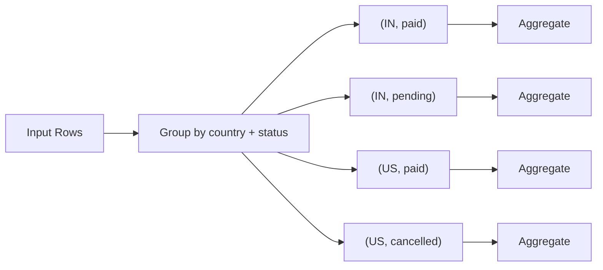
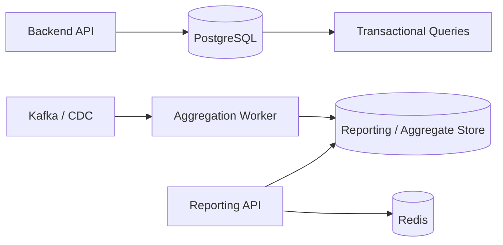

# 09- GROUP BY Multiple Columns

## Overview

`GROUP BY` can group rows by multiple columns or expressions. In that case, the database creates one group for each **distinct combination** of the grouping values.

For example:

```sql
SELECT
    country,
    status,
    COUNT(*) AS user_count
FROM users
GROUP BY country, status;
```

The grouping key is effectively:

```text
(country, status)
```

A row belongs to the same group only when **both** values match.

Multi-column grouping is essential for backend reporting where metrics depend on multiple dimensions, such as:

- Revenue by customer and month
- Orders by country and status
- API requests by service and endpoint
- Sales by product and region
- Errors by service and HTTP status
- Usage by tenant and day

The most important engineering concept is **result grain**:

> With `GROUP BY a, b`, one result row represents one distinct `(a, b)` combination.

## Basic Syntax

```sql
SELECT
    column_a,
    column_b,
    aggregate_function(...)
FROM table_name
GROUP BY
    column_a,
    column_b;
```

Example:

```sql
SELECT
    customer_id,
    status,
    COUNT(*) AS order_count
FROM orders
GROUP BY
    customer_id,
    status;
```

If the source contains:

| customer_id | status |
|---:|---|
| 101 | paid |
| 101 | paid |
| 101 | pending |
| 102 | paid |
| 102 | shipped |

the result is:

| customer_id | status | order_count |
|---:|---|---:|
| 101 | paid | 2 |
| 101 | pending | 1 |
| 102 | paid | 1 |
| 102 | shipped | 1 |

The database does **not** first group by `customer_id` and then independently group by `status`. It groups by the combined key.

## Why Multiple Columns Matter

A single grouping column can be insufficient to represent the required business dimension.

Suppose an API needs order counts by:

```text
country + order_status
```

This query:

```sql
SELECT
    country,
    COUNT(*) AS order_count
FROM orders
GROUP BY country;
```

loses the status dimension.

The correct query is:

```sql
SELECT
    country,
    status,
    COUNT(*) AS order_count
FROM orders
GROUP BY country, status;
```

The resulting grain becomes:

```text
one row = one country + one status
```

This distinction is critical when designing reporting queries and APIs.

## How Grouping by Multiple Columns Works

Consider:

```text
country | status
--------+---------
IN      | paid
IN      | paid
IN      | pending
US      | paid
US      | paid
US      | cancelled
```

The database identifies distinct combinations:

```text
(IN, paid)
(IN, pending)
(US, paid)
(US, cancelled)
```

Conceptually:



Each combination has its own aggregate state.

## Multiple Aggregates per Group

Multiple dimensions can be combined with multiple aggregate functions:

```sql
SELECT
    customer_id,
    status,
    COUNT(*) AS order_count,
    SUM(total_amount) AS total_revenue,
    AVG(total_amount) AS average_order_value,
    MIN(total_amount) AS minimum_order_value,
    MAX(total_amount) AS maximum_order_value
FROM orders
GROUP BY
    customer_id,
    status;
```

This produces metrics at the:

```text
customer + status
```

grain.

For example:

| customer_id | status | order_count | total_revenue | average_order_value |
|---:|---|---:|---:|---:|
| 101 | paid | 4 | 1250.00 | 312.50 |
| 101 | pending | 2 | 450.00 | 225.00 |
| 102 | paid | 3 | 900.00 | 300.00 |

This pattern is common in dashboard and reporting APIs.

## Grouping by Three or More Columns

The same principle applies to any number of grouping expressions:

```sql
SELECT
    tenant_id,
    service_name,
    http_status,
    COUNT(*) AS request_count
FROM api_requests
GROUP BY
    tenant_id,
    service_name,
    http_status;
```

The grain is:

```text
tenant + service + HTTP status
```

For example:

```text
tenant_id | service_name | http_status | request_count
----------+--------------+-------------+--------------
10        | orders       | 200         | 145000
10        | orders       | 404         | 230
10        | orders       | 500         | 18
10        | payments     | 200         | 91000
```

Every additional grouping dimension can increase the number of groups substantially.

## Grouping by Expressions

Grouping columns can be expressions rather than physical columns.

For example, daily revenue by customer:

```sql
SELECT
    customer_id,
    DATE(created_at) AS order_date,
    SUM(total_amount) AS revenue
FROM orders
GROUP BY
    customer_id,
    DATE(created_at)
ORDER BY
    customer_id,
    order_date;
```

The grain is:

```text
customer + calendar day
```

Another example is monthly reporting:

```sql
SELECT
    customer_id,
    DATE_TRUNC('month', created_at) AS month,
    SUM(total_amount) AS revenue
FROM orders
GROUP BY
    customer_id,
    DATE_TRUNC('month', created_at);
```

For production systems, make timezone semantics explicit before converting timestamps into business dates.

## GROUP BY with WHERE

`WHERE` filters rows before the groups are formed.

```sql
SELECT
    customer_id,
    status,
    COUNT(*) AS order_count
FROM orders
WHERE created_at >= DATE '2026-01-01'
GROUP BY
    customer_id,
    status;
```

Conceptually:

```text
All orders
    │
    ▼
WHERE created_at >= ...
    │
    ▼
Filtered orders
    │
    ▼
Group by customer_id + status
    │
    ▼
Aggregate each group
```

This is usually preferable to filtering ordinary row attributes through `HAVING`.

## GROUP BY with HAVING

`HAVING` filters the groups after aggregation.

For example:

```sql
SELECT
    customer_id,
    status,
    COUNT(*) AS order_count
FROM orders
GROUP BY
    customer_id,
    status
HAVING COUNT(*) >= 10;
```

This means:

> Return customer/status combinations containing at least 10 orders.

The distinction is:

| Clause | Operates on | Example |
|---|---|---|
| `WHERE` | Source rows | `WHERE status = 'paid'` |
| `GROUP BY` | Rows → groups | `GROUP BY customer_id, status` |
| `HAVING` | Groups | `HAVING COUNT(*) >= 10` |

Use `WHERE` for row-level filtering whenever possible because reducing input rows can reduce aggregation work.

## Grouping Order Does Not Change Group Semantics

These queries produce the same grouping combinations:

```sql
GROUP BY customer_id, status
```

and:

```sql
GROUP BY status, customer_id
```

The grouping key is still the same pair:

```text
(customer_id, status)
```

However, the order can matter for:

- Readability
- Output ordering when explicitly referenced elsewhere
- Execution-plan opportunities in some database engines
- Index design considerations

Do not interpret `GROUP BY a, b` as hierarchical grouping where `b` is aggregated independently inside `a`.

It represents combinations.

## GROUP BY and SELECT

Selected non-aggregated expressions generally need to be represented by the grouping criteria.

Valid:

```sql
SELECT
    customer_id,
    status,
    COUNT(*) AS order_count
FROM orders
GROUP BY
    customer_id,
    status;
```

Invalid in standard SQL:

```sql
SELECT
    customer_id,
    status,
    shipping_country,
    COUNT(*) AS order_count
FROM orders
GROUP BY
    customer_id,
    status;
```

The problem is that a single `(customer_id, status)` group could contain multiple `shipping_country` values.

If country is part of the required grain:

```sql
GROUP BY
    customer_id,
    status,
    shipping_country;
```

If country should instead be summarized, aggregate it appropriately.

## Result Grain

Before writing a multi-column aggregate query, define what one output row represents.

For example:

| Requirement | Result grain |
|---|---|
| Orders per customer | Customer |
| Orders per customer/status | Customer + Status |
| Revenue per customer/month | Customer + Month |
| Errors per service/status | Service + HTTP Status |
| Requests per tenant/service/day | Tenant + Service + Day |

A useful design question is:

> "What uniquely identifies one row in my expected result?"

That answer usually tells you what belongs in `GROUP BY`.

### Example

Requirement:

> Return daily API request counts for every tenant and service.

Define the grain:

```text
one row = tenant + service + day
```

Then:

```sql
SELECT
    tenant_id,
    service_name,
    DATE(requested_at) AS request_date,
    COUNT(*) AS request_count
FROM api_requests
WHERE requested_at >= :start_time
  AND requested_at < :end_time
GROUP BY
    tenant_id,
    service_name,
    DATE(requested_at);
```

This is much safer than starting with `SELECT` and adding columns until the query happens to work.

## NULL Values in Multiple Grouping Columns

`NULL` values participate in grouping.

Consider:

```text
country | status
--------+--------
IN      | paid
IN      | NULL
NULL    | paid
NULL    | NULL
```

The database can produce four distinct combinations:

```text
(IN, paid)
(IN, NULL)
(NULL, paid)
(NULL, NULL)
```

Rows with the same NULL-containing grouping combination belong to the same group.

This differs from aggregate input behavior such as:

```sql
COUNT(status)
```

which ignores NULL `status` values.

When reporting on nullable dimensions, decide whether NULL means:

- Unknown
- Missing
- Not applicable
- Not collected
- A meaningful business category

Do not automatically convert NULL into a string or zero without understanding the domain.

## Multiple Columns with LEFT JOIN

Multi-column aggregation commonly follows a `LEFT JOIN` when parent records with no children must remain visible.

```sql
SELECT
    c.id AS customer_id,
    o.status,
    COUNT(o.id) AS order_count
FROM customers AS c
LEFT JOIN orders AS o
    ON o.customer_id = c.id
GROUP BY
    c.id,
    o.status;
```

There is an important semantic detail: customers with no orders produce a NULL status group.

If the requirement is to return every customer with a zero total when they have no orders, a query grouped only by order attributes may not be the right shape.

For example, overall customer totals can use:

```sql
SELECT
    c.id AS customer_id,
    COUNT(o.id) AS order_count
FROM customers AS c
LEFT JOIN orders AS o
    ON o.customer_id = c.id
GROUP BY c.id;
```

The desired result shape should determine the grouping strategy.

## Avoiding Join Multiplication

Multiple one-to-many joins can produce incorrect aggregates.

Suppose:

```text
Customer 101
├── 3 orders
└── 4 support tickets
```

A direct join can produce:

```text
3 × 4 = 12 intermediate rows
```

If the query then aggregates those rows, counts and sums can be inflated.

Problematic shape:

```sql
SELECT
    c.id,
    o.status,
    COUNT(o.id) AS order_count,
    COUNT(t.id) AS ticket_count
FROM customers AS c
LEFT JOIN orders AS o
    ON o.customer_id = c.id
LEFT JOIN tickets AS t
    ON t.customer_id = c.id
GROUP BY
    c.id,
    o.status;
```

The issue is not `GROUP BY` itself. The issue is that the input to `GROUP BY` already contains multiplied rows.

A safer approach is to aggregate each relationship first:

```sql
WITH order_counts AS (
    SELECT
        customer_id,
        status,
        COUNT(*) AS order_count
    FROM orders
    GROUP BY
        customer_id,
        status
),
ticket_counts AS (
    SELECT
        customer_id,
        COUNT(*) AS ticket_count
    FROM tickets
    GROUP BY customer_id
)
SELECT
    oc.customer_id,
    oc.status,
    oc.order_count,
    COALESCE(tc.ticket_count, 0) AS ticket_count
FROM order_counts AS oc
LEFT JOIN ticket_counts AS tc
    ON tc.customer_id = oc.customer_id;
```

The key principle is:

> Aggregate each one-to-many relationship at its required grain before joining unrelated aggregates.

## Conditional Aggregation

Multi-dimensional reports often require several conditional metrics.

PostgreSQL supports the `FILTER` syntax:

```sql
SELECT
    country,
    status,
    COUNT(*) AS total_orders,
    COUNT(*) FILTER (
        WHERE payment_method = 'card'
    ) AS card_orders,
    COUNT(*) FILTER (
        WHERE payment_method = 'bank_transfer'
    ) AS bank_transfer_orders
FROM orders
GROUP BY
    country,
    status;
```

A portable alternative uses `CASE`:

```sql
SELECT
    country,
    status,
    COUNT(*) AS total_orders,
    SUM(
        CASE
            WHEN payment_method = 'card' THEN 1
            ELSE 0
        END
    ) AS card_orders
FROM orders
GROUP BY
    country,
    status;
```

This can be useful for dashboards because multiple metrics are calculated in one query.

## GROUP BY with ORDER BY

Grouping does not guarantee result ordering.

If the output needs to be ordered:

```sql
SELECT
    country,
    status,
    COUNT(*) AS order_count
FROM orders
GROUP BY
    country,
    status
ORDER BY
    country,
    status;
```

For ranking:

```sql
SELECT
    country,
    status,
    COUNT(*) AS order_count
FROM orders
GROUP BY
    country,
    status
ORDER BY
    order_count DESC,
    country ASC,
    status ASC;
```

For APIs that paginate grouped results, use deterministic ordering.

For example:

```sql
ORDER BY
    order_count DESC,
    country ASC,
    status ASC;
```

The additional dimensions act as tie-breakers.

## Multi-Column GROUP BY vs DISTINCT

`DISTINCT` can return unique combinations:

```sql
SELECT DISTINCT
    country,
    status
FROM orders;
```

This produces the distinct `(country, status)` combinations.

The equivalent grouping shape is:

```sql
SELECT
    country,
    status
FROM orders
GROUP BY
    country,
    status;
```

However, when the requirement is only uniqueness, `DISTINCT` communicates intent more clearly.

Use `GROUP BY` when you need grouped calculations:

```sql
SELECT
    country,
    status,
    COUNT(*) AS order_count
FROM orders
GROUP BY
    country,
    status;
```

## Performance Considerations

Multi-column grouping can become expensive as the number of distinct combinations increases.

For example:

```text
10 million rows
10 distinct countries
5 distinct statuses
```

has at most roughly:

```text
10 × 5 = 50
```

possible combinations.

But:

```text
10 million rows
1 million customers
20 products
```

can potentially produce millions of groups.

Higher group cardinality can increase:

- Hash aggregation memory
- Sorting cost
- Temporary disk usage
- CPU consumption
- Query latency
- Result size

The optimizer may use hash-based or sort-based aggregation depending on the database and query.

Always validate important queries using the database's execution-plan tooling.

PostgreSQL example:

```sql
EXPLAIN (ANALYZE, BUFFERS)
SELECT
    customer_id,
    status,
    COUNT(*) AS order_count
FROM orders
WHERE created_at >= DATE '2026-01-01'
GROUP BY
    customer_id,
    status;
```

Look for:

- Actual row counts
- Estimated vs actual cardinality
- Hash aggregate memory
- Sort operations
- Temporary disk usage
- Sequential scans
- Index scans
- Join strategy
- Execution time

## Index Considerations

Indexes can help reduce the cost of filtering and joining before aggregation.

For example:

```sql
WHERE tenant_id = :tenant_id
  AND created_at >= :start_time
  AND created_at < :end_time
```

may benefit from an appropriate composite index depending on workload and data distribution.

Do not assume that:

```sql
GROUP BY customer_id, status
```

automatically requires an index on:

```text
(customer_id, status)
```

The optimal design depends on:

- Filtering predicates
- Group cardinality
- Table size
- Data distribution
- Existing indexes
- Query frequency
- Database engine
- Execution plan

Indexes also increase write cost and storage consumption, so add them based on measured workload rather than grouping syntax alone.

## Production Reporting Pattern

A high-traffic transactional database should not necessarily serve every analytical aggregation directly.

A common architecture is:



For expensive recurring reports, consider:

- Materialized views
- Pre-aggregated tables
- Read replicas
- Redis caching
- Background processing with Celery
- Kafka-based aggregation
- Dedicated analytical databases
- Data warehouses

The right choice depends on:

| Requirement | Possible approach |
|---|---|
| Very fresh transactional metric | Direct SQL |
| Frequently requested small aggregation | Redis/cache |
| Expensive repeated report | Materialized view |
| Large analytical workload | Analytics database/warehouse |
| Event-driven real-time metrics | Kafka + aggregation consumer |
| Periodic reporting | Scheduled/background job |

The goal is not to avoid `GROUP BY`, but to execute it at an appropriate layer and frequency.

## Django ORM

Django can express multi-column grouping using `values()`:

```python
from django.db.models import Count, Sum

metrics = (
    Order.objects
    .values("customer_id", "status")
    .annotate(
        order_count=Count("id"),
        revenue=Sum("total_amount"),
    )
    .order_by("customer_id", "status")
)
```

Conceptually, this maps to:

```sql
SELECT
    customer_id,
    status,
    COUNT(id) AS order_count,
    SUM(total_amount) AS revenue
FROM orders
GROUP BY
    customer_id,
    status
ORDER BY
    customer_id,
    status;
```

When using Django ORM across relationships, inspect the generated SQL for complex aggregations. A short ORM expression can still produce a large join and unexpected row multiplication.

## Common Mistakes

| Mistake | Why it happens | Better approach |
|---|---|---|
| Treating columns as independent grouping operations | Misunderstanding the composite grouping key | Think in terms of distinct combinations |
| Missing a required grouping column | Result grain was not defined first | Define one output row before writing SQL |
| Adding a selected column without grouping or aggregation | The value may be ambiguous within the group | Group it or aggregate it |
| Using `HAVING` for row-level filtering | Confuses query processing stages | Use `WHERE` where possible |
| Assuming `GROUP BY` sorts results | Grouping and ordering are different operations | Add explicit `ORDER BY` |
| Ignoring NULL dimensions | NULL may represent meaningful missing data | Define NULL semantics explicitly |
| Joining multiple one-to-many relationships before grouping | Intermediate rows multiply | Pre-aggregate each relationship |
| Adding indexes solely because columns appear in GROUP BY | Index usefulness depends on the entire query | Validate with execution plans |
| Grouping by high-cardinality combinations without measuring cost | Number of groups can become very large | Check cardinality and workload |
| Paginating without stable ordering | Ties can make page boundaries unstable | Add deterministic tie-breakers |
| Grouping timestamps without timezone rules | Rows can fall into incorrect business dates | Define the reporting timezone |

## Interview Traps

### Does `GROUP BY a, b` Mean "Group by a, Then Group by b"?

No.

It means:

```text
group by the combination (a, b)
```

### Does the Order of Grouping Columns Change the Groups?

No.

These represent the same combinations:

```sql
GROUP BY customer_id, status
```

and:

```sql
GROUP BY status, customer_id
```

### Can GROUP BY Return More Rows Than One of Its Individual Columns?

Yes.

If there are:

```text
100 customers
10 statuses
```

there can be up to:

```text
100 × 10 = 1,000
```

distinct customer/status combinations.

The actual number depends on which combinations exist in the data.

### Why Can an Aggregate Be Incorrect Even When GROUP BY Is Correct?

Because the rows being grouped may already be incorrect.

The most common cause in complex backend queries is join multiplication from multiple one-to-many relationships.

### GROUP BY vs DISTINCT for Multiple Columns?

For uniqueness:

```sql
SELECT DISTINCT country, status
FROM orders;
```

is usually clearer.

For aggregation:

```sql
SELECT country, status, COUNT(*)
FROM orders
GROUP BY country, status;
```

is the appropriate construct.

## Production Checklist

Before shipping a multi-column aggregation:

- [ ] Define the exact result grain.
- [ ] Identify every dimension required in that grain.
- [ ] Verify every selected non-aggregate expression is appropriately grouped.
- [ ] Filter rows with `WHERE` before aggregation where possible.
- [ ] Use `HAVING` only for group-level filtering.
- [ ] Define the semantics of NULL grouping values.
- [ ] Check all joins for one-to-many row multiplication.
- [ ] Validate aggregate counts against known data.
- [ ] Check grouping-key cardinality.
- [ ] Inspect `EXPLAIN` / `EXPLAIN ANALYZE` for important queries.
- [ ] Use deterministic ordering for paginated grouped results.
- [ ] Define timezone behavior for date/time grouping.
- [ ] Consider caching or pre-aggregation for expensive high-traffic reports.
- [ ] Test with production-scale data distributions rather than small development datasets.

## Key Takeaways

- `GROUP BY` multiple columns creates one group for each distinct **combination** of the grouping expressions.
- Always define the **result grain** first; with `GROUP BY customer_id, status`, one row represents one customer/status combination.
- `WHERE` filters source rows before grouping, while `HAVING` filters the resulting groups after aggregation.
- Multiple one-to-many joins can multiply input rows and corrupt aggregates; pre-aggregate independent relationships when necessary.
- Multi-column grouping can become expensive as group cardinality grows, so validate execution plans and consider caching or pre-aggregation for high-volume reporting workloads.