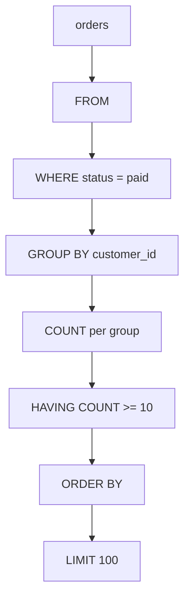

# 13- Aggregation Rules

## Overview

SQL aggregation reduces a set of input rows into aggregate results such as counts, sums, averages, minimums, and maximums. The correctness of an aggregate query depends less on the aggregate function itself and more on the **relation being aggregated, its grain, grouping rules, NULL semantics, and join cardinality**.

The core rules are:

- Aggregates operate on the rows produced by the preceding relational operations.
- `WHERE` filters rows before grouping.
- `GROUP BY` defines the output grouping grain.
- Aggregate functions calculate values for each group.
- `HAVING` filters groups after aggregation.
- `COUNT(*)` counts rows; `COUNT(column)` counts non-NULL values.
- Most aggregates ignore NULL input values.
- A join can multiply rows before aggregation and therefore change aggregate results.
- Every non-aggregated expression in a grouped `SELECT` must be compatible with the grouping rules of the SQL dialect.
- The database optimizer may execute the query differently from its logical SQL processing order.

These rules are foundational for reporting queries, analytics endpoints, billing systems, dashboards, and production data pipelines.

## Aggregation Has a Defined Input Relation

An aggregate does not operate directly on the physical table in isolation. It operates on the rows produced by the query's relational operations.

Consider:

```sql
SELECT
    COUNT(*) AS paid_orders
FROM orders
WHERE status = 'paid';
```

The aggregate conceptually receives:

```text
orders
  │
  ▼
WHERE status = 'paid'
  │
  ▼
qualifying rows
  │
  ▼
COUNT(*)
```

If the table contains 10 million rows but only 200,000 are paid, the aggregate logically operates on those 200,000 qualifying rows.

This distinction becomes especially important with joins:

```sql
SELECT
    COUNT(*)
FROM customers AS c
JOIN orders AS o
    ON o.customer_id = c.id;
```

`COUNT(*)` counts **joined rows**, not customers and not necessarily orders in the abstract.

The correct mental model is:

> **First determine the relation produced by FROM/JOIN/WHERE. Then determine what the aggregate counts or summarizes within that relation.**

## Logical Processing Order

A useful logical model for aggregate queries is:

```text
FROM / JOIN
     ↓
WHERE
     ↓
GROUP BY
     ↓
Aggregate computation
     ↓
HAVING
     ↓
SELECT
     ↓
ORDER BY
     ↓
LIMIT
```

For example:

```sql
SELECT
    customer_id,
    COUNT(*) AS order_count
FROM orders
WHERE status = 'paid'
GROUP BY customer_id
HAVING COUNT(*) >= 10
ORDER BY order_count DESC
LIMIT 100;
```

Conceptually:



This is the **logical** processing model. It does not mean the database physically executes every operation in this exact sequence.

The optimizer can reorder or combine operations when doing so preserves query semantics.

## Rule: WHERE Filters Rows Before Aggregation

Use `WHERE` when the condition applies to individual rows.

```sql
SELECT
    customer_id,
    COUNT(*) AS paid_orders
FROM orders
WHERE status = 'paid'
GROUP BY customer_id;
```

Only paid orders contribute to the aggregate.

This is usually preferable to aggregating all rows and attempting to remove unwanted groups afterward.

For a large table:

```text
1 billion rows
      │
      ▼
WHERE
      │
      ▼
50 million qualifying rows
      │
      ▼
GROUP BY
```

Reducing the input relation can substantially reduce aggregation work.

## Rule: GROUP BY Defines the Aggregation Grain

`GROUP BY` determines how input rows are partitioned into groups.

```sql
SELECT
    customer_id,
    COUNT(*) AS order_count
FROM orders
GROUP BY customer_id;
```

The result grain is:

```text
one row per customer
```

If you add another grouping expression:

```sql
SELECT
    customer_id,
    DATE(created_at) AS order_date,
    COUNT(*) AS order_count
FROM orders
GROUP BY
    customer_id,
    DATE(created_at);
```

the result grain becomes:

```text
one row per customer per day
```

This is one of the most important aggregation rules:

> **Adding a grouping column increases the dimensionality of the result and can increase the number of output groups.**

## Rule: Every Grouped Result Must Have a Defined Grain

Before writing an aggregate query, state the desired result in plain language.

Examples:

| Requirement | Result grain |
|---|---|
| Total revenue | One row |
| Orders per customer | One row per customer |
| Revenue per customer per month | One row per customer per month |
| Requests per service per hour | One row per service per hour |
| Average order count per customer | One row after an intermediate customer-level aggregation |

If the intended grain is unclear, aggregate queries are likely to produce incorrect results even when the SQL is syntactically valid.

## Rule: Non-Aggregated SELECT Expressions Must Be Group-Compatible

Consider:

```sql
SELECT
    customer_id,
    status,
    COUNT(*)
FROM orders
GROUP BY customer_id;
```

There can be multiple `status` values within one customer group:

```text
customer_id = 101
├── paid
├── cancelled
└── pending
```

There is no single logically correct `status` value to return for that group.

In strict SQL implementations, the query is therefore rejected because `status` is neither:

- part of the grouping criteria, nor
- reduced by an aggregate.

A valid version is:

```sql
SELECT
    customer_id,
    status,
    COUNT(*)
FROM orders
GROUP BY
    customer_id,
    status;
```

Now the grain is:

```text
one row per customer per status
```

Alternatively, if the business requirement needs one status-derived value, explicitly aggregate or otherwise define the rule.

## Functional Dependencies and SQL Dialects

Some database systems can allow a selected column that is not explicitly listed in `GROUP BY` when the database can establish that the column is functionally dependent on grouped columns.

For example, if `customer_id` uniquely identifies a customer:

```sql
SELECT
    c.id,
    c.email,
    COUNT(o.id)
FROM customers AS c
JOIN orders AS o
    ON o.customer_id = c.id
GROUP BY c.id;
```

Whether this is accepted depends on the database and its grouping rules.

For portable SQL and maintainable production code, do not rely casually on dialect-specific behavior. Make the intended dependency explicit and understand the rules of the database being used.

## Rule: Aggregate Functions Operate Per Group

Without `GROUP BY`:

```sql
SELECT COUNT(*)
FROM orders;
```

there is conceptually one group containing all qualifying rows.

With:

```sql
SELECT
    customer_id,
    COUNT(*)
FROM orders
GROUP BY customer_id;
```

there is one group for each distinct `customer_id`.

For:

| customer_id | order_id |
|---:|---:|
| 101 | 1 |
| 101 | 2 |
| 102 | 3 |
| 103 | 4 |
| 103 | 5 |

the groups are:

```text
101 → rows 1, 2
102 → row 3
103 → rows 4, 5
```

and the aggregate results are:

| customer_id | count |
|---:|---:|
| 101 | 2 |
| 102 | 1 |
| 103 | 2 |

## Rule: COUNT(*) Counts Rows

`COUNT(*)` counts rows in the input relation.

```sql
SELECT COUNT(*)
FROM orders;
```

It does not mean:

```text
count non-NULL values in a particular column
```

It means:

```text
count rows
```

This distinction matters particularly after joins.

For a `LEFT JOIN`:

```sql
SELECT
    c.id,
    COUNT(*) AS row_count
FROM customers AS c
LEFT JOIN orders AS o
    ON o.customer_id = c.id
GROUP BY c.id;
```

a customer with no orders can still produce one joined row containing NULL order columns, causing `COUNT(*)` to return `1`.

If the requirement is to count actual orders:

```sql
SELECT
    c.id,
    COUNT(o.id) AS order_count
FROM customers AS c
LEFT JOIN orders AS o
    ON o.customer_id = c.id
GROUP BY c.id;
```

Now a customer with no orders gets:

```text
COUNT(o.id) = 0
```

assuming `o.id` is non-NULL for real orders.

## Rule: COUNT(column) Ignores NULL

Consider:

| id | total_amount |
|---:|---:|
| 1 | 100 |
| 2 | NULL |
| 3 | 200 |

Then:

```sql
SELECT
    COUNT(*) AS rows,
    COUNT(total_amount) AS amounts
FROM orders;
```

produces conceptually:

```text
rows    = 3
amounts = 2
```

Therefore, choosing between:

```sql
COUNT(*)
```

and:

```sql
COUNT(column)
```

is a semantic decision, not merely a stylistic preference.

## Rule: Most Standard Aggregates Ignore NULL Inputs

For common numeric aggregates:

```sql
SUM(amount)
AVG(amount)
MIN(amount)
MAX(amount)
```

NULL input values generally do not contribute to the calculation.

For:

| amount |
|---:|
| 100 |
| NULL |
| 300 |

the conceptual results are:

```text
SUM = 400
AVG = 200
MIN = 100
MAX = 300
```

The NULL row is not treated as zero.

This distinction matters when NULL represents:

```text
unknown
not recorded
not applicable
```

rather than:

```text
zero
```

Do not use `COALESCE` merely to eliminate NULLs without understanding the business meaning.

## Rule: Empty Input Is Different From Zero

Consider:

```sql
SELECT
    COUNT(*) AS order_count,
    SUM(total_amount) AS revenue
FROM orders
WHERE customer_id = :customer_id;
```

For a customer with no matching rows, a typical result is:

```text
order_count = 0
revenue     = NULL
```

`COUNT` returns zero because there are zero rows to count.

`SUM` returns NULL because there is no input value from which to produce a sum.

If an API contract requires zero revenue:

```sql
SELECT
    COUNT(*) AS order_count,
    COALESCE(SUM(total_amount), 0) AS revenue
FROM orders
WHERE customer_id = :customer_id;
```

The normalization should reflect the application's business semantics.

## Rule: AVG Is Based on Non-NULL Values

A common conceptual mistake is to think:

```text
AVG(column) = SUM(column) / COUNT(*)
```

For nullable columns, this is generally incorrect.

The conceptual relationship is:

```text
AVG(column)
=
SUM(column) / COUNT(column)
```

because both operations exclude NULL inputs.

For:

| score |
|---:|
| 10 |
| 20 |
| NULL |

the result is:

```text
SUM(score)   = 30
COUNT(score) = 2
AVG(score)   = 15
```

not:

```text
30 / 3 = 10
```

## Rule: HAVING Filters Groups

Use `HAVING` for predicates involving aggregate results.

```sql
SELECT
    customer_id,
    COUNT(*) AS order_count
FROM orders
GROUP BY customer_id
HAVING COUNT(*) >= 10;
```

The condition cannot generally be evaluated from an individual input row because:

```text
COUNT(*) >= 10
```

is a property of the entire group.

Compare:

```sql
WHERE status = 'paid'
```

with:

```sql
HAVING COUNT(*) >= 10
```

| Clause | Operates on | Typical purpose |
|---|---|---|
| `WHERE` | Individual input rows | Filter source data |
| `HAVING` | Groups | Filter aggregate results |

## Rule: Do Not Use HAVING When WHERE Is Sufficient

This:

```sql
SELECT
    customer_id,
    COUNT(*)
FROM orders
GROUP BY customer_id
HAVING status = 'paid';
```

is not the right model because `status` is a row-level property and may vary inside a customer group.

Use:

```sql
SELECT
    customer_id,
    COUNT(*)
FROM orders
WHERE status = 'paid'
GROUP BY customer_id;
```

Filtering before grouping generally gives the database a smaller input relation and expresses the intended semantics more clearly.

## Rule: Joins Change the Input to Aggregation

This is one of the highest-value aggregation rules for backend engineers.

Suppose:

```text
Customer 101
├── 3 orders
└── 4 support tickets
```

Joining both one-to-many relationships can produce:

```text
3 × 4 = 12 rows
```

An aggregate over the joined relation therefore sees 12 rows.

For example:

```sql
SELECT
    c.id,
    COUNT(o.id) AS order_count
FROM customers AS c
JOIN orders AS o
    ON o.customer_id = c.id
JOIN support_tickets AS t
    ON t.customer_id = c.id
GROUP BY c.id;
```

The result can be inflated because each order may be repeated once for every matching support ticket.

The problem is not `COUNT`.

The problem is the **join cardinality before aggregation**.

## Rule: Aggregate Independent One-to-Many Relationships Separately

A safer pattern is:

```sql
WITH order_counts AS (
    SELECT
        customer_id,
        COUNT(*) AS order_count
    FROM orders
    GROUP BY customer_id
),
ticket_counts AS (
    SELECT
        customer_id,
        COUNT(*) AS ticket_count
    FROM support_tickets
    GROUP BY customer_id
)
SELECT
    c.id,
    COALESCE(o.order_count, 0) AS order_count,
    COALESCE(t.ticket_count, 0) AS ticket_count
FROM customers AS c
LEFT JOIN order_counts AS o
    ON o.customer_id = c.id
LEFT JOIN ticket_counts AS t
    ON t.customer_id = c.id;
```

Each aggregate is calculated at:

```text
customer grain
```

before the results are combined.

This pattern is often safer than joining all raw one-to-many relationships first.

## Rule: DISTINCT Changes the Aggregation Input

Compare:

```sql
SELECT COUNT(*)
FROM orders;
```

with:

```sql
SELECT COUNT(DISTINCT customer_id)
FROM orders;
```

The first counts rows.

The second counts distinct non-NULL customer IDs.

For:

| order_id | customer_id |
|---:|---:|
| 1 | 101 |
| 2 | 101 |
| 3 | 102 |
| 4 | 103 |

the results are:

```text
COUNT(*)                    = 4
COUNT(DISTINCT customer_id) = 3
```

`DISTINCT` is useful when uniqueness is part of the business requirement, but it should not be used as a generic repair mechanism for incorrect joins.

If:

```sql
COUNT(DISTINCT o.id)
```

"fixes" a query that accidentally multiplies rows, first determine why the multiplication occurred.

## Rule: DISTINCT Does Not Always Solve the Semantic Problem

Suppose a customer has:

```text
3 orders
4 tickets
```

and the query produces 12 joined rows.

Then:

```sql
COUNT(DISTINCT o.id)
```

may recover the correct order count.

However, consider:

```sql
SUM(o.total_amount)
```

`DISTINCT` cannot simply be applied to the sum to recover the intended total.

If the order amounts are:

```text
100
200
300
```

and each order appears four times due to a ticket join, the sum becomes:

```text
4 × (100 + 200 + 300)
```

The correct solution is usually to fix the relation being aggregated, not to patch each aggregate independently.

## Rule: Aggregation Changes Data Grain

Suppose:

```sql
SELECT
    customer_id,
    DATE(created_at) AS order_date,
    COUNT(*) AS order_count
FROM orders
GROUP BY
    customer_id,
    DATE(created_at);
```

The intermediate relation has grain:

```text
customer + day
```

A later query can aggregate that relation again:

```sql
SELECT
    customer_id,
    SUM(order_count) AS total_orders
FROM (
    SELECT
        customer_id,
        DATE(created_at) AS order_date,
        COUNT(*) AS order_count
    FROM orders
    GROUP BY
        customer_id,
        DATE(created_at)
) AS daily_orders
GROUP BY customer_id;
```

The first aggregation produces:

```text
customer + day
```

The second produces:

```text
customer
```

This is a fundamental relational concept:

> **An aggregate query can create a new relation with a new grain, which can then become the input to another query.**

## Rule: Nested Aggregation Requires Explicit Stages

Suppose the requirement is:

> Find the average number of orders per customer.

This requires customer-level aggregation first:

```sql
SELECT AVG(order_count) AS average_orders_per_customer
FROM (
    SELECT
        customer_id,
        COUNT(*) AS order_count
    FROM orders
    GROUP BY customer_id
) AS customer_order_counts;
```

The stages are:

```text
raw orders
    │
    ▼
group by customer
    │
    ▼
one row per customer
    │
    ▼
count orders per customer
    │
    ▼
average those customer counts
    │
    ▼
one final result
```

Trying to directly apply `AVG` to raw order rows would answer a different question.

## Rule: Aggregate After the Correct Join Grain

Consider:

```sql
SELECT
    c.id,
    COUNT(o.id)
FROM customers AS c
LEFT JOIN orders AS o
    ON o.customer_id = c.id
GROUP BY c.id;
```

The input to the aggregation has approximately:

```text
one row per customer-order relationship
```

Therefore:

```text
COUNT(o.id)
```

is meaningful as an order count.

Now add a one-to-many relationship:

```sql
LEFT JOIN support_tickets AS t
    ON t.customer_id = c.id
```

The input grain changes.

Before:

```text
customer + order
```

After:

```text
customer + order + ticket
```

The aggregate must be reconsidered.

A senior engineer should always ask:

> **What is one row in the relation immediately before the GROUP BY?**

## Rule: Outer Joins Require Careful COUNT Semantics

Consider customers without orders:

```sql
SELECT
    c.id,
    COUNT(o.id) AS order_count
FROM customers AS c
LEFT JOIN orders AS o
    ON o.customer_id = c.id
GROUP BY c.id;
```

The `LEFT JOIN` preserves customers with no orders.

For such a customer:

```text
c.id exists
o.id = NULL
```

Therefore:

```text
COUNT(o.id) = 0
```

This is usually the desired behavior.

Using:

```sql
COUNT(*)
```

would count the preserved outer-join row instead.

## Rule: SUM May Need COALESCE After an Outer Join

Consider:

```sql
SELECT
    c.id,
    SUM(o.total_amount) AS revenue
FROM customers AS c
LEFT JOIN orders AS o
    ON o.customer_id = c.id
GROUP BY c.id;
```

A customer with no orders may receive:

```text
revenue = NULL
```

If the business definition says:

```text
no orders = zero revenue
```

use:

```sql
COALESCE(SUM(o.total_amount), 0)
```

This is a semantic transformation:

```text
NULL → 0
```

It should therefore be deliberate.

## Rule: Grouping NULL Values Creates a NULL Group

If:

```sql
SELECT
    region,
    COUNT(*)
FROM customers
GROUP BY region;
```

and some rows have:

```text
region = NULL
```

those rows belong to the same grouping category for the purposes of grouping.

Conceptually:

| region | count |
|---|---:|
| APAC | 100 |
| Europe | 80 |
| North America | 120 |
| NULL | 15 |

The NULL group does not mean that NULL values are equal in ordinary SQL comparisons. Grouping has its own grouping semantics.

This distinction is important when interpreting reports.

## Rule: ORDER BY Can Use Aggregate Results

An aggregate result can be used for ordering.

```sql
SELECT
    customer_id,
    COUNT(*) AS order_count
FROM orders
GROUP BY customer_id
ORDER BY order_count DESC;
```

This is useful for:

- Top customers
- Most active users
- Highest-revenue products
- Most frequently called APIs

The ordering happens after the grouped result has been formed.

## Rule: LIMIT Does Not Reduce the Aggregation Input

Consider:

```sql
SELECT
    customer_id,
    COUNT(*) AS order_count
FROM orders
GROUP BY customer_id
ORDER BY order_count DESC
LIMIT 10;
```

`LIMIT 10` means:

```text
return only 10 groups
```

It does not mean:

```text
aggregate only 10 source rows
```

The database may optimize the physical implementation, but the semantic requirement is still to determine the correct top 10 groups.

This distinction is important when estimating query cost.

## Rule: Indexes Help Access Paths, Not Aggregation Semantics

An index does not change what an aggregate means.

For:

```sql
SELECT
    customer_id,
    COUNT(*)
FROM orders
WHERE tenant_id = :tenant_id
GROUP BY customer_id;
```

an index on:

```sql
(tenant_id, customer_id)
```

may be useful depending on data distribution and the optimizer's chosen plan.

However, an index does not automatically make every `GROUP BY` operation fast.

Aggregation cost can still depend on:

- Number of input rows
- Number of distinct groups
- Memory available
- Sort requirements
- Join cardinality
- Aggregate complexity
- Parallel execution

Validate assumptions with the database execution plan.

## Rule: Logical Query Order Is Not Physical Execution Order

Consider:

```sql
SELECT
    customer_id,
    COUNT(*)
FROM orders
WHERE status = 'paid'
GROUP BY customer_id;
```

The logical model says:

```text
WHERE → GROUP BY → aggregate
```

But a database optimizer may:

- Use an index to access qualifying rows.
- Push predicates into scans.
- Parallelize the scan.
- Perform partial aggregation.
- Choose hash aggregation.
- Choose sort-based aggregation.
- Reorder joins.
- Eliminate unnecessary work.

The optimizer must preserve the query's semantics while choosing a cheaper physical plan.

Therefore:

> **Learn logical query processing to reason about correctness; use execution plans to reason about performance.**

## Rule: Aggregation Is Not Automatically Expensive

A query such as:

```sql
SELECT
    status,
    COUNT(*)
FROM orders
GROUP BY status;
```

may process a very large table but produce only a small number of groups.

By contrast:

```sql
SELECT
    order_id,
    COUNT(*)
FROM orders
GROUP BY order_id;
```

may create one group per row.

The relevant dimensions are not simply:

```text
table size
```

but also:

```text
input rows
+
group cardinality
+
join cardinality
+
aggregation complexity
```

High-cardinality grouping can consume substantial memory and CPU.

## Rule: Monitor Aggregation Resource Usage

For PostgreSQL, inspect important aggregate queries with:

```sql
EXPLAIN (ANALYZE, BUFFERS)
SELECT
    customer_id,
    COUNT(*) AS order_count
FROM orders
WHERE status = 'paid'
GROUP BY customer_id;
```

Useful execution-plan nodes include:

| Plan node | Relevance |
|---|---|
| `Seq Scan` | Reads table pages sequentially |
| `Index Scan` | Uses an index to locate rows |
| `Bitmap Heap Scan` | Uses bitmap-assisted access |
| `HashAggregate` | Performs hash-based aggregation |
| `GroupAggregate` | Aggregates ordered/grouped input |
| `Sort` | Establishes ordering needed by a plan |
| `Gather` | Combines parallel worker results |
| `Gather Merge` | Combines ordered parallel results |

A sequential scan is not automatically a problem. If the query needs a large fraction of a table, scanning it sequentially can be the optimal strategy.

## Rule: Validate Aggregation With Production-Like Cardinality

A query can appear fast against:

```text
10,000 rows
```

and become problematic against:

```text
1,000,000,000 rows
```

Testing should account for:

- Total input rows
- Number of distinct grouping keys
- Distribution of values
- Join multiplicity
- NULL frequency
- Data skew
- Concurrent workload

Data distribution can be as important as total row count.

## Common Aggregation Pitfalls

| Pitfall | Result | Prevention |
|---|---|---|
| Using `COUNT(*)` after a `LEFT JOIN` | Customers without children can count as `1` | Count a nullable child key |
| Aggregating after multiple one-to-many joins | Inflated counts and sums | Aggregate relationships independently |
| Using `COUNT(column)` unintentionally | NULL rows are excluded | Decide whether you need rows or non-NULL values |
| Treating NULL as zero | Changes business meaning | Use `COALESCE` intentionally |
| Using `HAVING` for row filtering | More data may reach aggregation | Use `WHERE` for row predicates |
| Selecting non-grouped columns | Ambiguous group-level value | Group or aggregate the expression |
| Adding grouping columns casually | Changes result grain | Define grain before modifying `GROUP BY` |
| Using `DISTINCT` to hide bad joins | Root cause remains | Fix join cardinality |
| Assuming `LIMIT` reduces aggregation work | Can underestimate query cost | Understand logical processing |
| Assuming indexes guarantee fast aggregation | Wrong performance model | Validate with `EXPLAIN` |
| Ignoring NULL in `AVG` | Incorrect denominator assumptions | Remember `AVG` excludes NULL inputs |
| Aggregating raw events repeatedly | High database resource usage | Consider summary tables or materialized views |

## Production Design Pattern

For a SaaS analytics API:

```sql
SELECT
    customer_id,
    COUNT(*) AS order_count,
    SUM(total_amount) AS revenue
FROM orders
WHERE
    tenant_id = :tenant_id
    AND status = 'paid'
    AND created_at >= :start_time
    AND created_at < :end_time
GROUP BY customer_id
HAVING COUNT(*) >= :minimum_orders
ORDER BY revenue DESC, customer_id
LIMIT :limit;
```

The important rules applied here are:

- Tenant filtering occurs before aggregation.
- Time filtering reduces the input relation.
- `GROUP BY customer_id` defines the result grain.
- `COUNT(*)` counts qualifying order rows.
- `SUM` operates on the filtered order relation.
- `HAVING` filters customer groups.
- Ordering happens on the grouped result.
- `LIMIT` restricts returned groups rather than source rows.
- Parameterized values prevent SQL injection.
- A bounded time range prevents accidental full-history scans.

For high-volume systems, the query should be evaluated with realistic data and workload using the database's execution-plan tools.

## Aggregation in Django

ORM aggregation follows the same relational principles.

For example:

```python
from django.db.models import Count, Sum

customer_metrics = (
    Order.objects
    .filter(
        tenant_id=tenant_id,
        status="paid",
        created_at__gte=start_time,
        created_at__lt=end_time,
    )
    .values("customer_id")
    .annotate(
        order_count=Count("id"),
        revenue=Sum("total_amount"),
    )
    .filter(order_count__gte=minimum_orders)
)
```

The important part is not the ORM syntax. It is the generated relational operation:

```text
filter rows
    ↓
group by customer_id
    ↓
calculate aggregates
    ↓
filter groups
```

Avoid loading millions of rows into Python merely to perform aggregation that the database can execute efficiently.

## Security Considerations

Aggregation queries frequently appear in:

- Admin dashboards
- Reporting APIs
- Multi-tenant SaaS systems
- Billing services
- Analytics endpoints

The most important security rule is to apply authorization constraints to the database relation itself.

For example:

```sql
SELECT
    customer_id,
    SUM(total_amount)
FROM orders
WHERE tenant_id = :authorized_tenant_id
GROUP BY customer_id;
```

Do not retrieve unrestricted aggregate data and attempt to remove unauthorized tenants afterward in Python.

All dynamic values should be parameterized.

Aggregation also deserves privacy consideration. Highly granular reports can sometimes expose information that broad reports would hide. Access control should therefore apply to both the underlying data and the dimensions exposed by the reporting API.

## Interview Traps

### Is GROUP BY the Same as DISTINCT?

No.

`DISTINCT` removes duplicate result rows.

`GROUP BY` forms groups that aggregate functions can operate on.

They can produce similar-looking results in some queries, but they serve different relational purposes.

### Does COUNT(*) Count NULL Rows?

Yes.

`COUNT(*)` counts rows regardless of whether individual columns contain NULL.

### Does COUNT(column) Count NULL?

No.

`COUNT(column)` counts only rows where that expression is non-NULL.

### Does SUM(NULL) Return Zero?

A NULL input is ignored by `SUM`. If there are no non-NULL input values, the aggregate result is generally NULL rather than zero.

Use `COALESCE` when the application explicitly requires zero semantics.

### Does HAVING Run Before GROUP BY?

No in the logical model.

Groups must be formed and aggregate values calculated before aggregate-dependent `HAVING` predicates can be evaluated.

### Does GROUP BY Always Sort?

No.

The database can use different physical aggregation strategies, including hash-based aggregation.

### Does a JOIN Preserve the Number of Rows?

Not necessarily.

One-to-many and many-to-many joins can multiply rows, which directly affects subsequent aggregates.

### Why Can COUNT(DISTINCT id) Fix a Wrong Count but SUM Still Be Wrong?

`COUNT(DISTINCT id)` explicitly deduplicates IDs for that aggregate.

`SUM` has no equivalent assumption that repeated values represent the same business entity. If rows were multiplied by an incorrect join, the correct solution is generally to fix the input relation before aggregation.

### Does LIMIT Make a GROUP BY Cheap?

Not necessarily.

The database still has to determine the correct aggregate results needed to identify the requested groups. Physical optimizations may reduce work, but `LIMIT` is not a general substitute for reducing the aggregation input.

## Key Takeaways

- **Aggregation operates on the relation produced before it**, so always reason about joins, filters, NULLs, and row grain before evaluating the aggregate.
- **`GROUP BY` defines result grain**, while `WHERE` filters rows and `HAVING` filters groups after aggregation.
- **`COUNT(*)`, `COUNT(column)`, and `COUNT(DISTINCT column)` have different semantics** and must be chosen deliberately.
- **Join multiplication is a major source of incorrect aggregates**; aggregate independent one-to-many relationships at the correct grain before combining them.
- **Correctness and performance require different reasoning**: use SQL's logical rules for semantics and execution plans for physical performance.