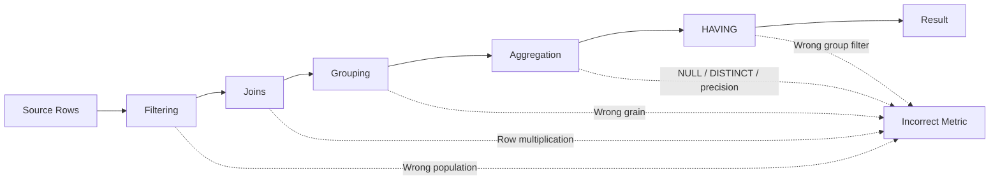
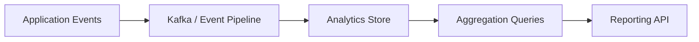

# 16- Common Aggregation Mistakes

## Overview

SQL aggregation is conceptually simple but operationally error-prone. Most aggregation bugs are not caused by misunderstanding `SUM()` or `COUNT()` themselves; they come from incorrect row populations, join cardinality, NULL semantics, grouping grain, time boundaries, or incorrect assumptions about what a metric represents.

A production aggregation should answer five questions explicitly:

- **What rows are included?**
- **What does one input row represent?**
- **What does one output row represent?**
- **Which values are being aggregated?**
- **What should happen when values are missing, duplicated, or zero?**

Consider a revenue query:

```sql
SELECT
    customer_id,
    SUM(total_amount) AS revenue
FROM orders
WHERE status = 'paid'
GROUP BY customer_id;
```

This is only correct if:

- Each `orders` row represents one order.
- `total_amount` is the amount that should contribute to revenue.
- `status = 'paid'` defines the revenue population.
- `customer_id` is the intended output grain.
- No join or other operation has duplicated order rows.

Aggregation correctness is therefore primarily a **data-model and cardinality problem**, not merely a syntax problem.

## Aggregation Failure Model

Most aggregation mistakes occur at one of these stages:



The most dangerous bugs often produce a plausible-looking number rather than a SQL error.

## Mistake: Not Defining the Grain

The most fundamental aggregation mistake is writing a query without defining what one result row represents.

For example:

```sql
SELECT
    customer_id,
    COUNT(*) AS order_count
FROM orders
GROUP BY customer_id;
```

The output grain is:

```text
one row per customer
```

Adding another grouping column changes the grain:

```sql
GROUP BY customer_id, status;
```

Now the output represents:

```text
one row per customer and status
```

These are different datasets and therefore different metrics.

### Production Practice

Before writing an aggregation, state:

> One output row represents ______.

Examples:

- One row per customer.
- One row per tenant per day.
- One row per product and warehouse.
- One row per API endpoint per hour.

If the grain is ambiguous, the query should not yet be considered complete.

## Mistake: Counting the Wrong Thing

These expressions are not equivalent:

```sql
COUNT(*)
COUNT(id)
COUNT(customer_id)
COUNT(DISTINCT customer_id)
```

Their semantics depend on NULLability and uniqueness.

| Expression | Counts |
|---|---|
| `COUNT(*)` | Every row |
| `COUNT(id)` | Rows where `id` is non-NULL |
| `COUNT(customer_id)` | Rows where `customer_id` is non-NULL |
| `COUNT(DISTINCT customer_id)` | Unique non-NULL customers |

For an orders table, this:

```sql
SELECT COUNT(*)
FROM orders;
```

counts orders.

This:

```sql
SELECT COUNT(DISTINCT customer_id)
FROM orders;
```

counts customers who have orders.

Confusing the two can produce metrics that are numerically reasonable but semantically wrong.

## Mistake: Using COUNT(*) With LEFT JOIN

Consider:

```sql
SELECT
    c.id,
    COUNT(*) AS order_count
FROM customers AS c
LEFT JOIN orders AS o
    ON o.customer_id = c.id
GROUP BY c.id;
```

A customer with no orders still produces one row from the `LEFT JOIN`.

Therefore:

```sql
COUNT(*)
```

can return `1` for a customer with zero orders.

Use the nullable child-side identifier instead:

```sql
SELECT
    c.id,
    COUNT(o.id) AS order_count
FROM customers AS c
LEFT JOIN orders AS o
    ON o.customer_id = c.id
GROUP BY c.id;
```

Now a customer without orders gets:

```text
order_count = 0
```

### Rule

When counting child records after an outer join, prefer:

```sql
COUNT(child.id)
```

when the child identifier is guaranteed non-NULL for real child rows.

## Mistake: Double Counting After Multiple One-to-Many Joins

This is one of the most serious production aggregation bugs.

Suppose:

```text
customer
  ├── 3 orders
  └── 4 support tickets
```

A query joining both relationships can produce:

```text
3 × 4 = 12 intermediate rows
```

If order revenue is aggregated after that multiplication:

```sql
SELECT
    c.id,
    SUM(o.total_amount) AS revenue,
    COUNT(t.id) AS ticket_count
FROM customers AS c
LEFT JOIN orders AS o
    ON o.customer_id = c.id
LEFT JOIN support_tickets AS t
    ON t.customer_id = c.id
GROUP BY c.id;
```

the order amounts can be repeated once for every matching ticket.

### Safer Pattern

Aggregate each one-to-many relationship independently:

```sql
WITH order_metrics AS (
    SELECT
        customer_id,
        COUNT(*) AS order_count,
        SUM(total_amount) AS revenue
    FROM orders
    GROUP BY customer_id
),
ticket_metrics AS (
    SELECT
        customer_id,
        COUNT(*) AS ticket_count
    FROM support_tickets
    GROUP BY customer_id
)
SELECT
    c.id,
    COALESCE(o.order_count, 0) AS order_count,
    COALESCE(o.revenue, 0) AS revenue,
    COALESCE(t.ticket_count, 0) AS ticket_count
FROM customers AS c
LEFT JOIN order_metrics AS o
    ON o.customer_id = c.id
LEFT JOIN ticket_metrics AS t
    ON t.customer_id = c.id;
```

Each intermediate dataset has one row per customer, so the final joins preserve the intended grain.

## Mistake: Using DISTINCT to Hide Join Problems

A common reaction to duplicate aggregation results is:

```sql
SUM(DISTINCT o.total_amount)
```

This can be incorrect.

Suppose two legitimate orders both have:

```text
total_amount = 100
```

Then:

```sql
SUM(DISTINCT total_amount)
```

returns:

```text
100
```

instead of:

```text
200
```

`DISTINCT` removes duplicate **values**, not duplicate business entities.

If the join is multiplying rows, fix the join or aggregate at the correct grain rather than using `DISTINCT` as a repair mechanism.

## Mistake: Filtering Aggregates With WHERE

This is invalid:

```sql
SELECT
    customer_id,
    COUNT(*) AS order_count
FROM orders
WHERE COUNT(*) > 10
GROUP BY customer_id;
```

`WHERE` operates on input rows, while the count exists only after grouping.

Use `HAVING`:

```sql
SELECT
    customer_id,
    COUNT(*) AS order_count
FROM orders
GROUP BY customer_id
HAVING COUNT(*) > 10;
```

The conceptual sequence is:

```text
FROM / JOIN
    ↓
WHERE
    ↓
GROUP BY
    ↓
Aggregate functions
    ↓
HAVING
    ↓
SELECT / ORDER BY
```

The exact physical execution plan can differ from this logical model, but the distinction is essential for writing correct SQL.

## Mistake: Filtering in HAVING Instead of WHERE

The reverse mistake is also common.

Instead of:

```sql
SELECT
    customer_id,
    SUM(total_amount) AS revenue
FROM orders
WHERE status = 'paid'
GROUP BY customer_id;
```

developers sometimes write:

```sql
SELECT
    customer_id,
    SUM(total_amount) AS revenue
FROM orders
GROUP BY customer_id
HAVING status = 'paid';
```

This is either invalid or semantically inappropriate because `status` is not necessarily a grouping column or aggregate.

Even when a condition can technically be expressed through `HAVING`, row-level predicates generally belong in `WHERE`.

### Why This Matters

Filtering before aggregation reduces the number of rows that the aggregation must process:

```text
10 million rows
      ↓ WHERE
1 million rows
      ↓ GROUP BY
10,000 groups
```

instead of aggregating unnecessary rows first.

## Mistake: Misunderstanding NULL

Consider:

```text
discount
--------
10
NULL
20
```

Then:

```sql
COUNT(*)       -- 3
COUNT(discount) -- 2
SUM(discount)   -- 30
AVG(discount)   -- 15
```

The NULL row participates in `COUNT(*)`, but NULL is ignored by the column-based aggregate calculations.

Do not automatically interpret NULL as zero.

These may have different business meanings:

```text
NULL → discount was not recorded
0    → discount was explicitly zero
```

If the business definition requires zero:

```sql
COALESCE(SUM(discount), 0)
```

can be appropriate.

But do not use `COALESCE` mechanically. Converting unknown values into zero can hide data-quality problems.

## Mistake: Assuming SUM Always Returns Zero

For an aggregate over no input rows:

```sql
SELECT SUM(total_amount)
FROM orders
WHERE customer_id = :customer_id;
```

the result can be:

```text
NULL
```

not:

```text
0
```

If the API contract requires zero:

```sql
SELECT
    COALESCE(SUM(total_amount), 0) AS revenue
FROM orders
WHERE customer_id = :customer_id;
```

This distinction is particularly important when serializing SQL results through Django, FastAPI, or another API layer.

## Mistake: Averaging Averages

Suppose:

```text
day 1: 10 orders, average = 100
day 2: 100 orders, average = 50
```

This is usually wrong:

```sql
SELECT AVG(daily_average)
FROM daily_metrics;
```

It calculates an unweighted average of the daily averages:

```text
(100 + 50) / 2 = 75
```

The overall average order value should be:

```text
(10 × 100 + 100 × 50) / (10 + 100)
= 54.55
```

If numerator and denominator are available, calculate the weighted result:

```sql
SELECT
    SUM(revenue) / NULLIF(SUM(order_count), 0) AS average_order_value
FROM daily_metrics;
```

### Production Rule

For derived averages, preserve:

```text
total numerator
total denominator
```

rather than storing only the average when future rollups are required.

## Mistake: Integer Division

Depending on the database and data types, integer arithmetic can truncate fractional results.

For example:

```sql
SELECT
    successful_requests / total_requests AS success_rate
FROM request_metrics;
```

can produce an integer result when both operands are integers.

Use an appropriate numeric expression:

```sql
SELECT
    100.0 * successful_requests
    / NULLIF(total_requests, 0) AS success_rate
FROM request_metrics;
```

The exact casting syntax can vary between databases, but the principle is consistent:

> Make the numeric type and precision of ratios explicit.

## Mistake: Division by Zero

This query can fail:

```sql
SELECT
    successful_requests / total_requests
FROM request_metrics;
```

when:

```text
total_requests = 0
```

Use:

```sql
successful_requests / NULLIF(total_requests, 0)
```

to convert a zero denominator into NULL.

For example:

```sql
SELECT
    100.0 * successful_requests
    / NULLIF(total_requests, 0) AS success_rate
FROM request_metrics;
```

The API layer can then decide whether NULL should be represented as `null`, omitted, or mapped to another business-defined state.

## Mistake: Using MIN/MAX to Retrieve a Complete Row

This query:

```sql
SELECT
    customer_id,
    MAX(created_at) AS last_order_at
FROM orders
GROUP BY customer_id;
```

correctly finds the latest timestamp.

It does **not** return the complete latest order.

This is incorrect:

```sql
SELECT
    customer_id,
    MAX(created_at),
    total_amount
FROM orders
GROUP BY customer_id;
```

because `total_amount` is not necessarily associated with the maximum timestamp.

Use a window function when the complete row is required:

```sql
WITH ranked_orders AS (
    SELECT
        id,
        customer_id,
        created_at,
        total_amount,
        ROW_NUMBER() OVER (
            PARTITION BY customer_id
            ORDER BY created_at DESC, id DESC
        ) AS row_num
    FROM orders
)
SELECT
    id,
    customer_id,
    created_at,
    total_amount
FROM ranked_orders
WHERE row_num = 1;
```

The secondary `id` ordering makes the result deterministic when timestamps tie.

## Mistake: Ignoring Ties

Suppose two orders have the same timestamp:

```text
order 101 → 10:00:00
order 102 → 10:00:00
```

This:

```sql
ORDER BY created_at DESC
LIMIT 1
```

does not define which row should win.

For deterministic behavior:

```sql
ORDER BY created_at DESC, id DESC
```

The tie-breaking rule should reflect the business requirement.

## Mistake: Using LIMIT for Top-N Per Group

This query:

```sql
SELECT
    category_id,
    product_id,
    SUM(quantity) AS units_sold
FROM order_items
GROUP BY category_id, product_id
ORDER BY units_sold DESC
LIMIT 3;
```

returns the top three products globally.

It does not return the top three products **per category**.

Use a window function:

```sql
WITH sales AS (
    SELECT
        category_id,
        product_id,
        SUM(quantity) AS units_sold
    FROM order_items
    GROUP BY category_id, product_id
),
ranked AS (
    SELECT
        category_id,
        product_id,
        units_sold,
        ROW_NUMBER() OVER (
            PARTITION BY category_id
            ORDER BY units_sold DESC, product_id
        ) AS row_num
    FROM sales
)
SELECT
    category_id,
    product_id,
    units_sold
FROM ranked
WHERE row_num <= 3;
```

`LIMIT` applies to the complete result; window functions can rank within each group.

## Mistake: Counting Rows Instead of Business Entities

A backend system may have multiple records representing one logical operation.

For example:

```text
payment_attempts
----------------
transaction_id
attempt_id
status
```

This:

```sql
COUNT(*)
```

counts payment attempts.

It does not necessarily count transactions.

To count unique transactions:

```sql
COUNT(DISTINCT transaction_id)
```

The correct metric depends on the domain model.

### Production Practice

Always distinguish between:

- Physical database rows.
- Events.
- Attempts.
- Transactions.
- Users.
- Devices.
- Sessions.
- Other business entities.

SQL cannot infer the intended business entity from the table name alone.

## Mistake: Counting Events as Users

Consider an event table:

```text
user_id | event_type
--------|-----------
1       | login
1       | purchase
1       | logout
```

This:

```sql
COUNT(*)
```

returns `3`.

This:

```sql
COUNT(DISTINCT user_id)
```

returns `1`.

For metrics such as:

```text
daily active users
unique customers
unique devices
```

the entity being counted must be explicit.

## Mistake: Incorrect Time Boundaries

A query such as:

```sql
WHERE created_at BETWEEN :start_time AND :end_time
```

can introduce boundary problems when adjacent reporting windows are combined.

Prefer half-open intervals:

```sql
WHERE created_at >= :start_time
  AND created_at < :end_time
```

For daily aggregation:

```text
[2026-08-01 00:00, 2026-08-02 00:00)
[2026-08-02 00:00, 2026-08-03 00:00)
```

There is no overlap.

### Timezone Considerations

For distributed backend systems, also define the timezone semantics of the report.

A timestamp stored in UTC can be grouped by UTC day or converted to a business timezone before grouping.

Do not assume:

```text
database day = business day
```

without verifying the requirement.

## Mistake: Aggregating Before Applying Tenant Filters

Multi-tenant applications require tenant isolation at every relevant data access layer.

Prefer:

```sql
SELECT
    customer_id,
    SUM(total_amount) AS revenue
FROM orders
WHERE tenant_id = :tenant_id
  AND status = 'paid'
GROUP BY customer_id;
```

Do not aggregate across tenants and attempt to filter afterward unless the query is explicitly designed to preserve tenant isolation.

Tenant filtering is both a correctness and security requirement.

## Mistake: Unsafe Dynamic SQL for Aggregation

Aggregation queries often accept parameters such as:

- Date ranges.
- Tenant IDs.
- Status filters.
- Grouping dimensions.
- Thresholds.

Values should be parameterized:

```sql
SELECT
    customer_id,
    SUM(total_amount) AS revenue
FROM orders
WHERE tenant_id = :tenant_id
  AND created_at >= :start_time
  AND created_at < :end_time
GROUP BY customer_id;
```

Do not concatenate user-controlled values into SQL.

For dynamic grouping dimensions, parameterization usually cannot substitute an arbitrary identifier. Use a strict allowlist:

```python
ALLOWED_GROUPINGS = {
    "customer": "customer_id",
    "status": "status",
}
```

Only values from the allowlist should be converted into SQL identifiers.

## Mistake: Assuming GROUP BY Makes Queries Cheap

Aggregation reduces the result size, but it does not necessarily reduce the amount of data the database must inspect.

This query:

```sql
SELECT
    customer_id,
    COUNT(*)
FROM orders
GROUP BY customer_id;
```

may need to process a very large orders table.

A million-row table can produce only:

```text
10,000 groups
```

while still requiring substantial scanning and aggregation work.

### Production Considerations

For large aggregation workloads, evaluate:

- Appropriate indexes.
- Partition pruning.
- Table statistics.
- Hash vs sort aggregation.
- Parallel query execution.
- Number of groups.
- `COUNT(DISTINCT ...)` cost.
- Pre-aggregated tables.
- Materialized views.
- Dedicated analytical storage.

Use:

```sql
EXPLAIN (ANALYZE, BUFFERS)
...
```

on representative datasets when investigating performance.

## Mistake: Indexing Every GROUP BY Column

A common assumption is:

> Every column in GROUP BY should have an index.

This is not generally true.

The optimizer may prefer a sequential scan and hash aggregation, especially when a large portion of the table is being processed.

Index design should consider the complete query:

```text
WHERE predicates
JOIN predicates
ORDER BY
GROUP BY
data distribution
query frequency
```

Use execution plans and workload measurements rather than index rules based solely on syntax.

## Mistake: Pulling Raw Rows Into Python

Avoid:

```python
orders = list(
    Order.objects.filter(status="paid")
)

revenue = sum(order.total_amount for order in orders)
```

when the database can perform the aggregation:

```python
from django.db.models import Sum

revenue = (
    Order.objects
    .filter(status="paid")
    .aggregate(revenue=Sum("total_amount"))
)["revenue"]
```

The SQL database is optimized for set-based operations and can avoid transferring every matching row to the application.

This matters significantly for large datasets.

## Mistake: Trusting ORM Aggregation Without Inspecting SQL

Django's ORM makes aggregation convenient:

```python
from django.db.models import Count, Sum

metrics = (
    Customer.objects
    .annotate(
        order_count=Count("orders"),
        revenue=Sum("orders__total_amount"),
    )
)
```

However, adding multiple relationship-based annotations can create complex joins.

The ORM does not eliminate relational cardinality issues.

For important queries:

- Inspect generated SQL.
- Test against realistic data.
- Review execution plans.
- Verify result cardinality.
- Add regression tests for metric correctness.

Convenient syntax is not a substitute for understanding the generated query.

## Mistake: Mixing Transactional and Analytical Workloads

A production API should not necessarily execute expensive historical aggregations directly against the primary transactional database.

For example:

```text
REST API
   ↓
PostgreSQL primary
   ↓
Scan billions of events
   ↓
Large aggregation
```

can compete with OLTP traffic.

A scalable architecture may instead use:



Alternatively, moderate workloads can use:

```text
PostgreSQL
  ├── transactional tables
  ├── partitioned event tables
  └── materialized / pre-aggregated metrics
```

The correct architecture depends on data volume, latency requirements, consistency requirements, and reporting complexity.

## Mistake: Ignoring Metric Freshness

A pre-aggregated metric may be cheaper to query:

```text
raw events
    ↓
aggregation job
    ↓
daily_metrics
```

but it may be stale.

If a dashboard displays:

```text
Revenue: $1,250,000
```

the system should have a defined freshness expectation.

For example:

```text
updated within 5 minutes
updated hourly
updated once per day
```

A fast query over stale data is still incorrect if the business expects real-time values.

## Mistake: Losing Monetary Precision

Do not casually represent monetary amounts using floating-point calculations.

Prefer appropriate exact numeric types at the database and application layers.

For PostgreSQL, a monetary amount is commonly represented using `numeric`/`decimal` semantics:

```sql
CREATE TABLE orders (
    id bigint PRIMARY KEY,
    total_amount numeric(12, 2) NOT NULL
);
```

Then:

```sql
SELECT SUM(total_amount)
FROM orders;
```

preserves decimal arithmetic according to the database's numeric semantics.

The correct precision and scale depend on the business domain.

## Mistake: Treating Derived Metrics as Raw Facts

A metric such as:

```text
conversion_rate = successful_orders / visits
```

is derived from multiple quantities.

Persisting only:

```text
conversion_rate
```

can make future aggregation incorrect.

For example, an average of conversion rates from two groups is not necessarily the overall conversion rate.

Prefer retaining sufficient components:

```text
successful_orders
visits
```

and calculate:

```sql
SUM(successful_orders)
/
NULLIF(SUM(visits), 0)
```

when rolling metrics up.

## Mistake: Failing to Test Aggregates With Edge Cases

Aggregation tests should include more than normal data.

At minimum, test:

| Scenario | What to verify |
|---|---|
| No rows | NULL vs zero behavior |
| One row | Basic correctness |
| Multiple rows | Normal aggregation |
| NULL values | Aggregate semantics |
| Duplicate values | DISTINCT behavior |
| Duplicate entities | Entity vs row counts |
| No child rows | LEFT JOIN behavior |
| Multiple child relationships | Join multiplication |
| Zero denominator | Ratio behavior |
| Tied timestamps | Deterministic selection |
| Multiple tenants | Tenant isolation |
| Large group count | Performance characteristics |

Metric queries should be tested like application logic because incorrect aggregates can directly affect financial, operational, or product decisions.

## Production Debugging Checklist

When an aggregate produces a suspicious result, inspect the query in this order:

### Verify the Population

Run the underlying filter without aggregation:

```sql
SELECT COUNT(*)
FROM orders
WHERE tenant_id = :tenant_id
  AND status = 'paid';
```

Confirm that the input population is correct.

### Verify Join Cardinality

Inspect representative rows before aggregation:

```sql
SELECT
    o.id,
    o.customer_id,
    t.id AS ticket_id
FROM orders AS o
LEFT JOIN support_tickets AS t
    ON t.customer_id = o.customer_id
WHERE o.customer_id = :customer_id;
```

Look for unexpected row multiplication.

### Verify the Grain

Check whether the grouping columns represent the intended result:

```sql
GROUP BY customer_id
```

versus:

```sql
GROUP BY customer_id, status
```

### Verify NULL Behavior

Compare:

```sql
COUNT(*)
COUNT(column)
COUNT(DISTINCT column)
```

and inspect NULL values explicitly.

### Compare Against a Known Dataset

For critical metrics, create a small deterministic dataset where the expected result can be calculated manually.

This is particularly effective for finding join multiplication and weighted-average bugs.

## Production Checklist

Before deploying an aggregation query, verify:

- The input population is explicitly defined.
- The input row grain is understood.
- The output grain is explicit.
- Every join's cardinality is understood.
- One-to-many relationships cannot unintentionally multiply facts.
- `COUNT(*)` vs `COUNT(column)` is intentional.
- `COUNT(DISTINCT ...)` represents a real business requirement.
- NULL behavior is explicitly defined.
- `COALESCE` is used only when NULL-to-zero conversion is semantically correct.
- Ratios cannot divide by zero.
- Numeric precision is appropriate for the metric.
- Time ranges use correct boundaries and timezone semantics.
- Tenant filters are applied correctly in multi-tenant systems.
- Dynamic SQL identifiers use allowlists.
- Large queries have been evaluated with realistic execution plans.
- ORM-generated SQL has been inspected when relationships are involved.
- Expensive analytical queries do not unnecessarily compete with OLTP traffic.
- Pre-aggregated metrics have an explicit freshness expectation.
- Critical metrics have regression tests covering edge cases.

## Key Takeaways

- **Aggregation bugs usually originate from incorrect population, grain, or join cardinality rather than the aggregate function itself.**
- **Never use `DISTINCT` to hide row multiplication; fix the underlying join or aggregate each relationship at its correct grain.**
- **Treat NULLs, zero values, ratios, averages, monetary precision, and time boundaries as explicit metric semantics.**
- **For production systems, validate aggregates against known datasets, inspect generated SQL and execution plans, and test edge cases such as empty sets and duplicate relationships.**
- **As aggregation workloads grow, consider indexing based on measured plans, partitioning, pre-aggregation, materialized views, or dedicated analytical infrastructure.**