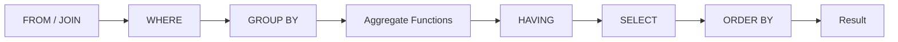

# README

## Overview

Aggregate functions reduce a set of rows into a calculated result. They are fundamental to backend reporting, analytics, dashboards, operational metrics, and data-driven application features.

This section covers SQL aggregation from basic aggregate functions through grouping, filtering grouped results, execution behavior, correctness pitfalls, and production-oriented aggregation patterns.

The primary functions covered are:

- `COUNT()` — count rows or non-NULL values.
- `SUM()` — calculate totals.
- `AVG()` — calculate arithmetic means.
- `MIN()` / `MAX()` — identify minimum and maximum values.
- `GROUP BY` — produce aggregates at a defined grouping grain.
- `HAVING` — filter groups after aggregation.

A key engineering principle throughout this section is:

> **An aggregate query is only correct when its input population, row grain, grouping grain, NULL behavior, and join cardinality are correct.**

## Navigation

- [01- Aggregate Functions Introduction](./01-%20Aggregate%20Functions%20Introduction.md) — Establishes the aggregation model, common functions, and core SQL patterns
- [02- COUNT](./02-%20COUNT.md) — Row counting, NULL behavior, and practical counting patterns
- [03- SUM](./03-%20SUM.md) — Totals, numeric aggregation, NULL behavior, and production considerations
- [04- AVG](./04-%20AVG.md) — Averages, NULL semantics, numeric precision, and common averaging mistakes
- [05- MIN and MAX](./05-%20MIN%20and%20MAX.md) — Boundary-value aggregation and finding a value versus its associated row
- [06- COUNT vs COUNT Column vs COUNT Star](./06-%20COUNT%20vs%20COUNT%20Column%20vs%20COUNT%20Star.md) — Semantic and NULL-handling differences between counting rows and values
- [07- Aggregates and NULL](./07-%20Aggregates%20and%20NULL.md) — How aggregate functions treat missing values and how COALESCE changes result semantics
- [08- GROUP BY](./08-%20GROUP%20BY.md) — Grouping, result grain, and aggregation by dimensions
- [09- GROUP BY Multiple Columns](./09-%20GROUP%20BY%20Multiple%20Columns.md) — Composite grouping dimensions and how grouping changes result grain
- [10- HAVING](./10-%20HAVING.md) — Filtering aggregated groups and its relationship to WHERE
- [11- WHERE vs HAVING](./11-%20WHERE%20vs%20HAVING.md) — Practical comparison of row-level and group-level filtering
- [12- Aggregation Execution Logic](./12-%20Aggregation%20Execution%20Logic.md) — Logical query processing and how databases execute aggregation workloads
- [13- Aggregation Rules](./13-%20Aggregation%20Rules.md) — Rules governing grouping, selected columns, aggregate expressions, and grouped results
- [14- Choosing the Right Aggregate](./14-%20Choosing%20the%20Right%20Aggregate.md) — Selecting the appropriate aggregate based on the metric being calculated
- [15- Common Aggregation Patterns](./15-%20Common%20Aggregation%20Patterns.md) — Reusable production patterns for reporting, metrics, and backend workloads
- [16- Common Aggregation Mistakes](./16-%20Common%20Aggregation%20Mistakes.md) — Incorrect grain, join multiplication, NULL handling, averaging errors, and production pitfalls

## Aggregation Mental Model

A typical aggregation query follows this logical flow:



For example:

```sql
SELECT
    customer_id,
    COUNT(*) AS order_count,
    SUM(total_amount) AS revenue
FROM orders
WHERE status = 'paid'
GROUP BY customer_id
HAVING COUNT(*) >= 10;
```

This query answers:

> Which customers have at least 10 paid orders, and what is their total paid-order revenue?

The important distinction is that `WHERE` filters **input rows**, while `HAVING` filters **groups produced by aggregation**.

## Aggregate Function Reference

| Function | Primary Use | NULL Behavior | Typical Backend Use |
|---|---|---|---|
| `COUNT(*)` | Count rows | Counts every row | Number of orders, events, requests |
| `COUNT(column)` | Count non-NULL values | Ignores NULL | Number of populated values |
| `COUNT(DISTINCT column)` | Count unique values | Ignores NULL | Unique users, customers, devices |
| `SUM(column)` | Calculate total | Ignores NULL | Revenue, quantity, usage |
| `AVG(column)` | Calculate arithmetic mean | Ignores NULL | Average order value, latency |
| `MIN(column)` | Find minimum | Ignores NULL | Earliest timestamp, lowest price |
| `MAX(column)` | Find maximum | Ignores NULL | Latest timestamp, highest price |

## The Grain of an Aggregate Query

The most important question before writing an aggregate query is:

> **What does one output row represent?**

For:

```sql
SELECT
    customer_id,
    SUM(total_amount) AS revenue
FROM orders
GROUP BY customer_id;
```

the output grain is:

```text
one row per customer
```

Adding another grouping column changes the grain:

```sql
GROUP BY customer_id, status;
```

Now the result represents:

```text
one row per customer and status
```

This distinction is critical for reporting and API metrics because changing the grouping columns changes the meaning of the result.

## Common Backend Aggregation Patterns

### Entity-Level Metrics

```sql
SELECT
    customer_id,
    COUNT(*) AS order_count,
    SUM(total_amount) AS revenue
FROM orders
WHERE status = 'paid'
GROUP BY customer_id;
```

Useful for:

- Customer dashboards.
- Account summaries.
- Usage reporting.
- Billing calculations.

### Time-Based Metrics

```sql
SELECT
    DATE_TRUNC('day', created_at) AS day,
    COUNT(*) AS order_count,
    SUM(total_amount) AS revenue
FROM orders
WHERE created_at >= :start_time
  AND created_at < :end_time
GROUP BY DATE_TRUNC('day', created_at)
ORDER BY day;
```

For production reporting, define timezone and interval semantics explicitly.

Prefer half-open intervals:

```sql
created_at >= :start_time
AND created_at < :end_time
```

rather than relying on inclusive end timestamps.

### Filtering Aggregated Results

```sql
SELECT
    customer_id,
    COUNT(*) AS order_count
FROM orders
GROUP BY customer_id
HAVING COUNT(*) >= 10;
```

Use `HAVING` when the condition depends on an aggregate or group.

## Aggregation and JOINs

Joins can change the number of rows being aggregated.

For example:

```text
customer
   ├── orders
   └── support tickets
```

Joining both one-to-many relationships before aggregating can multiply rows:

```text
3 orders × 4 tickets = 12 intermediate rows
```

This can cause revenue and counts to be inflated.

A safer approach is often to aggregate each relationship independently and then join the already-aggregated results.

```sql
WITH order_metrics AS (
    SELECT
        customer_id,
        COUNT(*) AS order_count,
        SUM(total_amount) AS revenue
    FROM orders
    GROUP BY customer_id
),
ticket_metrics AS (
    SELECT
        customer_id,
        COUNT(*) AS ticket_count
    FROM support_tickets
    GROUP BY customer_id
)
SELECT
    c.id,
    COALESCE(o.order_count, 0) AS order_count,
    COALESCE(o.revenue, 0) AS revenue,
    COALESCE(t.ticket_count, 0) AS ticket_count
FROM customers AS c
LEFT JOIN order_metrics AS o
    ON o.customer_id = c.id
LEFT JOIN ticket_metrics AS t
    ON t.customer_id = c.id;
```

This preserves the intended one-row-per-customer grain.

## Aggregation and NULL

NULL handling must be part of the metric definition.

For:

```text
10
NULL
20
```

the results are generally:

```sql
COUNT(*)        -- 3
COUNT(value)    -- 2
SUM(value)      -- 30
AVG(value)      -- 15
```

An empty aggregate can also produce `NULL`, particularly for functions such as `SUM()` and `AVG()`.

When the API contract requires zero:

```sql
SELECT
    COALESCE(SUM(total_amount), 0) AS revenue
FROM orders
WHERE customer_id = :customer_id;
```

Do not automatically convert every `NULL` to zero. `NULL` can mean "unknown" or "not recorded", while zero can mean an explicitly measured absence.

## Aggregation in Backend Applications

Aggregation should normally be performed by the database rather than loading raw rows into application memory.

Avoid:

```python
orders = list(
    Order.objects.filter(status="paid")
)

revenue = sum(order.total_amount for order in orders)
```

Prefer a database-side aggregation:

```python
from django.db.models import Sum

result = (
    Order.objects
    .filter(status="paid")
    .aggregate(revenue=Sum("total_amount"))
)

revenue = result["revenue"]
```

The database can execute the aggregation close to the data and return only the resulting value instead of transferring every matching row to the application.

For complex ORM queries, inspect the generated SQL and execution plan rather than assuming ORM syntax guarantees efficient SQL.

## Production Considerations

Large aggregation queries can become expensive even when the result contains only a few rows.

Evaluate:

- Input row count.
- Number of groups.
- Join cardinality.
- `COUNT(DISTINCT ...)` usage.
- Filtering selectivity.
- Indexes.
- Partition pruning.
- Sort and hash aggregation costs.
- Parallel execution.
- Query frequency.
- Data freshness requirements.

For PostgreSQL performance investigations:

```sql
EXPLAIN (ANALYZE, BUFFERS)
SELECT
    customer_id,
    SUM(total_amount)
FROM orders
WHERE status = 'paid'
GROUP BY customer_id;
```

Do not add indexes solely because a column appears in `GROUP BY`. Index design should be based on the complete workload and measured execution plans.

For high-volume analytical workloads, consider:

- Pre-aggregated tables.
- Materialized views.
- Partitioned tables.
- Read replicas where appropriate.
- Dedicated analytical databases.
- Event-driven aggregation pipelines.
- Kafka-based data pipelines for large-scale analytics.

## Aggregation Correctness Checklist

Before treating an aggregation as production-ready, verify:

- [ ] The input population is explicitly defined.
- [ ] The source row grain is understood.
- [ ] The output grain is explicitly defined.
- [ ] Every join's cardinality is understood.
- [ ] One-to-many joins cannot unintentionally multiply facts.
- [ ] `COUNT(*)` vs `COUNT(column)` is intentional.
- [ ] `COUNT(DISTINCT ...)` represents the intended business entity.
- [ ] NULL behavior is explicitly understood.
- [ ] `COALESCE()` is used only when NULL-to-zero conversion is correct.
- [ ] Ratios protect against division by zero.
- [ ] Numeric precision is appropriate for financial or measurement data.
- [ ] Time boundaries and timezone semantics are correct.
- [ ] Tenant filters are applied before aggregation where appropriate.
- [ ] ORM-generated SQL has been reviewed for relationship-heavy queries.
- [ ] Large queries have been evaluated with realistic execution plans.
- [ ] Critical metrics have regression tests for edge cases.

## Common Interview Traps

| Trap | Correct Reasoning |
|---|---|
| `COUNT(*)` equals `COUNT(column)` | False when the column contains NULLs. |
| `COUNT(*)` counts unique users | False; use `COUNT(DISTINCT user_id)`. |
| `WHERE COUNT(*) > 10` | Invalid; aggregate conditions belong in `HAVING`. |
| `HAVING` should replace `WHERE` | No; filter rows with `WHERE` whenever possible. |
| `SUM()` always returns `0` | Not necessarily; an empty input can produce `NULL`. |
| `AVG(AVG(value))` gives the global average | Not generally; averages must be weighted by their populations. |
| `SUM(DISTINCT amount)` removes duplicate rows safely | No; it removes duplicate values and can undercount legitimate transactions. |
| `MAX(created_at)` gives the latest complete row | No; it only gives the maximum timestamp. |
| `GROUP BY` automatically makes a query efficient | No; aggregation can still scan and process large datasets. |

## Recommended Learning Order

The files are intentionally ordered from fundamental aggregate behavior toward production-level reasoning:

```mermaid
flowchart LR
    A[Aggregation Fundamentals] --> B[COUNT]
    B --> C[SUM]
    C --> D[AVG]
    D --> E[MIN / MAX]
    E --> F[COUNT Variants]
    F --> G[NULL Semantics]
    G --> H[GROUP BY]
    H --> I[Multiple Columns]
    I --> J[HAVING]
    J --> K[WHERE vs HAVING]
    K --> L[Execution Logic]
    L --> M[Aggregation Rules]
    M --> N[Choosing Aggregates]
    N --> O[Common Patterns]
    O --> P[Common Mistakes]
```



The progression moves from **what aggregate functions do** to **how to use them correctly at scale**.


## Key Takeaways

- **Aggregate functions calculate metrics over sets of rows, but correctness depends on the input population and data grain.**
- **`GROUP BY` defines the output grain, while `WHERE` filters input rows and `HAVING` filters aggregated groups.**
- **NULL semantics and join cardinality are major sources of incorrect counts, sums, and averages.**
- **Production aggregation requires more than syntactically valid SQL: validate business semantics, inspect execution plans, and test edge cases.**
- **As data volume grows, move expensive aggregation workloads toward pre-aggregation or dedicated analytical infrastructure when appropriate.**