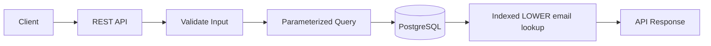

# 01- String Functions Introduction

## Overview

SQL string functions transform, inspect, normalize, and extract information from textual data. They are commonly used for data cleaning, search preparation, reporting, validation, formatting, and deriving values directly inside queries.

Typical backend use cases include:

- Normalizing user-entered text.
- Building display values.
- Extracting identifiers from structured strings.
- Case-insensitive comparisons.
- Trimming whitespace from imported data.
- Searching and filtering text.
- Parsing simple string-based fields.
- Preparing data for reports and exports.

String functions are powerful, but they should not become a substitute for proper data modeling. Repeatedly parsing structured information from strings in production queries can indicate that the data should be stored in separate columns.

## Why String Functions Matter

Text enters backend systems through many sources:

```text
REST API
   ↓
Application
   ↓
Database
   ↓
Stored text
```

The stored value may contain:

- Leading or trailing whitespace.
- Inconsistent capitalization.
- Formatting differences.
- Delimiters.
- Embedded identifiers.
- Legacy representations.
- User-generated content.

SQL string functions allow some of these transformations to happen close to the data:

```sql
SELECT
    LOWER(TRIM(email)) AS normalized_email
FROM users;
```

This can be useful for reporting and controlled normalization, but canonical application data should ideally be normalized at ingestion when the business rules permit it.

## Common String Function Categories

| Category | Common Functions | Typical Purpose |
|---|---|---|
| Case conversion | `LOWER()`, `UPPER()` | Normalize or compare text |
| Whitespace | `TRIM()`, `LTRIM()`, `RTRIM()` | Remove unwanted whitespace |
| Length | `LENGTH()` | Measure string length |
| Extraction | `SUBSTRING()` | Extract part of a string |
| Replacement | `REPLACE()` | Replace occurrences |
| Concatenation | `CONCAT()` | Combine values |
| Position | `POSITION()` | Find a substring |
| Pattern matching | `LIKE`, `ILIKE` | Search text patterns |
| Regular expressions | Database-specific regex functions/operators | Advanced pattern processing |
| Formatting | Database-specific functions | Produce presentation-oriented text |

Exact function names, argument syntax, return types, and behavior vary between PostgreSQL, MySQL, SQL Server, Oracle, and other database systems.

## Case Conversion

### LOWER

`LOWER()` converts text to lowercase.

```sql
SELECT LOWER(email) AS normalized_email
FROM users;
```

A common use case is case-insensitive normalization:

```sql
SELECT
    LOWER(TRIM(email)) AS normalized_email
FROM users;
```

### UPPER

`UPPER()` converts text to uppercase:

```sql
SELECT UPPER(country_code) AS country_code
FROM users;
```

This can be useful for standardized codes and reporting output.

### Production Considerations

Case conversion is affected by database collation and locale rules. Do not assume that lowercase/uppercase behavior is identical across all languages and database configurations.

For identifiers such as email addresses, usernames, or external IDs, define normalization rules explicitly rather than assuming `LOWER()` alone represents the application's canonicalization policy.

## Whitespace Functions

Input data frequently contains unwanted whitespace:

```text
"  Alice "
"Bob  "
"   Charlie"
```

`TRIM()` removes leading and trailing whitespace:

```sql
SELECT TRIM(name) AS name
FROM users;
```

Database systems may also provide:

```sql
LTRIM(name)
RTRIM(name)
```

for one-sided trimming.

### Practical Example

For imported customer data:

```sql
SELECT
    TRIM(first_name) AS first_name,
    TRIM(last_name) AS last_name
FROM imported_customers;
```

Trimming is useful during ingestion, migration, and reporting, but repeatedly cleaning the same data at query time can add unnecessary work. Prefer enforcing canonical storage rules where practical.

## Measuring String Length

Length functions determine the size of textual data.

For example:

```sql
SELECT
    username,
    LENGTH(username) AS username_length
FROM users;
```

This is useful for validation and diagnostics.

For example:

```sql
SELECT username
FROM users
WHERE LENGTH(username) > 30;
```

### Character Length vs Byte Length

A senior-level consideration is that character length and byte length are not necessarily equivalent.

With UTF-8 text:

```text
ASCII character → typically 1 byte
Non-ASCII character → potentially multiple bytes
```

Therefore, database-specific functions for character length and byte/octet length can produce different results.

This matters when validating:

- API limits.
- Storage constraints.
- Protocol fields.
- External system requirements.

Always verify whether a requirement is expressed in **characters**, **code points**, or **bytes**.

## Substring Extraction

`SUBSTRING()` extracts part of a string.

PostgreSQL example:

```sql
SELECT
    SUBSTRING(phone_number FROM 1 FOR 3) AS country_prefix
FROM customers;
```

Another common use is extracting a prefix from an identifier:

```sql
SELECT
    SUBSTRING(order_reference FROM 1 FOR 4) AS region_code
FROM orders;
```

Substring operations are useful for reporting and controlled parsing.

However, if an application frequently needs:

```text
region_code
tenant_id
product_type
```

from the same string, consider storing these values explicitly rather than repeatedly parsing them.

## String Replacement

`REPLACE()` replaces matching text.

```sql
SELECT
    REPLACE(phone_number, ' ', '') AS normalized_phone
FROM customers;
```

For example:

```text
"+91 98765 43210"
```

can become:

```text
"+919876543210"
```

More complex normalization may require database-specific regular expressions or application-level processing.

### Production Consideration

Do not use replacement functions blindly on data with business meaning.

For example:

```sql
REPLACE(address, '-', '')
```

may alter legitimate address information.

Text transformation should be based on an explicit normalization rule.

## Concatenation

Concatenation combines multiple strings.

For example:

```sql
SELECT
    CONCAT(first_name, ' ', last_name) AS full_name
FROM users;
```

PostgreSQL also supports the concatenation operator:

```sql
SELECT
    first_name || ' ' || last_name AS full_name
FROM users;
```

`CONCAT()` is often preferable when NULL handling should be more explicit or database portability matters, but behavior still varies across systems.

### Production Consideration

Do not confuse presentation formatting with canonical data.

A full name generated by:

```sql
CONCAT(first_name, ' ', last_name)
```

is a presentation value. It should generally not replace the underlying normalized columns.

## Searching Within Strings

`LIKE` performs pattern matching.

```sql
SELECT
    id,
    email
FROM users
WHERE email LIKE '%@example.com';
```

The `%` wildcard matches zero or more characters.

Common patterns:

| Pattern | Meaning |
|---|---|
| `'abc%'` | Starts with `abc` |
| `'%abc'` | Ends with `abc` |
| `'%abc%'` | Contains `abc` |
| `'a_c'` | One arbitrary character between `a` and `c` |

The underscore `_` represents a single character.

## Case-Insensitive Search

PostgreSQL provides `ILIKE`:

```sql
SELECT
    id,
    email
FROM users
WHERE email ILIKE '%example%';
```

Other databases may use different approaches, such as collations or explicit case conversion.

A portable approach is:

```sql
WHERE LOWER(email) = LOWER(:email)
```

but applying a function to a column can affect index usage.

For high-frequency searches, database-specific indexing strategies should be evaluated rather than automatically applying `LOWER()` to every query.

## String Functions and Indexes

A major production concern is that transforming a column inside a predicate can change how efficiently the database can use an index.

Consider:

```sql
SELECT *
FROM users
WHERE LOWER(email) = LOWER(:email);
```

A normal index on:

```sql
email
```

may not be sufficient for the transformed expression.

PostgreSQL can use an expression index:

```sql
CREATE INDEX idx_users_lower_email
ON users (LOWER(email));
```

The query can then use the indexed expression:

```sql
SELECT *
FROM users
WHERE LOWER(email) = LOWER(:email);
```

The exact strategy depends on the database, workload, collation, and application requirements.

### Production Rule

Before putting a string transformation into a high-volume filter:

1. Check the query plan.
2. Understand whether the existing index remains usable.
3. Consider an expression/function-based index where supported.
4. Consider storing normalized data separately.
5. Benchmark using production-like data.

## String Functions and NULL

String functions generally propagate or specially handle NULL according to the database and function.

For example:

```sql
SELECT LOWER(NULL);
```

typically produces:

```text
NULL
```

Do not assume:

```text
NULL → empty string
```

If an empty string is the intended application result:

```sql
SELECT COALESCE(LOWER(name), '') AS normalized_name
FROM users;
```

However, this changes semantics:

```text
NULL       = unknown / missing
''         = known empty value
```

Do not collapse these states unless the business model requires it.

## Combining String Functions

String functions can be composed.

For example:

```sql
SELECT
    LOWER(TRIM(email)) AS normalized_email
FROM users;
```

A more complex transformation:

```sql
SELECT
    LOWER(
        REPLACE(
            TRIM(email),
            ' ',
            ''
        )
    ) AS normalized_email
FROM users;
```

Composition is useful, but deeply nested transformations can become difficult to maintain and expensive to execute.

When a transformation becomes business-critical, consider whether it belongs in:

- Application validation.
- A generated/computed column.
- A normalized database column.
- A database function.
- An ETL/data-processing pipeline.

## String Functions in Backend Systems

### Django

Django ORM exposes many database string functions.

For example:

```python
from django.db.models.functions import Lower, Trim

queryset = User.objects.annotate(
    normalized_email=Lower(Trim("email"))
)
```

The ORM translates this into database-side operations.

For frequently executed queries, inspect the generated SQL and verify the database execution plan.

### FastAPI

A FastAPI endpoint may accept a search parameter:

```text
GET /users?email=alice@example.com
```

The application should validate and parameterize the value before sending it to the database.

Conceptually:

```text
HTTP Request
    ↓
FastAPI validation
    ↓
Parameterized SQL / ORM query
    ↓
Database string operation
    ↓
Result
    ↓
HTTP Response
```

String functions should not be used as an excuse to construct SQL through string concatenation.

## Security Considerations

String manipulation itself is not SQL injection protection.

This is unsafe:

```python
query = f"""
SELECT *
FROM users
WHERE email LIKE '%{search}%'
"""
```

Use parameterized queries:

```python
cursor.execute(
    """
    SELECT id, email
    FROM users
    WHERE email LIKE %s
    """,
    (f"%{search}%",),
)
```

The database driver handles the value as data rather than SQL syntax.

For dynamic SQL identifiers, such as user-selectable sort columns or grouping expressions, use strict allowlists rather than interpolating arbitrary input.

## Performance Considerations

String operations can be CPU-intensive, particularly when applied to large datasets.

For example:

```sql
SELECT
    LOWER(email)
FROM users;
```

may require transforming every selected row.

More concerning is a large filtering operation:

```sql
SELECT *
FROM users
WHERE LOWER(name) LIKE '%alice%';
```

Potential costs include:

- Full table scans.
- CPU spent transforming strings.
- Pattern matching costs.
- Large intermediate results.
- Increased database latency.
- Reduced concurrency.

For high-volume text search, consider:

- Appropriate indexes.
- Prefix searches where possible.
- PostgreSQL expression indexes.
- PostgreSQL full-text search.
- Trigram indexes where appropriate.
- Dedicated search infrastructure for complex search requirements.

Do not introduce Elasticsearch or another search system simply because `LIKE` exists; choose based on actual search requirements and measured workload characteristics.

## Common Mistakes

### Treating String Functions as Data Modeling

Repeatedly extracting values from:

```text
ORD-IND-2026-000123
```

may work initially, but if the application frequently needs:

```text
region = IND
year = 2026
sequence = 000123
```

those attributes may deserve explicit columns.

### Applying Functions to Indexed Columns Without Checking the Plan

This:

```sql
WHERE LOWER(email) = :email
```

can change index behavior.

Verify with:

```sql
EXPLAIN
SELECT *
FROM users
WHERE LOWER(email) = 'alice@example.com';
```

### Confusing Empty Strings and NULL

Do not automatically replace:

```sql
NULL
```

with:

```sql
''
```

unless the business semantics are equivalent.

### Performing Large Transformations in the Application

Avoid fetching millions of rows only to perform simple transformations in Python when the database can efficiently perform the operation.

Conversely, avoid pushing complex business parsing into SQL merely because a string function exists. Choose the layer where the operation is easiest to maintain and operate.

### Using SQL String Functions for Presentation Logic

Formatting complex UI strings in SQL couples presentation concerns to database queries.

Simple reporting transformations are reasonable, but application or presentation layers are generally better suited for complex formatting.

## Production Decision Guide

| Requirement | Preferred Approach |
|---|---|
| Trim imported text | Normalize during ingestion or migration |
| Case-insensitive identifier | Explicit canonicalization + appropriate index |
| Simple reporting transformation | SQL string function |
| Extract frequently queried attribute | Separate database column |
| Basic prefix search | Indexed prefix query where supported |
| Arbitrary substring search | Evaluate trigram/full-text/search indexing |
| Complex text parsing | Usually application/ETL layer |
| Security-sensitive input | Parameterized queries and validation |
| Large recurring transformation | Precompute or materialize where justified |
| One-off data migration | SQL transformation may be appropriate |

## Interview Traps

| Question | Key Point |
|---|---|
| Does `LOWER()` always preserve index usage? | Not necessarily; expression indexes or another indexing strategy may be required. |
| Is `NULL` the same as an empty string? | No; they have different semantics. |
| Is `LIKE '%term%'` generally cheap? | No; leading wildcards can prevent efficient ordinary B-tree index usage. |
| Should all text normalization happen in SQL? | No; ingestion/application/database responsibilities should be chosen deliberately. |
| Does `LENGTH()` always mean bytes? | Not necessarily; character and byte length can differ. |
| Are string functions portable across databases? | No; syntax and semantics vary by database engine. |
| Can string functions prevent SQL injection? | No; parameterization is required. |

## Practical Example

Suppose an API needs to produce customer search results based on a normalized email.

A PostgreSQL-oriented approach could be:

```sql
CREATE INDEX idx_users_lower_email
ON users (LOWER(email));
```

Then:

```sql
SELECT
    id,
    email,
    created_at
FROM users
WHERE LOWER(email) = LOWER(:email)
ORDER BY id
LIMIT 50;
```

The architecture is:



The important production consideration is not merely whether `LOWER()` works. The complete question is:

> Can the normalization rule be made deterministic, indexed, secure, and inexpensive enough for the expected workload?

## Operational Considerations

Monitor string-heavy queries like other database workloads.

Useful signals include:

- Query latency.
- CPU utilization.
- Rows scanned.
- Rows returned.
- Buffer/cache behavior.
- Index usage.
- Query frequency.
- Lock impact.
- Temporary sort or intermediate-data usage.

For PostgreSQL, use query planning and runtime analysis:

```sql
EXPLAIN (ANALYZE, BUFFERS)
SELECT
    id,
    email
FROM users
WHERE LOWER(email) = LOWER('alice@example.com');
```

For frequently executed application queries, database observability should identify whether string processing is contributing materially to latency.

## Recommended Engineering Principles

- Normalize canonical data as early as practical.
- Use SQL string functions for set-based transformations close to the data.
- Keep business-critical structured attributes in dedicated columns.
- Treat NULL and empty strings as different states unless the domain says otherwise.
- Check index behavior when applying functions to columns in predicates.
- Parameterize all user-controlled values.
- Use specialized text indexes or search infrastructure when simple string matching no longer meets performance requirements.
- Measure before optimizing; string functions are not inherently expensive, but applying them across large datasets can be.

## Key Takeaways

- **SQL string functions provide efficient set-based text transformation, normalization, extraction, and search capabilities.**
- **String operations in predicates can affect index usage, so production queries should be validated with execution plans and appropriate indexes.**
- **NULL, empty strings, character length, byte length, collation, and case conversion all have semantics that must be treated explicitly.**
- **Frequently parsed or queried attributes should generally be modeled as structured columns rather than repeatedly extracted from strings.**
- **Use SQL for appropriate data transformations, but keep complex business parsing, presentation logic, and specialized search concerns in the layer best suited to own them.**