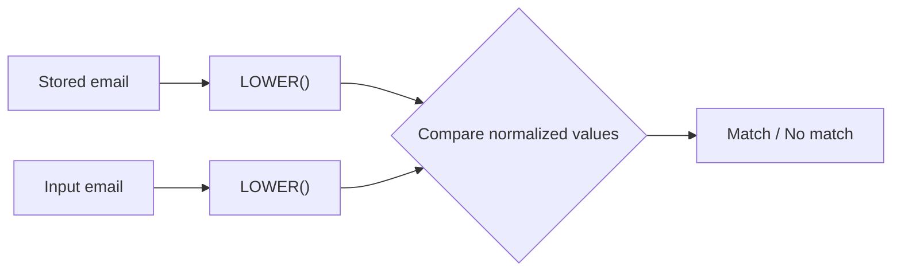
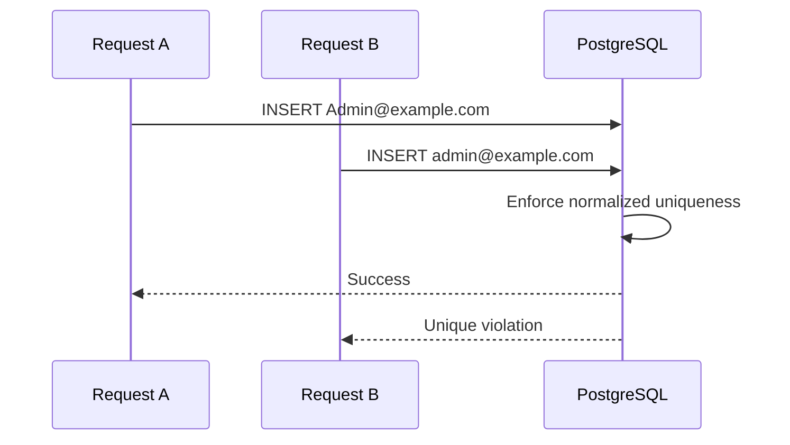

# 04- UPPER and LOWER

## Overview

`UPPER()` and `LOWER()` convert text to uppercase and lowercase respectively. They are commonly used for normalization, case-insensitive comparisons, reporting, search preparation, and enforcing consistent representations of textual data.

The important engineering distinction is between **transforming a value for presentation** and **normalizing a value for comparison or storage**. Applying `LOWER()` or `UPPER()` at query time is convenient, but it can affect index usage and may not fully solve locale- or Unicode-sensitive comparison requirements.

Examples below use PostgreSQL syntax where behavior is database-specific.

## Basic Syntax

```sql
SELECT UPPER('backend engineering');

SELECT LOWER('BACKEND ENGINEERING');
```

Results:

```text
BACKEND ENGINEERING
backend engineering
```

For table data:

```sql
SELECT
    id,
    email,
    LOWER(email) AS normalized_email
FROM users;
```

The functions operate on the value supplied to them and return a transformed string.

## Why Case Transformation Matters

Case normalization appears throughout backend systems:

- Email and username comparisons.
- Case-insensitive search.
- Country and currency codes.
- Reporting and analytics.
- Data migration.
- Import normalization.
- API response formatting.
- Deduplication workflows.
- Canonical identifiers.

For example, these values may be logically equivalent for an application:

```text
User@Example.com
user@example.com
USER@EXAMPLE.COM
```

A query that performs a case-sensitive comparison may treat them as different values.

A normalized comparison can be written as:

```sql
SELECT id
FROM users
WHERE LOWER(email) = LOWER('User@Example.com');
```

However, whether this is the best production design depends on indexing, database collation, and the application's definition of equality.

## UPPER

`UPPER()` converts alphabetic characters to uppercase according to the database's text and collation rules.

```sql
SELECT UPPER('status: pending');
```

Result:

```text
STATUS: PENDING
```

A common reporting use case:

```sql
SELECT
    UPPER(status) AS status,
    COUNT(*) AS order_count
FROM orders
GROUP BY UPPER(status);
```

This can make inconsistent historical values easier to identify or normalize in reports.

### When to Use UPPER

Use `UPPER()` when uppercase representation is part of the requirement, such as:

- Human-readable reports.
- Standardized codes.
- Export formats.
- Display formatting.
- Case-normalized comparisons where uppercase is the chosen canonical form.

Do not use it merely because uppercase "looks cleaner." Preserve the original value when case carries semantic meaning.

## LOWER

`LOWER()` converts alphabetic characters to lowercase according to database text and collation rules.

```sql
SELECT LOWER('Production.API@Example.COM');
```

Result:

```text
production.api@example.com
```

A common backend query is:

```sql
SELECT
    id,
    email
FROM users
WHERE LOWER(email) = LOWER('Admin@Example.com');
```

This performs a case-normalized comparison.

### When to Use LOWER

`LOWER()` is particularly common for:

- Email lookup.
- Case-insensitive search.
- Canonical identifiers.
- User-provided search terms.
- Data normalization.
- Case-insensitive uniqueness strategies.

## UPPER vs LOWER

| Function | Transformation | Common Uses |
|---|---|---|
| `UPPER()` | Converts text to uppercase | Reports, codes, exports |
| `LOWER()` | Converts text to lowercase | Search, comparison, normalization |

Neither function inherently means "case-insensitive." They simply transform values. Case-insensitive behavior results when both sides of a comparison are normalized consistently.

For example:

```sql
WHERE LOWER(email) = LOWER(:email)
```

normalizes both operands.

This is different from:

```sql
WHERE email = :email
```

which depends on the database's comparison semantics.

## Case-Insensitive Comparison

Consider:

```sql
SELECT id
FROM users
WHERE email = 'ADMIN@example.com';
```

If the stored value is:

```text
admin@example.com
```

the result depends on the database's data type, collation, and comparison rules.

Explicit normalization makes the intended comparison clearer:

```sql
SELECT id
FROM users
WHERE LOWER(email) = LOWER('ADMIN@example.com');
```

Conceptually:



This pattern is easy to understand, but it introduces an important production concern: **functions applied to indexed columns can affect index usage**.

## NULL Behavior

Both functions return `NULL` when given `NULL`.

```sql
SELECT
    UPPER(NULL) AS upper_value,
    LOWER(NULL) AS lower_value;
```

Both results are `NULL`.

This follows SQL's general NULL propagation behavior.

It also affects predicates:

```sql
SELECT *
FROM users
WHERE LOWER(email) = 'admin@example.com';
```

Rows with:

```text
email = NULL
```

do not match.

If missing values should be handled separately:

```sql
SELECT *
FROM users
WHERE email IS NULL
   OR LOWER(email) = 'admin@example.com';
```

Do not use `COALESCE()` merely to suppress NULLs unless the application semantics justify treating missing and empty values as equivalent.

## Empty Strings

For an empty string:

```sql
SELECT
    UPPER('') AS upper_value,
    LOWER('') AS lower_value;
```

both return an empty string.

This is different from NULL:

| Input | `LOWER()` | `UPPER()` |
|---|---|---|
| `'Admin'` | `'admin'` | `'ADMIN'` |
| `''` | `''` | `''` |
| `NULL` | `NULL` | `NULL` |

Preserve this distinction when implementing API and database validation.

## LOWER in WHERE Clauses

A common pattern is:

```sql
SELECT id, email
FROM users
WHERE LOWER(email) = LOWER(:email);
```

This is logically correct for a case-normalized comparison.

However, if `users.email` has a normal B-tree index:

```sql
CREATE INDEX idx_users_email
ON users (email);
```

the optimizer may not be able to use that index as effectively for:

```sql
WHERE LOWER(email) = LOWER(:email)
```

because the indexed expression is `email`, while the query expression is `LOWER(email)`.

For high-volume lookup paths, this matters significantly.

## Expression Indexes

PostgreSQL supports indexes on expressions.

```sql
CREATE INDEX idx_users_lower_email
ON users (LOWER(email));
```

The query can then align with the indexed expression:

```sql
SELECT id
FROM users
WHERE LOWER(email) = LOWER('Admin@Example.com');
```

Verify the actual plan:

```sql
EXPLAIN (ANALYZE, BUFFERS)
SELECT id
FROM users
WHERE LOWER(email) = LOWER('Admin@Example.com');
```

An expression index is useful when:

- The query is frequent.
- The expression is deterministic for the relevant workload.
- The table is large enough for indexing to matter.
- The performance improvement justifies additional storage and write overhead.

Do not add expression indexes automatically. Measure the real workload.

## Functional Normalization at Write Time

An alternative is to normalize values when they are written.

For example, an application may establish:

```text
email → lowercase canonical representation
```

Then lookups can use:

```sql
SELECT id
FROM users
WHERE email = :normalized_email;
```

This allows a conventional index:

```sql
CREATE UNIQUE INDEX users_email_unique
ON users (email);
```

The critical requirement is consistency. Every writer must follow the same normalization contract.

In a multi-service architecture, relying only on application code can be risky because different services may implement normalization differently.

## Database-Enforced Normalization

For important invariants, the database can provide stronger guarantees.

PostgreSQL can use an expression-based unique index:

```sql
CREATE UNIQUE INDEX users_email_lower_unique
ON users (LOWER(email));
```

This prevents multiple rows from having values that normalize to the same lowercase representation.

For example, the database can reject an attempt to store both:

```text
Admin@example.com
admin@example.com
```

if both normalize to the same value under the relevant comparison behavior.

This is stronger than checking first in application code:

```text
SELECT → no existing row
INSERT → race condition
```

because concurrent requests can both pass the application-level check.

A database uniqueness constraint or unique index provides atomic enforcement.

## Case Normalization and Concurrency

Consider two concurrent API requests:

```text
Request A: Admin@example.com
Request B: admin@example.com
```

If the application performs:

```sql
SELECT ...
WHERE LOWER(email) = LOWER(:email);
```

and then separately inserts the user, both transactions may observe that no matching user exists.

The correct production design is to enforce uniqueness at the database layer.

Conceptually:



The application should translate the database constraint violation into an appropriate API response.

## Case-Insensitive Search

For search:

```sql
SELECT id, username
FROM users
WHERE LOWER(username) LIKE LOWER(:pattern);
```

For example:

```text
pattern = '%aranya%'
```

This provides simple case-normalized matching.

However, leading-wildcard searches such as:

```sql
LIKE '%aranya%'
```

can be expensive on large datasets because a standard B-tree index generally cannot efficiently seek to the beginning of an arbitrary substring.

For production search requirements, consider:

- Appropriate database indexes.
- PostgreSQL `pg_trgm`.
- Full-text search.
- Dedicated search infrastructure.
- Search-specific data models.

Do not assume `LOWER()` plus `LIKE` constitutes a scalable search solution.

## LOWER with GROUP BY

Case transformation can normalize grouping:

```sql
SELECT
    LOWER(country_code) AS normalized_country,
    COUNT(*) AS customer_count
FROM customers
GROUP BY LOWER(country_code)
ORDER BY customer_count DESC;
```

This can consolidate inconsistent values such as:

```text
IN
in
In
```

into one logical group.

For recurring analytical workloads, consider whether the underlying data should instead be normalized at ingestion time.

Repeatedly normalizing millions of rows during reporting consumes database CPU.

## LOWER with ORDER BY

Sorting can also be made case-normalized:

```sql
SELECT
    username
FROM users
ORDER BY LOWER(username);
```

This is useful when the desired ordering should not distinguish uppercase and lowercase representations.

For large datasets, investigate the execution plan if this is part of a frequently executed endpoint.

## Data Cleanup

`UPPER()` and `LOWER()` are useful during migrations and data-quality work.

For example:

```sql
UPDATE customer_profiles
SET country_code = UPPER(TRIM(country_code))
WHERE country_code IS NOT NULL;
```

This can normalize:

```text
" in "
"IN"
"In"
```

to:

```text
IN
```

For production migrations:

- Test against a representative dataset.
- Understand transaction duration.
- Estimate locking and WAL impact.
- Consider batching for very large tables.
- Monitor replication lag.
- Verify constraints before and after the migration.
- Take an appropriate backup before destructive transformations.

A normalization query that is correct logically can still be operationally dangerous when executed against a very large production table in one transaction.

## Unicode and Locale Considerations

`UPPER()` and `LOWER()` are not simply ASCII transformations.

Case conversion can depend on:

- Unicode rules.
- Database implementation.
- Locale/collation configuration.
- Character encoding.

Do not assume that:

```text
LOWER(x)
```

is equivalent to every possible definition of case-insensitive equality.

This becomes especially important for internationalized applications.

If an identifier has strict canonicalization requirements, define those rules explicitly and test representative Unicode values.

For user-visible international text, application-level Unicode handling may be more appropriate than assuming database case conversion alone provides the desired semantics.

## Collation and Comparison Semantics

Case transformation and collation solve related but different problems.

- `LOWER()` changes the value.
- Collation influences sorting and comparison behavior.
- Case-insensitive types or operators may provide database-specific semantics.

For example, PostgreSQL provides `citext` for case-insensitive text comparisons in appropriate use cases.

The right choice depends on the domain.

For a case-insensitive identifier, a database-native case-insensitive strategy may be preferable to scattering:

```sql
LOWER(column)
```

throughout the application.

For presentation formatting, direct `UPPER()` or `LOWER()` may be sufficient.

## API and ORM Integration

In Django, case-insensitive filtering can be expressed through ORM lookups:

```python
User.objects.filter(email__iexact=email)
```

This communicates the intended comparison at the application level, while the database ultimately determines how that comparison is executed.

For SQLAlchemy or another ORM, use the ORM's supported expression mechanisms rather than interpolating SQL strings manually.

The important production concern is not the ORM syntax itself; it is the generated SQL and its execution plan.

For a hot endpoint, inspect the actual SQL and verify:

- Index usage.
- Rows scanned.
- Query latency.
- Database CPU.
- Lock behavior.

## Performance Considerations

Case transformation is usually inexpensive for a single value, but scale changes the equation.

A query over millions of rows such as:

```sql
SELECT COUNT(*)
FROM users
WHERE LOWER(email) = 'admin@example.com';
```

may require substantial work if the database cannot use an appropriate index.

A better production strategy might be:

```text
API input
   ↓
Normalize email
   ↓
Indexed lookup
   ↓
PostgreSQL
```

rather than:

```text
API input
   ↓
PostgreSQL
   ↓
LOWER() every candidate row
   ↓
Compare
```

The optimizer can make sophisticated decisions, but schema and query design should still align with the access pattern.

## Security Considerations

Case normalization is not a security boundary.

For externally supplied text:

- Validate input length.
- Normalize according to explicit business rules.
- Use parameterized queries.
- Do not concatenate user input into SQL.
- Avoid assuming lowercase conversion prevents malicious input.
- Treat authorization and identity checks separately from formatting.

For authentication identifiers, normalization rules should be defined consistently across:

- Registration.
- Login.
- Password reset.
- Account recovery.
- Administrative tooling.
- Background jobs.
- Data migrations.

A mismatch can cause security and account-ownership bugs.

## Common Mistakes

### Assuming LOWER Automatically Makes Queries Fast

This:

```sql
WHERE LOWER(email) = LOWER(:email)
```

does not guarantee efficient index usage.

For a hot query, consider an expression index or a schema design that stores a canonical representation.

### Normalizing Only One Side

This is incomplete:

```sql
WHERE LOWER(email) = :email
```

unless the application guarantees that `:email` is already normalized.

A self-contained comparison is:

```sql
WHERE LOWER(email) = LOWER(:email)
```

or, preferably, normalize the input at a clearly defined boundary and use a consistent canonical representation.

### Checking Uniqueness in Application Code Only

This is unsafe under concurrency:

```text
SELECT → check → INSERT
```

Use database-enforced uniqueness for identifiers that must be unique.

### Confusing Display Formatting with Canonical Storage

Do not permanently lowercase or uppercase a value simply because a UI happens to display it that way.

For example, names may have meaningful capitalization.

Separate:

```text
stored value
canonical comparison value
display value
```

when the domain requires all three.

### Ignoring Unicode

ASCII assumptions fail for international data.

Test normalization and comparison behavior with representative Unicode inputs when building globally used systems.

### Running Large UPDATE Operations Without Planning

This:

```sql
UPDATE customer_profiles
SET country_code = UPPER(TRIM(country_code));
```

may be reasonable for a small table but operationally expensive for a very large production table.

Plan migrations around locking, transaction size, WAL generation, replication, and rollback strategy.

## Interview Traps

| Question | Correct Reasoning |
|---|---|
| What does `LOWER()` do to `NULL`? | Returns `NULL`. |
| Is `LOWER(column) = LOWER(value)` automatically indexed? | No. A normal index on `column` may not efficiently support the expression. |
| How can PostgreSQL index a lowercase lookup? | Use an expression index such as `CREATE INDEX ... ON table (LOWER(column))`. |
| Does `LOWER()` make two values universally equivalent? | No. Comparison semantics depend on database, collation, Unicode, and domain requirements. |
| Should uniqueness be checked with `SELECT` before `INSERT`? | Not as the sole protection; concurrent requests can race. Enforce uniqueness in the database. |
| Does `LOWER()` mean "case-insensitive search"? | It enables explicit normalized comparison when applied consistently; it is not itself a comparison mode. |
| Why can `LOWER(column) LIKE '%term%'` be slow? | The function and leading wildcard can prevent efficient use of a standard B-tree index. |
| Should all text be lowercased in storage? | No. Only normalize storage when it is an explicit domain invariant. |

## Production Checklist

Before using `UPPER()` or `LOWER()` in a production query, consider:

- **Semantics:** Is the requirement transformation, comparison, sorting, or normalization?
- **NULL:** Should missing values remain distinct?
- **Unicode:** Are non-ASCII inputs supported?
- **Collation:** Does the database's comparison behavior match the domain?
- **Indexes:** Will the expression be evaluated across many rows?
- **Uniqueness:** Is normalized uniqueness enforced by the database?
- **API boundary:** Is input normalized consistently before persistence?
- **Search:** Is `LOWER() + LIKE` sufficient for the expected scale?
- **Migrations:** Could a bulk normalization update create operational pressure?
- **Observability:** Have query latency and execution plans been measured?

## Recommended Practices

- Use `UPPER()` for explicit uppercase presentation or canonical formats where the domain requires it.
- Use `LOWER()` for explicit lowercase normalization and case-normalized comparisons.
- Distinguish presentation formatting from canonical data normalization.
- Do not assume case transformation is equivalent to full Unicode-aware equality.
- Use expression indexes or database-native case-insensitive mechanisms for high-volume lookup paths when appropriate.
- Enforce normalized uniqueness at the database layer rather than relying on application-level pre-checks.
- Inspect generated SQL and `EXPLAIN (ANALYZE, BUFFERS)` for performance-sensitive ORM queries.
- Normalize external identifiers consistently across all services and write paths.
- Plan bulk normalization updates as production migrations rather than treating them as ordinary ad hoc queries.
- Keep original text when capitalization itself carries business meaning.

## Key Takeaways

- **`UPPER()` and `LOWER()` transform text; they do not inherently define case-insensitive equality.**
- **Applying a case function to an indexed column can affect query performance, so high-volume lookups may require expression indexes or a different data model.**
- **Case-insensitive uniqueness should be enforced by the database to remain correct under concurrent requests.**
- **Unicode, collation, and locale semantics make naive ASCII-based assumptions unsafe for globally used systems.**
- **Separate display formatting, comparison normalization, and persistent storage rules instead of lowercasing or uppercasing data indiscriminately.**