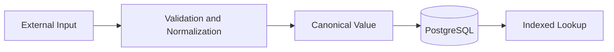

# 07- REPLACE

## Overview

`REPLACE` performs deterministic string substitution by replacing every occurrence of a specified substring with another string.

In backend systems, it is useful for controlled data transformation, normalization, migration work, reporting, and preparing values for downstream systems. Typical examples include removing formatting characters, changing a known delimiter, masking portions of structured text, or migrating legacy representations.

For PostgreSQL:

```sql
REPLACE(source_string, search_string, replacement_string)
```

Example:

```sql
SELECT REPLACE('ORD-2026-001234', '-', '/');
```

Result:

```text
ORD/2026/001234
```

`REPLACE` operates on string content, not on rows or records. It does not perform pattern matching: if the requirement depends on a variable pattern, regular expressions or another string function may be more appropriate.

## Why REPLACE Exists

Applications frequently encounter values whose representation differs from the format required by another component.

Examples:

```text
+91-98765-43210
2026/08/30
ORD-2026-001234
john.doe@example.com
```

A backend query may need to transform these values before:

- Generating reports.
- Migrating legacy data.
- Normalizing imported records.
- Producing integration payloads.
- Preparing search keys.
- Cleaning known formatting characters.
- Converting delimiters between systems.

Example:

```sql
SELECT
    customer_id,
    REPLACE(phone_number, '-', '') AS normalized_phone
FROM customers;
```

The important engineering distinction is that `REPLACE` changes the **representation** of a value. It does not necessarily establish that the resulting value is valid according to business rules.

## Basic Syntax

```sql
REPLACE(source_string, search_string, replacement_string)
```

Example:

```sql
SELECT REPLACE('backend-engineering', '-', ' ');
```

Result:

```text
backend engineering
```

The three arguments are:

| Argument | Purpose |
|---|---|
| `source_string` | Original string |
| `search_string` | Text to find |
| `replacement_string` | Text substituted for each match |

All matching occurrences are replaced.

```sql
SELECT REPLACE('a-b-c-d', '-', ':');
```

Result:

```text
a:b:c:d
```

Unlike an operation that replaces only the first match, `REPLACE` processes every occurrence of the specified substring.

## Replacing Text

The most common use is replacing one literal substring with another.

```sql
SELECT REPLACE('Django REST API', 'REST', 'HTTP');
```

Result:

```text
Django HTTP API
```

This is a literal string replacement.

For example:

```sql
SELECT REPLACE('foofoofoo', 'foo', 'bar');
```

returns:

```text
barbarbar
```

There is no requirement for the search string to occur only once.

## Removing Characters

Passing an empty replacement string effectively removes occurrences.

```sql
SELECT REPLACE('987-65-43210', '-', '');
```

Result:

```text
9876543210
```

This is useful for removing known formatting characters.

For example:

```sql
SELECT REPLACE(account_number, ' ', '')
FROM accounts;
```

However, removing formatting is not the same as validating the resulting value.

If the source is:

```text
ABC 123 XYZ
```

the result is:

```text
ABC123XYZ
```

The database has not established whether that value is a valid account number.

## REPLACE and NULL

If the source value is `NULL`, the result is `NULL`.

```sql
SELECT REPLACE(NULL, '-', '');
```

Result:

```text
NULL
```

This is important when cleaning nullable columns.

Consider:

```sql
SELECT REPLACE(phone_number, '-', '')
FROM customers;
```

A `NULL` phone number remains `NULL`; it does not become an empty string.

If the application explicitly requires an empty string:

```sql
SELECT COALESCE(
    REPLACE(phone_number, '-', ''),
    ''
)
FROM customers;
```

Do this only when `NULL` and empty string have equivalent business semantics. In most well-modeled systems, they represent different states.

## Case Sensitivity

`REPLACE` is generally case-sensitive.

```sql
SELECT REPLACE('Backend API', 'backend', 'service');
```

The lowercase `backend` does not match uppercase `Backend`.

This distinction matters when normalizing user-generated or externally supplied text.

If the requirement is case-insensitive replacement, `REPLACE` alone may not be sufficient. Depending on the database, options include:

- Normalizing case before replacement.
- Using regular-expression functions.
- Using database-specific case-insensitive operations.

For PostgreSQL, regular expressions can provide more flexible matching when required.

## Literal Matching vs Pattern Matching

`REPLACE` searches for a literal substring.

It does not interpret:

```text
%
_
*
.
+
?
```

as general-purpose pattern operators.

For example:

```sql
SELECT REPLACE('a.b.c', '.', '-');
```

returns:

```text
a-b-c
```

The `.` is treated as a literal character.

If you need pattern-based matching, use an appropriate regular-expression function instead.

This distinction is a common interview and production concern:

| Requirement | Appropriate approach |
|---|---|
| Replace exact text | `REPLACE()` |
| Replace based on pattern | Regex |
| Replace first occurrence only | Database-specific string/regex operation |
| Remove surrounding whitespace | `TRIM()` |
| Extract a substring | `SUBSTRING()` |
| Replace a delimiter | `REPLACE()` |

## REPLACE in SELECT

`REPLACE` is commonly used to produce a transformed representation without modifying stored data.

```sql
SELECT
    id,
    reference_code,
    REPLACE(reference_code, '-', '/') AS display_code
FROM orders;
```

This is useful when the transformation is presentation-specific.

For example:

```text
Stored:  ORD-2026-001234
Output:  ORD/2026/001234
```

This approach avoids storing multiple representations of the same value.

## REPLACE in WHERE

`REPLACE` can also be used in predicates.

```sql
SELECT id
FROM customers
WHERE REPLACE(phone_number, '-', '') = '9876543210';
```

This can solve compatibility problems when historical records contain inconsistent formatting.

However, applying a function to a column can affect index usage and query performance.

On a large table, inspect the execution plan:

```sql
EXPLAIN (ANALYZE, BUFFERS)
SELECT id
FROM customers
WHERE REPLACE(phone_number, '-', '') = '9876543210';
```

Do not assume that an index on:

```sql
phone_number
```

will automatically make the expression predicate efficient.

## Expression Indexes

If a transformed value is queried frequently, PostgreSQL can index the expression:

```sql
CREATE INDEX customers_phone_normalized_idx
ON customers (REPLACE(phone_number, '-', ''));
```

A query such as:

```sql
SELECT id
FROM customers
WHERE REPLACE(phone_number, '-', '') = '9876543210';
```

can then potentially use the expression index.

Before introducing such an index, verify:

- Query frequency.
- Table size.
- Predicate selectivity.
- Actual execution plans.
- Additional write cost.
- Index storage overhead.

An expression index is useful when the transformation is stable and unavoidable. It should not automatically be the first solution.

## REPLACE in UPDATE

`REPLACE` can be used to perform controlled data migrations.

Example:

```sql
UPDATE customers
SET phone_number = REPLACE(phone_number, '-', '')
WHERE phone_number LIKE '%-%';
```

This permanently modifies the stored data.

For production migrations, treat this as a data-change operation rather than an ordinary query.

A safer workflow is:

1. Identify affected rows.
2. Estimate the number of changes.
3. Validate the transformation.
4. Back up or ensure recovery capability.
5. Execute within an appropriate transaction strategy.
6. Verify the resulting data.
7. Monitor locks, replication, and application impact.

Before the update:

```sql
SELECT COUNT(*)
FROM customers
WHERE phone_number LIKE '%-%';
```

Preview the transformation:

```sql
SELECT
    id,
    phone_number AS old_value,
    REPLACE(phone_number, '-', '') AS new_value
FROM customers
WHERE phone_number LIKE '%-%
';
```

For large production tables, avoid blindly executing a massive update during peak traffic.

## REPLACE and Data Migration

`REPLACE` is particularly useful for deterministic migration transformations.

Suppose an old system stores:

```text
ORD/2026/001234
```

while the new system expects:

```text
ORD-2026-001234
```

A migration can transform the representation:

```sql
UPDATE orders
SET order_number = REPLACE(order_number, '/', '-')
WHERE order_number LIKE '%/%';
```

However, replacing `/` globally assumes every slash has the same semantic meaning.

For structured values, validate the expected format before transforming it.

A transformation that is syntactically simple can still be logically unsafe if the source data is inconsistent.

## REPLACE and Multiple Transformations

Multiple `REPLACE` calls can be chained.

```sql
SELECT REPLACE(
    REPLACE(phone_number, '-', ''),
    ' ',
    ''
)
FROM customers;
```

This removes both hyphens and spaces.

Another example:

```sql
SELECT REPLACE(
    REPLACE(
        REPLACE(reference_code, '-', ''),
        '/',
        ''
    ),
    ' ',
    ''
)
FROM records;
```

This works, but readability declines as the number of transformations grows.

When normalization becomes complex, consider:

- A dedicated normalization process.
- Application-layer validation.
- ETL/ELT transformation.
- Generated or canonical columns.
- Database-specific regular expressions.

Do not build a large "string-cleaning query" indefinitely.

## REPLACE vs TRANSLATE

PostgreSQL's `TRANSLATE()` is useful when individual characters should be mapped one-to-one.

For example:

```sql
SELECT TRANSLATE('123-456-789', '-', '');
```

can remove a character.

`REPLACE` is more appropriate when replacing a substring or multi-character sequence.

| Requirement | Prefer |
|---|---|
| Replace a substring | `REPLACE()` |
| Remove a specific substring | `REPLACE()` |
| Map individual characters | `TRANSLATE()` |
| Pattern-based replacement | Regex |
| Remove surrounding whitespace | `TRIM()` |

Choosing the right primitive makes intent clearer and can simplify execution.

## REPLACE vs REGEXP_REPLACE

For PostgreSQL:

```sql
REPLACE('a-b-c', '-', ':')
```

performs literal replacement.

A regular expression operation can express more complex rules:

```sql
REGEXP_REPLACE('a-123-b-456', '[0-9]+', 'X', 'g')
```

Result:

```text
a-X-b-X
```

Use regex only when the problem requires pattern matching.

For simple literal replacement:

```sql
REPLACE(value, '-', '')
```

is clearer than:

```sql
REGEXP_REPLACE(value, '-', '', 'g')
```

The simpler operation communicates intent better and avoids unnecessary regex processing.

## REPLACE and Whitespace

`REPLACE` can remove a specific whitespace character:

```sql
SELECT REPLACE('hello world', ' ', '');
```

Result:

```text
helloworld
```

But this is not equivalent to general whitespace normalization.

For boundary whitespace:

```sql
TRIM(value)
```

is more appropriate.

For more complex whitespace handling, database-specific functions or regular expressions may be required.

The key distinction is:

```text
REPLACE → replace an exact substring wherever it occurs
TRIM    → remove characters from string boundaries
```

## REPLACE and Delimited Data

Consider:

```text
ORD-2026-001234
```

Replacing the delimiter is straightforward:

```sql
SELECT REPLACE(order_number, '-', '/')
FROM orders;
```

Result:

```text
ORD/2026/001234
```

This is appropriate when every delimiter should change.

If only one structural component should change, `REPLACE` may be too broad.

For example, if a value contains multiple hyphens with different meanings, blindly replacing all of them can corrupt the representation.

Use `SPLIT_PART()`, `SUBSTRING()`, or structured parsing when the transformation depends on a particular component.

## REPLACE and Data Quality

`REPLACE` is often useful for diagnosing inconsistent data.

For example:

```sql
SELECT
    COUNT(*) AS total,
    COUNT(*) FILTER (
        WHERE phone_number <> REPLACE(phone_number, '-', '')
    ) AS formatted_values
FROM customers;
```

This can help identify how many values contain formatting characters.

Another useful check:

```sql
SELECT
    phone_number,
    REPLACE(phone_number, ' ', '') AS normalized_phone
FROM customers
WHERE phone_number IS NOT NULL
  AND phone_number <> REPLACE(phone_number, ' ', '');
```

This provides a practical view of records requiring normalization.

Data-quality queries like these are often safer than immediately mutating production data.

## Production Data Modeling

Repeatedly normalizing the same value during every request can indicate a schema or ingestion problem.

Suppose a service receives phone numbers in many forms:

```text
98765-43210
98765 43210
+91 98765 43210
9876543210
```

If every API request runs:

```sql
REPLACE(...)
```

multiple times to determine identity, the normalization logic is being performed too late.

A stronger architecture is:



Normalize at the system boundary when possible, then store a canonical representation.

The database can still use `REPLACE` for migration, reporting, or compatibility with legacy data.

## Application Integration

In Django, database-side transformations can be represented using ORM expressions.

For example:

```python
from django.db.models.functions import Replace
from django.db.models import Value

queryset = Customer.objects.annotate(
    normalized_phone=Replace(
        "phone_number",
        Value("-"),
        Value(""),
    )
)
```

This allows PostgreSQL to perform the transformation as part of the query rather than retrieving all rows into Python first.

For a small dataset, Python processing may be perfectly acceptable. For filtering, aggregation, or large datasets, pushing appropriate computation into the database can reduce data transfer and application CPU usage.

The decision should be based on where the transformation belongs and what the query plan looks like.

## Performance Considerations

`REPLACE` is usually inexpensive for a single short string, but cost scales with the amount of text processed and the number of rows evaluated.

A query such as:

```sql
SELECT REPLACE(description, 'old', 'new')
FROM products;
```

may process a large amount of text if `description` contains long values.

The performance implications become more significant when `REPLACE` appears in:

- Large scans.
- `WHERE` predicates.
- `GROUP BY` expressions.
- `ORDER BY` expressions.
- Join conditions.
- Large `UPDATE` operations.

For high-volume queries:

```sql
EXPLAIN (ANALYZE, BUFFERS)
SELECT
    REPLACE(phone_number, '-', '')
FROM customers
WHERE ...
;
```

Look for:

- Sequential scans.
- High rows removed by filters.
- Sort or hash operations.
- Excessive buffer reads.
- Long execution time.
- Large memory consumption.

Optimize the overall query rather than optimizing `REPLACE` in isolation.

## Large-Scale UPDATE Considerations

A statement such as:

```sql
UPDATE customers
SET phone_number = REPLACE(phone_number, '-', '');
```

can affect every row.

On a large production table, this can cause:

- Significant WAL generation.
- Table bloat.
- Replication lag.
- Long-running transactions.
- Lock contention.
- Increased I/O.
- Autovacuum pressure.

For large migrations, consider batching and monitoring the workload rather than issuing an unrestricted update during peak traffic.

The exact strategy depends on:

- Database engine.
- Table size.
- Replication topology.
- Availability requirements.
- Maintenance window.
- Application traffic.

## Security Considerations

`REPLACE` itself does not create SQL injection vulnerabilities.

The security concern is how SQL containing the function is constructed by application code.

Do not construct SQL using untrusted string interpolation:

```python
query = f"""
SELECT REPLACE(name, '{search}', '{replacement}')
FROM customers
"""
```

Use parameterized queries or ORM expressions.

The transformation function does not change the fundamental SQL injection rules.

Also remember that replacement can unintentionally expose or alter sensitive values. For example, replacing text inside identifiers, tokens, or logs should be designed carefully rather than treating string manipulation as a security control.

## Common Mistakes

### Assuming REPLACE Changes Only the First Match

`REPLACE` replaces all matching occurrences.

```sql
SELECT REPLACE('a-a-a', '-', ':');
```

returns:

```text
a:a:a
```

**Avoid it:** use an operation specifically designed for first-occurrence replacement when that is the requirement.

### Confusing Literal Replacement with Regex

`REPLACE` performs literal matching.

**Avoid it:** use regular-expression functions when the replacement depends on a pattern.

### Using REPLACE for Validation

This:

```sql
REPLACE(phone_number, '-', '')
```

does not prove that the phone number is valid.

**Avoid it:** normalize and validate as separate operations.

### Applying REPLACE to Every Query

Repeated normalization during reads can add CPU cost and complicate indexes.

**Avoid it:** canonicalize values during ingestion when the business model permits it.

### Updating Production Data Without a Preview

A global replacement can modify more rows than expected.

**Avoid it:** first inspect affected rows and compare old and transformed values.

### Replacing a Character Without Understanding Its Meaning

If `/` has multiple semantic roles in a structured value, global replacement may corrupt data.

**Avoid it:** parse the structure before modifying a specific component.

### Assuming a Base Index Will Optimize an Expression

This:

```sql
WHERE REPLACE(phone_number, '-', '') = '9876543210'
```

does not automatically mean an ordinary index on `phone_number` will be effective.

**Avoid it:** inspect the plan and consider canonical storage or an expression index.

### Chaining Excessive REPLACE Calls

A query containing many nested replacements becomes difficult to maintain and reason about.

**Avoid it:** move complex normalization into a dedicated transformation layer.

## Interview Traps

| Question | Correct Reasoning |
|---|---|
| Does `REPLACE()` replace only the first occurrence? | No. It replaces every occurrence of the specified substring. |
| Does `REPLACE()` perform regex matching? | No. It performs literal substring replacement. |
| What does an empty replacement string do? | It removes matching occurrences. |
| What happens when the source value is `NULL`? | The result is `NULL`. |
| Is `REPLACE()` the same as `REGEXP_REPLACE()`? | No. Regex replacement supports pattern-based matching. |
| Is `REPLACE()` appropriate for trimming whitespace? | Usually no. `TRIM()` is intended for boundary whitespace. |
| Does using `REPLACE()` in a `WHERE` clause guarantee index usage? | No. An expression may require an expression index or schema redesign. |
| Should normalization always happen inside SQL? | No. Stable canonicalization is often better at the application or ingestion boundary. |
| Is `REPLACE()` safe for arbitrary structured data? | Only if replacing every occurrence is semantically correct. |
| Can `REPLACE()` be used in an `UPDATE`? | Yes, but large updates require careful operational planning. |

## Practical Patterns

### Remove Formatting Characters

```sql
SELECT REPLACE(phone_number, '-', '') AS normalized_phone
FROM customers;
```

### Change a Delimiter

```sql
SELECT REPLACE(order_number, '-', '/') AS display_number
FROM orders;
```

### Remove Spaces

```sql
SELECT REPLACE(reference_code, ' ', '') AS compact_reference
FROM records;
```

### Replace Multiple Values

```sql
SELECT REPLACE(
    REPLACE(phone_number, '-', ''),
    ' ',
    ''
) AS normalized_phone
FROM customers;
```

### Preview a Data Migration

```sql
SELECT
    id,
    phone_number AS old_value,
    REPLACE(phone_number, '-', '') AS new_value
FROM customers
WHERE phone_number LIKE '%-%';
```

### Perform a Controlled Migration

```sql
UPDATE customers
SET phone_number = REPLACE(phone_number, '-', '')
WHERE phone_number LIKE '%-%';
```

For large production tables, execute migrations with an appropriate batching and monitoring strategy.

### Find Values That Need Normalization

```sql
SELECT id, phone_number
FROM customers
WHERE phone_number IS NOT NULL
  AND phone_number <> REPLACE(phone_number, '-', '');
```

## Choosing the Right String Function

| Requirement | Recommended Function |
|---|---|
| Replace an exact substring | `REPLACE()` |
| Replace based on a pattern | `REGEXP_REPLACE()` |
| Map individual characters | `TRANSLATE()` |
| Remove leading/trailing characters | `TRIM()` |
| Extract part of a string | `SUBSTRING()` |
| Extract a delimiter-separated component | `SPLIT_PART()` |
| Convert to uppercase | `UPPER()` |
| Convert to lowercase | `LOWER()` |
| Concatenate strings | `CONCAT()` |

Prefer the narrowest function that directly expresses the transformation.

## Production Checklist

Before using `REPLACE` in production, consider:

- **Scope:** Should every occurrence be replaced?
- **Semantics:** Is the search string literal or pattern-based?
- **NULL behavior:** Should `NULL` remain `NULL`?
- **Data quality:** Does normalization also require validation?
- **Indexing:** Is the expression used in a high-frequency filter?
- **Scale:** How many rows and how much text will be processed?
- **Migration safety:** Have the old and transformed values been compared?
- **Schema design:** Should the canonical value be stored instead?
- **Application boundary:** Can normalization happen once during ingestion?
- **Operational impact:** Could a large update generate excessive WAL, locks, or replication lag?
- **Security:** Are SQL parameters safely bound rather than interpolated?

## Key Takeaways

- **`REPLACE()` performs literal substitution and replaces every occurrence of the specified substring.**
- **Use `REPLACE()` for deterministic text transformations; use regex functions when the requirement depends on a pattern.**
- **Applying `REPLACE()` to columns in filters can affect index usage, so inspect execution plans and consider canonical values or expression indexes.**
- **For production data, separate normalization from validation and carefully preview large `UPDATE` operations before modifying stored values.**
- **Repeated read-time normalization can indicate an ingestion or schema-design problem; canonicalize stable values when the domain permits it.**