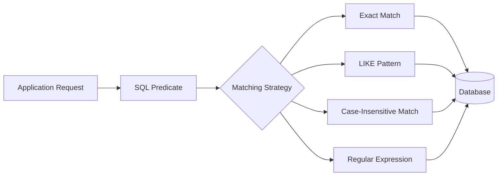
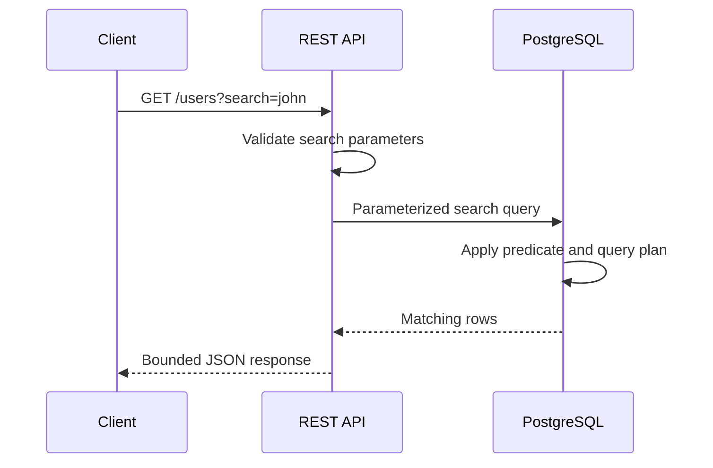

# 08- String Searching and Pattern Matching

## Overview

String searching and pattern matching are used when a query needs to determine whether text contains, starts with, ends with, or matches a particular pattern.

The most common SQL mechanisms are:

- `LIKE` and `NOT LIKE` for simple wildcard matching.
- `ILIKE` in PostgreSQL for case-insensitive `LIKE` matching.
- Regular expressions for complex pattern matching.
- `POSITION()` and `STRPOS()` in PostgreSQL for locating literal substrings.
- `LEFT()`, `RIGHT()`, and related functions when matching is based on known string boundaries.

These operations are common in backend APIs for search, filtering, validation, data-quality checks, reporting, and legacy-data migration. They are also a frequent source of performance problems because text predicates can prevent efficient index usage, especially when a wildcard or function is applied to the beginning of a column.

The key engineering question is not simply **"How do I search this string?"** but:

> **What matching semantics are required, and can the database execute that predicate efficiently at the expected data volume?**

## String Matching Model

A string predicate generally compares a stored value against either:

- A literal value.
- A wildcard pattern.
- A regular expression.
- Another expression derived from the stored value.

Conceptually:



The matching strategy should be chosen based on the business requirement rather than convenience.

## LIKE

`LIKE` performs pattern matching using two wildcard characters:

| Pattern | Meaning |
|---|---|
| `%` | Zero or more characters |
| `_` | Exactly one character |

Example:

```sql
SELECT id, email
FROM users
WHERE email LIKE '%@example.com';
```

This finds values ending in `@example.com`.

A prefix search:

```sql
SELECT id, email
FROM users
WHERE email LIKE 'admin%';
```

matches values beginning with `admin`.

A single-character wildcard:

```sql
SELECT code
FROM products
WHERE code LIKE 'AB_123';
```

matches values such as:

```text
ABC123
ABD123
ABX123
```

but not:

```text
AB123
ABCD123
```

### Why LIKE Exists

`LIKE` provides a simple pattern language without requiring regular expressions.

Use it when the requirement is limited to:

- Prefix matching.
- Suffix matching.
- Contains matching.
- Single-character wildcard matching.

It is easier to understand and generally cheaper than using regex for simple patterns.

## Wildcard Semantics

The position of `%` is particularly important.

### Prefix Search

```sql
WHERE username LIKE 'john%'
```

Conceptually:

```text
john
john123
john.doe
john_admin
```

### Suffix Search

```sql
WHERE username LIKE '%admin'
```

Examples:

```text
admin
johnadmin
system_admin
```

### Contains Search

```sql
WHERE username LIKE '%admin%'
```

Examples:

```text
admin
johnadmin
admin_user
superadmin123
```

### Single Character

```sql
WHERE code LIKE 'A_9'
```

Examples:

```text
AB9
AC9
AX9
```

The wildcard placement is not merely syntactic. It can materially affect query performance.

## Escaping Wildcards

Sometimes `%` or `_` is intended to represent a literal character rather than a wildcard.

SQL supports an `ESCAPE` clause for this purpose.

Example:

```sql
SELECT *
FROM products
WHERE description LIKE '%10\%%' ESCAPE '\';
```

This searches for a literal `%` inside the value.

Likewise:

```sql
SELECT *
FROM users
WHERE username LIKE 'john\_doe' ESCAPE '\';
```

matches:

```text
john_doe
```

rather than treating `_` as a wildcard.

This matters for user-controlled search terms. A search implementation must distinguish between:

```text
user's literal input
```

and:

```text
SQL pattern syntax
```

## NOT LIKE

`NOT LIKE` returns rows that do not match the specified pattern.

```sql
SELECT id, email
FROM users
WHERE email NOT LIKE '%@example.com';
```

This can be useful for data-quality checks and exclusion rules.

However, negative predicates can be difficult to optimize at scale because the database may need to inspect a large portion of the table.

Do not assume that adding an index automatically makes a `NOT LIKE` predicate efficient.

## Case-Insensitive Matching

Case sensitivity depends on the database and its collation/type configuration.

PostgreSQL provides `ILIKE`:

```sql
SELECT id, username
FROM users
WHERE username ILIKE 'john%';
```

This performs case-insensitive pattern matching.

For example, it can match:

```text
john
John
JOHN
john123
```

For portable SQL, case normalization is sometimes used:

```sql
SELECT id, username
FROM users
WHERE LOWER(username) = LOWER('John');
```

However, applying `LOWER()` to the indexed column can prevent a normal index from being used efficiently unless the database has an appropriate functional/expression index.

## LIKE vs ILIKE

| Requirement | PostgreSQL |
|---|---|
| Case-sensitive pattern | `LIKE` |
| Case-insensitive pattern | `ILIKE` |
| Exact case-sensitive comparison | `=` |
| Exact case-insensitive comparison | `LOWER()` or appropriate database-specific design |
| Complex pattern | Regular expression |

The correct choice depends on both semantics and indexing requirements.

## Exact Match vs Pattern Match

Do not use `LIKE` when an exact comparison is sufficient.

Prefer:

```sql
WHERE email = 'user@example.com'
```

over:

```sql
WHERE email LIKE 'user@example.com'
```

The first clearly communicates exact equality.

Similarly:

```sql
WHERE username LIKE 'john%'
```

is appropriate when prefix matching is actually required.

This distinction improves both readability and query optimization opportunities.

## POSITION

PostgreSQL provides `POSITION()` for finding the location of a substring.

```sql
SELECT POSITION('@' IN 'user@example.com');
```

Result:

```text
5
```

A value of `0` indicates that the substring was not found.

Example:

```sql
SELECT
    email,
    POSITION('@' IN email) AS at_position
FROM users;
```

This is useful when the requirement is to determine whether or where a literal substring occurs rather than return a boolean pattern match.

## STRPOS

PostgreSQL also provides `STRPOS()`:

```sql
SELECT STRPOS('user@example.com', '@');
```

Result:

```text
5
```

`STRPOS()` and `POSITION()` express similar substring-location operations in PostgreSQL.

Use the form that best matches the surrounding query style and team conventions.

## Checking Whether a Substring Exists

For a simple existence check, several approaches are possible.

Using `LIKE`:

```sql
WHERE email LIKE '%@%'
```

Using `POSITION()`:

```sql
WHERE POSITION('@' IN email) > 0
```

Using PostgreSQL's `STRPOS()`:

```sql
WHERE STRPOS(email, '@') > 0
```

These are semantically related but are not necessarily equivalent from an optimizer or indexing perspective.

For a simple contains condition, `LIKE '%...%'` is usually the clearest expression.

Do not treat any of these as complete validation.

For example:

```sql
email LIKE '%@%'
```

only establishes that `@` occurs somewhere. It does not establish that the value is a valid email address.

## Regular Expressions

Regular expressions provide pattern matching beyond the capabilities of `%` and `_`.

PostgreSQL supports operators such as:

```sql
~   -- case-sensitive regex match
~*  -- case-insensitive regex match
!~  -- case-sensitive regex non-match
!~* -- case-insensitive regex non-match
```

Example:

```sql
SELECT id, phone_number
FROM customers
WHERE phone_number ~ '^[0-9]{10}$';
```

This matches strings consisting of exactly ten digits.

The pattern:

```text
^
```

means the beginning of the string.

```text
$
```

means the end of the string.

```text
[0-9]
```

matches a digit.

```text
{10}
```

requires ten occurrences.

Therefore:

```text
9876543210
```

matches, while:

```text
98765-43210
```

does not.

## Regex vs LIKE

Use `LIKE` when the pattern is simple:

```sql
WHERE username LIKE 'admin%'
```

Use regex when the requirement contains structural rules:

```sql
WHERE code ~ '^[A-Z]{3}-[0-9]{6}$'
```

| Requirement | `LIKE` | Regex |
|---|---:|---:|
| Prefix match | Excellent | Possible |
| Suffix match | Excellent | Possible |
| Contains | Excellent | Possible |
| Single wildcard | Excellent | Possible |
| Character classes | No | Yes |
| Repetition rules | No | Yes |
| Alternation | No | Yes |
| Complex validation patterns | Limited | Better suited |

Regex is more expressive, but that does not make it the default choice.

## Regex Performance

Regular expressions can be substantially more expensive than simple equality or prefix predicates.

A query such as:

```sql
SELECT id
FROM documents
WHERE content ~ 'complex-pattern';
```

may require significant CPU, especially when applied to large text columns across many rows.

Potential risks include:

- Large sequential scans.
- High CPU utilization.
- Long-running queries.
- Increased database contention.
- Poor API latency.
- Resource exhaustion from expensive user-controlled patterns.

For high-volume search workloads, a relational database regex scan may not be the correct architecture.

## Search Performance and Indexes

The biggest production concern with string searching is often index usage.

Consider:

```sql
CREATE INDEX users_username_idx
ON users (username);
```

A prefix search:

```sql
SELECT id
FROM users
WHERE username LIKE 'john%';
```

has an opportunity to use an index, depending on database, collation, operator class, and query plan.

A contains search:

```sql
SELECT id
FROM users
WHERE username LIKE '%john%';
```

is much harder to accelerate with an ordinary B-tree index because the search pattern does not define a known starting point.

The difference is fundamental:

```text
john%     → starts with known prefix
%john%    → match can begin anywhere
```

Always verify with `EXPLAIN` rather than relying solely on assumptions.

## PostgreSQL Execution Plans

For production troubleshooting:

```sql
EXPLAIN (ANALYZE, BUFFERS)
SELECT id
FROM users
WHERE username LIKE 'john%';
```

Compare it with:

```sql
EXPLAIN (ANALYZE, BUFFERS)
SELECT id
FROM users
WHERE username LIKE '%john%';
```

Look for:

- `Index Scan`.
- `Bitmap Index Scan`.
- `Bitmap Heap Scan`.
- `Seq Scan`.
- Actual rows.
- Rows removed by filter.
- Buffer reads.
- Execution time.

The important engineering question is:

> Does the query plan scale as the table grows?

A query that is fast against 50,000 rows can become a production problem at 50 million rows.

## Functional Expressions and Indexes

A common pattern is:

```sql
WHERE LOWER(username) LIKE 'john%'
```

A normal index on:

```sql
username
```

may not be sufficient because the predicate operates on:

```sql
LOWER(username)
```

PostgreSQL supports expression indexes:

```sql
CREATE INDEX users_username_lower_idx
ON users (LOWER(username));
```

Now the database has an index corresponding to the expression used by the query.

For production systems, index design should follow actual query patterns rather than creating indexes for every possible string transformation.

## PostgreSQL Trigram Search

For substring and fuzzy text search, PostgreSQL's `pg_trgm` extension can be useful.

Enable it:

```sql
CREATE EXTENSION IF NOT EXISTS pg_trgm;
```

Create a GIN index:

```sql
CREATE INDEX users_username_trgm_idx
ON users
USING gin (username gin_trgm_ops);
```

This can significantly improve appropriate `LIKE`, `ILIKE`, and similarity-search workloads, including patterns such as:

```sql
WHERE username ILIKE '%john%'
```

This is often a much better database-native approach than repeatedly scanning a large table.

However, trigram indexes have costs:

- Additional storage.
- Higher write overhead.
- Index maintenance.
- Memory and I/O requirements.
- Less benefit for very short search terms.

Benchmark with representative production-like data before adopting them.

## Prefix Search vs Contains Search

The distinction should influence API and database design.

| Search requirement | Example | Typical strategy |
|---|---|---|
| Exact | `john@example.com` | B-tree equality |
| Prefix | `john%` | B-tree-compatible strategy where supported |
| Contains | `%john%` | Trigram/full-text/search index |
| Regex | `^[A-Z]{3}-` | Regex, potentially specialized search architecture |
| Full-text relevance | "distributed systems" | Full-text/search engine |

Do not implement every search requirement as:

```sql
WHERE column ILIKE '%query%'
```

That pattern is convenient but can become expensive at scale.

## User-Provided Search Terms

Backend APIs frequently expose search parameters:

```http
GET /users?search=john
```

A naive implementation might generate:

```sql
WHERE username ILIKE '%john%'
```

The SQL should still use parameter binding.

Python DB-API example:

```python
search = request.query_params.get("search", "")

sql = """
    SELECT id, username
    FROM users
    WHERE username ILIKE %s
    ORDER BY username
    LIMIT 50
"""

params = [f"%{search}%"]
```

The exact parameter syntax varies by database driver.

Parameterization protects the SQL statement structure, but it does not automatically solve all search-performance concerns.

## Wildcard Injection

Parameterized SQL prevents SQL injection, but user input can still contain SQL pattern characters.

For example, if a user searches for:

```text
%
```

and the application constructs:

```text
% + user_input + %
```

the resulting pattern becomes:

```text
%%%
```

which effectively matches everything.

This is not SQL injection, but it can produce an unintended expensive query.

If the application's contract is **literal substring search**, escape `%` and `_` according to the database's pattern-matching rules before constructing the pattern.

This distinction is important:

```text
SQL injection protection
        ≠
LIKE pattern semantics
        ≠
query cost protection
```

All three need to be addressed independently.

## Pagination and Search

String searches often appear alongside pagination.

Avoid returning an unbounded result set:

```sql
SELECT id, username
FROM users
WHERE username ILIKE '%john%';
```

Prefer bounded results:

```sql
SELECT id, username
FROM users
WHERE username ILIKE '%john%'
ORDER BY id
LIMIT 50;
```

For large APIs, keyset pagination may be preferable to large `OFFSET` values.

Example:

```sql
SELECT id, username
FROM users
WHERE username ILIKE '%john%'
  AND id > 100000
ORDER BY id
LIMIT 50;
```

The search predicate itself still needs an appropriate indexing strategy.

## String Search in REST APIs

A typical backend flow is:



Production concerns include:

- Maximum search length.
- Pagination limits.
- Query timeouts.
- Rate limiting.
- Parameterized SQL.
- Appropriate indexes.
- Observability.
- Protection against pathological search patterns.

## Search Input Validation

Search endpoints should define explicit limits.

For example:

```python
MAX_SEARCH_LENGTH = 100

search = request.query_params.get("search", "").strip()

if len(search) > MAX_SEARCH_LENGTH:
    raise ValueError("Search term is too long")
```

The exact policy depends on the application.

Validation is useful because an unrestricted search endpoint can become an accidental database load generator.

Additional controls may include:

- Minimum search length for contains searches.
- Maximum result size.
- Request rate limits.
- Database statement timeouts.
- Query cancellation.
- Search-specific indexes.
- Dedicated search infrastructure for large workloads.

## Full-Text Search vs String Matching

String pattern matching is not the same as full-text search.

A query such as:

```sql
WHERE description ILIKE '%distributed systems%'
```

is fundamentally different from a full-text search system that understands:

- Tokens.
- Stemming.
- Ranking.
- Language-specific parsing.
- Search relevance.
- Term frequency.

For PostgreSQL, full-text search may be appropriate for document-like content.

For larger search requirements, dedicated systems such as OpenSearch or Elasticsearch may be considered.

The architecture should match the search requirement.

## Common Mistakes

### Using `%term%` for Every Search

This is easy to implement:

```sql
WHERE name ILIKE '%john%'
```

but can require scanning a large portion of the table.

**Avoid it:** determine whether exact, prefix, trigram, full-text, or dedicated search is appropriate.

### Using LIKE for Exact Equality

```sql
WHERE email LIKE 'user@example.com'
```

is unnecessarily indirect.

**Prefer:**

```sql
WHERE email = 'user@example.com'
```

### Assuming an Index Guarantees Fast Search

An index on `username` does not guarantee efficient execution for:

```sql
WHERE username LIKE '%john%'
```

**Avoid it:** inspect the execution plan and use an index strategy designed for the search pattern.

### Using Regex for Simple Prefix Matching

```sql
WHERE username ~ '^john'
```

may work, but:

```sql
WHERE username LIKE 'john%'
```

is clearer when only prefix matching is required.

### Treating LIKE as Validation

This:

```sql
email LIKE '%@%'
```

does not validate an email address.

**Avoid it:** use explicit validation rules appropriate to the domain.

### Forgetting Case Semantics

```sql
WHERE username LIKE 'john%'
```

and:

```sql
WHERE username ILIKE 'john%'
```

can produce different results.

**Avoid it:** explicitly define whether search should be case-sensitive.

### Allowing Unlimited Search Input

Very long patterns or expensive regex expressions can consume significant database resources.

**Avoid it:** impose length limits, rate limits, query timeouts, and appropriate search constraints.

### Confusing Parameterization with Pattern Escaping

A parameterized query is safe from SQL injection, but `%` and `_` still have special `LIKE` meaning.

**Avoid it:** separately handle SQL parameterization and pattern escaping when literal search semantics are required.

### Running Large Regex Scans on Request Paths

Regex scans over millions of rows can create unpredictable API latency.

**Avoid it:** move expensive search workloads to appropriate indexes or dedicated search infrastructure.

## Production Considerations

### Query Planning

Measure representative workloads using:

```sql
EXPLAIN (ANALYZE, BUFFERS)
```

Do not optimize based only on development-table performance.

### Index Design

Choose indexes based on actual predicates:

```text
Equality       → B-tree
Prefix search  → B-tree-compatible strategy where supported
Substring      → pg_trgm or search infrastructure
Full text      → full-text search / search engine
Complex regex  → benchmark carefully
```

The exact implementation depends on the database and workload.

### API Protection

Search endpoints should generally have:

- Bounded input length.
- Bounded result count.
- Pagination.
- Rate limiting where appropriate.
- Query timeouts.
- Observability.

### Monitoring

Monitor:

- Search query latency.
- Database CPU.
- Rows scanned.
- Slow-query frequency.
- Sequential scans on large tables.
- Lock contention.
- Connection pool saturation.
- API error rates.
- Search endpoint traffic.

For PostgreSQL, `pg_stat_statements` is particularly useful for identifying expensive recurring queries when enabled.

### Reliability

Search should not be allowed to starve transactional workloads.

For high-traffic systems, consider:

- Separate read replicas for suitable workloads.
- Dedicated search infrastructure.
- Connection-pool controls.
- Query timeouts.
- Resource isolation.
- Caching for highly repetitive searches.

Read replicas can reduce primary-database pressure, but they do not fix an inefficient query plan. The same expensive scan can simply move to another database.

## Choosing the Right Technique

| Requirement | Recommended approach |
|---|---|
| Exact string | `=` |
| Prefix search | `LIKE 'term%'` |
| Suffix search | `LIKE '%term'` |
| Simple contains search | `LIKE '%term%'` / `ILIKE '%term%'` |
| Case-insensitive PostgreSQL pattern | `ILIKE` |
| Locate literal substring | `POSITION()` / `STRPOS()` |
| Complex structural pattern | Regex |
| Large-scale substring search | `pg_trgm` or search infrastructure |
| Natural-language search | Full-text search |
| User literal containing `%` or `_` | Parameterization + pattern escaping |
| High-volume search API | Specialized indexing/search architecture |

## Interview Traps

| Question | Correct reasoning |
|---|---|
| What does `%` mean in `LIKE`? | Zero or more characters. |
| What does `_` mean? | Exactly one character. |
| Does `LIKE` mean exact equality? | No; it supports wildcard pattern matching. |
| What does `ILIKE` provide in PostgreSQL? | Case-insensitive `LIKE` matching. |
| Why can `%term%` be slow? | A normal B-tree index generally cannot efficiently use a leading wildcard. |
| Does parameterization escape `%` for `LIKE`? | No. It protects SQL structure; pattern semantics remain separate. |
| Is `LIKE '%@%'` valid email validation? | No. It only checks whether `@` occurs somewhere. |
| When should regex be preferred over `LIKE`? | When the matching rule requires pattern features unavailable in `LIKE`. |
| Does an index always make text search fast? | No. Index usefulness depends on the predicate and index type. |
| What is `pg_trgm` useful for? | Efficient similarity and many substring/pattern-search workloads in PostgreSQL. |
| Should a search endpoint return unlimited rows? | No. Bound results and use pagination. |
| Is a regex scan over millions of rows always appropriate? | No. Benchmark it and consider specialized indexing or search infrastructure. |

## Practical Examples

### Prefix Search

```sql
SELECT id, username
FROM users
WHERE username LIKE 'admin%'
ORDER BY username
LIMIT 50;
```

### Case-Insensitive Prefix Search

```sql
SELECT id, username
FROM users
WHERE username ILIKE 'admin%'
ORDER BY username
LIMIT 50;
```

### Contains Search

```sql
SELECT id, username
FROM users
WHERE username ILIKE '%admin%'
ORDER BY username
LIMIT 50;
```

### Locate a Character

```sql
SELECT
    email,
    POSITION('@' IN email) AS at_position
FROM users;
```

### Regex Validation of a Fixed-Format Code

```sql
SELECT id, reference_code
FROM orders
WHERE reference_code ~ '^[A-Z]{3}-[0-9]{6}$';
```

### PostgreSQL Trigram Index

```sql
CREATE EXTENSION IF NOT EXISTS pg_trgm;

CREATE INDEX users_username_trgm_idx
ON users
USING gin (username gin_trgm_ops);
```

### Analyze a Search Query

```sql
EXPLAIN (ANALYZE, BUFFERS)
SELECT id, username
FROM users
WHERE username ILIKE '%john%'
ORDER BY id
LIMIT 50;
```

## Engineering Decision Framework

When implementing a new string-search requirement:

1. **Define the semantics.** Decide whether the search is exact, prefix, suffix, contains, case-insensitive, structural, or full-text.
2. **Choose the simplest SQL primitive.** Prefer `=` over `LIKE`, `LIKE` over regex, when the simpler operation satisfies the requirement.
3. **Estimate the data volume.** A query that is acceptable on thousands of rows may be unacceptable on millions.
4. **Inspect the execution plan.** Use `EXPLAIN (ANALYZE, BUFFERS)` with representative data.
5. **Design the index around the predicate.** Consider B-tree, expression indexes, trigram indexes, full-text search, or a dedicated search engine.
6. **Protect the API.** Bound input size, result size, pagination, and query execution time.
7. **Monitor production behavior.** Track latency, CPU, scans, and database resource consumption.
8. **Revisit the architecture when search becomes a workload of its own.** Do not continuously add SQL complexity to compensate for a search problem that requires a specialized indexing strategy.

## Key Takeaways

- **Choose string matching based on semantics: use `=`, `LIKE`, `ILIKE`, substring functions, or regex only when their specific behavior is required.**
- **Leading wildcards such as `'%term%'` can make ordinary B-tree indexes ineffective, so search performance must be designed and verified with execution plans.**
- **Parameterized SQL protects against SQL injection, but `%` and `_` retain `LIKE` wildcard semantics and may require separate pattern escaping.**
- **Production search endpoints need bounded input, pagination, query timeouts, appropriate indexing, and monitoring to prevent database-intensive searches from becoming reliability problems.**
- **When substring, fuzzy, or natural-language search becomes a major workload, use PostgreSQL features such as `pg_trgm` or dedicated search infrastructure instead of relying on unrestricted scans.**