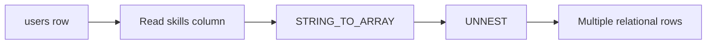
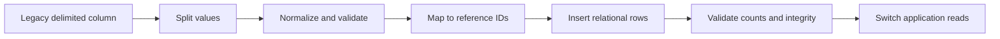

# 09- String Splitting and Aggregation

## Overview

String splitting and aggregation transform between two common representations of structured text:

- **Delimited string → multiple values**: split a string into individual elements.
- **Multiple rows → one string**: aggregate values into a delimited string.

These operations appear frequently in backend systems when dealing with legacy schemas, imported data, tags, permissions, CSV-like fields, reporting, and API serialization.

PostgreSQL provides particularly strong support through functions such as `STRING_TO_ARRAY()`, `STRING_TO_TABLE()`, `UNNEST()`, and `STRING_AGG()`.

A critical production distinction is that **delimited strings are not equivalent to normalized relational data**. Splitting and aggregating can be useful at system boundaries, but repeatedly storing relational data as comma-separated strings usually creates querying, indexing, validation, and concurrency problems.

## Splitting Strings

String splitting takes one string containing delimiters and converts it into multiple logical values.

For example:

```text
"python,django,postgresql"
```

can become:

```text
python
django
postgresql
```

The operation is useful when:

- Importing external delimited data.
- Processing legacy columns.
- Converting serialized values into relational rows.
- Preparing data for joins or filtering.
- Parsing data before application processing.

The exact function depends on the database engine.

## PostgreSQL STRING_TO_ARRAY

PostgreSQL provides `STRING_TO_ARRAY()` to split a string into an array.

```sql
SELECT STRING_TO_ARRAY('python,django,postgresql', ',');
```

Result:

```text
{python,django,postgresql}
```

The delimiter is supplied as the second argument:

```sql
SELECT STRING_TO_ARRAY('red|green|blue', '|');
```

This produces an array containing:

```text
red
green
blue
```

### Splitting With Whitespace

A common issue is inconsistent whitespace:

```text
"python, django, postgresql"
```

Splitting on `,` produces values such as:

```text
python
 django
 postgresql
```

The leading spaces remain.

If the data is controlled by your application, normalize it before storage. If you must process inconsistent legacy data, trim the resulting elements during transformation.

For example:

```sql
SELECT ARRAY(
    SELECT TRIM(value)
    FROM UNNEST(STRING_TO_ARRAY('python, django, postgresql', ',')) AS value
);
```

Result:

```text
{python,django,postgresql}
```

## Empty and NULL Input

Null and empty values require explicit consideration.

```sql
SELECT STRING_TO_ARRAY(NULL, ',');
```

returns `NULL`.

An empty string is different:

```sql
SELECT STRING_TO_ARRAY('', ',');
```

Depending on the database version and function semantics, this represents an empty input rather than a meaningful element.

Do not assume these states are interchangeable:

```text
NULL
''
' '
```

Production data pipelines should define how each state is interpreted.

## STRING_TO_TABLE

PostgreSQL can split a string directly into rows using `STRING_TO_TABLE()`.

```sql
SELECT value
FROM STRING_TO_TABLE(
    'python,django,postgresql',
    ','
) AS value;
```

Conceptually:

| value |
|---|
| python |
| django |
| postgresql |

This is often more useful than creating an array when the next operation is relational.

For example:

```sql
SELECT TRIM(value) AS tag
FROM STRING_TO_TABLE(
    'python, django, postgresql',
    ','
) AS value;
```

The resulting rows can participate in filtering, joins, grouping, and aggregation.

## UNNEST

`UNNEST()` expands an array into rows.

```sql
SELECT value
FROM UNNEST(
    ARRAY['python', 'django', 'postgresql']
) AS value;
```

Result:

| value |
|---|
| python |
| django |
| postgresql |

This creates an important transformation:

```text
String
  ↓
STRING_TO_ARRAY()
  ↓
Array
  ↓
UNNEST()
  ↓
Rows
```

That pattern is useful when legacy string data must temporarily participate in relational operations.

## Splitting a Stored Delimited Column

Suppose a legacy table contains:

```text
user_id | skills
--------+----------------------------
1       | python,django,postgresql
2       | java,spring
```

You can expand it into rows:

```sql
SELECT
    u.user_id,
    TRIM(skill) AS skill
FROM users AS u
CROSS JOIN LATERAL UNNEST(
    STRING_TO_ARRAY(u.skills, ',')
) AS skill;
```

Result:

| user_id | skill |
|---:|---|
| 1 | python |
| 1 | django |
| 1 | postgresql |
| 2 | java |
| 2 | spring |

This is useful for migration and reporting, but it should not automatically become the permanent data model.

## Why LATERAL Matters

The split operation depends on the current row:

```sql
STRING_TO_ARRAY(u.skills, ',')
```

A `LATERAL` join allows the right-hand expression to reference columns from the left-hand row.

Conceptually:



This pattern is especially useful for transforming row-specific collections into relational records.

## Aggregating Strings

The reverse operation combines multiple rows into one string.

PostgreSQL provides:

```sql
STRING_AGG(expression, delimiter)
```

Example:

```sql
SELECT STRING_AGG(username, ', ')
FROM users;
```

If the rows contain:

```text
alice
bob
charlie
```

the result is:

```text
alice, bob, charlie
```

This is a common reporting and API-shaping operation.

## STRING_AGG With GROUP BY

Aggregation becomes more useful when performed per entity.

Suppose:

```text
user_id | skill
--------+-------------
1       | Python
1       | Django
2       | Go
2       | Kubernetes
```

Query:

```sql
SELECT
    user_id,
    STRING_AGG(skill, ', ') AS skills
FROM user_skills
GROUP BY user_id;
```

Result:

| user_id | skills |
|---:|---|
| 1 | Python, Django |
| 2 | Go, Kubernetes |

This converts normalized rows into a presentation-oriented representation.

## Ordering Aggregated Values

Do not assume that aggregation order is deterministic unless an explicit order is specified.

PostgreSQL allows ordering inside `STRING_AGG()`:

```sql
SELECT
    user_id,
    STRING_AGG(skill, ', ' ORDER BY skill) AS skills
FROM user_skills
GROUP BY user_id;
```

Result:

```text
Django, Python
```

instead of relying on whatever row order happens to be produced by the execution plan.

This is important for:

- API responses.
- Reports.
- Snapshot comparisons.
- Caching.
- Tests.
- Deterministic output.

A query plan change, index change, or parallel execution strategy can otherwise alter the order.

## DISTINCT During Aggregation

Duplicate values may need to be removed.

```sql
SELECT
    user_id,
    STRING_AGG(DISTINCT skill, ', ' ORDER BY skill) AS skills
FROM user_skills
GROUP BY user_id;
```

This produces a deterministic list of unique values.

Use `DISTINCT` only when duplicate elimination is part of the requirement. It introduces additional work and can hide upstream data-quality problems.

## NULL Values

Aggregate functions have database-specific behavior around `NULL`.

For PostgreSQL, `STRING_AGG()` ignores `NULL` input values.

For example:

```sql
SELECT STRING_AGG(value, ', ')
FROM (
    VALUES ('python'), (NULL), ('django')
) AS t(value);
```

produces:

```text
python, django
```

If `NULL` carries business meaning, decide explicitly whether it should:

- Be ignored.
- Become a placeholder.
- Be rejected.
- Be transformed before aggregation.

Do not confuse:

```text
no values
```

with:

```text
values exist but some are NULL
```

## STRING_AGG vs ARRAY_AGG

Sometimes a string is not the best aggregation result.

PostgreSQL also provides:

```sql
ARRAY_AGG(expression)
```

Example:

```sql
SELECT
    user_id,
    ARRAY_AGG(skill ORDER BY skill) AS skills
FROM user_skills
GROUP BY user_id;
```

Result:

```text
{Django,Python}
```

The choice depends on what consumes the result.

| Requirement | Better representation |
|---|---|
| Human-readable report | `STRING_AGG()` |
| Delimited legacy format | `STRING_AGG()` |
| Further SQL processing | `ARRAY_AGG()` |
| Application receives a collection | Array / structured JSON |
| API response | JSON/structured data usually preferable |
| Relational querying | Separate rows |

Avoid converting structured data into a string simply because it is convenient.

## Aggregating With Formatting

Aggregation can include expressions.

```sql
SELECT
    department_id,
    STRING_AGG(
        first_name || ' ' || last_name,
        ', '
        ORDER BY last_name, first_name
    ) AS employees
FROM employees
GROUP BY department_id;
```

This is useful for reports where the final representation is intended for human consumption.

Keep presentation-specific formatting close to the reporting boundary rather than turning the database into a general-purpose application formatting layer.

## Splitting and Joining With Relational Data

A powerful pattern is to split a legacy delimited field and join the resulting values against another table.

Suppose:

```text
products.tags = 'python,database,backend'
```

and:

```text
tags
----
python
database
backend
kubernetes
```

You can use:

```sql
SELECT DISTINCT
    p.id,
    p.name,
    t.name AS tag
FROM products AS p
CROSS JOIN LATERAL UNNEST(
    STRING_TO_ARRAY(p.tags, ',')
) AS value
JOIN tags AS t
    ON t.name = TRIM(value);
```

This can support migration and reporting workflows.

However, repeatedly executing this pattern against a large production table can be expensive.

## Delimited Strings vs Normalized Data

A senior-level design decision is recognizing when splitting and aggregation are symptoms of a data-modeling problem.

Consider storing:

```text
user_id | skills
--------+-------------------------
1       | python,django,postgresql
```

versus:

```text
user_id | skill
--------+-------------
1       | python
1       | django
1       | postgresql
```

The normalized representation is generally superior for relational workloads.

| Concern | Delimited string | Normalized rows |
|---|---|---|
| Query individual values | Difficult | Easy |
| Foreign keys | Poor fit | Natural |
| Referential integrity | Difficult | Strong |
| Index individual values | Difficult | Straightforward |
| Duplicate prevention | Difficult | Constraints possible |
| Updates | String manipulation | Row-level operations |
| Joins | Requires splitting | Native |
| Aggregated display | Requires aggregation | `STRING_AGG()` |
| Storage semantics | Ambiguous | Explicit |

A useful architectural principle is:

> **Store data in the representation that supports its primary query and integrity requirements; aggregate it only at the presentation boundary.**

## Backend API Integration

Suppose a Django or FastAPI service needs to return users with their skills.

The database can produce:

```sql
SELECT
    u.id,
    u.username,
    STRING_AGG(s.name, ', ' ORDER BY s.name) AS skills
FROM users AS u
JOIN user_skills AS us
    ON us.user_id = u.id
JOIN skills AS s
    ON s.id = us.skill_id
GROUP BY u.id, u.username;
```

The API might expose:

```json
{
  "id": 42,
  "username": "alice",
  "skills": "Django, PostgreSQL, Python"
}
```

But if the API contract represents skills as a collection, structured output is usually better:

```json
{
  "id": 42,
  "username": "alice",
  "skills": [
    "Django",
    "PostgreSQL",
    "Python"
  ]
}
```

In that case, `ARRAY_AGG()` or JSON aggregation may be more appropriate than `STRING_AGG()`.

The database representation should align with the API contract.

## Migration Pattern

String splitting is especially useful during migrations from legacy schemas.

A typical migration flow is:



Example:

```sql
INSERT INTO user_skills (user_id, skill_id)
SELECT
    u.id,
    s.id
FROM users AS u
CROSS JOIN LATERAL UNNEST(
    STRING_TO_ARRAY(u.skills, ',')
) AS raw_skill
JOIN skills AS s
    ON s.name = TRIM(raw_skill)
WHERE u.skills IS NOT NULL;
```

Production migrations should additionally address:

- Duplicate values.
- Unknown values.
- Empty tokens.
- Whitespace.
- Case normalization.
- Referential integrity.
- Idempotency.
- Transaction size.
- Rollback strategy.
- Validation after migration.

## Performance Considerations

String splitting and aggregation are CPU- and memory-relevant operations.

For example:

```sql
SELECT
    user_id,
    STRING_AGG(skill, ', ' ORDER BY skill)
FROM user_skills
GROUP BY user_id;
```

may require the database to:

1. Read rows.
2. Group rows.
3. Sort values if ordering is requested.
4. Build aggregate state.
5. Produce the final string.

Large groups can therefore consume substantial memory and CPU.

Use:

```sql
EXPLAIN (ANALYZE, BUFFERS)
```

to inspect real workloads.

Important factors include:

- Number of input rows.
- Number of groups.
- Size of each string.
- Whether `DISTINCT` is used.
- Whether ordering is requested.
- Available indexes.
- Concurrent query load.

## Large Aggregated Results

Avoid using string aggregation to generate arbitrarily large API payloads.

For example:

```sql
STRING_AGG(message, ', ')
```

over millions of rows can create:

- Large database memory usage.
- Large network payloads.
- Slow serialization.
- High API latency.
- Excessive client memory usage.

For large collections, return paginated rows or structured resources rather than constructing one enormous string.

## Security Considerations

String splitting and aggregation are not inherently SQL-injection risks, but dynamic SQL construction can introduce vulnerabilities.

Avoid:

```python
sql = f"""
    SELECT STRING_AGG(name, '{delimiter}')
    FROM users
"""
```

when the delimiter or other SQL fragment comes from an untrusted source.

Prefer parameterized values:

```python
sql = """
    SELECT STRING_AGG(name, %s)
    FROM users
"""
params = [delimiter]
```

Not every SQL construct accepts parameters in the same syntactic position, so validate structural choices separately when necessary.

Also consider data leakage. Aggregating values across rows can unintentionally expose information that individual endpoints would normally protect.

## Common Mistakes

### Storing Relational Data as Comma-Separated Strings

Example:

```text
permissions = 'read,write,delete'
```

This makes querying and enforcing integrity difficult.

**Prefer:** a normalized relationship when the values represent independent entities.

### Assuming Aggregation Order

This:

```sql
STRING_AGG(name, ', ')
```

does not communicate a required ordering.

**Prefer:**

```sql
STRING_AGG(name, ', ' ORDER BY name)
```

when deterministic output matters.

### Ignoring Whitespace

Splitting:

```text
python, django, postgres
```

can produce:

```text
python
 django
 postgres
```

**Avoid it:** normalize input at ingestion or trim during migration/transformation.

### Treating Empty Values as Meaningful

A value such as:

```text
python,,django
```

contains an empty token.

**Avoid it:** define whether empty tokens should be discarded, rejected, or preserved.

### Using DISTINCT to Hide Bad Data

This:

```sql
STRING_AGG(DISTINCT skill, ', ')
```

can conceal duplicate relationships caused by an upstream data-quality problem.

Use `DISTINCT` when uniqueness is part of the output requirement, and enforce uniqueness at the data-model level when appropriate.

### Aggregating Huge Result Sets

Generating one giant string can create resource pressure.

**Avoid it:** paginate or return structured rows for large collections.

### Splitting in Every Production Query

Repeatedly applying:

```sql
STRING_TO_ARRAY()
UNNEST()
```

to a large legacy column can become expensive.

**Prefer:** migrate frequently queried data into normalized relational structures.

### Assuming Arrays Solve Relational Modeling

PostgreSQL arrays are useful, but an array is not automatically a substitute for a many-to-many relational table.

If elements have:

- Foreign-key relationships.
- Independent attributes.
- Uniqueness requirements.
- Independent lifecycle.
- Frequent joins.

a normalized relational model is generally more appropriate.

## Production Best Practices

### Normalize at the Boundary

If an external source provides:

```text
python,django,postgresql
```

parse and normalize it during ingestion rather than propagating the delimited representation throughout the system.

### Aggregate at the Presentation Boundary

For reporting:

```sql
STRING_AGG(...)
```

is often appropriate.

For persistent business data, prefer normalized rows.

### Make Output Deterministic

When output is externally visible:

```sql
STRING_AGG(value, ', ' ORDER BY value)
```

is safer than relying on implicit row order.

### Bound Work

Avoid unbounded aggregation in request paths.

Use:

- Pagination.
- Result limits.
- Query timeouts.
- Appropriate indexes.
- Background processing for expensive reports.

### Validate Migrations

After converting a delimited column into relational rows, compare:

- Source records.
- Destination records.
- Expected distinct values.
- Missing values.
- Unknown values.
- Duplicate relationships.

Migration correctness should be measurable rather than assumed.

## Interview Traps

| Question | Correct reasoning |
|---|---|
| What does `STRING_TO_ARRAY()` do in PostgreSQL? | Splits a string into an array using a delimiter. |
| What does `UNNEST()` do? | Expands array elements into rows. |
| What does `STRING_AGG()` do? | Combines multiple values into a delimited string. |
| How do you control aggregation order? | Use `ORDER BY` inside the aggregate expression. |
| Why use `LATERAL` when splitting a column? | The split expression can reference the current row's columns. |
| Should comma-separated values normally be stored for many-to-many relationships? | No; normalized relationship tables are generally preferable. |
| Does `STRING_AGG()` guarantee row order without `ORDER BY`? | No. |
| Why can large string aggregation be expensive? | Grouping, sorting, aggregate state, memory, CPU, and result size can all grow with the input. |
| When is string aggregation appropriate? | Reporting, presentation, export, and other bounded output requirements. |
| When should you avoid it? | Large collections, transactional data modeling, or workloads requiring individual-value querying. |

## Practical Reference

| Operation | PostgreSQL approach |
|---|---|
| Split string into array | `STRING_TO_ARRAY()` |
| Split string into rows | `STRING_TO_TABLE()` |
| Expand array into rows | `UNNEST()` |
| Aggregate rows into string | `STRING_AGG()` |
| Aggregate rows into array | `ARRAY_AGG()` |
| Trim split values | `TRIM()` |
| Deterministic aggregation | `STRING_AGG(... ORDER BY ...)` |
| Unique aggregation | `STRING_AGG(DISTINCT ...)` |
| Row-dependent splitting | `CROSS JOIN LATERAL` |

## Practical Examples

### Split a Delimited String

```sql
SELECT STRING_TO_ARRAY(
    'python,django,postgresql',
    ','
);
```

### Split Into Rows

```sql
SELECT TRIM(value) AS skill
FROM STRING_TO_TABLE(
    'python, django, postgresql',
    ','
) AS value;
```

### Expand a Legacy Column

```sql
SELECT
    u.id,
    TRIM(skill) AS skill
FROM users AS u
CROSS JOIN LATERAL UNNEST(
    STRING_TO_ARRAY(u.skills, ',')
) AS skill;
```

### Aggregate Values

```sql
SELECT
    user_id,
    STRING_AGG(skill, ', ')
FROM user_skills
GROUP BY user_id;
```

### Deterministic Aggregation

```sql
SELECT
    user_id,
    STRING_AGG(skill, ', ' ORDER BY skill) AS skills
FROM user_skills
GROUP BY user_id;
```

### Unique Deterministic Aggregation

```sql
SELECT
    user_id,
    STRING_AGG(
        DISTINCT skill,
        ', '
        ORDER BY skill
    ) AS skills
FROM user_skills
GROUP BY user_id;
```

### Aggregate Into an Array

```sql
SELECT
    user_id,
    ARRAY_AGG(skill ORDER BY skill) AS skills
FROM user_skills
GROUP BY user_id;
```

## Key Takeaways

- **Use string splitting to transform legacy or boundary-format data into relational values, and use aggregation to produce presentation-oriented output.**
- **In PostgreSQL, `STRING_TO_ARRAY()`, `STRING_TO_TABLE()`, `UNNEST()`, and `STRING_AGG()` cover the core split-and-aggregate workflow.**
- **Always specify ordering inside `STRING_AGG()` when deterministic output matters; never depend on implicit row order.**
- **Delimited strings are usually a poor substitute for normalized relational data when values need independent querying, constraints, joins, or lifecycle management.**
- **Bound large split and aggregation workloads, and migrate frequently queried legacy string data into structures that match the application's relational access patterns.**