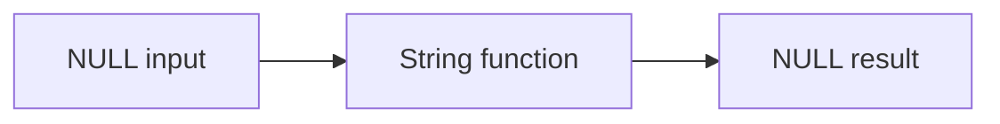
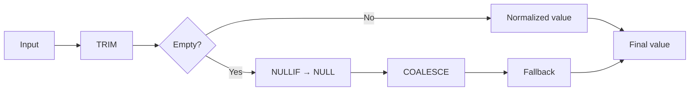

# 10- String Function NULL Behavior

## Overview

`NULL` handling is one of the most important correctness concerns when working with SQL string functions. Functions such as `CONCAT()`, `LENGTH()`, `LOWER()`, `UPPER()`, `TRIM()`, `SUBSTRING()`, and `REPLACE()` do not necessarily behave the same way when an input is `NULL`.

The key distinction is:

- `NULL` means **unknown or missing**, not an empty string.
- `''` means **a known string containing zero characters**.
- `' '` means **a known string containing whitespace**.

These values can produce different results in filtering, validation, indexing, reporting, and API responses.

This document uses PostgreSQL syntax where behavior is database-specific. SQL dialects differ, so production code should always verify the behavior of the target database.

## NULL vs Empty String vs Whitespace

Consider three values:

```sql
NULL
''
'   '
```

They represent different states:

| Value | Meaning | `IS NULL` | `LENGTH()` in PostgreSQL |
|---|---|---:|---:|
| `NULL` | Missing/unknown | `TRUE` | `NULL` |
| `''` | Empty string | `FALSE` | `0` |
| `'   '` | Whitespace | `FALSE` | `3` |

Test them explicitly:

```sql
SELECT
    NULL AS null_value,
    '' AS empty_value,
    '   ' AS whitespace_value;
```

A common production bug is treating all three as "no value."

## The General NULL Propagation Rule

Many SQL functions are **NULL-propagating**:

```text
function(NULL) → NULL
```

For example:

```sql
SELECT
    LENGTH(NULL),
    LOWER(NULL),
    UPPER(NULL),
    TRIM(NULL),
    SUBSTRING(NULL FROM 1 FOR 3),
    REPLACE(NULL, 'a', 'b');
```

These expressions return `NULL`.

Conceptually:



This behavior exists because SQL treats `NULL` as an unknown or absent value. A database generally cannot claim that an operation on an unknown value produced a known string.

However, **not every string-related operation follows simple NULL propagation**. Functions such as PostgreSQL's `CONCAT()` explicitly treat `NULL` arguments differently.

## LENGTH and NULL

`LENGTH()` returns the number of characters in a string.

```sql
SELECT LENGTH('backend');
```

Result:

```text
7
```

For `NULL`:

```sql
SELECT LENGTH(NULL);
```

Result:

```text
NULL
```

This is different from:

```sql
SELECT LENGTH('');
```

which returns:

```text
0
```

Therefore:

```sql
WHERE LENGTH(name) = 0
```

does **not** match rows where `name IS NULL`.

If both states should be treated as empty, handle them explicitly:

```sql
WHERE COALESCE(LENGTH(name), 0) = 0
```

For data validation, however, silently converting `NULL` to zero may hide an important distinction. Prefer explicit business rules.

## UPPER and LOWER With NULL

`UPPER()` and `LOWER()` preserve `NULL`:

```sql
SELECT UPPER(NULL);
SELECT LOWER(NULL);
```

Both return:

```text
NULL
```

Whereas:

```sql
SELECT UPPER('');
SELECT LOWER('');
```

return:

```text
''
```

This matters when normalizing user-provided values.

For example:

```sql
UPDATE users
SET email_normalized = LOWER(email);
```

Rows with `email IS NULL` remain `NULL`.

Do not use:

```sql
LOWER(COALESCE(email, ''))
```

unless the application intentionally wants missing email addresses represented as empty strings.

## TRIM With NULL

`TRIM()` removes leading and trailing spaces by default.

```sql
SELECT TRIM('  python  ');
```

Result:

```text
python
```

But:

```sql
SELECT TRIM(NULL);
```

returns:

```text
NULL
```

This means trimming does not convert a missing value into an empty string.

Compare:

```sql
SELECT
    TRIM(NULL) AS null_value,
    TRIM('') AS empty_value,
    TRIM('   ') AS whitespace_value;
```

Conceptually:

| Input | Result |
|---|---|
| `NULL` | `NULL` |
| `''` | `''` |
| `'   '` | `''` |

This distinction is particularly important for request validation.

## SUBSTRING With NULL

`SUBSTRING()` also propagates `NULL` when its source string is `NULL`.

```sql
SELECT SUBSTRING(NULL FROM 1 FOR 3);
```

Result:

```text
NULL
```

But:

```sql
SELECT SUBSTRING('abcdef' FROM 1 FOR 3);
```

returns:

```text
abc
```

Do not assume that an invalid or missing source string becomes an empty string.

## REPLACE With NULL

`REPLACE()` is another NULL-sensitive function.

```sql
SELECT REPLACE(NULL, 'old', 'new');
```

returns:

```text
NULL
```

Similarly, if the replacement expression itself is `NULL`, the result is `NULL`:

```sql
SELECT REPLACE('backend', 'back', NULL);
```

This differs from some concatenation behavior and is a reason to understand each function's contract instead of assuming all string functions behave identically.

## CONCAT and NULL

PostgreSQL's `CONCAT()` is intentionally different.

```sql
SELECT CONCAT('hello', NULL, 'world');
```

returns:

```text
helloworld
```

`NULL` arguments are treated as empty strings by `CONCAT()`.

Compare this with the `||` concatenation operator:

```sql
SELECT 'hello' || NULL || 'world';
```

The result is:

```text
NULL
```

This difference is important.

| Expression | PostgreSQL result |
|---|---|
| `CONCAT('a', NULL, 'b')` | `ab` |
| `'a' || NULL || 'b'` | `NULL` |
| `CONCAT(NULL, NULL)` | `''` |
| `NULL || 'b'` | `NULL` |

Choose the behavior intentionally.

## CONCAT_WS and NULL

PostgreSQL also provides `CONCAT_WS()` — **concatenate with separator**.

```sql
SELECT CONCAT_WS(
    ' ',
    'Alice',
    NULL,
    'Smith'
);
```

Result:

```text
Alice Smith
```

`CONCAT_WS()` ignores `NULL` arguments when concatenating.

This is useful for optional fields:

```sql
SELECT CONCAT_WS(
    ' ',
    first_name,
    middle_name,
    last_name
) AS full_name
FROM users;
```

If `middle_name` is `NULL`, the output does not contain an unwanted extra separator.

However, an empty string is not the same as `NULL`:

```sql
SELECT CONCAT_WS(
    ' ',
    'Alice',
    '',
    'Smith'
);
```

An empty argument can still affect separator placement.

Normalize data if the application wants empty and missing values to have the same semantics.

## COALESCE for Explicit NULL Handling

`COALESCE()` returns the first non-`NULL` expression.

```sql
SELECT COALESCE(NULL, 'unknown');
```

Result:

```text
unknown
```

For string processing:

```sql
SELECT COALESCE(name, '');
FROM users;
```

This converts `NULL` to an empty string.

You can then apply string functions:

```sql
SELECT LOWER(COALESCE(email, ''))
FROM users;
```

The important design question is not whether `COALESCE()` can eliminate `NULL`, but whether it **should**.

### When COALESCE Is Appropriate

Use it when the business meaning is explicit, such as:

- Displaying an optional field.
- Producing a report with a fallback label.
- Building a non-null API representation.
- Performing calculations where missing values should have a defined default.

Avoid it when `NULL` carries meaningful domain information.

## NULLIF for Converting Empty Values to NULL

The reverse operation is often useful.

`NULLIF()` returns `NULL` when two expressions are equal:

```sql
SELECT NULLIF('', '');
```

Result:

```text
NULL
```

This can normalize empty input:

```sql
SELECT NULLIF(TRIM(email), '');
```

Behavior:

| Input | Result |
|---|---|
| `NULL` | `NULL` |
| `''` | `NULL` |
| `'   '` | `NULL` |
| `' alice@example.com '` | `alice@example.com` |

This is a common boundary-normalization pattern.

For example:

```sql
INSERT INTO users (email)
VALUES (NULLIF(TRIM($1), ''));
```

If the incoming value contains only whitespace, it is stored as `NULL`.

## Combining NULLIF and COALESCE

The two functions solve opposite problems:

```text
NULLIF → convert a specific value into NULL
COALESCE → convert NULL into a fallback value
```

For example:

```sql
SELECT COALESCE(
    NULLIF(TRIM(display_name), ''),
    'Anonymous'
)
FROM users;
```

Processing:



This pattern is useful for presentation logic, but the fallback should be chosen according to business requirements.

## CASE for Explicit Business Rules

When NULL behavior becomes complex, `CASE` is often clearer than nested functions.

```sql
SELECT CASE
    WHEN name IS NULL THEN 'missing'
    WHEN TRIM(name) = '' THEN 'blank'
    ELSE TRIM(name)
END AS normalized_name
FROM users;
```

This distinguishes:

- Missing values.
- Blank values.
- Valid values.

That distinction is valuable during data-quality analysis.

## NULL in Concatenation

Concatenating nullable columns with `||` can unexpectedly produce `NULL`.

Consider:

```sql
SELECT
    first_name || ' ' || last_name AS full_name
FROM users;
```

If `last_name` is `NULL`, the entire expression becomes `NULL`.

For optional fields, use:

```sql
SELECT CONCAT_WS(
    ' ',
    first_name,
    last_name
) AS full_name
FROM users;
```

Or use explicit handling:

```sql
SELECT
    COALESCE(first_name, '') ||
    CASE
        WHEN first_name IS NOT NULL
         AND last_name IS NOT NULL
        THEN ' '
        ELSE ''
    END ||
    COALESCE(last_name, '') AS full_name
FROM users;
```

The `CONCAT_WS()` version is generally easier to maintain.

## NULL in WHERE Conditions

String functions returning `NULL` interact directly with SQL's three-valued logic.

Consider:

```sql
SELECT *
FROM users
WHERE LENGTH(username) > 5;
```

For:

```text
username = NULL
```

the expression:

```text
LENGTH(username) > 5
```

evaluates to:

```text
UNKNOWN
```

The row is therefore not returned.

If you need to explicitly include missing values:

```sql
WHERE username IS NULL
   OR LENGTH(username) > 5;
```

Do not treat `UNKNOWN` as equivalent to `FALSE` conceptually, even though both prevent a row from satisfying a normal `WHERE` predicate.

## NULL in Equality Comparisons

This is a classic SQL mistake:

```sql
WHERE name = NULL
```

It does not correctly test for `NULL`.

Use:

```sql
WHERE name IS NULL
```

Similarly:

```sql
WHERE name <> NULL
```

does not find non-null values.

Use:

```sql
WHERE name IS NOT NULL
```

This distinction is fundamental to reliable SQL.

## NULL in String Filtering

Suppose the requirement is:

> Find users whose name does not contain "admin".

This query:

```sql
WHERE name NOT LIKE '%admin%'
```

does not include rows where `name` is `NULL`.

If `NULL` should also qualify:

```sql
WHERE name IS NULL
   OR name NOT LIKE '%admin%';
```

Alternatively, if the business rule treats missing names as empty strings:

```sql
WHERE COALESCE(name, '') NOT LIKE '%admin%';
```

The second query changes the semantic model, so it should be used intentionally.

## NULL in Aggregation

String aggregation has its own NULL semantics.

In PostgreSQL:

```sql
SELECT STRING_AGG(name, ', ')
FROM users;
```

ignores `NULL` input values.

For example:

```text
Alice
NULL
Bob
```

produces:

```text
Alice, Bob
```

This is different from concatenating nullable values with `||`.

If all input values are `NULL`, `STRING_AGG()` returns `NULL`, not an empty string.

Therefore:

```sql
COALESCE(
    STRING_AGG(name, ', '),
    ''
)
```

can be used when the application requires an empty string for the no-value case.

## NULL in ORDER BY

`NULL` values can also affect ordering.

PostgreSQL supports explicit control:

```sql
ORDER BY name NULLS FIRST;
```

or:

```sql
ORDER BY name NULLS LAST;
```

Do not rely on implicit NULL ordering when deterministic output is important.

This matters when string aggregation uses ordering:

```sql
SELECT STRING_AGG(
    name,
    ', '
    ORDER BY name NULLS LAST
)
FROM users;
```

## Database Dialect Differences

NULL behavior is not completely portable across SQL databases.

For example:

- PostgreSQL has `CONCAT()` and `CONCAT_WS()` with specific NULL semantics.
- MySQL provides similar functions but has its own function and collation behavior.
- SQL Server has different concatenation behavior depending on the operator and configuration.
- Oracle has special semantics around empty strings and `NULL`.

The Oracle distinction is particularly important: Oracle treats a zero-length character string as `NULL` in many contexts, unlike PostgreSQL.

Therefore, code that assumes:

```text
'' ≠ NULL
```

may not behave identically across database engines.

For portable applications, document database-specific assumptions and test against the actual production engine.

## Backend API Considerations

A backend service should establish a consistent contract for missing and empty string values.

For example, an API may return:

```json
{
  "display_name": null,
  "bio": ""
}
```

These values can communicate different semantics:

- `null` → no value exists.
- `""` → value exists but is empty.

If the API contract does not need this distinction, normalize it at a deliberate boundary rather than allowing each query to make its own decision.

For Django or FastAPI applications, the database representation, ORM model, serializer, and API schema should agree on whether fields are nullable.

## Data Normalization Pattern

A common ingestion pipeline is:

```text
HTTP request
    ↓
Application validation
    ↓
Trim whitespace
    ↓
Convert blank values to NULL
    ↓
Database constraint
    ↓
Query / reporting
```

For example:

```sql
NULLIF(TRIM($1), '')
```

provides a compact database-side normalization rule.

For systems with strict validation requirements, application-level validation should still enforce the API contract before persistence.

## Index and Performance Considerations

Applying a string function to a column can affect index usage.

For example:

```sql
SELECT *
FROM users
WHERE LOWER(email) = 'alice@example.com';
```

A normal index on:

```sql
email
```

may not be sufficient for efficient lookup because the query operates on:

```sql
LOWER(email)
```

In PostgreSQL, an expression index can support this pattern:

```sql
CREATE INDEX idx_users_email_lower
ON users (LOWER(email));
```

Alternatively, a normalized column can be maintained explicitly.

The same principle applies to other transformations:

```sql
TRIM(name)
UPPER(code)
LOWER(email)
```

Do not assume that adding a function to a predicate is free from an indexing perspective.

## Production Considerations

### Preserve Domain Semantics

Do not automatically convert:

```text
NULL → ''
```

or:

```text
'' → NULL
```

without defining what the states mean to the application.

### Normalize at Clear Boundaries

A good architecture has predictable normalization points:

- Request validation.
- ETL/import processing.
- Database constraints.
- Read-model construction.

Avoid inconsistent normalization across individual queries.

### Prefer Constraints Over Query-Time Cleanup

If a field must never be blank, enforce that requirement in the data model where practical.

For example, a PostgreSQL constraint can reject whitespace-only values:

```sql
ALTER TABLE users
ADD CONSTRAINT users_name_not_blank
CHECK (name IS NULL OR LENGTH(TRIM(name)) > 0);
```

This allows `NULL` while preventing non-null blank values.

If the column itself must be mandatory:

```sql
ALTER TABLE users
ALTER COLUMN name SET NOT NULL;

ALTER TABLE users
ADD CONSTRAINT users_name_not_blank
CHECK (LENGTH(TRIM(name)) > 0);
```

Database constraints protect data regardless of whether writes originate from Django, FastAPI, Celery, a migration, or another service.

### Be Careful With Migrations

Changing existing empty strings to `NULL` can affect:

- Application code.
- Unique constraints.
- Indexes.
- API serialization.
- Analytics.
- Reporting.
- ORM behavior.

Treat normalization migrations as schema/data-model changes, not simple cleanup scripts.

## Common Mistakes

### Comparing With `= NULL`

Incorrect:

```sql
WHERE email = NULL
```

Correct:

```sql
WHERE email IS NULL
```

### Assuming All String Functions Treat NULL the Same

For example:

```sql
LOWER(NULL)
```

returns `NULL`, while PostgreSQL's:

```sql
CONCAT('a', NULL, 'b')
```

returns:

```text
ab
```

Know the function contract.

### Treating Empty String as NULL

These are distinct in PostgreSQL:

```sql
NULL
''
```

Use `NULLIF()` when you intentionally want to normalize empty strings to `NULL`.

### Using COALESCE Everywhere

This:

```sql
COALESCE(email, '')
```

may make output convenient but can destroy the distinction between:

```text
missing email
```

and:

```text
empty email
```

Use it where the fallback has an explicit business meaning.

### Forgetting Whitespace

This:

```sql
name = ''
```

does not match:

```text
'   '
```

Use:

```sql
TRIM(name) = ''
```

when whitespace-only values should be considered blank.

### Breaking Index Usage

This:

```sql
WHERE LOWER(email) = ?
```

can require an expression index or a normalized lookup column.

Always verify with:

```sql
EXPLAIN (ANALYZE, BUFFERS)
```

for performance-sensitive queries.

### Assuming Database Portability

NULL and empty-string behavior can differ significantly between PostgreSQL, MySQL, SQL Server, and Oracle.

Do not write portability-sensitive code based solely on behavior observed in one database.

## Interview Traps

| Question | Correct answer |
|---|---|
| Is `NULL` the same as `''` in PostgreSQL? | No. `NULL` represents missing/unknown; `''` is an empty string. |
| What does `LENGTH(NULL)` return? | `NULL`. |
| What does `TRIM(NULL)` return? | `NULL`. |
| What does `LOWER(NULL)` return? | `NULL`. |
| What does `CONCAT('a', NULL, 'b')` return in PostgreSQL? | `ab`. |
| What does `'a' \|\| NULL \|\| 'b'` return in PostgreSQL? | `NULL`. |
| How do you test for NULL? | `IS NULL` or `IS NOT NULL`. |
| How do you convert an empty string to NULL? | `NULLIF(value, '')`. |
| How do you provide a fallback for NULL? | `COALESCE(value, fallback)`. |
| How do you treat whitespace-only strings as NULL? | Commonly `NULLIF(TRIM(value), '')`. |
| Does `STRING_AGG()` include NULL values? | PostgreSQL ignores NULL input values. |
| Can functions on columns affect index usage? | Yes; expression indexes or normalized columns may be required. |
| Is NULL behavior identical across all SQL databases? | No. |

## Practical Reference

| Expression | PostgreSQL behavior |
|---|---|
| `LENGTH(NULL)` | `NULL` |
| `LOWER(NULL)` | `NULL` |
| `UPPER(NULL)` | `NULL` |
| `TRIM(NULL)` | `NULL` |
| `SUBSTRING(NULL FROM 1 FOR 3)` | `NULL` |
| `REPLACE(NULL, 'a', 'b')` | `NULL` |
| `CONCAT('a', NULL, 'b')` | `ab` |
| `'a' \|\| NULL \|\| 'b'` | `NULL` |
| `CONCAT_WS(' ', 'a', NULL, 'b')` | `a b` |
| `COALESCE(NULL, 'x')` | `x` |
| `NULLIF('', '')` | `NULL` |
| `STRING_AGG(value, ', ')` with NULL inputs | NULL inputs ignored |

## Recommended Patterns

### Treat Blank Input as Missing

```sql
NULLIF(TRIM($1), '')
```

Use when whitespace-only input should have the same meaning as missing input.

### Provide a Display Fallback

```sql
COALESCE(NULLIF(TRIM(display_name), ''), 'Anonymous')
```

Use when the UI requires a guaranteed display value.

### Safely Concatenate Optional Fields

```sql
CONCAT_WS(' ', first_name, middle_name, last_name)
```

Use when nullable components should be omitted without producing unwanted separators.

### Preserve NULL Semantics

```sql
LOWER(email)
```

Prefer this over:

```sql
LOWER(COALESCE(email, ''))
```

when `NULL` must remain distinguishable from an empty string.

### Enforce Non-Blank Data

```sql
CHECK (name IS NULL OR LENGTH(TRIM(name)) > 0)
```

Use a database constraint when the invariant must hold regardless of which service writes the data.

## Key Takeaways

- **`NULL`, `''`, and whitespace-only strings are distinct states in PostgreSQL; do not collapse them without an explicit business rule.**
- **Most string functions such as `LENGTH()`, `LOWER()`, `UPPER()`, `TRIM()`, `SUBSTRING()`, and `REPLACE()` propagate `NULL`, while `CONCAT()` and `CONCAT_WS()` have different NULL semantics.**
- **Use `IS NULL`, `IS NOT NULL`, `NULLIF()`, and `COALESCE()` deliberately to express the intended missing-value behavior.**
- **Normalize nullable string data at well-defined boundaries and enforce important invariants with database constraints rather than relying only on query-time cleanup.**
- **Database-specific NULL and empty-string semantics matter for portability, correctness, indexing, API behavior, and production migrations.**