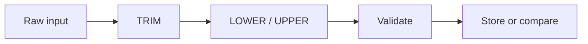
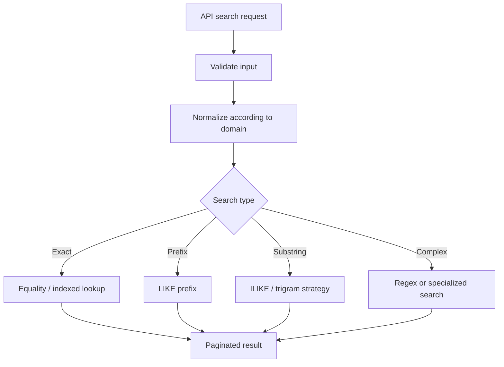

# 12- Common String Processing Patterns

## Overview

Production SQL rarely uses string functions in isolation. Backend systems commonly need to normalize user input, construct display values, clean imported data, extract structured components, perform case-insensitive comparisons, or search text.

The most useful skill is recognizing recurring **string-processing patterns** and selecting the simplest implementation that preserves correctness and remains performant at scale.

Common patterns include:

- Normalizing whitespace and case.
- Converting blank values to `NULL`.
- Constructing display strings.
- Cleaning imported or legacy data.
- Extracting structured identifiers.
- Removing formatting characters.
- Performing case-insensitive searches.
- Detecting malformed values.
- Combining multiple transformations safely.
- Moving repeated transformations into indexed or persisted representations.

The examples in this document use PostgreSQL syntax where behavior is database-specific.

## Core String Processing Patterns

| Pattern | Typical functions/operators | Primary purpose |
|---|---|---|
| Concatenation | `CONCAT()`, `CONCAT_WS()` | Construct values |
| Whitespace normalization | `TRIM()` | Remove boundary whitespace |
| Case normalization | `LOWER()`, `UPPER()` | Standardize case |
| Blank-to-NULL | `NULLIF()` | Normalize missing values |
| NULL fallback | `COALESCE()` | Provide a default |
| Substring extraction | `SUBSTRING()` | Extract known portions |
| Literal replacement | `REPLACE()` | Remove or substitute text |
| Pattern search | `LIKE`, `ILIKE` | Search text |
| Complex pattern matching | Regex operators | Validate or match patterns |
| Character counting | `LENGTH()` | Measure characters |
| Byte counting | `OCTET_LENGTH()` | Measure encoded size |

## Normalizing User Input

A common production pattern is to normalize user input before storing or comparing it.

For example, suppose an API accepts a customer name:

```text
"   Alice Johnson   "
```

A basic normalization is:

```sql
SELECT TRIM($1);
```

For values where case should also be normalized:

```sql
SELECT LOWER(TRIM($1));
```

The processing pipeline is:



The order matters. If the requirement is simply to remove boundary whitespace and normalize case, either of these often produces the same result:

```sql
LOWER(TRIM($1))
```

and:

```sql
TRIM(LOWER($1))
```

However, more complex transformations may not be commutative. Treat the sequence as part of the data contract rather than rearranging functions casually.

### Production Recommendation

Do not blindly normalize every string.

Different fields have different semantics:

- Email addresses may need case-insensitive lookup.
- Passwords must **not** be lowercased or trimmed automatically.
- Human names may legitimately contain meaningful case.
- API tokens may be case-sensitive.
- Country codes may be normalized to uppercase.
- Free-form descriptions should generally preserve user input.

Normalization should be based on the domain invariant.

## Converting Blank Values to NULL

Imported systems frequently contain a mixture of:

```text
NULL
''
'   '
```

If the application considers all three to mean "missing", normalize them explicitly:

```sql
NULLIF(TRIM($1), '')
```

Example:

```sql
INSERT INTO customers (middle_name)
VALUES (NULLIF(TRIM($1), ''));
```

The transformation is:

```text
" Alice " → "Alice"
"   "     → NULL
""        → NULL
NULL      → NULL
```

This is especially useful during:

- CSV imports.
- ETL pipelines.
- Legacy migrations.
- Data cleanup jobs.
- API ingestion.

### Why This Matters

Treating blank strings and `NULL` as equivalent can simplify downstream queries:

```sql
WHERE middle_name IS NULL
```

instead of repeatedly handling multiple representations of missing data.

However, do this only when the domain explicitly defines blank as missing.

## Providing Defaults with COALESCE

Use `COALESCE()` when a missing value needs a fallback.

```sql
SELECT COALESCE(display_name, 'Anonymous')
FROM users;
```

For cleaned values:

```sql
SELECT COALESCE(
    NULLIF(TRIM(display_name), ''),
    'Anonymous'
)
FROM users;
```

This creates a useful pattern:

```text
raw value
   ↓
TRIM
   ↓
empty?
 ┌─┴─┐
yes no
 ↓   ↓
NULL value
 └─┬─┘
   ↓
COALESCE
   ↓
fallback
```

### Important Distinction

`COALESCE()` is not the same as data normalization.

This:

```sql
COALESCE(name, 'Unknown')
```

changes how missing data is **represented in the result**.

It does not change the stored value.

This distinction is important when designing reporting queries versus data-cleaning pipelines.

## Building Display Values

Display values often combine nullable columns.

Prefer `CONCAT_WS()` when optional components are involved:

```sql
SELECT CONCAT_WS(
    ' ',
    first_name,
    middle_name,
    last_name
) AS display_name
FROM users;
```

For an address:

```sql
SELECT CONCAT_WS(
    ', ',
    address_line_1,
    address_line_2,
    city,
    state,
    postal_code
) AS formatted_address
FROM addresses;
```

This is generally cleaner than manually adding separators.

### Avoid Persisting Presentation Strings

A display name such as:

```text
Alice Johnson
```

can usually be derived from:

```text
first_name
last_name
```

Persisting both introduces consistency concerns.

For example:

```text
first_name = Alice
last_name  = Johnson
display_name = Alice Johnson
```

If `last_name` changes and `display_name` is not updated, the system contains conflicting representations.

Persist a derived value only when there is a clear reason, such as:

- Expensive repeated computation.
- Search/indexing requirements.
- External integration requirements.
- Historical snapshot semantics.

## Removing Formatting Characters

Imported data often contains formatting characters that are not part of the canonical value.

For example:

```text
123-456-7890
```

can be transformed with:

```sql
SELECT REPLACE(phone_number, '-', '')
FROM customers;
```

Result:

```text
1234567890
```

For multiple known formatting characters, PostgreSQL's `TRANSLATE()` can sometimes be useful:

```sql
SELECT TRANSLATE(phone_number, '()- ', '')
FROM customers;
```

This removes the listed characters from the value.

### REPLACE vs TRANSLATE

| Requirement | Better choice |
|---|---|
| Replace a substring with another substring | `REPLACE()` |
| Remove or map individual characters | `TRANSLATE()` |
| Complex pattern transformation | Regex |

Do not use regex when a simpler literal transformation is sufficient.

## Extracting Structured Values

Some legacy systems encode multiple pieces of information in one string.

Example:

```text
ORD-2026-000184
```

A fixed-format extraction can use:

```sql
SELECT SUBSTRING(order_reference FROM 5 FOR 4) AS year
FROM orders;
```

However, repeatedly parsing structured identifiers is often a sign that the underlying attributes may deserve separate columns.

If the application frequently needs:

```text
order_type
order_year
order_sequence
```

modeling these independently may provide:

- Better indexing.
- Simpler queries.
- Better constraints.
- Easier validation.
- More maintainable application code.

### Senior-Level Rule

String parsing is useful for **integration boundaries and legacy data**.

It should not automatically become a substitute for relational modeling.

## Prefix and Suffix Extraction

Known prefixes and suffixes can be handled with string functions or pattern matching.

For example:

```sql
SELECT SUBSTRING(invoice_number FROM 1 FOR 3) AS prefix
FROM invoices;
```

For a prefix search:

```sql
SELECT *
FROM invoices
WHERE invoice_number LIKE 'INV%';
```

These are not equivalent.

The first **transforms each value**.

The second **filters rows based on a pattern**.

That distinction affects indexing and performance.

## Case-Insensitive Normalization

For case-insensitive comparisons:

```sql
SELECT *
FROM users
WHERE LOWER(email) = LOWER($1);
```

For high-volume lookups, make the comparison strategy index-aware.

An expression index can support the query:

```sql
CREATE INDEX idx_users_lower_email
ON users (LOWER(email));
```

Then:

```sql
SELECT id
FROM users
WHERE LOWER(email) = LOWER($1);
```

can use the indexed expression.

For a frequently queried identity field, another option is a dedicated normalized representation.

The architectural choice depends on:

- Query volume.
- Data ownership.
- Uniqueness requirements.
- Case semantics.
- Database capabilities.
- Migration complexity.

## Search Patterns

### Exact Search

Use equality when exact matching is required:

```sql
WHERE status = 'active'
```

This is generally the simplest and most index-friendly form.

### Prefix Search

Use:

```sql
WHERE username LIKE 'alice%'
```

when searching by prefix.

### Substring Search

Use:

```sql
WHERE username ILIKE '%alice%'
```

when the search term can occur anywhere.

On large PostgreSQL tables, consider specialized indexing such as `pg_trgm`:

```sql
CREATE EXTENSION IF NOT EXISTS pg_trgm;

CREATE INDEX idx_users_username_trgm
ON users USING gin (username gin_trgm_ops);
```

The right choice should be validated against the real workload.

### Search Flow



## Cleaning Imported Data

SQL string functions are frequently used during data migrations.

A typical import pipeline may receive:

```text
"  alice@example.com "
" ALICE@EXAMPLE.COM"
""
"   "
```

A normalization expression could be:

```sql
LOWER(NULLIF(TRIM(email), ''))
```

A migration can then populate a normalized field:

```sql
UPDATE customer_import
SET normalized_email = LOWER(NULLIF(TRIM(email), ''));
```

For large tables, avoid blindly running expensive transformations in one transaction.

Consider:

- Batch processing.
- Lock duration.
- Transaction size.
- Replication lag.
- WAL generation.
- Query concurrency.
- Rollback strategy.

For very large datasets, an application worker or controlled migration process may be safer than one massive update.

## Combining Multiple Functions

Real-world transformations often combine several functions.

Example:

```sql
SELECT LOWER(
    NULLIF(
        TRIM(email),
        ''
    )
) AS normalized_email
FROM customer_import;
```

The conceptual sequence is:

```text
email
  ↓
TRIM
  ↓
empty string → NULL
  ↓
LOWER
  ↓
normalized representation
```

A more complex display expression might be:

```sql
SELECT COALESCE(
    NULLIF(
        TRIM(
            CONCAT_WS(' ', first_name, last_name)
        ),
        ''
    ),
    'Unknown'
) AS display_name
FROM users;
```

When expressions become difficult to reason about, prioritize readability.

A common production alternative is to split transformation stages into a CTE:

```sql
WITH normalized AS (
    SELECT
        id,
        LOWER(NULLIF(TRIM(email), '')) AS email
    FROM customer_import
)
SELECT *
FROM normalized
WHERE email IS NOT NULL;
```

CTEs do not automatically make a query faster, but they can make complex transformation pipelines easier to review and maintain.

## Data Normalization at the Database Boundary

A robust backend architecture often has multiple validation layers:


SQL functions can participate in normalization, but they should not be the only validation layer.

For example:

- FastAPI/Pydantic can validate request shape.
- Django forms/serializers can validate application input.
- PostgreSQL constraints can enforce database invariants.
- SQL string functions can normalize or transform data.

The database should remain authoritative for invariants that must hold regardless of which application or service writes the data.

## String Processing in UPDATE Statements

String transformations are particularly important during cleanup operations.

Example:

```sql
UPDATE users
SET display_name = TRIM(display_name)
WHERE display_name IS NOT NULL;
```

Before executing large updates:

```sql
SELECT
    COUNT(*) AS affected_rows
FROM users
WHERE display_name IS NOT NULL;
```

Then inspect representative values:

```sql
SELECT
    id,
    display_name,
    TRIM(display_name) AS normalized_display_name
FROM users
WHERE display_name IS DISTINCT FROM TRIM(display_name)
LIMIT 100;
```

This allows the transformation to be reviewed before modifying production data.

### Production Migration Pattern

1. Measure the affected rows.
2. Preview the transformation.
3. Test against representative edge cases.
4. Check indexes and constraints.
5. Estimate transaction and replication impact.
6. Run in controlled batches when appropriate.
7. Monitor database health.
8. Verify post-migration invariants.

## Indexing Implications

String functions can change how a query interacts with indexes.

Consider:

```sql
SELECT *
FROM users
WHERE LOWER(email) = 'alice@example.com';
```

A normal index on:

```sql
CREATE INDEX idx_users_email
ON users (email);
```

does not necessarily solve the expression lookup.

An expression index can align the index with the query:

```sql
CREATE INDEX idx_users_email_lower
ON users (LOWER(email));
```

Similarly, substring searches may require specialized indexes.

Always inspect the actual plan:

```sql
EXPLAIN (ANALYZE, BUFFERS)
SELECT id
FROM users
WHERE LOWER(email) = 'alice@example.com';
```

### Important Principle

> A correct string expression is not automatically a performant query predicate.

Query shape and index design must be considered together.

## Application vs Database String Processing

| Processing location | Best suited for | Main advantage | Main concern |
|---|---|---|---|
| API/application | Request validation and domain logic | Explicit business logic | Multiple services may implement it differently |
| Database query | Presentation and query-time transformation | Centralized SQL behavior | Can increase query cost |
| Database write path | Canonical normalization | Consistent stored representation | Requires clear data invariant |
| ETL/migration | Historical cleanup | Controlled bulk processing | Operational complexity |
| Search system | Advanced text search | Specialized indexing/ranking | Additional infrastructure |

A useful rule is:

- **Business invariant** → enforce near the data boundary.
- **Presentation formatting** → usually transform at read time.
- **High-volume search normalization** → design explicitly for indexing.
- **One-time historical cleanup** → migration or ETL.
- **Complex relevance-based search** → consider a dedicated search technology.

## Common Backend Examples

### Normalize an Email for Lookup

```sql
SELECT id
FROM users
WHERE LOWER(email) = LOWER($1);
```

Production considerations:

- Decide whether email comparison is case-sensitive according to the application's requirements.
- Use an appropriate index.
- Enforce uniqueness according to the same comparison semantics.
- Do not normalize unrelated credential fields using the same rule.

### Clean a Name Before Display

```sql
SELECT CONCAT_WS(
    ' ',
    NULLIF(TRIM(first_name), ''),
    NULLIF(TRIM(last_name), '')
) AS display_name
FROM users;
```

This avoids producing excessive whitespace when one component is missing.

### Normalize a Country Code

```sql
SELECT UPPER(TRIM(country_code))
FROM addresses;
```

If the domain requires exactly two characters, enforce that separately with validation or a database constraint.

### Remove Known Phone Formatting

```sql
SELECT REPLACE(phone_number, '-', '')
FROM customers;
```

For a production phone-number system, however, consider storing a canonical phone representation rather than repeatedly stripping formatting during every query.

### Convert Legacy Blank Values

```sql
UPDATE customer_import
SET phone_number = NULL
WHERE NULLIF(TRIM(phone_number), '') IS NULL;
```

Always preview the affected records before executing destructive or large-scale cleanup.

## Common Mistakes

### Applying Every Transformation at Query Time

This pattern:

```sql
WHERE LOWER(TRIM(REPLACE(email, '-', ''))) = $1
```

may be functionally correct but expensive on a large table.

If the normalized value is queried frequently, consider a canonical representation and appropriate indexing.

### Using String Functions to Repair Bad Schema Design

Repeatedly parsing:

```text
tenant-123-user-456
```

may be convenient initially, but if tenant and user IDs are independently queried, storing them separately is usually more robust.

### Treating Empty String and NULL as Identical

They are distinct SQL values.

Do not use:

```sql
WHERE field IS NULL
```

when the dataset can contain meaningful empty strings unless the application explicitly treats them as equivalent.

### Normalizing Sensitive Values

Do not apply generic normalization to values where exact bytes or case matter.

Examples include:

- Passwords.
- Cryptographic tokens.
- Signed payloads.
- API secrets.
- Hash inputs.

Normalization must follow the security and protocol contract.

### Using Regex for Simple Transformations

Prefer:

```sql
REPLACE(value, '-', '')
```

over regex if all that is required is removing literal hyphens.

Simpler expressions are generally easier to understand, test, and optimize.

### Ignoring Unicode

ASCII assumptions can fail for internationalized data.

String operations may interact with:

- Unicode normalization.
- Collation.
- Locale-specific case behavior.
- Character versus byte length.

For globally distributed applications, define text semantics explicitly.

### Running Massive String Updates Without Planning

A statement such as:

```sql
UPDATE users
SET email = LOWER(TRIM(email));
```

can touch millions of rows.

Potential consequences include:

- Large WAL generation.
- Long-running transactions.
- Table/index bloat.
- Lock contention.
- Replica lag.
- Increased I/O.
- Difficult rollback.

Treat bulk string transformations as operational changes, not merely SQL exercises.

## Performance Checklist

Before deploying a string-heavy query, verify:

- Is the transformation executed per row?
- How many rows can it process?
- Does the predicate apply a function to an indexed column?
- Can an expression index help?
- Would a normalized column be better?
- Is substring search required?
- Would a specialized index help?
- Is regex actually necessary?
- What does `EXPLAIN (ANALYZE, BUFFERS)` show?
- What happens under production-scale cardinality?

For high-throughput APIs, benchmark representative datasets rather than relying on development-sized tables.

## Production Design Checklist

### Data Quality

- Define canonical representations.
- Decide whether blanks represent missing data.
- Define case sensitivity.
- Account for Unicode where required.
- Avoid silently destroying meaningful user input.

### Query Performance

- Keep predicates index-aware.
- Use expression indexes when appropriate.
- Consider specialized search indexes.
- Avoid unnecessary per-row transformations.
- Verify plans using realistic data volumes.

### Reliability

- Batch large cleanup operations when necessary.
- Monitor transaction duration.
- Watch replication lag.
- Test migrations against production-like data.
- Maintain a rollback or recovery strategy.

### Security

- Parameterize SQL queries.
- Never use string functions as SQL injection protection.
- Do not normalize secrets or credentials unless explicitly required.
- Limit expensive user-controlled search operations.

### Maintainability

- Prefer simple expressions.
- Use CTEs or views when transformation pipelines become complex.
- Keep domain normalization rules explicit.
- Avoid duplicating canonicalization logic across services.

## Key Takeaways

- **Common string-processing patterns combine normalization, construction, extraction, replacement, searching, and NULL handling; select the simplest operation that matches the domain requirement.**
- **Normalize data deliberately—especially whitespace, case, and blank values—and distinguish presentation formatting from canonical data storage.**
- **String functions inside query predicates can affect index usage, so design expression indexes or normalized representations when high-volume lookups require them.**
- **Avoid using string parsing as a substitute for proper schema design, and avoid regex or complex transformations when simpler operations are sufficient.**
- **Treat large string transformations as production database operations: preview affected data, assess locking and replication impact, execute safely, and verify the resulting invariants.**