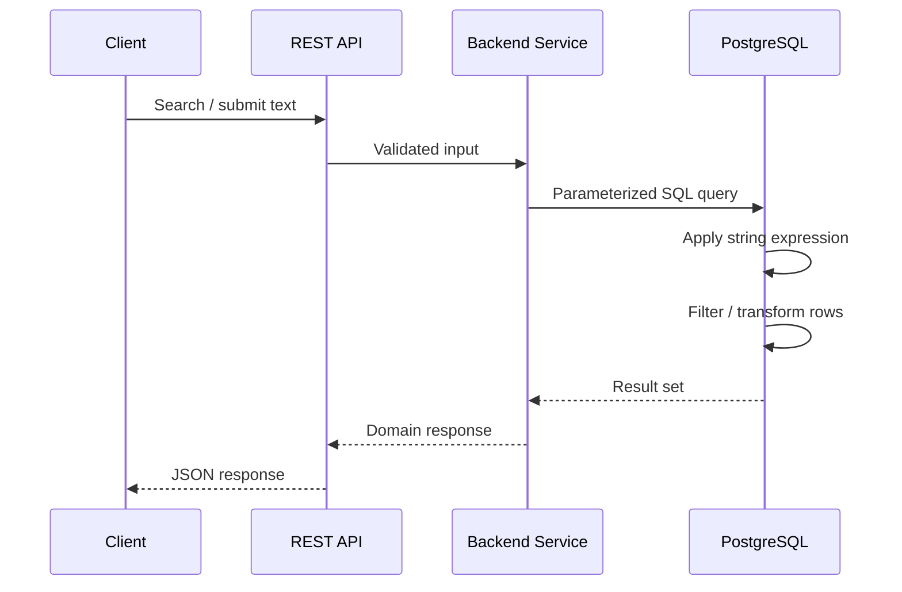

# README

## Overview

String functions are used to transform, normalize, inspect, search, extract, and assemble textual data directly inside SQL queries.

They are common in backend systems for:

- Cleaning imported or legacy data.
- Normalizing values used for lookups and uniqueness checks.
- Formatting API and reporting output.
- Parsing structured strings from external systems.
- Implementing search and filtering.
- Preparing data for migrations and ETL pipelines.
- Detecting malformed or inconsistent records.

String processing is useful at the query layer, but it should be applied deliberately. Functions on indexed columns can affect query performance, normalization can create duplicate values, and seemingly harmless transformations can destroy meaningful data.

This section focuses primarily on **PostgreSQL-style SQL**, while highlighting behavior that can differ between database engines.

## String Function Reference

| Function / Pattern | Primary Purpose | Typical Backend Use |
|---|---|---|
| `CONCAT()` | Concatenate values | Building display or formatted strings |
| `CONCAT_WS()` | Concatenate with a separator | Names, addresses, labels |
| `LENGTH()` | Measure character length | Validation and data quality |
| `OCTET_LENGTH()` | Measure byte length | Protocol/storage constraints |
| `UPPER()` | Convert to uppercase | Normalization and reporting |
| `LOWER()` | Convert to lowercase | Case-insensitive comparisons |
| `TRIM()` | Remove surrounding characters | Input normalization |
| `SUBSTRING()` | Extract part of a string | Parsing structured values |
| `REPLACE()` | Replace literal text | Data cleanup and transformation |
| `LIKE` / `ILIKE` | Pattern matching | Prefix and substring searches |
| String splitting functions | Convert delimited text into parts | ETL and legacy-data processing |
| String aggregation functions | Combine multiple rows into a string | Reporting and API-oriented output |
| `NULLIF()` / `COALESCE()` | Control nullable string behavior | Safe normalization and fallback handling |

## Navigation

- [01- String Functions Introduction](./01-%20String%20Functions%20Introduction.md) — Role of SQL string functions, common categories, and database-specific behavior
- [02- CONCAT and Concatenation](./02-%20CONCAT%20and%20Concatenation.md) — CONCAT(), concatenation operators, separators, and nullable values
- [03- LENGTH and Character Functions](./03-%20LENGTH%20and%20Character%20Functions.md) — String-length operations, character versus byte length, and data-quality use cases
- [04- UPPER and LOWER](./04-%20UPPER%20and%20LOWER.md) — Case conversion, normalization, and case-sensitive versus case-insensitive behavior
- [05- TRIM and Whitespace Functions](./05-%20TRIM%20and%20Whitespace%20Functions.md) — Whitespace cleanup, leading and trailing characters, and normalization strategies
- [06- SUBSTRING](./06-%20SUBSTRING.md) — Substring extraction and parsing structured identifiers and legacy data
- [07- REPLACE](./07-%20REPLACE.md) — Literal string replacement, transformation of stored values, and cleanup workflows
- [08- String Searching and Pattern Matching](./08-%20String%20Searching%20and%20Pattern%20Matching.md) — LIKE, ILIKE, wildcard patterns, and indexing implications
- [09- String Splitting and Aggregation](./09-%20String%20Splitting%20and%20Aggregation.md) — Splitting delimited strings and aggregating multiple rows into a single string
- [10- String Function NULL Behavior](./10-%20String%20Function%20NULL%20Behavior.md) — How NULL propagates through string expressions
- [11- Choosing the Right String Function](./11-%20Choosing%20the%20Right%20String%20Function.md) — Selecting the simplest correct function based on transformation and performance needs
- [12- Common String Processing Patterns](./12-%20Common%20String%20Processing%20Patterns.md) — Reusable production patterns for normalization, formatting, searching, and parsing
- [13- Common String Function Mistakes](./13-%20Common%20String%20Function%20Mistakes.md) — Common errors, performance pitfalls, NULL mistakes, and indexing issues

## How to Use This Section

For practical backend work, approach string processing in this order:

1. **Identify the data requirement** — determine whether the operation is formatting, normalization, validation, parsing, searching, or aggregation.
2. **Choose the simplest SQL operation** — prefer `TRIM()`, `LOWER()`, `REPLACE()`, or `SUBSTRING()` when they directly express the requirement.
3. **Define `NULL` semantics** — decide whether missing, empty, and whitespace-only values are distinct.
4. **Check data semantics** — do not normalize values such as identifiers or secrets without confirming that the domain permits it.
5. **Evaluate query performance** — functions applied to indexed columns can change index usability and execution cost.
6. **Inspect the execution plan** — use `EXPLAIN (ANALYZE, BUFFERS)` for performance-sensitive queries.
7. **Enforce important invariants at the database boundary** — especially uniqueness and canonical representations.

## Production Considerations

### Data Normalization

Normalization should have a clearly defined canonical representation.

For example:

```sql
LOWER(TRIM(email))
```

may be appropriate for a case-insensitive email lookup, but the exact rule should be consistent across:

- Application services.
- Background workers.
- ETL jobs.
- Database constraints.
- Data migrations.

If normalization defines uniqueness, enforce the rule in the database rather than relying only on application code.

### Indexing

This query:

```sql
SELECT id
FROM users
WHERE LOWER(email) = LOWER($1);
```

may require an expression index for efficient access at scale:

```sql
CREATE INDEX idx_users_email_lower
ON users (LOWER(email));
```

For search workloads, the appropriate strategy depends on whether the requirement is:

- Exact matching.
- Prefix matching.
- Case-insensitive matching.
- Arbitrary substring matching.
- Full-text search.

Do not add indexes without validating the workload and execution plan.

### Large-Scale Data Cleanup

String functions are often used during migrations:

```sql
UPDATE users
SET email = LOWER(TRIM(email));
```

Before running a large production update:

- Preview the transformation.
- Count affected rows.
- Check for duplicate collisions.
- Estimate transaction and WAL impact.
- Consider batching.
- Monitor replication lag and database load.

### Application Versus Database Processing

String processing can happen in:

- The application layer.
- SQL queries.
- ETL pipelines.
- Dedicated search systems.

Keep transformations in SQL when the database needs them for filtering, grouping, joining, or data integrity. Avoid repeatedly performing expensive transformations in every request when a canonical representation or appropriate index would solve the problem more efficiently.

## Backend Engineering Context

A typical request may flow through several layers before a string function is executed:



The important engineering decision is not simply **whether SQL can perform the transformation**, but **where the transformation belongs and whether it affects correctness, index usage, latency, or data integrity**.

## Common Decision Guide

| Requirement | Preferred Approach |
|---|---|
| Remove surrounding whitespace | `TRIM()` |
| Convert a value to canonical lowercase | `LOWER()` |
| Convert a value to uppercase for presentation | `UPPER()` |
| Replace a known literal | `REPLACE()` |
| Extract a fixed portion | `SUBSTRING()` |
| Exact lookup | `=` |
| Prefix lookup | `LIKE 'value%'` with an appropriate index strategy |
| Case-insensitive lookup | `ILIKE` or a deliberate normalized representation |
| Arbitrary substring search | Trigram/search-oriented indexing or dedicated search infrastructure |
| Join optional string fields | `CONCAT_WS()` |
| Treat empty strings as missing | `NULLIF(TRIM(value), '')` |
| Supply a fallback for missing text | `COALESCE()` |
| Build one string from multiple rows | String aggregation |
| Parse delimited data | String splitting functions |

## Common Pitfalls

Avoid these patterns:

- Treating `NULL` and `''` as equivalent without an explicit domain rule.
- Using `REPLACE()` when only surrounding whitespace should be removed.
- Applying `LOWER()` or `TRIM()` without considering index usage.
- Using regex when a simpler string function is sufficient.
- Assuming character length and byte length are identical.
- Performing large string updates without checking duplicate creation.
- Using concatenated human-readable fields as stable identifiers.
- Relying on application-side normalization for database-level uniqueness.
- Interpolating user input into SQL instead of using parameters.
- Implementing broad substring searches without considering their scalability.

## Related SQL Topics

String functions interact closely with other SQL fundamentals:

- **Filtering** — string predicates determine which rows qualify.
- **Expressions** — functions can transform values during query execution.
- **`NULL` handling** — nullable strings require deliberate semantics.
- **Indexes** — expressions can affect whether existing indexes are useful.
- **Aggregation** — string aggregation combines values across rows.
- **Grouping** — normalized strings can be used as grouping keys.
- **Constraints** — canonical string representations can participate in uniqueness rules.
- **Transactions** — large cleanup operations require controlled execution.


## Key Takeaways

- **String functions should express a specific data requirement: normalization, formatting, parsing, searching, replacement, or aggregation.**
- **`NULL`, empty strings, whitespace, case, and Unicode semantics must be treated deliberately rather than assumed.**
- **String expressions in predicates can have significant performance implications; validate index usage and execution plans on production-scale data.**
- **For important data invariants such as normalized uniqueness, combine application-level normalization with appropriate database constraints or indexes.**
- **The safest production approach is to choose the simplest correct function, understand its semantics, and measure its impact before applying it at scale.**