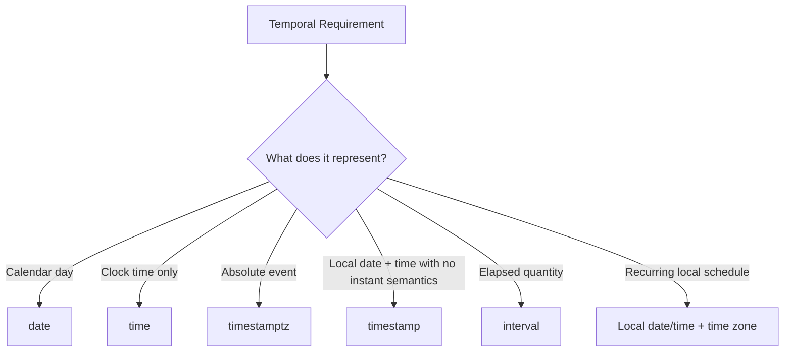
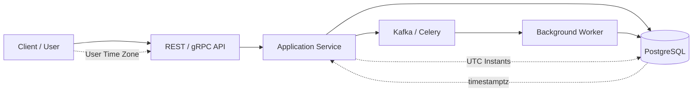

# 01- Date and Time Fundamentals

## Overview

Date and time handling is one of the most failure-prone areas of backend systems. SQL databases must represent calendar dates, clock times, timestamps, time zones, durations, and temporal ranges while applications exchange those values across APIs, workers, queues, and distributed services.

The core engineering problem is that **a date, a local time, an instant, and a duration are different concepts**. Treating them as interchangeable leads to incorrect ordering, broken scheduling, daylight-saving-time bugs, inconsistent reports, and difficult production incidents.

For most backend systems, PostgreSQL's temporal types provide a strong foundation:

| Type | Represents | Example |
|---|---|---|
| `date` | Calendar date without a time or time zone | `2026-08-30` |
| `time` | Time of day without a date | `14:30:00` |
| `time with time zone` | Time of day with a time-zone offset | `14:30:00+05:30` |
| `timestamp` | Date and time without time-zone semantics | `2026-08-30 14:30:00` |
| `timestamptz` | An absolute instant displayed in a session time zone | `2026-08-30 14:30:00+05:30` |
| `interval` | A temporal quantity/duration | `2 hours 30 minutes` |

> In PostgreSQL, `timestamp with time zone` is commonly abbreviated as `timestamptz`. It stores an instant rather than preserving the original time-zone label.

## Why Date and Time Require Care

Consider a service receiving:

```text
2026-08-30 09:00
```

This value is incomplete if the system needs to know **when** something happened globally. It does not identify a unique instant without a time zone or offset.

Compare:

```text
2026-08-30 09:00+05:30
2026-08-30 09:00+00:00
2026-08-30 09:00-04:00
```

These represent different instants.

A production system therefore needs to distinguish between:

- **Calendar concepts** — "the billing date is August 30."
- **Local wall-clock concepts** — "the store opens at 09:00 local time."
- **Absolute instants** — "the payment was created at this exact moment."
- **Durations** — "retry after 30 seconds."
- **Time-zone rules** — "run at 09:00 in the customer's local time."

## Temporal Data Model

A useful mental model is:



Choosing the type based on the **business meaning** is more important than choosing based on how the value happens to look in an API request.

## Date

### What It Is

`date` represents a calendar day without a time-of-day or time-zone component.

```sql
SELECT DATE '2026-08-30';
```

Typical uses include:

- Date of birth.
- Invoice due date.
- Subscription renewal date.
- Business reporting date.
- Holiday date.
- Accounting period.

### When to Use It

Use `date` when the time of day is intentionally irrelevant.

For example, a customer's birthday should generally not be modeled as midnight in a particular time zone:

```sql
CREATE TABLE customers (
    id bigint PRIMARY KEY,
    birth_date date NOT NULL
);
```

### Production Consideration

Do not convert dates into timestamps merely because the database or application layer makes timestamp handling familiar. Adding artificial time-zone semantics can create unnecessary ambiguity.

## Time

`time` represents a time of day without a date.

```sql
SELECT TIME '09:30:00';
```

It is useful for concepts such as:

- Store opening time.
- Business-hours configuration.
- Daily operating windows.

```sql
CREATE TABLE store_hours (
    store_id bigint NOT NULL,
    opens_at time NOT NULL,
    closes_at time NOT NULL
);
```

A `time` value alone does not tell you which day the value applies to.

For recurring schedules, it is usually paired with additional information such as:

- Day of week.
- Effective date range.
- Time zone.

## Timestamp Without Time Zone

PostgreSQL's `timestamp` represents a calendar date and clock time without time-zone interpretation.

```sql
SELECT TIMESTAMP '2026-08-30 14:30:00';
```

It can be appropriate when the value intentionally represents a **local wall-clock value** rather than a globally identifiable instant.

For example:

```text
A restaurant reservation:
2026-08-30 19:30
```

If the reservation belongs to a restaurant in a known location, the application may separately associate the restaurant's time zone.

However, using `timestamp` for globally occurring events is often dangerous because the value alone cannot identify an instant.

## Timestamp With Time Zone

PostgreSQL's `timestamptz` represents an absolute point in time.

```sql
SELECT TIMESTAMPTZ '2026-08-30 14:30:00+05:30';
```

PostgreSQL internally normalizes the value to an instant. When queried, it displays that instant according to the session's time zone.

For example:

```sql
SET TIME ZONE 'UTC';

SELECT TIMESTAMPTZ '2026-08-30 14:30:00+05:30';
```

The displayed value corresponds to:

```text
2026-08-30 09:00:00+00
```

Changing the session time zone changes the representation, not the underlying instant.

### Typical Backend Usage

For event timestamps, use `timestamptz`:

```sql
CREATE TABLE payments (
    id bigint PRIMARY KEY,
    created_at timestamptz NOT NULL DEFAULT now(),
    processed_at timestamptz
);
```

This is appropriate for:

- Request timestamps.
- Payment events.
- Job execution times.
- Audit records.
- Kafka event timestamps.
- Database modification timestamps.
- Distributed-system events.

## `timestamp` Versus `timestamptz`

| Requirement | Preferred Type |
|---|---|
| Absolute event time | `timestamptz` |
| Created-at / updated-at | `timestamptz` |
| Audit event | `timestamptz` |
| Payment transaction time | `timestamptz` |
| Calendar date | `date` |
| Daily opening time | `time` |
| Local wall-clock business value | `timestamp` |
| Recurring event at local time | Local date/time + explicit time zone |

The key question is:

> **Does this value identify an instant globally, or does it represent a local calendar/clock concept?**

## Time Zones

A time zone is more than a fixed UTC offset.

For example:

```text
UTC+05:30
```

is an offset.

A named zone such as:

```text
Asia/Kolkata
America/New_York
Europe/London
```

represents a set of time-zone rules that can vary historically and, in many regions, seasonally.

This distinction matters for scheduling.

### Fixed Offset

```text
2026-08-30 09:00+05:30
```

This identifies an instant using a fixed offset.

### Named Time Zone

```text
2026-08-30 09:00 Asia/Kolkata
```

This represents a local time interpreted according to the `Asia/Kolkata` time-zone rules.

For user-facing schedules, storing the named time zone is often necessary.

## Time Zone Conversion

PostgreSQL supports the `AT TIME ZONE` operation.

```sql
SELECT
    TIMESTAMPTZ '2026-08-30 09:00:00+00'
    AT TIME ZONE 'Asia/Kolkata';
```

This converts an absolute instant into a local wall-clock representation.

The reverse direction can also be used when interpreting a local timestamp in a specific zone:

```sql
SELECT
    TIMESTAMP '2026-08-30 14:30:00'
    AT TIME ZONE 'Asia/Kolkata';
```

The direction matters because `timestamp` and `timestamptz` have different semantics.

## Session Time Zone

PostgreSQL has a session time zone that influences how `timestamptz` values are displayed and how certain timestamp expressions are interpreted.

```sql
SHOW TIME ZONE;
```

Set it explicitly when needed:

```sql
SET TIME ZONE 'UTC';
```

In backend services, keeping database sessions in UTC is a common operational convention because it provides a stable representation for logs, debugging, and cross-region processing.

The database's session time zone should not be confused with the user's display time zone.

## Date and Time Literals

Prefer typed literals when demonstrating or writing static SQL:

```sql
SELECT DATE '2026-08-30';

SELECT TIME '14:30:00';

SELECT TIMESTAMP '2026-08-30 14:30:00';

SELECT TIMESTAMPTZ '2026-08-30 14:30:00+05:30';
```

For application-generated values, use parameterized queries rather than interpolating strings into SQL.

Example with Python:

```python
cursor.execute(
    """
    SELECT id, created_at
    FROM orders
    WHERE created_at >= %s
      AND created_at < %s
    ORDER BY created_at
    """,
    (start_time, end_time),
)
```

Parameterization protects against SQL injection and allows the database driver to handle appropriate value encoding.

## Current Date and Time

PostgreSQL provides several functions and expressions for current temporal values.

```sql
SELECT CURRENT_DATE;
SELECT CURRENT_TIME;
SELECT CURRENT_TIMESTAMP;
SELECT NOW();
```

`CURRENT_TIMESTAMP` and `NOW()` return the current transaction timestamp in PostgreSQL.

This distinction is important:

```sql
BEGIN;

SELECT NOW();

-- Time passes...

SELECT NOW();

COMMIT;
```

The value remains associated with the transaction's start time.

For a continuously changing wall-clock value, PostgreSQL provides `clock_timestamp()`:

```sql
SELECT clock_timestamp();
```

### Transaction Time Versus Wall-Clock Time

| Expression | Behavior |
|---|---|
| `CURRENT_TIMESTAMP` | Transaction start timestamp |
| `NOW()` | PostgreSQL equivalent of current transaction timestamp |
| `clock_timestamp()` | Actual wall-clock time when evaluated |
| `CURRENT_DATE` | Transaction-relative current date |

For normal application timestamps such as `created_at`, transaction timestamps are usually preferable because they provide consistent temporal semantics within a transaction.

## Temporal Comparisons

Date and timestamp values can be compared using normal comparison operators:

```sql
SELECT id
FROM orders
WHERE created_at >= TIMESTAMPTZ '2026-08-01 00:00:00+00'
  AND created_at <  TIMESTAMPTZ '2026-09-01 00:00:00+00';
```

For time ranges, prefer **half-open intervals**:

```text
[start, end)
```

That means:

```text
>= start
< end
```

rather than:

```text
>= start
<= end
```

This avoids boundary overlap when adjacent ranges are combined.

For example:

```text
[2026-08-01, 2026-09-01)
[2026-09-01, 2026-10-01)
```

The two ranges meet cleanly without overlapping.

## Date Arithmetic

PostgreSQL supports arithmetic involving dates, timestamps, and intervals.

```sql
SELECT DATE '2026-08-30' + INTERVAL '7 days';
```

```sql
SELECT TIMESTAMPTZ '2026-08-30 10:00:00+00'
       + INTERVAL '2 hours';
```

Date subtraction can produce a duration-like result:

```sql
SELECT DATE '2026-08-30' - DATE '2026-08-01';
```

The exact result type depends on the operands.

## Intervals

`interval` represents a temporal quantity.

```sql
SELECT INTERVAL '30 minutes';
SELECT INTERVAL '2 days';
SELECT INTERVAL '1 month';
```

Intervals are useful for:

- Retry delays.
- Retention windows.
- Expiration logic.
- Scheduling.
- Reporting periods.

However, not all intervals have a fixed number of seconds.

For example:

```text
1 month
```

does not have a universal duration in seconds because calendar months have different lengths.

This distinction becomes important when implementing billing, expiration, and scheduling logic.

## Calendar Arithmetic Versus Elapsed Time

Consider:

```sql
timestamp_value + INTERVAL '1 day'
```

versus:

```sql
timestamp_value + INTERVAL '24 hours'
```

These can have different effects around daylight-saving transitions when working with time-zone-aware timestamps.

A senior engineer should ask:

> Does the requirement mean "the same local time tomorrow" or "exactly 24 elapsed hours later"?

Those are different business requirements.

## Truncating Temporal Values

`date_trunc()` is commonly used to group timestamps into calendar periods.

```sql
SELECT
    date_trunc('day', created_at) AS day,
    COUNT(*) AS order_count
FROM orders
GROUP BY date_trunc('day', created_at)
ORDER BY day;
```

Common granularities include:

```text
year
quarter
month
week
day
hour
minute
second
```

For large datasets, understand the performance implications of applying functions to indexed columns in predicates.

This:

```sql
WHERE date_trunc('day', created_at) = DATE '2026-08-30'
```

can be less index-friendly than a range predicate such as:

```sql
WHERE created_at >= TIMESTAMPTZ '2026-08-30 00:00:00+00'
  AND created_at <  TIMESTAMPTZ '2026-08-31 00:00:00+00'
```

The second form directly constrains the indexed column.

## Extracting Components

`EXTRACT()` retrieves a component from a date or timestamp.

```sql
SELECT
    EXTRACT(YEAR FROM created_at) AS year,
    EXTRACT(MONTH FROM created_at) AS month,
    EXTRACT(DAY FROM created_at) AS day
FROM orders;
```

Other useful fields include:

- `hour`
- `minute`
- `second`
- `dow`
- `isodow`
- `week`
- `quarter`

Use component extraction for reporting and analysis, but avoid unnecessarily applying it to indexed columns in highly selective predicates.

## Formatting

`to_char()` formats temporal values for presentation.

```sql
SELECT to_char(
    TIMESTAMPTZ '2026-08-30 14:30:00+00',
    'YYYY-MM-DD HH24:MI:SS'
);
```

Formatting is generally a presentation concern.

For APIs, it is often preferable to return structured timestamp values using a consistent format such as ISO 8601 and let the client format them for display.

Do not store presentation-formatted dates such as:

```text
"30-Aug-2026"
```

instead of an actual temporal type.

## Filtering by Date

A common backend requirement is:

> Return all records created on a particular calendar day.

Avoid:

```sql
WHERE created_at::date = DATE '2026-08-30'
```

for a large indexed table when the query is performance-sensitive.

Prefer an explicit range:

```sql
WHERE created_at >= TIMESTAMPTZ '2026-08-30 00:00:00+00'
  AND created_at <  TIMESTAMPTZ '2026-08-31 00:00:00+00'
```

If the business day is defined in a particular local time zone, calculate the corresponding instant boundaries correctly rather than assuming midnight UTC is the same as local midnight.

## Backend Architecture

A production system commonly has multiple temporal boundaries:



A robust convention is:

- Accept explicit offsets or well-defined local date/time plus time zone.
- Convert absolute event times to a canonical representation.
- Store absolute events as `timestamptz`.
- Store calendar-only values as `date`.
- Store recurring schedules with their intended time zone.
- Convert to the user's local time only at the presentation boundary.

## Python and Django Considerations

Python's `datetime` distinguishes between naive and timezone-aware datetime values.

Prefer timezone-aware datetimes for absolute events.

In Django applications, use timezone-aware datetimes and configure timezone behavior deliberately rather than mixing naive and aware values.

Example:

```python
from django.utils import timezone

created_at = timezone.now()
```

A common architecture is:

```text
HTTP request
    ↓
Parse and validate temporal input
    ↓
Convert to an explicit timezone-aware representation
    ↓
Persist as PostgreSQL timestamptz
    ↓
Process events in a consistent temporal model
    ↓
Convert to user's timezone for presentation
```

The database, application, queue workers, and scheduled jobs should agree on the temporal contract.

## API Design

Avoid ambiguous API values:

```json
{
  "start_time": "09:00"
}
```

unless the API explicitly defines what time zone the value uses.

For an absolute event, an explicit offset is safer:

```json
{
  "created_at": "2026-08-30T09:00:00+00:00"
}
```

For a user-local scheduled event, represent the local time and time zone separately when necessary:

```json
{
  "scheduled_at": "2026-08-30T09:00:00",
  "time_zone": "Asia/Kolkata"
}
```

The exact contract depends on whether the application needs an instant, a local wall-clock value, or both.

## Scheduling and Recurring Jobs

Scheduling is more complicated than storing a timestamp.

Suppose a user asks:

> Send the report every day at 09:00 in my local time.

A fixed UTC timestamp is insufficient because the schedule is recurring and tied to a local time zone.

The system may need to persist:

```text
local_time = 09:00
time_zone = Asia/Kolkata
recurrence = daily
```

The scheduler then resolves the next occurrence according to the relevant time-zone rules.

This is different from:

> Run the job every 24 elapsed hours.

The first is calendar-based; the second is duration-based.

## Indexing and Query Performance

Temporal columns are frequently indexed:

```sql
CREATE INDEX idx_orders_created_at
ON orders (created_at);
```

This supports range queries such as:

```sql
SELECT id, total
FROM orders
WHERE created_at >= $1
  AND created_at < $2
ORDER BY created_at;
```

For large tables, avoid wrapping an indexed timestamp in a function unless the indexing strategy explicitly supports that expression.

Use:

```sql
created_at >= $1
AND created_at < $2
```

rather than unnecessarily transforming the column.

For analytical workloads, partitioning by time can also be useful when the data volume and access pattern justify it.

## Partitioning and Retention

High-volume event tables often grow continuously:

```text
orders
payments
audit_events
application_logs
telemetry
```

Temporal partitioning can make retention and maintenance more manageable.

For example, a system may partition events by month and drop old partitions when retention expires.

This can reduce the operational cost of deleting large historical datasets compared with massive row-by-row `DELETE` operations.

Partitioning should be driven by actual workload characteristics rather than used automatically for every timestamped table.

## Monitoring and Observability

Temporal consistency is critical for distributed-system observability.

Logs, metrics, traces, database events, Kafka records, and application events should use a consistent representation of time.

Common production practices include:

- Store event timestamps as absolute instants.
- Keep infrastructure clocks synchronized.
- Prefer UTC for operational logs.
- Include time-zone information when transmitting temporal values.
- Correlate events using timestamps plus request/event identifiers.
- Be aware that event arrival time and event creation time are not necessarily identical.

In distributed systems:

```text
Event creation time
        ↓
Network delay
        ↓
Queue
        ↓
Consumer processing time
        ↓
Database persistence time
```

These timestamps answer different operational questions and should not be conflated.

## Security Considerations

Temporal data can affect authorization and business rules.

Examples include:

- Password reset expiration.
- Session expiration.
- Signed URL validity.
- Subscription access periods.
- Payment deadlines.
- API token expiration.
- Scheduled account actions.

Do not rely on client-provided timestamps for security-sensitive decisions without validating them.

For expiration checks, use trusted server/database time:

```sql
SELECT id
FROM password_reset_tokens
WHERE token_hash = $1
  AND expires_at > CURRENT_TIMESTAMP;
```

Store only what is necessary and avoid exposing internal temporal metadata when it creates unnecessary information leakage.

## Common Mistakes

### Using `timestamp` for Every Temporal Value

**Problem:** An absolute event is stored without time-zone semantics.

**Why it happens:** Developers treat the textual appearance of a timestamp as sufficient.

**Better approach:** Use `timestamptz` for events that represent globally identifiable instants.

### Storing Dates as Strings

Avoid:

```sql
created_at varchar(32)
```

when the value is actually temporal.

Using native temporal types provides:

- Correct comparisons.
- Date arithmetic.
- Validation.
- Indexing.
- Database operators.
- Better query planning.

### Assuming UTC and Local Midnight Are Equivalent

For a user in a local time zone, a calendar day is not necessarily:

```text
00:00 UTC → 23:59 UTC
```

Calculate day boundaries in the intended business time zone and then convert those boundaries into instants.

### Using Inclusive End Times

Avoid patterns such as:

```sql
WHERE created_at >= :start
  AND created_at <= :end
```

when composing adjacent time windows.

Prefer:

```sql
WHERE created_at >= :start
  AND created_at < :end
```

### Applying Functions to Indexed Columns

This can prevent efficient use of a normal index:

```sql
WHERE DATE(created_at) = :date
```

Prefer a timestamp range when appropriate.

### Mixing Naive and Timezone-Aware Values

A Python application that mixes naive and aware `datetime` values can produce incorrect comparisons or persistence behavior.

Define one temporal contract and enforce it throughout the service.

### Confusing Duration With Calendar Arithmetic

These requirements differ:

```text
"24 hours after the event"
```

and:

```text
"at the same local time tomorrow"
```

The implementation must reflect the business requirement.

## Interview Traps

| Question | Strong Answer |
|---|---|
| What should `created_at` usually use? | `timestamptz` for an absolute event time |
| What does PostgreSQL `timestamptz` store? | An instant; display depends on the session time zone |
| Does `timestamptz` preserve the original time-zone name? | No; it represents the instant, not the original zone label |
| When should `date` be used? | When only the calendar date matters |
| Why prefer `[start, end)`? | It prevents adjacent ranges from overlapping |
| Why can `WHERE DATE(created_at) = ...` be problematic? | It applies a function to the column and can interfere with ordinary index usage |
| Is `timestamp` always wrong? | No; it can correctly model local wall-clock values when no instant semantics are required |
| Is `UTC+05:30` the same as `Asia/Kolkata` conceptually? | No; an offset is not a full time-zone rule set |
| Why can `1 month` not be treated as a fixed number of seconds? | Calendar months have different lengths |
| Why are recurring local schedules harder than fixed timestamps? | They depend on calendar and time-zone rules |

## Production Checklist

Before introducing a temporal field, answer:

- What business concept does this field represent?
- Is it a calendar date, local wall-clock value, instant, or duration?
- Does the time zone matter?
- Is the original named time zone required?
- Should the database store an absolute instant?
- What are the API serialization rules?
- What happens around daylight-saving transitions?
- What are the inclusive/exclusive boundary semantics?
- Will the column be used in indexed range queries?
- Does the field participate in expiration or authorization?
- How will retention and archival work?
- How will the value appear in logs and monitoring?

## Key Takeaways

- **Choose temporal types from business semantics: `date` for calendar dates, `time` for clock values, `timestamptz` for absolute instants, and `interval` for temporal quantities.**
- **Use explicit time-zone semantics for user-facing schedules; a fixed UTC offset and a named time zone are not interchangeable concepts.**
- **For temporal filtering, prefer half-open ranges such as `[start, end)` and avoid unnecessary functions on indexed timestamp columns.**
- **Distinguish calendar arithmetic from elapsed duration; “same local time tomorrow” is not always equivalent to “24 hours later.”**
- **Keep temporal contracts consistent across APIs, Python/Django services, PostgreSQL, background workers, queues, logs, and scheduled jobs.**