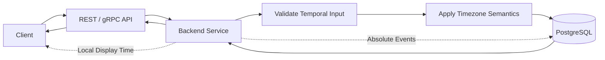

# 02- DATE TIME and TIMESTAMP

## Overview

SQL provides several temporal data types because a calendar date, a time of day, and an absolute point in time are different business concepts.

The most important distinction is between:

- `DATE` — a calendar day.
- `TIME` — a time of day.
- `TIMESTAMP` — a date and time without time-zone semantics.
- `TIMESTAMP WITH TIME ZONE` (`timestamptz` in PostgreSQL) — an absolute instant.
- `INTERVAL` — a temporal quantity used for date/time arithmetic.

Choosing the correct type is a data-modeling decision, not merely a syntax decision. A wrong choice can produce timezone bugs, incorrect reports, broken scheduling, and inconsistent behavior between application servers.

This document uses **PostgreSQL** syntax and behavior as the primary reference because PostgreSQL is common in production backend systems and has particularly strong temporal support.

## Temporal Data Types

| Type | Represents | Time zone information | Typical use |
|---|---|---:|---|
| `DATE` | Calendar date | No | Birth date, due date, holiday |
| `TIME` | Time of day | No | Store opening time |
| `TIME WITH TIME ZONE` | Time of day with offset | Yes | Specialized time-of-day use cases |
| `TIMESTAMP` | Date + time | No | Local wall-clock value |
| `TIMESTAMP WITH TIME ZONE` | Absolute instant | Yes | Events, audit timestamps |
| `INTERVAL` | Temporal quantity | No | Duration/date arithmetic |

A useful modeling rule is:

> Store the semantic value the business actually cares about, not merely the value that happens to be displayed by the UI.

## DATE

### What It Is

`DATE` represents a calendar date without a time-of-day or timezone component.

```sql
SELECT DATE '2026-08-30';
```

The value represents:

```text
2026-08-30
```

It does not represent:

```text
2026-08-30 00:00:00 UTC
```

Those are different concepts.

### When to Use `DATE`

Use `DATE` when the time of day is irrelevant.

Typical examples:

```text
date of birth
invoice due date
subscription billing date
holiday
business reporting date
contract start date
```

Example:

```sql
CREATE TABLE customers (
    id bigint PRIMARY KEY,
    name text NOT NULL,
    birth_date date
);
```

A birthday should generally be modeled as `DATE`, not as a timestamp at midnight.

### Date Arithmetic

PostgreSQL supports arithmetic directly on dates:

```sql
SELECT DATE '2026-08-30' + 7;
```

Result:

```text
2026-09-06
```

Subtracting two dates returns the number of days between them:

```sql
SELECT DATE '2026-08-30' - DATE '2026-08-01';
```

Result:

```text
29
```

### Date Comparison

Dates can be compared naturally:

```sql
SELECT *
FROM invoices
WHERE due_date < CURRENT_DATE;
```

This is useful for identifying overdue invoices.

## TIME

### What It Is

`TIME` represents a time of day without a date.

```sql
SELECT TIME '14:30:00';
```

The value means:

```text
14:30:00
```

It does not tell you which day it belongs to.

### When to Use `TIME`

Use it when the business concept genuinely represents a clock time independent of a particular date.

Examples:

```text
store opening time
store closing time
daily operating hours
preferred notification time
```

Example:

```sql
CREATE TABLE store_hours (
    store_id bigint NOT NULL,
    opens_at time NOT NULL,
    closes_at time NOT NULL
);
```

### Limitation

A `TIME` value alone is insufficient for an absolute event.

For example:

```text
09:00
```

does not tell you whether the event happened today, yesterday, or tomorrow.

For globally meaningful events, use a timestamp type.

## TIMESTAMP

### What It Is

`TIMESTAMP` represents a date and time without time-zone semantics.

```sql
SELECT TIMESTAMP '2026-08-30 14:30:00';
```

The value is:

```text
2026-08-30 14:30:00
```

There is no timezone associated with the value.

### When to Use `TIMESTAMP`

`TIMESTAMP` is appropriate when the value intentionally represents a **local wall-clock date and time**.

For example:

```text
A restaurant reservation at 19:30
A store's local opening event
A local business appointment
```

If the application also needs to know which timezone gives meaning to that local time, store the timezone separately.

For example:

```sql
CREATE TABLE reservations (
    id bigint PRIMARY KEY,
    starts_at timestamp NOT NULL,
    time_zone text NOT NULL
);
```

The combination represents:

```text
2026-08-30 19:30
Asia/Kolkata
```

### Important Limitation

A `TIMESTAMP` does not uniquely identify an instant.

These two values are syntactically similar:

```text
2026-08-30 09:00
2026-08-30 09:00
```

but they could refer to completely different real-world instants depending on timezone context.

## TIMESTAMP WITH TIME ZONE

### What It Is

PostgreSQL's `TIMESTAMP WITH TIME ZONE`, commonly written as `timestamptz`, represents an **absolute instant in time**.

```sql
SELECT TIMESTAMPTZ '2026-08-30 14:30:00+05:30';
```

The instant can be represented in another timezone:

```text
2026-08-30 09:00:00+00
```

These are the same instant:

```text
2026-08-30 14:30+05:30
2026-08-30 09:00+00
```

### What PostgreSQL Actually Stores

A common misconception is that `timestamptz` stores the timezone name or original offset.

It does not preserve the original timezone label.

Conceptually:

```text
Input timestamp + timezone
          ↓
       Instant
          ↓
   Stored internally
          ↓
Displayed using session timezone
```

For example:

```sql
SET TIME ZONE 'UTC';

SELECT TIMESTAMPTZ '2026-08-30 14:30:00+05:30';
```

The displayed result represents:

```text
2026-08-30 09:00:00+00
```

Changing the session timezone changes the representation, not the instant.

### When to Use `timestamptz`

Use it for events that occur at a specific instant:

- `created_at`
- `updated_at`
- payment time
- login time
- API request time
- audit event time
- message publication time
- job execution time
- transaction time

Example:

```sql
CREATE TABLE payments (
    id bigint PRIMARY KEY,
    amount numeric(12, 2) NOT NULL,
    created_at timestamptz NOT NULL DEFAULT CURRENT_TIMESTAMP,
    processed_at timestamptz
);
```

For most backend event timestamps, `timestamptz` is the safer default.

## DATE vs TIME vs TIMESTAMP

| Requirement | Recommended type |
|---|---|
| Birthday | `DATE` |
| Invoice due date | `DATE` |
| Store opening time | `TIME` |
| Local appointment | `TIMESTAMP` + timezone when required |
| API request creation time | `TIMESTAMPTZ` |
| Payment processed time | `TIMESTAMPTZ` |
| Audit event | `TIMESTAMPTZ` |
| Recurring local schedule | Local date/time + timezone |
| Elapsed duration | `INTERVAL` |

The key question is:

> Does this field represent a calendar value, a local wall-clock value, or a globally identifiable instant?

## TIMESTAMP Precision

PostgreSQL supports fractional seconds:

```sql
SELECT TIMESTAMP '2026-08-30 14:30:15.123456';
```

The default precision is sufficient for most application workloads.

A column can explicitly specify precision:

```sql
CREATE TABLE events (
    created_at timestamp(3) NOT NULL
);
```

This stores millisecond precision.

Possible precision levels should be chosen based on the application's requirements rather than assuming that maximum precision is always better.

For ordinary CRUD applications, microsecond precision is rarely the limiting factor.

## Current Date and Time

PostgreSQL provides several expressions for current temporal values.

```sql
SELECT CURRENT_DATE;
SELECT CURRENT_TIME;
SELECT CURRENT_TIMESTAMP;
SELECT NOW();
```

`CURRENT_TIMESTAMP` and `NOW()` are transaction-time values in PostgreSQL.

For example:

```sql
BEGIN;

SELECT NOW();

-- Other statements execute.

SELECT NOW();

COMMIT;
```

Both calls refer to the transaction's start timestamp.

For the actual wall-clock time at expression evaluation, PostgreSQL provides:

```sql
SELECT clock_timestamp();
```

### Why This Matters

For normal record timestamps:

```sql
created_at timestamptz DEFAULT now()
```

is generally appropriate.

For measuring actual elapsed wall-clock time inside a transaction, `clock_timestamp()` may be more appropriate.

## Time Zone Configuration

PostgreSQL sessions have a timezone setting.

Inspect it with:

```sql
SHOW TIME ZONE;
```

Set it explicitly:

```sql
SET TIME ZONE 'UTC';
```

A backend service commonly uses UTC for operational consistency.

However, **database timezone configuration and user timezone are different concerns**.

A typical architecture is:

```text
User timezone
     ↓
Application presentation layer
     ↓
Absolute instant
     ↓
PostgreSQL timestamptz
```

Do not assume that the database should use the timezone of every user accessing the application.

## Time Zone Conversion

PostgreSQL provides `AT TIME ZONE` for timezone conversion and interpretation.

Convert an absolute instant to local time:

```sql
SELECT
    TIMESTAMPTZ '2026-08-30 09:00:00+00'
    AT TIME ZONE 'Asia/Kolkata';
```

Result:

```text
2026-08-30 14:30:00
```

Here the input is an instant and the result is a timezone-local `timestamp`.

The operation can also interpret a timezone-less local timestamp:

```sql
SELECT
    TIMESTAMP '2026-08-30 14:30:00'
    AT TIME ZONE 'Asia/Kolkata';
```

The result is a `timestamptz`.

The direction matters because `timestamp` and `timestamptz` have different semantics.

## Time Zone Offset vs Named Time Zone

These are not equivalent concepts:

```text
+05:30
```

and:

```text
Asia/Kolkata
```

An offset identifies a displacement from UTC at a particular point.

A named timezone represents a set of historical and, where applicable, daylight-saving rules.

For recurring schedules, named timezone information is often essential.

Example:

```text
09:00 every day
America/New_York
```

means:

> 09:00 according to New York's timezone rules.

It does not mean:

> A permanently fixed UTC offset.

## Date and Time Literals

PostgreSQL supports typed temporal literals:

```sql
SELECT DATE '2026-08-30';

SELECT TIME '14:30:00';

SELECT TIMESTAMP '2026-08-30 14:30:00';

SELECT TIMESTAMPTZ '2026-08-30 14:30:00+05:30';
```

Typed literals make the intended type explicit and are useful in SQL scripts, tests, and documentation.

For application queries, use parameters rather than constructing SQL strings dynamically.

## Parameterized Queries

Python backend applications should pass temporal values as parameters.

```python
cursor.execute(
    """
    SELECT id, created_at
    FROM orders
    WHERE created_at >= %s
      AND created_at < %s
    ORDER BY created_at
    """,
    (start_time, end_time),
)
```

This provides:

- SQL injection protection.
- Correct driver-level encoding.
- Cleaner query plans.
- Clear separation between SQL and application data.

Do not construct queries like:

```python
query = f"""
    SELECT *
    FROM orders
    WHERE created_at >= '{start_time}'
"""
```

## Date Filtering

A common production query is:

> Find all records created on a particular date.

A tempting query is:

```sql
SELECT *
FROM orders
WHERE created_at::date = DATE '2026-08-30';
```

Although this can be correct semantically, applying a function or cast to the indexed column can make ordinary index usage less effective.

Prefer an explicit range for an indexed timestamp:

```sql
SELECT *
FROM orders
WHERE created_at >= TIMESTAMPTZ '2026-08-30 00:00:00+00'
  AND created_at <  TIMESTAMPTZ '2026-08-31 00:00:00+00';
```

This form is particularly useful for large production tables.

## Half-Open Time Ranges

Prefer:

```text
[start, end)
```

which translates to:

```sql
WHERE created_at >= :start
  AND created_at < :end
```

instead of:

```sql
WHERE created_at >= :start
  AND created_at <= :end
```

Half-open intervals avoid boundary overlap.

For example:

```text
[2026-08-01, 2026-09-01)
[2026-09-01, 2026-10-01)
```

The first range ends exactly where the second starts, but neither includes the other's boundary.

This pattern is particularly valuable for:

- Reporting.
- Pagination by time.
- Batch processing.
- Event ingestion.
- Partition boundaries.
- Data exports.

## Date Truncation

`date_trunc()` rounds a temporal value down to a specified precision.

```sql
SELECT date_trunc('day', created_at)
FROM orders;
```

Other useful granularities include:

```text
year
quarter
month
week
day
hour
minute
second
```

A typical reporting query:

```sql
SELECT
    date_trunc('day', created_at) AS day,
    COUNT(*) AS order_count
FROM orders
GROUP BY date_trunc('day', created_at)
ORDER BY day;
```

### Performance Consideration

Do not confuse grouping with filtering.

For grouping:

```sql
GROUP BY date_trunc('day', created_at)
```

is natural.

For selective filtering on an indexed column, prefer:

```sql
WHERE created_at >= :start
  AND created_at < :end
```

rather than applying a function to every row.

## Extracting Date Components

PostgreSQL's `EXTRACT()` retrieves components from temporal values.

```sql
SELECT
    EXTRACT(YEAR FROM created_at) AS year,
    EXTRACT(MONTH FROM created_at) AS month,
    EXTRACT(DAY FROM created_at) AS day
FROM orders;
```

Other commonly used fields include:

```text
hour
minute
second
dow
isodow
week
quarter
```

For reporting:

```sql
SELECT
    EXTRACT(ISODOW FROM created_at) AS day_of_week,
    COUNT(*) AS orders
FROM orders
GROUP BY EXTRACT(ISODOW FROM created_at)
ORDER BY day_of_week;
```

## INTERVAL

`INTERVAL` represents a temporal quantity.

```sql
SELECT INTERVAL '30 minutes';
SELECT INTERVAL '2 days';
SELECT INTERVAL '3 months';
```

It can be used in arithmetic:

```sql
SELECT
    CURRENT_TIMESTAMP + INTERVAL '30 days';
```

Or for expiration:

```sql
SELECT *
FROM password_reset_tokens
WHERE expires_at > CURRENT_TIMESTAMP;
```

### Calendar Duration vs Fixed Duration

An important production distinction is that:

```text
1 month
```

is not necessarily a fixed number of seconds.

Similarly, requirements such as:

```text
same local time tomorrow
```

and:

```text
24 hours later
```

can have different semantics around timezone transitions.

Always model the business requirement rather than blindly converting everything into seconds.

## DATE and TIMESTAMP Arithmetic

Date arithmetic:

```sql
SELECT DATE '2026-08-30' + 7;
```

Timestamp arithmetic:

```sql
SELECT
    TIMESTAMP '2026-08-30 14:30:00'
    + INTERVAL '2 hours';
```

Timestamp subtraction:

```sql
SELECT
    TIMESTAMP '2026-08-30 14:00:00'
    - TIMESTAMP '2026-08-30 12:30:00';
```

This is useful for calculating durations between events.

## Converting Between Types

PostgreSQL supports explicit casts:

```sql
SELECT TIMESTAMP '2026-08-30 14:30:00'::date;
```

Result:

```text
2026-08-30
```

Convert a timestamp to a date:

```sql
SELECT created_at::date
FROM orders;
```

Convert a date to timestamp:

```sql
SELECT DATE '2026-08-30'::timestamp;
```

Be careful when converting `timestamptz` to `date`.

The resulting date depends on the timezone used to interpret the instant.

For example, the same instant can fall on different calendar dates in different time zones.

## Formatting Temporal Values

PostgreSQL provides `to_char()` for formatting.

```sql
SELECT to_char(
    TIMESTAMPTZ '2026-08-30 14:30:00+00',
    'YYYY-MM-DD HH24:MI:SS'
);
```

Formatting is generally a presentation concern.

Prefer returning structured temporal values from APIs and formatting them at the appropriate application or frontend boundary.

Avoid storing formatted strings such as:

```text
30-Aug-2026 14:30
```

instead of native temporal types.

## Production Data Modeling

Consider a payment service:

```sql
CREATE TABLE payments (
    id bigint PRIMARY KEY,
    customer_id bigint NOT NULL,
    amount numeric(12, 2) NOT NULL,
    created_at timestamptz NOT NULL DEFAULT now(),
    completed_at timestamptz,
    settlement_date date
);
```

Different fields intentionally use different types:

| Column | Type | Reason |
|---|---|---|
| `created_at` | `timestamptz` | Exact event instant |
| `completed_at` | `timestamptz` | Exact completion instant |
| `settlement_date` | `date` | Business calendar date |

Using one temporal type for all three would lose semantic precision.

## Application Architecture

A typical backend request flow looks like:



A robust convention is:

1. Determine whether the input represents a date, local time, or instant.
2. Validate the value at the API boundary.
3. Apply timezone rules explicitly.
4. Store the appropriate native SQL type.
5. Perform database comparisons using native temporal operators.
6. Convert to a user's local timezone only when required for presentation.

## Django and Python

Python distinguishes between naive and timezone-aware `datetime` values.

For absolute event timestamps, use timezone-aware values.

In Django:

```python
from django.utils import timezone

created_at = timezone.now()
```

A model can represent an event timestamp naturally:

```python
from django.db import models


class Order(models.Model):
    created_at = models.DateTimeField(auto_now_add=True)
```

Django should be configured consistently so that application code does not accidentally mix naive and aware datetime values.

The important architectural rule is:

> Do not let different services develop different temporal assumptions.

For example, if a FastAPI service writes UTC timestamps while a Celery worker interprets naive timestamps as local time, the system can produce inconsistent expiration and scheduling behavior.

## API Design

Avoid ambiguous API timestamps:

```json
{
  "scheduled_at": "2026-08-30 09:00:00"
}
```

The timezone is unclear.

For an absolute instant, prefer an explicit offset:

```json
{
  "created_at": "2026-08-30T09:00:00+00:00"
}
```

For a local recurring schedule, represent timezone semantics explicitly:

```json
{
  "scheduled_at": "2026-08-30T09:00:00",
  "time_zone": "Asia/Kolkata"
}
```

The correct API design depends on whether the field represents:

- An instant.
- A local date/time.
- A recurring schedule.
- A date without a time.

## Indexing

Temporal columns are frequently queried using ranges.

Create an index when the workload benefits from it:

```sql
CREATE INDEX idx_orders_created_at
ON orders (created_at);
```

Then use range predicates:

```sql
SELECT id, total
FROM orders
WHERE created_at >= $1
  AND created_at < $2
ORDER BY created_at;
```

This pattern is generally more index-friendly than transforming the indexed column.

For very large event tables, temporal partitioning may also be appropriate:

```text
orders_2026_01
orders_2026_02
orders_2026_03
...
```

Partitioning should be introduced based on actual data volume, retention requirements, and query patterns rather than simply because a table contains timestamps.

## Scheduling

Recurring scheduling requires more information than a single timestamp.

Suppose the requirement is:

```text
Send a report every day at 09:00 in the user's timezone.
```

A robust model might contain:

```text
local_time = 09:00
time_zone = Asia/Kolkata
recurrence = daily
```

This is fundamentally different from:

```text
Run every 24 hours.
```

The first is calendar-based.

The second is duration-based.

The scheduler must resolve the next occurrence using the timezone's rules.

## Security-Sensitive Temporal Data

Temporal values often participate in security decisions:

- Token expiration.
- Password-reset expiration.
- Session expiration.
- Signed URL expiration.
- Temporary authorization.
- Subscription access.

Do not trust a client-provided current time for security decisions.

Use server-side or database-side time:

```sql
SELECT id
FROM password_reset_tokens
WHERE token_hash = $1
  AND expires_at > CURRENT_TIMESTAMP;
```

For security-sensitive expiration, make the expiration semantics explicit and consistent across services.

## Monitoring and Distributed Systems

In distributed systems, several timestamps may describe the same event:

```text
Event creation
      ↓
Network transmission
      ↓
Queue publication
      ↓
Consumer receipt
      ↓
Processing
      ↓
Database persistence
```

These are not interchangeable.

For Kafka or Celery-based systems, distinguish:

- Event time.
- Ingestion time.
- Processing time.
- Persistence time.

This distinction is useful when investigating:

- Queue latency.
- Consumer lag.
- Processing delays.
- Clock synchronization issues.
- Retry behavior.
- SLA violations.

Operational logs should generally use a consistent timezone convention, commonly UTC.

## Common Mistakes

### Using `TIMESTAMP` for Every Timestamp

**Problem:** Globally occurring events are stored without timezone semantics.

**Why it happens:** Developers see a timestamp-looking value and assume the type is sufficient.

**Better approach:** Use `timestamptz` for absolute events.

### Treating `timestamptz` as a Stored Timezone

**Problem:** Developers expect PostgreSQL to preserve the original timezone name.

**Reality:** `timestamptz` represents an instant. The displayed representation depends on the session timezone.

**Better approach:** If the original timezone is a business requirement, store the timezone separately.

### Storing Temporal Values as Strings

Avoid:

```sql
created_at varchar(32)
```

for actual temporal data.

Native types provide:

- Type validation.
- Correct comparisons.
- Date arithmetic.
- Temporal operators.
- Better indexing.
- Better query semantics.

### Using Inclusive End Boundaries

Avoid:

```sql
WHERE created_at >= :start
  AND created_at <= :end
```

for adjacent ranges.

Prefer:

```sql
WHERE created_at >= :start
  AND created_at < :end
```

### Converting Everything to UTC Too Early

UTC is excellent for representing absolute instants, but it does not replace timezone information required for local schedules.

For example:

```text
09:00 every day in America/New_York
```

cannot be represented correctly as a permanently fixed UTC time if timezone rules can change the corresponding offset.

### Applying Functions to Indexed Columns

This:

```sql
WHERE created_at::date = :date
```

can be less efficient on large tables than:

```sql
WHERE created_at >= :start
  AND created_at < :end
```

### Mixing Naive and Aware Datetimes

In Python services, mixing naive and timezone-aware `datetime` objects can produce incorrect comparisons or runtime errors.

Define a clear application-wide temporal convention.

### Confusing `DATE` With Midnight

This:

```text
2026-08-30
```

does not inherently mean:

```text
2026-08-30 00:00:00
```

A date represents a calendar day, not an instant.

### Assuming a Month Is a Fixed Duration

Avoid assuming:

```text
1 month = 30 days
```

Calendar arithmetic and elapsed-duration arithmetic are different operations.

## Interview Traps

| Question | Strong Answer |
|---|---|
| What is `DATE`? | A calendar date without time-of-day or timezone semantics |
| What is `TIME`? | A time of day without a date |
| What is PostgreSQL `TIMESTAMP`? | Date and time without timezone semantics |
| What is `timestamptz`? | An absolute instant represented according to the session timezone |
| Does `timestamptz` preserve the original timezone? | No |
| Should `created_at` usually use `timestamptz`? | Yes, when it represents an absolute event |
| When is `TIMESTAMP` appropriate? | When modeling a local wall-clock value without inherent instant semantics |
| Why use half-open ranges? | They prevent adjacent time ranges from overlapping |
| Why can `created_at::date` hurt performance? | It transforms the indexed column and can prevent efficient use of a normal index |
| Is a timezone offset the same as a named timezone? | No; named timezones encode timezone rules |
| Is `24 hours later` the same as `same local time tomorrow`? | Not necessarily |
| Why use `DATE` for a birthday? | The time of day and instant are irrelevant |

## Production Checklist

Before adding a temporal field, determine:

- Is this a calendar date?
- Is this a local clock time?
- Is this an absolute instant?
- Does timezone information matter?
- Does the original timezone need to be preserved?
- Is the value used for scheduling?
- Is it involved in authorization or expiration?
- Will it be queried through an index?
- What are the range-boundary semantics?
- Should the API include an explicit offset?
- Is the operation calendar-based or duration-based?
- How will the value be represented in logs?
- How will different microservices interpret it?
- What happens during timezone transitions?

## Key Takeaways

- **Use `DATE` for calendar dates, `TIME` for clock times, `TIMESTAMP` for timezone-less local wall-clock values, and `timestamptz` for absolute instants.**
- **For backend event timestamps such as `created_at`, `processed_at`, and audit events, `timestamptz` is usually the appropriate PostgreSQL type.**
- **A `timestamptz` represents an instant, not the original timezone; preserve a named timezone separately when the business requires it.**
- **Use half-open temporal ranges (`>= start AND < end`) and index-friendly range predicates for production queries over timestamp columns.**
- **Keep calendar dates, local schedules, elapsed durations, and absolute instants conceptually separate across APIs, Python services, workers, queues, and PostgreSQL.**